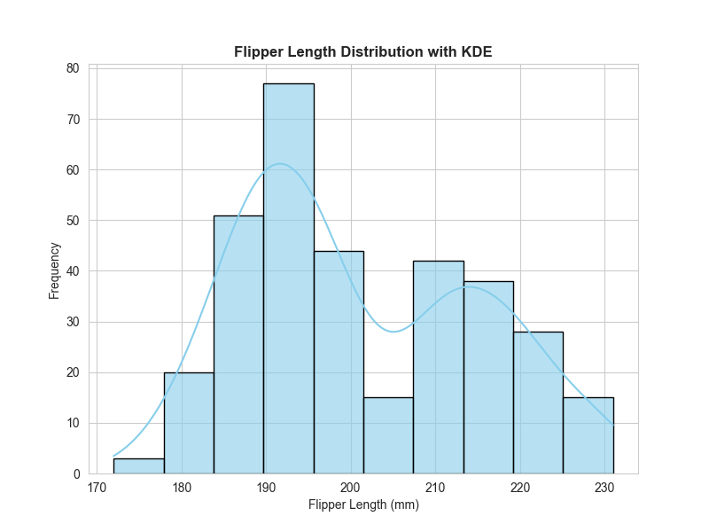
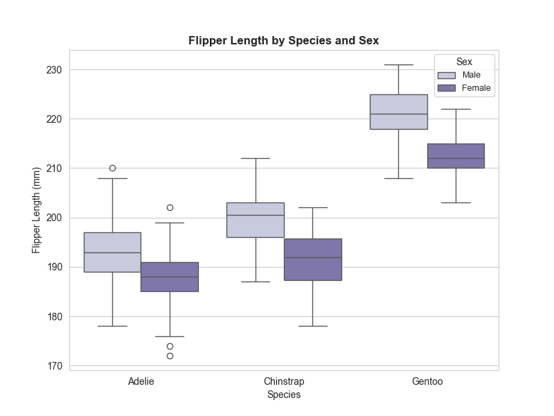
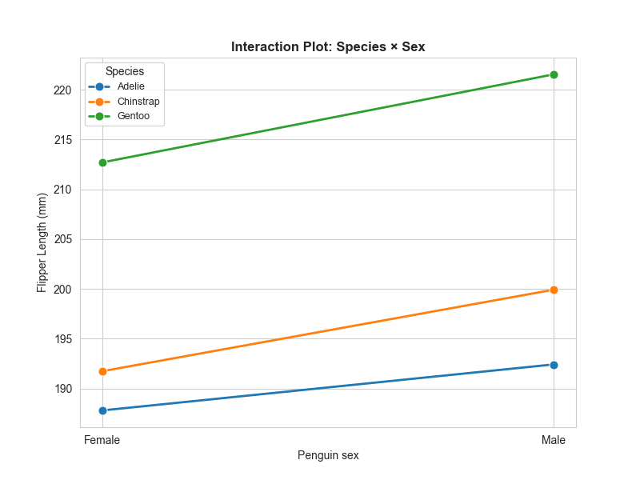
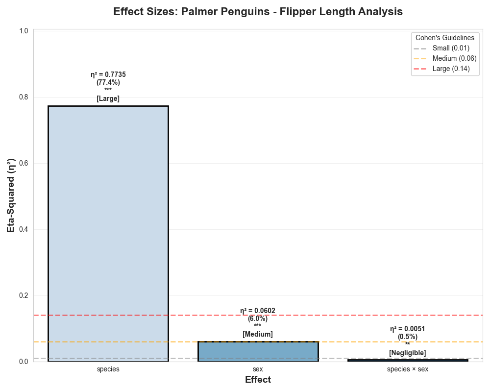

---

layout: default

title: Penguin Flipper Length by species and gender (2-Way ANOVA with Replication)

permalink: /2-way-anova-with-rep/

---

#### This project is in development

## Goals and objectives:

The business objective is understand the impact on species and gender on the flipper length of penguins, and the interaction of the two features (species and gender).  The 2-Way ANOVA with replication technique was applied as there are multiple observations for each combination of species and gender.

## Application:  

2-Way ANOVA with replication is a statistical method used to determine how two categorical independent variables (factors) affect a continuous dependent variable. The "with replication" part is crucial: it means testing multiple subjects or trials for every possible combination of the two factors.

This specific setup allows measurement of the Interaction Effect — whether the effect of one factor depends on the level of the other factor.

This is a powerful tool utilised by many sectors for multiple different reasons and benefits.

* **Manufacturing: Quality Control & Production** Engineers often use this tool to optimise machine settings across different shifts or materials.  
  * For example a car manufacturer tests the tensile strength of a metal part, where two primary factors exist; Machine Temperature (Low vs. High), and Supplier (Company X vs. Company Y).  This test can prevent "hidden" failures. This might find that Company X’s metal works perfectly at low heat, but fails miserably at high heat, whereas Company Y is stable across both. A standard one-way test would miss this interaction.  
* **Retail: Marketing and Consumer Behaviour** Retailers use this to understand how different demographics respond to various promotional strategies.   
  * For example a clothing brand measures Total Sales Volume, analysing the effect of two primary factors; Promotion Type (Discount Code vs. Free Gift), and Region (Urban vs. Rural).  This test can identify hyper-localization. The brand might discover that urban customers respond significantly better to "Free Gifts," while rural customers prefer "Discount Codes." This allows for targeted marketing spend rather than a "one size fits all" approach.  
* **Technology: Software & UX Performance** Technology companies use ANOVA to refine user experiences and optimise backend performance.  
  * For example a software company measures App Load Time, alongside two primary variables; Operating System (iOS vs. Android), and connection Type (4G vs. 5G).    This can determine if the interaction shows that iOS 4G users experience disproportionately high lag compared to all other groups, if so, the engineering team knows exactly where the bottleneck lies, rather than spending time optimising Android.  
* **Finance: Portfolio Management** Financial analysts use ANOVA to see how different market conditions impact various asset classes.  
  * For example an analyst tracks Quarterly Returns, with two features being; Economic Cycle (Recession vs. Growth), and Industry Sector (Tech vs. Healthcare).  This can support risk mitigation, through the identification of "defensive" sectors, as it is possible to statistically prove if a sector stays stable regardless of the economic cycle, while another sector's performance is heavily dependent on growth cycles. 

## Methodology:  

The 2-Way ANOVA with Replication technique was applied using the following method.

Initially the data was analysed to ensure that there is replication of observations for each combination of species and gender

Descriptive statistical analysis of the flipper length observations is undertaken, to better understand the data and detect any issues and outliers.  This includes analysis of the overall dataset, as well as analysis by species and gender.

The data is tested for normality for each combination of gender and species, using the Shapiro-Wilk test, as normality is an assumption of the 2-Way ANOVA with Replication test.

Another assumption of the 2-Way ANOVA with Replication test is the homogeneity of the the variances for each gender and species combination.

ADD MORE DETAIL

## Results and conclusions:

Results from the project related to the business objective.

### Descriptive Statistics:

Summary of the volume of observations for each combination of species and gender.

```
species    gender    count
Adelie     Female    73
           Male      73
Chinstrap  Female    34
           Male      34
Gentoo     Female    58
           Male      61
```
The overall distribution of the flipper lengths is plotted in the histrogram below, including a KDE plot.  The Boxplot shows the distribution of flipper lengths by species and gender, which provides good insight into the data, and highlights that the species and gender are seemingly both factors in the flipper length.  The interaction plot of the mean flipper lengths simplifies the interactions, where the gradients reflect the difference in flipper length between male and female penguins for each species.  The 'steeper' the gradient, the larger the difference.

These charts suggest that for all species the mean flipper length for males is greater than for females, but the difference is not consistent across all species.  This will be further validated using the 2-Way ANOVA with replication tested.







The mean and standard deviation of flipper lengths by species and gender is:

```
ADD
```

### Checking ANOVA assumptions:

An assumption of an ANOVA test is the normality of the values being analysed.  The historgram of the total set of data, as shown above, implies that overall the flipper length observations are not normally distributed, however the test for normality is to be undertaken for each combination of species and gender.

Using the Shapiro-Wilk test on each combination, the results are below.  The null hypothesis of the Shapiro-Wilk test is that the data is normally distributed, and as the p-value is greater than 0.05 for the test of each combination, we cannot reject the null hypothesis and the evidence suggests that the data is normally distributed as required.

```
ADD
```

ADD HOMGENEITY DETAILS




### Conclusions:

Conclusions from the project findings and results.

## Next steps:  

With any analysis it is important to assess how the model and application of the analytical methods can be used and evolved to support the business goals and business decisions and yield tangible benefits.


## Python code:
You can view the full Python script used for the analysis here: 
[View the Python Script](/main.py)
