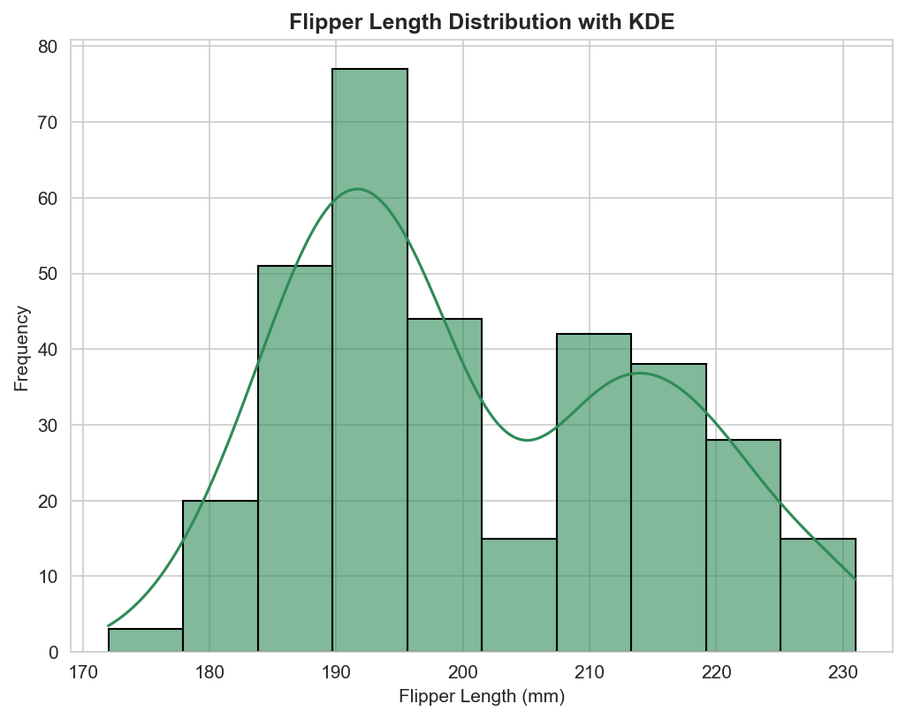
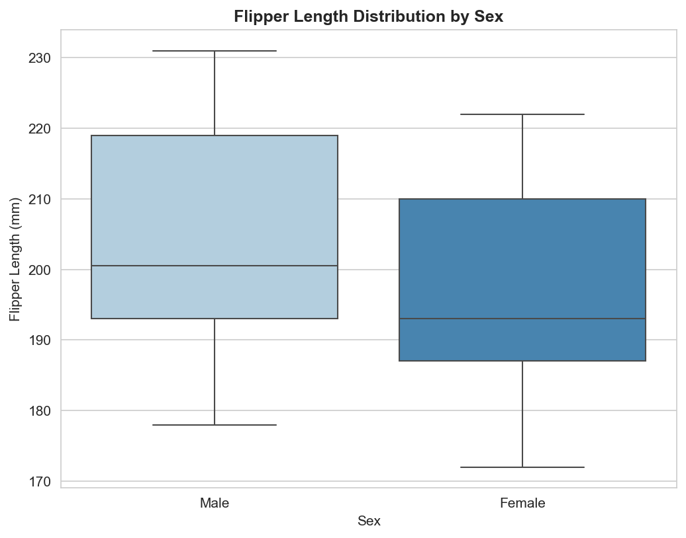
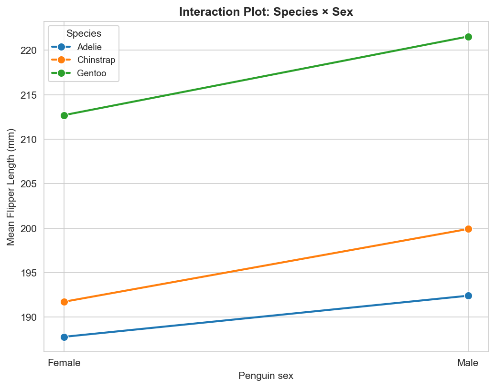
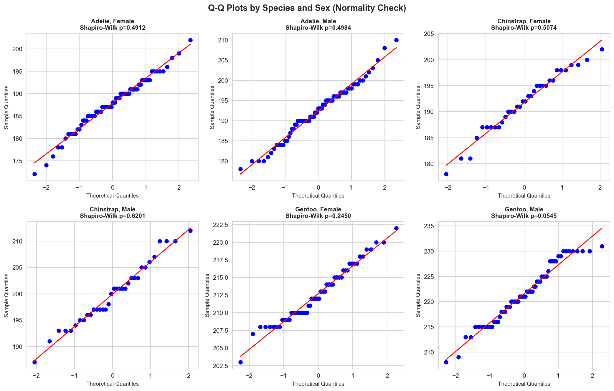
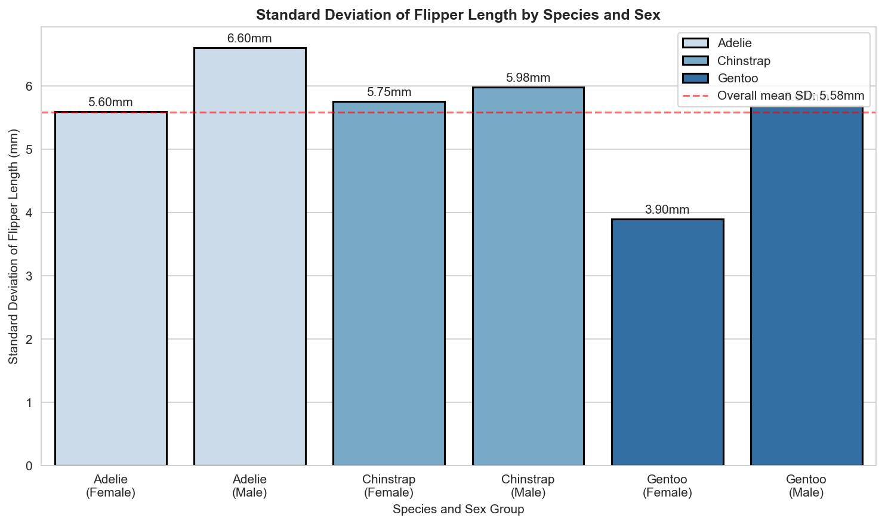
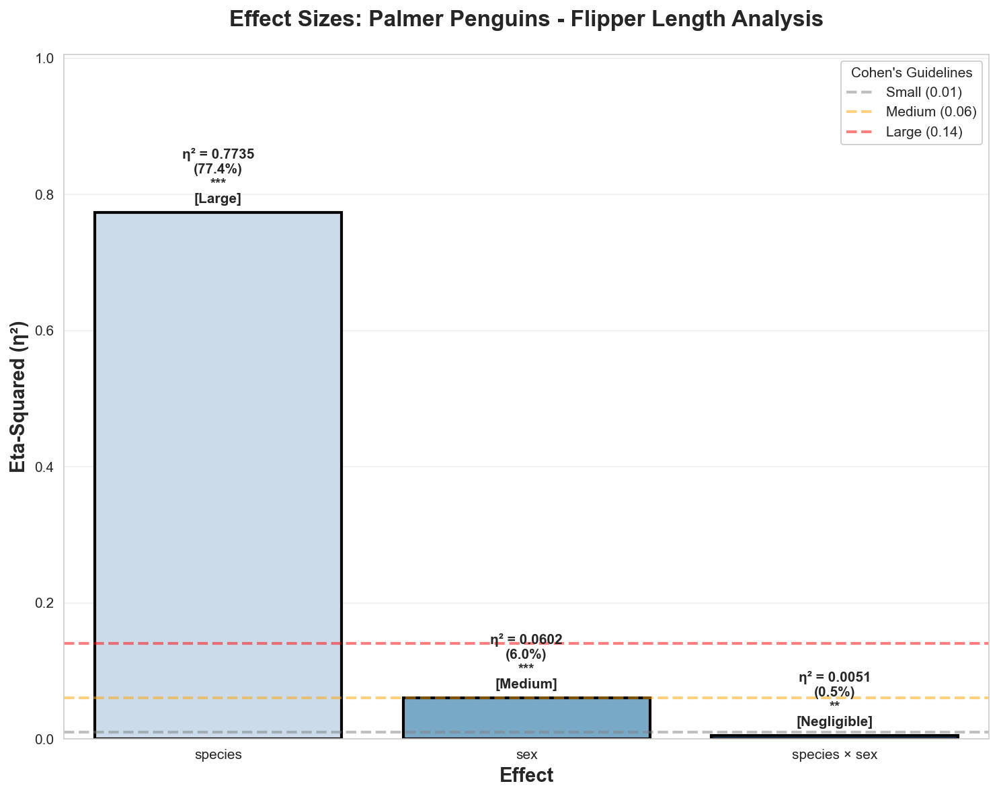
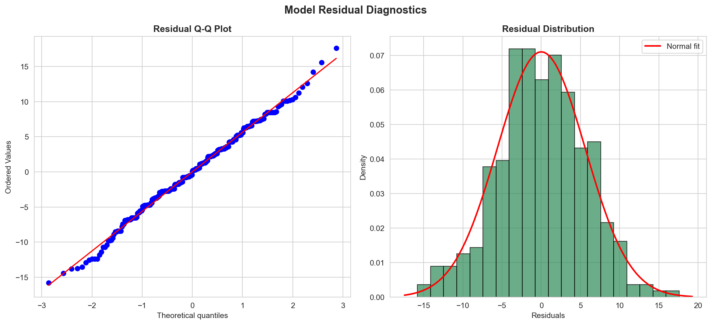
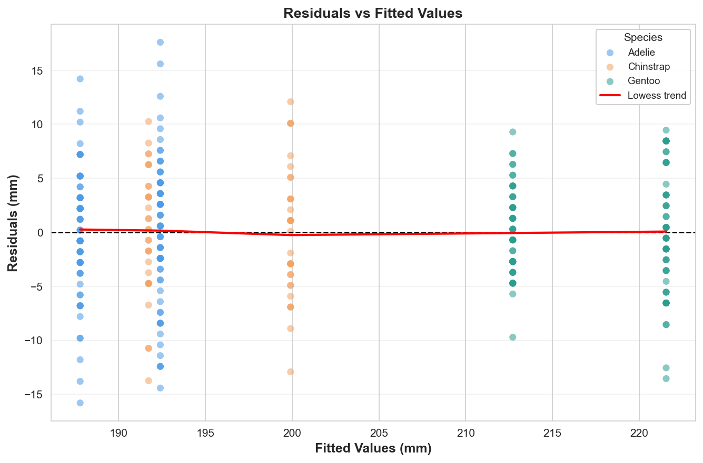
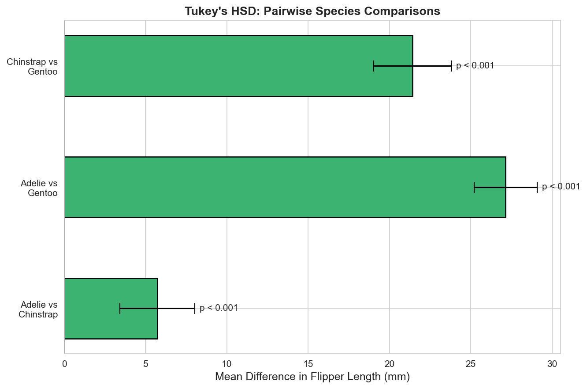
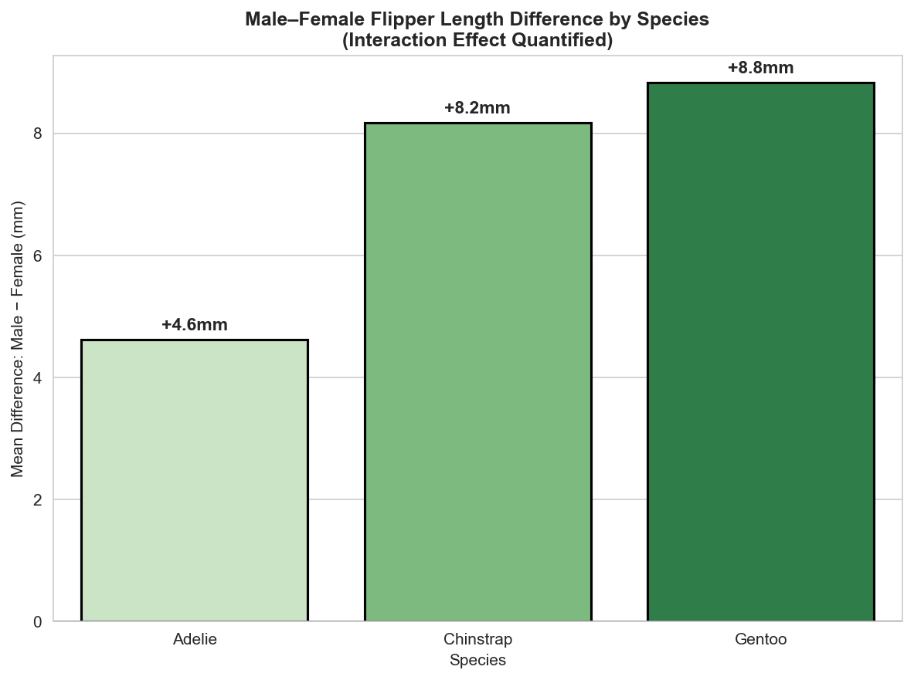

---

layout: default

title: Penguin Flipper Length by species and gender (2-Way ANOVA with Replication)

permalink: /2-way-anova-with-rep/

---

## Goals and objectives:

For this portfolio project, the business scenario concerns the Palmer Penguins dataset — a widely used reference dataset comprising 333 usable observations of three penguin species (Adelie, Chinstrap, and Gentoo) measured at islands in the Palmer Archipelago, Antarctica. The dataset records physical measurements including flipper length, bill dimensions, and body mass, alongside the species and sex of each individual. The objective is to determine whether the mean flipper length of a penguin differs significantly according to its species and sex, and — critically — whether the combination of those two factors produces an interaction effect that cannot be explained by either factor acting independently.

The 2-Way ANOVA with Replication is the appropriate technique for this problem because the analysis involves a single continuous dependent variable (flipper length) being examined across two independent categorical factors (species and sex), and because multiple observations exist for every combination of those factors — the replication condition. This is distinct from a 1-Way ANOVA, which considers only one factor at a time, and from a 2-Way ANOVA without replication, which would apply when only a single observation is available per combination. The "with replication" structure is essential here: it is what enables the test to decompose the total variance into three components — the main effect of species, the main effect of sex, and the interaction of the two — and to test each independently.

A key secondary objective of the analysis is the investigation of the statistical assumptions on which the 2-Way ANOVA depends: normality of the data within each group and homogeneity of variance across groups. These are tested formally and the implications of any violations are assessed, ensuring that the final conclusions are drawn with appropriate rigour rather than applied mechanically. The effect size of each factor is also quantified using Eta-Squared (η²), distinguishing between statistical significance — the probability that an effect exists — and practical significance — the magnitude of that effect. Both dimensions are necessary to form a complete and honest interpretation of the results.

## Application:  

2-Way ANOVA with replication is a statistical method used to determine how two categorical independent variables (factors) affect a continuous dependent variable. The "with replication" part is crucial: it means testing multiple subjects or trials for every possible combination of the two factors.

This specific setup allows measurement of the Interaction Effect — whether the effect of one factor depends on the level of the other factor.

This is a powerful tool utilised by many sectors for multiple different reasons and benefits.

🏭  **Manufacturing:**  

**Quality Control & Production** Engineers often use this tool to optimise machine settings across different shifts or materials.  For example a car manufacturer tests the tensile strength of a metal part, where two primary factors exist; Machine Temperature (Low vs. High), and Supplier (Company X vs. Company Y).  This test can prevent "hidden" failures. This might find that Company X’s metal works perfectly at low heat, but fails miserably at high heat, whereas Company Y is stable across both. A standard one-way test would miss this interaction.  

🛍️ **Retail:**

**Marketing and Consumer Behaviour** Retailers use this to understand how different demographics respond to various promotional strategies.  For example a clothing brand measures Total Sales Volume, analysing the effect of two primary factors; Promotion Type (Discount Code vs. Free Gift), and Region (Urban vs. Rural).  This test can identify hyper-localization. The brand might discover that urban customers respond significantly better to "Free Gifts," while rural customers prefer "Discount Codes." This allows for targeted marketing spend rather than a "one size fits all" approach.  

💻 **Technology:**  

**Software & UX Performance** Technology companies use ANOVA to refine user experiences and optimise backend performance.  For example a software company measures App Load Time, alongside two primary variables; Operating System (iOS vs. Android), and connection Type (4G vs. 5G).    This can determine if the interaction shows that iOS 4G users experience disproportionately high lag compared to all other groups, if so, the engineering team knows exactly where the bottleneck lies, rather than spending time optimising Android.  

🏦 **Finance:**

**Portfolio Management** Financial analysts use ANOVA to see how different market conditions impact various asset classes.  For example an analyst tracks Quarterly Returns, with two features being; Economic Cycle (Recession vs. Growth), and Industry Sector (Tech vs. Healthcare).  This can support risk mitigation, through the identification of "defensive" sectors, as it is possible to statistically prove if a sector stays stable regardless of the economic cycle, while another sector's performance is heavily dependent on growth cycles. 

## Methodology:  

### Data Loading and Preparation

The dataset is the Palmer Penguins dataset, loaded directly via seaborn's load_dataset() function. The raw dataset contains 344 observations, with missing values present across several columns. Rows with missing values in any of the three variables required for the analysis — flipper_length_mm, species, or sex — are removed, yielding 333 usable observations. Only these three columns are retained: flipper_length_mm as the continuous dependent variable, species as a categorical factor with three levels (Adelie, Chinstrap, and Gentoo), and sex as a categorical factor with two levels (Female and Male).

### Replication Check

Before the 2-Way ANOVA with Replication can be applied, it must be confirmed that multiple observations exist for every combination of the two factors — i.e., that n > 1 for each species-sex cell. Without replication, the interaction effect between the two factors cannot be estimated, and a standard 2-Way ANOVA without replication would be required instead. The observation count for each of the six species-sex combinations is verified prior to analysis.

### Exploratory Data Analysis

Four charts are produced to explore the data and develop initial insight ahead of formal testing. A **histogram with KDE overlay** examines the overall distribution of flipper lengths and identifies whether the data appears broadly normal or shows signs of multimodality. A **boxplot by species and sex** provides a direct visual comparison of the distributions across all six groups, highlighting differences in central tendency and spread, and identifying potential outliers. A **standard deviation bar chart** by species-sex group is produced alongside Levene's Test to make the variance differences across groups immediately visible. An **interaction plot** displays the mean flipper length for each sex within each species as a connected line chart; non-parallel lines indicate the presence of an interaction effect, where the influence of one factor depends on the level of the other.

### Assumption Testing

The 2-Way ANOVA with Replication rests on two key distributional assumptions, both of which are tested formally.

**Normality** is assessed using the Shapiro-Wilk test, applied individually to each of the six species-sex groups rather than to the aggregate dataset. This is the correct approach because the ANOVA assumption is that the data within each group is normally distributed; the aggregate distribution is irrelevant and, in a dataset with multiple distinct groups, will typically appear non-normal regardless of whether each group individually satisfies the assumption. A significance threshold of α = 0.05 is applied, and Q-Q plots are produced for each group as a visual complement to the numerical test results.

**Homogeneity of variance** (homoscedasticity) is assessed using Levene's Test, with the null hypothesis that the variances are equal across all six groups. This assumption matters because the F-statistic used in the ANOVA is a ratio of variances; when group variances are unequal, the F-test becomes less reliable and may produce misleading results. Any violation is investigated further to identify which groups are driving the inequality.

**Outlier investigation** is conducted using the IQR method, applied per group, to identify any observations falling more than 1.5 × IQR below Q1 or above Q3. Identified outliers are examined to determine whether they represent data quality issues or plausible natural biological variation, as this distinction informs whether observations should be excluded from the analysis.

### 2-Way ANOVA Test and Effect Sizes

The 2-Way ANOVA is fitted using Ordinary Least Squares (OLS) via statsmodels, specifying the full model including both main effects and their interaction term. Type II Sum of Squares is used, which is the appropriate choice when the group sizes are unequal — as is the case here, with cell counts ranging from 34 to 73. Type II SS tests each effect after accounting for all other effects of equal or lower order, without assuming a hierarchical structure, making it more appropriate than Type I SS (which is order-dependent) for an unbalanced design.

The p-value associated with each effect determines whether the null hypothesis — that the factor has no impact on flipper length — can be rejected. Effect sizes are quantified using Eta-Squared (η²), which expresses each factor's Sum of Squares as a proportion of the total Sum of Squares. This distinguishes statistical significance (whether an effect is real) from practical significance (how large that effect is). Cohen's guidelines are applied to interpret the magnitude: η² < 0.01 is negligible, 0.01–0.06 is small, 0.06–0.14 is medium, and ≥ 0.14 is large.

### Post-Hoc Analysis

A significant F-statistic for the species main effect confirms that at least one pair of species means differs, but does not identify which pairs. Tukey's Honest Significant Difference (HSD) test is applied to conduct all pairwise species comparisons while controlling the family-wise error rate at α = 0.05, ensuring that the probability of at least one false positive across the three comparisons remains within the specified threshold.

### Interaction Effect Quantification

To give concrete meaning to the statistically significant interaction term, the male-female mean flipper length difference is calculated for each species separately. This directly quantifies the degree to which sexual dimorphism in flipper length varies across species — the biological interpretation of the interaction effect identified by the ANOVA.

### Residual Analysis

Following the ANOVA, a diagnostic check is conducted on the model residuals to validate that the normality assumption is satisfied at the model level — the technically correct form of the assumption, as distinct from the group-level normality checks applied to the raw data prior to testing. The Shapiro-Wilk test is applied to the residuals, and a Q-Q plot and residual distribution histogram are produced to provide visual confirmation. A residuals versus fitted values plot is also examined to assess whether the residual spread is consistent across the range of predicted values, providing a complementary visual check on homoscedasticity in the model itself.

## Results:

### Descriptive Statistics:

Summary of the volume of observations for each combination of species and gender.

```
species    gender    count
Adelie     Female    73
           Male      73
Chinstrap  Female    34
           Male      34
Gentoo     Female    58
           Male      61
```
The overall distribution of the flipper lengths is plotted in the histogram below, including a KDE plot.  The Boxplot shows the distribution of flipper lengths by species and gender, which provides good insight into the data, and highlights that the species and gender are seemingly both factors in the flipper length.  The interaction plot of the mean flipper lengths simplifies the interactions, where the gradients reflect the difference in flipper length between male and female penguins for each species.  The 'steeper' the gradient, the larger the difference.

These charts suggest that for all species the mean flipper length for males is greater than for females, but the difference is not consistent across all species.  This will be further validated using the 2-Way ANOVA with replication test.







The summary descriptive statistics of flipper lengths by species and gender is:

```
                  count    mean   std    min    max
species   gender                                      
Adelie    Female     73  187.79  5.60  172.0  202.0
          Male       73  192.41  6.60  178.0  210.0
Chinstrap Female     34  191.74  5.75  178.0  202.0
          Male       34  199.91  5.98  187.0  212.0
Gentoo    Female     58  212.71  3.90  203.0  222.0
          Male       61  221.54  5.67  208.0  231.0
```

### Checking ANOVA assumptions:

An assumption of an ANOVA test is the normality of the values being analysed.  The histogram of the total set of data, as shown above, implies that overall the flipper length observations are not normally distributed, however the test for normality is to be undertaken for each combination of species and gender.

Using the Shapiro-Wilk test on each combination, the results are below.  The null hypothesis of the Shapiro-Wilk test is that the data is normally distributed, and as the p-value is greater than 0.05 for the test of each combination, we cannot reject the null hypothesis and the evidence suggests that the data is normally distributed as required.  It is noted that the p-value for 'Gentoo, Male' - while being greater than 0.05 - is borderline with a p-vale = 0.0545.

```
Adelie, Female:		p=0.4912 Normal
Adelie, Male: 		p=0.4984 Normal
Chinstrap, Female: 	p=0.5074 Normal
Chinstrap, Male: 	p=0.6201 Normal
Gentoo, Female: 	p=0.2450 Normal
Gentoo, Male: 		p=0.0545 Normal
```

The Q-Q plots below provide a visual complement to the Shapiro-Wilk results for each of the six species-sex combinations. Points lying close to the diagonal reference line indicate data consistent with a normal distribution. All groups show broadly linear alignment, confirming the Shapiro-Wilk results. The Gentoo Male group, which returned the lowest Shapiro-Wilk p-value (0.0545), shows a modest departure in the upper tail, but not sufficient to constitute a meaningful violation of the normality assumption.



Another assumption of an ANOVA test is of equal variances across the groups (i.e. the combinations of gender and species).

Levene's Test was applied, with the null hypothesis that the variances are equal.  Setting the confidence level equal to 0.05, the p-value of Levene's Test was calculated as 0.0365, which means that we reject the null hypothesis, and that there is evidence that the variances assumption may not be true.  As such it means the "spread" or dispersion of the data is not consistent across the different combinations of the two factors.

To understand which groups are driving the unequal variances identified by Levene's Test, the standard deviation of flipper length was calculated for each of the six species-sex combinations and plotted below. The chart confirms that the Adelie Male group carries the highest standard deviation (6.60mm) compared to the Gentoo Female group at the other extreme (3.90mm). This variance gap between groups, particularly the spread in the Adelie observations, is the primary driver of the Levene's Test result.



As the 2-Way ANOVA uses the F-statistic, which is a ratio of variances, when the underlying group variances are not equal, the F-test becomes less "robust".  This results in the 2-Way ANOVA potentially providing misleading results.  It is noted that the group sizes for each combination of factors, is not consistent, ranging from 34 to 73.  This can potentially lead to misleading ANOVA results.

Referring back to the boxplots, these highlight that there are multiple outliers associated to the 'Adelie' penguin species observations, which could potentially be causing the unequal variances.  These outliers are investigated further.

Outliers in the Adelie group were identified using the IQR (Interquartile Range) method - defined as any observation more than 1.5 × IQR below Q1 or above Q3. 4 outlier observations were identified across the Adelie Female and Male groups. Review of these observations confirms they are plausible biological measurements within the known range for the Adelie species — they are not data entry errors or instrument artefacts. As such, no observations are removed from the analysis, and the outliers are interpreted as natural biological variation at the tails of the flipper length distribution within this species. Their presence contributes to the elevated standard deviation in the Adelie groups and, by extension, to the Levene's Test result discussed above.

### 2-Way ANOVA Test Results

The test produced an R² = 0.84, i.e. ~84% of the variances in flipper length values can be explained by the two factors and the interaction of the 2 factors.

The p-value associated with each factor, including the interaction, determines if the each factor has a significant effect.  I.e. the null hypothesis is that the factor does not have an impact.  The p-value for each factor (species and gender) are of the order 10^-125 and 10^-24 respectively, and the p-value for the interaction is 0.0063, therefore we can say that there is evidence that each factor as well as the interaction of the factors are significant effects in the length of penguin flippers.

Given that there is evidence that the factors have an effect, the size of the effect of each was calculated using the Eta-Squared values.  The table and chart below show the results of this which effectively state that the species accounts for ~77.4% of the variance, and the gender ~6% of the variance.  While the interaction effect is statistically significant, the size of the effect is 0.5%.  It is important to note that a factor being significant and the size of the effect are different factors, and just because the interaction effect is negligible, it does not mean that it is not statistically significant. Cohen's guidelines provide an interpretation of these sizes which are shown in the chart.  For completeness, the residuals represent ~16% of the variance, which can be interpreted as 16% of the variance is statistical randomness than the factors cannot explain - remembering that the R² of the model was 0.8396, so we had already seen that the model accounted for ~84% of the variance.

```
ANOVA Table with Eta-Squared:
                 Sum_Squares   df  F-Value     P-value  eta_squared
C(species)         50185.027    2  784.583  1.570e-125        0.774
C(sex)              3905.604    1  122.119   2.461e-24        0.060
C(species):C(sex)    329.042    2    5.144   6.314e-03        0.005
Residual           10458.107  327      NaN         NaN        0.161
```



### Residual Analysis

A residual analysis is conducted to validate the model's assumptions at the model level, which is the technically correct form of the ANOVA assumptions. The ANOVA does not strictly require the raw data to be normally distributed or homoscedastic; it requires the model residuals to satisfy these properties. The residual diagnostics below are therefore the definitive check, distinct from the Shapiro-Wilk and Levene's tests applied to the raw group data in the Assumptions section above.

**Normality of Residuals**  
The Q-Q plot and residual distribution histogram below confirm that the model residuals are normally distributed. The Q-Q plot shows close alignment with the theoretical normal line across the central range, with only minor departures in the extreme tails — a pattern that is typical and acceptable in real-world data. The histogram shows a broadly symmetric, bell-shaped distribution centred on zero. This is confirmed numerically by the Shapiro-Wilk test applied to the residuals, which returns p = 0.4480, providing no grounds to reject the null hypothesis of normality. The normality assumption is therefore satisfied at the model level.



**Homoscedasticity of Residuals**  
The residuals versus fitted values plot provides a visual check of homoscedasticity in the model residuals — whether the residual spread is consistent across the range of predicted flipper lengths. In an ideal model, points would be scattered evenly above and below the zero reference line across all fitted values, with no systematic fanning or clustering. The Lowess trend line assists in identifying any non-random pattern.



Because the fitted values in this model correspond to the six group means, the plot naturally produces three pairs of vertical clusters — one pair per species. The Adelie clusters (fitted values approximately 188–192mm) show visibly wider residual spread than the Gentoo clusters (fitted values approximately 213–222mm), with the Chinstrap clusters (approximately 192–200mm) intermediate. This pattern is consistent with the Levene's Test result reported above (p = 0.037): the unequal raw group variances identified by Levene's Test are carried through into the model residuals and are visible here as greater vertical scatter at lower fitted values. The Lowess trend line remains close to zero across the range, confirming there is no systematic bias or curvature in the model — the residuals are not trending in any direction — but the widening spread from right to left reflects the same heteroscedasticity already identified.

This corroborates the caveat stated in the Conclusions: the F-statistics should be interpreted with a degree of caution due to the mild violation of the equal variance assumption, driven principally by the higher within-group variability in the Adelie observations.

### Post-Hoc Analysis: Tukey's HSD

The 2-Way ANOVA confirms that species has a statistically significant effect on flipper length, but a significant F-statistic only confirms that at least one pair of group means differs — it does not identify which pairs. Tukey's HSD post-hoc test was applied to determine which species pairs differ significantly from one another, controlling the family-wise error rate at α = 0.05.

```
   group1    group2  meandiff p-adj   lower   upper  reject
   Adelie Chinstrap   5.7208   0.0   3.4144  8.0272    True
   Adelie    Gentoo  27.1326   0.0  25.1924 29.0727    True
Chinstrap    Gentoo  21.4118   0.0  19.0236 23.7999    True
```

The results confirm that all three species pairs are significantly different from one another (p < 0.05 for all comparisons after correction), meaning it is not the case that a single outlier species is driving the overall species effect. Each species occupies a genuinely distinct position in the flipper length distribution. This is consistent with the descriptive statistics, which show mean flipper lengths of Adelie: 190.1mm, Chinstrap: 195.8mm, and Gentoo: 217.2mm.



### Interaction Effect by Species

Although the interaction effect accounts for only 0.5% of the total variance (a statistically significant but practically small effect), the interaction plot reveals a biologically meaningful pattern. The gender gap in flipper length is approximately 4.6mm for Adelie penguins, compared to 8.2mm for Chinstrap and 8.8mm for Gentoo. In other words, sexual dimorphism in flipper length is notably less pronounced in Adelie penguins than in the other two species. This is the interaction the ANOVA detects: the effect of sex on flipper length is not uniform across species. The practical implication is that, while sex is a significant predictor of flipper length across all species, its magnitude as a predictor is more reliable for Chinstrap and Gentoo individuals than for Adelie.

The results of the gender gap by species analysis is shown below:

```
Species       Female Mean  Male Mean  Difference (mm)
Adelie        187.79       192.41     +4.62
Chinstrap     191.74       199.91     +8.17
Gentoo        212.71       221.54     +8.83
```



## Conclusions:

The two-way ANOVA with replication provides strong statistical evidence that both species and sex, and the interaction of the two, are significant determinants of penguin flipper length. The combined model accounts for approximately 84% of the total variance in flipper length (R² = 0.84), indicating that species and sex together are highly informative predictors of this measurement.
Species is the dominant factor, accounting for approximately 77% of the total variance in flipper length — a large effect by Cohen's guidelines. The Tukey HSD post-hoc results confirm that all three species pairs (Adelie vs. Chinstrap, Adelie vs. Gentoo, and Chinstrap vs. Gentoo) differ significantly from one another, meaning that no single species is an outlier driving the effect; all three occupy genuinely distinct positions in the flipper length distribution. Gentoo penguins carry the longest flippers by a considerable margin (~21mm above Chinstrap, ~27mm above Adelie on average), reflecting the Gentoo's status as the largest of the three species.

Sex accounts for approximately 6% of total variance — a medium effect — with male penguins carrying longer flippers across all three species. This is a consistent and biologically expected finding related to sexual dimorphism. However, the interaction effect, while statistically significant (p = 0.006), reveals that the magnitude of this sexual dimorphism is not uniform: the male-female flipper length gap is notably smaller in Adelie penguins (~4.6mm) than in Chinstrap (~8.2mm) or Gentoo (~8.8mm) individuals.

One important caveat must be carried through to any application of these findings. Levene's Test identified statistically significant heterogeneity of variance across the six species-sex groups (p = 0.037), which means the equal variance assumption of the 2-Way ANOVA is technically violated. The groups most responsible for this violation are the Adelie groups, which carry higher within-group spread than the other species. The F-statistics reported are therefore to be interpreted with a degree of caution, though it is noted that all effects remain highly significant by substantial margins, and that the violation is relatively mild — the ANOVA is generally considered robust to modest heteroscedasticity, particularly when no group has a variance more than four times that of another.

From a biological and ecological perspective, the findings support the well-established morphological differences between these penguin species and provide a statistically rigorous quantification of the role species and sex each play in determining a key physical measurement. Species membership alone accounts for the vast majority of the explainable variance — a finding that is consistent with the significant morphological divergence between the Gentoo and the two smaller species.

## Next steps:  

With any analysis it is important to assess how the model and application of the analytical methods can be used and evolved to support the business goals and business decisions and yield tangible benefits.

Recommendations and next steps for improving the analysis include:

* Improved observation data:
  * Collecting more observations and use this additional data to re-run the analysis
* Addressing the unequal variances:
  * The ANOVA test can be robust even when variances are unequal, if the group sizes are equal or have minimal differences.  As such it is suggested to collect more data to enable the use of equal group sizes.
  * Understand the variances of each group in more detail to identify if which are the outliers and if there are any patterns to explain this.  In effect this is identifying the factor (species or gender) with the highest variance.
  * Investigate the use of a transformation on the flipper length measurements (e.g. log, or square root), to see if this stabilises the variances, and if so applying the 2-Way ANOVA to the transformed data.
  * Apply a version of ANOVA that does not assume equal variances, such as Welch's ANOVA, and interpret the results
* Expand the analysis:
  * Consider the expansion of the research to collect additional factors, or measurements, and undertake analysis of the effect of factors on other measurements (e.g. body mass, bill length etc.)
  * Expand the analysis to include more species of penguins
  * Perform analysis on blocks of data, for example in the penguin data a block could be a specific location, to determine if these are causing variance, and if there are additional factors that are impacting the measurements.
* Post-hoc testing across all factor combinations:
  * While Tukey's HSD post-hoc has been applied to the species main effect, the same pairwise testing could be extended to all six species-sex combinations to identify exactly which cell means differ from one another. This would provide a more granular understanding of where the interaction effect manifests — for example, whether Adelie Male and Chinstrap Female flipper lengths are statistically distinguishable despite being drawn from different species and different sexes.

## Python code:
You can view the full Python script used for the analysis here: 
[View the Python Script](/ANOVA_2-way_withRep_penguins_v2.py)
