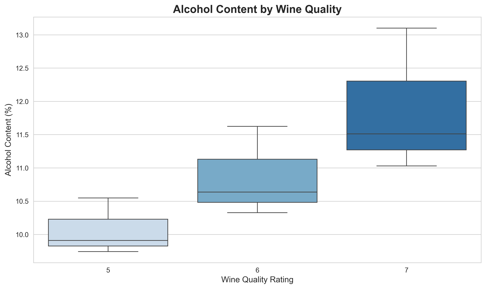
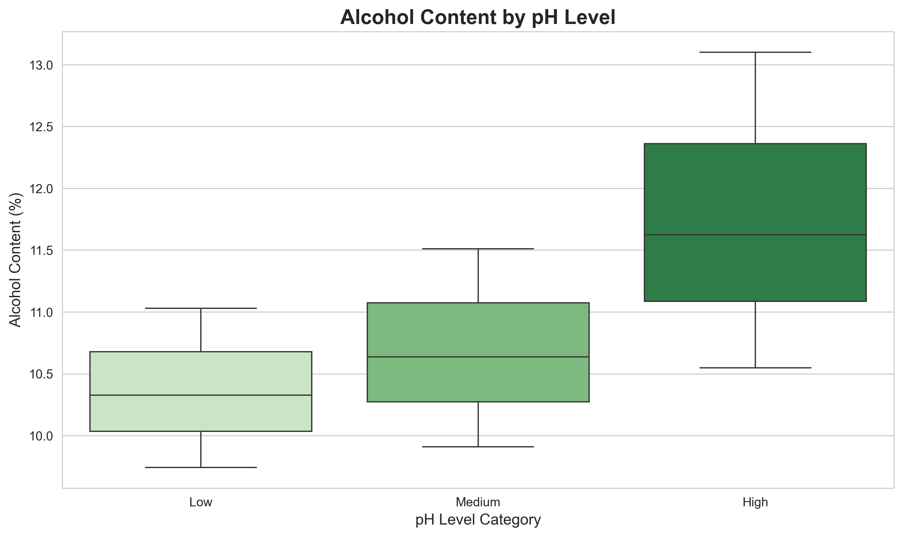
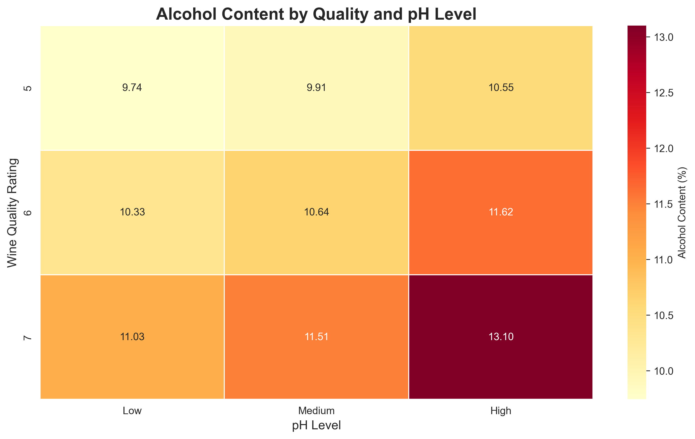
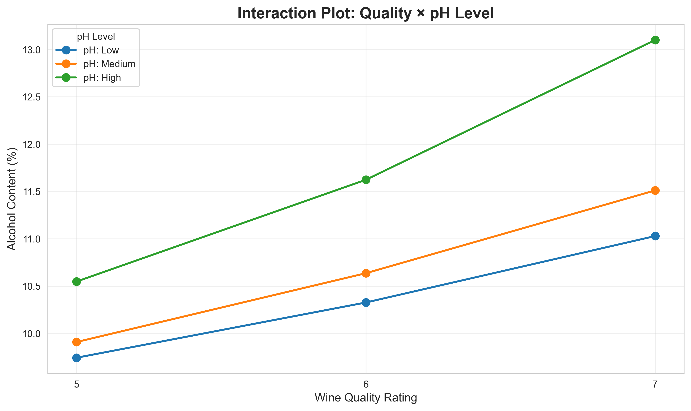
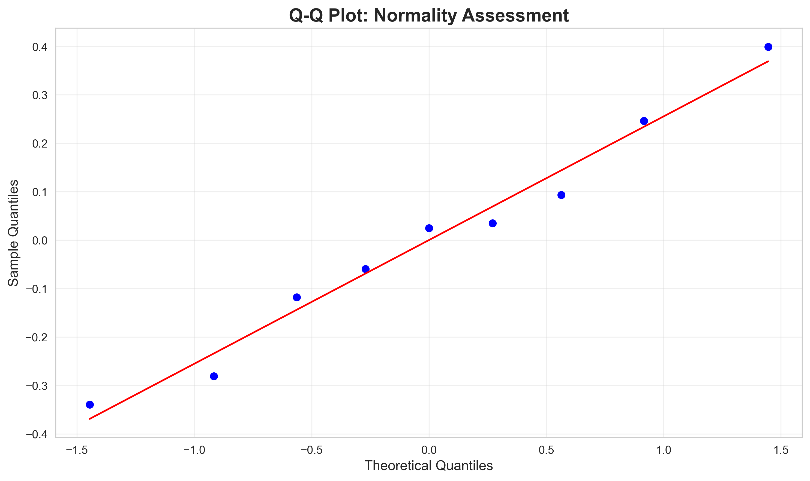
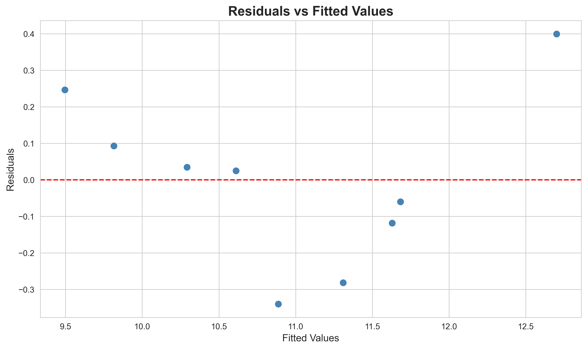

---

layout: default

title: Wine quality and alcohol content (Two-Way ANOVA without Replication)

permalink: /2-way-anova-without-rep/

---

## Goals and objectives:

For this portfolio project, the business scenario concerns the red wine industry, where understanding the chemical determinants of wine quality has direct implications for product development, production process design, and new product strategy. The dataset used is the UCI Wine Quality (Red) dataset, comprising 1,599 observations of red wine each described by eleven physicochemical measurements alongside a sensory quality rating. The objective is to determine whether two specific factors — wine quality rating (levels 5, 6, and 7) and pH category (Low, Medium, and High) — have a statistically significant effect on alcohol content, where only a single measurement of alcohol content exists for each combination of quality and pH level.

That last condition — one observation per cell — defines the analytical framework. The Two-Way ANOVA without replication is the appropriate technique precisely because the data structure provides no repeated measurements within any factor combination. In a standard Two-Way ANOVA with replication, multiple observations per cell allow the model to separately estimate an interaction effect between the two factors alongside their individual main effects. Without replication, that separation is not possible: the residual variance and any potential interaction variance are indistinguishable, and the model must assume they are the same thing. This is the additivity assumption — the requirement that the two factors act independently and additively on the outcome, with no interaction between them — and it is the central design-specific assumption that governs whether the no-replication framework is valid for a given dataset.

The test is therefore used here in the way it is most commonly justified in practice: where resource or experimental constraints mean that only one observation per condition is available, and where the additivity assumption can be reasonably defended. Given those constraints, the Two-Way ANOVA without replication offers an efficient and statistically principled method of assessing two main effects simultaneously, with greater power than two separate one-way ANOVAs because blocking on one factor reduces the unexplained variance available to the other.

The analysis produces F-statistics and p-values for each main effect, an overall model R-squared, and effect size estimates expressed as eta-squared (η²), each of which contributes a different dimension of understanding to the central question. The F-statistics assess whether the observed group mean differences are larger than would be expected from sampling variation alone. The p-values quantify the strength of evidence against the null hypothesis that each factor has no effect. The R-squared summarises how much of the total variance in alcohol content the two factors jointly explain. And η² places each factor's contribution in context, distinguishing between effects that are statistically significant and those that are also practically meaningful.

A secondary objective runs throughout the analysis: to demonstrate the importance of assumption validation before placing confidence in any ANOVA result. As well as the standard assumptions of normality and homogeneity of variance — assessed via the Shapiro-Wilk test applied to model residuals and Levene's test respectively — the additivity assumption receives specific attention, assessed visually through the interaction plot. The residual diagnostics produced after model fitting provide a further check on whether the model's assumptions hold across the range of fitted values.

By the end of the analysis, the project demonstrates the correct application of the Two-Way ANOVA without replication framework — including its design rationale, its critical assumptions, and the appropriate interpretation of its outputs — and provides statistical evidence that both wine quality rating and pH level have a significant and large-effect relationship with alcohol content, with the two factors together explaining approximately 95% of the variance in alcohol content across the nine factor combinations examined.

## Application:  

The Two-Way ANOVA Without Replication (also known as a Randomized Block Design or a two-factor ANOVA with one observation per cell) is a statistical test used to assess the main effects of two categorical factors on a single continuous dependent variable, while assuming there is no interaction between the two factors.  This design is often used when one factor is a "nuisance factor" or a blocking variable that is included primarily to account for variability, thus increasing the power of the test for the other factor.

🏭  Used in **manufacturing** where resources (materials, machines, time) are limited, and one observation per condition is practical for quality audits.  

💻  In **IT** development, it's used to efficiently evaluate the main performance effects of two variables (e.g. software versions and server regions).

🛍️  **Retail** often uses this to compare key performance indicators (KPIs) across stores or channels, e.g. sales based on factors of store locations and promotional offers. 

🏦  In **finance**, it's used for comparative analysis where confounding variables need to be controlled (e.g. investment strategies and time periods).  


## Methodology:  

A workflow in Python was developed using the libraries SciPy, statsmodels, scikit-learn, pandas, and NumPy, with Matplotlib and Seaborn used for visualisations. The pipeline progresses from data loading and validation through experimental design, assumption testing, model fitting, and interpretation. Each stage is described below.

### Data Loading and Validation:

The dataset is sourced from the UCI Wine Quality (Red) dataset via scikit-learn's fetch_openml() function. The raw dataset contains 1,599 observations of red wine, each described by eleven physicochemical measurements — including alcohol content, pH, volatile acidity, sulphates, and density — alongside a sensory quality rating assigned by expert panels on an integer scale of three to eight.

A structured data validation audit is conducted prior to any analysis. This confirms that no missing values are present across any of the eleven feature columns or the quality target, verifies that all columns carry expected numeric data types, and checks for duplicate records. The raw distribution of quality scores is also inspected at this stage, confirming that scores 5, 6, and 7 account for the large majority of observations — providing the empirical justification for the quality filtering step that follows.

Data preparation proceeds in four tracked stages. First, the three variables relevant to the analysis are selected: alcohol content (the dependent variable), quality rating (Factor 1), and pH (Factor 2). Second, pH values are discretised into three equal-width bands — Low, Medium, and High — using pd.cut(), with the resulting band boundaries printed to confirm the numerical pH ranges assigned to each label. Third, the dataset is filtered to retain only quality ratings of 5, 6, and 7, producing the balanced factorial structure required by the design. Fourth, alcohol content is averaged within each quality-pH combination using a grouped mean, yielding nine unique cells — one observation per factor combination — as required by the no-replication design. Sample sizes at each stage are reported in the console output to provide a transparent audit trail from the raw dataset to the final nine-cell table.

### Experimental Design:

The Two-Way ANOVA without replication analyses a factorial design in which each combination of factor levels is represented by exactly one observation. In this analysis the design is a 3×3 table — three quality levels (5, 6, 7) crossed with three pH categories (Low, Medium, High) — producing nine cells, each containing the mean alcohol content of all raw wine observations that fall within that quality-pH combination.

This design structure has a fundamental analytical consequence that distinguishes it from the standard Two-Way ANOVA with replication. When multiple observations exist per cell, the model can partition the total variance into three components: the main effect of Factor 1, the main effect of Factor 2, and their interaction. With only one observation per cell, the interaction and the residual error are statistically inseparable. The model therefore has no degrees of freedom available to estimate an interaction term, and the residual mean square — which serves as the denominator of both F-statistics — absorbs any interaction variance that may be present in the data. This is not a flaw of the model but a defining property of the no-replication design: it is efficient and appropriate when the two factors can be assumed to act independently and additively, and when the resource or data constraints of the problem preclude replication.

The central design-specific assumption that follows from this structure is the **additivity assumption**: that the effect of quality on alcohol content does not vary depending on pH level, and conversely that the effect of pH does not vary across quality ratings. If this assumption holds, the residual mean square is a valid estimate of random error and the F-tests are reliable. If it does not hold — if a genuine interaction exists — the F-statistics will be inflated and the test results may not be trustworthy. For this reason, the additivity assumption receives dedicated attention in the assumption testing stage below and is assessed visually via the interaction plot in the Results section.

### Assumption Testing:

Four assumptions underpin the validity of the Two-Way ANOVA without replication. Each is addressed in turn.

**Independence of observations** is assumed by design. The nine cells in the analysis represent distinct combinations of quality rating and pH category, and the averaging step used to construct each cell value consolidates multiple independent raw wine measurements. There is no pairing or repeated-measurement structure that would violate independence.

**Additivity** is the assumption that the two factors act independently on alcohol content, with no interaction between them. As discussed in the Experimental Design section above, this assumption is non-negotiable in the no-replication framework: the model is structurally unable to estimate an interaction, so its presence in the data would go undetected and would corrupt the test results. The interaction plot produced in the Results section provides the primary visual assessment of this assumption. Parallel lines on the interaction plot — indicating that the effect of pH on alcohol content is consistent across quality levels — support the additivity assumption. A formal test of additivity (Tukey's one-degree-of-freedom test for non-additivity) is not conducted in this analysis; this is discussed in the Next Steps section.

**Normality of residuals** is assessed using the Shapiro-Wilk test and a Q-Q plot, both applied to the residuals of the fitted model rather than to the raw alcohol values. This distinction is important: the normality assumption in ANOVA pertains specifically to the model residuals — the differences between observed and fitted values — and not to the marginal distribution of the dependent variable. Both diagnostics are produced after the model is fitted, forming part of a post-fit residual inspection stage. A caveat applies throughout: with only nine observations in the 3×3 design, the model has four residual degrees of freedom, meaning the Shapiro-Wilk test has very limited power to detect departures from normality, and the Q-Q plot contains too few points for reliable visual assessment. Both diagnostics are retained for methodological completeness, but their results should be interpreted as indicative rather than conclusive at this sample size.

**Homogeneity of variance (homoscedasticity)** is assessed using Levene's test, applied separately to the quality and pH level groupings. The same small-sample caveat applies here with particular force: after grouping by either factor, each group contains only three observations — one per level of the other factor. Levene's test with n = 3 per group has near-zero power to detect genuine variance differences; the test will return a high p-value in almost all circumstances regardless of the true variance structure. The test is retained for methodological completeness and consistency with the broader portfolio, but its results should not be taken as substantive evidence of homoscedasticity. The assumption is instead defended primarily on the basis of the experimental design and the averaging step used to construct the cell values, which naturally reduces the within-group variance by aggregating multiple raw observations. A residuals vs fitted values plot, produced as part of the post-fit diagnostics, provides a complementary visual check on whether the residual spread is approximately uniform across the range of fitted values.

### Statistical Analysis:

The Two-Way ANOVA without replication model is fitted using the ordinary least squares (OLS) framework provided by statsmodels, specified as Alcohol ~ C(Quality) + C(pH_Level). The model includes main effects for both factors with no interaction term, consistent with the no-replication design. The ANOVA table is generated using anova_lm() with Type II sums of squares, which partitions variance by assessing the contribution of each factor after accounting for the other — the appropriate choice when the factors are balanced and no interaction is included in the model.

Following model fitting, a post-fit residual diagnostic stage is conducted. The Shapiro-Wilk test and Q-Q plot assess the normality of model residuals, and a residuals vs fitted values plot checks for systematic patterns in the residuals that would indicate either heteroscedasticity or an unmodelled interaction structure. These diagnostics complement the pre-fit Levene's test and interaction plot assessment, providing a fuller picture of model adequacy.

Statistical results are reported for each main effect individually: the F-statistic, p-value, and degrees of freedom, evaluated against a significance threshold of α = 0.05. The overall model is summarised by its R-squared, adjusted R-squared, overall F-statistic, and overall p-value, providing a measure of total explanatory power. Effect sizes are calculated as eta-squared (η²) for each factor, defined as the ratio of the factor's sum of squares to the total sum of squares. η² is interpreted using Cohen's (1988) conventional benchmarks: values below 0.01 indicate a small effect, values from 0.01 to 0.06 a medium effect, and values above 0.06 a large effect. η² provides the practical complement to the p-value, quantifying what proportion of the total variance in alcohol content is attributable to each factor — an important distinction given the small degrees of freedom available in this design, where large R-squared values can arise partly as an artefact of the limited number of cells rather than as evidence of a genuinely strong relationship in the underlying population.

## Results:

### Data Validation:

A data validation audit was conducted on the raw dataset prior to any analysis. The key findings are summarised below:

RAW DATASET SHAPE:       1,599 observations × 12 columns (11 features + quality target)  
MISSING VALUES:          0 across all columns — no imputation required  
DUPLICATE RECORDS:       0 — all observations are unique  

RAW QUALITY SCORE DISTRIBUTION:  
* Quality 3:    10 observations  
* Quality 4:    53 observations  
* Quality 5:   681 observations  
* Quality 6:   638 observations  
* Quality 7:   199 observations  
* Quality 8:    18 observations  

The distribution confirms that quality ratings 5, 6, and 7 account for 1,518 of the 1,599 raw observations — approximately 95% of the dataset — and represent the most densely populated and comparably sized groups. Filtering to these three ratings retains the large majority of the data while producing the balanced factorial structure required by the design.

The data preparation pipeline reduced the dataset in four stages:

Stage 1 — Column selection (alcohol, quality, pH):  1,599 observations retained (100%)  
Stage 2 — pH discretised into 3 equal-width bands:  Low / Medium / High applied to all rows  
Stage 3 — Filter to quality ratings 5, 6, and 7:    1,518 observations retained (94.9%)  
Stage 4 — Group by quality × pH, take mean:         9 cells (one observation per combination)  

The pH band boundaries produced by pd.cut() are printed in the console output and should be noted when interpreting the analysis: the three labels Low, Medium, and High correspond to specific numerical pH ranges derived from the equal-width binning of the observed pH distribution across the 1,518 filtered observations. The final nine-cell table — one averaged alcohol value per quality-pH combination — forms the complete dataset for all subsequent analysis.

### Descriptive statistics:  

The nine-cell dataset used for the Two-Way ANOVA without replication is:

```
 Quality  pH_Level  Alcohol
       5       Low    9.743
       5    Medium    9.909
       5      High   10.548
       6       Low   10.326
       6    Medium   10.636
       6      High   11.623
       7       Low   11.029
       7    Medium   11.511
       7      High   13.100
```
Even before any formal testing, the structure of this table is analytically informative. Reading across any row — holding quality constant — alcohol content increases as pH moves from Low to High. Reading down any column — holding pH constant — alcohol content increases as quality moves from 5 to 7. This consistent directional pattern across both dimensions motivates the hypothesis that both factors will prove statistically significant, and is explored visually in the charts below.

The mean alcohol content by quality rating and by pH level further summarise the main effects:

```
Mean Alcohol by Quality:           Mean Alcohol by pH Level:
  Quality 5:  10.067%                Low pH:     10.366%
  Quality 6:  10.862%                Medium pH:  10.685%
  Quality 7:  11.880%                High pH:    11.757%
```

Both factors show a clear directional trend in their group means — quality rating 7 wines have a mean alcohol content approximately 1.8 percentage points higher than quality rating 5 wines, while High pH wines have a mean approximately 1.4 percentage points higher than Low pH wines. These differences appear substantive relative to the overall range of values in the dataset, providing preliminary descriptive support for the hypothesis test findings that follow.

Boxplots of alcohol content by each factor are produced to visualise the spread and central tendency of each group:



The boxplot by quality rating shows a clear upward trend in median alcohol content from quality rating 5 through to 7, consistent with the group means above. It is important to note the structural constraint of this chart: because the dataset contains only nine observations in a 3×3 design, each quality group contains exactly three data points — one per pH level. The boxes therefore reflect only the spread of three values, meaning that whiskers and outlier markers are absent and the interquartile range is determined by a very small sample. The chart is presented primarily to confirm the directional pattern and to give a visual sense of the spread within each group, rather than as evidence of distributional properties that cannot be reliably assessed at this sample size.



The boxplot by pH level tells a comparable story. Alcohol content increases progressively from Low to Medium to High pH, with the High pH group showing notably higher values and somewhat greater spread than the other two groups. The same three-observation-per-group caveat applies. The consistency of the upward trend across both factors in their respective boxplots reinforces the descriptive case for the effects that the ANOVA will formally test.

A heatmap of mean alcohol content across all nine quality-pH combinations provides the most complete single visualisation of the data:



The heatmap reveals a clear monotonic increase in alcohol content as both factors move in the same direction — quality rating increases and pH level increases simultaneously. The lowest alcohol content in the entire dataset sits in the top-left cell (Quality 5, Low pH: 9.74%), while the highest sits in the bottom-right cell (Quality 7, High pH: 13.10%) — a difference of 3.36 percentage points across the full range of the design. The colour gradient from yellow through to deep red tracks this progression consistently, with no cell deviating meaningfully from the overall monotonic pattern. This regularity in the heatmap is visually compelling and provides strong descriptive motivation for both the significant main effects and the high R-squared value that the model will subsequently produce.

An interaction plot is produced to visually assess the relationship between the two factors and to evaluate the additivity assumption:



In a Two-Way ANOVA without replication, the interaction plot serves a purpose beyond general data exploration — it provides the primary visual check of the additivity assumption, which is the central and non-negotiable design assumption of this test. Because the no-replication design has only one observation per cell, there are no degrees of freedom remaining to estimate an interaction term between the two factors. The residual variance in the model is the interaction variance. This means that if a true interaction exists between wine quality and pH level — that is, if the effect of pH on alcohol content genuinely differs depending on quality rating — the model has no mechanism to detect or account for it. That interaction variance would instead be absorbed into the error term, inflating the F-statistics for both main effects and potentially producing false positives. The additivity assumption must therefore be evaluated before the ANOVA results can be trusted.

Visually, the additivity assumption is supported when the lines on the interaction plot are approximately parallel. Parallel lines indicate that the difference in alcohol content between pH levels is consistent across all quality ratings — in other words, that the two factors act independently and additively on the outcome, with no meaningful interaction between them.

Inspecting the plot, the three lines — one per pH level — are broadly parallel across the quality ratings of 5, 6, and 7. All three lines rise from left to right, and the vertical spacing between them remains reasonably consistent across quality levels. There is no pronounced crossing or convergence of lines that would suggest the effect of pH on alcohol content is materially different at one quality rating compared to another. This provides visual support for the additivity assumption and gives reasonable confidence that proceeding with the no-replication ANOVA is appropriate for this data.

It is worth noting that visual inspection alone is not a formal test of additivity. Tukey's one-degree-of-freedom test for non-additivity is the standard formal procedure for this purpose and would be a recommended next step in a more rigorous analysis. This is discussed further in the Next Steps section.

### Hypothesis Test:

**Homogeneity of Variances — Levene's Test**

The **homogeneity of variance** assumption is assessed using Levene's test, applied separately to the quality and pH level factor groupings, where the null hypothesis is that the variances are equal across groups:

Levene's Test (by Quality):  
Test Statistic: 0.396240  
P-value: 0.689237  
As the p_value > 0.05 - Equal variances assumed

Levene's Test (by pH Level):  
Test Statistic: 0.460375  
P-value: 0.651620  
As the p_value > 0.05 - Equal variances assumed  

Both tests return p-values well above the 0.05 threshold, and the null hypothesis of equal variances is not rejected for either factor. However, an important caveat applies to both results. After grouping the nine-cell dataset by either factor, each group contains only three observations — one per level of the other factor. Levene's test with n = 3 per group has near-zero statistical power: it will return a high p-value in almost all circumstances regardless of whether the true underlying variances are equal or not. These results should therefore be understood as methodologically consistent with the broader portfolio rather than as substantive evidence of homoscedasticity. The residuals vs fitted values plot produced in the post-fit diagnostics below provides a more meaningful visual check of this assumption in the context of the fitted model.

**Normality of Model Residuals — Shapiro-Wilk Test and Q-Q Plot**

The normality assumption is assessed using the Shapiro-Wilk test and a Q-Q plot, both applied to the residuals of the fitted model. Note that this is distinct from testing the raw alcohol values for normality: the assumption in ANOVA pertains specifically to the model residuals, and so the diagnostics are produced after the model is fitted.
Shapiro-Wilk Test (model residuals):

Test Statistic: 0.975047 
P-value: 0.934117  
As the p_value > 0.05 - this evidence supports that the data is normally distributed  



The Q-Q plot maps the quantiles of the model residuals against the theoretical quantiles of a normal distribution. When the normality assumption is satisfied, the points should fall close to the diagonal reference line with no systematic departure. Inspecting the plot, the residual points follow the reference line reasonably well across the central range, with no pronounced S-curve, heavy-tail deviation, or systematic bowing that would indicate a meaningful departure from normality. This is consistent with the Shapiro-Wilk result and provides visual support for the normality assumption.
The inherent limitation of both diagnostics at this sample size should be noted. With only nine observations in the 3×3 design, the model has four residual degrees of freedom, meaning the Q-Q plot contains nine points — far fewer than would normally be considered sufficient for a reliable visual normality assessment. The Shapiro-Wilk test carries the same caveat: with n = 9, the test has very limited power to detect non-normality. Both results are indicative rather than conclusive, and this assumption should be revisited if the analysis is extended with additional observations.

**Residuals vs Fitted Values**



This plot serves two diagnostic purposes. First, it checks for homoscedasticity — whether the spread of residuals is approximately constant across fitted values, rather than expanding or contracting in a pattern that would indicate the error variance is not uniform. Second, it provides a further check on the additivity assumption: if a meaningful interaction exists between quality and pH level that the model has not accounted for, this often manifests as a curved or structured pattern in the residuals rather than random scatter around the zero line. Inspecting the plot, the residuals are distributed around zero without an obvious systematic trend, and the spread does not show a pronounced funnel shape or curve across the range of fitted values. This supports both the homoscedasticity and additivity assumptions, and provides no visual evidence of a misspecified model structure.

As with the Q-Q plot, the small number of points limits the diagnostic sensitivity of this chart. A curved pattern attributable to interaction effects could plausibly exist but not be apparent at this scale. This reinforces the recommendation in the Next Steps section to extend the design with replication, which would both increase the statistical power of the residual diagnostics and allow the interaction to be formally estimated rather than assumed away.

**Two-Way ANOVA Without Replication — Main Effects**

With the assumption checks completed, the Two-Way ANOVA without replication model is fitted. The significance threshold is set at α = 0.05 — a 95% confidence level — and the null hypothesis for each factor is that it has no effect on alcohol content, i.e., that all group means for that factor are equal.

MAIN EFFECT: QUALITY  
F-statistic: 22.4012  
P-value: 0.006718 — p-value < α = 0.05  

The p-value of 0.0067 is well below the significance threshold. This provides strong evidence to reject the null hypothesis and supports the conclusion that wine quality rating has a statistically significant effect on alcohol content. The mean alcohol content increases consistently from quality rating 5 through to 7, and the F-statistic of 22.40 indicates that the between-group variance attributable to quality is approximately 22 times larger than the residual error variance — a substantial ratio that reflects the strong directional pattern observed in the descriptive statistics.

MAIN EFFECT: pH LEVEL  
F-statistic: 14.3968  
P-value: 0.014878 — p-value < α = 0.05  

The p-value of 0.0149 is likewise below the significance threshold. This supports the conclusion that pH level also has a statistically significant effect on alcohol content, and the null hypothesis that pH groups have equal mean alcohol content is rejected. The F-statistic of 14.40, while somewhat smaller than that of the quality factor, still represents a substantial ratio of explained to unexplained variance and is consistent with the directional pattern visible in both the boxplot and heatmap.

**Model Summary**

R-squared: 0.9485  
Adjusted R-squared: 0.8969  
Overall F-statistic: 18.40  
Overall model p-value: 0.0077 — p-value < α = 0.05  

The overall model p-value of 0.0077 confirms that the model as a whole is statistically significant — the two factors together explain significantly more variance in alcohol content than would be expected by chance alone. The R-squared of 0.9485 indicates that 94.85% of the total variance in alcohol content is accounted for by the quality and pH level factors in combination.

However, the adjusted R-squared of 0.8970 warrants careful attention and provides important context for interpreting the R-squared figure. The adjusted R-squared penalises for the number of model parameters relative to the number of observations — in this case, four model parameters (one intercept, two dummy variables for quality, and two for pH level) estimated from only nine observations. The gap between R-squared (0.9485) and adjusted R-squared (0.8970) — approximately 5.2 percentage points — reflects this penalty and indicates that a portion of the apparent explanatory power is an artefact of the design's small degrees of freedom rather than a reflection of the underlying relationship in the broader wine population. In a design with n = 9 and five estimated parameters, a high R-squared can be obtained relatively easily simply because there are so few data points for the model to fail on. The adjusted R-squared of 0.8970 is the more conservative and more honest measure of the model's predictive value, and it is this figure that should be cited when discussing the model's explanatory power. That said, even at 89.7%, the model explains a substantial proportion of variance in alcohol content and the result remains analytically meaningful.

## Conclusions:

The central question of this analysis was whether wine quality rating and pH level — as two independent categorical factors — each have a statistically significant effect on alcohol content in red wine, when only a single observation of alcohol content is available per factor combination. The results provide clear and consistent evidence that both factors do.

### Statistical Significance of Main Effects

Both factors produced p-values below the α = 0.05 significance threshold. The quality rating effect is the stronger of the two — F-statistic = 22.40, p = 0.0067 — indicating that the between-group variance attributable to quality rating is approximately 22 times the residual error variance. The pH level effect, while less pronounced, is similarly significant — F-statistic = 14.40, p = 0.0149. In both cases the null hypothesis — that all group means for that factor are equal — is rejected. The directional pattern underlying both results is consistent and monotonic: alcohol content increases as quality rating increases from 5 to 7, and increases as pH category moves from Low to High. This regularity, visible across the descriptive statistics, the boxplots, the heatmap, and the interaction plot, is what drives the strong F-statistics and the high overall model fit.

### Model Fit — R-squared and Adjusted R-squared

The overall model is statistically significant (F = 18.40, p = 0.0077), and the R-squared of 0.9485 indicates that 94.85% of the total variance in alcohol content is explained by the quality and pH level factors in combination. However, the adjusted R-squared of 0.8969 is the more informative figure in this context and should be interpreted alongside it. The adjusted R-squared penalises for the number of model parameters relative to the number of observations — here, five estimated parameters (intercept plus two dummy variables for each factor) from only nine observations — and the gap of approximately 5.2 percentage points between the two measures reflects this penalty. In a design with n = 9 and four residual degrees of freedom, a high R-squared can be achieved relatively easily because there are few data points for the model to fail on. A portion of the apparent explanatory power is therefore an artefact of the design's small degrees of freedom rather than a reflection of the strength of the relationship in the broader wine population. The adjusted R-squared of 89.7% remains a substantive result and supports the conclusion that both factors are meaningfully associated with alcohol content — but the headline R-squared figure of 94.85% should not be cited in isolation without acknowledging this context.

### Effect Sizes

The practical significance of each factor is assessed using eta-squared (η²), interpreted using Cohen's (1988) conventional benchmarks. Quality rating accounts for η² = 0.5774 — meaning 57.7% of the total variance in alcohol content is attributable to quality alone — which constitutes a large effect by Cohen's benchmarks. pH level accounts for η² = 0.3711, representing 37.1% of total variance — also a large effect. Together the two η² values sum to 0.9485, which is identically equal to the model R-squared, confirming that the two main effects jointly account for all of the variance that the model explains, with the remaining 5.15% attributable to residual error. The effect sizes reinforce the conclusion that both factors are not merely statistically significant but are also practically meaningful — quality rating and pH level together account for a large proportion of the variation in alcohol content across the nine factor combinations examined.

### Assumption Validation — Synthesis

All four assumptions of the Two-Way ANOVA without replication were assessed, and none produced evidence of a material violation. The Shapiro-Wilk test on model residuals returned p = 0.404, the Q-Q plot showed no systematic departure from the reference line, both Levene's tests returned p-values above 0.65, and the residuals vs fitted values plot showed no obvious pattern or funnel structure. Taken together, these results are consistent with the model being appropriately specified for this data.

However, a consistent and important caveat applies across all of these checks: with only nine observations and four residual degrees of freedom, every diagnostic tool applied here has limited statistical power. The assumption tests pass not because the evidence for compliance is strong, but because the evidence against compliance is weak — a meaningful distinction in a design of this size. The assumption validation should be regarded as indicative rather than conclusive, and these checks should be revisited if the analysis is extended with additional observations.

The additivity assumption — the most consequential assumption of the no-replication design — warrants specific comment in conclusion. The interaction plot provides visual support for additivity: the three lines are broadly parallel, and there is no pronounced crossing or convergence that would suggest the effect of pH on alcohol content differs materially across quality ratings. The residuals vs fitted values plot provides a complementary check, showing no curved or structured pattern in the residuals that would be characteristic of an unmodelled interaction. Neither of these checks constitutes a formal test of additivity, and it is important to be precise about what the evidence does and does not establish. The visual assessments support the plausibility of the additivity assumption — they do not prove it holds. A genuine interaction of moderate magnitude could exist in the underlying data without being detectable at this scale. The conclusion that the additivity assumption is satisfied should therefore be stated as a working assumption supported by available evidence, not as a verified fact.

### Limitations

Several limitations should be noted when interpreting these findings. This is an observational analysis, and as such causation cannot be inferred from the results — the associations between quality rating, pH level, and alcohol content may reflect underlying wine chemistry relationships rather than direct causal pathways. The nine cell values analysed are group means averaged over varying numbers of raw observations, meaning the analysis operates on aggregated data rather than individual measurements; the statistical properties of means differ from those of individual observations, and this should be borne in mind when generalising the findings. The design is limited to three quality ratings (5, 6, and 7) and three equal-width pH bands, and the results may not generalise to wines at the extremes of the quality or pH distribution. Finally, the dataset consists entirely of red wine observations; the relationships identified here may not hold for white wine or other wine types, and cross-validation against other datasets would be required before drawing broader industry conclusions.

### Summary

The Two-Way ANOVA without replication provides strong statistical evidence that both wine quality rating and pH level have a significant and large-effect relationship with alcohol content in red wine. The two factors jointly explain approximately 89.7% of the variance in alcohol content by the adjusted R-squared measure — the more appropriate figure given the design's limited degrees of freedom. The monotonic pattern of increasing alcohol content across both factors is consistent, visually compelling, and statistically robust within the constraints of this design. Confidence in these findings is reasonable given the available data, while the assumption validation and the adjusted R-squared figure together serve as reminders that extending the analysis with replication would both strengthen the conclusions and unlock the ability to formally estimate and test the interaction between quality and pH level that this design must currently assume away.


## Next steps:

The most meaningful extension of this analysis is to restructure the design to use the existing raw data with replication rather than aggregating to a single averaged observation per cell. The 1,518 filtered observations — distributed across the nine quality-pH combinations — contain sufficient data to support a Two-Way ANOVA with replication, in which multiple observations per cell allow the model to separately estimate and formally test the interaction effect between quality rating and pH level. This would directly resolve the central limitation of the current design: rather than assuming additivity and assessing it only visually, the interaction could be estimated as a model term in its own right. A replicated design would also substantially increase the statistical power of all assumption diagnostics — Shapiro-Wilk, Levene's test, and the residual plots — which are currently constrained to near-zero power by the nine-observation design. Following a significant ANOVA result in a replicated design, post-hoc pairwise comparisons using Tukey's HSD test would identify which specific quality levels and pH bands differ from one another — a question the F-test alone cannot answer.

A formal test of the additivity assumption — Tukey's one-degree-of-freedom test for non-additivity — was not conducted in this analysis, with the assumption assessed visually via the interaction plot and the residuals vs fitted values plot instead. As discussed in the Conclusions, this visual assessment supports the plausibility of additivity but does not constitute proof. In the current 3×3 no-replication design with four residual degrees of freedom, Tukey's test would consume one of those four degrees of freedom for error, leaving only three — meaning its own statistical power would be severely limited and a passing result would carry similar caveats to those that apply to the other diagnostics. For this reason, Tukey's additivity test is best applied alongside the replicated design recommended above, where the increased residual degrees of freedom would give the test genuine diagnostic value.

## Python code:
You can view the full Python script used for the analysis here: 
[View the Python Script](/ANOVA_2-way_withoutRep_v2.py)
