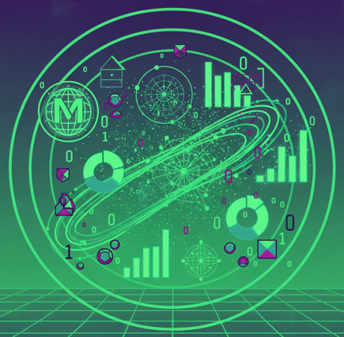

# Marc Grover - Data Science & Advanced Analytics
Hello, my name is Marc Grover. I hold a Master's degree in Mathematics and have built my career around working with data — extracting meaningful insights to support business decisions and delivering tangible business benefits for customers across a range of sectors.

My focus is on the Machine Learning and Deep Learning dimensions of AI, underpinned by strong experience in Advanced Analytics.  I am passionate about applying these techniques to real-world problems, translating complex analysis into clear, actionable recommendations that drive business value.

This portfolio is designed to demonstrate the breadth and depth of my analytical skills — not just the techniques themselves, but, most importantly, how they apply to realistic business situations.  Each project is built around a fictional but plausible business scenario, showing how data-driven methods can answer real questions, generate insight, and support confident decision-making.

The projects demonstrate the full data science process: exploratory data analysis (EDA), data preparation, modelling, interpretation, conclusions, and recommended next steps — reflecting how this work is done in practice.  The examples are intentionally kept accessible to keep the focus on the power, flexibility, and scalability of each approach, and how it can benefit organisations across many different contexts.

The data used is either publicly available or synthetically generated. None of the projects represent actual client work, but they are grounded in the mindset and rigour I bring to real engagements.

All projects are implemented in Python, reflecting the language's central role in modern data science and demonstrating practical proficiency across key libraries for data manipulation, statistical analysis, machine learning, and deep learning.

## Statistical Analysis & Hypothesis Testing  
* ### [One-Sample T-Test](/1-sample-t-test/)
* ### [Two-Sample T-Test](/2-sample-independent-t-test/)
* ### [Paired Sample T-Test](/paired-sample-t-test/)
* ### [One-Way ANOVA](/1-way-anova/)
* ### [Two-Way ANOVA with replication](/2-way-anova-with-rep/)
* ### [Two-Way ANOVA without replication](/2-way-anova-without-rep/)
* ### [A/B Testing (Chi-squared test)](/ab-test/)
* ### [Chi-squared goodness-of-fit test](/chi-squared/)

## Regression & Predictive Modelling
* ### [Multiple linear regression](/multi-linear-regression/)
* ### [Logistic regression](/logistic-regression/)

## Time-Series Analysis
* ### [Time-series analysis (moving averages)](/moving-averages/)
* ### [Time-series analysis (ARIMA)](/arima/)

## Machine Learning — Supervised
* ### [Decision Trees](/decision-trees/)
* ### [Random Forests](/random-forest/)
* ### [Gradient Boosted Trees](/gradient-boosted-trees/)
* ### [K-Nearest Neighbours](/k-nearest-neighbours/)

## Machine Learning — Unsupervised
* ### [K-Means Clustering](/k-means-clustering/)
* ### [Principal Component Analysis (PCA)](/principal-component-analysis/)
* ### [Association Rule Mining](/association-rule/)

## Causal & Experimental Analysis
* ### [Causal Impact Analysis](/causal-impact-analysis/)
  * ### [Causal Impact Analysis - Part 2](/causal-impact-analysis-2/)

## Deep Learning & NLP
* ### [Zero-shot Classification (Deep Learning)](/zero-shot-classification/)
<!--* ### Text Summarisation (Deep Learning) -->
<!--* ### Topic Modelling and Clustering (Deep Learning) -->
* ### [Image Classification (Deep Learning)](/image-classification/)

## Data Quality & Validation
* ### [Great Expectations (Validation)](/great-expectations/)

<!-- * ### Fine Tuning / RAG / Transfer Learning -->
<!-- * ### Text preprocessing (NLP) -->
<!-- * ### Sentiment Analysis (NLP) -->
<!-- * ### Review classification (NLP) -->
<!-- * ### Category Classification Prediction (Neural Network) -->
<!-- * ### Text Classification (Neural Network) -->
<!-- * ### Named Entity Recognition (Deep Learning) -->
<!-- * ### Text Summarisation (Deep Learning) -->

