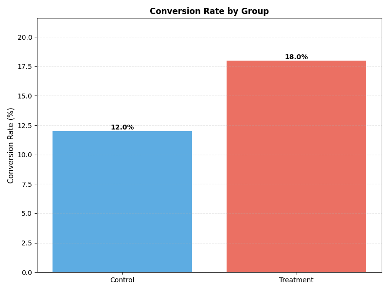
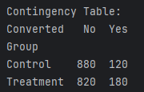
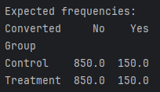

---

layout: default

title: Web conversion rates  (A/B test)

permalink: /ab-test/

---

## Goals and objectives:

To test and analyse the conversion rates for users signing up for membership via a new webpage (treatment group) compared to the old webpage (control group).  The business wants to understand if there are any statistically significant differences.

1,000 data points were collected from both the new and old webpage, which showed 180 took out membership via the new web page, and 120 took out membership via the old web page.  This data is analysed to determine if any significant difference can be assumed, and identify other insight from the data.

The A/B test (using the chi-squared test) provided evidence that there is a statistically significant difference in conversions between the two versions of the website, and provided the business with evidence to support the decision to migrate to the new version of the website.  (Explain the expected benefits)

## Application:  

Why use the chi-squared test? The chi-squared t-test and the 2-sample test can both be used in A/B testing, but they are appropriate for different types of metrics and research questions.  The best test depends entirely on the type of data you are analysing.  

The chi-squared test of independence is used to compare the proportions or frequencies of a categorical variable between two groups.  As such it is applicable to cases such as this project where the data categorical/discrete, i.e. testing if the conversion rate (proportion of users who converted) is significantly different between the Control (A) and Variant (B).

By contrast, the independent 2-sample t-test is used to compare the means (averages) of a continuous variable between two independent groups (A and B).

A/B testing used to compare proportions or frequencies of a categorical variable is foundational to modern data-driven decision-making, particularly in optimizing digital experiences and quality control.

* In the technology sector, this is the most common use of A/B testing, focusing on user behavior that results in a binary outcome (success/failure).  Examples include, conversion, click-through rates, email-open rates.
* Retail uses these tests to optimize both online and in-store campaign effectiveness - offer redemption rates, cart abandonment rate, packing preference.
* In finance, these tests are crucial for improving the efficiency of lead generation and customer onboarding - Application Submission Rate, Lead-to-Client Conversion.
* In manufacturing, this A/B testing framework is used offline to compare the effectiveness of two production conditions on a binary quality outcome - Defect Rate Comparison, Pass/Fail Inspection Rates.

## Methodology:  

A workflow in Python was developed using libraries Scipy, Pandas and Numpy, utilising Matplotlib for visualisations.  The data was created in the script, with the intention of producing interesting statistical findings.  

The A/B test was used to test the null hypothesis that there is no variance between the control and treatment groups.  Further analysis determined the high-confidence range of conversion percentages, to support business planning and expectations.

Tests were also undertaken to determine if the sample size was sufficient to detect a real difference given the expected conversion rates.

Data preparation:  Minor transformation of data into a pandas dataframe and contingency table for analytical purposes.

## Results and conclusions:

### Hypothesis Test:  

The data being used for the A/B test contains 1,000 data points for each group, where 18% converted in the treatment group and 12% converted in the control group.

This data was used to create the contingency table:

The chi-squared test was applied to the data, with the null hypothesis that there is no variance between the control and treatment groups, with the significance level (alpha) equal to 0.05.  

The result of the chi-squared test was a p_value of 0.00022, and as this is > 0.05 we can reject the null hypothesis and have evidence that there is a statistically significant difference in conversion rates between the 2 groups.

An output of the chi-squared test was the expected frequencies table, which represents the expected number of conversions should there be no difference in conversion rates between groups.

  

Using Cramér's V which is a measure of association between two nominal variables, returning a number between 0 and 1 that indicates how strongly two categorical variables are associated.  The calculated Cramér's V was 0.0826, which is interpretted as being a 'small' effect, i.e. moving from the control to treatment group will return a statistically significant difference but the scale of that effect is small.  It should be noted that this is a subjective effect 'size', and may well produce a meaningful and positive business improvement, and as such the Cramér's V is to be interpretted within the business context.  As an example, increasing conversion rates by a few percent may have significant business benefit and meet the goals of the development.

Given the data available, we want to determine the range of values that the true conversion rates are in, with 95% confidence.  From the data we cannot be sure that the true conversion rate via the new web page is eqactly 18%.

It was determined that the 95% confidence intervals for true conversion rates are:  

Control Group: 95% Confidence Interval of Conversion Rate: (9.99%, 14.01%)

Treatment Group: 95% Confidence Interval of Conversion Rate: (15.62%, 20.38%)

Visualising these ranges on a chart to support interpretation:  

### Sample size and power analysis:  

When setting up tests, and taking measurements it is important to determine the sample size required to meaningfully determine if there is a difference between the groups.  
Power refers to the probability that your test will detect an effect when there actually is one.  Typically, this is 80% i.e. 80% chance of detecting a real effect should one exist.  More formally:  

Power = Probability of rejecting the null hypothesis when it's actually false

Note that it is common to set alpha to 5%, which is the chance of a false positive.

Taking the example above, the business had data to imply that the conversion rate on the old website was 11%, and was hoping for a conversion rate up to 16%.  Using these values, it was determined that a sample size of at least 733 per group was required.  The data analysed has 1,000 and as such we can be confident that the sample size was sufficiently large to detect the approxmated difference between websites.

## Next steps:
The primary recommendations would be that the new website should be deployed as there is evidence that it results in an increased volume of memberships being taken.  It was also be recommended to constantly track the conversion rates of the new website to understand if the rate achieved in the test is reflected going forward, and understand any changes or trends over time, using a range of analytical techniques, potentially including time-series analysis and comparative analysis methods.  It would also be suggested that other website designs are tested to see if they produce even greater conversion rates.

## Python code:
You can view the full Python script used for the analysis here: 
[View the Python Script](/AB Testing.py)
