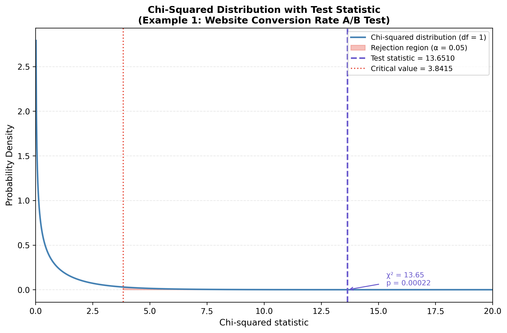
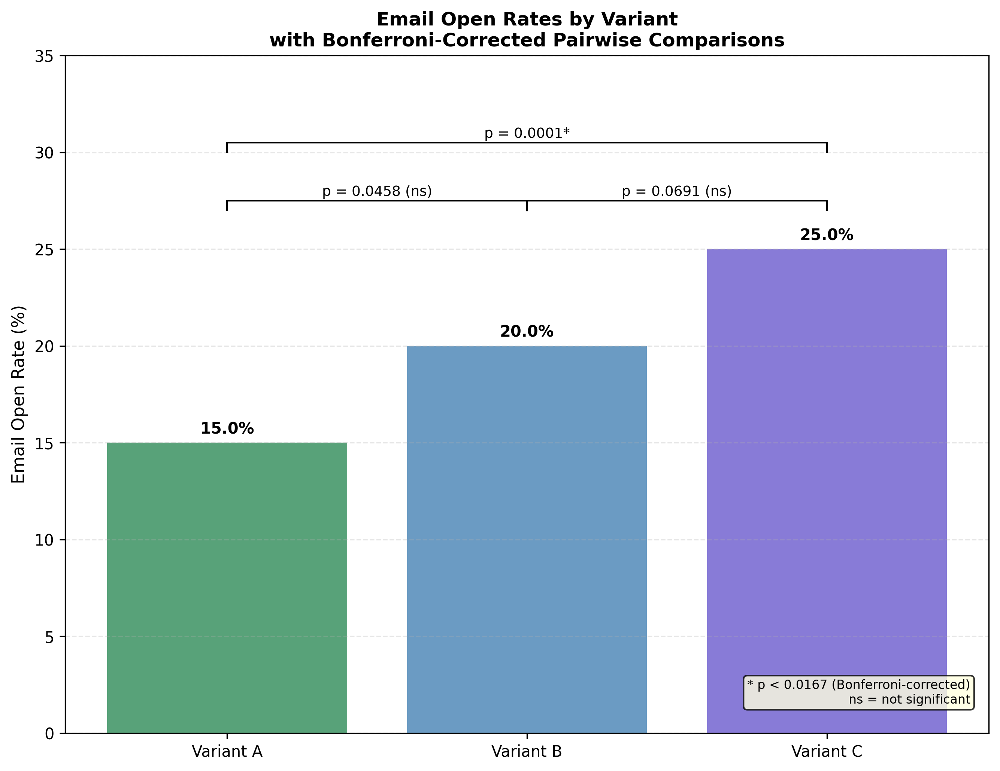
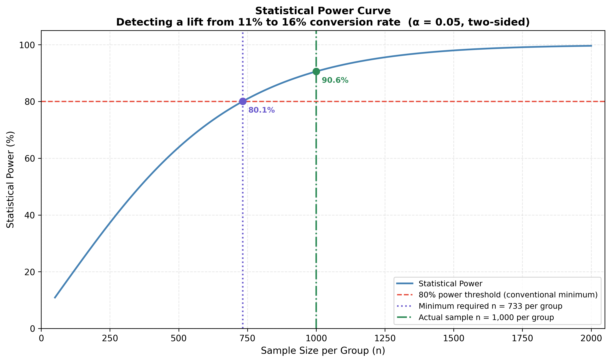

---

layout: default

title: Web conversion rates  (A/B test)

permalink: /ab-test/

---

## Goals and objectives:

For this portfolio project, the business scenario concerns a website redesign: specifically, whether a newly developed webpage generates a higher rate of membership sign-ups than the existing design. 1,000 users were exposed to the original webpage (the control group) and 1,000 to the new design (the treatment group), with each user's outcome recorded as a binary result — converted or not converted. The objective is to determine whether the difference in conversion rates between the two groups is statistically significant, or whether it could plausibly be explained by chance alone.

The chi-squared test of independence is the appropriate technique here because the outcome variable is categorical — each observation falls into one of two classes — and the analysis compares the distribution of that outcome across two independent groups. A statistically significant result provides the business with evidence to support or reject the decision to migrate to the new webpage, and to model the expected impact on membership volumes and associated revenue.

Beyond the primary hypothesis test, the project extends into several areas of analytical depth that are important in any applied A/B testing context. Assumption checking is conducted formally before the test is applied, verifying the independence of observations, confirming that all expected cell frequencies meet the minimum threshold required for the chi-squared approximation to be reliable, and examining the effect of Yates' continuity correction on the result. Effect size is quantified using Cramér's V, which contextualises the statistical result in terms of practical magnitude — an important distinction in settings where even a small conversion rate improvement carries meaningful commercial value.

A second example extends the framework to a three-variant email campaign, where the objective is to identify which of three subject line variants drives the highest open rate. This introduces the multi-variant A/B testing problem and demonstrates why an omnibus chi-squared test alone is insufficient: when the overall test finds a significant result, pairwise post-hoc comparisons with Bonferroni correction are required to identify exactly which variant pairs are driving the difference, while controlling the family-wise Type I error rate that arises from running multiple simultaneous tests.

A third example applies the same chi-squared framework to a mobile app onboarding redesign, measuring 7-day user retention across old and new versions. This demonstrates the generalisability of the technique across different business metrics and sectors.

The final section addresses a prerequisite step that is often overlooked in practice: before an A/B test is run, it is essential to determine how large a sample is needed to reliably detect a meaningful difference should one exist. Statistical power — the probability of correctly rejecting the null hypothesis when it is false — is calculated as a function of sample size, and a power curve is produced to visually confirm that the actual sample size used in the study was sufficient to meet the conventional 80% power threshold.

Taken together, the project demonstrates not only the correct implementation of chi-squared A/B testing, but also the analytical judgement to validate assumptions, interpret results in both statistical and practical terms, handle the multiple comparisons problem in multi-variant designs, and approach the study design question of sample size adequacy with the same rigour applied to the analysis itself.

## Application:  

The appropriate statistical test for an A/B test depends entirely on the nature of the outcome being measured. When the outcome is **categorical** — that is, each observation falls into one of a discrete set of classes — the chi-squared test of independence is the correct choice. This project analyses a binary outcome (converted or not converted), making the chi-squared test the natural fit: it tests whether the distribution of a categorical variable differs significantly between two or more independent groups.

The alternative in A/B testing is the **independent two-sample t-test**, which is used when the outcome is **continuous** — for example, comparing the average time spent on a page, average order value, or average session duration between a control and treatment group. The t-test compares group means and assumes the underlying variable is measured on a numerical scale. Applying it to a binary outcome such as converted/not converted would be incorrect.

It is also worth noting that the chi-squared test extends naturally beyond the standard two-group (A/B) design to multi-variant tests involving three or more groups simultaneously — such as the three-variant email campaign tested in this project. In these cases, the omnibus chi-squared result indicates whether at least one group differs from the others, but does not identify which specific pairs are responsible. Post-hoc pairwise comparisons with a multiple testing correction — Bonferroni correction is applied here — are then required to answer that question precisely, while controlling the inflated false positive risk that arises from running several tests at once.

Chi-squared A/B testing is foundational to data-driven decision-making across many sectors, particularly wherever business decisions hinge on a binary or categorical outcome.

💻 In **technology**, A/B testing is ubiquitous in product development and digital marketing. Teams continuously test changes to user interfaces, page layouts, call-to-action wording, and onboarding flows to determine which version drives better engagement. Outcomes such as sign-up conversion, feature adoption, and click-through rate are all binary in nature, making chi-squared the standard analytical tool. The ability to attribute a change in conversion rate to a specific design decision — with statistical confidence — is what separates data-driven product development from intuition-led guesswork.

🛍️ In **retail**, both online and physical channels use this framework to assess the effectiveness of promotional campaigns, pricing experiments, and packaging changes. A retailer might test whether a redesigned product page increases add-to-basket rate, whether a targeted discount email outperforms a generic one, or whether a revised store layout changes the proportion of customers who reach a particular aisle. Each of these produces a binary outcome (acted or did not act), and chi-squared testing provides the rigour to distinguish genuine improvements from random variation in customer behaviour.

🏦 In **financial services**, chi-squared A/B testing is applied throughout the customer acquisition and onboarding journey. Lenders test whether different application form designs affect submission completion rates; wealth managers test whether varying the framing of investment risk disclosures influences the proportion of clients who proceed to the next stage; and insurance providers test whether personalised quote presentations improve policy uptake. In a sector where regulatory and compliance constraints limit how aggressively firms can iterate, statistical rigour in evaluating even small incremental changes carries significant commercial value.

🏭 In **manufacturing and quality control**, the chi-squared framework is applied offline to compare production conditions rather than digital experiences. A manufacturer might test whether a change to process temperature, raw material supplier, or equipment setting alters the proportion of units that pass or fail a quality inspection. Because the outcome is categorical (pass/fail, defective/non-defective), chi-squared is the appropriate test — and given the cost implications of both false positives (unnecessary process changes) and false negatives (undetected quality problems), rigorous assumption checking and adequate sample sizing are particularly important in this context.

## Methodology:  

The workflow was developed in Python using NumPy and Pandas for data construction and manipulation, SciPy for all statistical computation, and Matplotlib for visualisations. All datasets were synthetically generated within the script using a fixed random seed for reproducibility, with the conversion and retention rates deliberately set to produce analytically interesting findings across the four examples.

**Data preparation** was minimal by design: each dataset was constructed directly as a Pandas DataFrame and transformed into a contingency table using pd.crosstab(). A contingency table records the observed frequency of each combination of group membership and outcome, and is the required input structure for the chi-squared test of independence. No imputation, outlier removal, or scaling was necessary given the nature of the data.

**Assumption checking** was conducted formally before applying the chi-squared test in Example 1, covering four criteria. First, independence of observations: each record represents a unique user assigned to one group only, satisfying this requirement by design. Second, minimum expected cell frequency: the chi-squared test relies on an asymptotic approximation that becomes unreliable when any expected cell count falls below five; expected frequencies were computed programmatically and verified against this threshold, with Fisher's Exact Test noted as the appropriate fallback for small samples. Third, Yates' continuity correction: SciPy applies this correction by default to 2×2 tables, reducing the chi-squared statistic slightly to guard against Type I error inflation; both the corrected and uncorrected statistics and p-values are reported to confirm the result is robust to this choice. Fourth, sample size adequacy: the size and balance of each group is stated explicitly and assessed against the minimum required sample, which is calculated separately in Example 4.

**The chi-squared test of independence** was applied to each contingency table using scipy.stats.chi2_contingency(). The test evaluates the null hypothesis that the distribution of the outcome variable is independent of group membership — that is, there is no difference in conversion or retention rates between the groups. The test statistic, degrees of freedom, p-value, and table of expected frequencies (representing the counts that would be observed if the null hypothesis were true) are all reported. The significance level was set at α = 0.05 throughout.

**Effect size** was quantified using Cramér's V, calculated from the chi-squared statistic, total sample size, and the minimum dimension of the contingency table. Cramér's V returns a value between 0 and 1, where values below 0.1 indicate a small effect, 0.1–0.3 a medium effect, and above 0.3 a large effect. This is reported alongside the p-value in all examples, as statistical significance and practical magnitude are distinct: a result can be highly significant in large samples while the underlying effect remains small in absolute terms.

**Confidence intervals** for the true conversion rates were calculated using the normal approximation method (Wilson-type interval), with a 95% confidence level. The standard error of each proportion is computed from the observed rate and sample size, and the margin of error is derived using the corresponding z-score from the standard normal distribution. These intervals quantify the plausible range of the true underlying conversion rate in each group, supporting business planning that needs to account for uncertainty around the point estimate.

**Absolute difference and relative lift** were calculated for Examples 1 and 3. The absolute difference is the straight percentage point gap between the treatment and control conversion rates. The relative lift expresses that gap as a percentage of the control rate, which is the more commercially relevant figure when evaluating the proportional improvement a new design or feature delivers over the baseline.

**Multi-variant testing and post-hoc comparisons** are demonstrated in Example 2, where three email subject line variants (A, B, and C) are tested simultaneously. An omnibus chi-squared test across all three variants first determines whether any significant differences exist. Because this result does not identify which specific pairs differ, three pairwise chi-squared tests are then conducted between all variant combinations (A vs B, A vs C, B vs C). Bonferroni correction is applied to control the family-wise error rate: the significance threshold is divided by the number of comparisons (α / 3 = 0.0167), ensuring that the probability of at least one false positive across the three tests remains at or below 5%.

**Sample size and power analysis** are addressed in Example 4. A sample size function was implemented to calculate the minimum number of observations required per group to detect a specified difference in conversion rates at α = 0.05 with 80% statistical power — the conventional minimum. Power is the probability of correctly rejecting the null hypothesis when a true effect of the specified size exists; at 80% power, there is a 20% chance of a Type II error (failing to detect a real effect). A complementary power function was implemented to compute achieved power across a range of sample sizes, producing a power curve that visually maps the relationship between sample size and the probability of detection. Both the minimum required sample size and the actual sample size used in Example 1 are marked on this curve, confirming that the study was sufficiently powered.

**Six visualisations** were produced across the four examples: a grouped bar chart of conversion rates by group; a horizontal bar chart of conversion rates with 95% confidence interval error bars; a 100% stacked proportion bar chart showing the full group composition for both converted and not-converted outcomes; the chi-squared theoretical distribution with the test statistic, critical value, and rejection region annotated; a bar chart of email open rates by variant with Bonferroni-corrected pairwise significance brackets; and a statistical power curve with the minimum required and actual sample sizes marked.

## Results:

### Example 1: Website Conversion Rate A/B Test

The dataset comprised 1,000 observations per group. The control group recorded a 12% conversion rate (120 out of 1,000 users) and the treatment group 18% (180 out of 1,000), representing an absolute difference of 6 percentage points and a relative lift of 50%.  This data was used to create the contingency table:

```
Converted   No  Yes
Group              
Control    880  120
Treatment  820  180
```

All four assumption checks were satisfied: observations are independent by design, all expected cell frequencies exceeded the minimum threshold of 5, and the chi-squared result was confirmed as robust — the conclusion held with and without Yates' continuity correction applied.

The chi-squared test returned a p-value of 0.00022, well below the α = 0.05 threshold, providing strong evidence to reject the null hypothesis - that there is no statistical difference between the control and treatment groups. There is a statistically significant difference in conversion rates between the two webpage designs. Cramér's V was calculated at 0.0826, indicating a small effect size — a result that is statistically significant but modest in magnitude, which is discussed further in the Conclusions.

The 95% confidence intervals for the true conversion rates were calculated as 9.99% – 14.01% for the control group and 15.62% – 20.38% for the treatment group. Critically, these intervals do not overlap, providing additional confidence that the observed difference reflects a genuine underlying effect.

**Plot 1** presents a bar chart of conversion rates by group, providing a direct visual comparison of the 12% and 18% rates. **Plot 2** displays the same rates as a horizontal bar chart with 95% confidence interval error bars, making the non-overlapping ranges immediately apparent. **Plot 3** shows a 100% stacked proportion chart, illustrating the full composition of each group — converted and not converted — so the scale of the shift between control and treatment is visible in context. **Plot 4** places the test statistic on the theoretical chi-squared distribution, with the critical value and rejection region marked, confirming the result sits well into the tail of the distribution under the null hypothesis.




### Example 2: Email Campaign A/B/C Test

Three email subject line variants were tested across 500 recipients each, recording open rates of 15% (Variant A), 20% (Variant B), and 25% (Variant C). The omnibus chi-squared test was significant, confirming that the three variants do not perform equivalently - (χ² ≈ 15.625, p ≈ 0.0001).

Bonferroni-corrected pairwise comparisons (adjusted α = 0.0167) were then conducted across all three variant pairs. Only the A vs C comparison reached the corrected significance threshold (χ² ≈ 15.01, p ≈ 0.0001), reflecting a 10 percentage point difference between the weakest and strongest performers. The A vs B and B vs C comparisons, each spanning a 5 percentage point gap, returned p-values of approximately 0.046 and 0.069 respectively — both borderline at the unadjusted α = 0.05 level but falling short of the Bonferroni-corrected threshold. **Plot 5** presents the open rates for all three variants as a bar chart with significance brackets annotated above each pair, clearly distinguishing the one significant comparison from the two that are not.



### Example 3: Mobile App Feature Test

800 users were assigned to each version of the app. The old onboarding flow recorded a 7-day retention rate of 30% (240 out of 800) and the new flow 40% (320 out of 800), an absolute improvement of 10 percentage points and a relative lift of 33.3%. The chi-squared test was significant (p < 0.05), and Cramér's V indicated a medium effect — a meaningfully larger practical magnitude than that observed in Example 1, reflecting the greater scale of the difference relative to the sample size.

### Example 4: Sample Size and Power Analysis

Given a baseline conversion rate of 11% and a target rate of 16%, the minimum required sample size to achieve 80% power at α = 0.05 was calculated at 733 observations per group (1,466 in total). The actual sample used in Example 1 was 1,000 per group, exceeding this threshold and confirming the study was adequately powered to detect the anticipated difference. **Plot 6** shows the power curve across a range of sample sizes from 50 to 2,000 per group, with the 80% power threshold, minimum required sample, and actual sample size all marked. The curve demonstrates how power increases steeply at smaller sample sizes before levelling off, illustrating the diminishing return of collecting observations beyond what is needed to reliably detect the effect of interest.



## Conclusions:

### Example 1: Website Conversion Rate

The chi-squared test provides clear statistical evidence that the new webpage design outperforms the original in generating membership sign-ups. The result is highly significant and robust — the conclusion holds with and without Yates' continuity correction, and the non-overlapping 95% confidence intervals provide an independent confirmation that the difference is unlikely to reflect sampling variation.

The Cramér's V of 0.0826 warrants careful interpretation. Taken in isolation, a value below 0.1 is classified as a small effect, which might appear to undermine the strength of the finding. However, effect size classifications are context-free, and in a commercial setting a 50% relative lift in conversion rate — from 12% to 18% — has the potential to be highly material. A business converting 1,000 visitors per day would see an additional 60 sign-ups daily from this change alone. The correct framing of Cramér's V here is not that the effect is unimportant, but that the improvement is modest relative to the total population — the majority of users in both groups did not convert. The recommendation to migrate to the new webpage design is well-supported by the evidence, with the expectation that ongoing tracking of live conversion rates will confirm whether the test-phase performance is sustained.

### Example 2: Email Campaign

The omnibus chi-squared test established that the three subject line variants do not perform equivalently, but it is the Bonferroni-corrected pairwise comparisons that deliver the actionable finding: Variant C, with a 25% open rate, is the strongest performer. This example illustrates an important principle in multi-variant testing — reporting only the omnibus result would identify that a difference exists without identifying what to do about it. The post-hoc analysis is not optional; it is the step that converts a statistically interesting result into a clear deployment decision. It also demonstrates why multiple testing correction matters: running three pairwise tests at α = 0.05 without adjustment would inflate the probability of at least one false positive to approximately 14%, compared to the controlled 5% achieved with Bonferroni correction.

### Example 3: Mobile App Onboarding

The pairwise analysis yields a conclusion that is more nuanced than a simple ranking of open rates might suggest. Variant C is statistically confirmed to outperform Variant A, with a 10 percentage point difference that is highly significant even after correction for multiple comparisons. However, neither the A vs B nor the B vs C comparison reaches the Bonferroni-corrected threshold — meaning the data does not statistically confirm that Variant C outperforms Variant B, nor that Variant B outperforms Variant A. The observed differences between adjacent variants are real in the data but are not large enough relative to the sample size to rule out chance at the corrected significance level.

The practical recommendation is nonetheless to deploy Variant C: it is the only variant with a statistically confirmed superiority over another, and its 25% open rate is the highest observed. If distinguishing between B and C is commercially important, a follow-up test with a larger sample — informed by a power calculation for a 5 percentage point effect — would be the appropriate next step. This example also illustrates precisely why Bonferroni correction matters: without it, all three pairwise comparisons would appear significant at α = 0.05, overstating the confidence with which the variants can be ranked.

### Example 4: Study Design and Power

The power analysis reinforces a principle that applies to all three preceding examples: the reliability of a statistical conclusion depends not only on the test applied but on whether the study was designed with sufficient sample size to detect the effect of interest in the first place. With a minimum requirement of 733 observations per group and an actual sample of 1,000, Example 1 was comfortably powered. Had the sample been smaller — say, 400 per group — the same true difference in conversion rates may not have reached significance, and a genuine improvement could have been incorrectly dismissed. Power analysis should therefore be treated as a prerequisite to data collection, not a retrospective check, and the power curve demonstrates clearly how the return on additional observations diminishes once the 80% threshold is reached.

### Broader Observations

Across all four examples, the project demonstrates that rigorous A/B testing involves considerably more than running a single chi-squared test and reading a p-value. Assumption checking, effect size quantification, confidence interval estimation, multiple testing correction, and power analysis each contribute a distinct layer of analytical confidence — and together they produce findings that are both statistically defensible and interpretable in a business context. The consistent application of this framework, regardless of the sector or metric being tested, is what distinguishes analysis that genuinely supports decision-making from analysis that merely reports numbers.

## Next steps:
The primary recommendations would include:
* **Deploy the new webpage design.** The statistical evidence is clear and the business case is well-supported: the treatment group delivered a 50% relative lift in conversion rate, the result is robust to assumption testing, and the confidence intervals for the two groups do not overlap. Live conversion rates should be monitored continuously following deployment to confirm that the test-phase performance is reflected in production, and to detect any drift over time that may warrant re-evaluation.
* **Deploy the new app onboarding flow.** The 10 percentage point improvement in 7-day retention represents a medium effect — stronger in practical terms than the website result — and the statistical evidence is equally clear. Retention analysis should be extended beyond the 7-day window to understand whether the improvement persists at 14 and 30 days, and downstream engagement metrics such as session frequency and in-app activity should be tracked to assess the longer-term value of retained users.
* **Conduct a follow-up email test between Variants B and C.** The pairwise analysis confirmed only that Variant C significantly outperforms Variant A. The B vs C comparison returned p ≈ 0.069, which fell short of the Bonferroni-corrected threshold. A dedicated two-variant test between B and C, with sample size determined by a power calculation for a 5 percentage point effect, would resolve this ambiguity and confirm whether Variant C is genuinely the optimal subject line or whether B and C are effectively equivalent.
* **Incorporate segmentation analysis.** Each of the three tests in this project treats its user population as homogeneous. In practice, conversion and retention effects may vary significantly across user segments — by acquisition channel, device type, geographic region, or demographic group. Segment-level analysis would identify whether the aggregate results mask stronger or weaker effects within specific groups, enabling more targeted deployment decisions.
* **Apply power analysis as a standard prerequisite.** The power curve in Example 4 confirms that the sample sizes used here were adequate, but this should be treated as a general discipline rather than a retrospective check. For any future test, the minimum required sample size should be calculated in advance from a realistic estimate of the baseline rate and the smallest lift considered commercially meaningful. Running a test that is underpowered risks dismissing genuine improvements as non-significant.
* **Consider iterative testing and longer-term optimisation.** The current results represent a single round of testing for each scenario. A structured programme of iterative A/B tests — progressively refining webpage design, email content, and onboarding flow — would compound the gains from each individual test and build a richer evidence base for product decisions over time.

## Python code:
You can view the full Python script used for the analysis here: 
[View the Python Script](/AB Test_v2.py)
