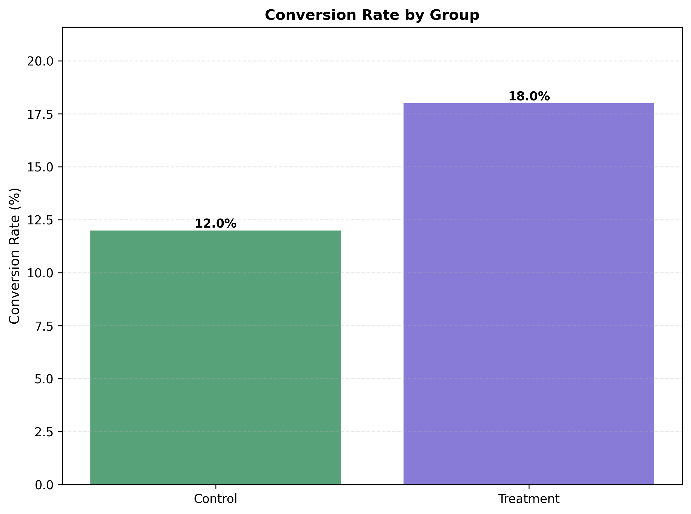
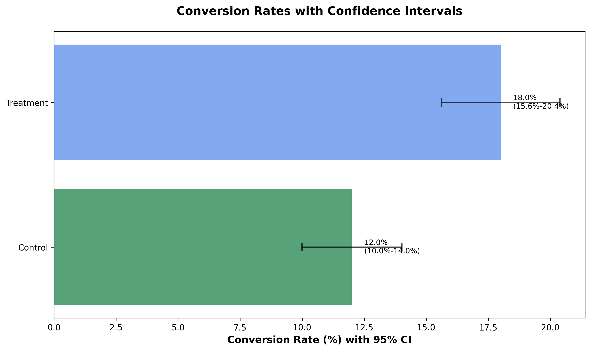
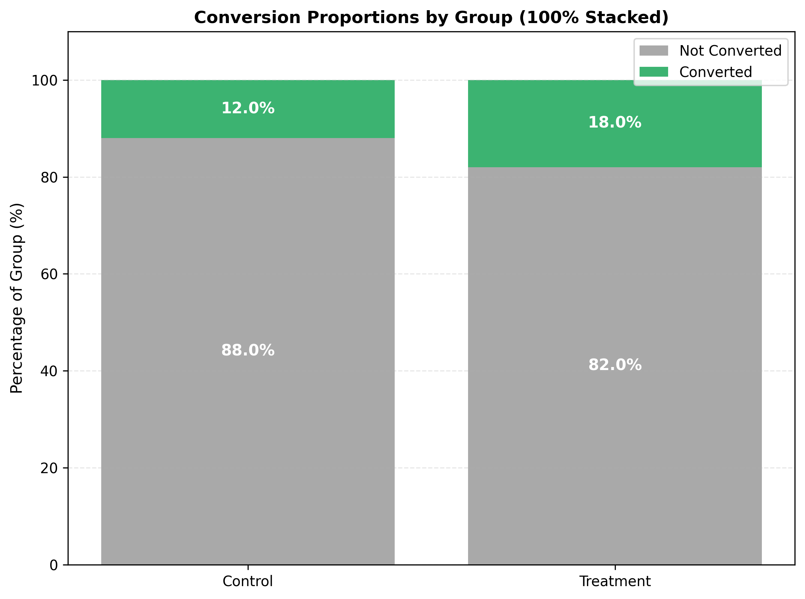

---

layout: default

title: Web conversion rates  (A/B test)

permalink: /ab-test/

---

# This project is currently being extended

## Goals and objectives:

For this portfolio project, the business scenario concerns a website redesign: specifically, whether a newly developed webpage generates a higher rate of membership sign-ups than the existing design. 1,000 users were exposed to the original webpage (the control group) and 1,000 to the new design (the treatment group), with each user's outcome recorded as a binary result — converted or not converted. The objective is to determine whether the difference in conversion rates between the two groups is statistically significant, or whether it could plausibly be explained by chance alone.

The chi-squared test of independence is the appropriate technique here because the outcome variable is categorical — each observation falls into one of two classes — and the analysis compares the distribution of that outcome across two independent groups. A statistically significant result provides the business with evidence to support or reject the decision to migrate to the new webpage, and to model the expected impact on membership volumes and associated revenue.

Beyond the primary hypothesis test, the project extends into several areas of analytical depth that are important in any applied A/B testing context. Assumption checking is conducted formally before the test is applied, verifying the independence of observations, confirming that all expected cell frequencies meet the minimum threshold required for the chi-squared approximation to be reliable, and examining the effect of Yates' continuity correction on the result. Effect size is quantified using Cramér's V, which contextualises the statistical result in terms of practical magnitude — an important distinction in settings where even a small conversion rate improvement carries meaningful commercial value.

A second example extends the framework to a three-variant email campaign, where the objective is to identify which of three subject line variants drives the highest open rate. This introduces the multi-variant A/B testing problem and demonstrates why an omnibus chi-squared test alone is insufficient: when the overall test finds a significant result, pairwise post-hoc comparisons with Bonferroni correction are required to identify exactly which variant pairs are driving the difference, while controlling the family-wise Type I error rate that arises from running multiple simultaneous tests.

A third example applies the same chi-squared framework to a mobile app onboarding redesign, measuring 7-day user retention across old and new versions. This demonstrates the generalisability of the technique across different business metrics and sectors.

The final section addresses a prerequisite step that is often overlooked in practice: before an A/B test is run, it is essential to determine how large a sample is needed to reliably detect a meaningful difference should one exist. Statistical power — the probability of correctly rejecting the null hypothesis when it is false — is calculated as a function of sample size, and a power curve is produced to visually confirm that the actual sample size used in the study was sufficient to meet the conventional 80% power threshold.

Taken together, the project demonstrates not only the correct implementation of chi-squared A/B testing, but also the analytical judgement to validate assumptions, interpret results in both statistical and practical terms, handle the multiple comparisons problem in multi-variant designs, and approach the study design question of sample size adequacy with the same rigour applied to the analysis itself.

## Application:  

Why use the chi-squared test? The chi-squared t-test and the 2-sample test can both be used in A/B testing, but they are appropriate for different types of metrics and research questions.  The best test depends entirely on the type of data you are analysing.  

The chi-squared test of independence is used to compare the proportions or frequencies of a categorical variable between two groups.  As such it is applicable to cases such as this project where the data categorical/discrete, i.e. testing if the conversion rate (proportion of users who converted) is significantly different between the Control (A) and Variant (B).

By contrast, the independent 2-sample t-test is used to compare the means (averages) of a continuous variable between two independent groups (A and B).

A/B testing is used to compare proportions or frequencies of a categorical variable is foundational to modern data-driven decision-making, particularly in optimizing digital experiences and quality control.

💻 In the **technology** sector, this is the most common use of A/B testing, focusing on user behaviour that results in a binary outcome (success/failure).  Examples include, conversion, click-through rates, email-open rates.

🛍️ **Retail** uses these tests to optimize both online and in-store campaign effectiveness - offer redemption rates, cart abandonment rate, packing preference.

🏦 In **finance**, these tests are crucial for improving the efficiency of lead generation and customer onboarding - Application Submission Rate, Lead-to-Client Conversion.

🏭 In **manufacturing**, this A/B testing framework is used offline to compare the effectiveness of two production conditions on a binary quality outcome - Defect Rate Comparison, Pass/Fail Inspection Rates.

## Methodology:  

A workflow in Python was developed using libraries Scipy, Pandas and Numpy, utilising Matplotlib for visualisations.  The data was created in the script, with the intention of producing interesting statistical findings.  

The A/B test was used to test the null hypothesis that there is no variance between the control and treatment groups.  Further analysis determined the high-confidence range of true conversion percentages, to support business planning and expectations.

Tests were also undertaken to determine if the sample size was sufficient to detect a real difference given the expected conversion rates.

Data preparation:  Minor transformation of data into a pandas dataframe and contingency table for analytical purposes.

## Results:

### Hypothesis Test:  

The data being used for the A/B test contains 1,000 observations for each group, where 18% of users converted in the treatment group and 12% of users converted in the control group.



This data was used to create the contingency table:

```
Converted   No  Yes
Group              
Control    880  120
Treatment  820  180
```

The chi-squared test was applied to the data, with the null hypothesis that there is no variance between the control and treatment groups, with the significance level (alpha) equal to 0.05.  

The result of the chi-squared test was a p_value of 0.00022, and as this is <0.05 we can reject the null hypothesis and provide evidence that there is a statistically significant difference in conversion rates between the 2 groups.

An output of the chi-squared test was the expected frequencies table, which represents the expected number of conversions should there be no difference in conversion rates between groups.

```
Converted     No    Yes
Group                  
Control    850.0  150.0
Treatment  850.0  150.0
```

Using Cramér's V which is a measure of association between two nominal variables, returning a number between 0 and 1 that indicates how strongly two categorical variables are associated.  The calculated Cramér's V was 0.0826, which is interpretted as being a 'small' effect, i.e. moving from the control to treatment group will return a statistically significant difference but the scale of that effect is small.  It should be noted that this is a subjective effect 'size', and may well produce a meaningful and positive business improvement, and as such the Cramér's V is to be interpreted within the business context.  As an example, increasing conversion rates by a few percent may have significant business benefit and meet the goals of the web-site development.

Given the data available, we want to determine the range of values that the true conversion rates are in, with 95% confidence.  From the data we cannot be sure that the true conversion rate via the new web page is exactly 18%.

It was determined that the 95% confidence intervals for true conversion rates are:  

Control Group: 95% Confidence Interval of Conversion Rate: (9.99%, 14.01%)

Treatment Group: 95% Confidence Interval of Conversion Rate: (15.62%, 20.38%)

Visualising these ranges on a chart to support interpretation, and further confirm that the conversion rates improve for the new web-site design:  



### Sample size and power analysis:  

When setting up A/B tests and recording observations, it is important to determine the sample size required to meaningfully determine if there is a difference between the groups.  

Power refers to the probability that your test will detect an effect when there actually is one.  Typically this is 80%, i.e. an 80% chance of detecting a real effect should one exist.  More formally:  

Power = Probability of rejecting the null hypothesis when it's actually false

Note that it is common to set the significance level (alpha) to 0.05, which is the chance of a false positive.

Taking the example above, the business previously had data to imply that the conversion rate on the old website was 11%, and was hoping for a conversion rate of up to 16%.  Using these values, it was determined that a sample size of at least 733 observations per group was required.  The data analysed has 1,000 observations per groups, and as such we can be confident that the sample size was sufficiently large to detect the approximated differences in conversion rates between websites.



### Conclusions:


## Next steps:
The primary recommendations would include:
* the new website should be deployed as there is evidence that it results in an increased volume of memberships being taken (higher conversion rate).
* constantly track the conversion rates of the new website to understand if the rate achieved in the test is reflected going forward, and understand any changes or trends over time
* use a range of analytical techniques, potentially including time-series analysis and comparative analysis methods on new observations recorded
* other website designs are tested to see if they produce even greater conversion rates

## Python code:
You can view the full Python script used for the analysis here: 
[View the Python Script](/AB Test_v2.py)
