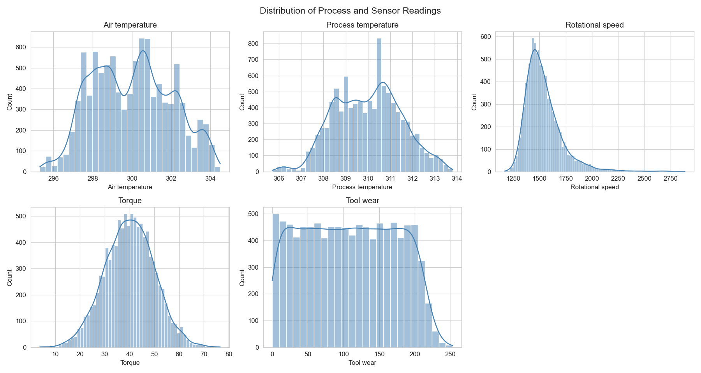
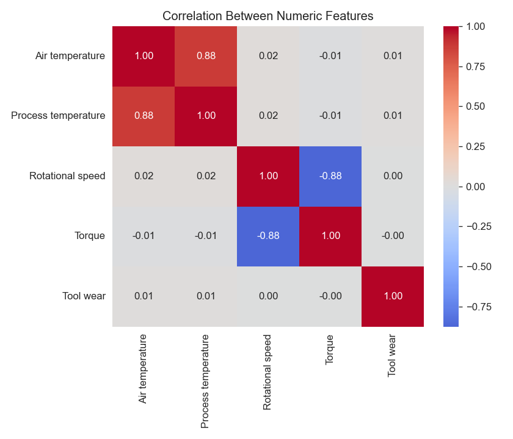
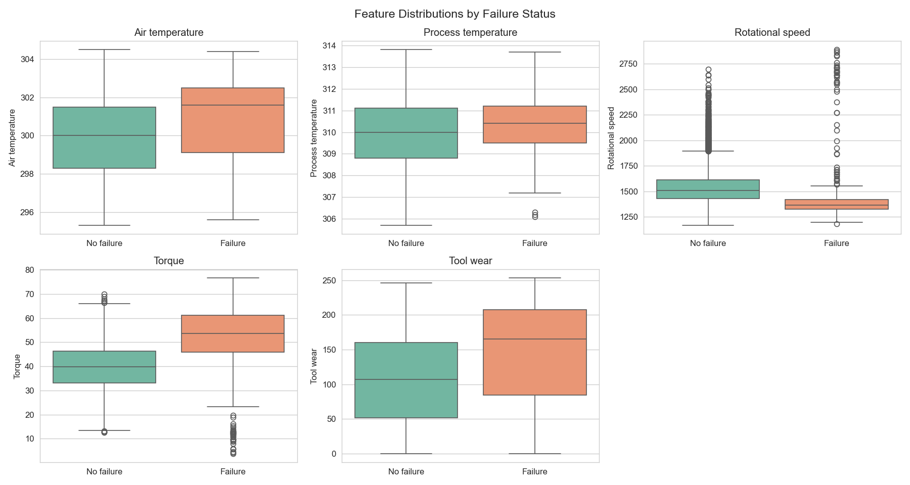
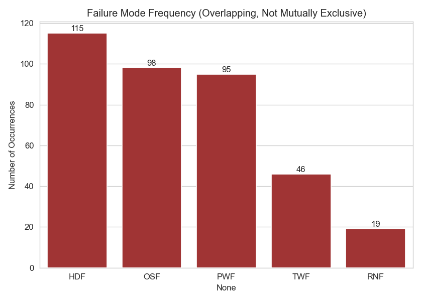
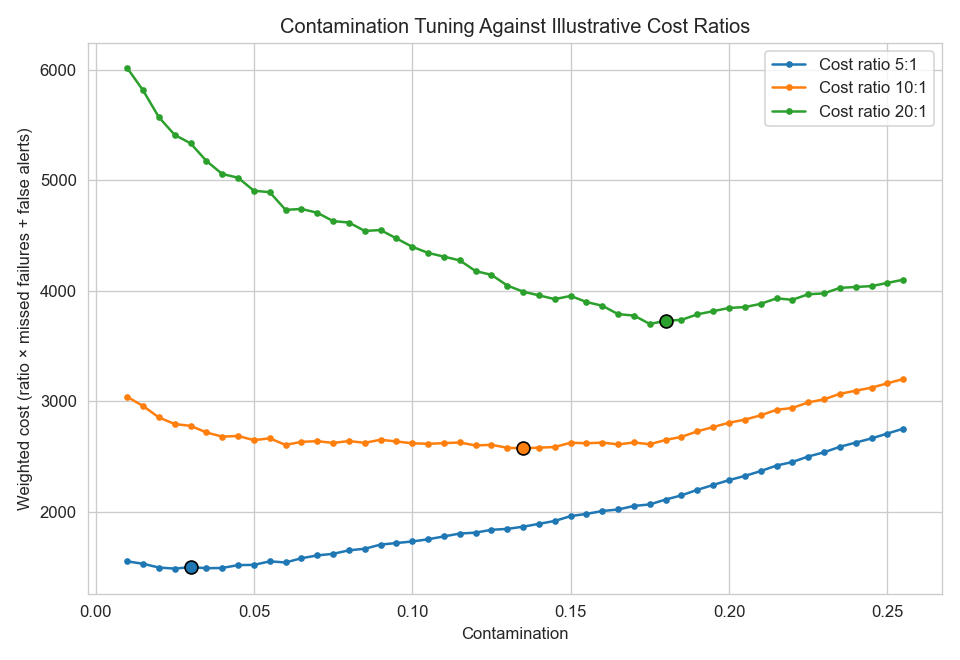
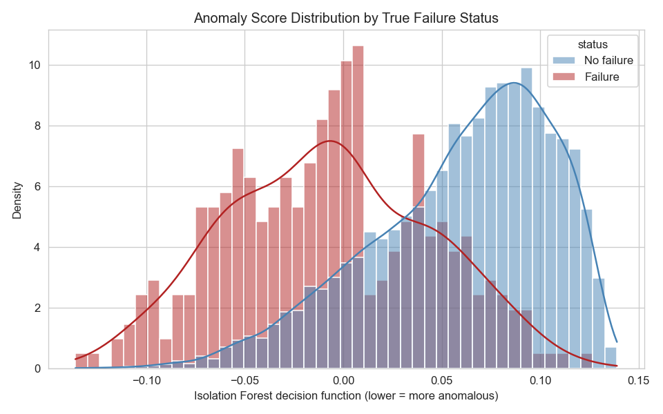
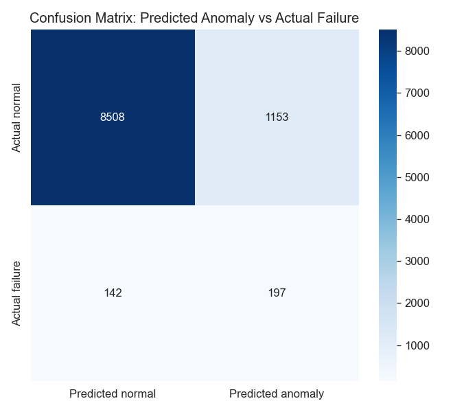
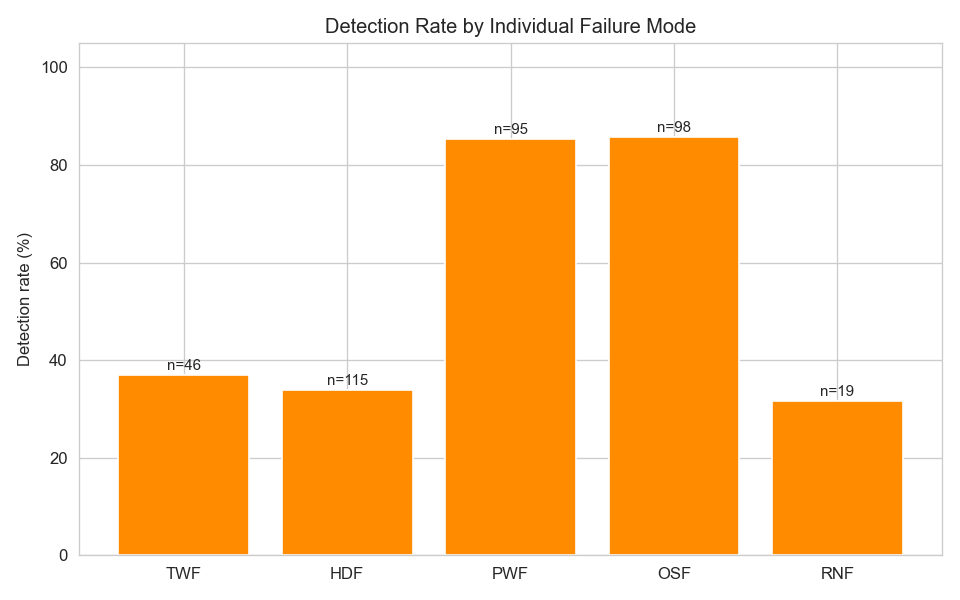

---

layout: default

title: Anomaly Detection (Isolation Forest)

permalink: /anomaly-detection/

---

## Goals and objectives:

The business objective is to demonstrate how an unsupervised anomaly detection model can support fault monitoring in an industrial manufacturing setting, where machine failures are rare, costly, and not reliably predictable using fixed rules or thresholds on individual sensors.

In many real-world manufacturing environments, historical examples of failure are too scarce, too varied in cause, or too poorly labelled to train a reliable supervised classifier. This project simulates that constraint directly: Isolation Forest is trained without access to failure labels, learning to isolate anomalous combinations of sensor readings — air and process temperature, rotational speed, torque, and tool wear — purely from the structure of the data itself. The dataset's true failure labels are withheld from training and used only afterwards, to evaluate how well the unsupervised model's flags align with genuine equipment failures.

A central theme of this project is that the two ways the model can be wrong are not equally costly. A missed anomaly may allow an undetected fault to progress towards unplanned equipment failure and production downtime; a false alert may trigger an unnecessary inspection or intervention, consuming maintenance resource and, if frequent, eroding operator trust in the monitoring system. Rather than treating the model's sensitivity as an arbitrary setting, this project treats the contamination parameter as a business decision, tuned against a stated cost asymmetry between these two outcomes.

This asymmetry also raises a question that extends beyond the model itself: who is accountable when a monitoring system misses a genuine fault, or when it raises an alert that turns out to be unwarranted? This question is explored further in the Ethics in Applied Data Science page, which references this project as a case study in high-stakes automated decision-making.

## Application:  

Isolation Forest is an unsupervised machine learning algorithm designed specifically for anomaly detection — the task of identifying rare observations that differ substantially from the majority of the data, without requiring any labelled examples of what an anomaly looks like. This makes it particularly valuable in real-world settings where anomalies are, by definition, rare and their exact form is often unknown in advance.

The core principle behind Isolation Forest inverts the logic used by most other anomaly detection methods. Rather than first building a profile of "normal" data and then measuring how far new points deviate from it, Isolation Forest works by attempting to isolate each observation through a series of random feature splits, building an ensemble of random decision trees. Because anomalies are, by definition, few in number and different in their feature values from the rest of the data, they tend to be isolated by very few random splits — resulting in a short average path length from the tree's root. Normal observations, densely surrounded by similar points, require substantially more splits to isolate, resulting in longer average path lengths. An anomaly score is derived directly from this path length across the ensemble of trees, with shorter average paths indicating a higher likelihood of anomaly.

This approach offers two significant practical advantages over distance- or density-based anomaly detection methods. First, it scales efficiently to large, high-dimensional datasets because it never needs to compute pairwise distances between observations. Second, because it directly targets the isolation of anomalies rather than modelling the distribution of normal data, it performs well even when the definition of "normal" is complex or the data does not conform to a well-behaved statistical distribution.

This approach is applicable across many sectors and scenarios. Practical examples showing where Isolation Forest provides clear business value include:

🏦 **Finance**:

**Fraud detection**: Payment processors flag transactions with unusual combinations of amount, location, and timing for review, without requiring pre-labelled examples of every possible fraud pattern.

**Anti-money laundering monitoring**: Compliance teams identify accounts exhibiting transaction patterns that deviate sharply from typical customer behaviour, supporting the detection of previously unseen laundering techniques.

**Market surveillance**: Trading venues detect unusual order patterns that may indicate market manipulation, flagging activity that departs from established trading norms for further investigation.

🏭 **Manufacturing**:

**Predictive maintenance**: Factories monitor sensor readings from industrial equipment in real time, flagging vibration, temperature, or pressure patterns that isolate quickly from normal operating behaviour as early indicators of impending failure.

**Quality control**: Automated inspection systems identify manufactured units with unusual combinations of dimensional or material properties, catching defect types that were never explicitly defined in advance.

**Process monitoring**: Process engineers detect abnormal combinations of process parameters on a continuous production line, enabling intervention before an anomaly develops into a costly batch failure.

💻 **Cybersecurity & Technology**:

**Network intrusion detection**: Security teams identify network traffic exhibiting unusual patterns of volume, protocol, or destination, flagging potential intrusions that do not match any previously catalogued attack signature.

**Account takeover detection**: Platforms flag user sessions with login or activity patterns that deviate sharply from an account's established behaviour, supporting early detection of compromised accounts.

**System health monitoring**: DevOps teams detect unusual combinations of infrastructure metrics — CPU, memory, latency — that may indicate an emerging system fault before it triggers a full outage.

🏥 **Healthcare**:

**Patient monitoring**: Intensive care systems flag combinations of vital sign readings that deviate sharply from a patient's own baseline, supporting earlier clinical intervention.

**Insurance claims review**: Health insurers identify claims with unusual combinations of procedure, cost, and provider characteristics for further review, supporting fraud and billing-error detection.

**Medical device quality assurance**: Manufacturers monitor device telemetry data for anomalous readings that may indicate a device malfunction, supporting proactive recall or maintenance decisions.

## Methodology:

This project follows six stages, from framing the business problem through to a final trained model. Exploratory Data Analysis is treated as a stage within this Methodology, in keeping with this portfolio's convention, rather than as a standalone section — its findings are reported below and referenced again in Results.

Five failure modes are recorded in the AI4I 2020 dataset, and a machine is considered to have failed if at least one of them occurs:

* **TWF** — Tool Wear Failure
* **HDF** — Heat Dissipation Failure
* **PWF** — Power Failure
* **OSF** — Overstrain Failure
* **RNF** — Random Failure

These five modes provide essential context for the results, charts, and conclusions that follow: several of the engineered features introduced later in this section are built to reflect the specific physical mechanism behind one of these modes, and the per-failure-mode detection rates reported in Results can only be interpreted meaningfully with these definitions in mind.

### 1. Dataset and Business Context

The AI4I 2020 Predictive Maintenance Dataset comprises 10,000 observations from a simulated milling machine, recording air and process temperature, rotational speed, torque, tool wear, and product Type (Low/Medium/High quality variant), alongside the overall `Machine failure` label and the five individual failure-mode flags above. The overall failure rate is 3.39%.

Consistent with the business framing set out in Goals and Objectives, the five subtype flags and the overall `Machine failure` label are withheld from the model during training. Isolation Forest sees only the raw sensor and process features; the true labels are reserved entirely for post-hoc evaluation, mirroring a deployment where reliable historical failure labels cannot be assumed to exist.

### 2. Exploratory Data Analysis

EDA examined the distribution of each numeric feature, the correlation structure between them, and how each feature's distribution shifted under true failure status. Two findings from this stage directly shaped later decisions:

- Rotational speed and torque were found to be strongly negatively correlated (−0.88), consistent with the machine holding power roughly constant under normal operation — motivating an engineered `power` feature (Stage 3).
- No single feature showed a clean separating threshold between failed and non-failed observations, despite some visible shift in torque and rotational speed medians — supporting the case for a multivariate, isolation-based approach rather than univariate rule-based monitoring.

Full detail and supporting charts for this stage are presented in the Exploratory Data Analysis subsection of Results.

### 3. Preprocessing and Feature Preparation

The categorical `Type` feature was one-hot encoded. No feature scaling was applied: Isolation Forest partitions on raw feature values via random splits rather than computing distances, so — unlike this portfolio's distance-based projects (K-Nearest Neighbours, Support Vector Machines) — scaling confers no methodological benefit here.

Three features were engineered directly from AI4I's documented failure-generating logic, on the reasoning that Isolation Forest can only isolate an interaction between sensors if that interaction is presented to it explicitly, rather than left for random splits to rediscover by chance:

- **`power`** — torque × angular velocity, reflecting the mechanism behind Power Failure (PWF), which occurs when this quantity falls outside an operating band.
- **`temp_diff`** — process temperature minus air temperature, reflecting the mechanism behind Heat Dissipation Failure (HDF).
- **`overstrain`**, refined to **`overstrain_ratio`** — tool wear × torque, normalised by the product-Type-specific Overstrain Failure (OSF) threshold (11,000 / 12,000 / 13,000 minNm for Types L / M / H respectively), since OSF is only meaningful relative to this Type-dependent threshold rather than as an absolute figure.

The iterative impact of each of these additions on model performance is reported in the Iterative Feature Engineering subsection of Results.

### 4. Model Selection Rationale

Isolation Forest was chosen over this portfolio's existing tree-ensemble projects (Random Forest, XGBoost) specifically for its unsupervised mechanic: rather than splitting on a known label, it isolates each observation through random feature splits and derives an anomaly score from average path length, on the principle that anomalous points require fewer splits to isolate than normal points. This makes it suited to a deployment setting where no reliable historical failure labels can be assumed to exist — the defining constraint set out in Goals and Objectives.

The `contamination` parameter — the proportion of observations Isolation Forest treats as anomalous — was identified as the key lever governing the trade-off between missed failures and false alerts, and was treated as a business decision rather than a default setting, as detailed in Stage 5.

### 5. Contamination Tuning Against a Cost Function

Rather than fixing `contamination` at a default or arbitrary value, it was tuned by minimising a weighted cost function:

> Cost = (cost ratio × false negatives) + false positives

where the cost ratio expresses how many times more costly a missed failure is assumed to be than an unnecessary alert. This ratio is not derived from real financial figures — for a synthetic dataset, invented monetary costs would not withstand scrutiny — but it is not arbitrary either. It is grounded in a real, qualitative business judgement that a manufacturer would have to make in practice: unplanned equipment failure typically carries costs — lost production time, expedited repairs, potential safety implications — that substantially exceed the cost of a maintenance team investigating a machine that turns out to be operating normally. This qualitative asymmetry is what justifies treating missed failures as more costly throughout this project, without needing to claim a specific number that the AI4I dataset cannot support.

Three illustrative cost ratios were swept — 5:1, 10:1, and 20:1 — to examine how sensitive the resulting operating point is to this business judgement, rather than committing to a single assumed ratio in isolation. This sensitivity analysis, and its result, are reported in the Contamination Tuning subsection of Results; the 10:1 ratio was carried forward as the primary evaluation point, reflecting an assumption that a missed failure is meaningfully, but not extremely, more costly than an unnecessary inspection.

This is what elevates the project beyond a purely academic tuning exercise: the choice of operating point is framed explicitly as a business decision with real operational consequences, made transparently and revisited under multiple assumptions, rather than a single hyperparameter value reported without justification.

### 6. Model Training

The final Isolation Forest model was trained on the full, engineered feature set using the contamination value selected in Stage 5. Consistent with this portfolio's conventions, `RANDOM_STATE = 42` was fixed throughout for reproducibility, and `n_estimators = 200` was used across all contamination sweeps and the final model to ensure a like-for-like comparison at every stage.

## Results:

**Exploratory Data Analysis**

_Figure 1: Distributions of the five numeric process and sensor readings._ Air and process temperature are both mildly multimodal, rotational speed is right-skewed, torque is approximately normal, and tool wear is close to uniform across its range — consistent with how the AI4I dataset was synthetically generated.

_Figure 2: Correlation matrix of the numeric features._ Air and process temperature are strongly correlated (0.88), as expected since process temperature is generated as a small offset above air temperature. More significantly, rotational speed and torque are strongly negatively correlated (−0.88), consistent with the machine holding power roughly constant under normal operation — this relationship directly motivated the power engineered feature described below.

_Figure 3: Boxplots of each numeric feature, split by true failure status._ Torque and rotational speed show a visible median shift under failure (higher torque, lower speed), but all five features overlap substantially between failed and non-failed observations. No single feature offers a clean separating threshold, motivating a multivariate, isolation-based approach over simple rule-based monitoring.

_Figure 4: Frequency of each of the five individual failure modes._ Counts range from 115 (HDF) down to 19 (RNF); failure modes are not mutually exclusive, so a single failed observation can trigger more than one flag. The low counts for several modes, particularly RNF, limit how much confidence can be placed in per-mode detection rates calculated later in this section.

**Iterative Feature Engineering**

Three versions of the feature set were evaluated, each built on evidence from the previous version's results rather than speculative tuning:

| Version | Feature set | Recall | Precision | F1 |
|---|---|---|---|---|
| v1 | Raw sensor readings only | 14.2% | 19.2% | 0.163 |
| v2 | + `power`, `temp_diff`, `overstrain` | 26.3% | 19.8% | 0.226 |
| v3 (final) | + `overstrain_ratio` (Type-normalised) | 58.1% | 14.6% | 0.233 |

The move from v1 to v2 added three features reflecting the physical mechanisms behind AI4I's failure modes:  
* power (torque × angular velocity)  
* temp_diff (process minus air temperature)  
* overstrain (tool wear × torque)  

These were added on the reasoning that Isolation Forest can only isolate an interaction between sensors if that interaction is presented to it directly, rather than left for random splits to rediscover. This raised recall from 14.2% to 26.3% while precision held broadly steady, confirming a genuine improvement rather than a shift along the same precision–recall trade-off.

The move from v2 to v3 normalised the overstrain feature by its true, product-Type-specific threshold (11,000 / 12,000 / 13,000 minNm for Types L / M / H respectively, per AI4I's documented generating logic), since overstrain failure is only meaningful relative to that Type-dependent threshold. This nearly doubled OSF detection (see per-mode breakdown below) and, combined with the contamination sweep re-optimising to a higher value once the model could better isolate genuine outliers, lifted overall recall to 58.1% — at a corresponding cost to precision, discussed further below.

**Contamination Tuning Against Cost Ratios**

_Figure 5: Weighted cost (ratio × missed failures + false alerts) across a swept range of contamination values, for three illustrative cost ratios._ The optimal contamination rises sharply with the assumed cost ratio: 0.030 at 5:1, 0.135 at 10:1, and 0.180 at 20:1. This sixfold shift in operating point, driven by only a fourfold change in assumed relative cost, is the clearest evidence in this project that contamination functions as an encoding of business judgement rather than a purely technical setting — a small change in how costly a missed failure is assumed to be produces a large change in how the model actually behaves in deployment.

The 10:1 ratio was carried forward as the primary evaluation point, reflecting an assumption that a missed failure is meaningfully, but not extremely, more costly than an unnecessary inspection. This is stated as an illustrative assumption rather than a costed figure, consistent with the qualitative cost framing agreed for this project.

**Model Evaluation**

_Figure 6: Distribution of Isolation Forest decision function scores (lower = more anomalous), split by true failure status._ The distribution is genuinely bimodal rather than a single blurred boundary: a distinct left tail, composed almost entirely of true failures, represents cases the model isolates with high confidence. A substantial share of failures nonetheless sits within the main hump shared with normal observations — these are the failures the model is structurally less able to distinguish, discussed further below.

_Figure 7: Confusion matrix of predicted anomaly against actual failure, at the chosen 10:1 operating point._ Of 339 genuine failures, 197 were flagged (true positives) and 142 were missed (false negatives); of 9,661 normal observations, 1,153 were flagged unnecessarily. This corresponds to a recall of 58.1% and precision of 14.6% (F1 = 0.233) — in practical terms, the model catches close to three in five genuine failures, at a cost of fewer than one in six flagged observations actually being a failure.

_Figure 8: Detection rate for each of the five individual failure modes._ The pattern closely tracks which failure modes are represented by a dedicated engineered feature: PWF (85.3%) and OSF (85.7%), both with bespoke features (power and overstrain_ratio), are detected far more reliably than TWF (37.0%) and HDF (33.9%), which have no equivalent. RNF's reported 31.6% detection rate warrants particular caution: cross-checking the 19 rows flagged RNF=1 against the dataset's overall Machine failure label shows that 18 of these 19 are not otherwise recorded as failures at all — a known inconsistency in the widely-distributed AI4I2020.csv file. This is discussed further in the Conclusions.

Taken together, these results indicate that Isolation Forest's effectiveness in this setting was driven substantially by how well each failure mechanism was represented in the feature space — a finding with direct implications for the Conclusions that follow.

## Conclusions:

This project set out to demonstrate how an unsupervised anomaly detector can support fault monitoring in a manufacturing setting where reliable historical failure labels cannot be assumed at deployment time. Isolation Forest was trained without access to the AI4I dataset's failure labels, with those labels reserved purely for post-hoc validation — and on that basis, the model succeeds in a meaningful but bounded way: at the chosen 10:1 cost-ratio operating point, it recovers 58.1% of genuine failures, at a cost of roughly six false alerts for every genuine one caught.

**Feature engineering mattered more than model tuning.** The single largest driver of improvement across this project was not the choice of contamination or cost ratio, but whether a failure mechanism was explicitly represented in the feature space. Power failure and overstrain failure, both given dedicated engineered features grounded in AI4I's documented generating logic, were detected at 85.3% and 85.7% respectively — compared with 33.9% and 37.0% for heat dissipation and tool wear failure, which had no equivalent bespoke feature. This is a more instructive finding than any single accuracy figure: Isolation Forest can only isolate an interaction between sensors if that interaction is placed in front of it, and random splits over raw readings should not be expected to rediscover physically meaningful relationships on their own.

**Contamination is a business decision, not a technical default.** The tuning exercise showed the "optimal" contamination shifting from 0.030 to 0.180 as the assumed cost ratio moved from 5:1 to 20:1 — a sixfold change in deployed behaviour driven by a fourfold change in an assumption about relative cost. Whoever sets that ratio in a real deployment is making a consequential decision about how the system trades off missed failures against unnecessary interventions, not selecting a hyperparameter. This connects directly to the accountability question raised on the Ethics in Applied Data Science page: a monitoring system's behaviour is only as defensible as the judgement behind its threshold, and that judgement deserves the same scrutiny as the model itself.

**Some failures cannot be detected by construction.** RNF's reported 31.6% detection rate is not a reliable measure of anything, in either direction. Cross-checking the 19 rows flagged RNF=1 against the dataset's overall Machine failure label reveals that 18 of these 19 rows are not otherwise recorded as failures at all — a known inconsistency in the widely-distributed AI4I2020.csv file, where the RNF subtype flag does not reliably align with the primary failure label it is meant to summarise (documented independently by other practitioners working with this file). The observed rate is somewhat higher than would be expected from the model's 13.5% base flagging rate by chance alone (p ≈ 0.034, one-sided binomial test), but with only 19 cases drawn from an inconsistently-labelled subset, this is better read as a data-quality artefact than as evidence the model has learned anything about random failure — a random event, by construction, carries no feature-based signal to learn.

**Limitations.** Contamination was tuned and the model evaluated on the full dataset rather than a held-out split, a deliberate choice given how thin some failure modes are (as few as 19 observations for RNF) — but this means the reported recall and precision reflect in-sample performance, and a genuine test of generalisation to unseen sensor readings remains untested here. The cost ratios used throughout (5:1, 10:1, 20:1) are illustrative rather than derived from real operational costs, in keeping with the decision to avoid fabricated financial figures that would not withstand scrutiny; a genuine deployment would need to ground this ratio in real maintenance and downtime costs specific to the plant in question.

## Next steps:

With any analysis it is important to assess how the model and application of the analytical methods can be used and evolved to support the business goals and business decisions and yield tangible benefits.

**Revisit the unsupervised framing once labelled data accumulates.** This project's core justification for Isolation Forest was the assumption that no reliable historical failure labels exist at deployment time. In practice, that assumption weakens over time: every inspection an unsupervised alert triggers, and every failure or non-failure outcome that follows, generates exactly the kind of labelled data the original framing assumed away. A practical next step would be to treat Isolation Forest as a cold-start solution — deployed while no labels exist — with a planned transition towards a supervised classifier once enough confirmed outcomes have been logged.

This project's own results make the case for that transition directly. Isolation Forest's genuine strength, demonstrated in Results, was in isolating failures whose mechanism could be explicitly engineered into the feature space (PWF and OSF, both above 85% detection); its persistent weakness was in failures without an equivalent bespoke feature (TWF and HDF, both under 40%). A supervised model — Random Forest or XGBoost, both already used elsewhere in this portfolio — would not need that mechanism to be hand-engineered in advance. It could learn the relevant feature interactions directly from labelled examples, likely closing much of the gap between PWF/OSF and TWF/HDF detection without relying on domain knowledge of each failure mode's specific physical trigger.

A supervised approach would also address this project's central precision problem more directly. Isolation Forest's `contamination` parameter is a blunt, single dial: Results showed that pushing it up to catch more failures (58.1% recall at the 10:1 ratio) came at a steep precision cost (14.6%, over 1,100 false alerts). A supervised classifier's predicted probability output supports a properly tuned precision-recall curve, allowing a threshold to be selected against the same cost-asymmetric logic used here — but with a continuous, well-calibrated score to tune against, rather than a coarse proportion-of-data setting. This would directly reduce the manual-checking cost highlighted throughout this project as one half of the central cost asymmetry.

This also reframes, rather than resolves, the accountability question raised in Goals and Objectives and revisited in Conclusions: a supervised model shifts the question from "how is the contamination threshold chosen?" to "how much labelled history is enough to trust the model, and who signs off on that transition?" — arguably a harder governance question than the one this project has already addressed, and a natural link back to the Ethics in Applied Data Science page.

**Per-Type stratified modelling.** Overstrain Failure's true threshold is already known to vary by product Type (11,000 / 12,000 / 13,000 minNm for L / M / H respectively), and this project addressed that by normalising a single engineered feature against the relevant threshold row-by-row. A more thorough extension would stratify the model itself by Type — either training three separate Isolation Forest models, or tuning a separate contamination value per Type — rather than relying on one global model to absorb the Type-dependent scale difference through a single normalised feature. Given that Types L, M, and H are unevenly represented in the dataset (6,000 / 2,997 / 1,003 observations respectively), this would come at the cost of three smaller, less statistically robust training sets in place of one larger one — a trade-off that would need to be tested empirically rather than assumed to be worthwhile, and one that only makes sense to pursue if OSF detection remains a priority failure mode after the supervised-learning transition above is considered.

**Resolve the RNF label inconsistency at source.** Conclusions identified a data-quality issue specific to the widely-distributed AI4I2020.csv file: of the 19 rows flagged `RNF=1`, 18 are not otherwise recorded as failures under the dataset's own primary `Machine failure` label. This project treated RNF's reported detection rate as unreliable rather than attempting to correct it, since fabricating a "true" label for a synthetic dataset's own internal inconsistency would introduce more uncertainty than it resolved. A genuine next step, if RNF detection specifically were a business priority, would be to trace this inconsistency back to its source — either by consulting the original AI4I generating logic more closely, by treating the 18 mismatched rows as an unreliable subset and excluding them from any RNF-specific evaluation, or by acknowledging in any deployment context that Random Failure is, by its own definition, a category no feature-based approach could reliably learn from in the first place, regardless of label quality.

**Feature drift monitoring in deployment.** Every result in this project reflects a single static snapshot of 10,000 observations, evaluated on the same data the model was fitted to. A real manufacturing deployment would need to monitor whether the statistical properties of incoming sensor readings — their means, variances, and correlations — drift away from the distribution this model was built on, since a model whose thresholds were tuned against one operating regime may silently degrade as machinery ages, maintenance practices change, or product mix shifts. This is a natural and deliberate link to the MLOps project planned elsewhere in this portfolio, where drift simulation and PSI/KS-based monitoring are being developed as a practical, standalone capability; applying that capability to this Isolation Forest model, rather than assuming today's tuned contamination value remains valid indefinitely, would be a logical integration point between the two projects.

**Grounding the cost ratio in real figures.** This project deliberately used illustrative cost ratios (5:1, 10:1, 20:1) rather than fabricated financial ones, on the basis that invented monetary figures for a synthetic dataset would not withstand scrutiny. A genuine deployment would need to replace this qualitative assumption with a ratio derived from a specific plant's actual costs — the labour and downtime cost of an unnecessary manual inspection, set against the production loss, expedited repair cost, and any safety or compliance implications of an undetected failure. Results showed that the model's operating point is highly sensitive to this ratio, with optimal contamination shifting sixfold (0.030 to 0.180) across the three illustrative values tested; this sensitivity is itself the strongest argument for why a real deployment cannot treat this figure as a rough guess, and would need genuine cost data, likely gathered jointly with maintenance and operations stakeholders rather than derived from the dataset alone.

## Python code:
You can view the full Python script used for the analysis here: 
[View the Python Script](/Anomaly Detection_v1.4.py)
