---

layout: default

title: Air Passengers Time-Series Prediction (ARIMA)

permalink: /arima/

---

## Goals and objectives:

The business objective is to predict monthly air passenger volumes using historical observations.  The Autoregressive Integrated Moving Average (ARIMA) technique was selected for this purpose as it is a powerful time-series analysis tool that can factor in seasonality and trends within time-series data, to determine patterns and build an accurate prediction model.

ARIMA is effectively a model comprising of three components: AR (AutoRegressive), I (Integrated) and MA (Moving Average), which collectively operate on the time-series data.

The model built achieved a high-level of forecasting accuracy accounting for 94.7% of variance in passenger numbers, and factored in both the overall increase in volumes and monthly / seasonal fluctuations within each year.

## Application:  

The Autoregressive Integrated Moving Average (ARIMA) model is a powerful statistical technique for time series forecasting, making it invaluable across various business sectors. By decomposing and modelling the trend, seasonality, and random noise in historical data, ARIMA provides precise, short-to-medium-term predictions that enable proactive strategic and operational decisions.

ARIMA techniques can be applied to many real-world scenarios, yielding benefits across numerous industries by providing insights and supporting decision-making.  Example benefits include the following:

* **Finance: Risk Management and Market Prediction** - ARIMA is used to forecast highly volatile and continuous data streams, supporting investment and risk management strategies.
  * Short-Term Price Forecasting - predicting stock prices and exchange rates to inform trading decisions and setting market positions
  * Volatility Forecasting - modelling the variation of financial time series, to predict period of high market risk
  * Financial Metric Forecasting - Predicting key economic indicators like inflation rates or interest rate movements to guide long-term financial planning and capital allocation.
* **Manufacturing: Production & Quality Optimisation** - ARIMA models drive efficiency and quality control in manufacturing by providing accurate, timely projections of resource needs and process stability.
  * Raw Material Procurement	- Forecasting the future demand for key raw materials with high accuracy, allowing purchasing managers to optimise order quantities, negotiate better prices, and minimize storage costs.
  * Inventory & Production Scheduling - Used to predict the required inventory levels for goods, leading to optimised production runs, reduced idle time, and lower costs associated with overstocking.
  * Process Control	- Monitoring critical process variables (e.g., temperature, pressure, chemical concentration) to predict when the process is likely to fail or experience issues based on historical patterns, supporting preventative maintenance.
* **Retail: Demand Planning and Supply Chain Efficiency** - ARIMA is used to capture seasonality is key to maximizing sales and managing costs.
  * Demand Forecasting	- Accurately predicting weekly or monthly sales volume for individual products or entire categories, crucial for seasonal events like holidays (e.g., Christmas) where demand spikes significantly.
  * Preventing Stockouts/Oversupply -	Precise forecasts ensures popular items are in stock to meet demand (improving customer satisfaction) and prevents over-ordering, reducing the capital tied up in slow-moving inventory.
  * Staff Scheduling -	Forecasting customer traffic or required checkout volume by hour or day, enabling managers to align staff levels with anticipated demand, reducing labour costs and wait times.
* **Technology: Capacity Planning and Service Reliability** - ARIMA is vital for managing infrastructure and service quality in response to fluctuating usage.
  * Server Load & Traffic Prediction	- Forecasting website traffic, API call volume, or server CPU load to predict when capacity will be exceeded. This is essential for proactive scaling of cloud resources (AWS, Azure, etc.) to prevent service outages.
  * Resource Allocation	- Predicting the demand for storage, bandwidth, or computing resources on a weekly or monthly basis to guide hardware procurement and capacity planning, optimising capital expenditure spending.
  * System Performance	- Forecasting trends in system metrics like network latency or error rates. If the forecast shows a steady upward trend in latency, it flags a need for system optimisation before performance degrades noticeably.

## Methodology:  

A workflow was developed in Python using statsmodels, scipy, scikit-learn, pandas and numpy libraries, with Matplotlib and Seaborn packages for visualisation.

The data of observed air passengers (monthly totals) was split into a training set and a testing set, where the first 80% of observations formed the training set, and the latest 20% of observations formed the test set.  As such the prediction is for the latest 20% of monthly data, which can be comparted to the actual values for those months to determine accuracy.

#### Descriptive Analysis:
The original data was analysed to understand and visualise any potential trends, patterns and seasonality.

#### Integrated / Differencing (Stationarity):
ARIMA models are designed to handle non-stationary time series by incorporating differencing into the model itself. The “I” in ARIMA stands for Integrated, which refers to the differencing step that makes the series stationary.  Stationarity is required for AR (AutoRegressive) and MA (Moving Average) components.  While ARIMA handles stationarity internally via differencing, it may also be required to apply pre-transformation to the data prior to applying the ARIMA methods, for example the data has variance instability (e.g., heteroscedasticity).

Methods to stabilise the variance were investigated including; Log Transformation, Square-Root Transformation and Box-Cox Transformation.

## Results and conclusions:

The overall training set of passenger volumes has a mean of 239.95, with a standard deviation of 91.35 (variance = 8,344.42), however a plot of the points (both training and testing data) demonstrate a seasonal pattern and also an overall increasing trend.  Additional plots were generated to show the moving average and moving variance of the training data over time.  As shown below these further evidence the overall trend of increasing passenger volumes, and increase in variance over time.

The following shows the plot of both the training and testing datasets:

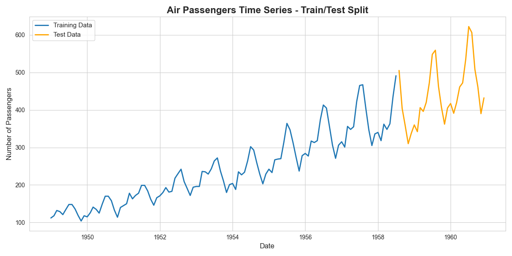

The plots below show the moving average and moving variance of the training data, providing evidence of the non-stationarity of the data which will next be more formally tested.

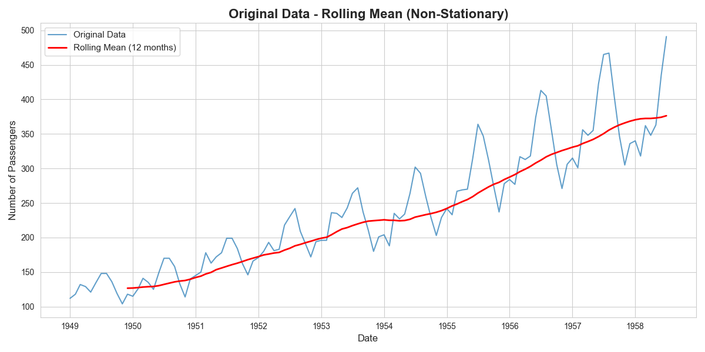
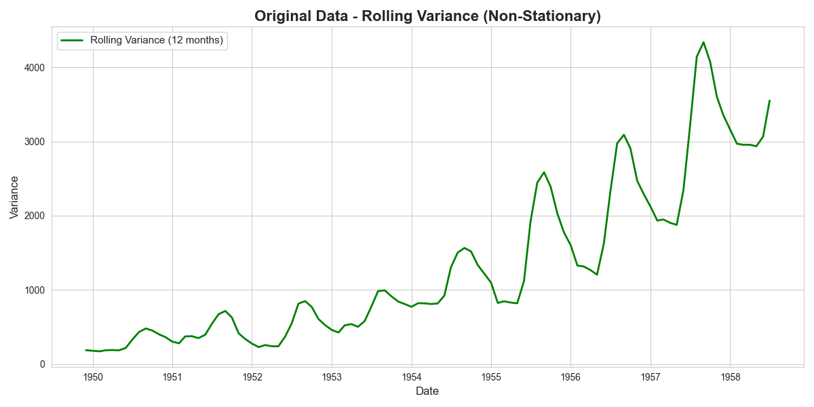

### Stationarity
The Augmented Dickey-Fuller (ADF) test was applied to the original training data to test for stationarity, where the null hypothesis (H₀) is that the data is non-stationary.  This produced an ADF test statistic = -0.3569, which produces a p-value of 0.917, therefore there is insufficient evidence to reject to null hypothesis and there is evidence that the data is non-stationary, and differencing is required.

With first order differencing applied to the data, the ADF test was applied returning a p-value = 0.106, which meant that we couldn't reject the null-hypothesis, but suggested that there is weak stationarity in the data after first order differencing, and suggesting further differencing could be applied and analysed.

From the previous plots there was evidence that the variance wasn't stable, and as such three separate transformation methods were applied to stabilise the data prior to first order differencing.  The three transformations applied were Log Transformation, Square-Root Transformation and Box-Cox Transformation.  The ADF test results of applying each of these prior to first order differencing were:

* Log Transformation + First order differencing - p-value = 0.086 - The null hypothesis of non-stationarity cannot be rejected, but this suggests weak stationarity, and suggests the log transformation improves the stationarity  
* Square-Root Transformation + First order differencing - p-value = 0.046 - The null hypothesis of non-stationarity can be rejected, and this is evidence of stationarity.  We can conclude that the square-root transformation improves the stationarity  
* Box-Cox Transformation + First order differencing - p-value = 0.084 - The null hypothesis of non-stationarity cannot be rejected, but this suggests weak stationarity, and suggests the Box-Cox transformation improves the stationarity

These findings will be useful when the ARIMA function is applied later, where the differencing relates to the **d** parameter.  The following plots show the data after first order differencing, and the data after the square-root transformation with first order differencing applied.

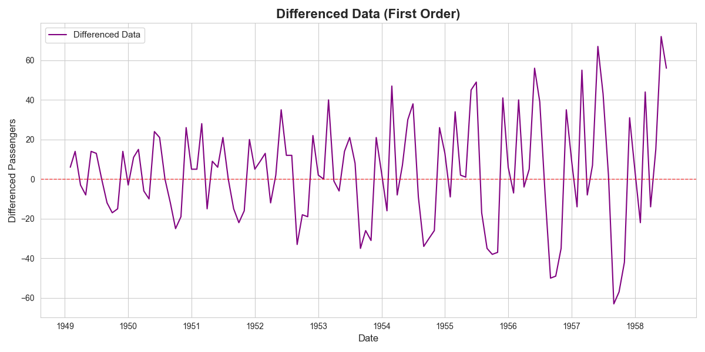  
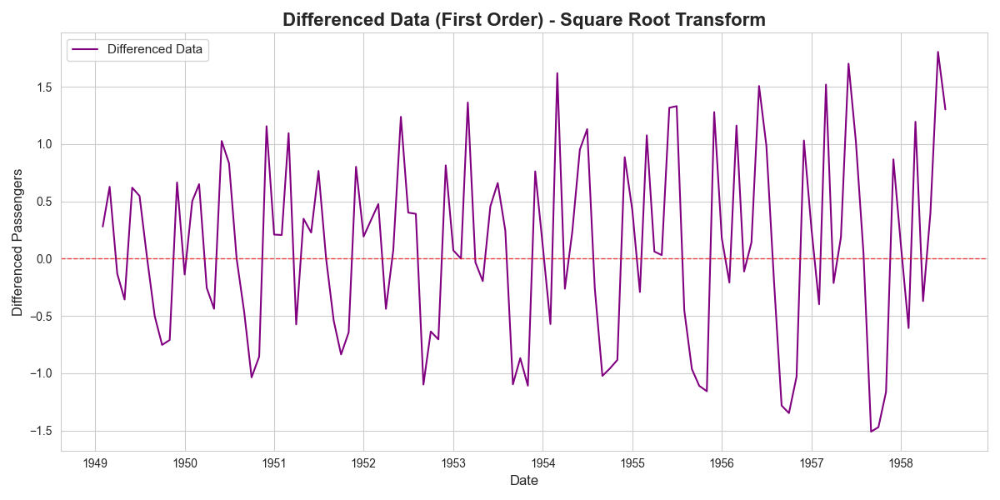  

It should be remembered that the stabilising of the data is undertaken in order to provide better results in the AR (AutoRegressive) and MA (Moving Average) stages of ARIMA.

Results from the project related to the business objective.  

### Auto-Regression:

This step is primarily used to determine the number of lags (past values of the time series) to include in the model, related to auto-regression.  This is the **p** parameter in the ARIMA model. The Partial Autocorrelation Function (PACF) is applied to the first order differenced data, to generate the PACF plot, which visualises the influence of lagged values on an observation.  

The plot below shows the PACF values for each lag, which visually implies the most significant lag is 12 - which logically is consistent with the visuals of the passenger volume plots which imply some seasonality of 12 months.  This can be further tested by using different **p** values in the ARIMA model.  

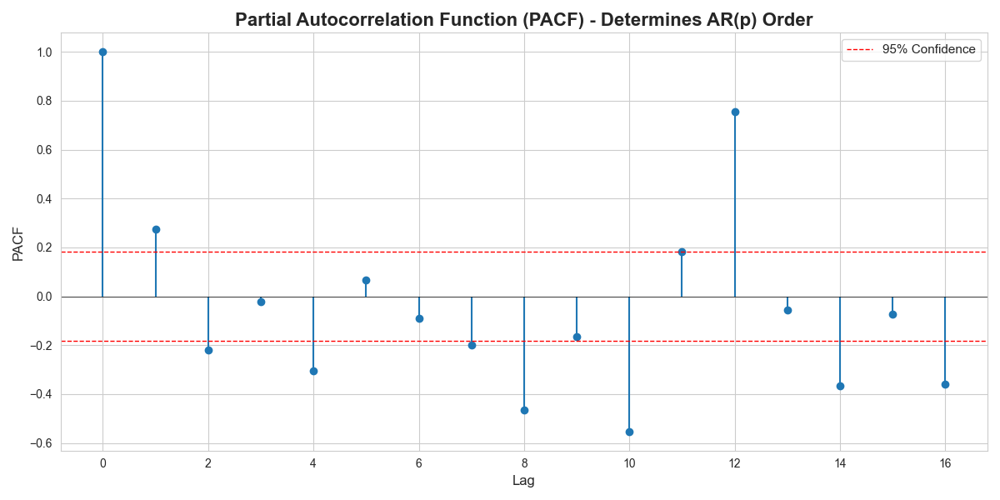  

### Moving Averages:

This step analyses the number of lags to be used in the ARIMA model in relation to moving averages.  This is the **q** parameter in the ARIMA model.  The Autocorrelation Function (ACF) is apllied to the first order differenced data, to generate the ACF plot, which visualises the influence of lagged values on an observation.  

The plot of AACF values below, similar to the PACF plot, visually suggests that the most significant lag is also 12, which logically makes sense given that there is evidence of 12 month seasonality.

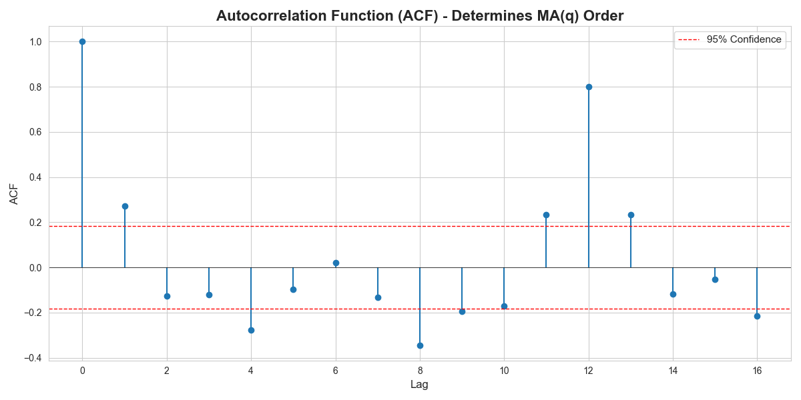  

### ARIMA models:

The workflow developed supports ARIMA modelling with any values of parameters **p**, **d** and **q**, and also supports transformations being applied to the data to stabilise the variance.  For each model generated, predicted passenger volumes for the next 29 months are generated which can be tested against the actual values, to determine accuracy and quality metrics of the model.

Initially, the ARIMA model was applied with **un-transformed** data and practical baseline parameters of **(p, d, q) = (12, 1, 12)**.  This results in a prediction as shown in the plot below, along with plots of the residuals.  The evaluation of the model determined the key values as:

* R² =  0.724 (i.e. 72.4% of all variance can be explained by the model)  
* Mean Absolute Error (MAE) = 32.3 (i.e. are incorrect by an average of 32)
* Root Mean Squared Error (RMSE) = 41.0

An interesting finding is that the plots below highlight that the majority of predictions are less than the true values, which is very clear from the histogram of the residuals.

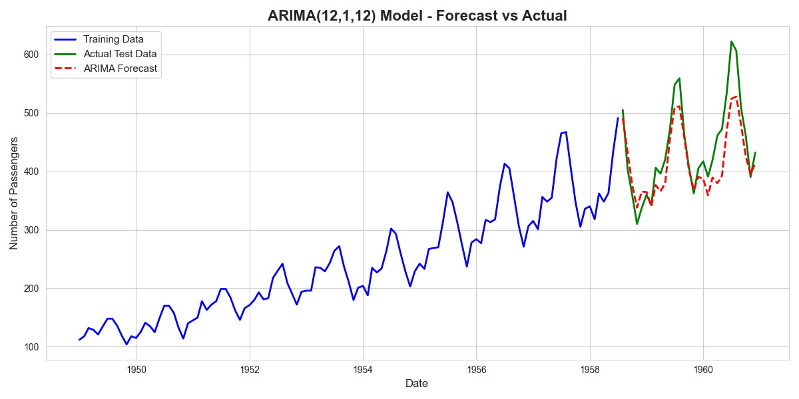

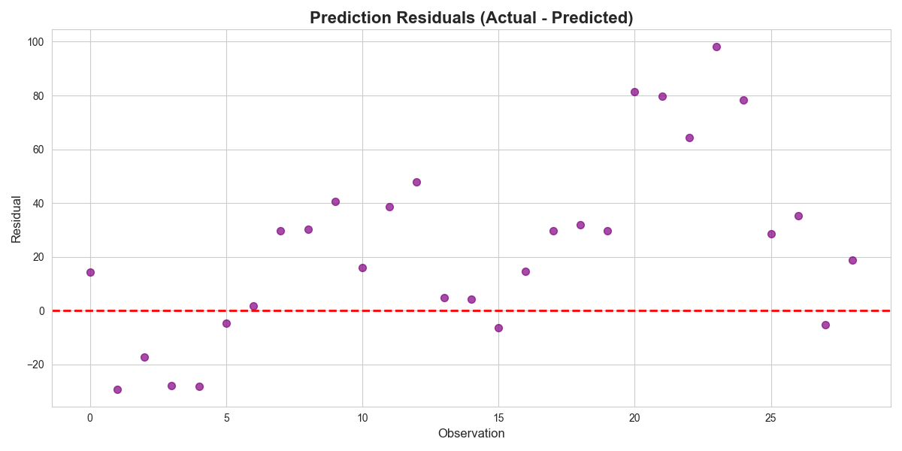

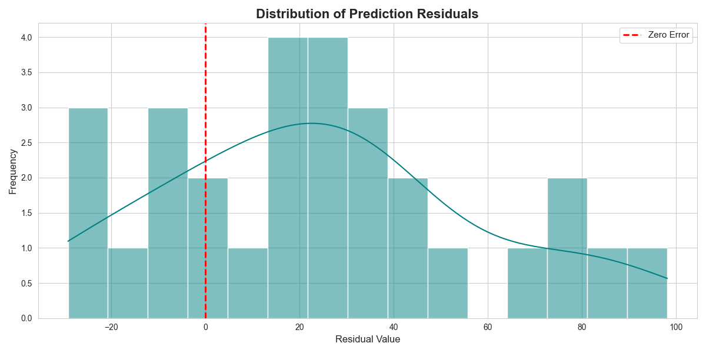

Multiple versions of the ARIMA model were run, changing the p, d, q values as well as trying different transformations to stabilise the variance.  Not all of these are described or visualised here for simplicity, but the key findings are:

* Using p and q value to 12 provide the optimal ARIMA model accuracy
* Increasing d from 1 to 2 improves the model accuracy (i.e. second order differencing produces better results than first order differencing)
* The application of each of the three of the variance-stabilising transformations improve the model accuracy
* The best performing model was using the Box-Cox Transform to stabilise the variance (where the lambda value in the Box-Cox Transform is 0.04) and ARIMA parameters of **(p, d, q) = (12, 2, 12)**.

Plots of the predictions of the best-performing model are below.  The model accuracy metrics were:

* R² =  0.947 (i.e. 94.7% of all variance can be explained by the model)  
* Mean Absolute Error (MAE) = 14.9 (i.e. are incorrect by an average of ~15)
* Root Mean Squared Error (RMSE) = 18.0

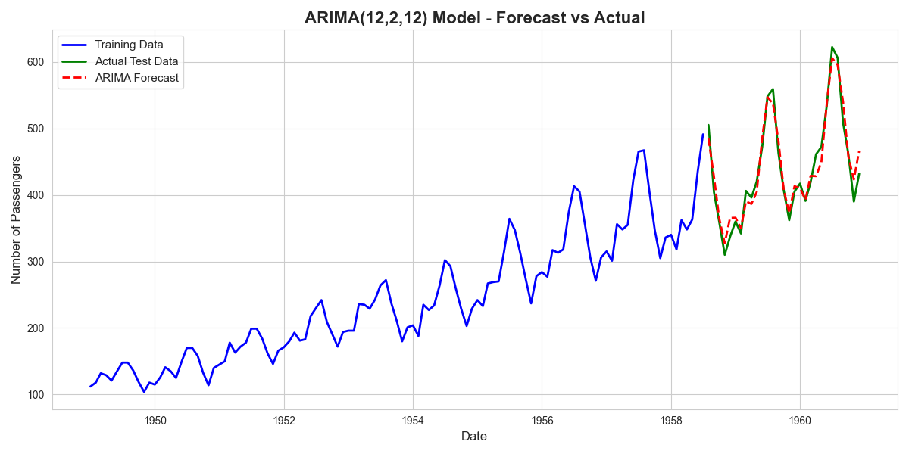

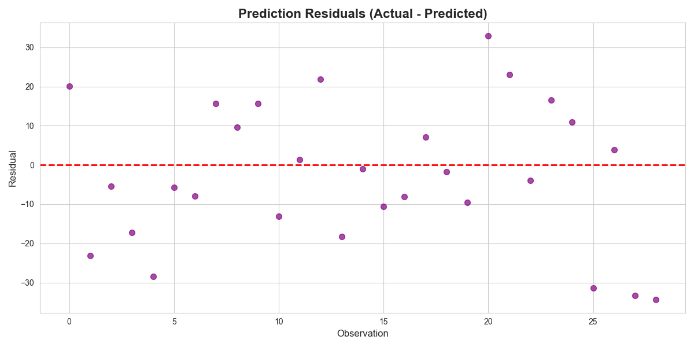

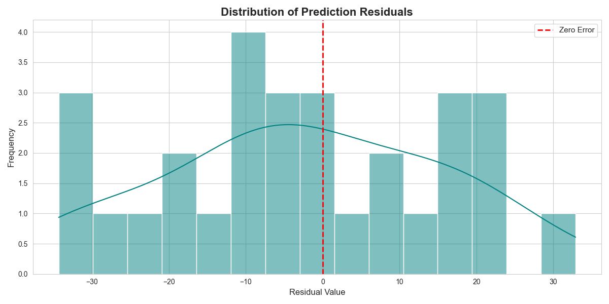  

By comparing the three plots above for the optimal ARIMA model, to the baseline model, it is visible that the prediction is closer to the actual test data.  The plot of the residuals also shows that the errors are smaller, with a more even split of positive and negative errors.

### Conclusions:

The conclusions of the analysis of the ARIMA model for predicting future value include:

* ARIMA methods including transformation of data to stabilise variance and mean values allows highly accurate modelling of time-series data including trends and seasonality.
  * The model accurately captures both the overall increasing trend and 12 monthly seasonality.  
* Low error margins can be achieved, supporting business intelligence and decision-making. 
* ARIMA modelling is very flexible and easy to be repeated and re-applied to new data to refresh predictions.  

## Next steps:  

With any analysis it is important to assess how the model and application of the analytical methods can be used and evolved to support the business goals and business decisions and yield tangible benefits.

Recommendations to improve and manage the model include:

* Consider the application of SARIMA techniques explicitly to model seasonality.  
* Research the use of alternative variance stabilisation methods to improve the prediction accuracy.  
* Track model performance against actual values, and retrain the model where required, for example model accuracy decreases.  
* Assess the possibility of migrating to other Machine Learning models to generate predictions.

## Python code:
You can view the full Python script used for the analysis here: 
[View the Python Script](/ARIMA_AirPassengers_v3.py)
