---

layout: default

title: Air Passengers Time-Series Prediction (ARIMA)

permalink: /arima/

---

## Goals and objectives:

The business objective is to predict monthly air passenger volumes using historical observations. The Autoregressive Integrated Moving Average (ARIMA) technique was selected for this purpose as it is a well-established statistical method for time-series forecasting, capable of modelling both trend and seasonality within sequential data to build accurate predictive models.

ARIMA is a composite model comprising three components: AR (AutoRegressive), I (Integrated), and MA (Moving Average). Each component addresses a distinct characteristic of the time series, and together they determine how the model captures patterns in historical data to generate forecasts. The three parameters that govern these components — **p, d, and q** — must be determined prior to modelling, and their correct identification is central to achieving accurate predictions.

A primary objective of this project is to treat ARIMA as a transparent, step-by-step analytical process rather than a black-box technique. Each of the three ARIMA components is addressed in isolation before the model is assembled, with the purpose of building genuine understanding of what each parameter controls and how it is identified from the data. The workflow proceeds through the following stages:

* **Descriptive Analysis and Seasonal Decomposition** — visualising and decomposing the time series to identify trend, seasonality, and residual components, providing the analytical foundation for all subsequent steps
* **Stationarity Assessment (d)** — formally testing stationarity using the Augmented Dickey-Fuller (ADF) and Kwiatkowski–Phillips–Schmidt–Shin (KPSS) tests, and determining the order of differencing required. Variance instability in the data motivates investigation of three pre-transformation methods — Log, Square-Root, and Box-Cox — each evaluated for its effect on stationarity
* **Auto-Regression Order (p)** — using the Partial Autocorrelation Function (PACF) to determine the number of autoregressive lags to include in the model
* **Moving Average Order (q)** — using the Autocorrelation Function (ACF) to determine the number of moving average lags to include in the model
* **Model Fitting and Validation** — building ARIMA models using the identified parameters, evaluating forecast accuracy against a held-out test set, and validating the model using in-sample residual diagnostics including the Ljung-Box test

The dataset used is the classic Box-Jenkins Air Passengers dataset, comprising 144 monthly observations of international airline passenger volumes from January 1949 to December 1960. The data exhibits a clear upward trend and strong 12-month seasonality, with the amplitude of seasonal fluctuations growing proportionally to the level of the series — a pattern of multiplicative seasonality that makes variance stabilisation a necessary pre-processing step.

Two models are developed and compared within the project. A baseline model using untransformed data with parameters (**p, d, q**) = (**12, 1, 12**) is presented first, establishing a reference point. An optimal model incorporating Box-Cox variance stabilisation and parameters (**p, d, q**) = (**12, 2, 12**) is then developed, with the improvement in accuracy directly attributable to the analytical decisions made at each stage of the process. The best-performing model achieved an R² of 0.947, accounting for 94.7% of the variance in passenger volumes across the test period, with a Mean Absolute Error of 14.9 passengers per month.


## Application:  

The Autoregressive Integrated Moving Average (ARIMA) model is a powerful statistical technique for time series forecasting, making it invaluable across various business sectors. By decomposing and modelling the trend, seasonality, and random noise in historical data, ARIMA provides precise, short-to-medium-term predictions that enable proactive strategic and operational decisions.

ARIMA techniques can be applied to many real-world scenarios, yielding benefits across numerous industries by providing insights and supporting decision-making.  Example benefits include the following:

🏦 **Finance: Risk Management and Market Prediction** - ARIMA is used to forecast highly volatile and continuous data streams, supporting investment and risk management strategies.
  * Short-Term Price Forecasting - predicting stock prices and exchange rates to inform trading decisions and setting market positions
  * Volatility Forecasting - modelling the variation of financial time series, to predict period of high market risk
  * Financial Metric Forecasting - Predicting key economic indicators like inflation rates or interest rate movements to guide long-term financial planning and capital allocation.

🏭 **Manufacturing: Production & Quality Optimisation** - ARIMA models drive efficiency and quality control in manufacturing by providing accurate, timely projections of resource needs and process stability.
  * Raw Material Procurement	- Forecasting the future demand for key raw materials with high accuracy, allowing purchasing managers to optimise order quantities, negotiate better prices, and minimize storage costs.
  * Inventory & Production Scheduling - Used to predict the required inventory levels for goods, leading to optimised production runs, reduced idle time, and lower costs associated with overstocking.
  * Process Control	- Monitoring critical process variables (e.g., temperature, pressure, chemical concentration) to predict when the process is likely to fail or experience issues based on historical patterns, supporting preventative maintenance.

🛍️ **Retail: Demand Planning and Supply Chain Efficiency** - ARIMA is used to capture seasonality is key to maximizing sales and managing costs.
  * Demand Forecasting	- Accurately predicting weekly or monthly sales volume for individual products or entire categories, crucial for seasonal events like holidays (e.g., Christmas) where demand spikes significantly.
  * Preventing Stockouts/Oversupply -	Precise forecasts ensures popular items are in stock to meet demand (improving customer satisfaction) and prevents over-ordering, reducing the capital tied up in slow-moving inventory.
  * Staff Scheduling -	Forecasting customer traffic or required checkout volume by hour or day, enabling managers to align staff levels with anticipated demand, reducing labour costs and wait times.

💻 **Technology: Capacity Planning and Service Reliability** - ARIMA is vital for managing infrastructure and service quality in response to fluctuating usage.
  * Server Load & Traffic Prediction	- Forecasting website traffic, API call volume, or server CPU load to predict when capacity will be exceeded. This is essential for proactive scaling of cloud resources (AWS, Azure, etc.) to prevent service outages.
  * Resource Allocation	- Predicting the demand for storage, bandwidth, or computing resources on a weekly or monthly basis to guide hardware procurement and capacity planning, optimising capital expenditure spending.
  * System Performance	- Forecasting trends in system metrics like network latency or error rates. If the forecast shows a steady upward trend in latency, it flags a need for system optimisation before performance degrades noticeably.

## Methodology:  

A workflow was developed in Python using the statsmodels, scipy, scikit-learn, pandas, and numpy libraries, with matplotlib and seaborn for visualisation. The script is designed to be iterative — parameter values and transformations are user-defined, allowing different configurations to be evaluated systematically rather than producing a single automated output.

The dataset of monthly air passenger totals was split chronologically into a training set comprising the first 80% of observations (115 months) and a test set comprising the most recent 20% (29 months). Chronological splitting is essential for time-series data to prevent data leakage — random splitting would allow future observations to inform the model, producing misleadingly optimistic results.


### Descriptive Analysis and Seasonal Decomposition

The full time series was plotted to visualise the overall structure prior to any transformation or modelling. A multiplicative seasonal decomposition was then applied to the training data using a period of 12 months, separating the series into trend, seasonal, and residual components. Multiplicative decomposition is appropriate here because the amplitude of the seasonal fluctuations grows in proportion to the level of the series — a characteristic visible in the raw data and confirmed by the decomposition output. Monthly seasonal indices were extracted from the decomposition to quantify the magnitude of within-year variation.

Rolling statistics (12-month rolling mean and variance) were computed over the training data to provide a visual assessment of non-stationarity prior to formal testing.

### Stationarity and Differencing (d)
Stationarity — the requirement that the statistical properties of the series do not change over time — is a prerequisite for the AR and MA components of ARIMA. Two complementary formal tests were applied: the Augmented Dickey-Fuller (ADF) test, where the null hypothesis is non-stationarity, and the KPSS test, where the null hypothesis is stationarity. Using both tests together provides stronger evidence than either alone, as they approach the question from opposing directions.

First and second-order differencing were both evaluated, with ADF and KPSS results reported for each. This analysis directly informs the choice of **d** in the ARIMA model.

The original data exhibits growing variance — a form of heteroscedasticity that differencing alone does not resolve. Three variance-stabilising transformations were therefore investigated prior to differencing: Log Transformation, Square-Root Transformation, and Box-Cox Transformation. For each, the differenced series was tested for stationarity using the ADF test, and the results compared in a summary chart showing all four differenced series side by side. The Box-Cox transformation determines its power parameter λ from the data directly, making it the most flexible of the three methods.

### Auto-Regression Order (p)
The Partial Autocorrelation Function (PACF) was applied to the first-order differenced training data to identify the number of autoregressive lags to include in the model. The PACF measures the correlation between an observation and a lagged value after removing the influence of all intermediate lags, isolating the direct relationship at each lag. Significant lags — those exceeding the 95% confidence interval — indicate which past values carry predictive information. The value of **p** was selected based on visual assessment of the PACF plot rather than an automated rule, consistent with the exploratory intent of the project.

### Moving Average Order (q)
The Autocorrelation Function (ACF) was applied to the same differenced series to determine the moving average order. Unlike the PACF, the ACF measures total correlation at each lag including indirect effects, and its pattern of significant lags indicates how many past forecast errors should be incorporated into the model. The value of **q** was selected on the same basis as **p**.

A confirmatory ACF/PACF analysis was additionally performed on the Box-Cox transformed, first-order differenced series — the series that enters the optimal model — to verify that the parameter conclusions are consistent between the exploratory and model-ready series.

### Model Fitting and Evaluation

ARIMA models were constructed using the statsmodels ARIMA implementation and fitted on the training data. For each model configuration, 29-month forecasts were generated for the test period using get_forecast(), which returns both point estimates and 95% prediction intervals. Where a variance-stabilising transformation was applied, forecasts and confidence intervals were inverse-transformed back to the original passenger scale before evaluation.

Model performance was assessed using four metrics against the held-out test set: Root Mean Squared Error (RMSE), Mean Absolute Error (MAE), R² Score, and Mean Absolute Percentage Error (MAPE). In addition to test-set evaluation, in-sample residual diagnostics were conducted on the fitted model using the statsmodels plot_diagnostics() output and the Ljung-Box test. The Ljung-Box test formally assesses whether residual autocorrelation remains after fitting — a well-specified model should produce residuals consistent with white noise, indicating that the model has captured all exploitable structure in the training data.


## Results:

### Data Overview and Seasonal Decomposition:

The Air Passengers dataset comprises 144 monthly observations spanning January 1949 to December 1960, split into 115 training observations and 29 test observations. The raw series exhibits a clear upward trend throughout the period alongside strong 12-month seasonality, with passenger volumes consistently peaking in summer months and troughing in winter. Critically, the amplitude of seasonal fluctuations increases proportionally with the level of the series — a pattern of multiplicative seasonality that has direct implications for the pre-processing approach.

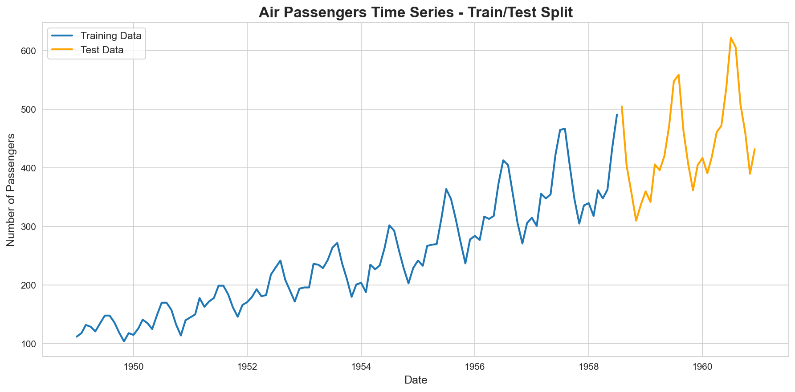

Multiplicative seasonal decomposition of the training data separates the series into its constituent components. The trend component confirms sustained growth across the period. The seasonal component quantifies the regular within-year pattern, with July and August consistently running approximately 20% above the prevailing trend, while November and January fall roughly 10% below it. The residual component shows no obvious remaining structure, suggesting the decomposition has cleanly separated the primary signals.

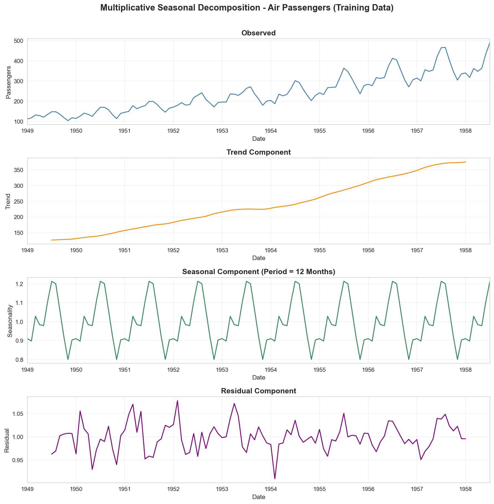

### Stationarity Assessment:

Stationarity — the requirement that the mean, variance, and autocorrelation structure of the series remain constant over time — is a prerequisite for ARIMA modelling. The ADF and KPSS tests were applied in combination, as they test opposing null hypotheses and together provide stronger evidence than either alone.

Applied to the raw training data, both tests confirm non-stationarity. The 12-month rolling mean rises steadily throughout the series, and the rolling variance increases substantially over time, confirming that neither the mean nor the variance are constant.

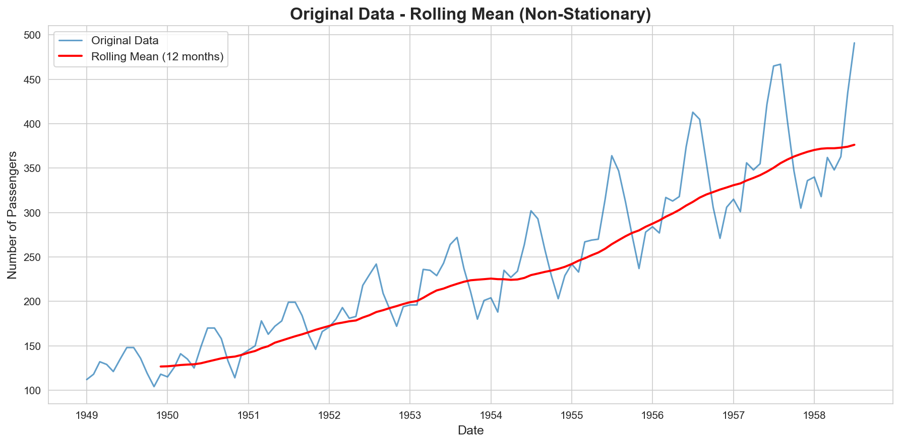

After first-order differencing, the ADF test returns a p-value of 0.106, which narrowly fails to reject the null hypothesis of non-stationarity at the 5% level. The KPSS test at d=1 similarly indicates that further differencing may be beneficial. Second-order differencing (d=2) brings both tests into agreement, with ADF and KPSS results both confirming stationarity — analytically supporting the use of d=2 in the optimal model.

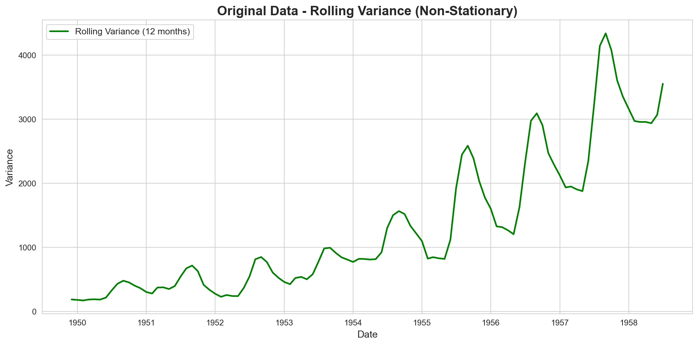

### Variance Stabilisation:

The growing seasonal amplitude observed in the raw data represents heteroscedasticity — non-constant variance — which differencing alone does not resolve. Three variance-stabilising transformations were evaluated prior to differencing: Log, Square-Root, and Box-Cox. For each, the ADF test was applied to the first-order differenced series and the residual variance recorded.

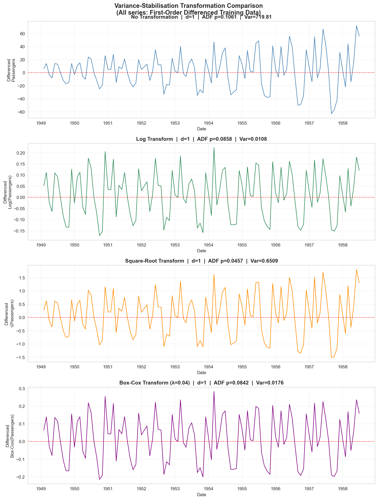

All three transformations produce a stationary series at d=1, outperforming the untransformed series which requires d=2 to achieve stationarity. The Box-Cox transformation — which determines its power parameter λ directly from the data — produces the lowest residual variance of the three, making it the strongest candidate for use in the ARIMA model. These findings inform the two models presented in this project: a baseline using untransformed data with d=1 (which required p,d,q = 12,1,12 to be competitive), and an optimal model applying Box-Cox transformation with d=2, using p,d,q = 12,2,12.

### Parameter Identification — PACF and ACF

With the differencing order established, the AR order (p) and MA order (q) were identified from the Partial Autocorrelation Function (PACF) and Autocorrelation Function (ACF) respectively, computed on the first-order differenced untransformed series as an exploratory step.

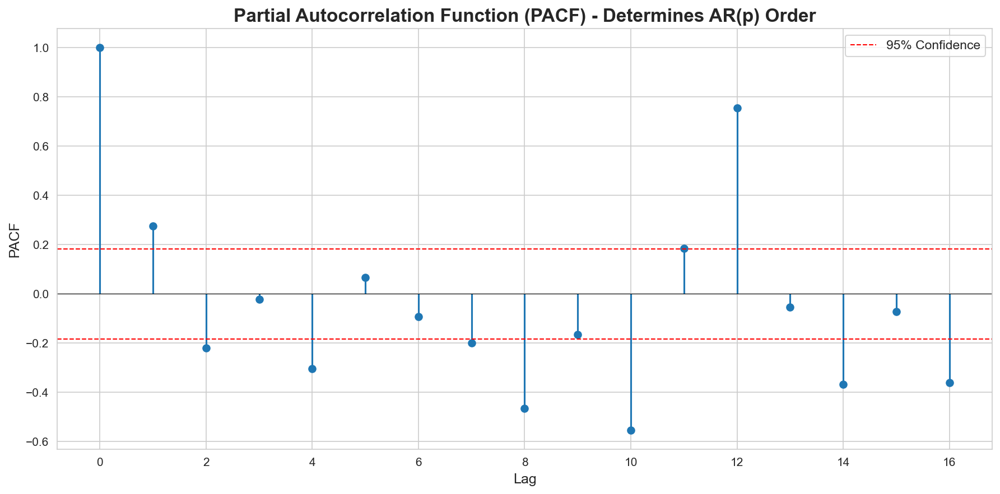

The PACF shows a dominant significant spike at lag 12, with lags 1 through 11 largely within the confidence interval. This pattern is characteristic of strong annual seasonality and directly indicates p=12 — the model should incorporate autoregressive terms reaching back 12 months.

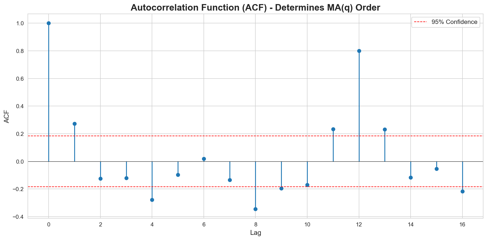

The ACF shows a similar pattern, with a prominent spike at lag 12 that decays only slowly at multiples of 12. This seasonal autocorrelation structure points to q=12. The gradual decay rather than sharp cutoff is consistent with a mixed ARIMA process where both AR and MA terms contribute.

A confirmatory ACF/PACF analysis on the Box-Cox transformed series produced identical conclusions, confirming that the parameter selection is robust to the choice of transformation.

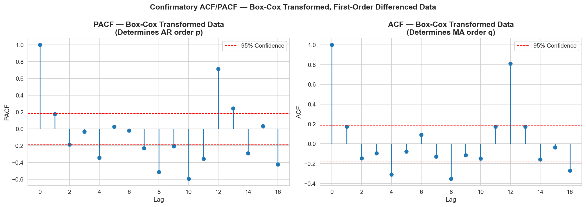

### Baseline Model — ARIMA(12,1,12), Untransformed Data

The baseline model was fitted to the untransformed training data using p,d,q = (12, 1, 12). The forecast and 95% prediction interval for the 29-month test period are shown below.

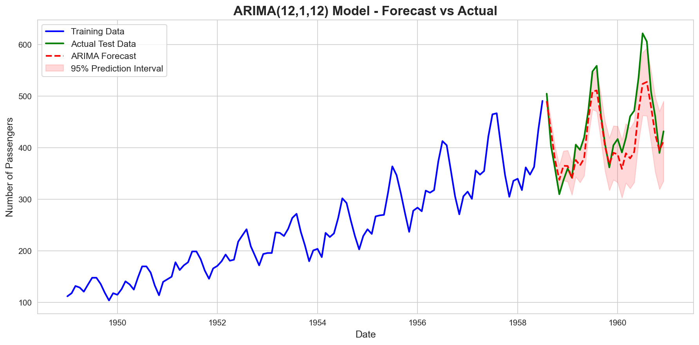

Performance Metrics:  
  Mean Squared Error (MSE): 1684.04  
  Root Mean Squared Error (RMSE): 41.04  
  Mean Absolute Error (MAE): 32.34  
  R² Score: 0.7241  
  Mean Absolute Percentage Error (MAPE): 6.96%  

The model captures the broad seasonal shape and upward trend across the test period. However, the prediction interval widens noticeably towards the later months of the forecast horizon, reflecting increasing uncertainty — expected behaviour for an ARIMA model forecasting 29 steps ahead. 

In-sample residual diagnostics confirm that the model is adequately specified. The Ljung-Box test returns p > 0.05, indicating that residuals are consistent with white noise and that no significant autocorrelation structure remains unexploited.

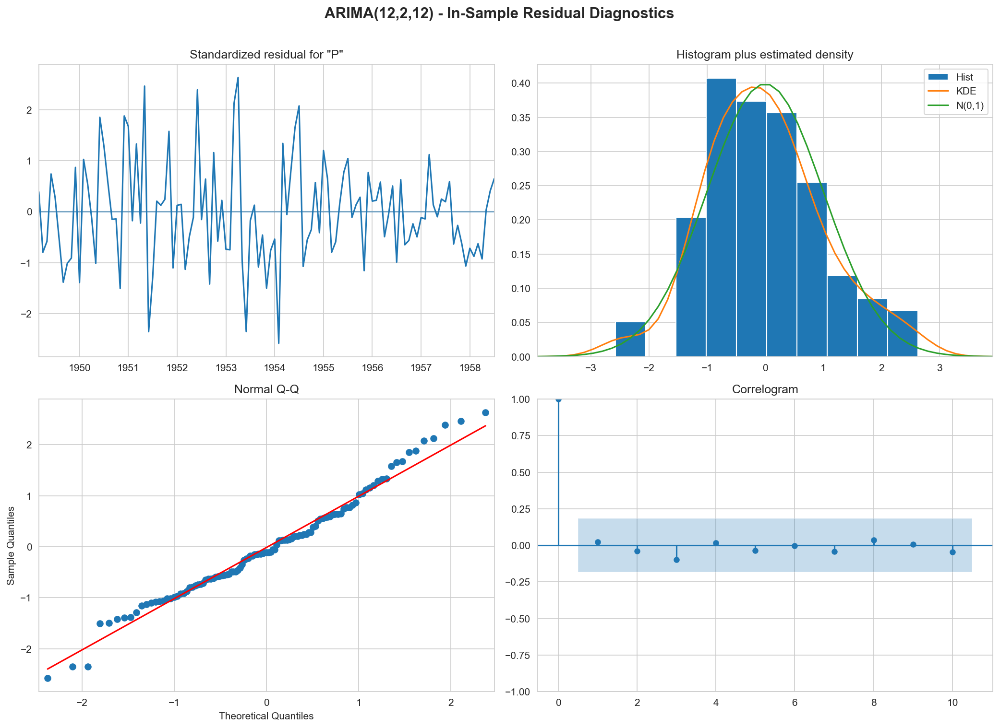

### Optimal Model — ARIMA(12,2,12), Box-Cox Transformation

The optimal model applies Box-Cox variance stabilisation prior to fitting, and uses d=2 as supported by the stationarity analysis. Forecasts were generated on the transformed scale and inverse-transformed back to the original passenger units before evaluation.

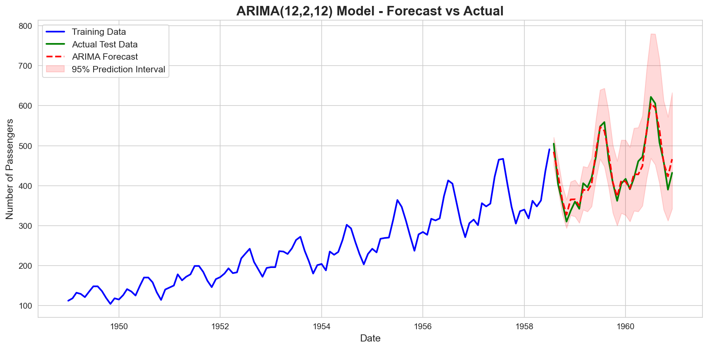

Performance Metrics:
  Mean Squared Error (MSE): 323.26
  Root Mean Squared Error (RMSE): 17.98
  Mean Absolute Error (MAE): 14.89
  R² Score: 0.9470
  Mean Absolute Percentage Error (MAPE): 3.46%

The optimal model delivers a meaningful improvement across all four metrics. The Box-Cox transformation stabilises the seasonal variance before modelling, allowing ARIMA to fit the autocorrelation structure on a more uniformly conditioned series. The result is tighter predictions — particularly in the later months of the forecast horizon where the baseline model diverges most from the actuals.

In-sample residual diagnostics for the optimal model again confirm white noise residuals, with the Ljung-Box test returning p > 0.05.


### Model Comparison

```
Model    Transformation p,d,q     RMSE    MAE    R²     MAPE  
Baseline None           (12,1,12) 41.0    32.3   0.724  6.96%  
Optimal  Box-Cox        (12,2,12) 18.0    14.9   0.947  3.46%
```

The improvement from baseline to optimal is directly attributable to the analytical steps taken in the methodology — variance stabilisation via Box-Cox and the use of second-order differencing supported by both the ADF and KPSS tests. This demonstrates that systematic pre-processing decisions, grounded in statistical evidence, translate into measurable gains in forecasting accuracy.


## Conclusions:

The conclusions of the analysis of the ARIMA model for predicting future value include:

* ARIMA methods including transformation of data to stabilise variance and mean values allows highly accurate modelling of time-series data including trends and seasonality.
  * The model accurately captures both the overall increasing trend and 12 monthly seasonality.  
* Low error margins can be achieved, supporting business intelligence and decision-making. 
* ARIMA modelling is very flexible and easy to be repeated and re-applied to new data to refresh predictions.  

## Next steps:  

With any analysis it is important to assess how the model and application of the analytical methods can be used and evolved to support the business goals and business decisions and yield tangible benefits.

Recommendations to improve and manage the model include:

* Consider the application of SARIMA techniques explicitly to model seasonality.  
* Research the use of alternative variance stabilisation methods to improve the prediction accuracy.  
* Track model performance against actual values, and retrain the model where required, for example model accuracy decreases.  
* Assess the possibility of migrating to other Machine Learning models to generate predictions.


## Python code:
You can view the full Python script used for the analysis here: 
[View the Python Script](/ARIMA_AirPassengers_v4.py)
