---

layout: default

title: E-Commerce Transactional Data (Association Rule)

permalink: /association-rule/

---

# This project is in development

## Goals and objectives:

For this portfolio project, the simulated business scenario is regarding a ficticious e-commerce retailer, with the goals of uncovering hidden patterns in customer purchasing behaviour and translate them into actionable commercial insights, enabling tangible business benefits.  This demonstrates the practical application of Association Rule Learning on real-world transactional data to meet the goals and provide valuable insight to the business, by understanding patterns of multiple products purchased together within the same transaction. 

An objective is not simply to generate association rules, but to demonstrate the critical thinking required to validate their quality, understand their limitations, and prioritise those with genuine commercial relevance using metrics including lift, confidence, support, leverage, and conviction.  
 
A secondary objective is to illustrate how data science can directly inform business strategy in a retail context. The insights derived from this analysis have tangible applications across multiple commercial functions — from powering product recommendation engines and designing promotional bundles, to informing inventory planning and guiding targeted email marketing campaigns. 

By grounding every analytical decision in a business rationale, this project aims to demonstrate not only technical proficiency in Python, FP-Growth modelling, and data visualisation, but also the ability to communicate findings in a way that is meaningful to both technical and non-technical stakeholders. Ultimately, the project reflects a core principle of applied data science: that the value of a model lies not in its construction, but in the decisions it enables.

## Application:  

Association Rule Learning is an unsupervised machine learning technique used to discover interesting relationships, patterns, and dependencies between variables in large datasets.  

At its core, the algorithm identifies "if-then" relationships — for example, if a customer buys product A, then they are likely to also buy product B. 

These rules are evaluated using three key metrics:  
* **support**: how frequently the itemset appears in the dataset  
* **confidence**: the probability that the consequent occurs given the antecedent  
* **lift**: how much more likely the association is compared to random chance  

The most well-known algorithm for implementing this technique is the Apriori algorithm, though more efficient alternatives like FP-Growth are widely used in practice.  

In a real-world retail context, Association Rule Learning is the engine behind product recommendation engines and physical store layout optimisation. A supermarket chain, for example, could apply this technique to millions of transaction records to discover that customers who purchase nappies and baby formula on weekday evenings also frequently purchase beer.  This seemingly counterintuitive insight — famously observed in early retail analytics — could inform targeted promotions, shelf placement decisions, or personalised email campaigns.  

Beyond retail, the technique finds application in many other sectors:
* **healthcare**: identifying co-occurring symptoms or medications
* **cybersecurity**: detecting patterns in network intrusion events
* **web analytics**: understanding click-path behaviour across a site
* **retail**: detecting co-purchased items, supporting product bundling offers
* **technology**: understanding user behaviours to support on-boarding and retention
* **science**: in weather prediction, discover associations between atmospheric variables — such as sea surface temperature, humidity, and wind patterns — that tend to precede extreme weather events, contributing to improved early warning systems

## Methodology:  

This portfolio project uses the 'Online Retail II dataset', available at Kaggle [here](https://www.kaggle.com/datasets/jillwang87/online-retail-ii?select=online_retail_10_11.csv)  This is a genuine record of over 540k transactions from a UK-based e-commerce retailer — the project moves through the full analytical lifecycle: from raw data ingestion and rigorous preprocessing, through exploratory analysis and model development, to the interpretation and business contextualisation of results. 

The methodology follows the end-to-end data science workflow, implemented in Python using the mlxtend, pandas, seaborn, and numpy libraries, progressing from raw data ingestion through to the extraction and communication of business insight across eight structured stages.

**Data Loading and Initial Exploration**: The dataset is loaded from CSV, with an initial review of shape, data types, descriptive statistics, and missing value counts conducted to establish a baseline understanding of data quality.  
**Data Validation and Pre-Processing**: Seven sequential cleaning steps are applied to remove records associated to cancelled orders, missing Customer IDs, negative and zero quantities, invalid prices, non-product stock codes, non-UK transactions, and single-item invoices. Row counts are logged at each step to maintain full transparency over the impact of each decision.  
**Exploratory Data Analysis**: Visualisations are produced building a rounded picture of customer behaviour before modelling begins.  covering top-selling products, monthly transaction volumes, day-of-week purchasing patterns, monthly revenue, and basket size distribution  
**Basket Construction**: The cleaned transaction data is pivoted into a binary invoice-by-product matrix, where each cell is encoded as True or False to indicate whether a given product was purchased within that transaction, producing the input format required by the FP-Growth algorithm.  
**Frequent Itemset Mining**: The FP-Growth algorithm is applied to the basket matrix with a minimum support threshold of 2%, chosen through sensitivity analysis as a pragmatic balance between discovery breadth and result quality, to identify all product combinations appearing frequently enough across transactions to be commercially meaningful.  
**Association Rule Generation**: Rules are derived from the frequent itemsets with a minimum lift of 1.5 and minimum confidence of 0.20, with all rules enriched with support, confidence, lift, leverage, and conviction metrics to enable multi-dimensional evaluation of rule strength.  
**Model Validation**: Six validation checks are applied covering trivial rule filtering, leverage confirmation, conviction scoring, support stability, reciprocal rule detection, and a parameter sensitivity analysis across five support thresholds, collectively confirming that the retained rules represent genuine and robust product associations rather than statistical artefacts.  
**Business Insight Extraction and Visualisation**: The strongest rules are surfaced and visualised through rankings by lift and confidence, a lift distribution plot, a top antecedents chart, and a product co-occurrence heatmap, with each output interpreted in terms of its direct application to retail use cases including product recommendations, promotional bundling, and inventory planning.  

## Results:

**Data Validation and Pre-Processing**  
The data was pre-processed to remove records deemed as not adding analytical value, or potentially liable to produce misleading or incorrect results.  In a real-wrold scenario, this is subject to many factors including; business objectives, analysis goals and constraints and features or issues with the data.  For example, records associated to non-UK purchases were excluded from this analysis, but could be included given a different business scoping or goal.  One subtle rule applied that is of note, is that invoices containing a single purchased product were excluded - as this analysis finds relationships between multiple products in the same invoice, invoices containing a single product offer no analytical value.

The result of the data validation and pre-processing step is a dataset for analysis summarised as:

* Records           : 352,765
* Unique invoices   : 15,365
* Unique products   : 3,821
* Unique customers  : 3,819

**Exploratory Data Analysis**

Exploratory data analysis was conducted across five visualisations to establish an understanding of the cleaned dataset and some of the purchasing patterns within it.  The charts examine the business from multiple angles: identifying the products with the highest sales volumes, understanding how transaction activity and revenue fluctuate by time, and weekdays (relealing no activity on Saturdays), and understanding the distribution of the number of distinct products in customer baskets.  Together these charts provide the commercial context needed to interpret the association rules that follow, and surface several patterns in their own right that are directly relevant to retail planning and marketing strategy.

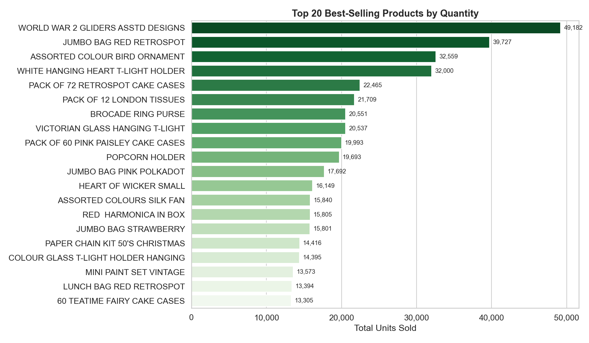

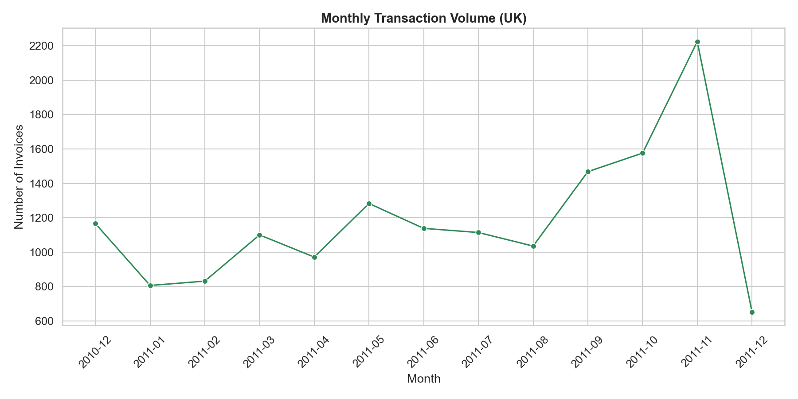

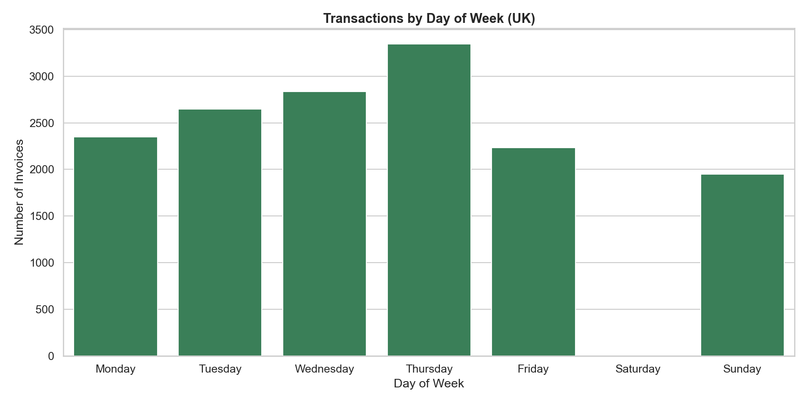

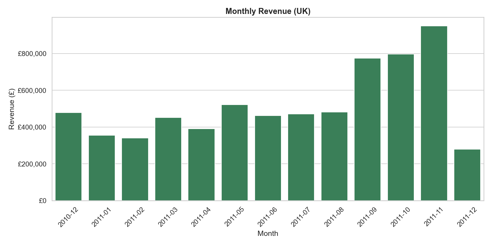

Note that for the basket distribution below, invoices with a single product have been removed from the analysis.  The frequency by basket size decreases with the increase in products in the basket.  This chart is limited to basket size of 60 for simplicity.  The largest basket size being 540 distinct products.  The mean basket size in the cleaned dataset is 22.3, with the 50 percentile (median) equal to 16.

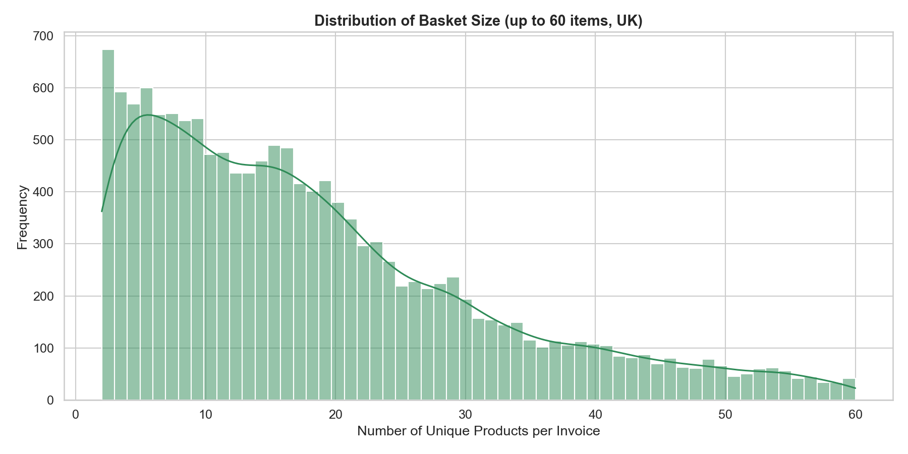

**Basket Construction**

The binary invoice-by-product matrix was created as a grid of 15,365 invoices and 3,821 unique products.  It was identified that 0.6% of the values were 1, reflecting where the product exists in the invoice.

**Frequent Itemset Mining**

Frequent itemset mining was performed on the binary basket matrix using the FP-Growth algorithm, with a minimum support threshold of 2%, meaning only product combinations appearing in at least 2% of all UK transactions were retained for further analysis.  

The algorithm identified a total of 278 frequent itemsets across multiple itemset sizes, with the distribution heavily weighted towards smaller itemsets as expected.  The itemset size distribution being:

itemset_size = 1    233  
itemset_size = 2     44  
itemset_size = 3      1  

* Size-2 itemsets represent pairs of products frequently purchased together, which account for the largest share of results,
* The count declines progressively for size-3 and above as the constraint of three or more products co-occurring within the same basket becomes increasingly restrictive.
* Size-1 itemsets are also present as a natural output of the mining process, representing individual high-frequency products that serve as the foundational building blocks from which larger itemsets are constructed
* It is the size-2 itemsets and above that form the basis of all association rules generated in the subsequent stage.

The support distribution chart confirms that the majority of frequent itemsets sit close to the 2% threshold.  A smaller number of highly prevalent itemsets achieve higher support values, indicating a core set of product combinations that are consistently purchased together across a broad proportion of the customer base.

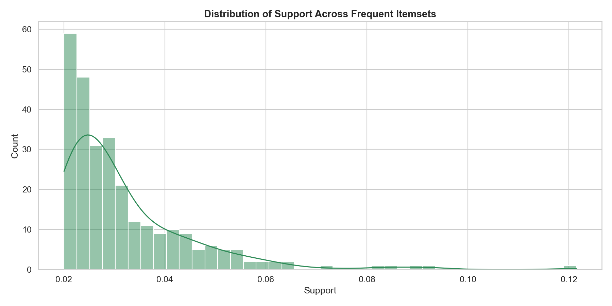

**Association Rule Generation**  

Association rules, 94 in total, were generated from the frequent itemsets using a minimum lift threshold of 1.5 and a minimum confidence of 0.20, ensuring that only rules representing a meaningful uplift in co-purchase probability above chance, and with a reasonable degree of reliability, were retained.  These are product combinations are many times more likely to be purchased together than would be expected if customer choices were made independently.

Each rule was enriched with five evaluation metrics — support, confidence, lift, leverage, and conviction — providing a multi-dimensional basis for assessing rule strength and commercial relevance.  

The three most diagnostically useful metrics are lift, confidence, and support. 

* The mean **lift** (9.44) and maximum lift (22.51) are the headline indicators of rule quality — a mean lift comfortably above 1.5 confirms that the ruleset as a whole reflects genuine purchasing associations rather than chance co-occurrence, while the maximum lift identifies the strongest individual product relationships in the data.
* Mean **confidence** (0.48) indicates how reliably the rules fire on average, with higher values suggesting that the antecedent is a dependable predictor of the consequent.
* **Support** is most informative when considered alongside lift — a rule with high lift but very low support may be statistically interesting but affects too few transactions to be commercially actionable, whereas rules combining strong lift with moderate to high support represent the most viable candidates for real-world implementation.

**Model Validation** 

Six validation checks were applied to assess the integrity and robustness of the generated ruleset.  

All retained rules carried **positive leverage** values, confirming that every association represents a co-purchase frequency genuinely above what would be expected under statistical independence, while **conviction** scores above 1.0 across the ruleset confirmed that the directional relationships implied by the rules are reliable rather than coincidental.  

The presence of **reciprocal rule pairs** — where a product association holds in both directions — provides further evidence that the strongest relationships in the data reflect robust and consistent co-purchasing behaviour rather than one-directional anomalies.  

The parameter sensitivity analysis demonstrated that rule volume responds predictably to changes in the minimum support threshold, validating that the chosen threshold of 2% sits at a sensible point in the trade-off between discovery breadth and result quality.  A threshold of 1.5% resulted in 280 rules, whereas a threshold of 2.5% produced 42 rules.  The 2% threshold produced 94 rules.  Of the 94 rules generated, the 42 with a support >= 2.5% are considered more stable than those with a support < 2%.

The **Lift versus Confidence scatter plot** reveals that the majority of rules cluster at moderate confidence levels with lift values comfortably above the 1.5 threshold, with a smaller number of high-lift outliers representing the most powerful product associations in the dataset. 

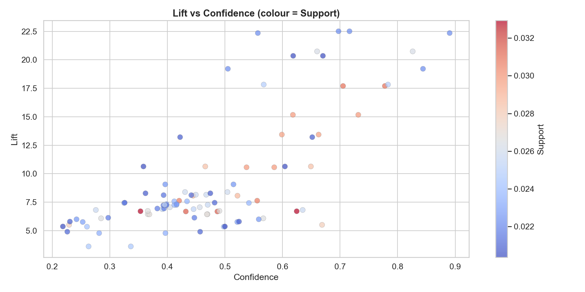

The **Support versus Confidence scatter**, coloured by lift, confirms that the strongest rules — those combining reasonable support with high confidence and elevated lift — form a distinct group that represents the most commercially actionable candidates for implementation.

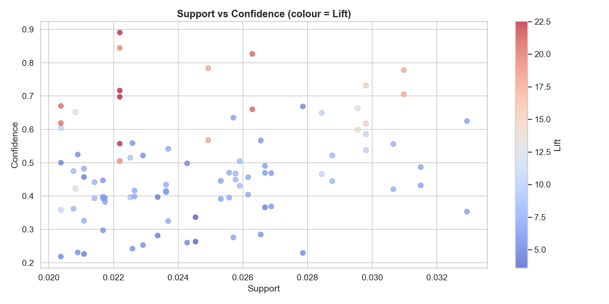

**Business Insight Extraction and Visualisation**

The business insight stage translated the statistical outputs of the model into commercially actionable findings through four targeted visualisations. 

The top rules ranked by lift revealed that the strongest product associations in the dataset are concentrated within complementary product families — decorative and gift items, storage products, and themed homewares — where customers demonstrably purchase coordinating pieces within the same transaction, presenting clear opportunities for bundle promotions and curated product recommendations. The top 5 rules ranked by lift are:

```
  IF   [GREEN REGENCY TEACUP AND SAUCER, ROSES REGENCY TEACUP AND SAUCER]
  THEN [PINK REGENCY TEACUP AND SAUCER]
       Support=0.022  Confidence=0.716  Lift=22.51

  IF   [PINK REGENCY TEACUP AND SAUCER]
  THEN [GREEN REGENCY TEACUP AND SAUCER, ROSES REGENCY TEACUP AND SAUCER]
       Support=0.022  Confidence=0.697  Lift=22.51

  IF   [GREEN REGENCY TEACUP AND SAUCER]
  THEN [PINK REGENCY TEACUP AND SAUCER, ROSES REGENCY TEACUP AND SAUCER]
       Support=0.022  Confidence=0.557  Lift=22.35

  IF   [PINK REGENCY TEACUP AND SAUCER, ROSES REGENCY TEACUP AND SAUCER]
  THEN [GREEN REGENCY TEACUP AND SAUCER]
       Support=0.022  Confidence=0.890  Lift=22.35

  IF   [GREEN REGENCY TEACUP AND SAUCER]
  THEN [PINK REGENCY TEACUP AND SAUCER]
       Support=0.026  Confidence=0.660  Lift=20.74
```

Note that for simplicity the antecedent and consequent names are capped at 30 characters for space reasons, which can give a false impression that they relate to 1 and not 2 products.

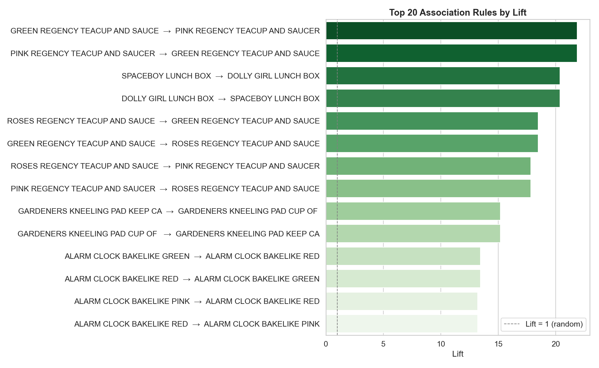

The top rules by confidence identified those associations that fire most reliably, highlighting specific product pairings where the purchase of one item is a particularly strong predictor of the other and where targeted cross-sell interventions are most likely to convert. 

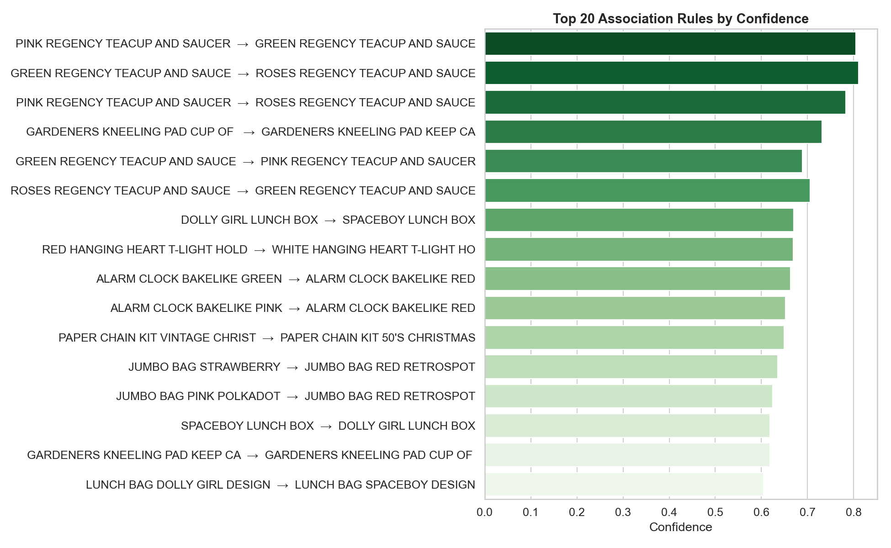

The top antecedents chart identified a small number of high-frequency trigger products that appear as the antecedent across a disproportionately large number of rules, suggesting these items act as natural entry points into broader purchasing journeys and should therefore be prioritised in recommendation engine logic and promotional strategy.  

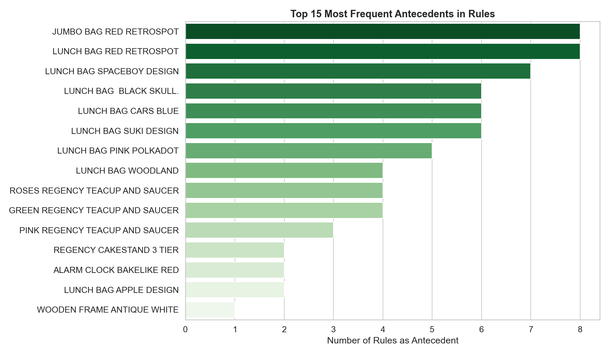

Finally, the product co-occurrence heatmap provided an intuitive overview of the relationship landscape across the fifteen most prevalent items, making it immediately visible which product pairings carry the densest concentration of rules and offering a practical reference for category managers and merchandising teams when making decisions around product placement, ranging, and inventory alignment.  

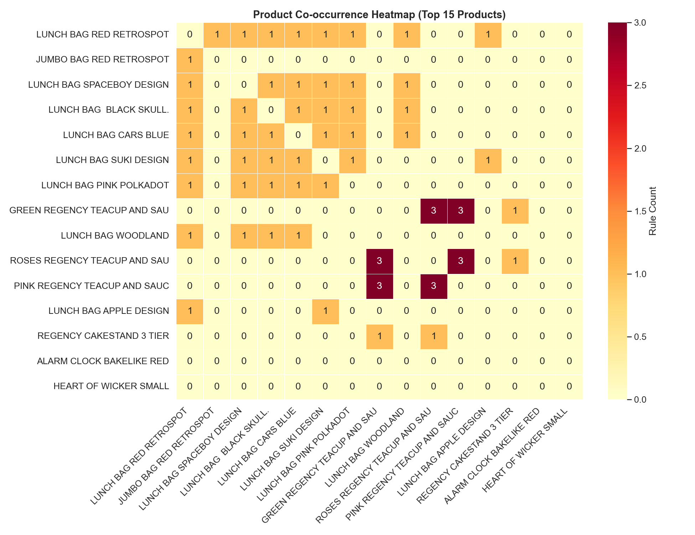

## Conclusions:

This project demonstrated the application of Association Rule Learning to real-world retail transactional data, following a rigorous end-to-end analytical workflow from data ingestion and preprocessing through to the extraction of commercially actionable insights.  

The Online Retail II dataset presented genuine data quality challenges — including cancelled orders, missing customer identifiers, and invalid quantities — the resolution of which formed an important part of the analytical process and reflects the kind of preprocessing decisions routinely encountered in professional data science practice.  

The FP-Growth algorithm successfully identified a meaningful ruleset of product associations, validated across six quality checks to confirm that the relationships uncovered are statistically robust and not attributable to chance.  

The key finding is that a identifiable set of complementary product families exhibit strong and consistent co-purchase behaviour, quantified through lift, confidence, and support metrics, and that these associations are sufficiently prevalent across the customer base to be commercially viable. 

The insights generated have direct applications across multiple retail functions, most notably product recommendation, promotional bundling, and category management, demonstrating that Association Rule Learning is a practical and accessible technique for driving measurable commercial value from transactional data.  

### Business Insight Interpretation

**Lift** measures how much more likely two products are to be purchased together compared to by chance.  A lift of 4.0 means customers are 4x more likely to buy both items than if purchase decisions were independent.  Rules with high lift are the strongest candidates for:
* Cross-sell recommendations at checkout
* 'Frequently bought together' website features
* Bundle promotions and targeted discount offers

**Confidence** is the conditional probability: given a customer bought the antecedent, how often did they also buy the consequent?  A confidence of 0.75 means 75% of baskets containing the antecedent also contained the consequent.  High-confidence rules are actionable for:
* Next-best-product recommendation engines
* Email campaigns triggered by recent purchases
* Staff training on upsell opportunities

**Support** measures how frequently a rule fires across all transactions.  Rules with both high lift AND reasonable support are the most commercially valuable — the association is strong AND affects a meaningful share of customers.  Rules with very low support, even with high lift, may reflect niche behaviour not worth operationalising at scale.

**Leverage** confirms the co-occurrence is above chance.

**Conviction** measures the degree to which the antecedent implies the consequent directionally.  Both metrics were used in validation to confirm rule quality beyond lift alone.

## Next steps:  

The findings from this analysis present several immediate opportunities for practical implementation alongside a number of opportunities for the analytical approach to be extended and refined. 

In terms of **business implementation**, the five most actionable applications of the rules generated are: 
1. deploying a **product recommendation engine** on the website that surfaces associated products at the basket and checkout stage based on current session contents
2. designing **promotional bundle** offers around the highest lift product pairings to increase average order value
3. using high-confidence rules to trigger personalised post-purchase **email campaigns** recommending complementary products based on a customer's most recent order
4. informing **category management** and **store layout** decisions by positioning strongly associated product families in closer proximity
5. aligning **inventory planning** for correlated products to ensure that demand driven by one item in a strong pairing is not frustrated by a stockout of its associated counterpart

From an **analytical perspective**, several enhancements would strengthen and extend the current work.  
* Segmenting the analysis by season or month would reveal whether product associations are stable year-round or driven by specific trading periods, which has direct implications for the timing of any interventions.
* Analysing rules at the customer segment level — for example by purchase frequency or average spend — could uncover whether different customer groups exhibit meaningfully different co-purchase behaviours.
* Lowering the minimum support threshold in a targeted way could surface valuable niche associations that the current parameters exclude.
* Causal Impact Analysis could be applied to measure the actual commercial uplift generated by any recommendation or bundling strategy implemented as a result of this work, closing the loop between insight generation and evidence-based evaluation of business outcomes.

## Python code:
You can view the full Python script used for the analysis here: 
[View the Python Script](/Association_Rule_v1.py)
