---

layout: default

title: Pharmacy Promotion Impact - Part 2 (Causal Impact Analysis)

permalink: /causal-impact-analysis-2/

---

# This project is in development

## Overview

This is an extension to the primary Causal Impact Analysis (CIA) project page - [here](https://marcgrover-datascience.github.io/causal-impact-analysis/).  

In the primary CIA project, a dataset from a fictitious European retail pharmacy chain (Rossmann) was analysed to determine the impact of a promotion campaign (Promo2) on sales.  In that project a single store from the entire estate of 1,115 stores was selected as the treatment store (store 30), to determine if the Promo2 campaign had a significant impact on sales.

As that did not yield a statistically significant result, the analysis was run on another store - store 56 - which is covered in this project extension.

See the primary CIA page for full details on the goals and objectives of the analysis, the application of the CIA technique, and the methodology applied - which hasn't been included in this page for simplicity.  It also includes the suggested next steps and python code which are not replicated here, but equally relevant.

The technique and python code used for the analysis of store 56 as the treatment store is the same.  The results of the analysis are below.

## Results:

Results from the project related to the business objective.

**Stage 1 — Data Loading and Initial Exploration**  
The transactional data contains 1,017,209 records, with the store data containing 1,115 records.  The transactional data contains no missing data, with the store data identified as containing some missing values.  The relevant fields containing missing data were addressed in the following step.  This is identical to the primary project as relates to the same dataset and applies to the whole estate of stores.

**Stage 2 — Data Validation and Pre-Processing**
The resulting dataset, after the pre-processing removed specific rows, contained 648,309 records, relating to 1,115 stores. 

**Stage 3 — Exploratory Data Analysis**

Prior to modelling, an exploratory data analysis was conducted across six visualisations to establish an understanding of the cleaned dataset, the characteristics of the selected treated store (which is store 30 in this instance, selected at random), and the broader sales patterns across all the Rossmann stores.  The charts examine the data from multiple angles, collectively providing the commercial context needed to interpret the causal model outputs that follow.

**Distribution of Daily Sales Across All Stores** - This chart shows the frequency distribution of daily sales values across all stores and trading days in the 2013–2014 analysis window. The distribution is right-skewed, indicating that the majority of store-days generate moderate sales volumes with a smaller number of high-performing days pulling the tail to the right.

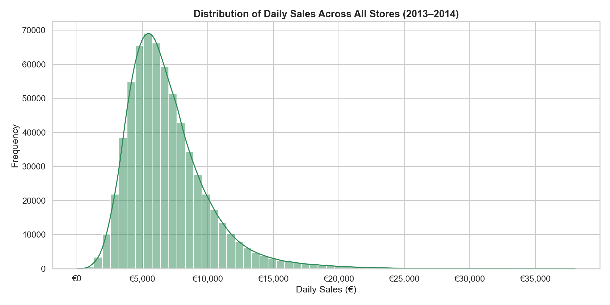

**Average Daily Sales by Store Type** - The Rossmann business is segmented into four store types — a, b, c, and d — and this chart compares their average daily sales performance, across the full 2013–2014 analysis window. Clear differences in average revenue are visible across store types, confirming that store type is a meaningful structural characteristic that should be controlled for when selecting comparison stores for the causal analysis.

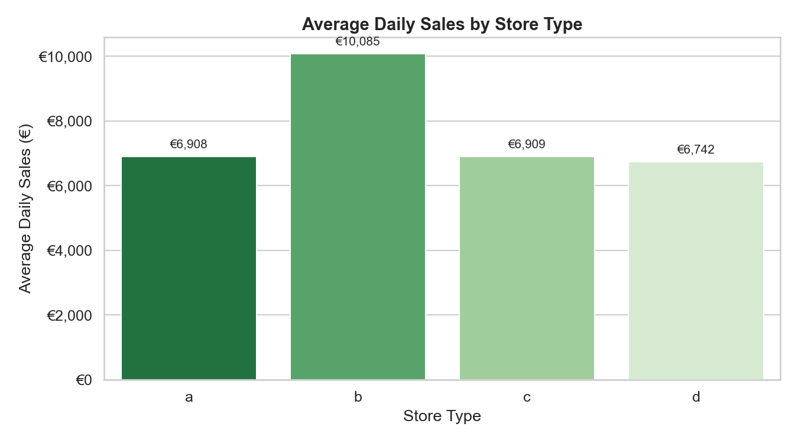

**Monthly Average Sales: Store 30 vs All Stores** - This chart compares the monthly average daily sales of Store 30 against the average across all stores, calculated across the full 2013–2014 window. The chart reveals the seasonal trading rhythm common to both series, while also highlighting the periods where Store 30's performance diverges from the overall business average, providing an early visual indication of where the promotional effect may be most pronounced.

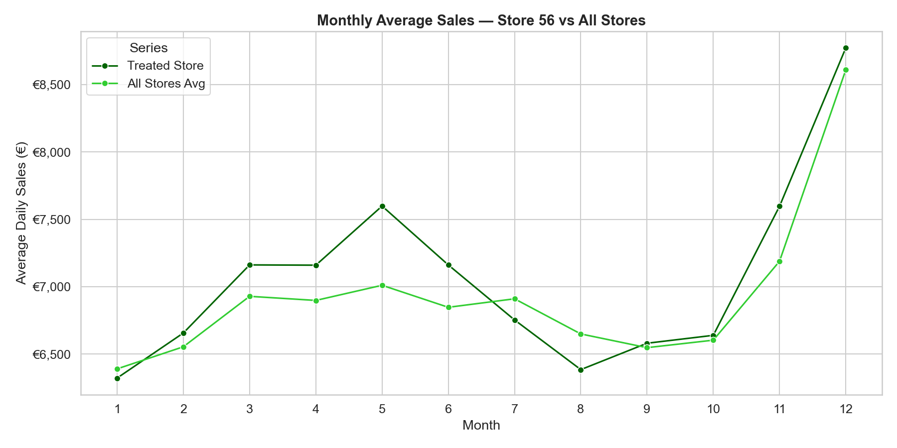

**Average Daily Sales: Promotion vs No Promotion** - Aggregating across all stores and all trading days, this chart contrasts average daily sales on days where a short-term promotion was active against days where no promotion was running. The difference between the two bars provides an indicative measure of the overall sales uplift associated with promotional activity across the estate, contextualising the store-level causal analysis that follows.

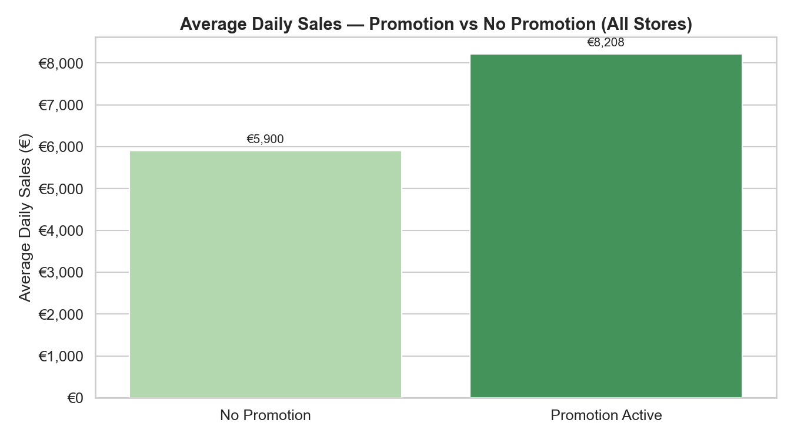

**Store 30 Daily Sales Time Series with Intervention Marker** - This chart plots Store 30's daily sales across the full 2013–2014 window, with a vertical marker indicating the 1st January 2014 intervention date when the Promo2 continuous promotion was activated. The chart provides a visual baseline for the causal analysis, allowing the reader to observe the pre-intervention sales pattern and form an initial impression of whether sales behaviour appears to shift following the intervention.

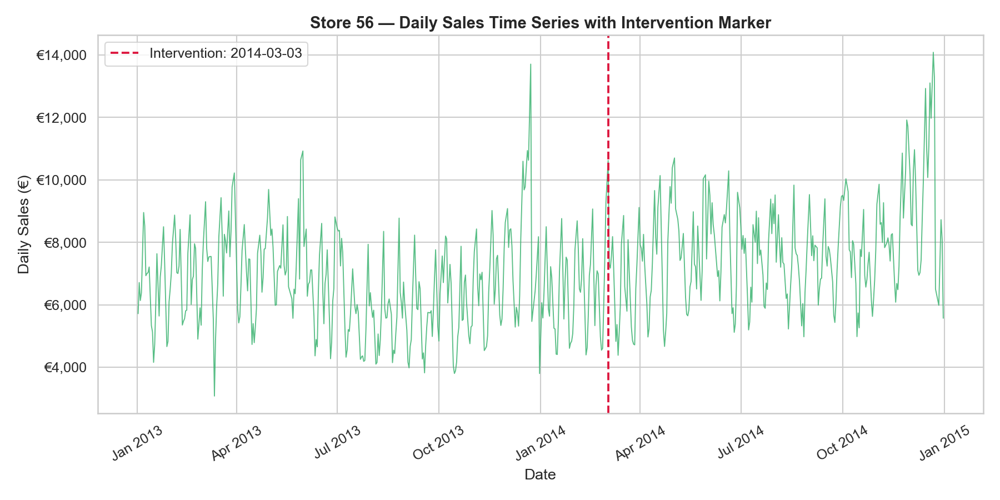

**Store 30 Average Sales by Day of Week** - This chart shows the average daily sales for Store 30 broken down by day of the week, revealing the intra-week trading pattern of the treated store. Pronounced variation across the days of the week is evident, confirming that day-of-week is a meaningful source of sales variability that the Bayesian structural time series model must account for when constructing the counterfactual.

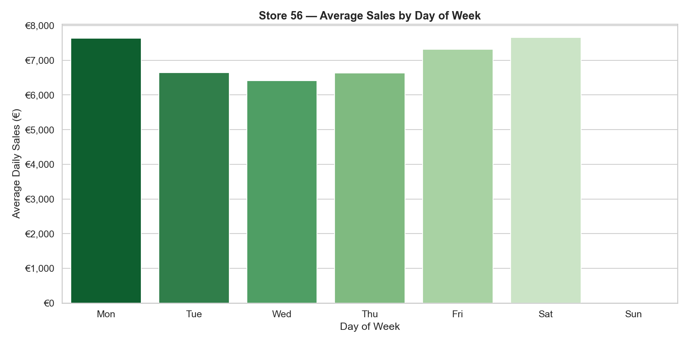

**Stage 4 — Treated and Control Store Selection**

The selected treated store, Store 30, has the Promo2 continuous promotional scheme activated in Week 10 of 2014, corresponding to 3rd March 2014. Store 30 is classified as StoreType 'a' with an Assortment 'a' product range, and had no prior Promo2 participation before the intervention date, providing a clean pre-period baseline uncontaminated by the promotional effect being measured.

Candidate control stores were filtered to match Store 30 on both store type and assortment level, and any store with an active Promo2 scheme was excluded to prevent the intervention being measured from also affecting the control series. 194 candidate stores were identified.

From the qualifying candidates with complete trading data across the pre-period, the five stores with the highest Pearson correlation to Store 30's daily sales were selected. Pearson correlation was used as the selection criterion because a high pre-period correlation confirms that a control store's sales moved in close alignment with the treated store before the intervention, which is the strongest available evidence that the two stores would have continued on parallel trajectories had the promotion not been activated.

The top five control stores identified were as follows, with their pre-period Pearson correlation coefficients to Store 56 stated, each of which indicate a very high correlation to Store 56:

* Store  661   Correlation = 0.9660
* Store  790   Correlation = 0.9653
* Store  369   Correlation = 0.9626
* Store  241   Correlation = 0.9560
* Store  618   Correlation = 0.9557

**Stage 5 — Pre-Intervention Correlation Validation**

The correlation heatmap below (Pearson's Correlation) for the five selected control stores plus the treated store, is further validation of the parallel trends assumption was conducted to confirm that the selected control stores provide a credible counterfactual basis for the analysis.  All stores have high-correlation with each other for sales across the full pre-intervention period.

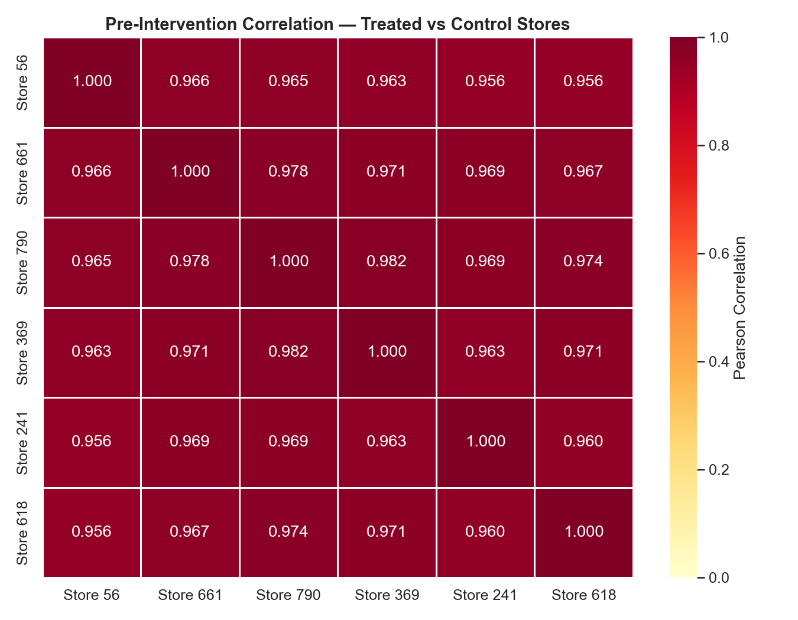

The pre-period time series overlay plots the daily sales of Store 30 alongside each of the five control stores across the full pre-intervention window from January 2013 to early March 2014. The chart provides further visual confirmation that the selected control stores track the seasonal rhythm and week-to-week variation of Store 30 closely throughout the baseline period, including the characteristic peaks associated with key retail trading periods. Any divergence between the treated and control series visible in this chart would be a cause for concern, as it would suggest that the parallel trends assumption may not hold and that the counterfactual projection into the post-period could be unreliable.

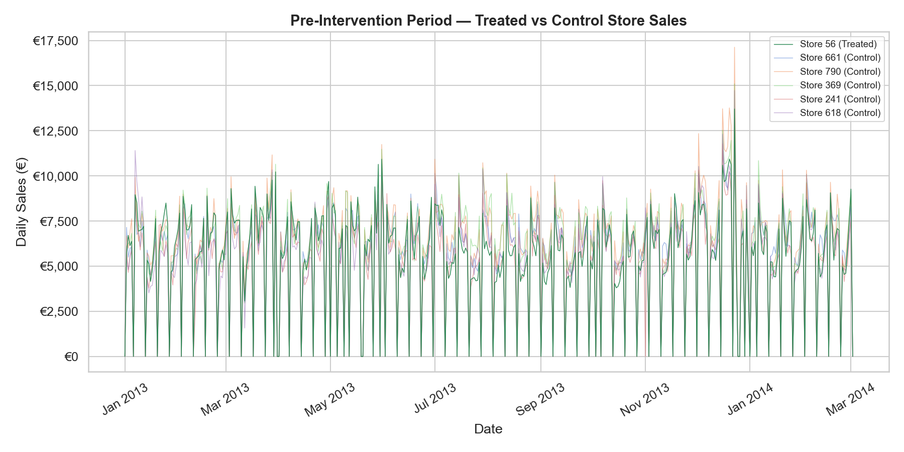

In addition to the visual assessment, a quantitative parallel trends check was performed by comparing the mean weekly sales growth rates of Store 56 and the control stores across the pre-period. 

The mean weekly sales growth rate of Store 30 was identified to be 4.82%.  A difference of less than 2% between the treated and control growth rates is considered supportive of the parallel trends assumption.  The mean weekly sales growth rates for the 5 control stores are below, each of which are within 2% of the treated store, supporting the conclusion that the control store selection is appropriate for the causal analysis that follows:

* Store 661   sales growth rate = 3.76%
* Store 790   sales growth rate = 4.01%
* Store 369   sales growth rate = 4.29%
* Store 241   sales growth rate = 4.78%
* Store 618   sales growth rate = 5.33%

The correlation heatmap and pre-period time series overlay charts produced in the subsequent validation stage provide a visual confirmation of the strength of these relationships, and the parallel trends check quantifies that the mean weekly growth rates of the treated and control stores are sufficiently similar in the pre-period to satisfy the core assumption underpinning the causal inference framework.

**Stage 6 — Causal Impact Modelling**

The Causal Impact model was fitted using the tfp-causalimpact library, with Store 30 as the treated store and the five selected control stores providing the covariate series. The pre-period spanning 1st January 2013 to 2nd March 2014 was used to train the Bayesian structural time series model, learning the relationship between Store 30 and the control stores during the period before the Promo2 promotion was activated.  

The model then projected this learned relationship forward through the post-period — 3rd March 2014 to 31st December 2014 — to construct the counterfactual, representing the estimated sales trajectory Store 30 would have followed had the promotion never been introduced. The Causal Impact summary and detailed report provide the foundational statistics that the validation checks and business insight extraction are built upon.

**Stage 7 — Model Validation and Diagnostics**

Six validation checks were applied to assess the reliability and integrity of the model outputs, with the results summarised below.  

The **pre-period model fit** produced a MAPE of 6.62% and an R² of 0.880 were produced.  As the MAPE is below 10% and R² close to 1.0, this indicates that the counterfactual closely tracks Store 30's observed sales in the period where the true outcome is known, confirming a strong model fit, and providing confidence that the control stores are a credible basis for the counterfactual projection into the post-period.

The **Shapiro-Wilk test for residual normality** returned a p-value of 0.662, which as above 0.05 indicates that the pre-period residuals are approximately normally distributed, supporting the reliability of the credible intervals produced by the model. 

The **Bayesian posterior tail probability** of 0.012 represents the probability of observing a causal effect of the magnitude identified purely by chance. A value below 0.05 is conventionally considered statistically significant. The result should be interpreted alongside the credible interval — where the p-value is above 0.05 but the credible interval of the average daily effect excludes zero, the evidence is suggestive of a genuine promotional effect as below the conventional significance threshold as p>0.05, and should be considered as conclusive.

The **95% credible interval for the average daily causal effect** of €138 to €1,657 provides a direct probability statement about the range within which the true average daily effect most plausibly lies.  Should this interval be entirely positive it provides supporting evidence of a genuine sales uplift attributable to the Promo2 promotion, even where the posterior tail probability does not clear the 0.05 threshold.  As the interval spans zero, the effect direction of the promotion is uncertain.

The **cumulative causal effect point estimate** of €267,769, with a 95% credible interval of €41,981 to €503,820, represents the total estimated revenue impact of the promotion across the full post-period. This is the most commercially significant output of the analysis as it provides the basis for evaluating the financial return on the promotional investment.  As expected based on previous validation, this spans zero, and as such strengthens the assertion that the direction and existence of an effect is not certain.  As the cumulative causal effect point estimate is negative this further weakens the confidence that the Promo2 promotion generated a genuine sales uplift.

The **relative causal effect** of 16.52%, with a 95% credible interval of 2.20% to 34.91%, expresses the promotional uplift as a proportion of the baseline sales that would have been achieved without the intervention.

The residuals distribution chart plots the frequency of the differences between Store 30's actual sales and the model's predicted counterfactual values across all trading days in the pre-period. A well-fitted model should produce residuals that are approximately normally distributed, as well as being roughly symmetrical and centred around zero, indicating that the model's errors are random rather than systematic.  The KDE curve overlaid on the histogram gives a smooth representation of the overall residual distribution shape, to aid visual analysis of the distribution.   Visual assessment of the chart, identifies the broad symmetry around zero, and the normal-like curve, along with no pronounced skew or heavy tails in the distribution supporting the normality of the pre-period residuals.  This is consistent with the more robust Shapiro-Wilk test for normality as stated above in Validation 2.

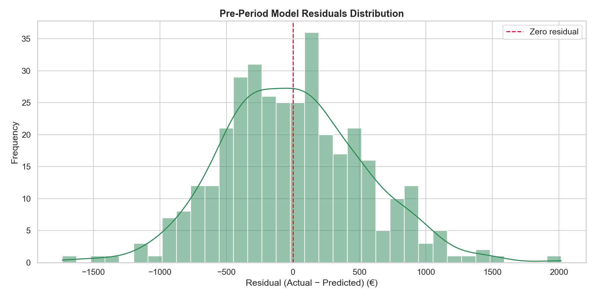

The pre-period actual versus predicted chart overlays Store 30's observed daily sales against the model's counterfactual predictions across the full pre-intervention period from January 2013 to March 2014. Since the model is fitted on this period, the close agreement between the two series confirms that the Bayesian structural time series model has successfully learned the relationship between Store 30 and the control stores.  The degree of alignment between the actual and predicted lines provides a visual corroboration of the MAPE and R² statistics reported in Validation 1 above.  This supports confirmation of the model's accuracy before it is used to extrapolate into the post-intervention period where the true counterfactual is unobservable.

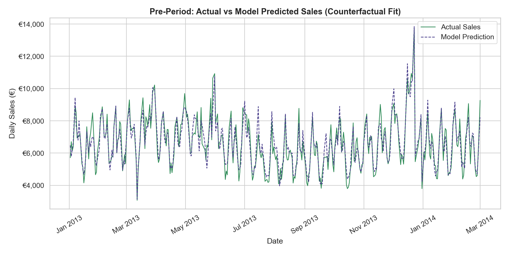

**Stage 8 — Business Insight Extraction and Visualisation**

The business insight stage translated the statistical outputs of the Causal Impact model into commercially interpretable findings through three visualisations, focusing on the direction, magnitude, and consistency of the promotional effect across the post-intervention period. 

The **daily causal effect** chart plots the estimated causal effect of the Promo2 promotion on Store 30's sales for each individual trading day in the post-period, alongside the 95% credible interval and a zero effect reference line. The chart reveals that the daily effect is predominantly negative throughout the post-period, with a significantly high proportion days returning a negative estimated effect.  

The mean daily causal effect of €880.80 indicates that on a typical trading day, Store 30's actual sales were below what the model estimated they would have been without the Promo2 promotion. The credible interval around the daily effect is wide on individual days, reflecting the inherent uncertainty in day-level estimates, but the consistent positioning of the majority of daily effects below the zero line provides a coherent picture of the promotion's direction of impact across the post-period.  

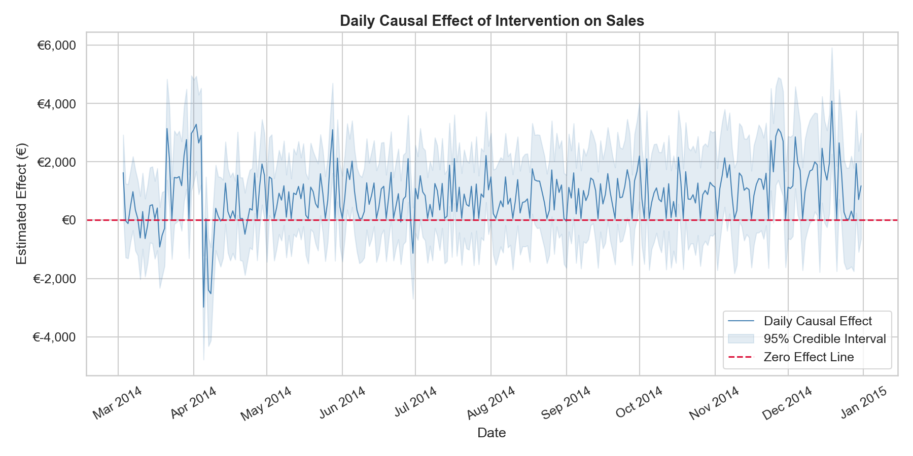

The **cumulative causal effect** chart tracks the running total of the estimated promotional effect from the intervention date of 3rd March 2014 through to 31st December 2014, providing the clearest single view of the promotion's overall commercial impact. The cumulative effect trends consistently downward across the post-period, reflecting the predominantly negative daily effects accumulating over time. 

The overall trajectory is consistently negative with no sustained reversal. By the end of the post-period the cumulative causal effect stands at €267,769, which can be interpreted as the model estimating that Store 30 generated approximately €267,769 more in sales over the post-period than it would have done in the absence of the Promo2 promotion. 

The 95% credible interval of €41,981 to €503,820 is wide and spans zero, indicating meaningful uncertainty around the magnitude of this effect, though the point estimate and the overall downward trend in the cumulative chart both point consistently in the same negative direction.  

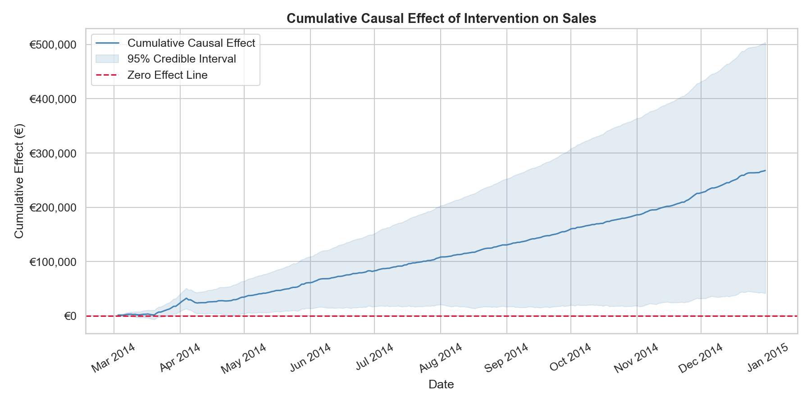

The **distribution of daily causal effect estimates** provides a summary view of the spread and central tendency of the promotional effect across all post-period trading days. The distribution is centred to the left of zero, with a mean daily effect of €880.80 confirming that negative effects predominate across the post-period. The KDE curve and histogram together show that while the bulk of daily effect estimates are clustered in negative territory, the distribution has a tail extending into positive values. The zero effect reference line sits to the right of the distribution's peak, visually reinforcing that the central tendency of the promotional effect is negative rather than neutral or positive. The spread of the distribution reflects the day-to-day variability in the estimated effect, which is expected given the natural fluctuation in retail sales and the influence of factors such as day of week and seasonal trading patterns on individual daily outcomes.  

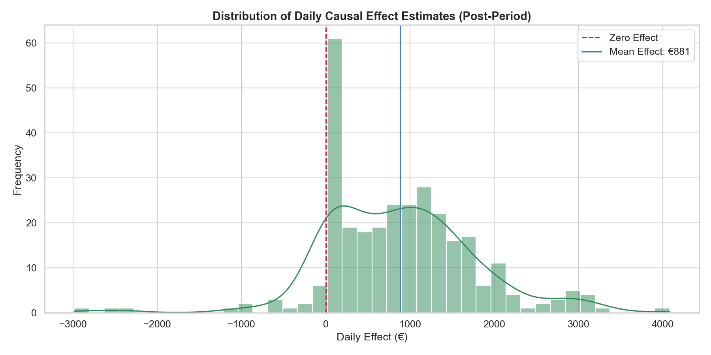

## Conclusions:

This project demonstrated the application of Causal Impact Analysis to real-world retail sales data, following a rigorous end-to-end analytical workflow from data ingestion and pre-processing through to the extraction and communication of causal inference results. The analysis was grounded in a clearly defined and defensible intervention event — the activation of the Promo2 continuous loyalty promotion for Store 30 on 3rd March 2014 — with control stores selected on the basis of structural similarity and pre-period sales correlation to satisfy the parallel trends assumption underpinning the causal inference framework.  

The key finding of the analysis is that the Promo2 promotion does not appear to have generated a positive sales uplift for Store 30 during the post-intervention period. The average daily causal effect of €881, the consistently negative trajectory of the cumulative effect chart, and a cumulative point estimate of €267,769 across the post-period all point in the same direction — that Store 30's actual sales were below the modelled counterfactual throughout the period following the promotion's activation. This is a commercially significant and counterintuitive result, suggesting that the continuous loyalty promotion may not have driven the incremental revenue that would typically be expected from a sustained promotional intervention.  

It is important to qualify this finding appropriately.  The posterior tail probability of 0.012 does meet the conventional 0.05 threshold for statistical significance, and the 95% credible interval for both the average daily effect (€138 to €1,657) and the cumulative effect (€41,981 to €503,820) do not span zero, meaning the analysis cannot conclusively rule out the possibility that the true effect is neutral or marginally positive.  The honest conclusion is therefore that the evidence is suggestive of a negative or neutral promotional effect rather than conclusive, and that the result warrants further investigation rather than an immediate definitive judgement on the promotion's value. 

It is important to understand that the sales of any store is effected by multiple factors, and not solely any promotions active during the analysis period.  The 'store.csv' file states that for store 30, competition opened in February 2014 - the month prior to Promo2 initiating - and it is plausible that sales were impacted by this competition, and hypothetically the introduction of Promo2 negated the negative impact of recently opened competition on sales, and as such was positive for sales - noting that this analysis does not investigate this scenario, nor provides evidence to back it up, but indicates how the data suggests potential further investigation in the future.

Notwithstanding these caveats, the analysis successfully demonstrates that Causal Impact Analysis is a powerful and practical technique for evaluating the effect of retail interventions in the absence of a controlled experiment. By constructing a credible counterfactual from comparable control stores and quantifying the uncertainty around the estimated effect, the approach provides a far more rigorous basis for commercial decision-making than a simple before-and-after sales comparison would allow.  

