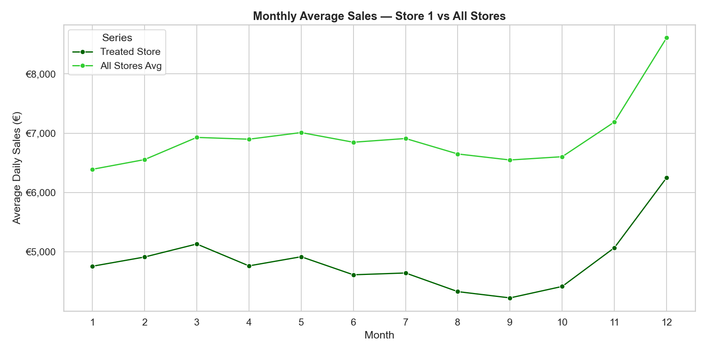
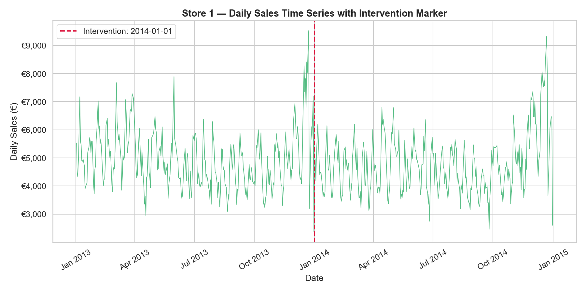
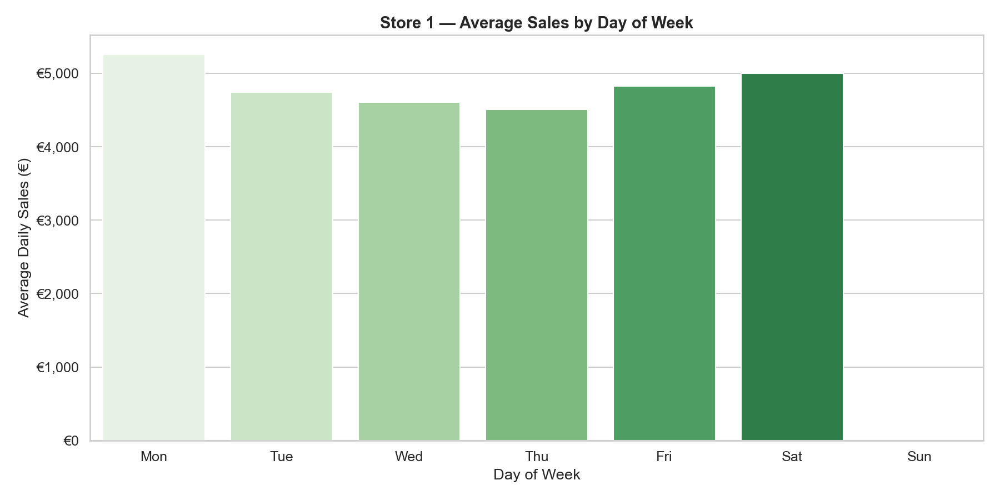
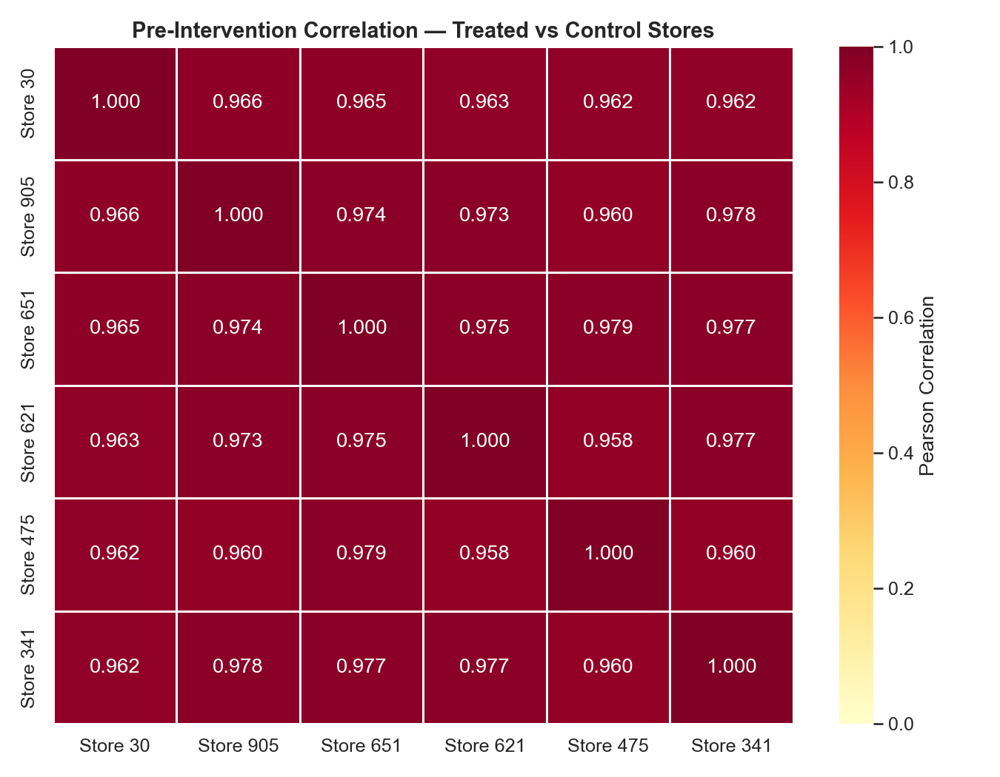
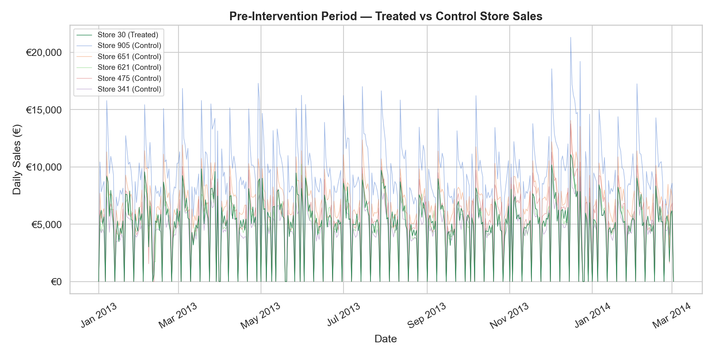
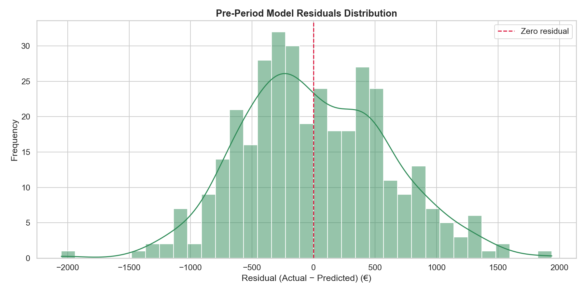
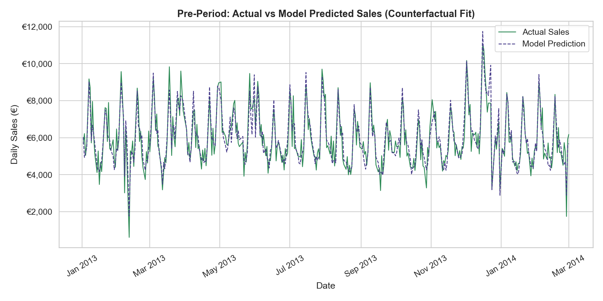
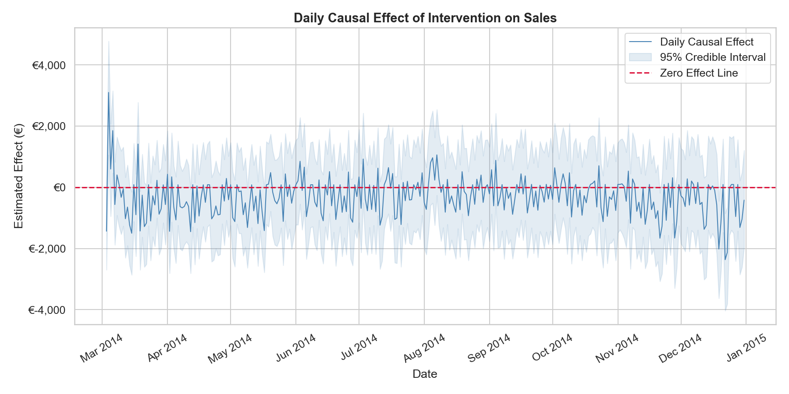
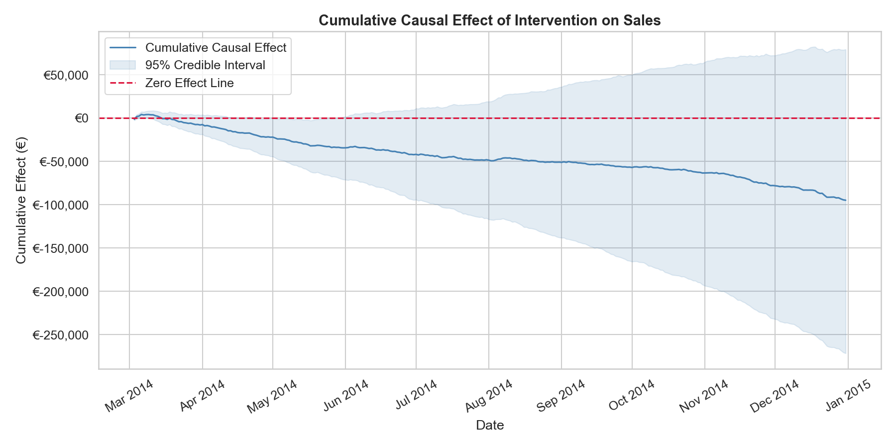
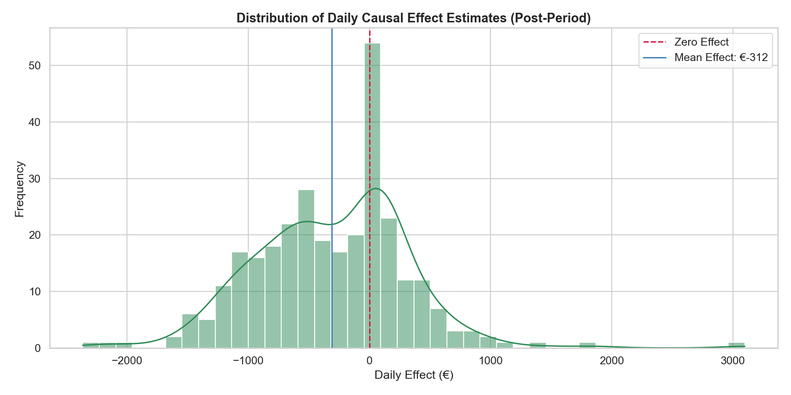

---

layout: default

title: Pharmacy Promotion Impact (Causal Impact Analysis)

permalink: /causal-impact-analysis/

---

# This project is in development

## Goals and objectives:

For this portfolio project, the simulated business scenario is regarding a fictitious European retail pharmacy chain operating across multiple store locations, with the goal of measuring the true causal effect of a promotional campaign on store sales. A simple before-and-after comparison of sales would be insufficient for this purpose, as it cannot distinguish the genuine impact of the promotion from underlying trends, seasonal patterns, and external factors that would have influenced sales regardless of the intervention. 

The objective is therefore to apply a rigorous analytical framework that isolates the promotion's contribution with quantified confidence, producing a robust and commercially meaningful estimate of whether the campaign generated a genuine uplift in revenue, and if so, by how much.  

A key objective is to demonstrate that measuring the effect of an intervention requires more than observing that sales changed after it occurred. The analysis aims to show that only by constructing a credible estimate of what would have happened in the absence of the promotion — and comparing that to what actually happened — can a business make confident, evidence-based decisions about the value of its promotional spend. This distinction between correlation and causation is central to the project and reflects the kind of analytical rigour that separates robust business insight from misleading reporting.  

A secondary objective is to illustrate how this approach can directly inform commercial decision-making across multiple retail functions — from evaluating the return on investment of a promotional campaign, to providing the evidence base needed to decide whether an intervention warrants broader rollout across additional stores or regions. 

By grounding every analytical decision in a clear business rationale, this project aims to demonstrate not only technical proficiency in Python and Bayesian time series modelling, but also the ability to frame and communicate causal questions in a way that is meaningful to both technical and non-technical stakeholders.  

Ultimately, the project reflects a core principle of applied data science: that understanding what caused an outcome is far more valuable to a business than simply observing that it occurred.

## Application:  

Causal Impact Analysis is a statistical technique used to estimate the causal effect of an intervention or event on a time series outcome — answering not just what happened, but what would have happened had the intervention never occurred. 

Developed by Google researchers, the method uses Bayesian structural time series models to construct a synthetic counterfactual: a prediction of how the target metric would have evolved in the absence of the intervention, based on its own historical behaviour and a set of related control variables that were themselves unaffected by the event.  The difference between the observed outcome and this counterfactual is then interpreted as the causal effect of the intervention.

This technique is particularly powerful in scenarios where randomised controlled trials are impractical or impossible.  Consider a business that launches a regional marketing campaign in one city while other cities continue as normal.  Causal Impact Analysis can use the untreated cities as control variables to model what sales in the target city would have looked like without the campaign, then quantify the lift attributable to it — complete with credible intervals that convey the uncertainty in that estimate.  

This approach is equally applicable across a wide range of domains - as its strength lies in producing a rigorous, interpretable causal narrative from observational data alone: 
* **technology**: measuring the revenue impact of a product feature release
* **healthcare**: assessing the effect of a public health intervention on hospital admissions
* **retail**: impact of a new loyalty programme in a subset of stores to measure its true effect on weekly spend per customer 
* **science**: assess the effect of conservation policy changes — such as the designation of a marine protected area — on fish population metrics over time

## Methodology:  

Details of the methodology applied in the project.

This portfolio project uses the ‘Rossmann Store Sales dataset’, where two datasets are loaded:

* train.csv - contains daily transactional sales records across all stores
* store.csv - contains store-level metadata including store type, assortment category, competition distance, and promotional scheme participation

The data is available at Kaggle [here](https://www.kaggle.com/datasets/pratyushakar/rossmann-store-sales) 

It should be noted that the data reflects two types of promotional activities:

* **Short-term promotions** are promotions occuring on a single or few consecutive days. - reflected where Promo == 1 in the train.csv file.  These are frequent and recurring throughout the analysis window, rather than being a single discrete intervention event.  It is not a single intervention event with a clear before and after; it switches on and off repeatedly throughout the dataset, which makes it unsuitable as the intervention for a Causal Impact analysis. Causal Impact requires a single, clearly defined point in time where something changed permanently or for a sustained period.
* **Longer-running loyalty promotion** that a store either participates in from a specific start date or does not.  This is the type of intervention that is well suited to Causal Impact Analysis, as it has a defined activation date from which the store's behaviour may change persistently.  These are recored in the store.csv file.

For the project store 30 was selected as the treated store, which is included in the Promo2 initiative, starting on 3rd March 2014.  As such activation date becomes the intervention point, with all trading days before it forming the pre-period and all days after forming the post-period.  This is Store Type a, and Assortment is basic (category = a).  

The methodology adopted for this project follows the end-to-end data science workflow, progressing from raw data ingestion through to the extraction and communication of business insight. The project is implemented in Python, using the causalimpact library for Bayesian structural time series modelling, pandas for data manipulation, scipy and sklearn for statistical validation, and seaborn and matplotlib for visualisation. Each stage of the pipeline is described in detail below.  

**Stage 1 — Data Loading and Initial Exploration**:  Two files from the Rossmann Store Sales dataset are loaded: train.csv, and store.csv. An initial review is conducted covering dataset shape, column names, data types, descriptive statistics, and a missing value audit across both files. This establishes a baseline understanding of data quality and informs the preprocessing decisions that follow.

**Stage 2 — Data Validation and Pre-Processing**: Seven preprocessing steps are applied sequentially, with row counts logged at each stage to maintain full transparency over the impact of each decision.  
* Date fields are converted to the correct data format, enabling validation that the data reflects the correct time frame.
* Closed store days, where the Open field equals zero, are removed as they contribute zero sales by definition and would distort the time series baseline.
* Rows with zero or negative sales values are removed as these represent data quality issues rather than genuine trading records.
* Rows where customer count is zero on an open trading day are similarly excluded as likely erroneous.
* Store metadata from store.csv is merged into the main dataset. Missing competition distance values imputed using the column median.  Missing values in three Promo2 fields were populated with '0' and 'None' values as appropriate.
* The analysis is then scoped to the 2013–2014 window (i.e. 2 complete calendar years) to provide a full pre-intervention year and a full post-intervention year of equal length.
* Derived features are engineered including month, day of week, week of year, and a binary weekend indicator to support the exploratory analysis.

**Stage 3 — Exploratory Data Analysis**:  Six visualisations are produced to build a thorough understanding of the data before modelling begins. These cover the distribution of daily sales across all stores, average sales by store type, a monthly sales comparison between the treated store and the overall store average, the effect of short-term promotions on daily sales across all stores, the treated store's full daily sales time series with the intervention date marked, and the treated store's average sales by day of week. Together these charts establish the commercial context for the analysis and surface patterns that inform both the control store selection and the interpretation of the causal model outputs.

**Stage 4 — Treated and Control Store Selection**:  Store 30 is designated the treated store, with the activation of the Promo2 continuous loyalty promotion on 3rd March 2014 serving as the intervention event.  This is approximately mid-way through the 2 year analysis window and as such considered a suitable treated store for the analysis.

The selection of appropriate control stores is critical to the validity of the analysis: control stores must track the treated store's sales trajectory closely in the pre-intervention period so that any post-intervention divergence can be attributed to the promotion rather than pre-existing differences. 

Candidate control stores are filtered to match the treated store on store type and assortment level, and stores with Promo2 active at any time are excluded to avoid contamination of the control series. From the remaining candidates, the five stores with the highest Pearson correlation to the treated store's pre-intervention daily sales are selected as controls.

The selection of appropriate control stores is a critical determinant of the validity of the causal analysis, as the counterfactual is only credible if the control stores would genuinely have tracked the treated store's sales trajectory in the absence of the intervention. 

**Stage 5 — Pre-Intervention Correlation Validation**:  Before fitting the causal model, the parallel trends assumption is validated which is the foundational requirement of causal inference.  This states that in the absence of the intervention, the treated and control stores would have continued to evolve in parallel.  

This is assessed in three ways, to give both a quantitative and intuitive basis for assessing whether the control group is a credible counterfactual anchor:  
* a statistical comparison of mean weekly pre-period growth rates between the treated and control stores, where a difference of less than 2% is considered supportive of the assumption
* a visual inspection via a pre-period time series overlay chart and a Pearson correlation heatmap across all selected stores
* a quantitative parallel trends check was performed by comparing the mean weekly sales growth rates of Store 30 and the control stores across the pre-period

**Stage 6 — Causal Impact Modelling**:  The Causal Impact model is fitted using the tfp-causalimpact Python library, which implements a Bayesian structural time series framework. The model uses the pre-intervention period to learn the relationship between the treated store's sales and the control store series, then projects that relationship forward through the post-intervention period to construct the counterfactual — the synthetic estimate of what the treated store's sales would have looked like had the promotion never been activated.  

The difference between the observed post-intervention sales and this counterfactual is the estimated causal effect of the promotion. Both a point estimate and a 95% Bayesian credible interval are produced for every day in the post-period, along with cumulative and average effect summaries.

**Stage 7 — Model Validation and Diagnostics**:  Six validation checks are applied to assess the reliability of the model outputs.  

* The **pre-period model fit** is evaluated using MAPE and R², where a MAPE below 10% and an R² close to 1.0 indicate that the counterfactual closely tracks the treated store in the period where the true outcome is known.  This was calculated on trading days only to exclude the distorting effect of zero-sales days such as Sundays and public holidays.
* A **Shapiro-Wilk test for pre-period residual normality**, since non-normal residuals would affect the reliability of the credible intervals.
* The **Bayesian posterior tail probability** — equivalent to a one-sided p-value — is reported, where a value below 0.05 indicates the observed effect is unlikely to be attributable to chance.
* The **95% credible interval for the average daily effect** is inspected to confirm if it excludes zero, providing direct probabilistic evidence of a genuine causal effect.
* The **cumulative causal effect point estimate** and its credible interval are reported to assess overall commercial plausibility.
* Finally, **the relative causal effect percentage** is calculated to express the intervention's impact in proportional terms, which is the most accessible metric for non-technical stakeholders.

**Stage 8 — Business Insight Extraction and Visualisation**:  Three post-intervention visualisations are produced to communicate the causal model outputs in a commercially meaningful way. 

* The **daily causal effect** chart plots the estimated effect for each individual post-period trading day with its uncertainty bounds, revealing whether the promotional uplift was consistent or concentrated in particular periods.
* The **cumulative causal effect** chart tracks the running total of incremental revenue over the post-period, providing an intuitive view of how the commercial benefit accumulated over time.
* Finally, a **distribution of daily effect estimates** is produced to characterise the typical magnitude and variability of the promotion's impact across individual trading days.

## Results:

Results from the project related to the business objective.

**Stage 1 — Data Loading and Initial Exploration**  
The transactional data contains 1,017,209 records, with the store data containing 1,115 records.  The transactional data contains no missing data, with the store data identified as containing some missing values.  The relevant fields containing missing data were addressed in the following step.

**Stage 2 — Data Validation and Pre-Processing**
The resulting dataset, after the pre-processing removed specific rows, contained 648,309 records, realting to 1,115 stores. 

**Stage 3 — Exploratory Data Analysis**

Prior to modelling, an exploratory data analysis was conducted across six visualisations to establish an understanding of the cleaned dataset, the characteristics of the selected treated store (which is store 30 in this instance, selected at random), and the broader sales patterns across all the Rossmann stores.  The charts examine the data from multiple angles, collectively providing the commercial context needed to interpret the causal model outputs that follow.

**Distribution of Daily Sales Across All Stores** - This chart shows the frequency distribution of daily sales values across all stores and trading days in the 2013–2014 analysis window. The distribution is right-skewed, indicating that the majority of store-days generate moderate sales volumes with a smaller number of high-performing days pulling the tail to the right.

**Average Daily Sales by Store Type** - The Rossmann business is segmented into four store types — a, b, c, and d — and this chart compares their average daily sales performance, across the full 2013–2014 analysis window. Clear differences in average revenue are visible across store types, confirming that store type is a meaningful structural characteristic that should be controlled for when selecting comparison stores for the causal analysis.

**Monthly Average Sales: Store 30 vs All Stores** - This chart compares the monthly average daily sales of Store 30 against the average across all stores, calculated across the full 2013–2014 window. The chart reveals the seasonal trading rhythm common to both series, while also highlighting the periods where Store 30's performance diverges from the overall business average, providing an early visual indication of where the promotional effect may be most pronounced.

**Average Daily Sales: Promotion vs No Promotion** - Aggregating across all stores and all trading days, this chart contrasts average daily sales on days where a short-term promotion was active against days where no promotion was running. The difference between the two bars provides an indicative measure of the overall sales uplift associated with promotional activity across the estate, contextualising the store-level causal analysis that follows.

**Store 30 Daily Sales Time Series with Intervention Marker** - This chart plots Store 30's daily sales across the full 2013–2014 window, with a vertical marker indicating the 1st January 2014 intervention date when the Promo2 continuous promotion was activated. The chart provides a visual baseline for the causal analysis, allowing the reader to observe the pre-intervention sales pattern and form an initial impression of whether sales behaviour appears to shift following the intervention.

**Store 30 Average Sales by Day of Week** - This chart shows the average daily sales for Store 30 broken down by day of the week, revealing the intra-week trading pattern of the treated store. Pronounced variation across the days of the week is evident, confirming that day-of-week is a meaningful source of sales variability that the Bayesian structural time series model must account for when constructing the counterfactual.

**Stage 4 — Treated and Control Store Selection**

The selected treated store, Store 30, has the Promo2 continuous promotional scheme activated in Week 10 of 2014, corresponding to 3rd March 2014. Store 30 is classified as StoreType 'a' with an Assortment 'a' product range, and had no prior Promo2 participation before the intervention date, providing a clean pre-period baseline uncontaminated by the promotional effect being measured.

Candidate control stores were filtered to match Store 30 on both store type and assortment level, and any store with an active Promo2 scheme was excluded to prevent the intervention being measured from also affecting the control series. 194 candidate stores were identified.

From the qualifying candidates with complete trading data across the pre-period, the five stores with the highest Pearson correlation to Store 30's daily sales were selected. Pearson correlation was used as the selection criterion because a high pre-period correlation confirms that a control store's sales moved in close alignment with the treated store before the intervention, which is the strongest available evidence that the two stores would have continued on parallel trajectories had the promotion not been activated.

The top five control stores identified were as follows, with their pre-period Pearson correlation coefficients to Store 30 stated, each of which indicate a very high correlation to Store 30:

* Store  905   Correlation = 0.9660
* Store  651   Correlation = 0.9650
* Store  621   Correlation = 0.9631
* Store  475   Correlation = 0.9623
* Store  341   Correlation = 0.9616

**Stage 5 — Pre-Intervention Correlation Validation**

The correlation heatmap below (Pearsons Correlation) for the five selected control stores plus the treated store, is further validation of the parallel trends assumption was conducted to confirm that the selected control stores provide a credible counterfactual basis for the analysis.  All stores have high-correlation with each other for sales across the full pre-intervention period.

The pre-period time series overlay plots the daily sales of Store 30 alongside each of the five control stores across the full pre-intervention window from January 2013 to early March 2014. The chart provides further visual confirmation that the selected control stores track the seasonal rhythm and week-to-week variation of Store 30 closely throughout the baseline period, including the characteristic peaks associated with key retail trading periods. Any divergence between the treated and control series visible in this chart would be a cause for concern, as it would suggest that the parallel trends assumption may not hold and that the counterfactual projection into the post-period could be unreliable.

In addition to the visual assessment, a quantitative parallel trends check was performed by comparing the mean weekly sales growth rates of Store 30 and the control stores across the pre-period. 

The mean weekly sales growth rate of Store 30 was identified to be 5.75%.  A difference of less than 2% between the treated and control growth rates is considered supportive of the parallel trends assumption.  The mean weekly sales growth rates for the 5 control stores are below, each of which are within 2% of the treated store, supporting the conclusion that the control store selection is appropriate for the causal analysis that follows:

* Store 905   sales growth rate = 5.42%  
* Store 651   sales growth rate = 5.54%  
* Store 621   sales growth rate = 7.54%  
* Store 475   sales growth rate = 6.75%  
* Store 341   sales growth rate = 6.19%  

The correlation heatmap and pre-period time series overlay charts produced in the subsequent validation stage provide a visual confirmation of the strength of these relationships, and the parallel trends check quantifies that the mean weekly growth rates of the treated and control stores are sufficiently similar in the pre-period to satisfy the core assumption underpinning the causal inference framework.

**Stage 6 — Causal Impact Modelling**

The Causal Impact model was fitted using the tfp-causalimpact library, with Store 30 as the treated store and the five selected control stores providing the covariate series. The pre-period spanning 1st January 2013 to 2nd March 2014 was used to train the Bayesian structural time series model, learning the relationship between Store 30 and the control stores during the period before the Promo2 promotion was activated.  

The model then projected this learned relationship forward through the post-period — 3rd March 2014 to 31st December 2014 — to construct the counterfactual, representing the estimated sales trajectory Store 30 would have followed had the promotion never been introduced. The Causal Impact summary and detailed report provide the foundational statistics that the validation checks and business insight extraction are built upon.

**Stage 7 — Model Validation and Diagnostics**

Six validation checks were applied to assess the reliability and integrity of the model outputs, with the results summarised below.  

The **pre-period model fit** produced a MAPE of 8.94% and an R² of 0.843 were produced.  As the MAPE is below 10% and R² close to 1.0, this indicates that the counterfactual closely tracks Store 30's observed sales in the period where the true outcome is known, confirming a strong model fit, and providing confidence that the control stores are a credible basis for the counterfactual projection into the post-period.

The **Shapiro-Wilk test for residual normality** returned a p-value of 0.3952, which as above 0.05 indicates that the pre-period residuals are approximately normally distributed, supporting the reliability of the credible intervals produced by the model. 

The **Bayesian posterior tail probability** of 0.151 represents the probability of observing a causal effect of the magnitude identified purely by chance. A value below 0.05 is conventionally considered statistically significant. The result should be interpreted alongside the credible interval — where the p-value is above 0.05 but the credible interval of the average daily effect excludes zero, the evidence is suggestive of a genuine promotional effect but falls short of the conventional significance threshold as p>0.05, and should be considered as indicative rather than conclusive.

The **95% credible interval for the average daily causal effect** of €-882.42 to €318.15 provides a direct probability statement about the range within which the true average daily effect most plausibly lies. Should this interval be entirely positive it provides supporting evidence of a genuine sales uplift attributable to the Promo2 promotion, even where the posterior tail probability does not clear the 0.05 threshold.  As the interval spans zero, the effect direction of the promotion is uncertain.

The **cumulative causal effect point estimate** of €-90,701, with a 95% credible interval of €-268,254 to €96,718, represents the total estimated revenue impact of the promotion across the full post-period. This is the most commercially significant output of the analysis as it provides the basis for evaluating the financial return on the promotional investment.  As expected based on previous validation, this spans zero, and as such strengthens the assertion that the direction and existance of an effect is not certain.  As the cumulative causal effect point estimate is negative this further weakens the confidence that the Promo2 promotion generated a genuine sales uplift.

The **relative causal effect** of -6.37%, with a 95% credible interval of -17.72% to 8.42%, expresses the promotional uplift as a proportion of the baseline sales that would have been achieved without the intervention.

The residuals distribution chart plots the frequency of the differences between Store 30's actual sales and the model's predicted counterfactual values across all trading days in the pre-period. A well-fitted model should produce residuals that are approximately normally distributed, as well as being roughly symmetrical and centred around zero, indicating that the model's errors are random rather than systematic.  The KDE curve overlaid on the histogram gives a smooth representation of the overall residual distribution shape, to aid visual analysis of the distribution.   Visual assessment of the chart, identifies the broad symmetry around zero, and the normal-like curve, along with no pronounced skew or heavy tails in the distribution supporting the normality of the pre-period residuals.  This is consistent with the more robust Shapiro-Wilk test for normality as stated above in Validation 2.

The pre-period actual versus predicted chart overlays Store 30's observed daily sales against the model's counterfactual predictions across the full pre-intervention period from January 2013 to March 2014. Since the model is fitted on this period, the close agreement between the two series confirms that the Bayesian structural time series model has successfully learned the relationship between Store 30 and the control stores.  The degree of alignment between the actual and predicted lines provides a visual corroboration of the MAPE and R² statistics reported in Validation 1 above.  This supports confirmation of the model's accuracy before it is used to extrapolate into the post-intervention period where the true counterfactual is unobservable.

**Stage 8 — Business Insight Extraction and Visualisation**

The business insight stage translated the statistical outputs of the Causal Impact model into commercially interpretable findings through three visualisations, focusing on the direction, magnitude, and consistency of the promotional effect across the post-intervention period. 

The **daily causal effect** chart plots the estimated causal effect of the Promo2 promotion on Store 30's sales for each individual trading day in the post-period, alongside the 95% credible interval and a zero effect reference line. The chart reveals that the daily effect is predominantly negative throughout the post-period, with a significantly high proportion days returning a negative estimated effect.  

The mean daily causal effect of -€312 indicates that on a typical trading day, Store 30's actual sales were below what the model estimated they would have been without the Promo2 promotion. The credible interval around the daily effect is wide on individual days, reflecting the inherent uncertainty in day-level estimates, but the consistent positioning of the majority of daily effects below the zero line provides a coherent picture of the promotion's direction of impact across the post-period.  

The **cumulative causal effect** chart tracks the running total of the estimated promotional effect from the intervention date of 3rd March 2014 through to 31st December 2014, providing the clearest single view of the promotion's overall commercial impact. The cumulative effect trends consistently downward across the post-period, reflecting the predominantly negative daily effects accumulating over time. 

While there are small and brief periods of minimal recovery where the cumulative line flattens slightly, t

The overall trajectory is consistently negative with no sustained reversal. By the end of the post-period the cumulative causal effect stands at -€94,905, which can be interpreted as the model estimating that Store 30 generated approximately €94,905 less in sales over the post-period than it would have done in the absence of the Promo2 promotion. 

The 95% credible interval of -€271,670 to +€79,244 is wide and spans zero, indicating meaningful uncertainty around the magnitude of this effect, though the point estimate and the overall downward trend in the cumulative chart both point consistently in the same negative direction.  

The **distribution of daily causal effect estimates** provides a summary view of the spread and central tendency of the promotional effect across all post-period trading days. The distribution is centred to the left of zero, with a mean daily effect of -€312 confirming that negative effects predominate across the post-period. The KDE curve and histogram together show that while the bulk of daily effect estimates are clustered in negative territory, the distribution has a tail extending into positive values. The zero effect reference line sits to the right of the distribution's peak, visually reinforcing that the central tendency of the promotional effect is negative rather than neutral or positive. The spread of the distribution reflects the day-to-day variability in the estimated effect, which is expected given the natural fluctuation in retail sales and the influence of factors such as day of week and seasonal trading patterns on individual daily outcomes.  

## Conclusions:

Conclusions from the project findings and results.

## Next steps:  

With any analysis it is important to assess how the model and application of the analytical methods can be used and evolved to support the business goals and business decisions and yield tangible benefits.

## Python code:
You can view the full Python script used for the analysis here: 
[View the Python Script](/Causal_Impact_Analysis_v2.py)
