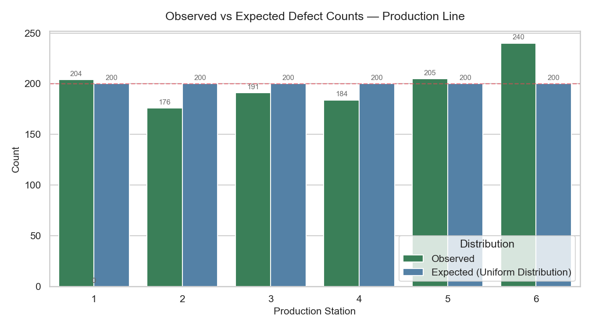
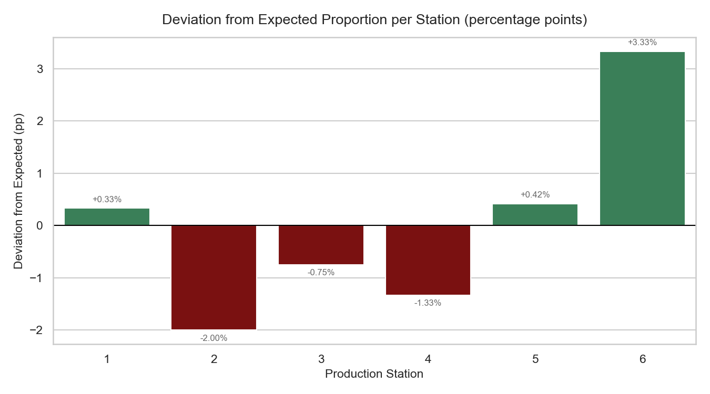
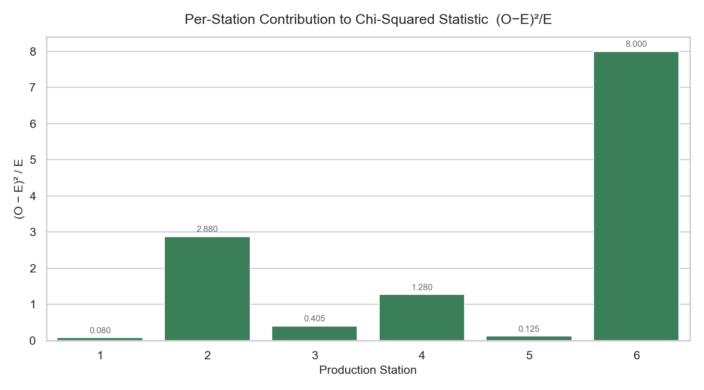

---

layout: default

title: Manufacturing Quality Control (Chi-Squared (χ²) Test)

permalink: /chi-squared/

---

# This project is in development

## Goals and objectives:

The business objective for this portfolio project is to apply a Chi-Squared Goodness-of-Fit test within a simulated quality control scenario at a fictional manufacturing facility. The facility operates a six-station production line where defects should, under normal operating conditions, occur with equal probability across all six stations. Any significant deviation from this uniform distribution would indicate that one or more stations are underperforming — whether due to machine wear, calibration drift, or a process fault — and would warrant targeted investigation.

The dataset is synthetically generated within the Python script, simulating 1,200 defect records across six production stations. A subtle but deliberate bias is embedded in the data: one station produces defects at a meaningfully higher rate than the others, with the remaining stations only marginally suppressed to compensate. This bias is intentionally non-obvious — descriptive statistics return values that appear broadly similar across all stations, and no single chart makes the conclusion clear. It is only through the formal hypothesis test that the deviation from the expected uniform distribution can be identified with statistical confidence, reflecting a realistic class of quality control problem where the signal evades detection without the correct statistical framework.

The objective is to apply the Chi-Squared Goodness-of-Fit test to assess whether the observed defect counts across the six stations are consistent with the uniform distribution expected under a well-functioning process. A key secondary objective is to decompose the test statistic to identify which specific station or stations are the primary drivers of any significant result — providing the station-level diagnostic that a quality manager would need to prioritise an investigation.

A further objective is to demonstrate correct application of the test's core assumption: that all expected cell frequencies meet the conventional minimum threshold of five, ensuring the chi-squared approximation is valid. This check is performed explicitly as part of the data validation workflow prior to any testing.

By grounding the analysis in a concrete operational scenario, this project demonstrates the ability to translate a business problem into an appropriate statistical framework, validate the conditions under which that framework applies, and communicate findings in terms of practical significance — identifying not just that a problem exists, but where it is concentrated and what that means for the business.

## Application:  

In statistics, "Chi-squared" is an umbrella term for tests that use the χ² distribution to see if observed data matches what we’d expect by chance. 

The Chi-Squared (χ²) Goodness-of-Fit test is a non-parametric statistical hypothesis test used to determine how well an observed set of categorical data fits an expected distribution. Unlike the Chi-Squared Test of Independence (commonly used in A/B testing to compare two groups), the Goodness-of-Fit test compares a single sample against the distribution of a known population or a theoretical model.  The null hypothesis is that the data follows the expected distribution.

The test evaluates the "distance" between observed frequencies (O) and expected frequencies (E). If the calculated χ² value is significantly high, it indicates that the deviations between what was observed and what was expected are too large to be attributed to random chance, leading us to reject the null hypothesis that the data follows the specified distribution.

This approach is applicable across many industry sectors and scenarios. Practical examples showing where a Chi-Squared (χ²) Goodness-of-Fit test provides clear business value include:

🛍️ **Retail**: A clothing retailer uses the test to determine if the actual sales volume across different sizes (S, M, L, XL) matches the historical inventory distribution models.  

💻 **Technology**: A UX researcher applies the test to verify if the distribution of user clicks across five different navigation menu items is uniform, or if certain items are being disproportionately favored or ignored.  

🔬 **Science & Research**: A genetics researcher uses the test to confirm if the observed phenotypic ratios in a cross-breeding experiment align with the 9:3:3:1 ratio predicted by Mendelian inheritance laws.  

🏭 **Manufacturing**: A quality control engineer performs the test to check if the frequency of different types of defects (e.g., scratches, dents, or discolorations) matches the expected defect profile for a specific production line.

**Key Assumptions**:  To ensure the validity of the results, the following criteria must be met:
* **Categorical Data**: The variables must be nominal or ordinal.
* **Independence**: Each observation must be independent of the others.
* **Sample Size**: Each "cell" or category should have an expected frequency of at least 5.
* **Mutually Exclusive**: Each subject or item must fit into one, and only one, category.

## Methodology:  

The analysis was implemented in Python using pandas for data manipulation, scipy for statistical testing, and seaborn and matplotlib for visualisation. The dataset was synthetically generated within the script, simulating 1,200 defect records distributed across six production stations, with a subtle bias embedded in the station probabilities.

**Data Validation**:  
Prior to analysis, five validation checks were applied: total record count and dtype confirmation, missing value detection, invalid station value detection, confirmation that all six stations were represented, and a minimum expected frequency check — the core assumption of the Chi-Squared Goodness-of-Fit test, requiring all expected cell counts to be at least five. All checks passed.  

**Exploratory Data Analysis**:  
Descriptive statistics were calculated for each station, including observed count, observed percentage, expected percentage, and deviation in percentage points. Two charts were produced to support visual inspection: a grouped bar chart comparing observed and expected defect counts per station, and a signed deviation chart showing each station's departure from the expected proportion.  

**Statistical Testing**:  
The Chi-Squared Goodness-of-Fit test was applied using scipy, testing the null hypothesis that defects are uniformly distributed across all six stations against the alternative that the distribution is non-uniform. The significance threshold was set at α = 0.05. The per-station contribution to the chi-squared statistic — calculated as (O−E)²/E for each station — was additionally examined to identify which station was the primary driver of any significant result.  

## Results:

**Descriptive Statistics**:  
Observed defect counts and their deviation from the expected uniform proportion are summarised below, noting that the expected distribution is normal therefore the percentage expected is 16.67% for each station.

```
Station  Observed  Observed %   Deviation %
      1       204       17.00         +0.33
      2       176       14.67         −2.00
      3       191       15.92         −0.75
      4       184       15.33         −1.33
      5       205       17.08         +0.42
      6       240       20.00         +3.33
```

At a glance, five of the six stations sit within 2 percentage points of the expected 16.67%, and no single station's count appears dramatically out of place. Station 6 records the highest defect count at 240, but a difference of this magnitude is not self-evidently significant from inspection alone — precisely the scenario where a formal hypothesis test adds value. 

The deviation chart below makes the directional pattern clearer, with Station 6 the only station showing a meaningful positive deviation and Station 2 the most suppressed.


**Chi-Squared Goodness-of-Fit Test**:  
The test was applied with five degrees of freedom (k − 1, where k = 6 stations), against a critical value of 11.070 at α = 0.05.  This produced a Chi-squared statistic of 12.770 and a p-value of 0.0256.  

As χ² = 12.770 exceeds the critical value of 11.070 and p = 0.026 < 0.05, the null hypothesis is rejected. There is statistically significant evidence that defects are not uniformly distributed across the six production stations.

**Per-Station Contributions**:
Decomposing the test statistic reveals that Station 6 accounts for 62.6% of the total χ² value (contribution: 8.000), making it the dominant driver of the significant result. Station 2 is the next largest contributor at 2.880. The chart below illustrates this clearly.



## Conclusions:

The Chi-Squared Goodness-of-Fit test returns a statistically significant result (χ² = 12.770, p = 0.026), providing evidence that the distribution of defects across the six production stations is not consistent with the uniform distribution expected under normal operating conditions. The null hypothesis is rejected.  

Decomposition of the test statistic identifies Station 6 as the primary source of this result, contributing 8.000 of the total 12.770 — 62.6% of the statistic — driven by an observed defect count of 240 against an expected count of 200. In a real operational context, this finding would direct quality control resource specifically at Station 6 rather than initiating a broad line-wide investigation, representing a direct efficiency gain from the statistical analysis.  

It is important to note that statistical significance confirms the non-uniformity of the defect distribution is unlikely to be due to chance; it does not identify the root cause. The elevated defect rate at Station 6 could reflect machine wear, calibration drift, a process fault, or an operator factor, and would require further investigation to diagnose. The statistical result narrows the search considerably — it does not complete it.

## Next steps:  

With any analysis it is important to assess how the model and application of the analytical methods can be used and evolved to support the business goals and business decisions and yield tangible benefits.


## Python code:
You can view the full Python script used for the analysis here: 
[View the Python Script](/chi-squared gof_v1.py)
