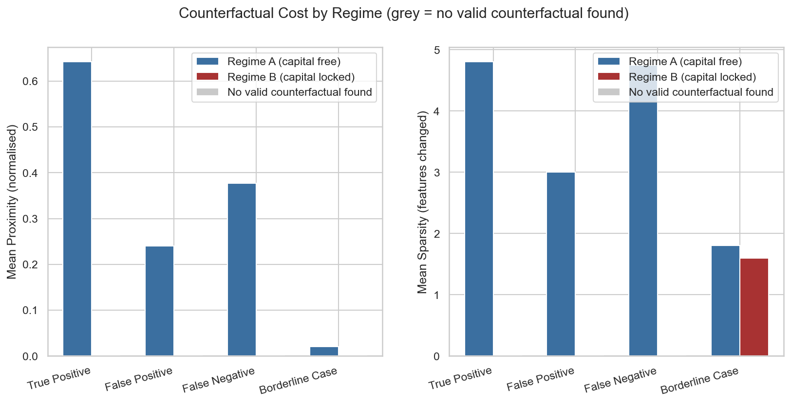
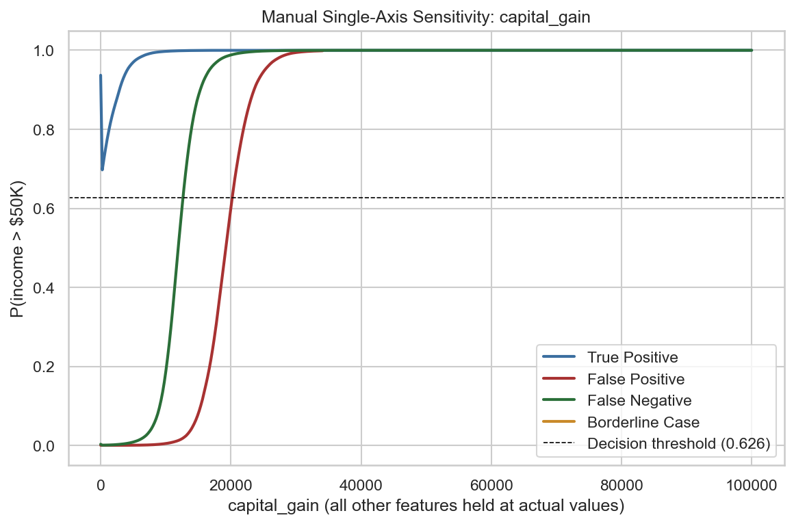

---

layout: default

title: The Minimal Path to a Different Outcome (Counterfactual Explanations)

permalink: /counterfactual-explanations/

---

## Goals and objectives:

The [LIME project](/lime/) established that the MLP model's decisions rest on a strikingly narrow foundation: across four representative cases, `capital_gain` and `capital_loss` dominated every single explanation, at contribution magnitudes so consistent (+0.65 to +0.69 for `capital_gain`, regardless of which individual was being explained) that the finding looked less like ordinary feature importance and more like near-deterministic reliance on two features out of fourteen.

LIME can show that this reliance exists. It cannot show how far it goes. This project answers the natural follow-up question LIME's own Next Steps section raised: if `capital_gain`/`capital_loss` were locked at an individual's actual values and every *other* actionable feature were free to change, could the model's decision still be flipped — or is the reliance strong enough that no combination of the remaining features can substitute for it?

Reusing the same trained MLP, fitted preprocessor, and test-set artifacts exported by the MLP project — and explaining the identical four cases LIME selected, for direct continuity — the objectives were to:

- **Find the minimal, actionable change to an individual's features that would flip the model's prediction**, using DiCE (Diverse Counterfactual Explanations) as the primary search method, restricted to features an individual could plausibly act on.
- **Directly stress-test the LIME finding** by searching under two regimes for every case: once with `capital_gain`/`capital_loss` free to vary, and once with them locked at the individual's actual values — turning "these features dominate the explanation" into a falsifiable, quantified claim about whether the model can be flipped *without* them at all.
- **Cross-validate DiCE's proposals with an independent, exactly-computable method** — a manual single-axis search along `capital_gain` alone — rather than relying on a single search algorithm's output.
- **Treat "no counterfactual found" as a legitimate result**, not a failure to hide, wherever the locked regime genuinely cannot flip a case within a realistic search budget.

## Application:  

Counterfactual explanations address a different and complementary question to most explainability techniques: not "why did the model predict this?", but "what would need to change for the model to predict something else?" A counterfactual explanation identifies the smallest, most plausible change to an individual's input features that would flip the model's prediction to a different, typically more favourable, outcome.

The core principle is one of minimal, actionable perturbation. Given a specific observation and an undesired prediction, a counterfactual search algorithm explores the feature space to find a nearby point — one differing from the original as little as possible, and ideally involving only features the individual could realistically influence — that the model would classify differently. Rather than describing the model's internal reasoning, this approach describes a concrete path from the current outcome to a desired one, framed in terms the affected individual can act upon. Constraints are typically applied during the search to ensure the resulting counterfactual is both plausible, remaining within the realistic bounds of the training data distribution, and actionable, avoiding changes to immutable characteristics such as age or protected attributes.

This distinguishes counterfactual explanations from feature-attribution methods such as LIME or SHAP: rather than ranking the importance of features in a prediction, they generate a specific, alternative scenario. This makes them particularly well suited to contexts where the end user is the individual affected by the decision, rather than the analyst building the model.

This approach is applicable across many sectors and scenarios. Practical examples showing where Counterfactual Explanations provide clear business value include:

🏦 **Finance**:

**Credit decision recourse**: A lender tells a declined loan applicant that approval would have followed if their credit utilisation had been reduced by a specific amount, giving the applicant a concrete, achievable path to future approval rather than a vague rejection.

**Insurance premium guidance**: An insurer explains to a policyholder the specific behavioural or coverage changes that would reduce their premium, supporting transparent and actionable customer communication.

**Regulatory compliance**: Financial institutions use counterfactual explanations to demonstrate to regulators that adverse automated decisions are based on legitimate, actionable factors rather than protected characteristics.

🏥 **Healthcare**:

**Treatment pathway planning**: Clinicians explore which modifiable patient factors — such as blood pressure or medication adherence — would need to change to move a patient out of a high-risk prediction band, informing care planning discussions.

**Preventative care targeting**: Public health teams identify the smallest lifestyle interventions that would shift an individual out of a predicted high-risk category, focusing preventative resources on the most impactful, achievable changes.

**Clinical trial eligibility**: Researchers determine the minimal changes in patient biomarkers that would alter eligibility classification for a trial, supporting recruitment strategy.

👥 **Human Resources**:

**Hiring feedback**: Recruiters give rejected candidates specific, constructive feedback on which qualifications or experience would have changed an automated screening outcome, improving candidate experience and reducing legal exposure.

**Promotion pathway clarity**: Employees are shown the specific, achievable performance changes that would alter a predicted promotion-readiness classification, supporting transparent career development.

**Retention intervention design**: HR teams identify the minimal, actionable changes — such as workload adjustment — that would shift an employee out of a high flight-risk prediction, informing targeted retention conversations.

🛍️ **Retail & Marketing**:

**Customer retention offers**: A subscription business identifies the smallest incentive or service change that would flip a customer's predicted churn outcome, informing cost-effective retention offer design.

**Loan and credit product eligibility**: A retail finance provider shows a customer declined for a store credit product the specific change in spending behaviour that would alter their eligibility outcome.

**Marketing eligibility transparency**: Customers excluded from a loyalty tier are shown the specific, achievable spending threshold that would include them, supporting transparent programme design.

## Methodology:  

The methodology builds directly on the artifacts and case-selection logic established by the MLP and LIME projects, extending them with a purpose-built dual-regime counterfactual search. The project is implemented in Python, using DiCE (`dice-ml`) for counterfactual generation, scikit-learn for the model pipeline, and seaborn/matplotlib for visualisation.

**A framing note, stated plainly.** The model underlying this project predicts whether an individual's *income* is above or below $50,000/year — nothing about that changes here. The loan/credit-recourse language used in this write-up (and in the actionable/immutable feature split below) is an illustrative analogy, not a claim that this model performs credit scoring. It is a well-precedented one: the UCI Adult Income dataset is the standard illustrative dataset in the counterfactual explanations literature specifically because its structure — a binary outcome, a mix of continuous and categorical features, and several protected attributes — mirrors a credit or loan decision closely enough to motivate the same actionable/immutable reasoning a real recourse system would need. That analogy is doing genuine, load-bearing work in the choices below (it is *why* excluding `age`/`race`/`sex`/`native_country` from the search makes real-world sense at all — "an individual can't change their race to earn a different reported income" is a category error on its own terms, but becomes meaningful under the recourse analogy), which is exactly why it is worth stating explicitly here rather than leaving it implicit.

**Reused artifacts and case selection.** The trained MLP, fitted preprocessor, and test-set features/labels exported by the MLP project are loaded unchanged. The two are wrapped into a single `sklearn.pipeline.Pipeline`, requiring no refitting, so that DiCE can query one object that accepts raw 14-column input directly — matching the raw-feature-space approach LIME used for readability. A round-trip check confirms the wrapped pipeline's predictions are identical to computing the two stages separately. The same four cases LIME explained — the most confident true positive, false positive, and false negative, plus the row sitting exactly on the tuned 0.626 decision threshold — are reselected here using LIME's identical selection logic, guaranteeing continuity rather than coincidence.

**Actionable vs. immutable features.** Counterfactual search is restricted to features an individual could plausibly act on: `workclass`, `occupation`, `education_num`, `hours_per_week`, `capital_gain`, `capital_loss`, and their two engineered binary flags. `age`, `race`, `sex`, and `native_country` are excluded as immutable or protected characteristics. `marital_status` and `relationship` are *also* treated as immutable here — a deliberate judgement call, not a hard rule: neither is legally protected in the same way as the features above, but neither is something a loan applicant could realistically act on to change an outcome, and allowing the model to "recommend" changing them would sit poorly against the credit-scoring framing this project uses. A different, equally defensible portfolio might treat these two as actionable; this project states the choice explicitly rather than leaving it implicit.

**Dual-regime search.** Every case is searched twice:
- **Regime A** — all actionable features free to vary, including `capital_gain`/`capital_loss`.
- **Regime B** — the same actionable set, but with `capital_gain`, `capital_loss`, and their binary flags locked at the individual's actual values.

Regime B is the direct, falsifiable extension of the LIME finding: if the model's reliance on capital activity is genuinely close to deterministic, Regime B should struggle or fail outright to find a valid counterfactual for cases where those features are doing the work — even with every other actionable feature still available to compensate.

**DiCE configuration.** DiCE's genetic method is used rather than its gradient-based alternative, since the wrapped pipeline includes a `ColumnTransformer` and is not differentiable end-to-end. DiCE's reference distribution is built from the same 9,763-row test set LIME used, for the same reason: only the test split was persisted by the MLP project, and at that size it is a large, representative sample of the population.

**A genuine engineering constraint surfaced during development.** DiCE's genetic method builds its initial population by repeatedly sampling random candidate instances until enough valid ones are found — a loop with no built-in upper bound. Where a flip is genuinely very hard or impossible to reach at random (precisely the scenario Regime B is designed to probe), this loop can run indefinitely with no error raised. Every search is therefore run under a hard wall-clock timeout (90 seconds), enforced via a background thread rather than a signal-based timeout, for portability across the Windows environment this portfolio is developed in. A search that exhausts this budget without finding a valid counterfactual is treated as a legitimate, reportable result — a locked-out search — rather than a bug to be hidden.

**Feature-consistency repair.** `capital_gain`/`capital_loss` and their engineered binary flags (`has_capital_gain`/`has_capital_loss`) are presented to DiCE as independent features, since DiCE has no built-in concept of a derived column. A raw proposal could therefore suggest an internally inconsistent combination — `capital_gain = 5,000` alongside `has_capital_gain = 0`. Every generated counterfactual is repaired post-hoc by recomputing the two flags from the proposed numeric values, and only re-scored through the pipeline afterwards, before being counted as valid. This step turned out to matter substantively, not just defensively — see Results.

**Metrics.** Every valid counterfactual is scored on **validity** (does it actually achieve the opposite predicted class, at the tuned 0.626 threshold, after repair?), **sparsity** (how many actionable features changed), and **proximity** (mean absolute normalised distance, continuous features only — undefined, not zero, where every changed feature was categorical).

**Manual sanity-check.** For each case, `capital_gain` is swept in isolation — holding every other feature, including every other actionable feature, fixed at its actual value — to find the minimum single-axis change that crosses the decision threshold. This answers a narrower, exactly-computable question than DiCE's search, and provides an independent cross-check on whatever DiCE proposes for the same feature under Regime A.

## Results:

The dual-regime search produced a clean, three-way split across the four cases — the clearest possible confirmation of the LIME finding.

| Case | Regime A (capital free) | Regime B (capital locked) |
|---|---|---|
| True Positive (`capital_gain` = 99,999) | Valid CF found in 0.6s | **Timed out after 90s — no valid CF found** |
| False Positive (`capital_gain` = 34,095) | Valid CF found in 1.2s | **Timed out after 90s — no valid CF found** |
| False Negative (`capital_gain` = 0) | Valid CF found in 0.8s | **Completed in 2.6s, but 0/5 proposed CFs survived consistency repair** |
| Borderline Case (`capital_gain` = 0) | Valid CF found in 6.1s | Valid CF found in 0.8s |

**True Positive and False Positive: the model cannot be flipped without touching capital activity.** For both cases — where `capital_gain` is large and doing the heavy lifting of the original prediction — Regime A finds a valid counterfactual almost immediately (mean sparsity 4.8 and 3.0 features changed respectively, mean proximity 0.64 and 0.24), invariably changing `capital_gain` alongside one or two other features. Regime B, locked out of touching `capital_gain`/`capital_loss` at all, exhausts the full 90-second search budget for both cases without finding a single valid flip. This is not a soft "harder to flip" result — it is a hard, quantified boundary: no combination of `education_num`, `hours_per_week`, `workclass`, and `occupation` alone was sufficient within the search budget to overcome what `capital_gain` alone was contributing.

**False Negative: the consistency-repair step changed the actual finding, not just the code's robustness.** Regime A found four valid counterfactuals easily (mean sparsity 4.75, mean proximity 0.38), each pushing predicted probability to 1.000. Regime B *completed* in 2.6 seconds — it did not time out — but every one of its five proposed counterfactuals failed the post-repair validity check. DiCE's internal validity check evidently passed these proposals using an inconsistent combination of `capital_gain` and its binary flag; once repaired to a consistent state and re-scored, none actually flipped the prediction. Without the repair step, this would have been miscounted as a Regime B success. With it, this case joins the True Positive and False Positive as a third case where Regime B produces no valid counterfactual — for a subtly different reason than a timeout, but the same underlying conclusion.

**Borderline Case: the only case where locking capital activity doesn't matter.** Starting from `capital_gain = 0` and sitting exactly on the 0.626 threshold, this case flips easily under both regimes — Regime A in 6.1 seconds (mean sparsity 1.8), Regime B in 0.8 seconds (mean sparsity 1.6) — almost always via a change to `occupation` alone or in combination with `workclass`. Because every valid counterfactual found for this case changed only categorical features, proximity is genuinely undefined (not zero) for most of them; the one Regime A counterfactual that did touch a continuous feature (`hours_per_week`, alongside `occupation`) shows a proximity of just 0.020 — the cheapest flip found anywhere in this project, consistent with this case already sitting on the boundary in the first place.

**Manual single-axis sanity-check.**

Holding every other feature fixed, `capital_gain` alone is swept from each case's actual value toward the opposite class:

- **True Positive**: no value of `capital_gain` in [0, 99,999] flips the prediction alone — consistent with Regime B's inability to flip this case even with every *other* feature free to move; here, not even `capital_gain` in isolation is enough without also changing something else.
- **False Positive**: `capital_gain` 34,095 → 20,166 flips the prediction alone (a reduction of 13,929) — a specific, independent confirmation of the same feature DiCE's Regime A proposed changing.
- **False Negative**: `capital_gain` 0 → 12,782 flips the prediction alone (an increase of 12,782).
- **Borderline Case**: trivially, no value flips it, since the actual value is already 0 and the individual is predicted `>50K` — there is no room to search in either direction along this one axis.

The sensitivity curve above also reveals a sharper, more mechanistic version of the LIME finding. Rather than a smooth ramp, the True Positive's curve shows a sharp drop right at `capital_gain = 0` before recovering: because the swept grid keeps `has_capital_gain` consistent with `capital_gain` throughout, only the single exact `capital_gain = 0` point has the flag at 0 — every other point, however small, has the flag at 1. The result is that the binary flag itself carries a large, near-discontinuous jump in predicted probability right at the zero/non-zero boundary, on top of a smoother response to magnitude above that. LIME's explanations already showed the flag and the numeric value as separately-weighted contributors; this shows how the two compose in practice.

## Conclusions:

- **`capital_gain`/`capital_loss` are not merely influential — for two of the four cases, they are load-bearing in a strict, quantified sense.** The True Positive and False Positive cases cannot be flipped by any combination of the remaining actionable features within a realistic search budget, once capital activity is locked at its actual value. This is a materially stronger claim than LIME's original finding, which showed high contribution magnitude but could not show whether other features could substitute for it.
- **The False Negative and Borderline cases reveal exactly where that reliance stops applying.** Both start from `capital_gain = 0`. For the Borderline Case, the remaining actionable features are more than sufficient to flip the prediction cheaply in either regime. For the False Negative, Regime A flips it easily by raising `capital_gain`, but Regime B — forced to use only the other actionable features — fails once repaired for consistency, despite DiCE's own internal check initially reporting otherwise.
- **The consistency-repair step was not a defensive formality — it changed a result.** Had the repaired, re-scored validity check not been applied, the False Negative's Regime B search would have been counted as a success, understating the extent of the model's reliance on capital activity. This is a direct methodological argument for verifying, rather than trusting, what a counterfactual library's own validity flag reports whenever engineered features are involved.
- **A hard, quantified split emerged across the four cases: three lock out entirely under Regime B (two by timeout, one by failed repair), and only one — the case that started at zero capital activity in the first place — does not.** That asymmetry is the central, falsifiable extension of the LIME project's closing paragraph, and it held up cleanly on the real trained model, not just in principle.
- **The manual single-axis search corroborates, rather than merely repeats, DiCE's Regime A proposals.** For the False Positive and False Negative cases, the independently-computed minimum `capital_gain` change (13,929 and 12,782 respectively) is consistent with DiCE choosing to change `capital_gain` as part of its own proposed combination — two different search methods pointing at the same feature as decisive.

## Next steps:  

- **Extend the dual-regime methodology beyond four hand-picked cases.** This project, like the LIME project before it, deliberately explains a small, representative set of cases rather than the full test set. Running the same Regime A/B search across a larger random sample would establish whether the True Positive/False Positive pattern found here — full lock-out under Regime B — is typical of any individual with substantial capital activity, or specific to these two cases.
- **MLOps.** The exported artifacts, the wrapped pipeline, and the dual-regime search logic built here are a natural fit for an MLOps project, particularly around monitoring whether a deployed model's reliance on a small number of dominant features drifts over time as the underlying population changes.
- **Anomaly Detection.** The False Positive case — a 19-year-old with 6 years of education and a large `capital_gain` value — is itself an unusual combination of features. A dedicated anomaly detection pass over the test set could identify whether other individuals share this same "atypical profile, dominant capital signal" pattern, and whether they cluster around similarly hard-to-flip Regime B outcomes.
- **A finer-grained manual search.** The single-axis sanity-check swept `capital_gain` only, per this project's agreed scope. Extending it to a joint `capital_gain`/`capital_loss` grid for cases where both are non-zero would show whether the two features trade off against each other, or whether one alone always dominates the flip.

## Python code:
You can view the full Python script used for the analysis here: 
[View the Python Script](/conterfactual_explanations_v1.2.py)
