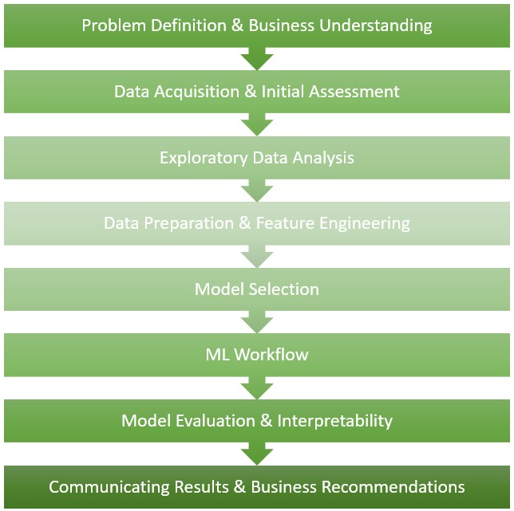

---

layout: default

title: Data Science Workflow

permalink: /data-science-workflow/

---

## Introduction to the Data Science Workflow  

Data science is often presented as a collection of techniques — statistical tests, machine learning algorithms, deep learning architectures. Each is powerful in its own right, but technique alone does not produce good analysis. What separates reliable, impactful data science from ad hoc number-crunching is the process behind it: a disciplined, structured approach that connects a business question to a meaningful, well-evidenced answer.

The Data Science Workflow is that process. It describes the end-to-end journey from problem definition to recommendation — the stages every rigorous data science engagement moves through, regardless of the specific methods involved. Whether the task calls for a hypothesis test, a predictive model, or a deep learning architecture, the same fundamental questions apply: What are we trying to find out, and why? What data do we have, and is it fit for purpose? How should we model the problem, and how do we know if we have done it well? What do the results actually mean for the business?

It is important to emphasise that the workflow is iterative, not linear. In practice, insights uncovered during exploratory analysis frequently reshape the original problem definition. Data preparation often reveals quality issues that require revisiting the acquisition stage. Model evaluation can expose weaknesses that send the analyst back to feature engineering. This cycle of refinement is not a sign of poor planning — it is the nature of working with real data and real questions, and embracing it is a mark of mature analytical practice.

The sections that follow describe each stage of the workflow in detail, explaining both what happens at that stage and why it matters. Throughout, the projects in this portfolio are referenced to show how each stage is applied in practice — grounding the framework in concrete, worked examples rather than abstract description.  The 8 sections of the Data Science workflow are described below.

* Problem Definition & Business Understanding  
* Data Acquisition & Initial Assessment  
* Exploratory Data Analysis (EDA)  
* Data Preparation & Feature Engineering  
* Model Selection: Choosing the Right Approach  
* The Machine Learning Workflow (Sub-Section)  
* Model Evaluation & Interpretability  
* Communicating Results & Business Recommendations  

## Problem Definition & Business Understanding

Every data science engagement begins before a single line of code is written, before a dataset is loaded, and before any technique is selected. It begins with a question — and, more specifically, with the discipline of asking the right one.

Problem definition is the process of translating a business need into a precise analytical objective. This sounds straightforward, but in practice it is where many projects go wrong. A vague or poorly framed question produces analysis that is technically competent but practically useless. "How is our business performing?" is not an analytical question. "Is there a statistically significant difference in average transaction value between customers acquired through paid search and those acquired through organic channels?" is. The move from the first to the second requires close collaboration with stakeholders, a clear understanding of the decision that needs to be made, and an honest assessment of what data is available to address it.

Several considerations shape good problem definition. First, what is the decision this analysis will support? Understanding the downstream action — whether that is a pricing change, a product intervention, a resource allocation decision, or a risk assessment — determines what kind of answer is actually needed. Second, what does success look like? Defining evaluation criteria upfront, before modelling begins, avoids the temptation to select metrics retrospectively in favour of a preferred result. Third, are there constraints — on time, data availability, interpretability, or regulatory requirements — that should influence the choice of approach?

In this portfolio, each project is framed around a fictional but realistic business scenario, and the analytical objective is stated explicitly at the outset. This reflects the importance of anchoring technical work to a clear purpose. The One-Sample T-Test project, for example, addresses whether a manufacturing process is meeting a specified quality threshold — a concrete operational question with a defined pass/fail criterion. The Logistic Regression project frames customer churn prediction in terms of identifying at-risk customers before they leave, with commercial retention value as the motivating context. The SVM project applies classification to medical diagnostics, where the cost of a false negative has direct clinical consequences. In each case, the business framing is not decoration — it shapes which methods are appropriate, how results should be interpreted, and what recommendations follow.

## Data Acquisition & Initial Assessment

With a well-defined problem in hand, the next stage is establishing what data is available to address it, and whether that data is fit for purpose. These are distinct questions, and answering the second honestly is just as important as answering the first.

Data acquisition covers the identification and collection of relevant data. Sources vary considerably in practice — transactional databases, APIs, third-party datasets, sensor feeds, survey responses, web-scraped content, or synthetically generated data. In this portfolio, all projects use either publicly available datasets or synthetically generated data, chosen specifically because they are well-understood, reproducible, and allow the focus to remain on the analytical method rather than data sourcing complexity. Real-world engagements typically involve far messier acquisition challenges, including access controls, data governance requirements, schema inconsistencies across systems, and latency in data availability.

Initial assessment follows acquisition and is concerned with understanding the raw material before any transformation or modelling begins. At this stage, the analyst is asking: what are the dimensions of this dataset? What variable types are present — continuous, categorical, ordinal, binary? Are there obvious completeness issues — missing values, truncated records, implausible entries? What is the time span, if relevant? Is there reason to suspect the data has changed in character over time, for example due to a process change, a system migration, or an external event?

This initial assessment is not EDA in the full analytical sense — that comes next — but it is a necessary preliminary audit that informs how much preparation work will be required before modelling can begin. The Great Expectations project in this portfolio is directly relevant here: it demonstrates a systematic, automated approach to data validation, establishing rules and expectations about what a dataset should look like and flagging deviations programmatically. This kind of framework is particularly valuable when working with data that is regularly refreshed or sourced from external pipelines, where silent data quality degradation is a real operational risk.

## Exploratory Data Analysis

Exploratory Data Analysis - EDA - is the stage at which the analyst gets to know the data before committing to any modelling approach. It is investigative, open-ended, and essential. Its purpose is not to test a hypothesis or build a model; it is to develop a thorough understanding of the structure, distribution, and relationships within the data, and to surface any characteristics that will affect the analysis downstream.

Good EDA typically covers several areas. Univariate analysis examines the distribution of individual variables: central tendency, spread, skewness, and the presence of outliers. Bivariate and multivariate analysis explores relationships between variables — correlations, conditional distributions, and interactions that may be relevant to the modelling objective. Class and category balance is assessed for any target variables that will be used in supervised learning, since imbalanced distributions require specific handling. The presence, extent, and pattern of missing data is examined, as different missingness mechanisms — missing completely at random, missing at random, or missing not at random — call for different imputation strategies.

EDA also frequently generates hypotheses. Patterns observed during exploration often raise new questions or reveal that the original problem framing needs refinement — reinforcing the iterative nature of the workflow described in the introduction. A relationship spotted between two variables during EDA may suggest a feature engineering opportunity; an unexpected distribution may prompt a question about data quality; a temporal pattern may indicate that a time-series approach is more appropriate than a cross-sectional one.

Across the projects in this portfolio, EDA is a consistent first step and is documented in each project write-up. The Logistic Regression project includes detailed exploration of feature distributions and their relationship to churn, informing both the data preparation approach and the feature engineering decisions that followed. The K-Nearest Neighbours project used EDA to identify class imbalance in the wine quality target variable, leading directly to a rebanding decision that significantly improved the validity of the model. The Anomaly Detection project relied heavily on exploratory analysis to establish what "normal" behaviour looked like before attempting to identify deviations from it.

## Data Preparation & Feature Engineering
Raw data is rarely model-ready. Data preparation is the process of transforming it into a form that an analytical or machine learning method can use effectively — and doing so in a way that is principled, reproducible, and appropriate to the technique being applied.

The specific tasks involved in data preparation vary by project, but several are common across most engagements. Missing value treatment requires a decision on how to handle incomplete records — deletion, imputation with a summary statistic, or more sophisticated model-based imputation, depending on the extent and pattern of missingness. Encoding converts categorical variables into numerical representations: binary encoding for two-category variables, one-hot encoding for nominal multi-category variables, and ordinal encoding where category order is meaningful. Scaling and normalisation adjusts the range or distribution of continuous variables, which is essential for distance-based and gradient-based methods but unnecessary for tree-based approaches. Outlier treatment assesses whether extreme values represent genuine observations or data errors, and whether they should be retained, capped, or excluded.

Feature engineering goes beyond cleaning and transformation to the deliberate creation of new variables that improve a model's ability to capture signal. This might involve combining existing variables, computing interaction terms, extracting components from dates or text, or applying domain-specific transformations that make an underlying relationship more directly visible to the model.

Several projects in this portfolio illustrate these decisions clearly. The SVM project highlights the importance of feature scaling: support vector machines are sensitive to variable magnitude, and standardisation is a required preparation step that would be unnecessary for a decision tree operating on the same data. The Logistic Regression project demonstrates the value of feature engineering directly — a second model built on engineered features produced meaningfully improved performance over a baseline model using raw variables alone, illustrating how thoughtful variable construction can substitute for additional data. The K-Nearest Neighbours project required target variable rebanding to address severe class imbalance discovered during EDA — a preparation decision that corrected a structural problem that would otherwise have produced a model biased toward the majority class.

## Model Selection: Choosing the Right Approach
With the data understood and prepared, the analyst faces one of the most consequential decisions in the workflow: selecting the right analytical approach. This is where domain knowledge, statistical understanding, and practical judgement converge — and where experience separates a credible practitioner from one who defaults to the same tool regardless of the problem.

The first distinction to draw is between statistical analysis and machine learning. **Statistical methods** — hypothesis tests, regression models, ANOVA — are appropriate when the goal is inference: drawing conclusions about populations, quantifying the significance of observed differences, or estimating the relationship between variables with formal uncertainty measures.  For inferential methods, key assumptions are checked (e.g., distributional form, independence, variance behaviour) to ensure conclusions are valid.  **Machine learning methods** are more appropriate when the goal is prediction: building a model that generalises to new observations, often at the cost of some interpretability. These objectives are not mutually exclusive, but treating them as the same thing can produce analysis that does neither job well.

Within machine learning, the supervised versus unsupervised distinction drives the next decision. Supervised learning — classification and regression — requires labelled data and is used when the target outcome is known in the training set. Unsupervised learning — clustering, dimensionality reduction, association mining, anomaly detection — operates without labels and is used to discover structure, patterns, or anomalies in the data itself. Within supervised learning, further choices arise: parametric vs non-parametric methods; linear vs non-linear decision boundaries; methods that prioritise interpretability (logistic regression, decision trees) vs those that prioritise predictive performance (gradient boosted trees, support vector machines, neural networks).

The interpretability vs performance trade-off deserves particular attention. In many business contexts, a model that stakeholders can understand and trust is more valuable than a marginally more accurate black box. Regulatory environments — particularly in financial services, healthcare, and insurance — often require that decisions made by models can be explained. The appropriate response is not always to sacrifice performance for interpretability, but to deploy explainability tools alongside complex models. This portfolio's SHAP project addresses exactly this need, applying SHapley Additive exPlanations to the Random Forest Classifier model to make its predictions interpretable at both the global feature importance and individual prediction level — demonstrating that high performance and explainability are not mutually exclusive.

The breadth of this portfolio is intended to reflect genuine familiarity with this decision landscape. Each project documents the rationale for the chosen approach, not just its implementation.

## The Machine Learning Workflow
Within the broader data science workflow, machine learning projects follow a structured internal pipeline that warrants its own detailed treatment. The steps described here apply to all supervised ML projects in this portfolio and provide the technical structure within which model selection, training, and evaluation operate.

**Train / Test Split**. Before any model is trained, the dataset is partitioned into a training set and a held-out test set. The model is fitted exclusively on training data; the test set is reserved as an unseen evaluation sample that provides an honest estimate of how the model will perform on new data. The standard split is typically 80% training, 20% test, though this varies with dataset size. In most settings this separation is non‑negotiable: evaluating a model on the data it was trained on produces optimistically biased performance estimates that do not reflect real-world generalisation.  For time‑series problems, time‑ordered splits (walk‑forward / backtesting) is used rather than random splits to avoid look‑ahead bias.

**Cross-Validation**. For model development and hyperparameter tuning, k-fold cross-validation is preferred over a single validation split. The training set is divided into k folds; the model is trained k times, each time using k-1 folds for training and the remaining fold for validation. This produces a more stable estimate of model performance and makes more efficient use of limited training data. Stratified cross-validation is used when the target variable is imbalanced, ensuring each fold contains a representative class distribution.  All preprocessing (e.g., scaling, imputation, encoding) should be fit on training folds only and applied to validation/test data to avoid data leakage and inflated performance.

**Hyperparameter Tuning**. Most machine learning models contain hyperparameters — configuration settings that are not learned from data but set by the analyst prior to training. Examples include the maximum depth of a decision tree, the number of estimators in a random forest, the regularisation strength in a support vector machine, or the learning rate in a gradient boosted model. Grid search and randomised search over a defined parameter space, evaluated via cross-validation, are the standard approaches to identifying optimal settings. Tuning is always performed on training data; the test set is not consulted until final evaluation.

**Evaluation Metrics**. The right metric depends on the problem. For balanced binary classification, accuracy is a reasonable summary measure, but in the presence of class imbalance or asymmetric misclassification costs, precision, recall, F1-score, and AUC-ROC provide more informative assessments. The confusion matrix — decomposing predictions into true positives, true negatives, false positives, and false negatives — is a standard diagnostic tool. For the medical classification context of the SVM project, false negatives carry higher clinical cost than false positives, making recall a particularly important metric alongside overall accuracy.

**Benchmark Comparisons**. This portfolio uses a consistent benchmark dataset — the Wisconsin Breast Cancer Diagnostic dataset — across several supervised learning projects, enabling direct performance comparison across methods. The progression from Decision Trees (93.86% accuracy) to Random Forests (95.61%) to Gradient Boosted Trees (97.37%) to Support Vector Machines (98.25%) illustrates how, on this dataset and setup, ensemble methods and boosting incrementally improve on the variance and bias characteristics of a single tree. This kind of comparative benchmarking is valuable in practice: it provides empirical justification for model selection rather than relying on reputation or familiarity alone.

To ensure reproducibility, code and datasets is to be versioned, control randomness where relevant, and document environments and model configurations so results can be rerun end‑to‑end.

## Model Evaluation & Interpretability

Training a model that performs well on test data is necessary, but it is not sufficient. Before a model can support business decisions with confidence, two further questions must be answered: is the model behaving as expected, and can its outputs be understood and explained?

Model evaluation goes beyond headline accuracy figures. Diagnostic plots — learning curves, residual plots, calibration curves, and feature importance charts — reveal whether a model is overfitting, underfitting, systematically biased in particular regions of the input space, or producing well-calibrated probability estimates. Error analysis, examining the characteristics of misclassified or poorly predicted observations, frequently surfaces actionable insights: patterns in where the model struggles that point either to data quality issues, missing features, or genuine irreducible uncertainty in the problem.

Model interpretability has become an increasingly important dimension of applied data science, driven both by business requirements and, in regulated industries, legal obligations. Interpretability operates at two levels. Global interpretability describes how the model behaves on average across the full dataset — which features are most influential overall, and in which direction. Local interpretability describes how a specific individual prediction was reached — which features drove that particular outcome, and by how much.

Tree-based models such as Decision Trees provide natural global interpretability through their structure — the split hierarchy is itself a human-readable decision logic. Random Forests and Gradient Boosted Trees sacrifice this structural transparency in exchange for substantially improved predictive performance, but retain a feature importance measure derived from the aggregate contribution of each variable across all trees. For more complex models — and for cases where individual prediction explanations are required — post-hoc explainability methods are needed.

The SHAP project in this portfolio applies this approach in practice. SHAP values, grounded in cooperative game theory, provide a theoretically principled decomposition of each prediction into the contributions of individual features. Applied to the Random Forest Classifier model, SHAP produces both a global summary of feature influence across the dataset and a local explanation for any individual prediction — showing precisely which features pushed the model toward or away from a particular outcome, and by how much. This capability is not an optional enhancement; in many business contexts it is a prerequisite for model deployment, stakeholder trust, and regulatory compliance.

Where models are operationalised, monitoring measures are defined (performance, calibration, drift) and criteria set for retraining or review.

## Communicating Results & Business Recommendations

The final stage of the data science workflow is, in some respects, the most important — and it is the one most frequently underweighted in technical training. A rigorous analysis that produces findings which are not communicated effectively, or conclusions that are not connected to a clear business recommendation, delivers limited value. Data science does not end with a model; it ends with a decision.

Communicating results well requires translating technical outputs into language and formats that are meaningful to the intended audience. Accuracy percentages, p-values, and SHAP plots are appropriate for a technical peer review. They are not, in isolation, appropriate for a business stakeholder who needs to understand whether to change a pricing strategy, invest in a retention programme, or modify a quality control threshold. The analyst's responsibility is to bridge this gap — to explain what the model found, what it means in the context of the original business question, and what action the evidence supports.

Several principles shape good results communication. Conclusions should be directly connected to the question that was asked at the problem definition stage — not simply a summary of model performance metrics. Uncertainty should be acknowledged honestly; overstating confidence in findings is more damaging to long-term credibility than appropriately caveating a result. Limitations should be stated: what this analysis cannot tell us, what additional data or methods would strengthen the conclusion, and what assumptions the findings rest on. Recommended next steps should be concrete and actionable — not a generic suggestion to "gather more data" but a specific proposal for what investigation, intervention, or further analysis the results justify.

In this portfolio, every project concludes with an explicit Results, Conclusions, and Next Steps section, structured to reflect exactly this approach. The framing deliberately moves from technical findings to business implications, ending with recommendations that a stakeholder could act on. This structure is intentional: it reflects the mindset that data science work is complete only when it is useful.

## The Workflow in Practice

The sections above describe each stage of the data science workflow as a general principle. The three examples below show what that principle looks like when applied to specific projects — tracing the workflow decisions made at each stage, where those decisions had real consequences for the analysis, and how they shaped the final recommendation. The projects are chosen to span different analytical contexts: a supervised classification problem, an unsupervised interpretability analysis, and a case where a structural data decision taken during exploratory analysis determined whether the model's results were meaningful at all.

### Bank Customer Churn — Logistic Regression

The business question for this project was precise from the outset: which current bank customers are at risk of churning, and how can that prediction be used to focus retention activity? That framing — centred on a downstream commercial action rather than a modelling objective — shaped every subsequent decision in the workflow.

The dataset acquired was the publicly available Bank Customer Churn dataset from Kaggle, containing 10,000 customer records across ten features and a binary churn target. Initial assessment immediately raised a structural issue: the Class Imbalance Ratio revealed that only 20.4% of customers had churned, producing a ratio of 0.26 between the minority and majority classes. This finding, surfaced before any modelling began, determined the entire evaluation strategy for the project. A model that predicted no-churn for every customer would achieve approximately 79.6% accuracy — a figure that is meaningless as a measure of genuine predictive performance. Accuracy alone was therefore discarded as a primary metric in favour of ROC-AUC, precision, recall, F1-score, and the Area Under the Precision-Recall Curve, which together provide a complete picture of how the model performs across both classes.

The exploratory analysis that followed produced findings with direct business relevance. Churn rate varied markedly by number of products held, peaking sharply at three or more products — a counter-intuitive result that a simpler analysis might have missed. Churn by age rose steadily to a peak of approximately 72% at age 56 before declining, and German customers churned at roughly twice the rate of those in France and Spain. These patterns were not incidental to the modelling — they motivated the feature engineering that followed, in which categorical groupings for age and balance were constructed to give the model more structured representations of these relationships.

The engineered model, incorporating the constructed features alongside the original variables, produced a measurable improvement in predictive performance over the baseline. The comparison between the two models — same dataset, same algorithm, different feature representations — provided direct empirical evidence of the value of deliberate feature construction, and grounded the final business recommendation in a model whose capabilities had been honestly tested and compared.

The recommendation connected directly back to the opening business question: the model identifies specific at-risk customers whose profiles combine the age, geography, product count, and balance characteristics associated with elevated churn probability, enabling the retention team to intervene before those customers leave rather than responding after the fact.

### Wine Quality Prediction — K-Nearest Neighbours

This project illustrates the iterative nature of the workflow more clearly than almost any other in the portfolio — specifically, the way that exploratory analysis can force a structural revision to the problem before modelling begins, and why that revision is a mark of analytical rigour rather than a detour.

The dataset is the UCI Red Wine Quality dataset, containing 1,599 observations rated on a quality scale of three to nine by human sensory panels. The initial approach to the target variable was to define three quality bands: Low (scores 3–4), Medium (scores 5–6), and High (scores 7–9). Exploratory analysis of the resulting class distribution immediately revealed a problem: under this definition, approximately 82% of observations fell into the Medium band. A classifier that predicted Medium for every observation — without consulting any feature data at all — would achieve around 82% accuracy. This is the naive classifier problem, and recognising it required returning to the target variable definition before any model was built.

The solution was to reband: reassigning score 6 from Medium to High produced a substantially more balanced distribution — Low 4.6%, Medium 42.5%, High 52.9% — and reduced the naive baseline accuracy to approximately 52.9%. That revision is semantically defensible: a score of 6 on a sensory quality scale is above average and is reasonably grouped with scores 7 and 8 as collectively good-quality wine. But more importantly, it is analytically necessary. Without it, any accuracy figure reported for the model would be uninterpretable, because the threshold for genuine learning would be concealed rather than quantified. The decision to accept a lower headline accuracy in exchange for an honest baseline is the central analytical point of the project.

With the target variable correctly defined, the workflow proceeded to feature scaling — a mandatory pre-processing step for KNN, since the algorithm computes Euclidean distances between observations and features on different numerical scales would otherwise dominate the distance calculation purely by virtue of their range. Hyperparameter selection identified K = 15 as the optimal neighbourhood size through systematic evaluation across K = 1 to K = 30, with training and test accuracy plotted across the full range to make the bias-variance trade-off visible. The final model achieved a test accuracy of 70.6% — a meaningful result, because the naive baseline of 52.9% provides an honest reference point against which that figure can be interpreted.

The recommendation arising from the project was clear: chemical composition, particularly alcohol content, volatile acidity, and sulphates, carries learnable predictive signal about wine quality that is coherent with established domain knowledge. The model's feature importance rankings align with the chemical narrative, which means its outputs are not only accurate but explicable to a winemaker or quality manager — a property the project explicitly identified as relevant to any applied deployment of the results.

### Breast Cancer Diagnostics — SHAP Interpretability

The SHAP project occupies a different position in the workflow from the two projects above. There is no data acquisition stage, no feature engineering, and no model selection problem to solve. The analytical question is more targeted: given that a Random Forest classifier already achieves 95.61% test accuracy on the Wisconsin Breast Cancer Diagnostic dataset, does that performance figure alone constitute a sufficient basis for clinical deployment?

The answer, developed through the project, is that it does not. A model achieving 95% accuracy on a held-out test set is necessary but not sufficient for a context in which its predictions inform clinical decisions about individual patients. A clinician who cannot understand why a model classified a specific tumour as malignant cannot meaningfully evaluate whether to act on that classification — and a model that cannot explain itself cannot be audited when its outputs are challenged. The problem definition for the SHAP project is therefore not "build a better model" but "make an existing model accountable."

The SHAP analysis applied TreeSHAP to the Random Forest across its full test set of 114 observations, computing exact Shapley values for each of the 30 features and each individual prediction. The global analysis revealed a concentrated importance structure: five features — worst area, worst perimeter, worst concave points, mean concave points, and worst radius — account for 54.5% of the total mean absolute SHAP value across all 30 features. All five relate to the size and geometric irregularity of the tumour's worst-case cell nuclei, which is consistent with established clinical understanding of the difference between malignant and benign tissue. The model has not distributed its reliance arbitrarily — it has learned to weight the biologically significant measurements most heavily, and SHAP makes that learning explicit.

Local waterfall plots for individual patient predictions demonstrated the practical value of observation-level explanation. For a high-confidence malignant classification, worst area and worst concave points were the dominant drivers, with SHAP contributions of 0.085 and 0.082 respectively against a baseline prediction of 0.376. For a high-confidence benign classification, the same features acted in the opposite direction — the same cell nucleus measurements that push strongly towards malignant in one patient push strongly towards benign in another, confirming that these features represent the primary axis of separation in the model's learned representation.

The comparison between SHAP-derived rankings and native Random Forest feature importance produced a methodologically significant finding: the top five features are ranked identically by both methods, and the maximum rank discrepancy across the top ten is three positions. Native importance is computed on training data using mean impurity decrease and can be biased towards high-cardinality features; SHAP values are computed on the held-out test set and reflect genuine marginal contributions to individual predictions. The consistency between the two strengthens confidence in both: the features the model relies on most in training are genuinely the features that drive its predictions on unseen data.

The recommendation connected this back to the original clinical framing. A Random Forest that achieves 95.61% accuracy and can explain its reasoning in terms of specific, biologically coherent cell nucleus measurements — with stable directional relationships, identifiable threshold effects, and observation-level prediction decompositions — is a fundamentally more deployable diagnostic tool than one that produces the same accuracy figure opaquely. Interpretability is not a supplement to performance in this context; it is a prerequisite for it.

---

Every project in this portfolio follows this same end-to-end approach. The three examples above illustrate how it plays out across different analytical contexts — from a data-driven revision to a target variable definition, to the selection of evaluation metrics appropriate to a class-imbalanced problem, to the transformation of a black-box accuracy figure into an auditable clinical decision-making tool.
