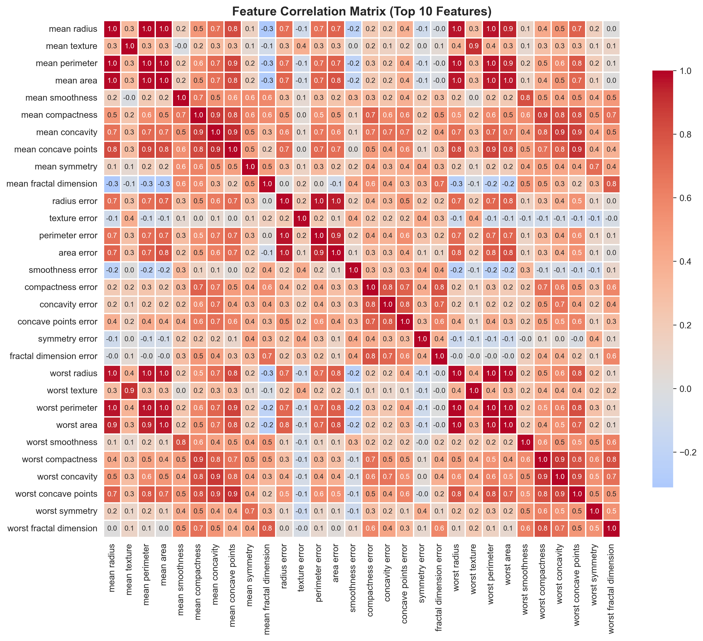
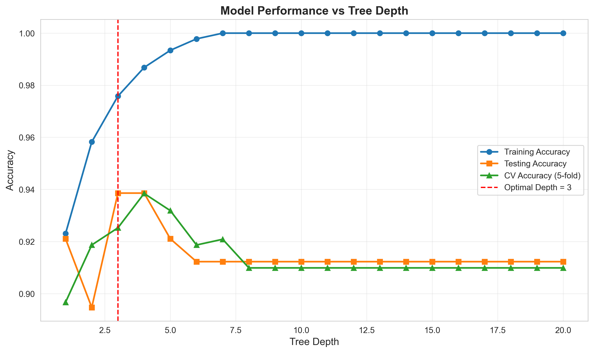
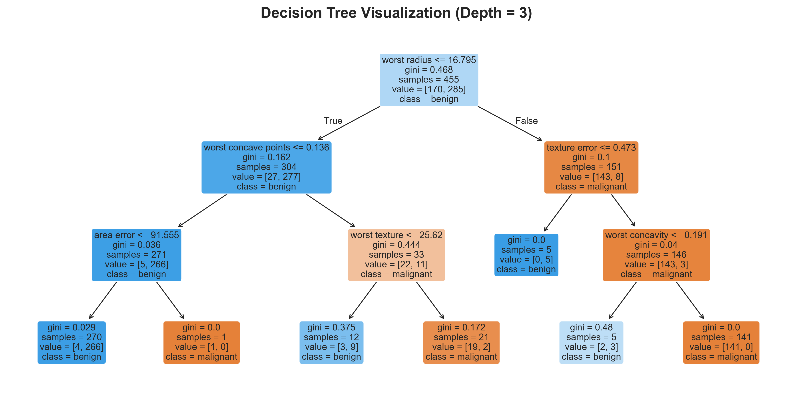
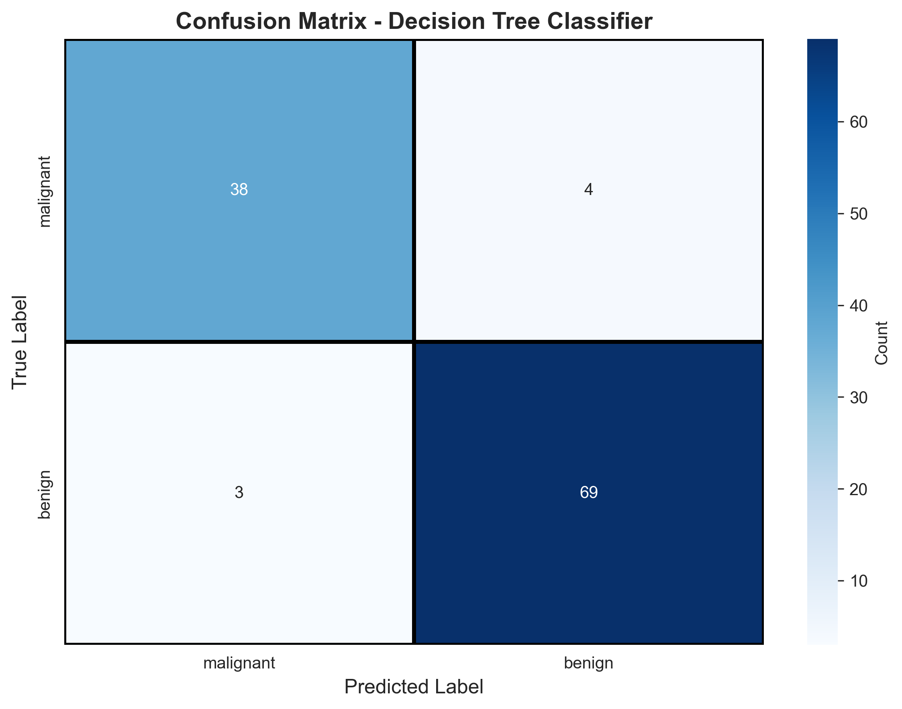
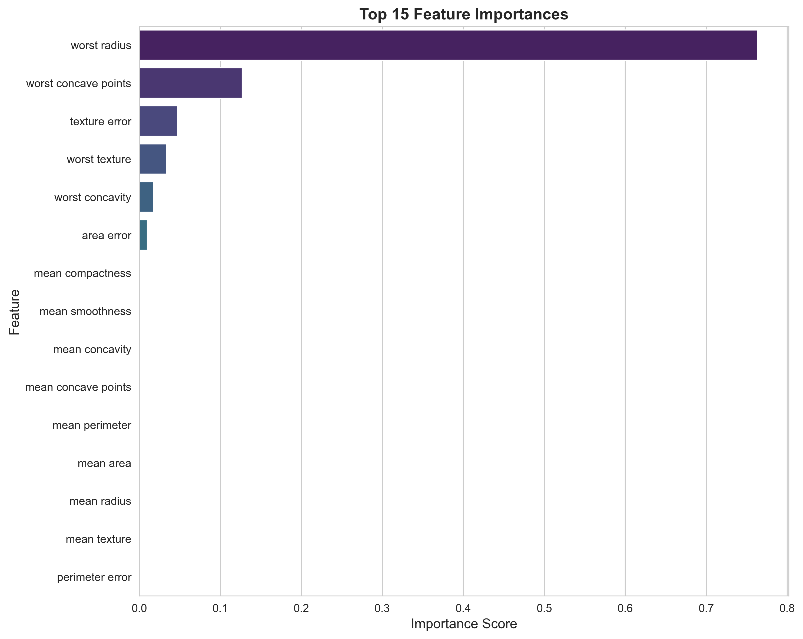

---

layout: default

title: Breast Cancer Predictions (Decision Trees)

permalink: /decision-trees/

---

## Goals and objectives:

The business objective is to predict the cancer status of cells (benign or malignant) based on 30 features of the cells observed via digitised images.  A decision tree model was built to make the predictions, achieving an accuracy of 93.86%, with the most important feature identified as 'worst radius'.

## Application:  

Details of how this is applicable to multiple industries to solve business problems, generate insight and provide tangible business benefits. 

Decision trees are powerful analytical tools that utilise a flowchart-like structure to classify data or predict outcomes by recursively splitting a dataset into smaller subsets based on specific feature criteria. Their primary appeal lies in their high interpretability, as they act as "white-box" models where the logic behind every conclusion is visually traceable and easy to explain to non-technical stakeholders. Beyond clarity, these models are exceptionally robust and versatile; they require minimal data pre-processing — meaning they don't need data scaling or normalisation—and they naturally handle a mix of categorical and numerical variables, making them an efficient and accessible tool for solving complex logic-based problems across various industries.  

They are highly valued because they translate complex data into a visual, human-readable format that simplifies high-stakes decision-making.  

* **Finance** - decision trees are essential for managing risk and ensuring regulatory compliance through transparent logic, providing a clear "audit trail" of a reason for a decision.
  * Credit Scoring & Loan Approvals: Banks use decision trees to evaluate the creditworthiness of applicants. By inputting variables like income, debt-to-income ratio, and payment history, the tree classifies applicants into "High Risk" or "Low Risk" categories.  
  * Fraud Detection: Real-time transaction monitoring systems use decision trees to flag suspicious activity. For instance, if a transaction occurs in a new location for an unusually high amount at an odd time, the tree triggers an immediate alert or hold.
  * Option Pricing: Investors use "binomial trees" to estimate the value of financial options over time, helping them decide whether to buy or sell based on market volatility.  
* **Technology** - decision trees used to handle massive datasets and automate customer-facing processes.  Decision trees can make predictions or classifications almost instantly, which is vital for real-time web applications.  
  * Customer Churn Prediction: SaaS companies analyse usage patterns (e.g., login frequency, feature adoption) to identify customers at risk of cancelling. The tree helps pinpoint which specific behaviours are the strongest indicators of churn.  
  * Recommendation Engines: Streaming services and E-commerce platforms use tree-based models (often expanded into "Random Forests") to suggest products or movies based on a user's previous clicks and demographic data.  
* **Science & Healthcare** - decision trees help navigate complex biological and environmental variables to reach accurate conclusions.  Decision trees highlight which variables (e.g., which specific gene or symptom) are the most significant drivers of the outcome.  
  * Medical Diagnosis: Doctors use clinical decision trees to rule out conditions. For example, a tree for chest pain might branch into "History of Heart Disease" vs. "No History," further splitting by blood pressure and EKG results to reach a diagnosis.  
  * Genomic Research: Scientists use trees to classify sequences of DNA or proteins, identifying which genetic markers are most likely associated with specific diseases or traits.  
  * Environmental Modelling: Researchers use them to predict the impact of climate variables (like temperature and humidity) on crop yields or the spread of invasive species.  
* **Manufacturing** - decision trees are critical for maintaining high quality and optimising the flow of goods.  This can reduce costs, downtime and reputational damage and increase efficiencies.
  * Root Cause Analysis (RCA): When a batch of products fails quality testing, a decision tree helps technicians trace the defect, identifying the factors most likely to be the cause, and help determine the exact point of failure.
  * Predictive Maintenance: Sensors on factory equipment feed data into trees that predict when a machine is likely to break down, allowing for repairs before an expensive halt in production occurs.
  * Supply Chain Optimisation: Logistics managers use trees to decide the best shipping routes or vendor selections based on lead times, costs, and historical reliability.

## Methodology:  

The dataset used is the Wisconsin Breast Cancer dataset available from scikit-learn, which contains 569 observations, including 30 independent features.

The dataset is also available from Kaggle [here](https://www.kaggle.com/datasets/uciml/breast-cancer-wisconsin-data)

The dataset was validated to confirm that there are no missing values, and basic descriptive analysis was undertaken on the features including the correlation between the 30 features.  No data pre-processing was undertaken.

Decision tree depth analysis was undertaken to determine the optimal depth of the decision tree being created, to generate the most accurate model, and not cause overfitting.

Using the optimal tree depth, the model was fitted and applied to the test set to generate the predictions, which could be used with the actual values of the test set to validate the decision tree model.

## Results and conclusions:

Simple descriptive analytics determined that 212 observations relate to malignant cancers and 357 relate to benign cancers.

### Feature Correlation:  

Correlation of the 30 features was undertaken and visualised as a correlation matrix as shown below.  This highlights that many of the fields have low-correlation, however there appears to be high-correlation in the features relating to radius, area and perimeter metrics.  This was not addressed at this stage, but important insight for any future development to improve the predictions.



### Tree Depth Analysis:  

Training and testing sets were determined from the 569 observations in the data, where 80% of the data was for training, and the remaining 20% for testing.  For reference the training set included 455 samples of which 285 were benign cancers and 170 malignant.

Decision tree depth analysis was undertaken on levels in the range (1,13), for each level three metrics were calculated:
* accuracy on the training set
* accuracy on the test set
* Cross-Validation (CV) Accuracy score, where the number of folds was set to 5.  

The plot below shows the results of the tree depth analysis, which determined that a depth of 3 is optimal, however a depth of 4 also produced similarly accurate results.  This plot also showed that decision trees of 5 or more levels produced less accurate predictions, almost certainly due to over-fitting to the training data.  It is important that a decision tree is fitted with the optimum levels to generate the most accurate model.



### Model Fitting and Validation:

Using the optimal tree depth equal to 3 (as determined above), the decision tree was trained, as visualised below. 



The model performance was evaluated to quantify the quality of the predictions.  The key metrics (based on the testing set) are:  
* Accuracy:    0.9386
* Precision:   0.9452  (Predicted Positives)
* Recall:      0.9583  (True Positive Rate)
* F1-Score:    0.9517
* Specificity: 0.9048  (True Negative Rate)

The detailed classification report provides additional information on the predictions, breaking down the performance metrics for malignant and benign predictions.  This is based on the testing dataset.
```
              precision    recall  f1-score   support

   malignant       0.93      0.90      0.92        42
      benign       0.95      0.96      0.95        72
```
The confusion matrix visually demonstrates the performance of the decision tree applied to the testing dataset.

  

In summary the confusion matrix presents the results:
* True Positives (True Benign):  69
* True Negatives (True Malignant):  38
* False Positives (False Benign): 4
* False Negatives (False Malignant): 3

### Feature Importance:

A key insight from the generation of Decision Trees is the importance of each factor in generating a prediction, and hence the most important factors can be determined.

The most important factors are listed below, along with the importance score.  The total importance sums to 1. It should be noted that with a tree depth of 3, not all features are included in the tree and hence most features have an importance score of zero.

The 6 features with a non-zero importance score are:

```
             Feature  Importance
        worst radius       0.764
worst concave points       0.127
       texture error       0.048
       worst texture       0.034
     worst concavity       0.018
          area error       0.010
```



### Tree Depth = 4

From the charts shown above, it indicated that a tree-depth of 4 produced results similar to a tree-depth of 4.  As such the model was fitted and validated with a tree-depth of 4.  The overall accuracy was of 0.9386 (the same accuracy achieved with a depth of 3), however the F1-score was slightly less.  Further analysis of a decision tree of depth 4 was not undertaken here.

### Conclusions:

The overall conclusions are summarised as:

* Decision tree produced accurate predictions and is an appropriate tool

* Model Performance:
  * The decision tree achieves excellent predictive accuracy (>93%) on the test set, demonstrating strong capability for breast cancer classification  
  * High precision and recall indicate the model reliably identifies both malignant and benign cases with minimal false positives/negatives
  * The cross-validation scores closely align with test scores, suggesting the model generalises well and isn't overfitting

* Feature Insights:
  * A small subset of features dominates the prediction (typically "worst concave points," "worst perimeter," "worst radius")
  * Many of the 30 features contribute minimally to predictions, indicating potential redundancy in the dataset
  * The most important features relate to cell radius and concavity measurements

* Model Characteristics:
  * The optimal tree depth (typically 3-5 levels) suggests the decision boundaries are relatively simple
  * Beyond optimal depth, performance plateaus or declines, indicating unnecessary complexity leads to overfitting
  * The simplicity of the tree structure makes it highly interpretable for clinical settings

## Next steps:  

With any analysis it is important to assess how the model and application of the analytical methods can be used and evolved to support the business goals and business decisions and yield tangible benefits.

* Ensemble Methods: Implement Random Forests or Gradient Boosting to improve robustness and potentially increase accuracy by 2-5%.  Random Forests reduce variance through multiple trees, and XGBoost/LightGBM offer superior performance with built-in regularisation.
* Feature Engineering: 
  * Create interaction terms between top features (e.g., radius × concavity).
  * Apply dimensionality reduction (PCA) to reduce multicollinearity among correlated features
  * Focus data collection on the most predictive features to reduce costs - i.e. reduce the number of features used in the model
  * Consider investigating the high-correlation between features, and the potential benefit to reducing the number of features included in the random forest.
* Hyperparameter Optimisation: Fine-tune min_samples_split, min_samples_leaf, and max_features
* Clinical Validation:
  * Validate on external datasets from different hospitals/populations
  * Assess performance across demographic subgroups (age, ethnicity)
  * Compare predictions against pathologist diagnoses
* Real-Life implementation considerations:
  * Prioritise recall (sensitivity) over precision to minimise false negatives (missed cancers)
  * Implement human-in-the-loop review for borderline cases
  * Maintain audit trail for all predictions
  * Assess value of model-assisted diagnosis vs. standard care
  * Continuous monitoring of predictions and assess re-training of model on new data to identify potentially improved rules
* Research and compare Alternative Models:
  * Benchmark against Random Forests, Gradient Boost Trees, Logistic Regression, Neural Networks
  * Consider stacking/blending multiple model types

## Python code:
You can view the full Python script used for the analysis here: 
[View the Python Script](/DecisionTree_BreastCancer.py)
