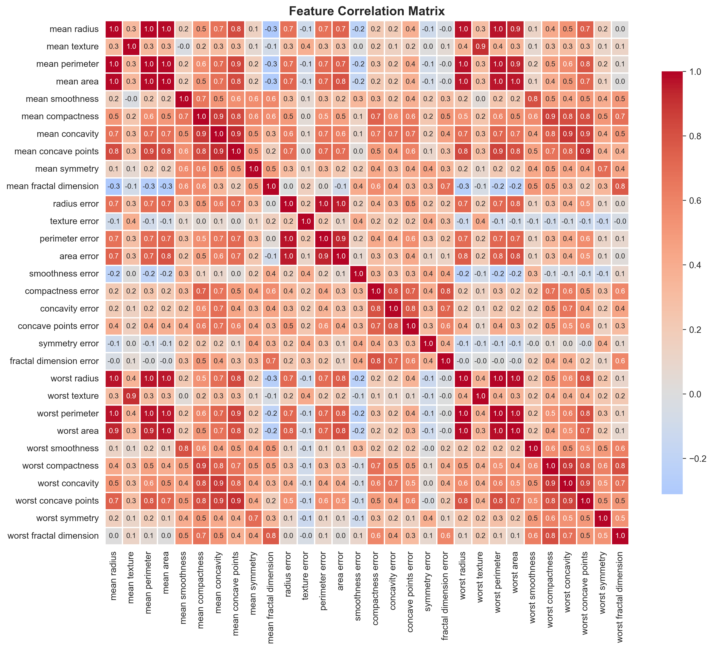
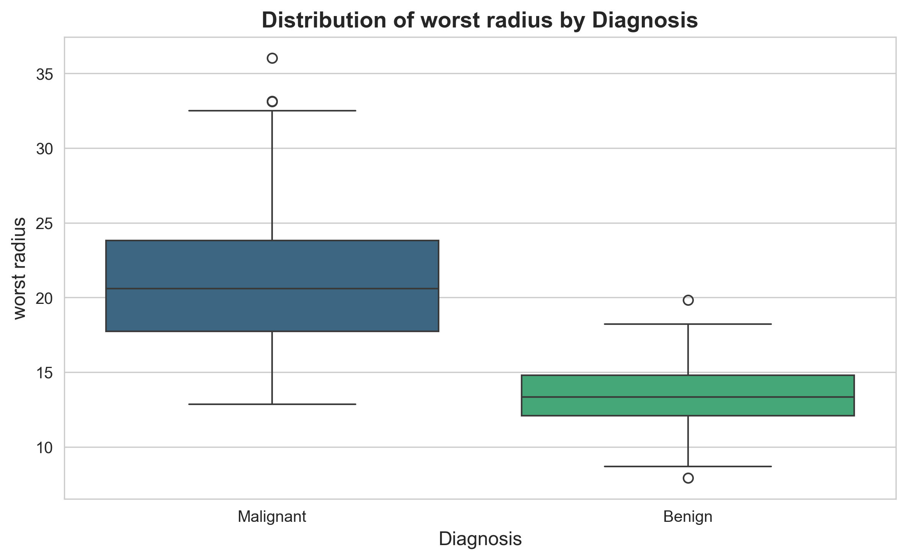
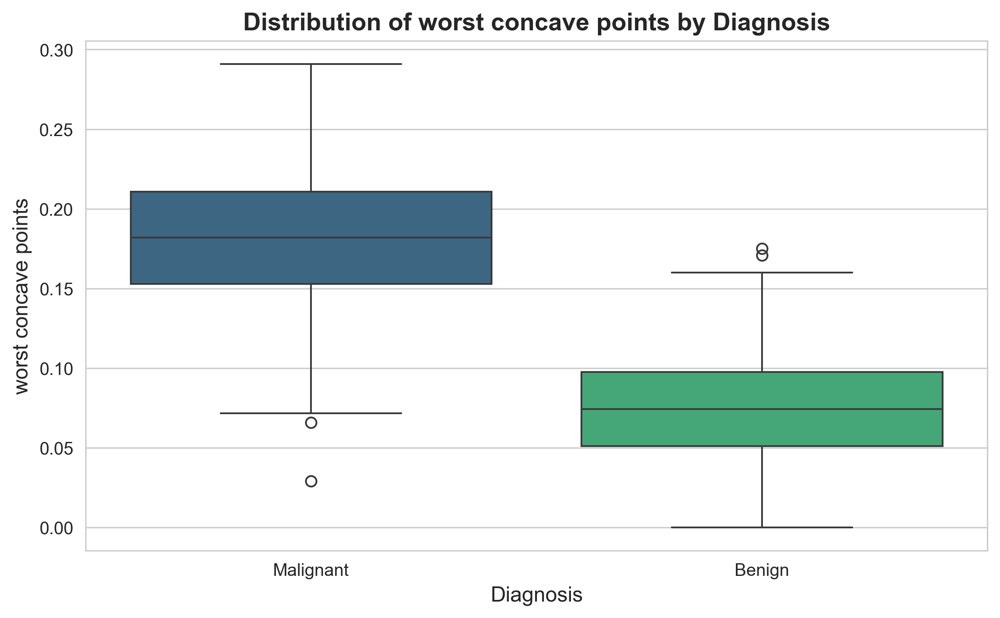
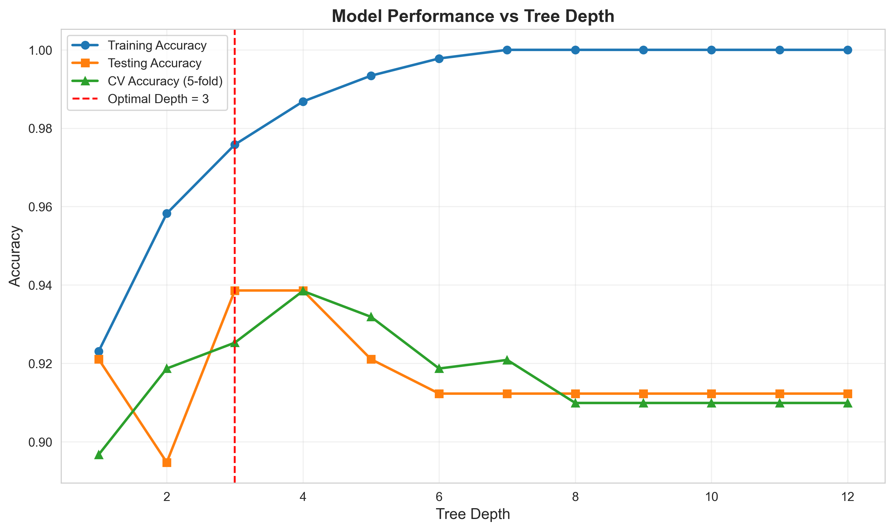
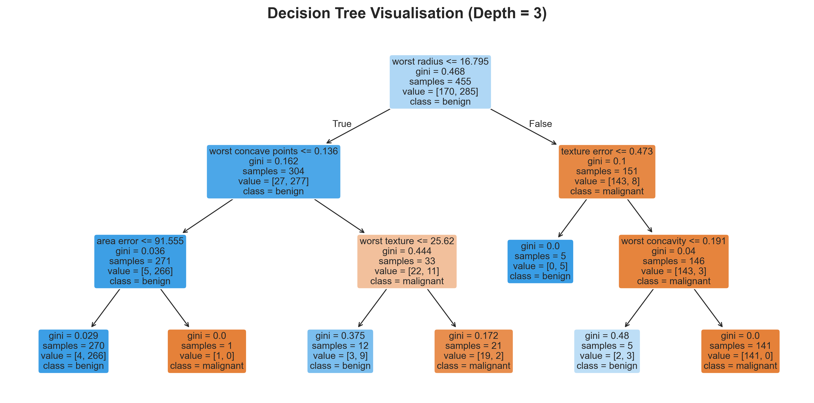
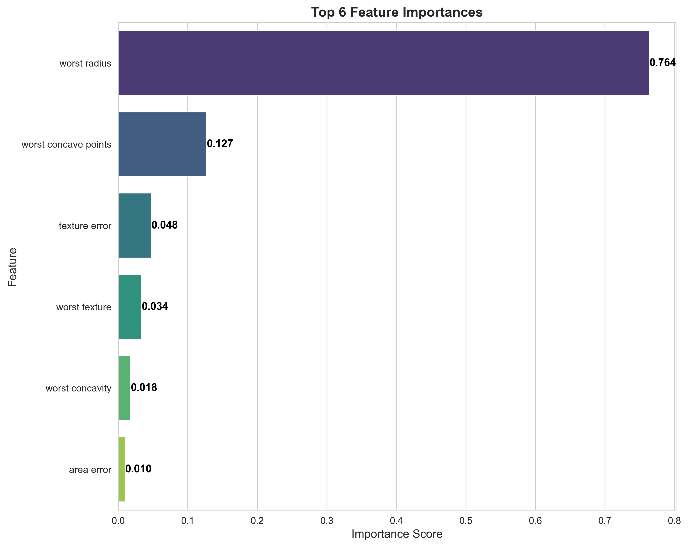
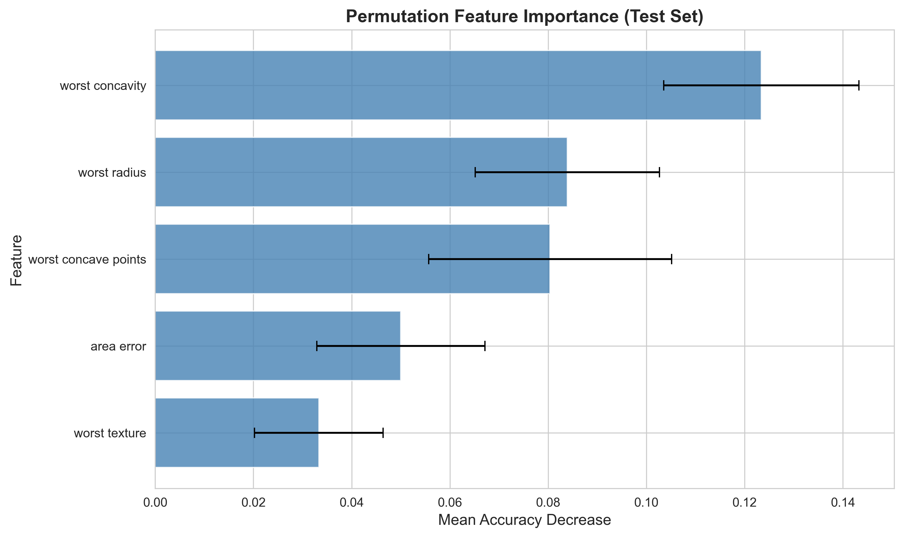
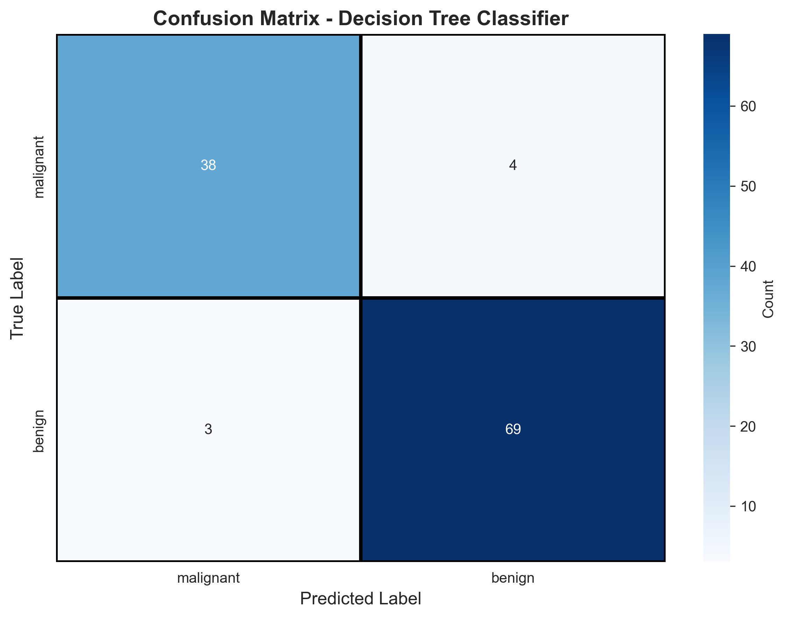
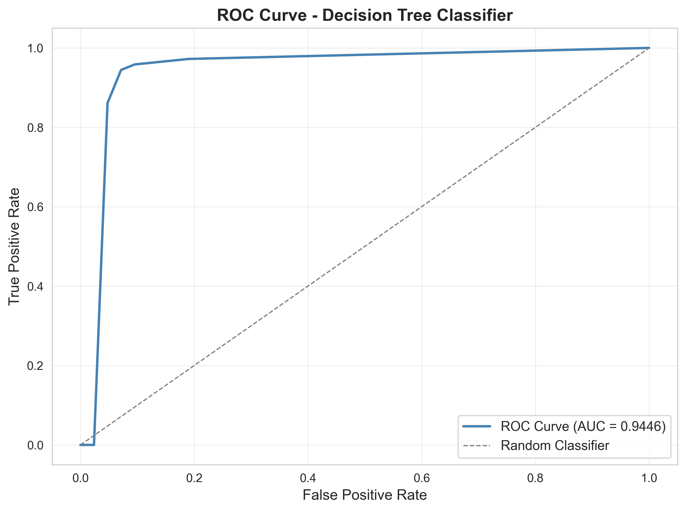

---

layout: default

title: Breast Cancer Predictions (Decision Trees)

permalink: /decision-trees/

---

## Goals and objectives:

For this portfolio project, the business scenario concerns the classification of breast tumours as malignant or benign from digitised cell nucleus measurements — a binary classification problem drawn from the Wisconsin Breast Cancer Diagnostic dataset, available directly from scikit-learn. The dataset comprises 569 observations across 30 continuous features derived from digitised fine needle aspirate (FNA) images, including measurements of cell nucleus radius, texture, perimeter, area, and concavity.

This is the **first project in a four-part series** applying supervised classification algorithms to the same dataset. The series progresses through Decision Trees, Random Forests, Gradient Boosted Trees, and Support Vector Machines, with each project building on the foundation established here and evaluated against a consistent set of performance metrics. This framing is deliberate: applying four methodologically distinct algorithms to an identical dataset and evaluation framework provides a controlled basis for comparing not just headline accuracy figures, but the analytical characteristics — interpretability, complexity, and generalisation — of each approach. The Decision Tree is the natural starting point for this series. It is the most transparent of the four classifiers: its decision logic is fully traceable, every split can be explained in terms of a single feature threshold, and the resulting tree structure is visually interpretable by a non-technical audience. That interpretability makes it both an accessible introduction to supervised classification and a meaningful analytical benchmark against which the accuracy gains of the more complex methods that follow can be assessed.

Because this project serves as the foundation for the entire series, a primary objective is to conduct thorough data validation and exploratory data analysis on the Wisconsin Breast Cancer dataset. These steps — confirming data integrity, examining the class distribution, assessing feature correlations, and exploring the distribution of key features across the two diagnostic classes — are not repeated in the subsequent projects, which proceed directly from the validated dataset established here.

A further key objective is the determination of the optimal tree depth through systematic evaluation across a range of candidate depths, using training accuracy, test accuracy, and five-fold cross-validation accuracy as complementary criteria. The choice of depth is the primary hyperparameter governing decision tree performance: shallow trees underfit the data, failing to capture genuine class-separating structure, while excessively deep trees overfit the training set and generalise poorly to unseen observations. The depth analysis makes the bias-variance trade-off explicit and provides a principled, evidence-based basis for the final model specification.

The project also aims to demonstrate two complementary approaches to feature importance: Gini impurity-based importance, which is intrinsic to the decision tree structure and reflects how much each feature reduces impurity across all splits in the tree, and permutation importance, which measures the decrease in test accuracy when each feature's values are randomly shuffled and provides a model-agnostic, out-of-sample view of predictive contribution. Comparing the two methods adds analytical depth and provides a more complete characterisation of which cell nucleus measurements drive the classification decisions.

By the end of the analysis, the project aims to demonstrate the correct end-to-end implementation of Decision Tree classification — including data validation, exploratory analysis, principled hyperparameter selection, model evaluation using accuracy, precision, recall, F1-score, and ROC-AUC, and feature importance analysis — and to establish the performance benchmark of **93.86% test accuracy** that the three subsequent projects in this series seek to improve upon.

## Application:  

Decision trees are powerful analytical tools that utilise a flowchart-like structure to classify data or predict outcomes by recursively splitting a dataset into smaller subsets based on specific feature criteria. Their primary appeal lies in their high interpretability, as they act as "white-box" models where the logic behind every conclusion is visually traceable and easy to explain to non-technical stakeholders. Beyond clarity, these models are exceptionally robust and versatile; they require minimal data pre-processing — meaning they don't need data scaling or normalisation—and they naturally handle a mix of categorical and numerical variables, making them an efficient and accessible tool for solving complex logic-based problems across various industries.  

They are highly valued because they translate complex data into a visual, human-readable format that simplifies high-stakes decision-making.  

🏦 **Finance** - decision trees are essential for managing risk and ensuring regulatory compliance through transparent logic, providing a clear "audit trail" of a reason for a decision.
  * Credit Scoring & Loan Approvals: Banks use decision trees to evaluate the creditworthiness of applicants. By inputting variables like income, debt-to-income ratio, and payment history, the tree classifies applicants into "High Risk" or "Low Risk" categories.  
  * Fraud Detection: Real-time transaction monitoring systems use decision trees to flag suspicious activity. For instance, if a transaction occurs in a new location for an unusually high amount at an odd time, the tree triggers an immediate alert or hold.
  * Option Pricing: Investors use "binomial trees" to estimate the value of financial options over time, helping them decide whether to buy or sell based on market volatility.

💻 **Technology** - decision trees used to handle massive datasets and automate customer-facing processes.  Decision trees can make predictions or classifications almost instantly, which is vital for real-time web applications.  
  * Customer Churn Prediction: SaaS companies analyse usage patterns (e.g., login frequency, feature adoption) to identify customers at risk of cancelling. The tree helps pinpoint which specific behaviours are the strongest indicators of churn.  
  * Recommendation Engines: Streaming services and E-commerce platforms use tree-based models (often expanded into "Random Forests") to suggest products or movies based on a user's previous clicks and demographic data.

🔬 **Science & Healthcare** - decision trees help navigate complex biological and environmental variables to reach accurate conclusions.  Decision trees highlight which variables (e.g., which specific gene or symptom) are the most significant drivers of the outcome.  
  * Medical Diagnosis: Doctors use clinical decision trees to rule out conditions. For example, a tree for chest pain might branch into "History of Heart Disease" vs. "No History," further splitting by blood pressure and EKG results to reach a diagnosis.  
  * Genomic Research: Scientists use trees to classify sequences of DNA or proteins, identifying which genetic markers are most likely associated with specific diseases or traits.  
  * Environmental Modelling: Researchers use them to predict the impact of climate variables (like temperature and humidity) on crop yields or the spread of invasive species.

🏭 **Manufacturing** - decision trees are critical for maintaining high quality and optimising the flow of goods.  This can reduce costs, downtime and reputational damage and increase efficiencies.
  * Root Cause Analysis (RCA): When a batch of products fails quality testing, a decision tree helps technicians trace the defect, identifying the factors most likely to be the cause, and help determine the exact point of failure.
  * Predictive Maintenance: Sensors on factory equipment feed data into trees that predict when a machine is likely to break down, allowing for repairs before an expensive halt in production occurs.
  * Supply Chain Optimisation: Logistics managers use trees to decide the best shipping routes or vendor selections based on lead times, costs, and historical reliability.

## Methodology:  

The Wisconsin Breast Cancer Diagnostic dataset was sourced directly from scikit-learn - also available from Kaggle [here](https://www.kaggle.com/datasets/uciml/breast-cancer-wisconsin-data). It contains 569 observations and 30 continuous features computed from digitised fine needle aspirate (FNA) images of breast cell nuclei. Features capture geometric and textural properties of cell nuclei — including radius, texture, perimeter, area, smoothness, compactness, concavity, symmetry, and fractal dimension — each computed as the mean, standard error, and worst (largest) value across the cells present in the image. The binary target variable distinguishes malignant (212 observations, 37.3%) from benign (357 observations, 62.7%) cases.

**Data Validation** confirmed no missing values and no duplicate rows across the 569 observations. All 30 features are continuous numeric variables requiring no encoding or imputation. Descriptive statistics were computed across all features to establish the scale and range of the data.

**Exploratory Data Analysis** examined the class distribution and the relationships between features. A correlation matrix across all 30 features was produced, revealing high inter-correlation among the radius, area, and perimeter family of measurements — a characteristic of this dataset noted in the context of future dimensionality reduction work. Boxplots were produced for four key features — worst radius, worst concave points, mean concave points, and worst perimeter — split by diagnosis class, providing visual confirmation that these features carry strong class-separating signal prior to any modelling.

**Train-Test Split** divided the data 80/20 into training (455 samples) and testing (114 samples) sets, with stratification applied to preserve the class distribution across both sets.

**Tree Depth Analysis** evaluated decision tree models across depths 1 to 12, recording training accuracy, test accuracy, and five-fold cross-validation accuracy at each level. The optimal depth was defined as the shallowest depth achieving the maximum test accuracy, ensuring the simplest model that reaches peak predictive performance is selected in preference to a deeper but equally accurate alternative.

**Model Training** fitted the final DecisionTreeClassifier at the optimal depth, using random_state=42 for reproducibility. A five-fold cross-validation was then applied to the training set to confirm the model generalises consistently across data partitions.

**Model Evaluation** assessed performance on the held-out test set using accuracy, precision, recall, F1-score, sensitivity, specificity, and ROC-AUC. A confusion matrix was produced to break down correct and incorrect classifications by class.

**Feature Importance** was assessed using two complementary approaches: Gini impurity-based importance, derived from the tree's internal split structure and reflecting the contribution of each feature to reducing node impurity across the tree; and permutation importance, computed on the test set by measuring the decrease in accuracy when each feature's values are randomly shuffled. Comparing the two methods provides both an intrinsic and a model-agnostic view of which features drive classification decisions.

## Results:

### Exploratory Data Analysis

The dataset contains 212 malignant (37.3%) and 357 benign (62.7%) observations — a moderate class imbalance that is reflected in the stratified train/test split applied throughout the analysis, and is worth bearing in mind when interpreting per-class performance metrics.

The correlation matrix across all 30 features is shown below.



The matrix reveals strong inter-correlation within the radius, area, and perimeter family of measurements — a structural property of the dataset arising from the geometric relationship between these quantities. This multicollinearity means that multiple features carry largely redundant information, which has practical implications for the decision tree: it is not necessary for the model to use all 30 features to make accurate predictions, and the depth analysis confirms this. The insight also points towards dimensionality reduction as a productive direction for future development, as noted in the Next Steps section.

Boxplots for two of the highest-importance features — worst radius and worst concave points — split by diagnosis class are shown below. Both features show clear separation between the malignant and benign distributions, with minimal overlap, providing visual confirmation that these measurements carry strong class-discriminating signal prior to any modelling.




### Tree Depth Analysis

The training set (455 samples) and test set (114 samples) were formed using an 80/20 stratified split. Decision tree models were evaluated at depths 1 to 12, with training accuracy, test accuracy, and five-fold cross-validation accuracy recorded at each level.



The depth analysis identifies an optimal tree depth of 3 — defined as the shallowest depth achieving the maximum test accuracy. This guards against selecting a deeper, more complex tree when a shallower one performs equivalently. A depth of 4 produces the same test accuracy, while depths of 5 and above show a divergence between training and test accuracy that is characteristic of overfitting: the model learns the training data with increasing fidelity but generalises less well to unseen observations. The cross-validation scores closely track the test accuracy across all depths, confirming that this pattern is consistent and not an artefact of the particular train/test split.

### Model Fitting
The decision tree fitted at depth 3 is shown below. With only three levels, the full classification logic is visually traceable — each internal node specifies a single feature threshold and the proportion of each class at that point, and each leaf node specifies the final class assignment. This interpretability is a defining characteristic of decision trees and has no direct equivalent in the Random Forest, Gradient Boosted Tree, or SVM models that follow in this series.



Five-fold cross-validation on the training set returns a mean accuracy of 0.9253 with a standard deviation of 0.0245, confirming that the model generalises consistently across data partitions and that the test set result is not the product of a favourable split.

### Feature Importance

Gini impurity-based importance and permutation importance were computed for the fitted model. The two methods answer related but distinct questions: Gini importance reflects how much each feature reduces node impurity across all splits in the tree; permutation importance measures the decrease in test accuracy when each feature's values are randomly shuffled, providing an out-of-sample, model-agnostic view of predictive contribution.




With a tree depth of 3, only 6 of the 30 features receive a non-zero Gini importance score. Worst radius dominates, accounting for 76.4% of total Gini importance — it appears at the root node of the tree and provides the primary class-separating split. Worst concave points is the second most important feature at 12.7%, consistent with the clear class separation visible in the EDA boxplot above. The permutation importance results corroborate this ordering, confirming that the Gini ranking is not an artefact of the impurity metric and reflects genuine predictive contribution on held-out data. The agreement between the two methods strengthens confidence in the feature importance findings.

The dominance of the worst (largest observed value) family of measurements — rather than mean or standard error values — is a clinically interpretable finding: it is the most extreme cell measurements within a sample, rather than the average, that carry the greatest diagnostic signal.

### Model Evaluation

The key performance metrics on the held-out test set are:

```
Metric             Score
Accuracy           0.9386
Precision          0.9452   (Predicted Positives)
Recall             0.9583   (True Positive Rate)
F1-Score           0.9517
Specificity        0.9048  (True Negative Rate)
ROC-AUC            0.9446
```

The detailed classification report provides additional information on the predictions, breaking down the performance metrics for malignant and benign predictions.  This is based on the testing dataset.
```
              precision    recall  f1-score   support

   malignant       0.93      0.90      0.92        42
      benign       0.95      0.96      0.95        72
```

The confusion matrix below presents the full breakdown of predictions on the test set.

  

The model correctly classifies 38 of the 42 malignant test observations and 69 of the 72 benign observations. There are 3 false negatives — malignant tumours predicted as benign — which in a clinical context represent the most consequential error type, as a missed malignancy carries significantly greater risk than an unnecessary follow-up. There are 4 false positives. The specificity of 0.9048 is marginally lower than the sensitivity of 0.9583, reflecting this slight asymmetry in the model's tendency to err.

The ROC curve below provides a threshold-independent view of discriminative ability across all possible classification thresholds, and enables direct comparison with the subsequent models in this series.

  

A ROC-AUC of 0.9446 establishes the Decision Tree's discriminative benchmark for this dataset. Each successive project in this series — Random Forests, Gradient Boosted Trees, and Support Vector Machines — reports ROC-AUC against this baseline.

## Conclusions:

The Decision Tree classifier achieves a test accuracy of **93.86%**, a ROC-AUC of **0.9446**, and an F1-score of **0.9517** in classifying breast tumours as malignant or benign from 30 cell nucleus measurements, using an optimal tree depth of 3 identified through systematic depth analysis with five-fold cross-validation. These figures establish the performance baseline for this dataset that the three subsequent projects in this series — Random Forests, Gradient Boosted Trees, and Support Vector Machines — are evaluated against.

The depth analysis is one of the more instructive aspects of the project. The divergence between training and test accuracy at depths of 5 and above is a textbook illustration of the bias-variance trade-off made concrete: the model progressively memorises the training data at the cost of generalisation. The cross-validation scores track the test accuracy closely across all candidate depths, confirming that the optimal depth selection is stable and not the product of a favourable split. The five-fold CV on the final model reinforces this — the model generalises consistently across data partitions, and the headline test set result is representative.

The feature importance analysis produces one of the more interesting findings in the project. With a tree depth of 3, only 6 of the 30 features receive a non-zero Gini importance score, and worst radius alone accounts for 76.4% of total importance. The permutation importance results corroborate this ranking on held-out data, confirming that the Gini scores reflect genuine predictive contribution rather than an artefact of the impurity metric. That 30 features can be reduced to effectively 2 meaningful predictors — worst radius and worst concave points — without material loss of accuracy points to significant redundancy in the feature set, a consequence of the high inter-correlation among the radius, area, and perimeter family of measurements identified in the EDA. This has a direct practical implication: in a real diagnostic application, a substantially smaller set of cell nucleus measurements could support predictions of comparable accuracy, reducing the cost and complexity of data collection.

The confusion matrix warrants specific attention. The 3 false negatives — malignant tumours classified as benign — are the most consequential errors in the output. A recall of 0.9048 on the malignant class is strong in quantitative terms, but in a clinical screening context the cost of a false negative is asymmetric: a missed malignancy delays treatment in ways that a false positive — an unnecessary follow-up investigation — does not. This asymmetry does not diminish the model's performance, but it does mean that sensitivity on the malignant class, not overall accuracy, should be the governing performance criterion in any real-world deployment. A lower classification threshold, calibrated to maximise recall, would be the appropriate starting point for that adaptation.

The ROC-AUC of 0.9446, while respectable for a single shallow tree, reflects the inherent limitation of the model's simple decision structure: with only 3 levels and 6 contributing features, the decision boundary is deliberately constrained. This is the expected trade-off for a model whose primary strength is interpretability — the full classification logic is visible in the tree diagram, every threshold is explainable to a non-technical audience, and the reasoning behind any individual prediction can be traced from root to leaf. That combination of transparency and auditability is genuinely valuable in clinical settings and in any regulated context where the basis for a decision must be documented. It is also precisely what is sacrificed in the ensemble methods that follow in this series, where accuracy gains come at the cost of that interpretability.

## Next steps:  

**Random Forests** — the natural progression from a single decision tree is to apply the Random Forest algorithm to the same dataset, which is the subject of the next project in this series. Random Forests reduce the variance of a single tree by constructing an ensemble of decorrelated trees and aggregating their predictions, typically yielding material accuracy and robustness improvements. The Random Forest project evaluates whether that additional complexity is justified by measurable performance gains over the 93.86% accuracy and 0.9446 ROC-AUC benchmarks established here.

**Dimensionality Reduction** — the EDA correlation matrix identified high inter-correlation among the radius, area, and perimeter family of measurements, and the feature importance analysis confirmed that only 6 of the 30 features contribute to the depth-3 tree's predictions. Principal Component Analysis (PCA) applied as a pre-processing step would reduce this multicollinearity and could yield a more parsimonious model — one achieving comparable accuracy with a materially smaller feature set, reducing the cost of data collection in a real diagnostic application.

**Threshold Optimisation** — the current model uses the default 0.5 classification threshold. Given the asymmetric cost of false negatives in cancer screening — where a missed malignancy is significantly more consequential than an unnecessary follow-up — a lower threshold calibrated to maximise sensitivity on the malignant class would be a meaningful clinical refinement. The ROC curve generated in this project provides the foundation for that analysis.

**Clinical and Demographic Validation** — the analysis is conducted on a single, well-curated dataset from one institution. Validation on external datasets from different hospitals and patient populations, and assessment of performance consistency across demographic subgroups, would be required before any clinical deployment. Performance on the majority benign class should not be allowed to mask weaker performance on malignant cases in subgroup analyses.

## Python code:
You can view the full Python script used for the analysis here: 
[View the Python Script](/DecisionTree_BreastCancer_v2.py)
