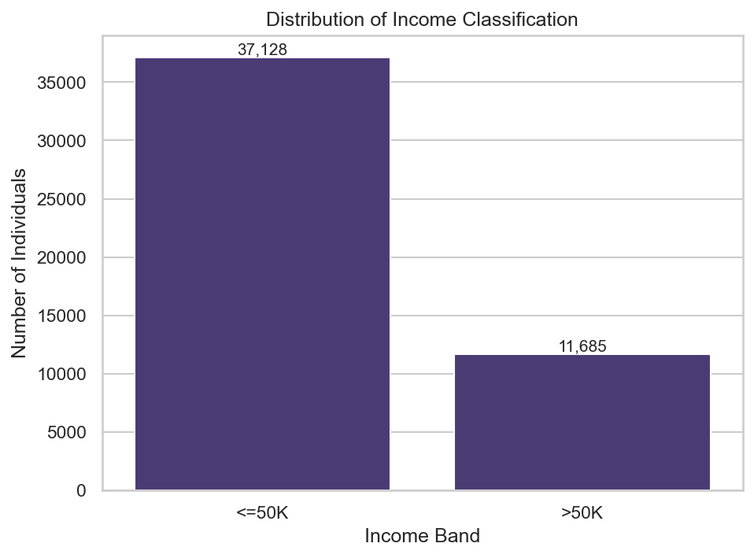
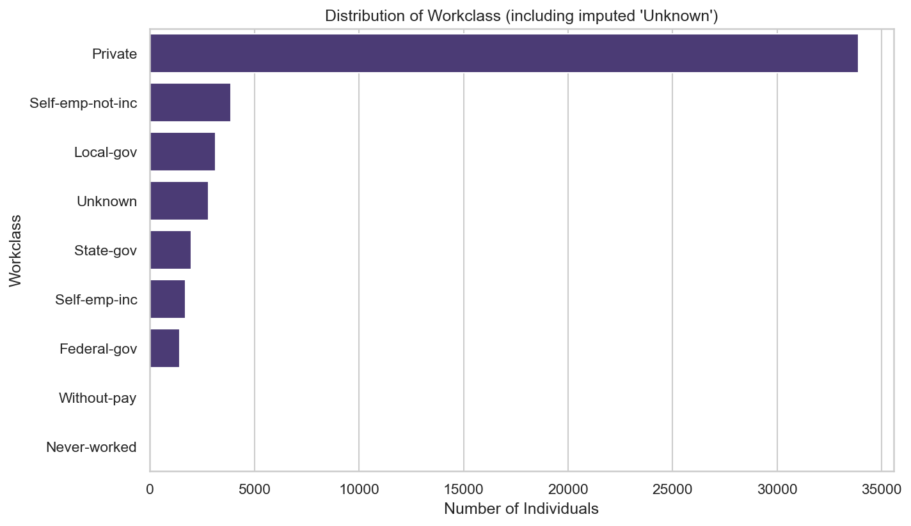
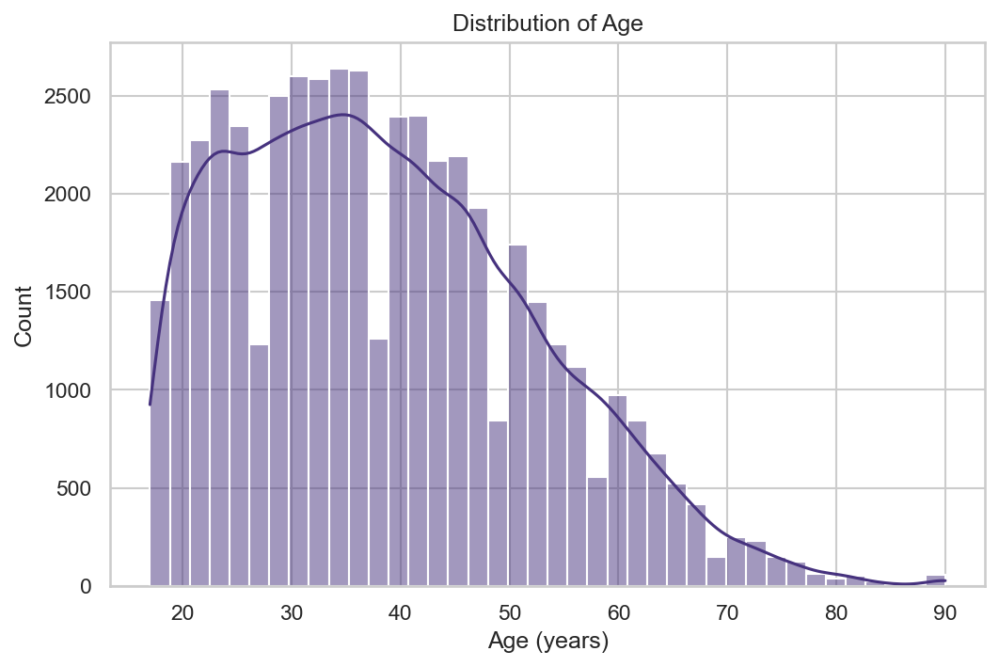
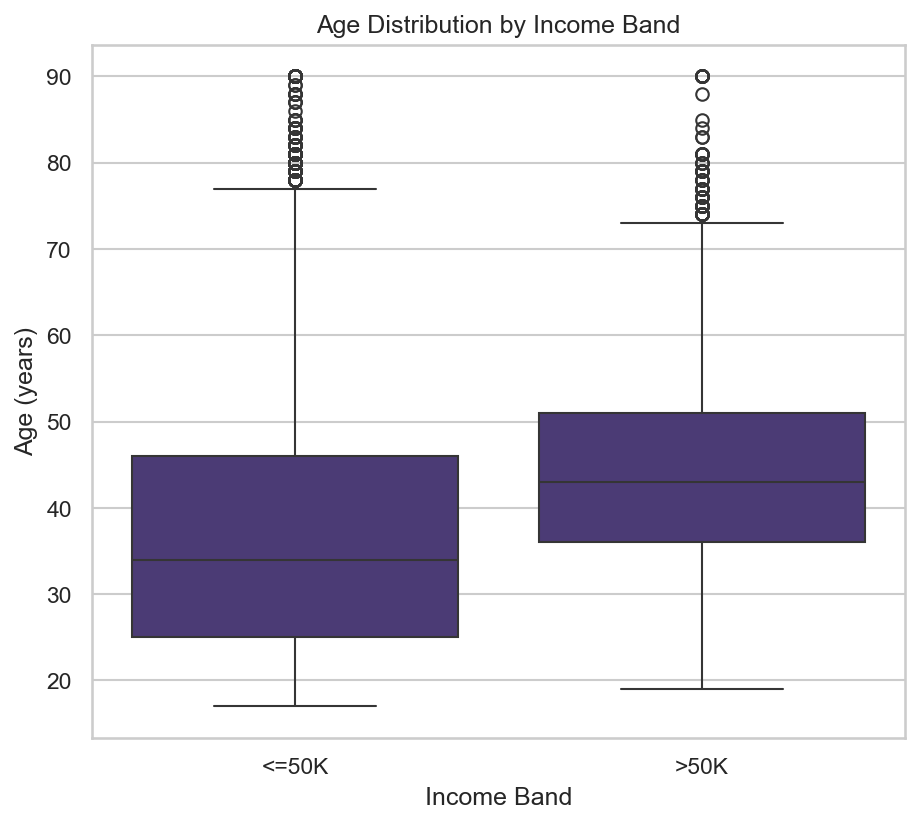
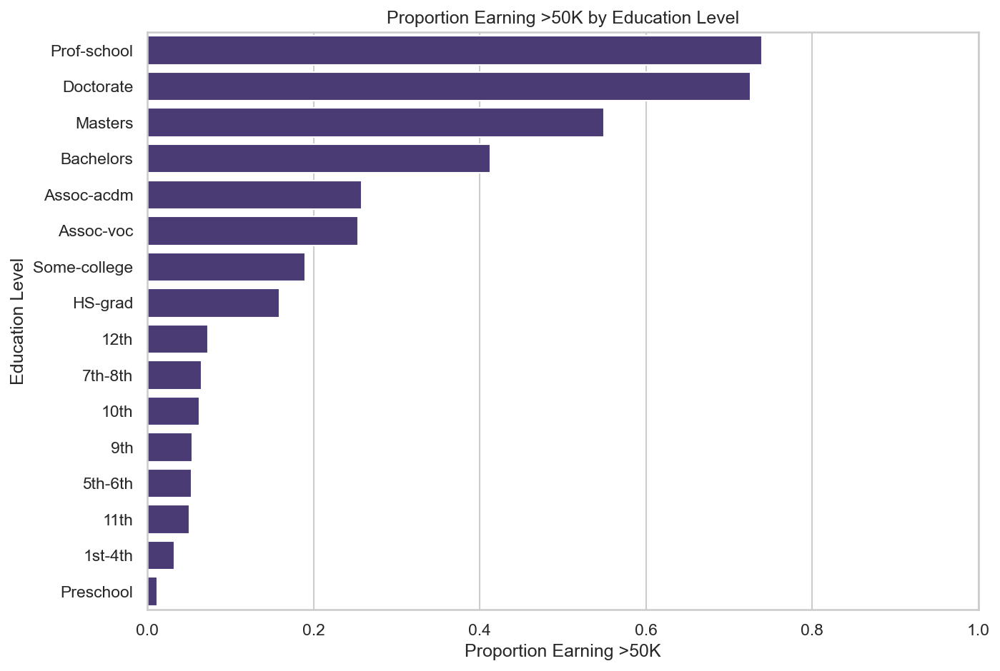
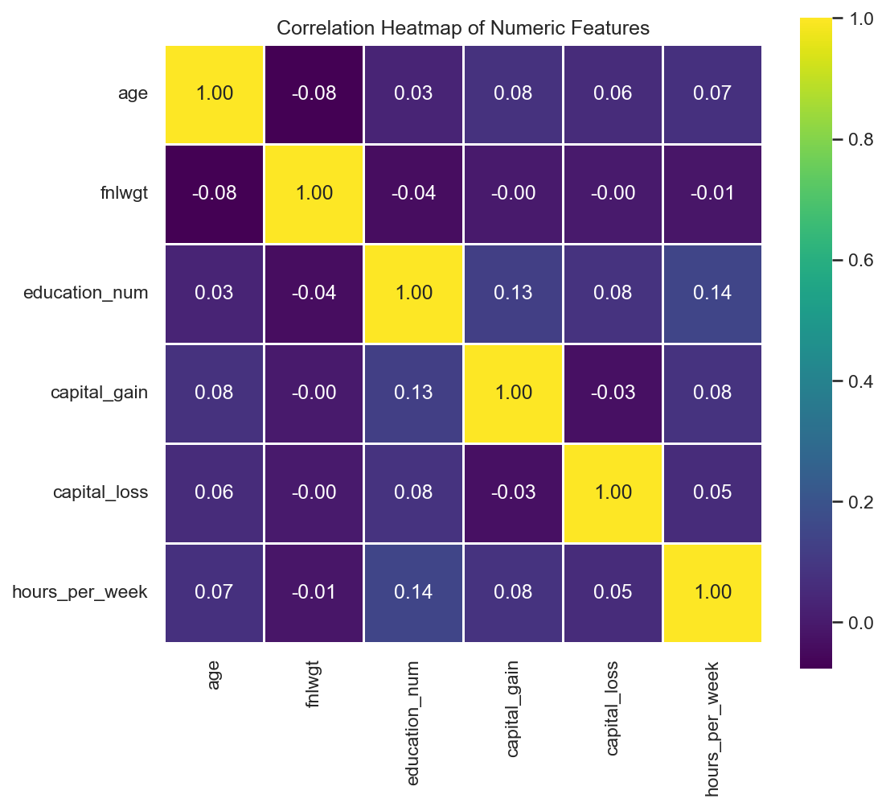
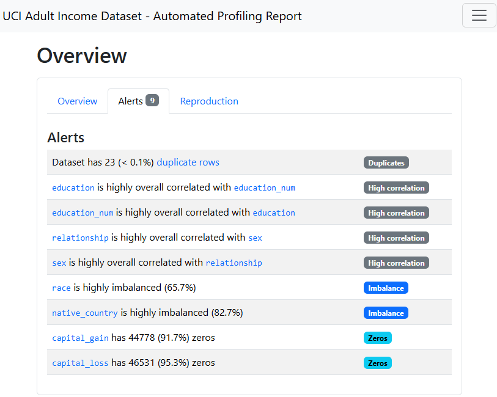
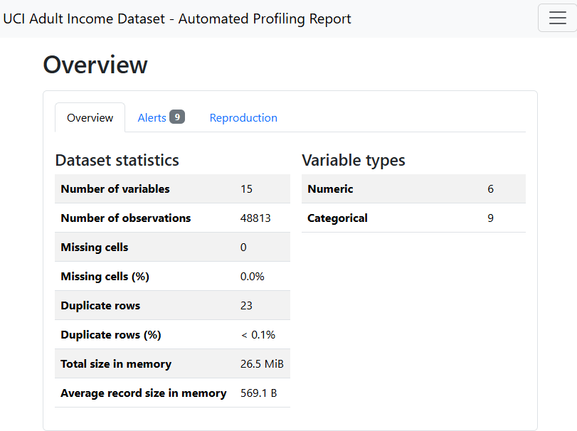

---

layout: default

title: Uncovering Hidden Data Quality Issues and Income Drivers in Census Data (Exploratory Data Analysis)

permalink: /exploratory-data-analysis/

---

## Goals and Objectives

Exploratory Data Analysis is the foundation on which every downstream modelling decision rests. Before a single predictive model is built, a structured EDA process must answer three questions: 

* is the data trustworthy?
* what does it actually contain?
* what patterns within it are likely to matter? 

Skipping this step does not save time — it defers cost, surfacing data quality problems and false assumptions much later in a project, when they are far more expensive to fix.

This project demonstrates a complete, structured EDA workflow applied to the UCI Adult Income dataset (also known as the "Census Income" dataset), a real-world extract of US census records used to predict whether an individual earns more or less than $50,000 per year. The dataset was deliberately chosen because it contains a genuine, non-obvious data quality issue — missing values disguised as a placeholder character rather than flagged as conventional nulls — making it a realistic test of whether an EDA process is rigorous enough to catch problems that a superficial pass would miss.

The specific objectives were to:

- **Validate data integrity** before any analysis takes place, including checks for duplication, disguised missingness, and implausible values.
- **Diagnose the pattern, not just the presence, of missing data**, and use that diagnosis to justify a specific, defensible treatment strategy rather than a default one.
- **Characterise the dataset's structure and key relationships** through univariate and bivariate visual analysis, directly tied to the business question the dataset exists to answer.
- **Compare manual, hypothesis-driven analysis against automated profiling**, to establish where each approach adds distinct value and where they corroborate one another.

## Application

EDA is not a preliminary formality; it is where the majority of a project's eventual reliability is determined. In a business setting, this dataset's structure mirrors a common scenario: an organisation holds a large administrative or survey-style dataset (HR records, loan applications, census extracts, customer onboarding forms) and wants to use it to predict an outcome — in this case, income band. Three findings from this project map directly onto recurring real-world problems:

- 📋 **Disguised missingness is a silent risk.** This dataset encodes missing values as a literal `"?"` placeholder string rather than a conventional null. A standard `.isnull().sum()` check reports **zero** missing values across the entire dataset — a false assurance that would let a flawed dataset pass straight into modelling. The same failure mode appears constantly in real systems: legacy exports using `"N/A"`, `"-1"`, `"0000"`, or blank strings instead of true nulls. Explicitly searching for placeholder values, rather than trusting a dtype-based null check, is a habit that prevents a specific and common class of production data error.
- 🔍 **The pattern of missingness should drive the treatment, not a default rule.** Rather than reaching for mode imputation or row deletion by convention, this project diagnosed *why* values were missing before deciding *how* to treat them. The result changed the decision: missingness in `workclass` and `occupation` was found to co-occur in 99.6% of cases, consistent with individuals who are not currently employed in any conventional sense. Imputing those values with the dataset's most common category (`Private` workclass) would have manufactured a false signal; treating the absence as its own explicit, informative category preserved the truth in the data instead of overwriting it.
- ⚖️ **Automated profiling and manual analysis are complements, not substitutes.** An automated profiling report was generated alongside the manual analysis using `fg-data-profiling`. It independently corroborated the manual missingness finding, and surfaced two things the manual pass had not explicitly targeted: a near-perfect correlation between `education` and `education_num` (the same information encoded twice), and a second, smaller batch of duplicate rows that only became identical *after* missing values were standardised — a downstream consequence of the imputation decision itself. Running both approaches together caught more than either would have alone.

## Methodology

**Dataset**: UCI Adult Income dataset (Becker & Kohavi, 1996), retrieved via the `ucimlrepo` package (`fetch_ucirepo(id=2)`). The raw dataset comprises 48,842 records across 15 columns: 6 numeric features (`age`, `fnlwgt`, `education_num`, `capital_gain`, `capital_loss`, `hours_per_week`) and 9 categorical features (`workclass`, `education`, `marital_status`, `occupation`, `relationship`, `race`, `sex`, `native_country`, and the `income` target).

**Data validation** proceeded in stages:

1. **Exact duplicate detection.** 29 fully duplicated rows were identified and removed, reducing the working dataset to 48,813 records.
2. **Target standardisation.** The `income` target was stripped of whitespace and trailing full stops to resolve a known UCI export inconsistency (`">50K"` vs `">50K."`), producing two clean classes.
3. **Disguised missing value detection.** Rather than relying on `pandas`' native null-checking (which reported zero missing values), every categorical column was explicitly checked for the literal placeholder string `"?"`. This surfaced missingness in three columns that a standard check would have missed entirely.
4. **Missingness pattern analysis.** Before choosing a treatment, the co-occurrence of missingness across the three affected columns was quantified using a correlation of their missing-value indicators, to establish whether the gaps were structurally related or independent.
5. **Numeric range sanity checks.** Age values were checked against a plausible adult census range (16–100) to rule out data entry errors.

**Missing value treatment**: missing values in `workclass`, `occupation`, and `native_country` were imputed with an explicit `"Unknown"` category, rather than the column mode. This decision was made for three reasons, established during validation: it preserves the meaning of absence (a respondent who has never worked is a different reality to one whose employer was simply unrecorded), it avoids overwriting category proportions with imputed values that did not originate from that class, and it avoids manufacturing a false majority-class signal that the modelling stage would otherwise have to unlearn.

**Univariate and bivariate analysis** was conducted using eleven sequential, individually rendered Seaborn visualisations, covering the distribution of the target and key numeric/categorical features, and their bivariate relationship with income.

**Automated profiling**: a complementary profiling report was generated using `fg-data-profiling` (the actively maintained successor to `ydata-profiling`, renamed in April 2026), producing an independent statistical summary, correlation analysis, and automated data quality alert panel across all 15 variables.

## Results

**Income distribution.** Of the 48,813 valid records, 37,128 individuals (76.06%) earn $50,000 or less annually, and 11,685 (23.94%) earn more — a meaningfully imbalanced target that any downstream classification model would need to account for explicitly.

**Disguised missingness.** Three columns contained the `"?"` placeholder: `workclass` (1,836 records, 3.76%), `occupation` (1,843 records, 3.78%), and `native_country` (582 records, 1.19%) — 4,261 affected cells in total, 0.58% of the dataset. A conventional null check would have reported none of this.

**Missingness co-occurrence.** `workclass` and `occupation` missingness were almost perfectly correlated (0.998), with 1,836 of 1,843 occupation-missing records (99.6%) also missing `workclass`. This pattern is consistent with individuals outside conventional employment, and directly justified imputing both with an explicit `"Unknown"` category rather than the column mode.

**Age and working hours.** The median respondent age was 37 (IQR 28–48), and median working hours were 40 per week, with a long right tail extending to the dataset's maximum of 99 hours.

**Relationship with income.** Higher-income individuals (`>50K`) were visibly older and worked more hours per week on average than lower-income individuals, evident in both boxplot comparisons.

Educational attainment and marital status showed a clear gradient against the proportion earning more than $50,000, with advanced degree holders and married individuals showing substantially higher proportions in the higher income band than the dataset average.

**Correlation structure.** Pairwise linear correlation among the six numeric features was weak throughout, with the strongest relationship — `education_num` and `hours_per_week` — reaching only 0.144. This is not a data quality concern; it reflects a genuine property of the dataset. Numeric correlation cannot capture the dataset's strongest income-related signal, since marital status, occupation, and education category — all categorical — carry far more discriminative information than the six continuous columns do on their own.

**Automated profiling corroboration.** The `fg-data-profiling` report independently flagged 11 alerts, several of which directly corroborated the manual analysis above: a high correlation between `workclass` and `occupation` (matching the manual co-occurrence finding), and a high correlation between `education` and `education_num` — the same attainment level encoded as both a category and an ordinal number, a redundancy the manual pass had not explicitly flagged. The tool also surfaced 19 duplicate rows in the cleaned dataset — a second, smaller batch than the 29 found during manual validation, arising because some originally distinct records became identical only after missing values were standardised to `"Unknown"`. The remaining alerts flagged class imbalance in `race` (65.7%) and `native_country` (82.5%), and zero-inflation in `capital_gain` (91.7% zeros) and `capital_loss` (95.3% zeros) — both expected properties of census-style capital income data, where the large majority of respondents report no capital activity in a given year.

## Conclusions

This project demonstrates that a structured EDA process delivers value distinct from, and prior to, any predictive modelling step. Three conclusions follow directly from the results:

- **Trust in a dataset cannot be established from dtype-based checks alone.** A standard missing-value check on this dataset returns zero — entirely incorrect. Real data quality assurance requires actively searching for the specific ways a dataset's source system is known to encode absence, not just trusting the dataset's apparent structure.
- **The right treatment for missing data depends on why it is missing, not a default convention.** Diagnosing the 99.6% co-occurrence between `workclass` and `occupation` missingness was the step that justified treating both as an informative `"Unknown"` category, rather than applying mode imputation by default. This decision preserved a genuine signal in the data that a less careful pipeline would have erased.
- **Manual and automated EDA approaches are most powerful in combination.** The automated profiling report did not replace the manual analysis — it corroborated two independent findings, and surfaced a third (the education/education_num redundancy, and the post-imputation duplicate rows) that the manual pass had not directly targeted. Relying on either approach alone would have produced an incomplete picture.

Beyond the dataset itself, the underlying workflow — validate before trusting, diagnose before treating, and corroborate manual judgement with automated tooling — applies directly to any project beginning with an unfamiliar or third-party dataset.

## Next Steps

This EDA establishes a validated, well-understood foundation for two natural follow-on projects already mapped out on the portfolio roadmap:

- **Predictive classification.** The clear income-band imbalance (76.06% / 23.94%) and the bivariate patterns identified here — particularly the strength of categorical features over numeric ones — set up a natural classification project on this same dataset, with class imbalance handling as an explicit, pre-justified requirement rather than an afterthought.
- **The `education` / `education_num` redundancy** flagged by the automated profiling report should be resolved before any modelling stage, by retaining only one of the two encodings, to avoid artificially inflating feature importance or introducing multicollinearity.
- **Capital gain and capital loss zero-inflation** (91.7% and 95.3% zeros respectively) would benefit from being modelled as a two-part feature — a binary "has capital activity" flag alongside the continuous amount — rather than as raw continuous variables, an approach well suited to a future feature engineering or model interpretability project.
- **The `fg-data-profiling` Alerts panel** also flagged high imbalance in `race` and `native_country`; this is a useful early input to a future AI Ethics or fairness-focused project examining whether model performance is consistent across demographic subgroups.

## Python code:
You can view the full Python script used for the analysis here: 
[View the Python Script](/EDA_v0.2.py)
