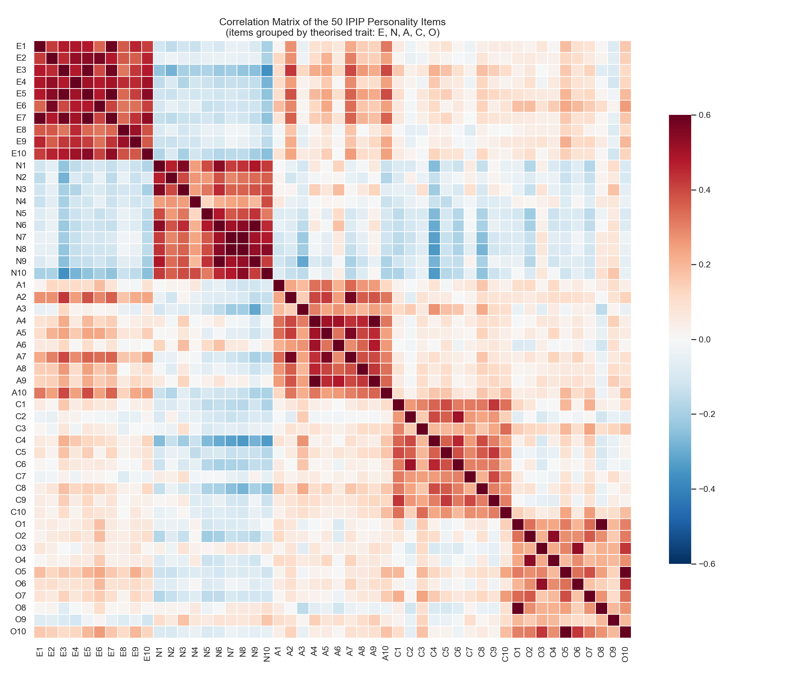
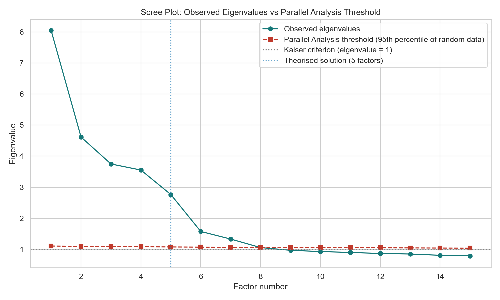
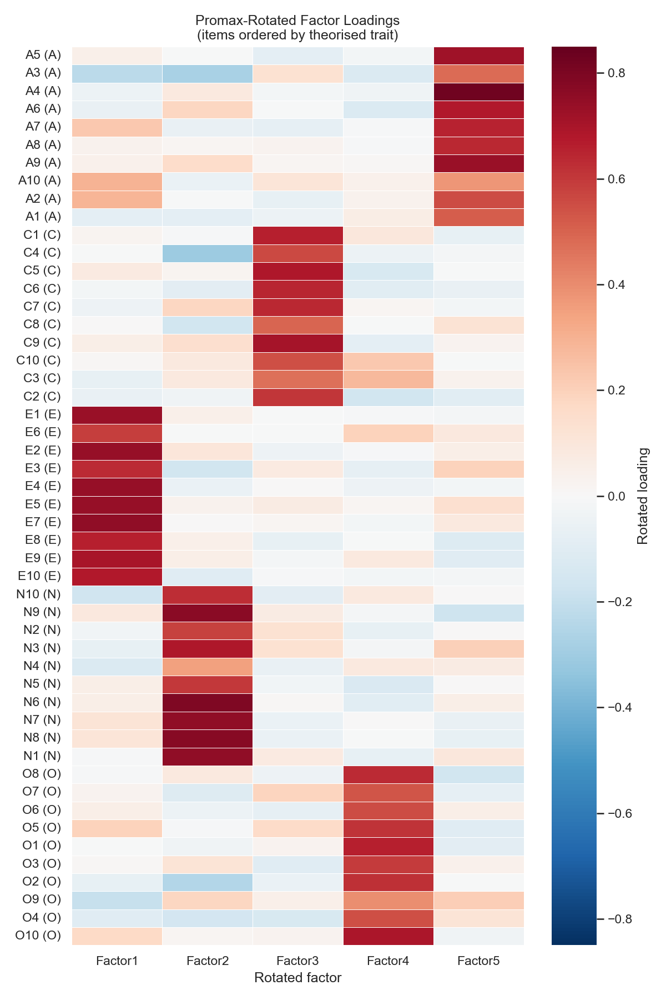

---

layout: default

title: Big Five Personality Test - IPIP (Factor Analysis)

permalink: /factor-analysis/

---

# This project is in development

## Goals and objectives:

For this portfolio project, the business scenario concerns the validation of a 50-item personality assessment used as part of a recruitment screening product. An HR-tech company has licensed the assessment — built on the International Personality Item Pool (IPIP-50) — on the understanding that it measures five distinct personality constructs: Openness, Conscientiousness, Extraversion, Agreeableness, and Neuroticism, collectively known as the Big Five or OCEAN model. Before deploying the assessment at scale in hiring decisions, the business needs evidence that the instrument actually does what it claims: that its 50 individual survey items cleanly resolve into five coherent, distinct constructs, rather than blurring across traits in a way that would make the resulting scores unreliable. The analysis uses 19,718 anonymised responses to the IPIP-50 instrument, sourced from the Open-Source Psychometrics Project, with each item rated on a five-point scale and ten items per theorised trait.

This question — whether a claimed set of underlying constructs genuinely exists in the data — is precisely the question Factor Analysis is designed to answer, and it is worth being explicit about why this project sits deliberately apart from the [Principal Component Analysis](https://marcgrover-datascience.github.io/principal-component-analysis/) project elsewhere in this portfolio, despite both techniques operating on a correlated set of observed variables and producing a smaller set of derived dimensions. PCA is a variance-maximising technique: its components are linear combinations of the observed variables, constructed purely to capture the greatest possible variance, with no obligation — and no expectation — that any component corresponds to something real. The components are a mathematical by-product of compressing the data efficiently. Factor Analysis proceeds from the opposite premise. It is a latent-variable model that treats the five personality traits as real, unobserved dispositions that cause a person's answers to the 50 items, with each item also carrying variance specific to itself and unrelated to any shared trait. In this project, the factors are not a convenient summary — they are the entire object of investigation. The question is not "how few dimensions can this data be compressed into?" but "do the five constructs this instrument claims to measure actually exist?" A recruiter reading both project pages should come away understanding that PCA and Factor Analysis answer fundamentally different questions, even when applied to superficially similar data.

A primary objective of the project is to establish, before any factor is extracted, that the item correlation structure is actually suitable for Factor Analysis at all. Bartlett's Test of Sphericity and the Kaiser-Meyer-Olkin (KMO) measure of sampling adequacy are used as formal suitability diagnostics — a precondition-checking step with no direct equivalent in the PCA project, where no such test is required before proceeding. Principal Axis Factoring (PAF) is used as the primary extraction method, on the basis that it carries no distributional assumption about the underlying data and is therefore more defensible for ordinal, Likert-scale survey responses than Maximum Likelihood extraction, which assumes multivariate normality; Maximum Likelihood is nonetheless fitted alongside PAF as a compared alternative, to sense-check that the choice of extraction method is not materially altering the conclusions.

A second, closely related objective concerns how many factors the data itself supports. Rather than simply asserting five factors because five traits are theorised, the project applies standard retention heuristics — the Kaiser criterion and Horn's Parallel Analysis — and compares their output directly against the theorised five-factor solution. Where these heuristics disagree with theory, that disagreement is treated as an analytical finding in its own right rather than an inconvenience to be resolved by fiat, particularly given the well-documented tendency of eigenvalue-based retention rules to over-extract factors when applied to ordinal Likert data. The five-factor solution is then rotated using an oblique rotation (Promax), rather than the orthogonal rotation more commonly associated with PCA. This is a deliberate methodological choice, not a stylistic one: the Big Five traits are theoretically permitted to correlate with one another — Conscientiousness and Neuroticism, for example, are well documented as negatively correlated — and an oblique rotation is the only rotation family that allows the resulting factors to remain correlated, producing a genuine factor correlation matrix as a direct output of the analysis. This is a further point of contrast with PCA, where components are constructed to be uncorrelated by design, making a comparable correlation matrix uninformative even where it could be produced.

By the end of the analysis, the project aims to demonstrate the correct end-to-end implementation of Exploratory Factor Analysis — suitability diagnostics, extraction method comparison, empirical-versus-theorised factor retention, oblique rotation, and communality-based model fit assessment — while directly answering the business question the HR-tech scenario poses: whether the 50-item assessment can be trusted to measure five distinct, coherent personality constructs. Item-level loadings are interpreted against the theorised trait structure, any items that fail to load cleanly onto a single factor are flagged as a specific, actionable quality concern for the assessment's item bank, and factor scores are produced as the practical deliverable a recruitment scoring pipeline would consume in place of the 50 raw item responses.

## Application:  

Factor Analysis is a statistical technique used to identify a small number of unobserved, or latent, variables — known as factors — that explain the pattern of correlations observed among a larger set of measured variables. Where a dataset contains many variables that are themselves highly correlated with one another, Factor Analysis proceeds from the assumption that these correlations arise because the variables are all, to varying degrees, manifestations of a smaller number of underlying constructs that cannot be measured directly.

The core principle distinguishes Factor Analysis from other dimensionality reduction techniques such as Principal Component Analysis. While PCA constructs components that are simply linear combinations of the observed variables designed to capture maximum total variance, Factor Analysis explicitly models a latent variable structure: it assumes each observed variable is generated by a combination of a small number of common factors, shared across variables, plus variance unique to that individual variable. This makes Factor Analysis particularly suited to situations where the analyst has a substantive hypothesis that certain measured variables are indirect indicators of an underlying, unmeasurable construct — such as customer satisfaction, financial risk appetite, or employee engagement — rather than simply a tool for compressing data.

Once fitted, the resulting factor loadings — the strength of association between each observed variable and each underlying factor — allow the analyst to interpret and name the latent constructs, and to score each observation on these reduced, more meaningful dimensions rather than on the original, larger set of correlated measurements.

This approach is applicable across many sectors and scenarios. Practical examples showing where Factor Analysis provides clear business value include:

🛍️ **Marketing & Retail**:

**Customer satisfaction modelling**: A retailer analyses dozens of individual survey items and identifies that they load onto a small number of underlying factors, such as "service quality" and "value perception", simplifying reporting and prioritisation for improvement initiatives.

**Brand perception research**: Market researchers reduce a large battery of brand attribute ratings into a handful of interpretable underlying dimensions, such as "trustworthiness" and "innovation", that more efficiently summarise consumer perception.

**Customer segmentation inputs**: Marketing analysts derive a small set of latent behavioural factors from a wide range of purchasing and engagement variables, providing cleaner, less redundant inputs to downstream segmentation models.

👥 **Human Resources**:

**Employee engagement surveys**: HR teams reduce a lengthy engagement questionnaire into a small number of underlying factors — such as "management support" and "career development" — that are easier for leadership to act upon than dozens of individual survey items.

**Competency framework validation**: Organisational psychologists use Factor Analysis to validate that a set of performance assessment items genuinely measures the distinct underlying competencies they were designed to capture.

**Organisational culture measurement**: People analytics teams identify a small number of latent cultural dimensions underlying a broad set of workplace climate survey questions, supporting targeted culture initiatives.

🏦 **Finance & Economics**:

**Macroeconomic indicator summarisation**: Economists reduce a large panel of economic indicators — interest rates, inflation measures, employment figures — into a small number of latent factors representing broad economic conditions, used as inputs to forecasting models.

**Investment risk factor modelling**: Portfolio managers identify a small number of latent risk factors, such as market risk and credit risk, that explain the co-movement of returns across a large universe of assets, informing portfolio construction and risk management.

**Credit risk construct identification**: Lenders reduce a wide range of financial behaviour variables into a smaller number of interpretable underlying risk constructs, supporting more transparent credit policy design.

🔬 **Science & Social Research**:

**Psychometric test development**: Psychologists use Factor Analysis to confirm that a personality or aptitude questionnaire measures the distinct underlying traits it was designed to assess, a foundational step in validating any new measurement instrument.

**Public health survey analysis**: Researchers reduce large batteries of lifestyle and health behaviour questions into a smaller number of latent factors, such as "health consciousness", used as predictors in subsequent epidemiological models.

**Educational assessment design**: Educational researchers validate that a set of exam or assessment questions genuinely measures the distinct underlying academic skills they were intended to test, supporting fair and valid assessment design.

## Methodology:  

The methodology for this project is implemented as a single Python script (factor_analysis_big5_v2.py), structured into seven sequential stages. The script is implemented in Python, using pandas for data handling, factor_analyzer for suitability diagnostics, extraction and rotation, and seaborn and matplotlib for visualisation. All computation was carried out on CPU-only hardware, a constraint referenced explicitly at one point below where it directly shaped a design decision.

**Data Loading and Validation**:

The dataset comprises 19,719 anonymised responses to the 50-item IPIP personality inventory, sourced from the Open-Source Psychometrics Project and accessed via a GitHub-hosted mirror of the original raw response file. The 50 item columns (ten items per trait, labelled E1–E10, N1–N10, A1–A10, C1–C10, and O1–O10 for Extraversion, Neuroticism, Agreeableness, Conscientiousness, and Openness respectively) are identified programmatically rather than hard-coded, so the script is robust to any reordering of columns in the source file. Per the dataset's codebook, a response value of 0 indicates a skipped item; these are treated as missing values. Only one respondent had an incomplete set of answers, and given the negligible proportion of missingness relative to the sample size, this single row is removed via listwise deletion rather than imputation, leaving 19,718 complete responses for analysis. All remaining item values are validated as falling within the expected 1–5 range before proceeding.

A subset of 18 items are negatively keyed under the standard IPIP-50 scoring key — phrased in the opposite direction to the trait they measure (for example, "I don't talk a lot" as an Extraversion item) — and are reverse-scored (6 − x) so that, for every item, a higher value consistently indicates a higher standing on the underlying trait. This step is essential: without it, negatively-keyed items would correlate negatively with the rest of their trait's item block, distorting the very correlation structure the analysis depends on.

**Suitability Diagnostics**:

Before any factor is extracted, two formal tests confirm that the item correlation structure is actually suitable for Factor Analysis. Bartlett's Test of Sphericity tests the null hypothesis that the correlation matrix is an identity matrix — that is, that no meaningful correlation exists between any of the 50 items — and rejecting this null hypothesis is a precondition for proceeding. The Kaiser-Meyer-Olkin (KMO) measure of sampling adequacy quantifies, on a 0–1 scale, the proportion of variance among the items that might be common variance shared across items rather than noise specific to each one; both an overall KMO value and a per-item breakdown are calculated, the latter identifying any individual items that contribute weakly to the overall sampling adequacy. This diagnostic stage has no equivalent in the PCA project, where no comparable precondition needs to be established before proceeding to extraction.

**Exploratory Data Analysis**:

A correlation heatmap of all 50 items, ordered by theorised trait, visualises the block structure that motivates the entire analysis: if the instrument is functioning as intended, items belonging to the same trait should correlate more strongly with one another than with items from other traits, producing five visible blocks along the diagonal. Mean response and standard deviation are also calculated for each trait's item block, as a check for any obviously degenerate items with near-zero variance before proceeding to extraction.

**Factor Extraction and Retention**:

An unrotated extraction across all 50 possible factors is first performed purely to obtain the full set of eigenvalues, which underpin two standard factor-retention heuristics. The Kaiser criterion retains any factor with an eigenvalue greater than 1. Horn's Parallel Analysis provides a more rigorous alternative: random, uncorrelated datasets of the same dimensions as the real data are simulated repeatedly, eigenvalues are extracted from each simulated dataset, and a factor from the real data is only retained if its eigenvalue exceeds the 95th percentile of the corresponding simulated eigenvalues. This corrects for the Kaiser criterion's well-documented tendency to over-extract factors, a risk that is particularly acute with ordinal Likert-scale data of the kind used here. Twenty simulated datasets are used for this analysis rather than a larger number such as 100, a deliberate trade-off reflecting the CPU-only development environment; at this sample size the simulated eigenvalue thresholds are already highly stable across runs, making this a pragmatic compromise rather than a meaningful loss of precision. Both retention heuristics are compared directly against the theorised five-factor solution implied by the Big Five model, with any disagreement treated as an analytical finding rather than an inconvenience to be resolved by simply asserting five factors.

With the retention question addressed, Principal Axis Factoring (PAF) is used as the primary extraction method, fixed at five factors, on the basis that it carries no distributional assumption about the underlying data and is therefore better suited to ordinal survey items than methods that assume multivariate normality. Maximum Likelihood (ML) extraction is fitted alongside PAF, also fixed at five factors, as a compared alternative; the cumulative variance explained under each method is reported side by side as a sense check that the choice of extraction method is not materially altering the conclusions.

**Rotation and Loadings Interpretation**:

The five-factor PAF solution is rotated using Promax, an oblique rotation. This is a deliberate methodological choice: the five theorised personality traits are permitted to correlate with one another, and an oblique rotation is the only rotation family that allows the resulting factors to remain correlated, in contrast to the orthogonal rotation more commonly associated with PCA, where the goal is a set of mathematically uncorrelated components. Each item is assigned to the factor on which it loads most strongly in absolute terms, and this dominant-factor assignment is cross-tabulated against the item's theorised trait to check directly whether the empirical factor structure recovers the theorised one. Items with a loading above the conventional 0.32 threshold (Tabachnick & Fidell) on more than one factor are flagged separately as cross-loading — a specific, actionable indicator that an individual item does not discriminate cleanly between constructs. A heatmap of the full rotated loading matrix, with items ordered by theorised trait, visualises how cleanly the five empirical factors align with the five expected blocks.

**Communalities and Model Fit**:

Communality — the proportion of an item's variance explained by the common factors, as distinct from variance unique to that item — is calculated for all 50 items and summarised both overall and by trait. This diagnostic has no equivalent in the PCA project: PCA components are constructed so that, taken together, they explain 100% of every variable's variance by definition, leaving no unexplained, item-specific remainder to examine. In Factor Analysis, low communality is a meaningful and expected finding, identifying items that are not well explained by the underlying constructs the instrument claims to measure. Because rotation is oblique, the fitted model also produces a genuine factor correlation matrix, which is visualised as a heatmap; this too has no informative equivalent under PCA's orthogonal construction, where a component correlation matrix is the identity matrix by design and therefore uninformative.

**Business Insight and Factor Scoring**:

The final stage maps each empirical factor back to its corresponding trait name, using the dominant-loading assignment established during rotation, and validates that this mapping is one-to-one across all five traits — confirming that the five-factor structure recovered cleanly rather than collapsing two traits onto a single empirical factor. Standardised factor scores are then computed for every respondent, representing the practical deliverable a recruitment scoring pipeline would consume in place of the 50 raw item responses. The item-level loading table and a sample of the resulting factor scores are exported as CSV artefacts alongside the analysis.

## Results:

**Suitability Diagnostics**

Before any factor was extracted, the correlation structure of the 50 items was confirmed as suitable for Factor Analysis. Bartlett's Test of Sphericity rejected the null hypothesis that the correlation matrix is an identity matrix decisively (chi-squared = 376,656.9, p < 0.0001), confirming that meaningful shared correlation exists among the items. The overall Kaiser-Meyer-Olkin (KMO) measure of sampling adequacy was 0.9099 — "marvellous" under Kaiser's own classification scheme (values above 0.9), and comfortably above the 0.8 threshold conventionally regarded as a strong basis for proceeding. Per-item KMO values ranged from 0.748 to 0.961, with the three lowest-scoring items — O8, O1, and O3, all Openness items — still within an acceptable range individually. Taken together, these diagnostics confirm the dataset is well suited to Factor Analysis, a precondition-checking step with no equivalent requirement in the PCA project.

**Exploratory Data Analysis**

The correlation heatmap below shows the pairwise correlation across all 50 items, ordered by theorised trait.



Five distinct blocks of elevated within-trait correlation are visible along the diagonal, providing early visual confirmation that items belonging to the same theorised trait tend to correlate more strongly with one another than with items from other traits — precisely the pattern that motivates a latent-factor explanation. Mean item response and standard deviation, averaged within each trait's item block, were as follows:

```
Trait               Mean   Std
Agreeableness       3.845  1.129
Conscientiousness   3.347  1.190
Extraversion        3.011  1.293
Neuroticism         3.097  1.270
Openness            3.909  1.052
```

No item showed a degenerate (near-zero) variance, confirming all 50 items carry meaningful individual variation ahead of extraction.

**Factor Extraction and Retention**

The scree plot below compares the observed eigenvalues against the 95th-percentile threshold generated by Parallel Analysis, alongside the Kaiser criterion and the theorised five-factor solution.



The two standard retention heuristics disagree with theory, and with each other, in an analytically interesting way. The Kaiser criterion (eigenvalue > 1) retains **8 factors**. Parallel Analysis, the more rigorous of the two heuristics, retains **7 factors**. Both exceed the theorised **5-factor** Big Five solution. This is consistent with the well-documented tendency of eigenvalue-based retention rules to over-extract when applied to ordinal Likert-scale data, rather than indicating the five-factor model is wrong — a distinction the subsequent rotation and loadings analysis resolves directly. Rather than defaulting to the empirically-suggested 7 or 8 factors, the theorised 5-factor solution is carried forward, on the basis that the instrument was explicitly designed to measure five constructs and the loadings analysis below provides a direct, stronger test of whether that design succeeds than an eigenvalue count alone.

The variance explained at the 5-factor solution was also compared across the two extraction methods:

```
PAF        cumulative variance    ML cumulative variance
Factor 1   0.1610                 0.1497
Factor 2   0.2533                 0.2306
Factor 3   0.3283                 0.2927
Factor 4   0.3993                 0.3509
Factor 5   0.4546                 0.3958
```

Principal Axis Factoring and Maximum Likelihood extraction agree closely in both magnitude and ordering, with PAF explaining a modestly higher 45.46% of total item variance against ML's 39.58%. This agreement across two extraction methods resting on different assumptions — PAF distribution-free, ML assuming multivariate normality — indicates the five-factor structure is not an artefact of the extraction method chosen. A cumulative variance of under half is unsurprising and not a cause for concern in psychometric instrument validation: each item is an individually noisy indicator of its underlying trait by design, and the communality analysis below examines this at the individual item level.

**Rotation and Loadings Interpretation**

The five PAF factors were rotated using Promax. The resulting loading matrix is visualised below, with items ordered by theorised trait.



Five clean, well-separated blocks of high loadings are visible, each corresponding exactly to one theorised trait. This is confirmed numerically by cross-tabulating each item's theorised trait against the rotated factor on which it loads most strongly:

```
dominant_factor Factor1 Factor2 Factor3 Factor4 Factor5
trait
```


## Conclusions:

Conclusions from the project findings and results.

## Next steps:  

Next steps based on current results and conclusions from above and suggested follow-up actions, analysis etc.

## Python code:
You can view the full Python script used for the analysis here: 
[View the Python Script](/t.py)
