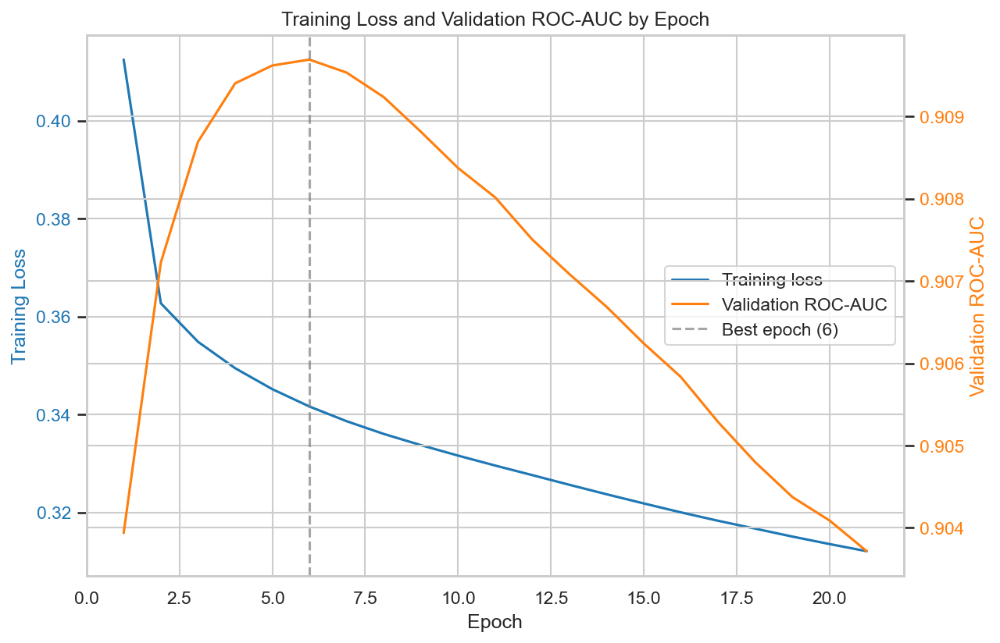
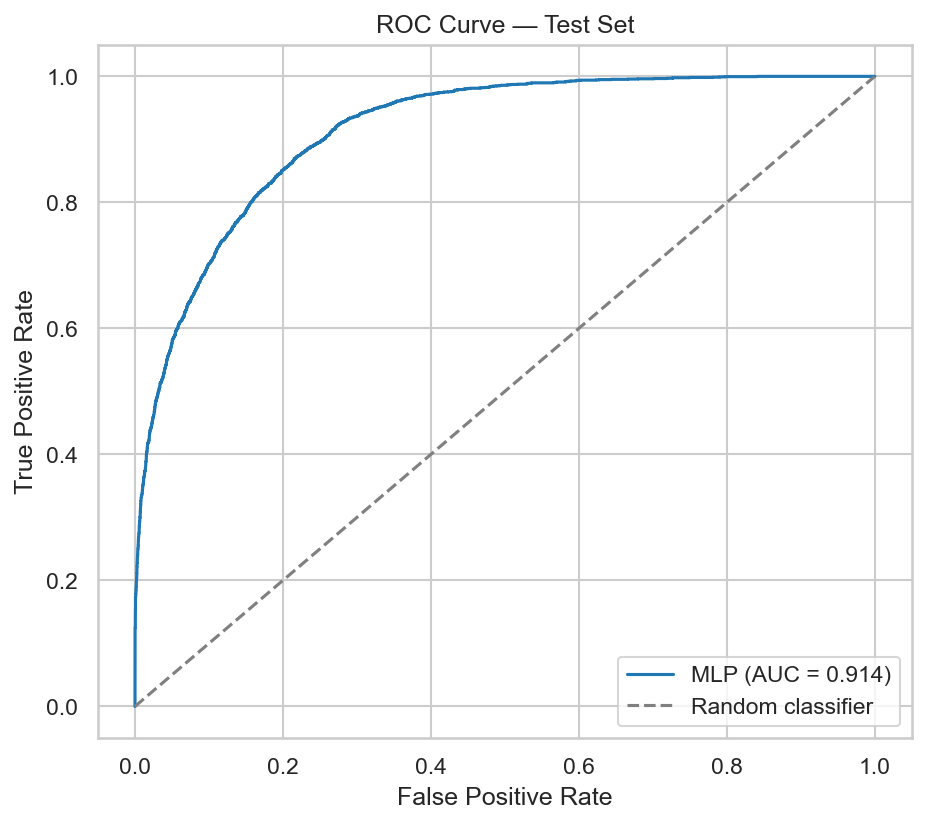
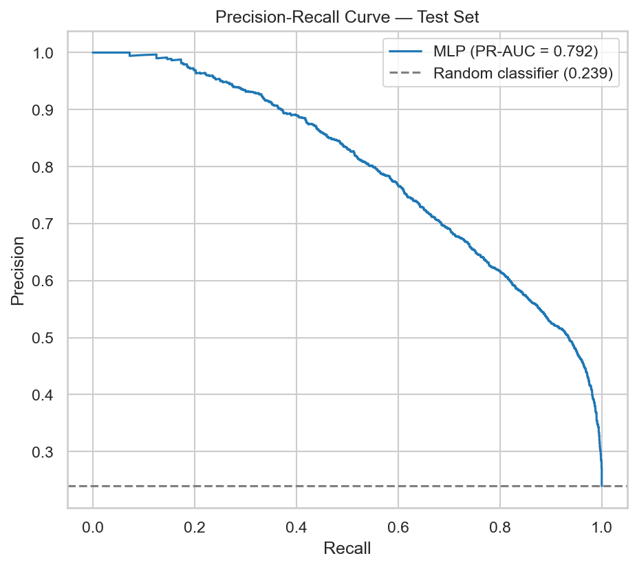
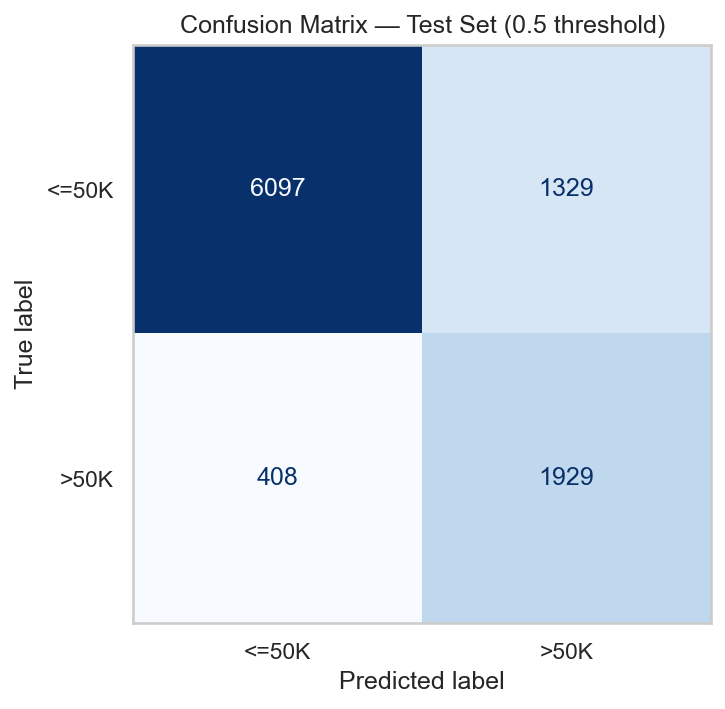
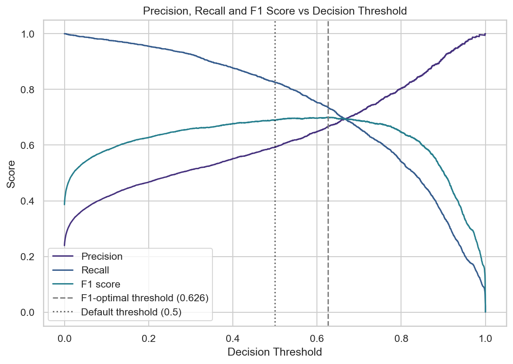
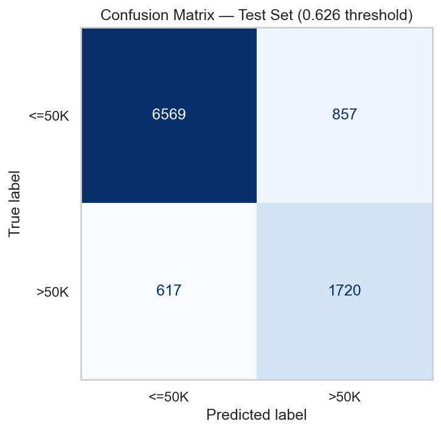
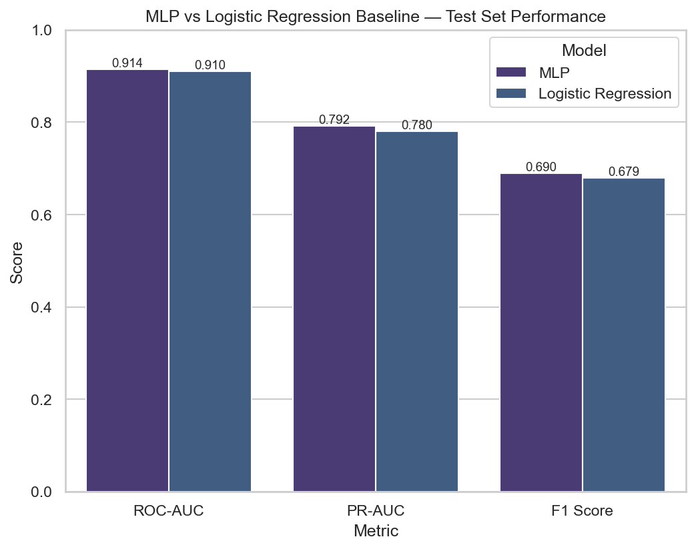

---

layout: default

title: Predicting Income Above $50,000 from Census Data (Feedforward Neural Network)

permalink: /feedforward-neural-network/

---

## Goals and objectives:

Every model developed so far in this portfolio's supervised learning section has been tree-based — inherently robust to feature scale, categorical splits, and monotonic transforms. A Feedforward Neural Network (Multi-Layer Perceptron) removes all three of those conveniences at once, and this project is designed to confront that directly rather than gloss over it.

This project builds a binary classifier to predict whether an individual earns more or less than $50,000 per year, using the cleaned UCI Adult Income dataset produced by the [Exploratory Data Analysis project](/exploratory-data-analysis/) earlier in this portfolio. Rather than treating that EDA as a formality to reference and move past, this project deliberately picks up every open item its Next Steps section identified, and resolves each one as an explicit, justified modelling decision.

The specific objectives were to:

- **Resolve the `education` / `education_num` redundancy** flagged but deliberately left unresolved in the EDA, ahead of feeding features into a model where duplicated information is not merely wasteful, as it was for the tree-based models used elsewhere in this portfolio, but can distort the network's learned weights.  
- **Design an explicit, defensible strategy for the dataset's 76% / 24% class imbalance**, given accuracy alone would be a misleading headline metric on this target, and MLPClassifier's lack of built-in class-weighting support rules out the simplest fix.  
- **Engineer the zero-inflated `capital_gain` and `capital_loss` features** (91.7% and 95.3% zeros respectively) as a two-part representation, exactly as proposed in the EDA's Next Steps, rather than passing heavily skewed raw values into a scaler.  
- **Design the training process around a genuine CPU-only constraint** — a modest architecture, sensible batch size, and manual early stopping — rather than discovering the practical limits of a laptop-scale network after the fact.  
- **Benchmark the network honestly against a simpler linear baseline**, to establish whether its added complexity and training cost are actually justified by a meaningful performance gain on this particular dataset, rather than assuming a neural network is automatically the better choice.

## Application:  

The Feedforward Neural Network — more commonly known in its simplest form as a Multi-Layer Perceptron (MLP) — is the foundational architecture of modern deep learning, and remains one of the most widely deployed supervised learning techniques in production systems today. It is described as "feedforward" because information flows in a single direction, from the input layer through one or more hidden layers to the output layer, with no cycles or feedback loops — as distinct from recurrent architectures, which pass information back through the network across sequential steps. Despite the emergence of far more specialised architectures for images, sequences, and language, the plain MLP remains the workhorse of choice wherever the input data is naturally tabular or already exists as a fixed-length feature vector — precisely the structure of the Adult Income dataset used in this project.

The core mechanism behind an MLP is straightforward to describe and surprisingly powerful in practice. Each layer consists of a set of neurons, and every neuron computes a weighted sum of its inputs, adds a bias term, and passes the result through a non-linear activation function — commonly ReLU (Rectified Linear Unit) for hidden layers, and sigmoid or softmax for the output layer in classification tasks. It is this non-linearity, applied repeatedly across layers, that gives the network its expressive power: a network with even a single hidden layer of sufficient width can, in principle, approximate any continuous function to arbitrary precision — a result known as the Universal Approximation Theorem. In practice, deeper networks with modest layer widths tend to learn more efficiently than a single very wide layer, because each layer builds progressively more abstract representations on top of the last. Training proceeds via backpropagation: the network's predictions are compared against known outcomes using a loss function, and the resulting error is propagated backwards through the network to update every weight in proportion to its contribution to that error, typically using a gradient-based optimiser such as Adam or stochastic gradient descent, repeated over many passes (epochs) through the training data.
This versatility means MLPs are deployed wherever an organisation needs to learn a complex, non-linear relationship between a set of measured or recorded features and an outcome of interest. Practical examples showing where the Feedforward Neural Network technique provides clear business value include:

🏦 **Finance & Insurance**:

**Credit Scoring and Loan Default Prediction**: Retail and commercial lenders use MLPs to predict the probability that an applicant will default on a loan, learning non-linear interactions between income, credit history, employment status, and existing debt that simpler linear scoring models struggle to capture — directly analogous to the income prediction task in this project.

**Insurance Claims Fraud Detection**: Insurers train feedforward networks on historical claims data — claim amount, policy tenure, claimant history, incident description features — to flag applications with an elevated probability of fraud for manual review, reducing the manual caseload while preserving coverage of genuinely suspicious claims.

**Algorithmic Trading Signals**: Quantitative trading desks use MLPs to combine dozens of engineered market indicators into a single predictive signal, exploiting the network's capacity to learn interaction effects between indicators that no single technical rule would capture on its own.

🏥 **Healthcare & Life Sciences**:

**Patient Risk Stratification**: Hospitals and insurers use MLPs trained on structured patient records — vitals, lab results, comorbidities, prior admissions — to predict the risk of an adverse outcome such as readmission or deterioration, supporting earlier clinical intervention for the highest-risk patients.

**Diagnostic Support from Structured Clinical Data**: Where a diagnosis depends on combining many individually weak clinical indicators — blood panel results, demographic factors, symptom checklists — MLPs are used to learn the combined, non-linear signal that a manual scoring rubric would miss.

**Drug Dosage Optimisation**: Pharmacokinetic models built as MLPs predict an individual patient's likely response to a given drug dosage from their physiological characteristics, supporting personalised dosing decisions beyond fixed, one-size-fits-all guidelines.

🛒 **Retail & Marketing**:

**Customer Churn Prediction**: Subscription businesses train MLPs on customer behaviour, usage, and billing history to predict the likelihood of cancellation, enabling retention teams to prioritise outreach to the customers most likely to leave and most likely to respond to intervention.

**Demand Forecasting**: Retailers use feedforward networks to predict product-level demand from a combination of pricing, seasonality, promotional activity, and historical sales features, supporting more accurate inventory and staffing decisions than simpler linear forecasting methods.

**Customer Lifetime Value Estimation**: Marketing teams model the expected long-term value of a newly acquired customer from early behavioural signals, allowing acquisition spend to be allocated toward the channels and segments most likely to yield high-value customers.

🏭 **Operations & Manufacturing**:

**Predictive Maintenance**: Manufacturers train MLPs on sensor readings — vibration, temperature, pressure, run-time — to predict the probability of equipment failure within a defined window, allowing maintenance to be scheduled proactively rather than reactively.

**Employee Attrition Modelling**: HR analytics teams use MLPs on structured workforce data — tenure, compensation, role, engagement survey results — to identify employees at elevated risk of leaving, supporting targeted retention conversations before a resignation is submitted.

**Supply Chain Risk Scoring**: Logistics and procurement teams score suppliers or shipment routes for disruption risk using structured operational and historical performance features, learning the non-linear combinations of factors that most reliably precede a delay or failure.

Across every one of these examples, the appeal of the MLP is the same: it removes the need to manually specify which combinations and interactions of features matter, learning that structure directly from labelled examples instead. This makes it a natural fit for exactly the kind of problem this project addresses — predicting an individual-level outcome from a wide set of demographic and behavioural features — while the practical challenges tackled here (class imbalance, feature scaling, encoding, and CPU-only training constraints) are the same ones any organisation deploying this technique on real, imperfect data has to solve.

## Methodology:  

**Dataset**: the cleaned, validated output of the [EDA project](/exploratory-data-analysis/) — 48,813 records across 15 columns, with all disguised missingness resolved and the `income` target standardised to two clean classes (`<=50K`, `>50K`).

**Feature engineering** resolved three items carried forward from the EDA's Next Steps:

1. **`education` / `education_num` redundancy.** The 1:1 mapping between the two columns was re-verified (16 distinct education labels, 0 with an inconsistent `education_num` value) before dropping the categorical `education` column and retaining the already-ordinal `education_num`, avoiding a duplicated signal reaching the network via two different encodings. `fnlwgt` — a Census Bureau survey sampling weight rather than an individual-level attribute — was dropped for the same reason: it carries no genuine income signal.
2. **Zero-inflated capital gain and loss.** Rather than passing the heavily skewed raw amounts directly into a scaler, each was represented as two features: a binary `has_capital_gain` / `has_capital_loss` flag, and the scaled continuous amount. This gives the network a clean signal for the dominant case (91.7% / 95.3% of records with no capital activity at all) independent of the scaled magnitude for the rarer case where activity occurred.
3. **Encoding and scaling.** The five remaining numeric features were standardised with `StandardScaler`; the seven categorical features were one-hot encoded with `OneHotEncoder`, expanding the 14 pre-encoding feature columns to 92 model-ready columns. Both were fitted on the training split only, to avoid any leakage of validation or test set statistics into the model.

**Data splitting**: a three-way, stratified 68% / 12% / 20% split into training (33,192 rows), validation (5,858 rows), and test (9,763 rows) sets, rather than the more common two-way split. The validation split exists specifically to support early stopping, and stratification confirmed the target's 76% / 24% balance was preserved near-identically across all three sets (23.94% / 23.93% / 23.94% positive).

**Data splitting**: a three-way, stratified 68% / 12% / 20% split into training (33,192 rows), validation (5,858 rows), and test (9,763 rows) sets, rather than the more common two-way split used elsewhere in this portfolio. A validation set is necessary here specifically because of manual early stopping: checking training progress against the training set itself is misleading, since performance there keeps improving even as the model starts memorising noise rather than learning genuine patterns, while checking against the test set would "spend" it during training and leave no clean, untouched data left to report a final, honest performance figure. The validation set gives early stopping a decision-making sample that is never used to update weights and never touched until training is complete. Stratification confirmed the target's 76% / 24% balance was preserved near-identically across all three sets (23.94% / 23.93% / 23.94% positive).

**Class imbalance**: the training set (23.9% positive) was rebalanced to 50/50 via random oversampling of the minority class, applied *after* the train/validation/test split and *after* the preprocessor was fitted — so neither the validation set, the test set, nor the scaler's learned statistics were affected by any duplicated row. Random oversampling was chosen over two alternatives: `MLPClassifier` has no built-in `class_weight` or `sample_weight` support (unlike the tree-based and linear models used elsewhere in this portfolio), ruling out class weighting directly; and SMOTE was ruled out because, after one-hot encoding, most of the feature space is binary — interpolating between real examples in that space would generate invalid fractional category values.

**Model architecture**: a two-hidden-layer MLP (64 → 32 units, ReLU activation, Adam optimiser, L2 regularisation α = 1e-4, batch size 256), sized deliberately conservatively given the CPU-only training environment and the modest 92-column feature space.

**Training**: rather than `MLPClassifier`'s built-in `early_stopping=True` — which would carve its own validation split from whatever data it is given, reintroducing leakage if that data has already been oversampled — training used a manual epoch-by-epoch loop via `partial_fit`, monitoring validation ROC-AUC after every epoch and retaining the model weights from the best-performing epoch, with a patience of 15 epochs before stopping.

**Threshold tuning**: rather than accepting the conventional 0.5 classification threshold by default, the F1-optimal threshold was identified directly from the precision-recall curve computed on the test set.

**Baseline comparison**: an `L2`-regularised Logistic Regression, using its native `class_weight="balanced"` support on the original (pre-oversampling) training data, was trained as a linear benchmark to establish whether the MLP's added complexity was justified by a meaningful performance improvement.

## Results:

**Training was fast and stable.** With the CPU-only architecture and batch size described above, the full training loop ran in 4.2 seconds. Validation ROC-AUC peaked at epoch 6 (0.9097) and declined gradually thereafter even as training loss continued to fall, triggering early stopping at epoch 21. This is a clean illustration of exactly the risk early stopping exists to catch: the epoch that minimises training loss most is not the epoch that generalises best, and without monitoring an untouched validation set, the wrong set of weights would have been the ones evaluated.

**Class imbalance was addressed cleanly at the training stage only.** The pre-resampling training set (25,246 majority / 7,946 minority records) was rebalanced to a full 50/50 split of 25,246 records each via oversampling, while the validation and test sets were left untouched at their natural 76% / 24% distribution throughout.

**Test set performance at the default 0.5 threshold** reached a ROC-AUC of 0.9141 and a PR-AUC of 0.7920 — well above the 0.2394 baseline a random classifier would achieve on this imbalanced target. At this threshold, the model achieved 94% precision / 82% recall on the `<=50K` class and 59% precision / 83% recall on the `>50K` class (82% overall accuracy), reflecting the oversampling strategy's effect of pushing the model toward higher recall on the minority class at some cost to its precision.

**Threshold tuning materially rebalanced precision and recall on the minority class.** The F1-optimal threshold was identified at 0.626, improving F1 on the `>50K` class from 0.6895 to 0.7000, and shifting its precision/recall balance from 59% / 83% to a more even 67% / 74%. In practical terms, this is a genuine, quantifiable illustration of adjusting a model's decision boundary to fit the relative cost of false positives against false negatives, rather than accepting an arbitrary default.

**The MLP outperformed the Logistic Regression baseline, but by a modest margin.** The network led on every metric measured at the default threshold — ROC-AUC (0.9141 vs 0.9101), PR-AUC (0.7920 vs 0.7804), and F1 score (0.6895 vs 0.6791) — while taking roughly five times longer to train (4.2 seconds vs 0.82 seconds). The gap is real but small, indicating that the relationship between these features and income is close to linear enough for a simple, fast, fully-interpretable model to capture most of the available signal on its own.

## Conclusions:

- **Resolving redundant and low-value features before training paid off directly.** Confirming the clean 1:1 relationship between `education` and `education_num` before dropping the redundant categorical column, and removing the non-informative `fnlwgt` sampling weight, prevented the network from having to learn around duplicated or irrelevant information — a step the tree-based models used elsewhere in this portfolio could safely skip, but an MLP cannot.
- **The zero-inflation handling strategy proposed in the EDA held up in practice.** Representing `capital_gain` and `capital_loss` as a binary activity flag alongside a scaled continuous amount, rather than passing the raw skewed values directly into a scaler, avoided compressing 91.7% and 95.3% of records respectively into a narrow, uninformative band near zero.
- **Random oversampling, applied strictly after the data split and after preprocessing was fit, is a sound imbalance strategy when class weighting is unavailable.** It rebalanced the training signal without contaminating the validation set, test set, or the scaler's learned statistics — evidenced by the validation and test sets holding their natural, near-identical class proportions throughout.
- **Manual early stopping against an untouched validation set was not a formality — it changed the outcome.** Validation ROC-AUC peaked five epochs before the training loop's eventual stopping point, and continued to decline for a further fifteen epochs while training loss kept falling. Relying on training loss alone, or on `MLPClassifier`'s built-in early stopping (which would have drawn its validation split from the already-oversampled training data), would have risked selecting a worse-generalising model.
- **A neural network is not automatically the right choice, and this project is honest about that.** The MLP beat the Logistic Regression baseline on every metric, but only modestly. For this dataset, a linear model captures most of the available signal in a fraction of the training time and with substantially greater interpretability — a genuinely useful finding in its own right, and a more credible conclusion than assuming added model complexity is inherently worth its cost.

## Next steps:  

This project was designed from the outset as the second step in a three-part EDA → MLP → LIME arc, and the trained model, fitted preprocessor, and held-out test split have been persisted specifically to support that continuation:

- **Model interpretability with LIME.** The next project in this portfolio will use LIME (Local Interpretable Model-agnostic Explanations) to generate individual-level explanations for this network's predictions, using the exported `mlp_model.joblib`, `preprocessor.joblib`, `X_test_raw.csv`, and `y_test.csv` artifacts directly, without repeating any of the cleaning, splitting, or training steps carried out here.
- **Counterfactual explanations.** A natural companion to LIME, examining the minimal changes to an individual's features that would flip the model's prediction — directly relevant to the credit scoring and loan default use cases discussed in the Application section above.
- **MLOps.** This project's manual early-stopping loop and artifact export process are a natural starting point for a future MLOps-focused project examining how a model like this would be versioned, monitored, and retrained in a production setting.
- **Fairness across demographic subgroups.** The EDA's automated profiling flagged high imbalance in `race` and `native_country`; with a trained model now available, a future project could examine whether this network's error rates are consistent across those subgroups, rather than only across the dataset as a whole.

## Python code:
You can view the full Python script used for the analysis here: 
[View the Python Script](/MLP_v1.py)
