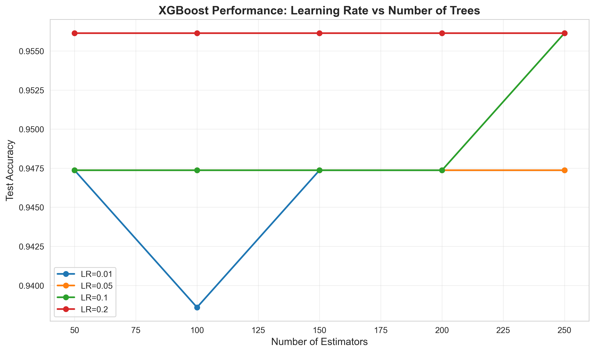
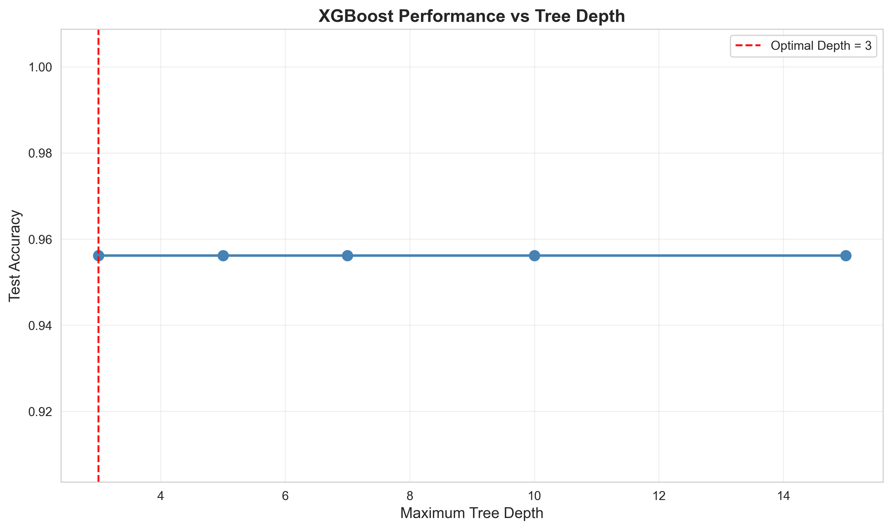

---

layout: default

title: Breast Cancer Predictions (Gradient Boosted Trees)

permalink: /gradient-boosted-trees/

---

#### This project is in development

## Goals and objectives:

The business objective is to predict the cancer status of cells (benign or malignant) based on 30 features of the cells observed via digitised images. Two previous projects built a decision tree model and random forest model for this prediction, achieving an accuracy of 93.86% and 95.61% respectively.  The goal of this project is to research if using a Gradient Boosted Trees (GBTs) predictor can produce more accurate results, and produce more insights into the data supporting the predictions. The predicted results are binary ‘Malignant’, ‘Benign’ values.

This project contains many references to the Decision Tree and Random Forest projects as one of the key analysis goals is to understand the comparison between the three approaches.

This follows on from the Decision Tree project found here , and the Random Forest project found here.

An optimal gradient boost trees model was built to make the predictions, achieving an accuracy of XX.XX%, using optimal hyperparameters xxxxx. For the random forest the most important feature was identified as ‘worse area’. The accuracy increased by X.XX% from the optimal random forest in the previous project.

## Application:  

Gradient Boosted Trees is an ensemble method that builds trees sequentially. It starts with a simple initial model and then adds new decision trees one by one, where each new tree is specifically designed to correct the errors (residuals) made by the collective ensemble that came before it. This process uses a gradient descent algorithm to minimize a loss function, effectively "boosting" the performance of the model by focusing on the most difficult data points with every new iteration. While Random Forests rely on the "majority vote" of a diverse crowd, Gradient Boosting is a process of continuous refinement, where each weak tree learns from the failures of its predecessors to create a final, highly accurate model.

Gradient boosting moves from the "democratic" approach of Random Forest to a "expert refinement" approach. In a business setting, this makes it the go-to algorithm for high-stakes accuracy where every decimal point of error translates to lost revenue.

Here are real-world examples of Gradient Boosted Trees for context, noting that in general the use cases are similar to those described for Decision Trees and Random Forests, but is a mechanism to typically produce more accurate predictions.

* **Finance: Precision Credit Scoring** - such as to determine whether a loan should be approved.  This can reduce "false negatives" (denying a good borrower) and "false positives" (approving a risky one), which directly protects the bank’s capital.  
* **Science (BioTech): Drug Discovery & Response** - In the pharmaceutical industry, companies use GBTs to predict how different chemical compounds will react with specific biological targets.  This  dramatically narrows down thousands of potential drug candidates to a handful of "high-probability" options, saving years of research time.  
* **Manufacturing: Automotive Supply Chain Reliability** - Vehicle manufacturers use GBTs to manage the complexity of "Just-in-Time" manufacturing, where parts must arrive exactly when needed.  This allows the factory to pre-calculate critical situations and switch to backup suppliers before the assembly line is forced to stop.  
* **Retail: Dynamic Demand Forecasting** - E-commerce businesses use GBTs to decide exactly how many units of a specific product (SKU) to stock in a specific warehouse.  This minimises "stock-outs" (losing sales because an item is missing) and "overstock" (tying up cash in unsold goods).  

There are multiple implementations of Gradient Boosted Trees, all use the same fundamental principle: sequentially building decision trees where each new tree corrects errors made by previous trees. However, they differ significantly in implementation details, speed, and specialisations.

For this proof-of-concept XGBoost is used.  XGBoost is conceptually similar to Random Forest but with boosting instead of bagging, making it an logical next step from random forests.  Other common examples of Gradient Boosted Trees (not used in this project) include LightGBM and CatBoost.  

## Methodology:  

The dataset used is the same as used in the Decision Tree project - the Wisconsin Breast Cancer dataset, which enables comparison of the two methods.  This is available from scikit-learn, including 569 observations, including 30 independent features.

The dataset is also available from Kaggle [here](https://www.kaggle.com/datasets/uciml/breast-cancer-wisconsin-data)

The method applied in the analysis:

* **Dataset validation** to confirm no missing values, and basic descriptive analysis on the features including the correlation between the 30 features. No data pre-processing was undertaken.
* **Fine-tuning XGBoost Hyperparameters** to determine the optimal hyperparameters for the model including:
  * Number of boosting rounds (trees)
  * Maximum tree depth
  * Learning_rate: Step size for each tree's contribution
  * Subsample: Fraction of samples used per tree
  * Fraction of features used per tree
  * Minimum loss reduction for split (regularisation)

Details of the methodology applied in the project.

## Results and conclusions:

Results from the project related to the business objective.

Simple descriptive analytics determined that 212 observations relate to malignant cancers and 357 relate to benign cancers.

The correlation matrix is the same as that shown for the Decision Tree project [here](https://marcgrover-datascience.github.io/decision-trees/) as it uses the same dataset, and as such not shown here.

### Fine-tuning XGBoost Hyperparameters

An Baseline XGBoost Model was generated which produced an accuracy of 94.74%.  This used the following arguments:

n_estimators=100,  
learning_rate=0.1,  
max_depth=3,  
random_state=42,  
eval_metric='logloss',  
n_jobs=-1  

**Optimising number of trees and learning rate** - multiple GBT models were created using various values for the number of trees (n_estimators) and learning rate, to determine optimal values for each metric.  
n_estimators = [50, 100, 150, 200, 250]
learning_rate = [0.01, 0.05, 0.1, 0.2]

The accuracy of these models (based on the testing set) are visualised below, where the results suggest an optimal learning rate of 0.1 and an optimal number of trees equal to 250, which produce a GBT model with an accuracy of 95.61% which is higher than the baseline model.



**Optimising tree depth** - multiple GBT models were created testing multiple values of tree depth [3, 5, 7, 10, 15], using the optimal number of trees and optimal learning rate previously identified.  The accuracy of each model is the same and as such the optimal tree depth is considered to be 3, which is the same as the baseline model.




**Optimising Sampling Parameters** - multiple GBT models were created and tested with the values for subsample and colsample being the variables.  The values tested for these two hyperparameters were:  
subsample_range = [0.6, 0.7, 0.8, 0.9, 1.0]  
colsample_range = [0.6, 0.7, 0.8, 0.9, 1.0]  

It was determined that the optimal values were:  subsample: 0.7; colsample_bytree: 0.7, which produced an accuracy of 96.49%

<Note - add description of subsample and colsample>

**Optimising Regularisation Parameters**

In the context of gradient boosted trees, Minimum Loss Reduction (gamma) and L1 Regularisation (reg_alpha) are crucial tools for preventing overfitting by penalising model complexity.

Minimum Loss Reduction (gamma) acts as a gatekeeper for tree growth by specifying the minimum improvement in the loss function required to justify a new split. When the algorithm considers splitting a leaf, it calculates the "Gain" — the reduction in training loss achieved by that split; if this Gain is less than the value of gamma, the split is discarded.  Increasing gamma makes the algorithm more conservative, forcing it to only create branches that provide a significant, meaningful improvement to the model's predictive power, which helps prune away noise-driven branches.

L1 regularisation (reg_alpha) is applied to the weights assigned to the leaves of the tree. In gradient boosting, each leaf in a tree has an associated score or "weight" that contributes to the final prediction. reg_alpha adds a penalty term to the objective function proportional to the absolute value of these weights. Because L1 regularisation has a mathematical property that encourages "sparsity," a higher reg_alpha can drive the weights of less important leaves or features all the way to zero. This simplifies the model, makes it more robust against high-dimensional noise, and can even act as a form of automatic feature selection by effectively "turning off" parts of the tree that do not contribute significantly to the overall ensemble.

```
    gamma  reg_lambda     score
0     0.0         0.0  0.973684
1     0.0         0.5  0.956140
2     0.0         1.0  0.964912
3     0.0         2.0  0.956140
4     0.0         5.0  0.956140
5     0.1         0.0  0.964912
6     0.1         0.5  0.956140
7     0.1         1.0  0.956140
8     0.1         2.0  0.956140
9     0.1         5.0  0.956140
10    0.5         0.0  0.956140
11    0.5         0.5  0.956140
12    0.5         1.0  0.956140
13    0.5         2.0  0.956140
14    0.5         5.0  0.964912
15    1.0         0.0  0.964912
16    1.0         0.5  0.956140
17    1.0         1.0  0.956140
18    1.0         2.0  0.956140
19    1.0         5.0  0.956140
20    2.0         0.0  0.964912
21    2.0         0.5  0.964912
22    2.0         1.0  0.956140
23    2.0         2.0  0.964912
24    2.0         5.0  0.964912
```

Results from the project related to the business objective.

### Conclusions:

Conclusions from the project findings and results.

Decision Tree → Random Forest → XGBoost provides excellent narrative for showing evolution of ensemble methods.  

## Next steps:  

With any analysis it is important to assess how the model and application of the analytical methods can be used and evolved to support the business goals and business decisions and yield tangible benefits.


## Python code:
You can view the full Python script used for the analysis here: 
[View the Python Script](/XGBoost_BreastCancer.py)
