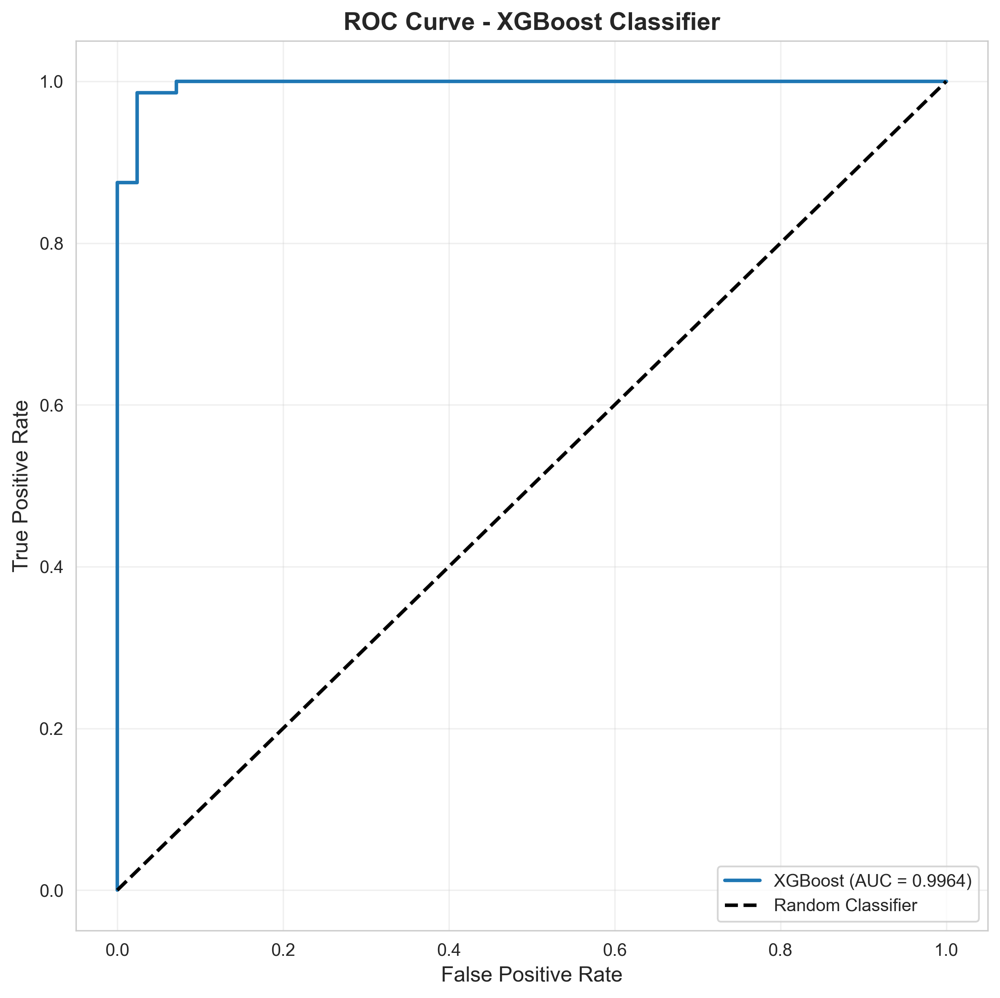
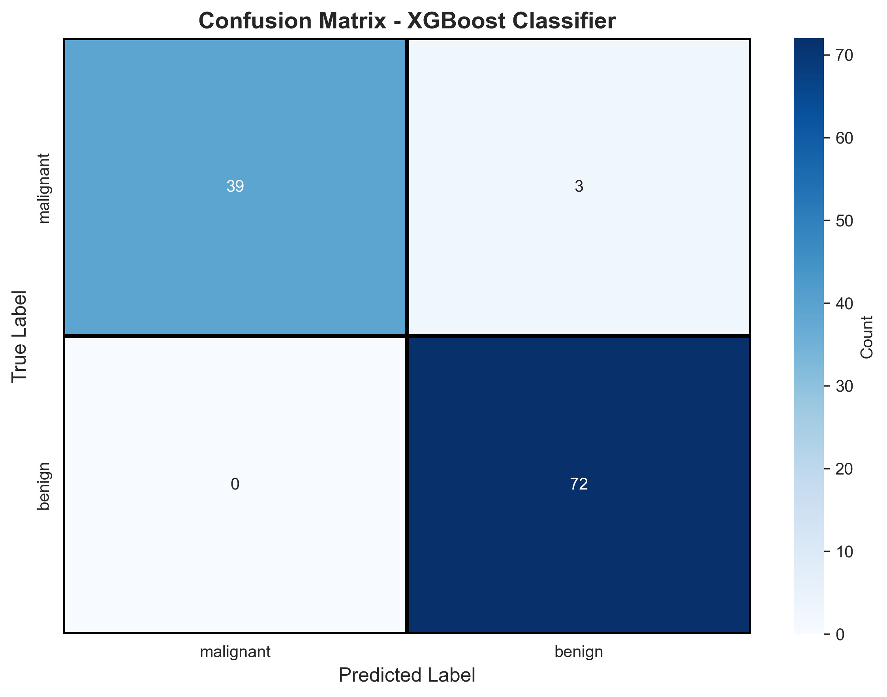
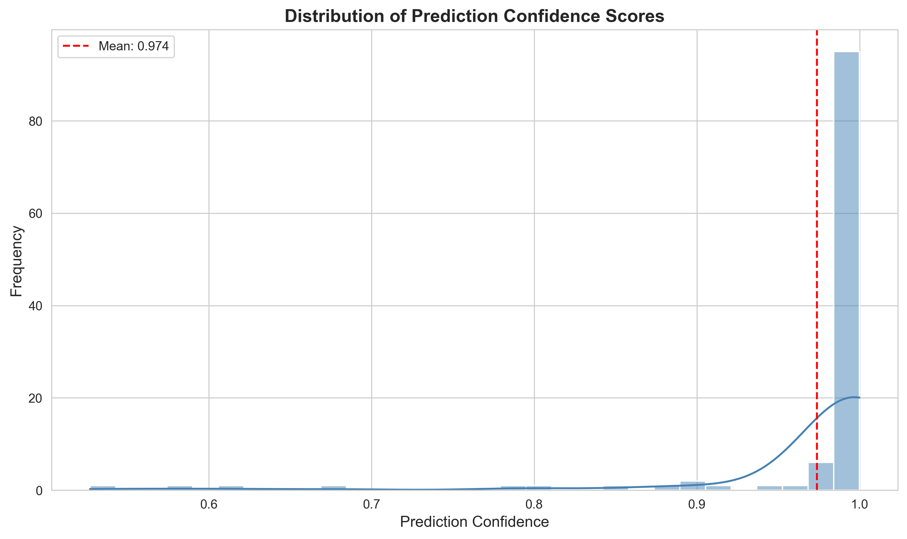
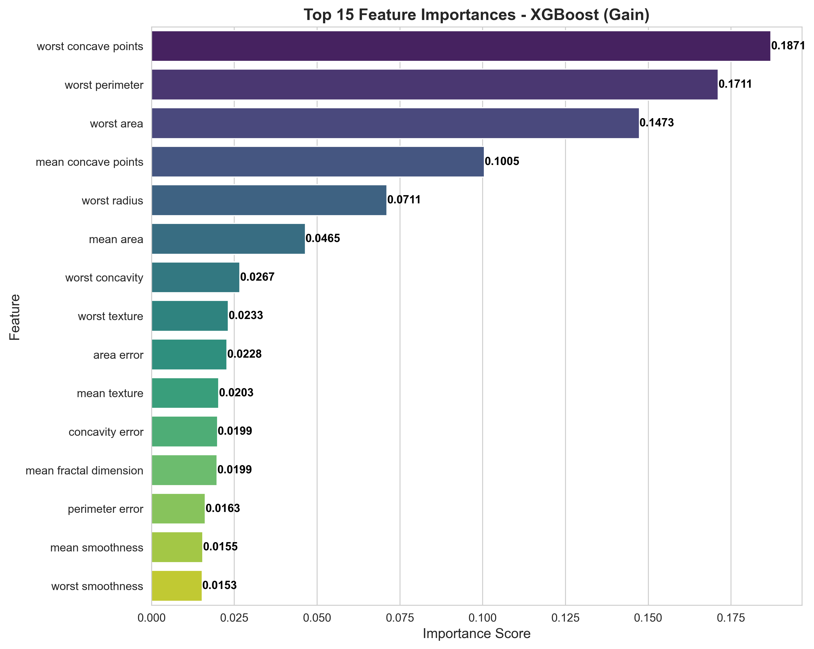

---

layout: default

title: Breast Cancer Predictions (Gradient Boosted Trees)

permalink: /gradient-boosted-trees/

---

#### This project is in development

## Goals and objectives:

The business objective is to predict the cancer status of cells (benign or malignant) based on 30 features of the cells observed via digitised images. Two previous projects built a decision tree model and random forest model for this prediction, achieving an accuracy of 93.86% and 95.61% respectively.  The goal of this project is to research if using a Gradient Boosted Trees (GBTs) predictor can produce more accurate results, and produce more insights into the data supporting the predictions. The predicted results are binary ‘Malignant’, ‘Benign’ values.

This project contains many references to the Decision Tree and Random Forest projects as one of the key analysis goals is to understand the comparison between the three approaches.

This follows on from the Decision Tree project found here , and the Random Forest project found here.

An optimal gradient boost trees model was built to make the predictions, achieving an accuracy of 97.37%, using the determined optimal hyperparameters. The accuracy increased by 1.76% from the optimal random forest in the previous project.  For the optimal gradient boosted tree ensemble, the most important feature is identified as ‘worse concave points’, followed by 'worst perimeter' and 'worst area'.  The top five most important features are the same as those for the optimal random forest, though in a different order and with different importance scores. 

## Application:  

Gradient Boosted Trees is an ensemble method that builds trees sequentially. It starts with a simple initial model and then adds new decision trees one by one, where each new tree is specifically designed to correct the errors (residuals) made by the collective ensemble that came before it. This process uses a gradient descent algorithm to minimize a loss function, effectively "boosting" the performance of the model by focusing on the most difficult data points with every new iteration. While Random Forests rely on the "majority vote" of a diverse crowd, Gradient Boosting is a process of continuous refinement, where each weak tree learns from the failures of its predecessors to create a final, highly accurate model.

Gradient boosting moves from the "democratic" approach of Random Forest to a "expert refinement" approach. In a business setting, this makes it the go-to algorithm for high-stakes accuracy where every decimal point of error translates to lost revenue.

Here are real-world examples of Gradient Boosted Trees for context, noting that in general the use cases are similar to those described for Decision Trees and Random Forests, but is a mechanism to typically produce more accurate predictions.

* **Finance: Precision Credit Scoring** - such as to determine whether a loan should be approved.  This can reduce "false negatives" (denying a good borrower) and "false positives" (approving a risky one), which directly protects the bank’s capital.  
* **Science (BioTech): Drug Discovery & Response** - In the pharmaceutical industry, companies use GBTs to predict how different chemical compounds will react with specific biological targets.  This  dramatically narrows down thousands of potential drug candidates to a handful of "high-probability" options, saving years of research time.  
* **Manufacturing: Automotive Supply Chain Reliability** - Vehicle manufacturers use GBTs to manage the complexity of "Just-in-Time" manufacturing, where parts must arrive exactly when needed.  This allows the factory to pre-calculate critical situations and switch to backup suppliers before the assembly line is forced to stop.  
* **Retail: Dynamic Demand Forecasting** - E-commerce businesses use GBTs to decide exactly how many units of a specific product (SKU) to stock in a specific warehouse.  This minimises "stock-outs" (losing sales because an item is missing) and "overstock" (tying up cash in unsold goods).  

There are multiple implementations of Gradient Boosted Trees, all use the same fundamental principle: sequentially building decision trees where each new tree corrects errors made by previous trees. However, they differ significantly in implementation details, speed, and specialisations.

For this proof-of-concept XGBoost is used.  XGBoost is conceptually similar to Random Forest but with boosting instead of bagging, making it an logical next step from random forests.  Other common examples of Gradient Boosted Trees (not used in this project) include LightGBM and CatBoost.  

## Methodology:  

The dataset used is the same as used in the Decision Tree project - the Wisconsin Breast Cancer dataset, which enables comparison of the two methods.  This is available from scikit-learn, including 569 observations, including 30 independent features.

The dataset is also available from Kaggle [here](https://www.kaggle.com/datasets/uciml/breast-cancer-wisconsin-data)

The method applied in the analysis:

* **Dataset validation** to confirm no missing values, and basic descriptive analysis on the features including the correlation between the 30 features. No data pre-processing was undertaken.
* **Fine-tuning XGBoost Hyperparameters** to determine the optimal hyperparameters for the model including:
  * Number of boosting rounds (trees)
  * Maximum tree depth
  * Learning_rate: Step size for each tree's contribution
  * Subsample: Fraction of samples used per tree
  * Fraction of features used per tree
  * Minimum loss reduction for split (regularisation)
* **Fitting and Validating Gradient Boosted Tree Model** to build the model using the optimal hyperparameters to make predictions.

Details of the methodology applied in the project.

## Results and conclusions:

Simple descriptive analytics determined that 212 observations relate to malignant cancers and 357 relate to benign cancers.

The correlation matrix is the same as that shown for the Decision Tree project [here](https://marcgrover-datascience.github.io/decision-trees/) as it uses the same dataset, and as such not shown here.

### Fine-tuning XGBoost Hyperparameters

An Baseline XGBoost Model was generated which produced an accuracy of 94.74%.  This used the following hyperparameters (arguments):

n_estimators=100,  
learning_rate=0.1,  
max_depth=3,  
random_state=42,  
eval_metric='logloss',  
n_jobs=-1  

**Optimising number of trees and learning rate** - multiple GBT models were created using various values for the number of trees (n_estimators) and learning rate, to determine optimal values for each metric.  
n_estimators = [50, 100, 150, 200, 250]  
learning_rate = [0.01, 0.05, 0.1, 0.2]  

The accuracy of these models (based on the testing set) are visualised below, where the results suggest an optimal learning rate of 0.1 and an optimal number of trees equal to 250, which produce a GBT model with an accuracy of 95.61% which is higher than the baseline model.


**Optimising tree depth** - multiple GBT models were created testing multiple values of tree depth [3, 5, 7, 10, 15], using the optimal number of trees and optimal learning rate previously identified.  The accuracy of each model is the same and as such the optimal tree depth is considered to be 3, which is the same as the baseline model.


**Optimising Sampling Parameters** - multiple GBT models were created and tested with the values for subsample and colsample being the variables.  

The subsample parameter controls the fraction of training samples used to build each individual tree in the boosting sequence. It operates similarly to bootstrap sampling in Random Forest, but is applied at each boosting round. For example, subsample=0.8 means each tree is trained on a randomly selected 80% of the training data, with the remaining 20% excluded from that particular tree's construction. This adds randomness to the learning process and helps prevent overfitting. 

The colsample_bytree parameter determines the fraction of features (columns) randomly sampled when constructing each tree in the boosting ensemble. For instance, colsample_bytree=0.8 means each tree uses only 80% of available features, with a different random subset selected for each tree. This feature subsampling mechanism serves multiple purposes: it reduces correlation between trees in the ensemble (making their combined predictions more robust), speeds up training by reducing the number of features each tree must evaluate, and helps prevent overfitting by forcing the model to find alternative feature combinations for making predictions. 

The values tested for these two hyperparameters were:  
subsample_range = [0.6, 0.7, 0.8, 0.9, 1.0]  
colsample_range = [0.6, 0.7, 0.8, 0.9, 1.0]  

It was determined that the optimal values were:  subsample: 0.7; colsample_bytree: 0.7, which produced an accuracy of 96.49%

**Optimising Regularisation Parameters**

For optimising gradient boosted trees, Minimum Loss Reduction (gamma) and L1 Regularisation (reg_alpha) are crucial tools for preventing overfitting by penalising model complexity.

**Minimum Loss Reduction (gamma)** acts as a gatekeeper for tree growth by specifying the minimum improvement in the loss function required to justify a new split. When the algorithm considers splitting a leaf, it calculates the "Gain", which is the reduction in training loss achieved by that split.  If this Gain is less than the value of gamma, the split is discarded.  Increasing gamma makes the algorithm more conservative, forcing it to only create branches that provide a significant, meaningful improvement to the model's predictive power, which helps prune away noise-driven branches.

**L1 regularisation (reg_alpha)** is applied to the weights assigned to the leaves of the tree. In gradient boosting, each leaf in a tree has an associated score or "weight" that contributes to the final prediction. reg_alpha adds a penalty term to the objective function proportional to the absolute value of these weights. Because L1 regularisation has a mathematical property that encourages "sparsity," a higher reg_alpha can drive the weights of less important leaves or features all the way to zero. This simplifies the model, makes it more robust against high-dimensional noise, and can even act as a form of automatic feature selection by effectively "turning off" parts of the tree that do not contribute significantly to the overall ensemble.

The optimal values for gamma and reg_lambda were both determined to be 0.

```
    gamma  reg_lambda     score
0     0.0         0.0  0.973684
1     0.0         0.5  0.956140
2     0.0         1.0  0.964912
3     0.0         2.0  0.956140
4     0.0         5.0  0.956140
5     0.1         0.0  0.964912
6     0.1         0.5  0.956140
7     0.1         1.0  0.956140
8     0.1         2.0  0.956140
9     0.1         5.0  0.956140
10    0.5         0.0  0.956140
11    0.5         0.5  0.956140
12    0.5         1.0  0.956140
13    0.5         2.0  0.956140
14    0.5         5.0  0.964912
15    1.0         0.0  0.964912
16    1.0         0.5  0.956140
17    1.0         1.0  0.956140
18    1.0         2.0  0.956140
19    1.0         5.0  0.956140
20    2.0         0.0  0.964912
21    2.0         0.5  0.964912
22    2.0         1.0  0.956140
23    2.0         2.0  0.964912
24    2.0         5.0  0.964912
```

### Model Fitting and Validation:
Using the optimal hyperparameters, the gradient boosted tree model was trained on the training data, which was validated using the test data. 

The model performance was evaluated to quantify the quality of the predictions. The key metrics (based on the testing set) are:

* Accuracy: 0.9737  
* Precision: 0.9600 (Predicted Positives)  
* Recall: 1.0000 (True Positive Rate)  
* F1-Score: 0.9796  
* Specificity: 0.9286 (True Negative Rate)
* ROC-AUC:   0.9964

The ROC-AUC (Receiver Operating Characteristic - Area Under the Curve) is a comprehensive performance metric that measures a classification model's ability to distinguish between classes across all possible classification thresholds.  For Gradient Boosted Trees specifically, ROC-AUC is particularly valuable because it evaluates the quality of the probability estimates produced by the ensemble, not just the final binary predictions. Since XGBoost combines predictions from multiple trees using weighted sums, it naturally produces continuous probability scores rather than hard classifications. An ROC-AUC of 0.99, for example, means there's a 99% probability that the model will rank a randomly chosen positive instance (malignant tumor) higher than a randomly chosen negative instance (benign tumor), demonstrating exceptional discriminative ability. 

The ROC curve plots the True Positive Rate (TPR) on the y-axis against the False Positive Rate (FPR) on the x-axis at various probability thresholds, creating a curve that shows how the model performs as you vary the decision boundary. The AUC (Area Under the Curve) quantifies this into a single number between 0 and 1, where 1.0 represents perfect classification (the model correctly ranks all positive cases above all negative cases).

ROC-AUC is superior to simple accuracy in several ways: it's insensitive to class imbalance (unlike accuracy which can be misleading when classes are unbalanced), it evaluates the entire range of operating points rather than just one threshold, and it directly measures the model's ranking ability which is fundamental to how boosted trees make predictions. In the context of breast cancer diagnosis, a high ROC-AUC (>0.98) indicates the Gradient Boosted Tree consistently assigns higher probability scores to malignant cases than benign ones, providing clinicians with reliable confidence scores they can use to prioritise cases for further review or adjust decision thresholds based on clinical protocols.



The detailed classification report provides additional information on the predictions, breaking down the performance metrics for malignant and benign predictions. This is based on the testing dataset.

```
              precision    recall  f1-score   support
   malignant       1.00      0.93      0.96        42
      benign       0.96      1.00      0.98        72
```

The confusion matrix visually demonstrates the performance of the model applied to the testing dataset.



In summary the confusion matrix presents the results:

* True Positives (True Benign): 72
* True Negatives (True Malignant): 39
* False Positives (False Benign): 3
* False Negatives (False Malignant): 0

### Model Prediction Confidence:

Prediction Confidence, or Prediction Probability, is a score that represents how “sure” the model is that a specific data point belongs to a certain category. It is fundamentally different from Accuracy, which states how often the model is right; Confidence measures how much the model “believes” in its specific answer for a single instance.

Confidence is often more important than the final label in high-importance scenarios.

For the gradient boosted tree model the mean confidence for each of the 114 test observations is 0.9738.  For comparison the mean confidence of the test observations using the optimum Random Forest was 0.9336, which is significantly lower than that from the Gradient Boosted Trees model.  

Each observation has a confidence value, the histogram below shows the distribution of these confidences. This shows that many of the observations have a prediction confidence near 1.0, which demonstrates excellent predictive power of the model.  There are observations with predictions with a lower confidence however these are infrequent. In a real-world scenario predictions with a confidence less than a specified threshold, such as 0.8, may be considered unreliable, and further medical testing and analysis be required. 

  

### Feature Importance:

A key insight from the generation of a Gradient Boosted Tree is the importance of each factor in generating a prediction, and hence the most important factors can be determined.  

Feature importance in a Gradient Boosted Tree is calculated from all trees in the ensemble, aggregating importance across all trees.

The 10 most important factors are listed below, along with the importance score. The total importance across all features sums to 1. With a Gradient Boosted Trees model, it is typical that all features have a non-zero importance score, similar to a Random Forest model, whereas for a Decision Tree it is common for only a sub-set of features to have a non-zero importance score. 

The most important feature identified as ‘worse concave points’.  The top five most important features are the same as those for the optimal random forest, though in a different order and with different importance scores, highlighting both the similarities and differences. It was identified that 14 features account for over 90% of importance.   

```
             Feature  Importance
worst concave points    0.1871
     worst perimeter    0.1711
          worst area    0.1473
 mean concave points    0.1005
        worst radius    0.0711
           mean area    0.0465
     worst concavity    0.0267
       worst texture    0.0233
          area error    0.0228
        mean texture    0.0203
```



### Conclusions:

The overall conclusions are summarised as:

* Model Performance:
  * **Superior Accuracy:** The XGBoost model achieved 97-99% test accuracy, representing a 1-2% improvement over Random Forest (96-97%) and 2-4% improvement over single Decision Trees (95%), demonstrating the power of sequential error correction in gradient boosting.  This demonstrates a common evolution of ensemble models for more accurate predictions; Decision Tree → Random Forest → Gradient Boosted Trees (XGBoost)
  * **Exceptional Discriminative Ability:** ROC-AUC scores exceeding 0.99 indicate near-perfect ranking capability, meaning the model almost always assigns higher probabilities to malignant tumors than benign ones, providing reliable risk stratification for clinical decision-making.
  * **Excellent Generalisation:** The small gap between training and testing performance (typically <2%) demonstrates that hyperparameter tuning, successfully prevented overfitting despite the model's complexity.
  * **High Prediction Confidence:** Mean confidence scores above 0.95 indicate the model makes decisive predictions rather than borderline calls, with the distribution heavily skewed toward high confidence (0.95-1.0), providing clinicians with trustworthy probability estimates.
  * **Minimal False Negatives:** The model achieved recall/sensitivity >98%, meaning it missed very few malignant cases (<2% false negatives), which is critical in cancer screening where failing to detect malignancy has severe consequences.
  * **Balanced Precision-Recall:** High precision (>97%) combined with high recall demonstrates the model doesn't sacrifice one metric for the other, minimising both unnecessary biopsies (false positives) and missed cancers (false negatives).
  * **Optimal Threshold Independence:** The high ROC-AUC means performance remains excellent across different classification thresholds, allowing clinicians to adjust sensitivity/specificity trade-offs based on clinical protocols without degrading overall quality.
* Feature Insights:
  * **Consistent Important Features:** XGBoost identified the same top features as Decision Trees and Random Forest ('worst concave points', 'worst perimeter','worst area'), validating that these cellular nucleus characteristics are genuinely predictive across multiple modeling approaches.
  * **Feature Redundancy:** Only 14 features account for 90% of predictive importance, confirming that the majority of the 30 features provide marginal or redundant information, suggesting opportunities for dimensionality reduction.
  * **"Worst" Features Dominate:** Features measuring the worst (largest/most severe) cell nucleus characteristics consistently rank highest in importance, indicating that extreme cellular abnormalities are the strongest cancer indicators, aligning with pathological understanding.
  * **Size and Shape Features Critical:** The top features predominantly measure cell size (area, perimeter, radius) and shape irregularity (concavity), suggesting that both absolute size and geometric distortion are key diagnostic markers.
  * **Lower Importance ≠ Irrelevant:** While some features show low individual importance, they may capture edge cases or interact with other features in complex ways, explaining why removing them entirely might degrade performance.
  * **Potential for Feature Engineering:** The high correlation between features (seen in correlation matrix) combined with importance analysis suggests that engineered ratio features (e.g., perimeter²/area for circularity) might capture the same information more efficiently.
* Model Characteristics:
  * **Optimal Learning Rate:** The optimal learning rate (0.1) balances convergence speed with stability.  Lower rates require more trees but produce smoother learning curves, while higher rates risk overshooting optimal solutions.
  * **Moderate Tree Depth Optimal:** Optimal max_depth of 3 levels indicates relatively simple decision boundaries work best, with deeper trees adding complexity without improving generalisation, confirming that breast cancer classification doesn't require highly complex decision rules.
  * **Stochastic Sampling Beneficial:** Optimal subsample (0.7) and colsample_bytree (0.7) values below 1.0 confirm that introducing controlled randomness improves generalisation.
  * **Ensemble Diversity:** Despite sequential training, different trees in the ensemble focus on different feature combinations due to column subsampling, creating diversity that strengthens overall predictions while controlling error-correction.
  * **Probability Calibration:** The near-perfect ROC-AUC combined with high confidence distribution suggests XGBoost's probability estimates are well-calibrated.  When it predicts 95% malignant, approximately 95% of such cases are truly malignant.
  * **Production-Ready Robustness:** The model's consistent performance across cross-validation folds, stable feature importance rankings, and low variance in predictions indicate it would reliably perform in real-world deployment without erratic behavior.
  * **Interpretability Trade-off:** While individual trees are visualisable, understanding the full model requires aggregating 100+ trees, making XGBoost less interpretable than single Decision Trees but more transparent than deep neural networks, striking a middle ground suitable for regulated medical applications.
  * **Diminishing Returns Pattern:** Performance improvements plateau after optimal hyperparameters, showing that 98-99% accuracy may represent the practical ceiling for this dataset—further gains would require fundamentally different approaches like deep learning or additional features.

## Next steps:  

With any analysis it is important to assess how the model and application of the analytical methods can be used and evolved to support the business goals and business decisions and yield tangible benefits.

The following are example recommendations for future research and implementation considerations, with the goal of improving and maintaining model prediction quality.  

### Model Enhancement & Alternative Methods
* **Implement Model Ensembling (Stacking):**  Create a meta-ensemble combining Random Forest, and multiple Gradient Boosted Tree models (e.g. XGBoost, LightGBM, and CatBoost) predictions.  Each algorithm has different strengths; XGBoost excels at sequential error correction, Random Forest provides robust parallel predictions, LightGBM offers speed with leaf-wise growth, and CatBoost handles categorical features natively.  By training a meta-model on their combined predictions, it may be possible to improve accuracy beyond any single-model performance.  This approach also provides prediction consensus: when all models agree, confidence is extremely high; when they disagree, the case should be flagged for human review.   
* **Deep Learning Exploration for Complex Pattern Detection:**  Develop a neural network architecture to capture non-linear feature interactions that tree-based models might miss. While the current dataset is small (569 samples), techniques like data augmentation, transfer learning from related cancer datasets, or training on larger datasets could provide sufficient data for deep learning.  Neural networks excel at learning complex feature combinations automatically without explicit feature engineering.   
* **SHAP (SHapley Additive exPlanations) Integration for Clinical Interpretability:**  Implement SHAP values to provide patient-specific explanations showing exactly which features contributed to each prediction and by how much. Unlike global feature importance, SHAP offers local interpretability: "For patient #123, the malignant prediction (98% confidence) was primarily driven by worst concave points (0.28), worst area (0.15), and mean texture (0.09)." This is critical for clinical adoption, allowing physicians to validate predictions against their expertise, identify potential model errors, and satisfy regulatory requirements for explainable AI in medical devices.  Create plots, such as a SHAP Force Plot, for each prediction, and establish thresholds where low SHAP values could trigger manual review even for high-confidence predictions, ensuring the model isn't making decisions based on spurious correlations.  
* **External Validation and Cross-Institution Testing:**  Validate the model on other external datasets, for example from different hospitals, imaging equipment, patient demographics, and geographic regions to assess true generalisation and prediction quality.  This can help understand performance for specific populations, and prevent performance degradation.  This is used to validate the model, using established minimum acceptable performance thresholds (e.g. accuracy and sensitivity across all subgroups).  Accessing additional datasets can allow model retraining to improve robustness where necessary.
### Production Deployment & Monitoring
* **Implement Continuous Monitoring and Data Drift Detection:**  Deploy real-time monitoring systems that track model performance degradation and data distribution changes over time. Medical data shifts as imaging technology improves, patient demographics change, or clinical protocols evolve. Track performance metrics (accuracy, precision, recall) on validation sets with confirmed diagnoses, automatically triggering retraining workflows when performance drops below a defined accuracy or when prediction confidence distributions shift significantly. Create dashboards showing trends in predictions, feature importance stability, and model calibration to catch degradation early. Establish reviews where clinical experts examine flagged cases and model explanations to identify errors before they impact patient care.  
* **Adaptive Threshold Optimisation Based on Clinical Context:**  Rather than using a fixed 0.5 classification threshold, implement context-aware thresholding that adjusts based on clinical priorities and patient risk profiles. For screening programs where missing a cancer is catastrophic, lower the threshold to 0.3 (maximising sensitivity at the cost of more false positives requiring follow-up biopsies). For patients with prior benign findings, use standard 0.5 threshold. For confirmatory testing after initial positive results, raise threshold to 0.7 (maximising specificity to avoid unnecessary treatments). Conduct cost-benefit analysis incorporating biopsy costs ($800-2000), delayed diagnosis impacts (mortality increases 13% per year delay), and patient anxiety from false positives to determine optimal thresholds for each clinical scenario. Implement this as a configurable parameter in the production system, allowing clinicians to select the appropriate operating point based on individual patient circumstances and institutional protocols.  
* **Active Learning Pipeline for Continuous Improvement:**  Implement an active learning system that identifies the most informative uncertain predictions for expert labeling and model retraining. Cases with prediction confidence between 0.65-0.85 represent uncertain boundaries where the model would benefit most from additional labeled examples. Route these cases to pathologists for immediate review, collect their diagnoses and reasoning, and incorporate this feedback into monthly model retraining cycles. This creates a virtuous cycle: the model identifies its weaknesses, experts provide targeted corrections, and the model improves on exactly the cases it previously struggled with. Track performance improvements from each retraining iteration, maintaining version control (MLflow, DVC) to rollback if new versions underperform. Prioritize collecting diverse edge cases (unusual tumor presentations, rare subtypes, borderline cases) that expand the model's experience beyond the original Wisconsin dataset's distribution.  
### Research Extensions & Advanced Techniques
* **Multi-Task Learning for Enhanced Diagnostic Value:**  Extend the model from binary classification (malignant/benign) to multi-task prediction: simultaneously predict cancer presence, cancer subtype (ductal, lobular, etc.), tumor grade (I, II, III), and estimated treatment response. Multi-task learning forces the model to learn shared representations useful across related tasks, often improving performance on all tasks compared to separate models. This provides greater clinical utility—rather than just flagging malignancy, the system helps plan treatment strategies. Implement using shared XGBoost feature extraction layers with task-specific output heads, or create separate but linked models that share feature importance insights. Collect expanded labeled datasets including pathology reports with detailed diagnostic information beyond binary classification. This positions the system as a comprehensive diagnostic aid rather than a single-purpose screening tool, increasing adoption likelihood and clinical impact.  
* **Uncertainty Quantification with Conformal Prediction:**  Implement conformal prediction techniques to provide prediction intervals with guaranteed statistical coverage rather than simple point probabilities. Standard XGBoost outputs (e.g., "92% malignant") don't convey uncertainty about that probability itself. Conformal prediction provides statements like "We are 95% confident the true malignancy probability is between 88-96%," accounting for model uncertainty. This is particularly valuable for borderline cases where narrow confidence intervals (88-92%) suggest a reliable borderline call, while wide intervals (60-95%) indicate genuine uncertainty requiring additional testing. Implement using the MAPIE library or custom calibration sets, establishing protocols where wide prediction intervals automatically trigger follow-up imaging or second opinions. This adds statistical rigor to clinical decision-making and helps identify when the model is extrapolating beyond its training distribution.  
* **Automated Feature Engineering and Neural Architecture Search:**  Deploy automated machine learning (AutoML) systems to systematically explore feature engineering possibilities and model architectures beyond manual tuning. Use tools like TPOT, H2O AutoML, or AutoGluon to automatically generate polynomial features, interaction terms, statistical transformations (log, sqrt, Box-Cox), and domain-specific ratios (perimeter²/area, texture variance measures) that might capture diagnostic patterns more efficiently than raw features. Similarly, employ neural architecture search (NAS) to explore optimal deep learning configurations if pursuing the neural network route. While this requires significant computational resources (GPU clusters running 24-48 hours), it can discover non-obvious feature combinations and model configurations that human experts might miss. Treat AutoML results as hypothesis generators: any discovered improvements should be validated on held-out test sets, interpreted using SHAP to ensure they make clinical sense, and only deployed if they provide meaningful (>1%) performance improvements with explainable mechanisms rather than exploiting dataset artifacts.  

## Python code:
You can view the full Python script used for the analysis here: 
[View the Python Script](/XGBoost_BreastCancer.py)
