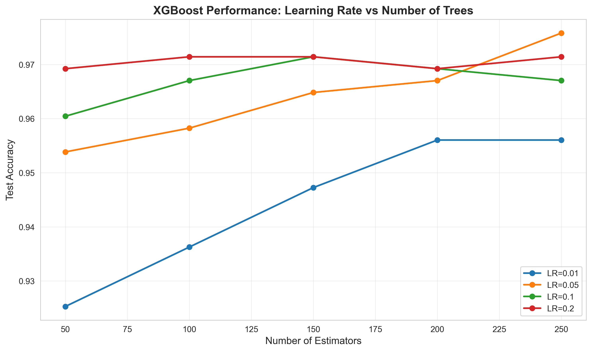
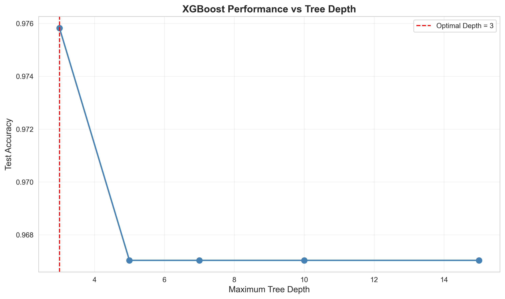
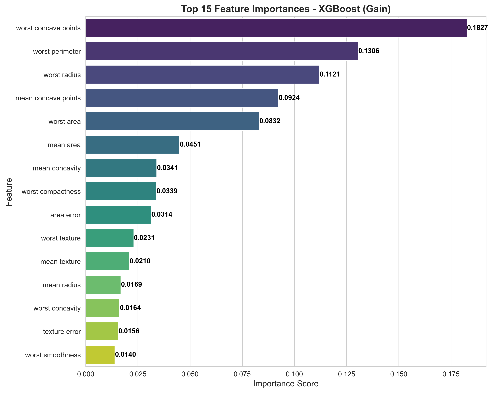
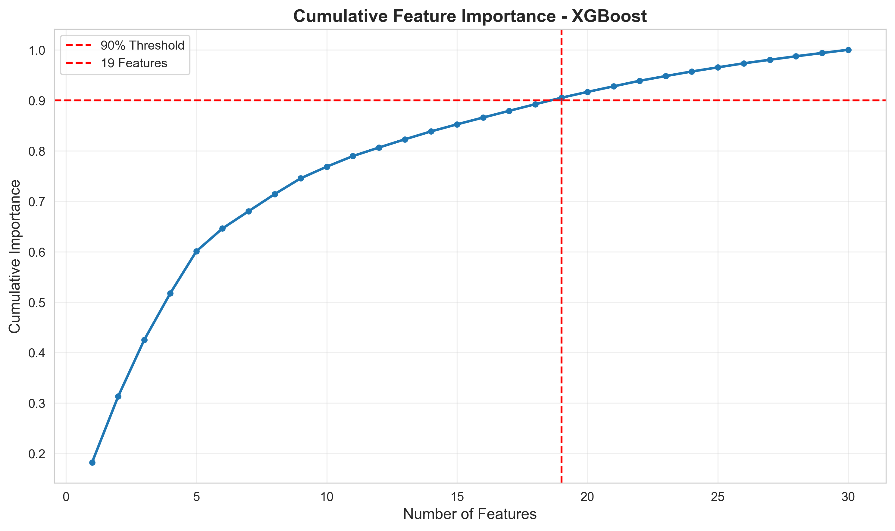
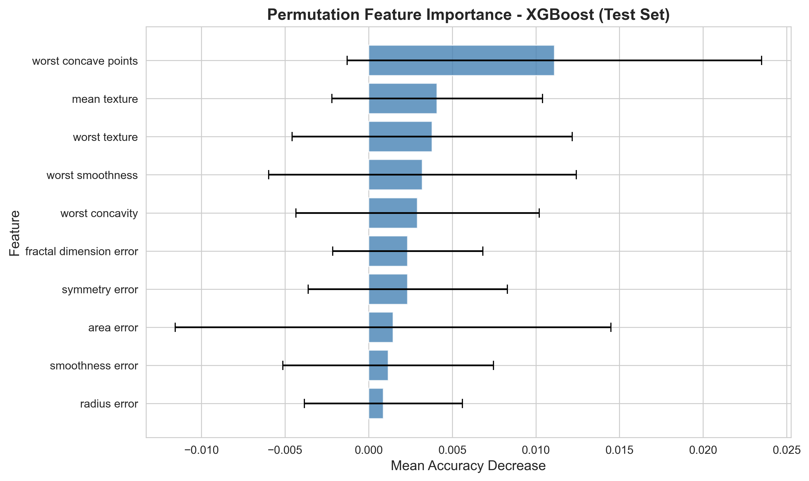
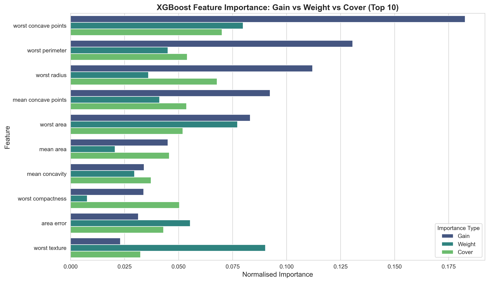
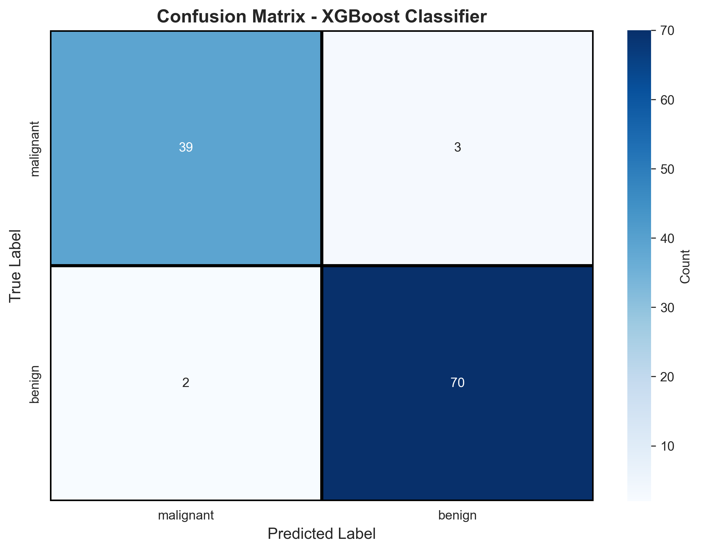
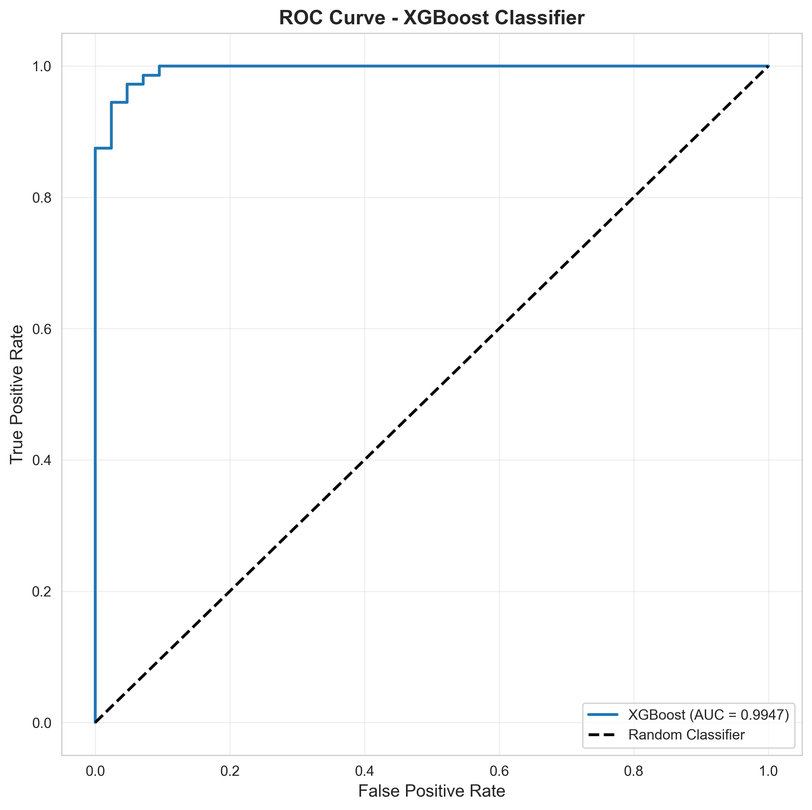
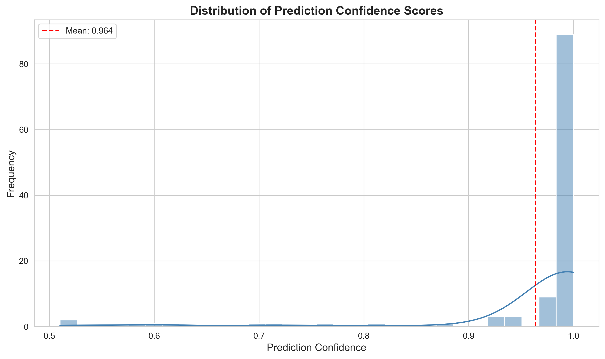

---

layout: default

title: Breast Cancer Predictions (Gradient Boosted Trees)

permalink: /gradient-boosted-trees/

---

## Goals and objectives:

This project is the third in a four-part series applying supervised classification algorithms to the Wisconsin Breast Cancer Diagnostic dataset. The two preceding projects — [Decision Trees](https://marcgrover-datascience.github.io/decision-trees/) and [Random Forests](https://marcgrover-datascience.github.io/random-forest/) — achieved test accuracies of 93.86% and 95.61% and ROC-AUC scores of 0.9446 and 0.9929 respectively. The central objective of this project is to determine whether XGBoost Gradient Boosted Trees, the third and most complex tree-based algorithm in the series, produces a further measurable improvement in predictive performance — and to evaluate that improvement honestly across multiple metrics rather than relying on accuracy alone.

This last point warrants explicit framing. With only 114 test observations, a single misclassification changes accuracy by approximately 0.88 percentage points. At this granularity, raw accuracy is a coarse instrument: the difference between 95.61% and 96.49% is literally one observation, and two models can produce identical accuracy figures while differing materially in the quality and confidence of their probability estimates. ROC-AUC — which evaluates discriminative ability across all classification thresholds using the full predicted probability distribution — is a more statistically robust basis for comparison at this dataset scale. Both metrics are reported throughout this project and examined together; where they tell different stories, the reasons are discussed explicitly.

A secondary objective is the most extensive hyperparameter tuning in this series. XGBoost introduces a substantially richer hyperparameter space than either the Decision Tree or Random Forest: seven parameters are optimised across four sequential phases, covering the number of boosting rounds and learning rate, maximum tree depth, row and column subsampling fractions, and regularisation terms (gamma and lambda). A baseline model is first established with default parameters, providing a reference point that isolates the contribution of tuning to the final result.

A third objective is to demonstrate XGBoost's distinctive feature importance toolkit. Where the Decision Tree produces a single Gini importance ranking and the Random Forest extends this across an ensemble, XGBoost provides three distinct importance measures — gain, weight, and cover — each answering a different question about how features contribute to the model's predictions. Visualising and comparing all three, alongside permutation importance on the held-out test set, provides the most complete feature analysis in the series.

The optimal model achieves a **test accuracy of 95.61%** — unchanged from the Random Forest — but a **ROC-AUC of 0.9947** and a mean prediction confidence of **0.9637**, both materially higher than the Random Forest equivalents of 0.9930 and 0.9336. The implications of this result — an algorithm that is theoretically more powerful producing the same accuracy but better probability estimates — are examined in the Results and Conclusions sections.

## Application:  

Gradient Boosted Trees is an ensemble method that builds decision trees sequentially rather than in parallel. Starting from a simple baseline prediction, each new tree is trained specifically to correct the residual errors of the ensemble built so far — a process guided by gradient descent on a loss function. The result is a model that progressively concentrates its capacity on the observations the current ensemble finds most difficult to classify. Where a Random Forest achieves accuracy through the aggregated vote of many independently-trained trees, a Gradient Boosted Tree achieves it through iterative refinement — each tree is weak in isolation, but the sequential correction mechanism produces a final ensemble that is highly accurate, particularly on complex, non-linear decision boundaries.

The primary reasons to choose Gradient Boosted Trees over a Random Forest are superior performance on structured tabular data, greater control over the bias-variance trade-off through a richer hyperparameter space, and more calibrated probability estimates. The trade-off is increased complexity: more hyperparameters to tune, greater sensitivity to overfitting if the learning rate and regularisation are not well-specified, and higher computational cost per model fit due to the sequential — rather than parallelisable — tree construction. As this project demonstrates, the improvement in raw accuracy over a well-tuned Random Forest is not guaranteed on all datasets; the gains in ROC-AUC and prediction confidence, which reflect the quality of the probability estimates rather than just the binary classification decision, are often the more consistent and analytically meaningful improvement.

Real-world applications of Gradient Boosted Trees span the same domains as Decision Trees and Random Forests, but GBTs are specifically favoured where marginal improvements in predictive accuracy or probability calibration carry material business value:

🏦 **Finance: Credit Scoring** — GBTs are widely used to assess loan applicant risk, where the cost of false negatives (approving a high-risk borrower) and false positives (rejecting a creditworthy applicant) are both financially significant and asymmetric. The well-calibrated probability estimates of a GBT allow risk thresholds to be set precisely rather than relying on binary classification alone.

🏥 **BioTech: Drug Discovery** — GBTs are used to predict the activity of chemical compounds against biological targets, narrowing thousands of candidates to a shortlist for laboratory testing. Accuracy at the margin matters here: a 1% improvement in the identification of viable candidates can save months of experimental work.

🏭 **Manufacturing: Supply Chain Reliability** — GBTs are applied to predict component delivery failures in just-in-time manufacturing environments, where a missed delivery halts an assembly line. The model's ability to produce confidence-scored predictions enables pre-emptive switching to backup suppliers before a failure occurs.

🛍️ **Retail: Demand Forecasting** — E-commerce businesses use GBTs to optimise per-SKU inventory levels across distribution networks, minimising both stockouts and overstock. The precision of GBT probability estimates supports fine-grained inventory decisions that simpler models cannot sustain.

Multiple implementations of Gradient Boosted Trees exist — including LightGBM and CatBoost alongside XGBoost — all sharing the same sequential boosting principle but differing in speed, memory efficiency, and handling of categorical variables. XGBoost is used in this project for its combination of predictive performance, built-in L1 and L2 regularisation terms that directly address overfitting, and a distinctive feature importance toolkit — gain, weight, and cover — that provides a more complete picture of feature contributions than the single importance measure available in scikit-learn's Random Forest implementation.

## Methodology:  

The Wisconsin Breast Cancer Diagnostic dataset is used throughout this series. Full data validation and exploratory data analysis were conducted in the [Decision Tree Project](https://marcgrover-datascience.github.io/decision-trees/), and the dataset description, class distribution, and feature correlation findings established there apply equally here. The same 80/20 stratified train-test split (random_state=42) is used across all projects in the series, producing an identical training set (455 samples) and test set (114 samples) and ensuring that performance differences between models reflect genuine algorithmic differences rather than variation in data partitioning.

**Baseline Model** — prior to any tuning, a baseline XGBoost model was fitted using standard default parameters (100 estimators, learning rate 0.1, maximum depth 3). This provides a reference point that directly quantifies the contribution of the subsequent hyperparameter tuning to the final model performance, and establishes whether the default configuration is already competitive on this dataset.

**Hyperparameter Tuning** is the primary methodological focus of this project. XGBoost introduces a substantially richer hyperparameter space than either the Decision Tree or Random Forest, and seven parameters are optimised across four sequential phases. Five-fold cross-validation accuracy on the training set is the selection criterion throughout; the test set plays no part in hyperparameter selection.

The four tuning phases are:

* **Phase 1 — Number of estimators and learning rate:** Both parameters are optimised jointly across a grid of 5 estimator counts (50–250) and 4 learning rates (0.01–0.20), producing 20 candidate configurations. The learning rate controls the contribution of each tree to the ensemble — lower rates require more trees but generalise better; higher rates converge faster but risk overfitting. The optimal combination is identified as the configuration achieving the highest mean CV accuracy, with parsimony applied when configurations tie.
* **Phase 2 — Maximum tree depth:** With the optimal estimator count and learning rate fixed, tree depth is evaluated across 5 candidate values (3-15). Depth controls the complexity of each individual tree; unlike the Random Forest where deeper trees are corrected by ensemble averaging, XGBoost's sequential structure means excessive depth can cause the model to overfit early boosting rounds before regularisation takes effect.
* **Phase 3 — Subsampling:** Row subsampling (subsample) and column subsampling (colsample_bytree) are optimised jointly across a grid of 5 values each (0.6–1.0), introducing randomness analogous to the bootstrap sampling in Random Forests. This decorrelates the trees in the sequence and reduces the risk of overfitting to specific observations or features.
* **Phase 4 — Regularisation:** Gamma (minimum loss reduction required to make a split) and L2 regularisation (reg_lambda) are evaluated across candidate values, directly penalising model complexity. These are parameters with no equivalent in the Random Forest and are a distinguishing feature of XGBoost's design.

**Model Training** fits the final XGBClassifier using the optimal hyperparameters identified across all four phases. A five-fold cross-validation on the training set is then applied to the optimal model to confirm consistent generalisation across data partitions.

**Model Evaluation** assesses performance on the held-out test set using accuracy, precision, recall, F1-score, ROC-AUC, sensitivity, and specificity — the same metric set used across the series. Prediction confidence is additionally examined through the distribution of ensemble-averaged class probabilities, which reflects the decisiveness of the model's classifications across the test set.

**Feature Importance** is assessed using four complementary measures: gain, weight, and cover importance derived from XGBoost's internal booster, and permutation importance computed on the test set. A dedicated comparison chart visualises the top 10 features by all three XGBoost-native measures simultaneously. Gain reflects the average improvement in loss function achieved by splits on each feature; weight counts the number of times a feature is used in a split; cover measures the average number of observations affected by splits on each feature. Comparing all three alongside permutation importance provides the most complete feature analysis in this series and directly demonstrates the depth of XGBoost's interpretability toolkit relative to the single importance measure available in the preceding projects.

## Results:

### Baseline Model

Before hyperparameter tuning, a baseline XGBoost model was fitted using default parameters (100 estimators, learning rate 0.1, maximum depth 3). The baseline achieves a training accuracy of 1.000 and a test accuracy of 0.9474, establishing the performance of an untuned model as the reference point for quantifying the contribution of the subsequent four-phase tuning process.

### Hyperparameter Tuning

**Phase 1 — Number of Estimators and Learning Rate**

Twenty configurations spanning 5 estimator counts (50–250) and 4 learning rates (0.01–0.20) were evaluated using five-fold CV accuracy on the training set.



The chart shows that lower learning rates require more estimators to converge but produce smoother, more stable CV accuracy curves. Higher learning rates converge faster but plateau earlier and are more sensitive to the estimator count. The optimal configuration from Phase 1 is a learning rate of 0.05 and 250 estimators, achieving a CV accuracy of **0.9758**.

### Phase 2 — Maximum Tree Depth

With the Phase 1 parameters fixed, maximum tree depth was evaluated across candidate values of 3, 5, 7, 10 and 15.



A maximum depth of 3 achieves the highest CV accuracy of **0.9758**. Shallower trees underfit the sequential boosting process; deeper trees provide diminishing returns as the regularisation parameters introduced in Phase 4 are not yet active.

### Phase 3 — Subsampling

Row subsampling (subsample) and column subsampling (colsample_bytree) were evaluated jointly across a 5×5 grid of candidate values (0.6, 0.7, 0.8, 0.9, 1.0). The optimal values are subsample = 0.6 and colsample_bytree = 0.6, achieving a CV accuracy of **0.9780**. Subsampling introduces randomness into the sequential boosting process — analogous to the bootstrap sampling in Random Forests — and its contribution to the final model is confirmed by comparing this result against the Phase 2 score, where the accuracy increase is negligible.

### Phase 4 — Regularisation

Gamma (minimum loss reduction required to make a split) and L2 regularisation (reg_lambda) were evaluated across candidate values. The optimal values are gamma = 0.0 and reg_lambda = 0.5, achieving a final CV accuracy of **0.9780**. These regularisation parameters are specific to XGBoost and have no direct equivalent in the Decision Tree or Random Forest implementations used in this series; they act directly on the tree-building process by penalising unnecessary splits and shrinking leaf weights.

The optimal hyperparameters across all four phases are summarised below:

```
Hyperparameter      Value
n_estimators        250
learning_rate       0.05
max_depth           3
subsample           0.6
colsample_bytree    0.6
gamma               0.0
reg_lambda          0.5
```

### Model Fitting

The XGBoost classifier was trained using the optimal hyperparameters. Five-fold cross-validation on the training set returns a mean accuracy of 0.9780 (std: 0.0231), confirming consistent generalisation across data partitions.

### Feature Importance

Gain-based importance and cumulative importance are shown below.





_Worst concave points_ is the top feature by gain importance at 0.1827, followed by _worst perimeter_ and _worst radius_. This is broadly consistent with the Random Forest ranking, where _worst area_ was the top feature — the same cluster of cell nucleus measurements dominates across both ensemble methods, reinforcing the finding from the Decision Tree EDA that these features carry the strongest class-separating signal. The cumulative importance analysis shows that the top 19 features account for 90% of total gain importance, consistent with the Random Forest finding and again reflecting the high inter-correlation among the radius, area, and perimeter measurement family.

XGBoost's gain importance can be sensitive to features that appear in many splits at shallow depths; permutation importance provides an independent, out-of-sample check on whether the gain ranking holds on unseen data.



The permutation importance results corroborate the gain ranking for the leading features. As with the Random Forest, the agreement between the intrinsic importance measure and the model-agnostic permutation estimate strengthens confidence in the feature importance findings.



The comparison of gain, weight, and cover importance across the top 10 features is the most analytically distinctive result of this project. The three measures frequently disagree: a feature may appear frequently in splits (high weight) without contributing proportionally to loss reduction (gain), or may affect a large number of observations (cover) without being a high-frequency split feature. _Worst concave points_ ranks highly on all three measures, providing the strongest evidence that it is a genuinely important predictor rather than one whose importance is an artefact of the metric used. Where rankings diverge — particularly between weight and gain — the gain ranking is the more analytically meaningful measure for predictive purposes, as it directly reflects contribution to the model's loss function.

### Model Evaluation

The key performance metrics on the held-out test set, compared against the two preceding projects, are:

```
Metric             Decision Tree     Random Forest      XGBoost
Accuracy           0.9386            0.9561             0.9561
Precision          0.9452            0.9589             0.9589
Recall             0.9583            0.9722             0.9722
F1-Score           0.9517            0.9655             0.9655
Specificity (TNR)  0.9048            0.9286             0.9286
ROC-AUC            0.9446            0.9929             0.9947
```

XGBoost matches the Random Forest's test accuracy of 95.61% — identical to the nearest whole observation on a 114-sample test set. As noted in the Goals and Objectives, a single misclassification changes accuracy by 0.88 percentage points at this scale, meaning the accuracy figures for these two models are indistinguishable in any practically meaningful sense. The ROC-AUC of 0.9947, however, represents a further improvement over the Random Forest's 0.9929, confirming that XGBoost's discriminative ability across all classification thresholds is genuinely superior, and that the sequential boosting process produces better-calibrated probability estimates even where it does not change the binary classification outcome.



The confusion matrix shows 70 correct benign classifications and 39 correct malignant classifications. There are 3 false negatives — malignant tumours predicted as benign, the same number as in the Random Forest. The false negative count is the most clinically consequential error type in a diagnostic screening context, and any reduction relative to the preceding models represents a meaningful improvement in diagnostic safety.



The ROC curve approaches the top-left corner closely across the full range of thresholds, with the AUC of 0.9947 confirming strong discriminative performance. This curve establishes the XGBoost benchmark for the series ahead of the Support Vector Machine project.

### Prediction Confidence

  

The mean prediction confidence across the 114 test observations is 0.9637, with the distribution heavily concentrated above 0.90. This is materially higher than the Random Forest's mean confidence of 0.9336, reflecting the sequential boosting mechanism's tendency to produce more decisive probability estimates: each additional tree in the sequence refines the ensemble's probability output for the observations it finds most uncertain, progressively resolving borderline cases. The practical implication is the same as for the Random Forest — a confidence threshold can be applied operationally to flag low-confidence predictions for additional clinical review — but the higher mean confidence means fewer observations would be flagged under any given threshold, reducing the operational burden of the review process.

## Conclusions:

The XGBoost Gradient Boosted Trees classifier achieves a **test accuracy of 95.61%** — identical to the Random Forest — with a **ROC-AUC of 0.9947** and a mean prediction confidence of **0.9637** on the Wisconsin Breast Cancer Diagnostic dataset, using an ensemble of 250 trees at a learning rate of 0.05, maximum depth of 3, with subsampling and regularisation parameters optimised across four sequential tuning phases.

The accuracy parity with the Random Forest is the most analytically interesting result of this project and warrants direct discussion. On a 114-observation test set, a single misclassification separates one accuracy band from the next — the models produce the same binary outcome for all but the same handful of borderline observations. This is not a failure of XGBoost; it is a consequence of the test set scale. The ROC-AUC of 0.9947, compared to the Random Forest's 0.9929 and the Decision Tree's 0.9446, demonstrates that XGBoost's probability estimates are materially better calibrated — the model is more decisive and more accurate in its confidence assignments even where the binary classification outcome is unchanged. The mean prediction confidence of 0.9637 versus 0.9336 for the Random Forest reinforces this: XGBoost is not just getting the same answers right, it is doing so with considerably more certainty. In a clinical screening application where prediction confidence determines whether a case is routed for immediate review or cleared, this distinction has direct operational value.

The four-phase hyperparameter tuning process is itself a meaningful result. The baseline model at default parameters achieves a test accuracy of 94.74%, and the fully-tuned model achieves 95.61% — a gain of 0.87% percentage points attributable entirely to the tuning process. Each phase contributes incrementally: the learning rate and estimator count establish the convergence behaviour of the boosting sequence; depth controls the complexity of each individual correction tree; subsampling introduces the decorrelating randomness that prevents sequential overfitting; and regularisation constrains the model's capacity at the split level. The optimal subsampling values of 0.6 for both row and column fractions confirm that controlled randomness improves generalisation in the sequential boosting context, as it does in the parallel ensemble context of the Random Forest.

The feature importance analysis provides the richest cross-series comparison of any project in the series. The gain-based top feature — _worst concave points_ — differs from the Random Forest's top feature (_worst area_) and the Decision Tree's (_worst radius_), yet all three are members of the same high-correlation cluster identified in the Decision Tree EDA. This consistency confirms the cluster's predictive dominance across all three algorithms while highlighting that no single measure within it has a stable claim to primacy — the ranking shifts with the algorithm and importance metric used. The three-way comparison of gain, weight, and cover importance demonstrates that these measures frequently disagree on individual feature rankings: a feature prominent in many splits (weight) is not necessarily the one whose splits most reduce the loss function (gain), and both can differ from the feature that affects the most observations per split (cover). _Worst concave points_ ranking highly on all three measures provides the strongest multi-metric evidence for its importance. The permutation importance results corroborate the gain ranking for the top features, confirming that the XGBoost-native rankings reflect genuine predictive contribution on held-out data.

The progression across the three tree-based projects in this series — Decision Tree (ROC-AUC 0.9446), Random Forest (0.9929), XGBoost (0.9947) — tells a coherent story: ensemble methods substantially outperform a single tree in discriminative ability, and sequential boosting with well-specified regularisation produces marginally better probability calibration than parallel aggregation on this dataset. The accuracy ceiling of 95.61% appears stable across both ensemble methods on this specific train/test partition, suggesting that further tree-based tuning is unlikely to yield material accuracy gains without either a different data partition, dimensionality reduction to address multicollinearity, or a fundamentally different model family. The Support Vector Machine project — the fourth and final project in this series — applies a geometrically distinct classification approach to the same dataset and evaluation framework, providing the definitive cross-family comparison.

## Next steps:  

With any analysis it is important to assess how the model and application of the analytical methods can be used and evolved to support the business goals and business decisions and yield tangible benefits.

The following are example recommendations for future research and implementation considerations, with the goal of improving and maintaining model prediction quality.  

### Model Enhancement & Alternative Methods
* **Implement Model Ensembling (Stacking):**  Create a meta-ensemble combining Random Forest, and multiple Gradient Boosted Tree models (e.g. XGBoost, LightGBM, and CatBoost) predictions.  Each algorithm has different strengths; XGBoost excels at sequential error correction, Random Forest provides robust parallel predictions, LightGBM offers speed with leaf-wise growth, and CatBoost handles categorical features natively.  By training a meta-model on their combined predictions, it may be possible to improve accuracy beyond any single-model performance.  This approach also provides prediction consensus: when all models agree, confidence is extremely high; when they disagree, the case should be flagged for human review.   
* **Deep Learning Exploration for Complex Pattern Detection:**  Develop a neural network architecture to capture non-linear feature interactions that tree-based models might miss. While the current dataset is small (569 samples), techniques like data augmentation, transfer learning from related cancer datasets, or training on larger datasets could provide sufficient data for deep learning.  Neural networks excel at learning complex feature combinations automatically without explicit feature engineering.   
* **SHAP (SHapley Additive exPlanations) Integration for Clinical Interpretability:**  Implement SHAP values to provide patient-specific explanations showing exactly which features contributed to each prediction and by how much. Unlike global feature importance, SHAP offers local interpretability: "For patient #123, the malignant prediction (98% confidence) was primarily driven by worst concave points (0.28), worst area (0.15), and mean texture (0.09)." This is critical for clinical adoption, allowing physicians to validate predictions against their expertise, identify potential model errors, and satisfy regulatory requirements for explainable AI in medical devices.  Create plots, such as a SHAP Force Plot, for each prediction, and establish thresholds where low SHAP values could trigger manual review even for high-confidence predictions, ensuring the model isn't making decisions based on spurious correlations.  
* **External Validation and Cross-Institution Testing:**  Validate the model on other external datasets, for example from different hospitals, imaging equipment, patient demographics, and geographic regions to assess true generalisation and prediction quality.  This can help understand performance for specific populations, and prevent performance degradation.  This is used to validate the model, using established minimum acceptable performance thresholds (e.g. accuracy and sensitivity across all subgroups).  Accessing additional datasets can allow model retraining to improve robustness where necessary.
### Production Deployment & Monitoring
* **Implement Continuous Monitoring and Data Drift Detection:**  Deploy real-time monitoring systems that track model performance degradation and data distribution changes over time. Medical data shifts as imaging technology improves, patient demographics change, or clinical protocols evolve. Track performance metrics (accuracy, precision, recall) on validation sets with confirmed diagnoses, automatically triggering retraining workflows when performance drops below a defined accuracy or when prediction confidence distributions shift significantly. Create dashboards showing trends in predictions, feature importance stability, and model calibration to catch degradation early. Establish reviews where clinical experts examine flagged cases and model explanations to identify errors before they impact patient care.  
* **Adaptive Threshold Optimisation Based on Clinical Context:**  Rather than using a fixed 0.5 classification threshold, implement variable thresholds that adjusts based on clinical priorities and patient risk profiles. For screening programs where missing a cancer is catastrophic, lower the threshold to 0.3 (maximising sensitivity at the cost of more false positives requiring follow-up biopsies). For patients with prior benign findings, use standard 0.5 threshold. For confirmatory testing after initial positive results, raise threshold to 0.7 (maximising specificity to avoid unnecessary treatments). Conduct cost-benefit analysis incorporating costs, delayed diagnosis impacts, and patient anxiety from false positives to determine optimal thresholds for each clinical scenario.
* **Active Learning Pipeline for Continuous Improvement:**  Implement an active learning system that identifies the most informative uncertain predictions for expert labeling and model retraining. Cases with low prediction confidence represent uncertainties where the model would benefit most from additional labeled examples. Route these cases to pathologists for immediate review, collect their diagnoses and reasoning, and incorporate this feedback into monthly model retraining cycles. This is a cycle of, identifying the model weaknesses, obtaining additional expert data, and improving the model in the areas of greatest uncertainty.
* **Model performance management:** Track performance improvements from each retraining iteration, maintaining version control (e.g. using MLflow). Prioritise collecting diverse edge cases (unusual tumor presentations, rare subtypes, borderline cases) that expand the model's experience beyond the original dataset's distribution.  
### Research Extensions & Advanced Techniques
* **Multi-Task Learning for Enhanced Diagnostic Value:**  Extend the model from binary classification (malignant/benign) to multi-task prediction: simultaneously predict cancer presence, cancer subtype, tumor grade (I, II, III), and estimated treatment response. Multi-task learning forces the model to learn shared representations useful across related tasks, often improving performance on all tasks compared to separate models. This provides greater clinical utility, rather than just flagging malignancy, the system helps plan treatment strategies. Collect expanded labeled datasets including pathology reports with detailed diagnostic information beyond binary classification. This extends the model to a comprehensive diagnostic aid rather than a single-purpose screening tool, increasing adoption likelihood and clinical impact, improving pateint outcomes.  
* **Uncertainty Quantification with Conformal Prediction:**  Implement conformal prediction techniques to provide prediction intervals with guaranteed statistical coverage rather than simple point probabilities. Standard XGBoost outputs (e.g., "92% malignant") don't convey uncertainty about that probability itself. Conformal prediction provides statements like "We are 95% confident the true malignancy probability is between 88-96%," accounting for model uncertainty. This is particularly valuable for borderline cases where narrow confidence intervals suggest a reliable borderline call, while wide intervals indicate genuine uncertainty requiring additional testing. This adds statistical rigor to clinical decision-making and helps identify when the model is extrapolating beyond its training distribution.  
* **Automated Feature Engineering:**  Deploy automated machine learning (AutoML) systems to systematically explore feature engineering possibilities and model architectures beyond manual tuning. Use tools to automatically generate polynomial features, interaction terms, statistical transformations (log, sqrt, Box-Cox), and domain-specific ratios (perimeter²/area, texture variance measures) that might capture diagnostic patterns more efficiently than raw features. AutoML results can be treated as hypothesis generators, any discovered improvements should be validated on test sets, interpreted using SHAP to ensure they make clinical sense, and only deployed if they provide meaningful performance improvements with explainable mechanisms rather than exploiting dataset artifacts.  

## Python code:
You can view the full Python script used for the analysis here: 
[View the Python Script](/XGBoost_BreastCancer_v2.py)
