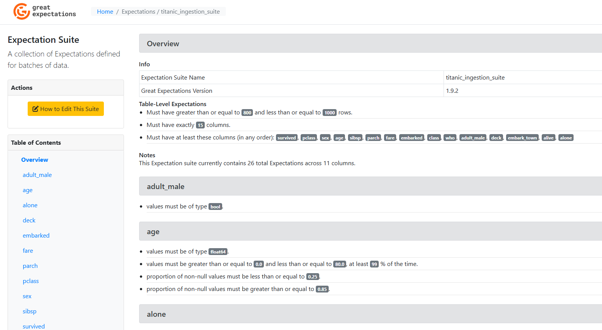
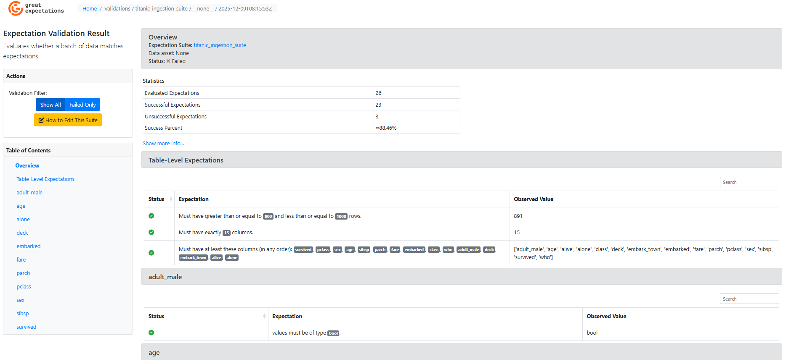
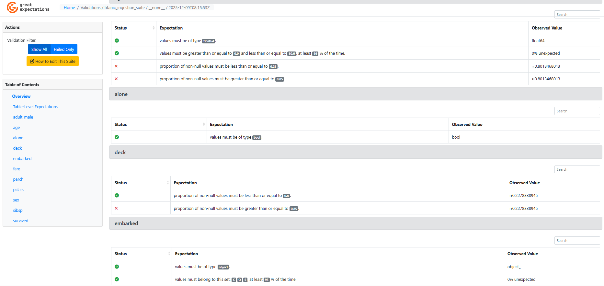

---

layout: default

title: Data Ingestion Validation (Great Expectations)

permalink: /great-expectations/

---

## Goals and objectives:

The business wishes to improve the validation and profiling of data within the whole data pipeline, to ensure quality of data outputs, and supporting the identification of issues within data at each step of the process.  A proof-of-concept is built to validate the data content and structure at the ingestion stage - equivalent validation could be included in every step of the data pipeline.

The Great Expectations (GX) library within python was used to create a set of structural and data validation criteria (expectations) on a test set of data, the commonly used Titanic dataset - available from the Seaborn package.

The suite of expectations was applied to the test data after it was ingested, with the results documented and presented in static HTML pages in an easy to understand format.

## About Great Expectations:

Great Expectations provides a robust framework for data validation, data profiling, and data documentation. It allows data teams to define and manage explicit, declarative assertions about the acceptable state of their data, which are called Expectations.  It can be used for both data content validation and data structure (schema) validation, two critical dimensions of data quality.

Data structure validation examples include; column names, data types, column presence.

Data content validation examples include; completeness, data range, uniqueness, consistency across fields.

The primary purpose of Great Expectations is to ensure data quality and build trust in data assets throughout the data lifecycle, from ingestion to final analysis.  As such it can be implemented in different steps in the lifecycle, often in multiple steps within the same pipeline.  Example uses within the data pipeline include:

* **Ingestion (Extract/Load):** Checking the integrity of raw data immediately after it is extracted from a source. For example, ensuring the schema is correct, no critical columns are missing, and no unexpected data types appear.
* **Transformation (Transform):** Validating the data after key transformation steps to ensure the logic was applied correctly. For instance, checking that aggregated columns fall within a calculated range or that joins did not introduce nulls in key fields.
* **Data Publication:** Performing a final validation check on the data before it is made available to data consumers (internal, external or other data processed). This is the final quality gate to prevent bad data from reaching production systems, or next steps in the pipeline.
* **Exploratory Data Analysis (EDA) and Profiling:** Great Expectations plays a role in the EDA process by automating the discovery of data properties.  Automated profiling enables quick identification of data characteristics like column types, min/max values, unique values, and non-null ratios.

### Key Benefits:  

Advantages of using Great Expectations include:

* **Automated Data Quality:** Automated data validation against business logic and quality standards, significantly reducing manual effort and error risk. 
* **Data Structure (Schema) Validation** - This type of validation focuses on the form and metadata of your data. It ensures that the data is organized exactly as expected, which is crucial for downstream systems and models that rely on a fixed schema. 
* **Prevents Downstream Errors:** By validating data early in the pipeline (e.g. data ingestion), it helps catch issues quickly before bad data can corrupt production systems, models, or reports.  
* **Living Documentation:** Automatically generated Data Docs serve as a continuously updated source of truth, documenting both the expected state of the data and the observed results from recent validation runs.  
* **Integration Flexibility:** It integrates easily with popular data environments like Pandas, Spark, SQL databases, and workflow orchestrators.  

### Key Uses and Functionality:

* **Data Validation:** It checks data against a defined set of Expectations (rules) and provides clear Validation Results showing whether the data passes or fails. It can also return unexpected values for quick debugging.  
* **Expectation Suites:** A collection of related Expectations, which can be easily reused and applied across different data batches or pipelines.  
* **Data Profiling:** Great Expectations can automatically profile a dataset to infer basic statistics and suggest an initial set of Expectations based on the observed data.  
* **Data Documentation:** It automatically generates human-readable, interactive Data Docs (HTML pages) from Expectations and Validation Results.  

### Visualisation and Sharing of Output

The primary way Great Expectations visualises and shares its output is through Data Docs.  This supports the single source of the truth for data quality.  These can be hosted locally or via cloud storage, and accessible via a web browser for all team members.  Trigger notifications can be defined to email results, such as abnormal findings.

Data Docs are a set of static HTML pages that are automatically generated by the library. These include:

* A clear description of the data quality rules defined.
* Validation results showing which Expectations passed and which failed, along with detailed statistics and any unexpected values.
* Data Profiling Results, containing descriptive statistics for the dataset, often included in the overview.

## Application:  

Great Expectations is widely used across industries to standardize data quality processes and prevent "silent data errors" (data issues that don't cause a pipeline to fail but lead to incorrect results).  

* Finance - Validating market data freshness (e.g., ensuring stock prices are no older than a specified time) for trading models. Checking the integrity and completeness of customer transaction records or loan application data. Ensuring regulatory compliance by validating data against strict schema and value constraints.  
* Retail - Ensuring inventory accuracy by validating that product codes, prices, and stock counts fall within expected ranges and formats. Validating customer purchase data for uniqueness, non-null values, and correct data types before running personalized marketing or sales analytics.  
* Manufacturing	Validating the freshness and integrity of IoT sensor data from production lines for predictive maintenance (e.g., ensuring temperature readings are within a safe operating range and are arriving consistently). Checking the schema and completeness of quality control and defect logs.  
* Technology - Validating user event logs for correct structure and required fields before feeding them into analytics platforms. Ensuring model input data for Machine Learning pipelines meets required statistical distributions and schema before training or inference. Validating data consistency across microservices and data warehouses.

## Methodology:  

The data ingestion validation tool was built using the recommended Great Expectations workflow:

* Loading the source data
* Initialising the GX data context (connecting the ingested data into the GX environment)
* Define a suite of expectations relevant to the ingestion stage
* Builds the connection of the validations to a Checkpoint, and updates the results database (Data Doc)
* Generate the static HTML documents

The suite of data ingestion validations included:
* Structural Validation
  * Row count
  * Column count
  * Column names
* Data Validation
  * Data types
  * Null values
  * Categorical values in a defined set
  * Numerical values in a defined range
 
## Results and conclusions:

The proof-of-concept accurately validated and reported the ingested data as required, based on the the defined validations, providing the business the required understanding of the data.  The conclusions of the proof-of-concept performance and research into GX include:

* GX provides flexibility to define the required business validations for both data structure and data content
* The validation results are recorded automatically and presented in a clear and complete manner
* The validation performs to the required speed and with the resources avaialble
* The capability can be deployed in any step of the data pipeline
* The capability can be utilised in enterprise grade solutions, and compatible with cloud services and solutions.

The HTML pages show the set of validation expectations tested against, as well as the results of applying these to the ingested data.

## Next steps:  

Recommended next steps include:
* Transitioning to a validation solution within a production pipeline
* Integrate GX with orchestration tools to automate validating and profiling within a production pipeline
* Developing validations for other steps within the pipeline
* Publishing the Data Docs data and HTML outputs to an organisational platform for consumption within the business
* Export GX results into monitoring tools for tracking and merging with other performance data

## Python code:
You can view the full Python script used for the analysis here: 
[View the Python Script](/Great_Expectations_v4.py)
