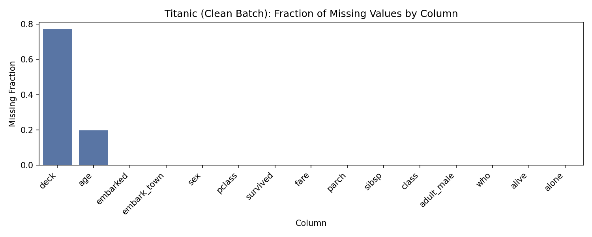
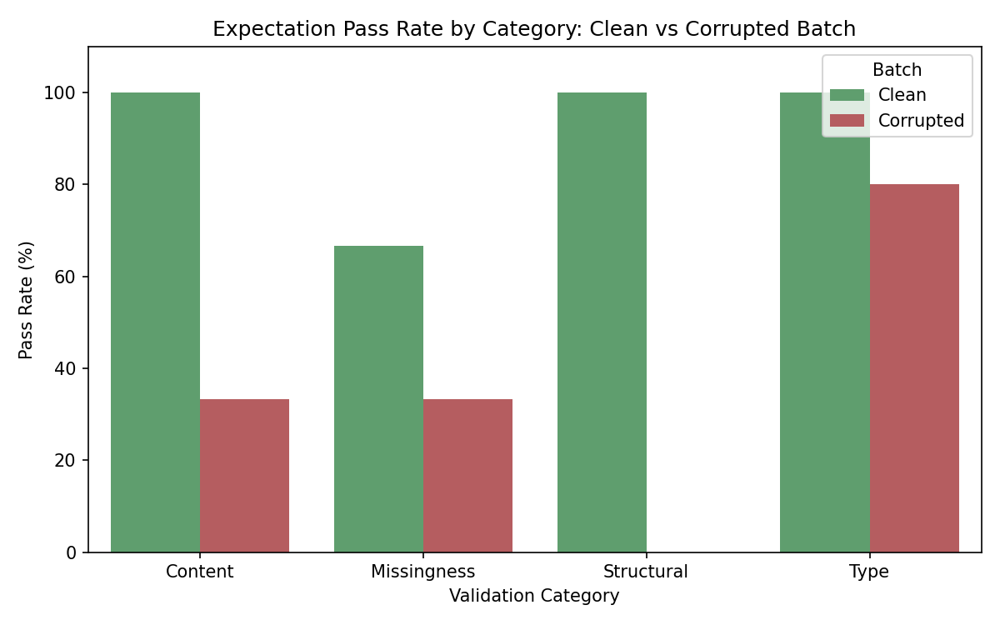

---

layout: default

title: Data Ingestion Validation (Great Expectations)

permalink: /great-expectations/

---

## Goals and objectives:

For this portfolio project, the business scenario concerns the detection of realistic data quality problems at the ingestion stage of a data pipeline, using the Titanic dataset (available from the Seaborn package) as a representative test case. The objective is to determine whether a declarative validation suite, written once against known-good data, can reliably detect ingestion-stage corruption across structural, type, content, and missingness dimensions — and to demonstrate concretely what that detection looks like in practice, rather than simply confirming that a clean dataset passes its own validation rules.

Great Expectations (GX) is the appropriate tool for this problem because it allows validation logic to be defined declaratively, once, and then applied consistently and repeatedly to any batch of data that flows through a pipeline. Rather than writing bespoke `if` statements scattered through ingestion code, a suite of Expectations is defined centrally and can be reused across every batch, every environment, and every run — producing both a pass/fail verdict and a human-readable audit trail (Data Docs) automatically.

A key design decision in this analysis is the construction of two data batches rather than one. The first is the unmodified Titanic dataset, used to confirm the suite is correctly specified against data known to be clean. The second is a deliberately corrupted variant of the same dataset, with eight realistic flaws injected — invalid ages, extreme fare outliers, non-standard categorical codes, additional missing values, a type-drifted column, nulls in the target field, duplicate rows, and an entirely dropped column. Critically, the identical suite — with no rules loosened or tightened — is applied to both batches. This design choice exists because validating only a clean dataset proves nothing: any dataset that already conforms to its own rules will pass them. The value of a validation suite is only demonstrated when it is shown to catch the kinds of problems that genuinely occur in production pipelines — a partial extraction failure, a schema change at source, a retried batch that duplicates records — and this project is structured specifically to provide that evidence.

A secondary objective is to ensure that every threshold used in the suite is derived from the observed characteristics of the data rather than chosen arbitrarily. Null-tolerance thresholds, numeric ranges, and categorical value sets are each set with explicit reference to the exploratory analysis conducted on the clean batch, rather than round numbers selected without justification.

By the end of the analysis, the project aims to demonstrate not only the correct implementation of a Great Expectations validation suite, but also the analytical discipline to test that suite against realistic failure modes, the judgement to derive thresholds from observed data rather than convention, and the ability to interpret and communicate validation results — including, where relevant, the suite's own blind spots — clearly to technical and non-technical audiences alike.

## Application:

Great Expectations is a data quality framework used to define, run, and document explicit, declarative assertions — Expectations — about the acceptable state of a dataset. It supports both data structure (schema) validation and data content validation, and is most commonly deployed at one or more stages of a data pipeline: ingestion, post-transformation, and pre-publication.

This approach is applicable across many sectors and scenarios. Practical examples showing where data validation provides clear business value include:

🏦 **Finance**: A trading firm validates that incoming market data feeds contain prices within plausible bounds and arrive without gaps, before those feeds are used by automated trading models.

🛍️ **Retail**: An e-commerce platform validates that incoming product catalogue updates contain valid price ranges, non-null SKUs, and correctly typed stock counts before they reach the live storefront.

🏭 **Manufacturing**: A production line validates that incoming IoT sensor readings fall within safe operating ranges and arrive at the expected frequency, flagging silent sensor failures before they propagate into a predictive maintenance model.

💻 **Technology**: An analytics team validates that incoming user event logs conform to an expected schema before they are loaded into a warehouse, preventing a silent upstream schema change from corrupting downstream dashboards.

## Methodology:

The methodology adopted for this project follows an extension of the standard data science workflow: data loading, exploratory analysis, suite definition, and validation — but applied twice, once to a clean batch and once to a deliberately corrupted batch, in order to generate a genuine before/after comparison. The project is implemented in Python, using pandas for data manipulation, Great Expectations (v1.18) for validation, and seaborn and matplotlib for visualisation. Each stage of the pipeline is described below.

### Data Loading

The clean batch is loaded directly from Seaborn's built-in Titanic dataset (891 rows, 15 columns). String-typed columns are explicitly cast to a consistent dtype immediately after loading, since the exact pandas-internal representation of string columns can vary between pandas versions — a detail that matters because one of the suite's expectations checks column dtype directly.

### Exploratory Analysis — Deriving Validation Thresholds

Before any threshold is set in the expectation suite, the clean batch is profiled to establish what "normal" actually looks like. A missing-value chart by column shows that `age` is approximately 80% complete and `deck` is only approximately 23% complete — a finding that directly overturns an assumption present in an earlier version of this project, which had set a uniform 85% non-null threshold across both columns. That threshold would have caused the `deck` expectation to fail even on perfectly clean data, since the column is sparsely populated by nature. Age and fare distributions are also profiled to set the numeric range bounds used later in the suite, anchored to the observed minimum and maximum values rather than arbitrary figures.

### Constructing the Corrupted Batch

A second batch is built by applying eight independent, deliberate corruptions to a copy of the clean data, each one designed to trip a specific expectation in the suite:

1. Negative age values injected into ~8% of non-null age rows
2. Extreme fare outliers (in the thousands) injected into a small subset of rows
3. Non-standard sex codes (`"M"`/`"F"` in place of `"male"`/`"female"`) injected into ~5% of rows
4. Additional nulls injected into `embarked`, simulating a partial extraction failure
5. `pclass` cast to a mixed string/object type, simulating schema drift at source
6. Nulls injected into `survived`, the target column
7. 150 duplicate rows appended, simulating a retried or replayed batch
8. The `deck` column dropped entirely, simulating a source system that silently stopped sending a field

Corruptions are applied only to rows that did not already hold a missing value for the relevant column, so that the resulting failure counts cleanly reflect the injected corruption rather than blending with the data's pre-existing missingness.

### Suite Definition and Validation

A single expectation suite of 19 expectations is defined, covering four categories: structural checks (row count, column count, column set), type checks, content checks (value sets and numeric ranges), and missingness checks. This suite is bound, unmodified, to both the clean batch and the corrupted batch as two separate Data Assets, and a Checkpoint is run against each. Results from both runs are written to a shared Data Docs site, and are also extracted programmatically into a structured comparison, since Data Docs alone shows pass/fail status but not the cross-batch pattern of detection that is the actual subject of this analysis.

## Results:

### Establishing thresholds from the data

The missing-value chart below confirms the basis for the suite's null-tolerance settings.

`deck` is missing in 77.2% of rows and `age` in 19.9% of rows; all other columns are effectively complete. This is the figure that exposed a genuine error carried over from an earlier version of this project: a non-null threshold of 85% had previously been set for `deck`, which — given that only ~23% of `deck` values exist in the unmodified data — would have caused that expectation to fail on every single clean run. The threshold used in the current suite (a minimum of 15% non-null) is instead set with direct reference to this chart.

### Validation outcome: clean batch

The clean batch passed all 19 expectations (100% success), confirming the suite is correctly specified against known-good data and contains no false positives.

### Validation outcome: corrupted batch

The corrupted batch failed 11 of 19 expectations (58% success). The chart below summarises the pass rate by validation category for both batches side by side.

Structural checks show the sharpest deterioration, falling from 100% to 0% — every structural expectation failed, since the corrupted batch simultaneously has the wrong row count (duplicated rows), the wrong column count, and a column set that no longer matches the expected schema (the dropped `deck` column). Content and Type checks each show a substantial but partial decline, consistent with corruptions that were deliberately scoped to a subset of rows rather than the whole dataset. Missingness checks show the smallest decline, for a reason discussed below.

The table below breaks out the specific failures, with the observed value or unexpected-percentage figure for each.

| Expectation | Column | Observed Result |
|---|---|---|
| `expect_column_proportion_of_non_null_values_to_be_between` | deck | Error: the column "deck" does not exist in the batch |
| `expect_table_row_count_to_be_between` | (table-level) | observed = 1,041 rows (expected 800–1,000) |
| `expect_table_column_count_to_equal` | (table-level) | observed = 14 columns (expected 15) |
| `expect_table_columns_to_match_set` | (table-level) | observed column set excludes `deck` |
| `expect_column_values_to_be_of_type` | survived | observed dtype = float64 (expected int64) |
| `expect_column_values_to_not_be_null` | survived | 9.7% unexpected (n = 101) |
| `expect_column_values_to_be_of_type` | pclass | 100.0% unexpected (n = 1,041) |
| `expect_column_values_to_be_in_set` | pclass | 30.5% unexpected (n = 317) |
| `expect_column_values_to_be_in_set` | sex | 4.8% unexpected (n = 50) |
| `expect_column_values_to_be_between` | age | 7.9% unexpected (n = 66) |
| `expect_column_values_to_be_between` | fare | 1.7% unexpected (n = 18) |

Two results in this table are particularly instructive beyond the headline pass/fail figures.

First, the `deck` non-null check does not fail cleanly — it raises an error, because the column it references no longer exists in the corrupted batch at all. This is a meaningfully different failure mode from a normal validation failure: a clean failure tells you *the data violates a rule*, while this error tells you *the data is missing something the suite assumes is present*. In a production setting, this distinction matters for triage — the second case typically indicates a schema change at source rather than a data quality issue within an existing field, and would usually warrant a different response (a pipeline alert vs. a data-cleansing step).

Second, the `pclass` type check fails at 100%, even though only 267 of 1,041 rows (25.6%) were actually altered to hold string values. This is because a pandas column has a single dtype for the entire Series — introducing even one mixed-type value coerces the whole column to the generic `object` dtype, so the dtype check fails for the column as a whole rather than in proportion to the number of corrupted cells. This is a useful and realistic illustration of why type checks behave differently from value-range or value-set checks: type violations are an all-or-nothing property of the column, not a proportional one.

### A genuine gap exposed by the audit

Despite injecting an additional 133 nulls into `embarked` (Corruption 4), the corresponding `expect_column_values_to_be_in_set` expectation for that column did not fail. This is not an oversight in the corruption design — it is a finding. The suite's `embarked` expectation checks only that *non-null* values fall within `{C, Q, S}`; it has no separate `expect_column_values_to_not_be_null` check for that column, unlike `survived`, `pclass`, and `sex`. Increasing the proportion of nulls in `embarked` therefore has no effect on this particular expectation, because nulls are simply excluded from the population being checked. This is a genuine coverage gap in the suite as currently defined, and is addressed directly in the Next Steps section below.

## Conclusions:

The central finding of this project is that an expectation suite written once against known-good data reliably detects realistic ingestion-stage corruption across every category it was designed to cover — structural, type, content, and missingness — falling from a 100% pass rate on the clean batch to 58% on the corrupted batch, with every individual failure attributable to a specific, identifiable injected flaw.

Equally important are the two findings that emerged only because the suite was tested against a flawed batch rather than a clean one. The discovery that a single mixed-type value coerces an entire pandas column's dtype, causing a type check to fail at 100% rather than in proportion to the actual corruption, is a concrete illustration of why type expectations behave fundamentally differently from value-level checks — a distinction that matters when interpreting validation failures in any real pipeline. The discovery that the `embarked` expectation has no explicit non-null check, and therefore cannot detect a rise in missingness for that column, is a genuine gap in the suite's coverage that would have gone unnoticed had the suite only ever been run against clean data. Both findings reinforce the same underlying principle: a validation suite's quality can only be properly assessed by testing it against failure, not merely confirming it agrees with success.

The decision to derive every threshold from the clean batch's actual observed characteristics — rather than round, unvalidated numbers — also proved its worth directly. The original `deck` non-null threshold of 85%, carried over from an earlier version of this analysis, would have failed on every clean run, since `deck` is genuinely only ~23% populated. Anchoring the threshold to the observed distribution instead avoids this category of error entirely, and the missingness chart that exposed it stands as a useful, low-cost validation habit it would be worth applying to every future suite.

## Next steps:

The most immediate extension is closing the `embarked` coverage gap identified above by adding an explicit `expect_column_values_to_not_be_null` check for that column, and then re-running the corrupted batch to confirm the previously undetected nullity increase is now caught. More broadly, this points to a useful general practice: every column with a value-set or range expectation should be paired with an explicit nullity expectation, since the two checks are not redundant — together they distinguish "is the value valid" from "is the value present" as conceptually separate failure modes.

A further extension is to apply the validation pattern demonstrated here beyond the ingestion stage. The same suite-against-two-batches structure could be repeated at the transformation stage (e.g. validating that an aggregation step has not introduced unexpected nulls or out-of-range values) and at the publication stage (a final quality gate before data reaches downstream consumers), building out the multi-stage validation pipeline described conceptually in the Application section above, but with the same evidence-based rigour demonstrated here.

A third extension is automated alerting. The current implementation runs validation and reports results within a single script execution; a production deployment would typically route a checkpoint's failure status to a notification channel (email, Slack, or a monitoring dashboard) automatically, removing the need for a human to inspect Data Docs manually after every run.

Finally, the type-coercion behaviour observed for `pclass` — where a single altered value silently changes the dtype of an entire pandas column — suggests a worthwhile defensive addition: validating dtypes immediately upon ingestion, before any further processing occurs, so that a type-drift issue is caught at the earliest possible point rather than propagating silently into a feature matrix or model input.

## Python code:
You can view the full Python script used for the analysis here: 
[View the Python Script](/Great_Expectations_v5.2.py)
