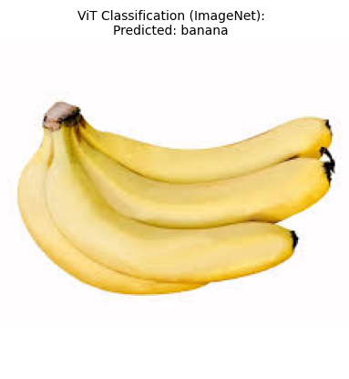
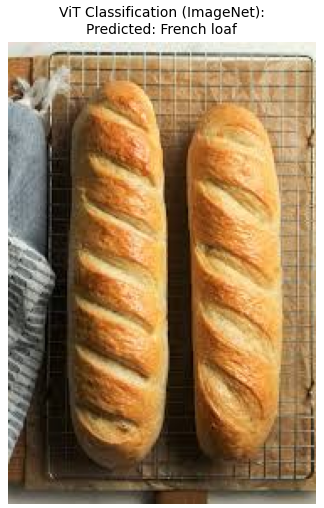

---

layout: default

title: Object Classification (Image Classification)

permalink: /image-classification/

---

#### This project is in development

## Goals and objectives:

The business objective is to automatically label images by applying a classification to each.  A proof-of-concept was built to demonstrate the capability, utilising existing image classification models, and existing images.

The result was an application that could accurately classify images without any fine-tuning or transfer learning of the model, which demonstrated the concept and the potential business application and benefits.

## Application:  

Image classification is one of the foundational applications of computer vision, enabling machines to understand and label the content of a visual scene. Its real-world applications are vast, driving automation and decision-making across almost every major sector.  

* **Manufacturing** - primarily used for quality assurance, reducing waste, and automating visual inspection tasks that are tedious or impossible for human eyes to sustain at high speed. Use cases include; defect detection,  quality control, competent sorting and safety compliance.  
* **Technology** - foundational to user interfaces, search engines, and advanced automated systems.  Examples include; Autonomous Vehicles, Image Search & Tagging, Facial Recognition, and Document Classification    
* **Science** - accelerates research, automates diagnostics, and allows for large-scale environmental monitoring.  Key areas of benefits include; Medical Diagnostics, Pathology & Histology, Agriculture (Crop Health), and Astronomy/Biology Research  
* **Retail** - generally focussed on optimising store operations, improving inventory accuracy, and enhancing the customer experience.  Use cases include; Shelf and Planogram Monitoring, Visual Search (E-commerce), Automated Checkout, and Fashion Analysis  

## Methodology:  

The Image Classification application uses the 'google/vit-base-patch16-224' model via Hugging Face, which is a popular Vision Transformer model pre-trained on 14 million images, with additional fine-tuning on a million images.  The Vision Transformer is a transformer encoder model based on the BERT architecture.

The application has a basic workflow.  A local image is referenced in the python code, which is then applied to the model, returning the single highest probability classification.  

The app is built so that it can easily be pointed to a library of images, rather than a single image and bulk classification can be applied.

Details of the methodology applied in the project.

## Results and conclusions:

Results from the project related to the business objective.

Each classification runs in 2 to 3 seconds, even using a CPU on a local machine.

### Conclusions:

Conclusions from the project findings and results.

## Next steps:  

With any analysis it is important to assess how the model and application of the analytical methods can be used and evolved to support the business goals and business decisions and yield tangible benefits.

* Classify a library of images
* Migrate to a server using a GPU or a cloud service for faster results
* Fine-tune the model using labelled images specific to the business scenario the application is being used for

## Python code:
You can view the full Python script used for the analysis here: 
[View the Python Script](/ImageClassification_v4.py)
