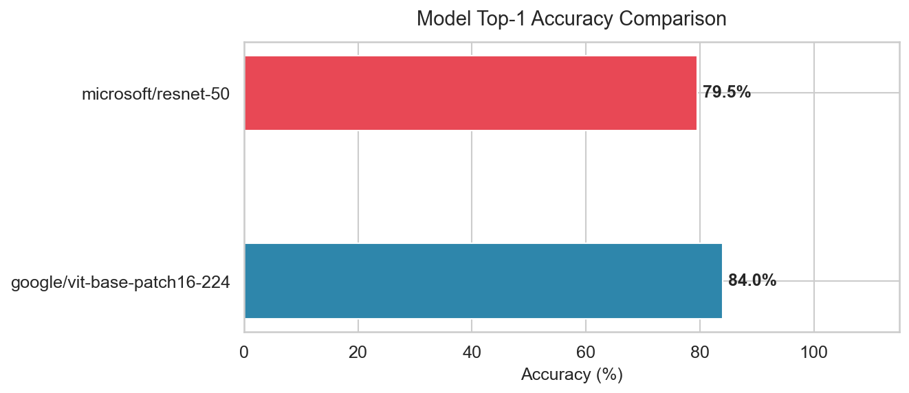
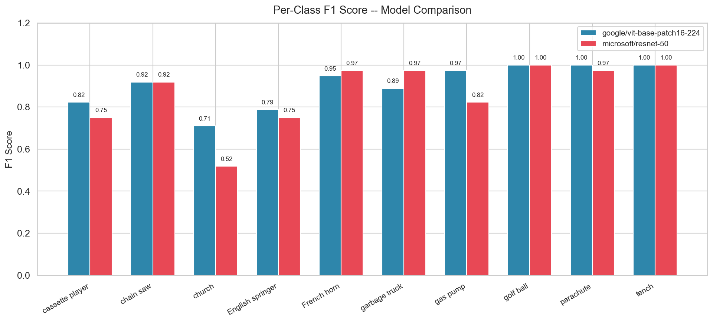
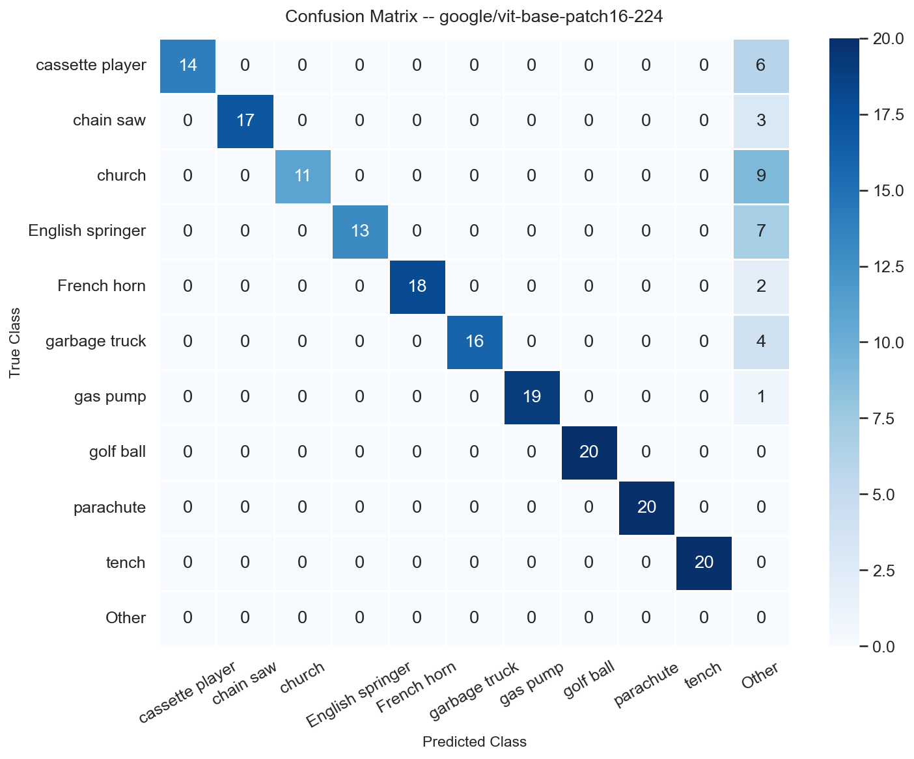
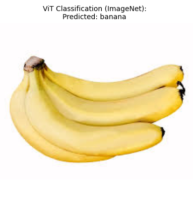
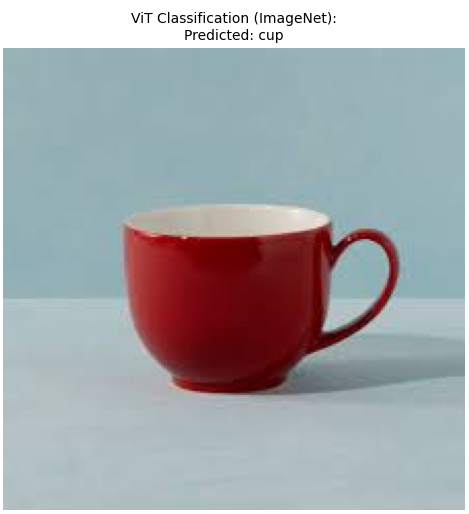
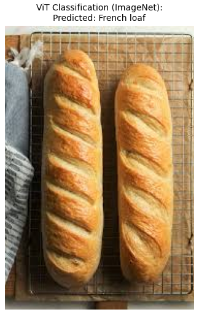
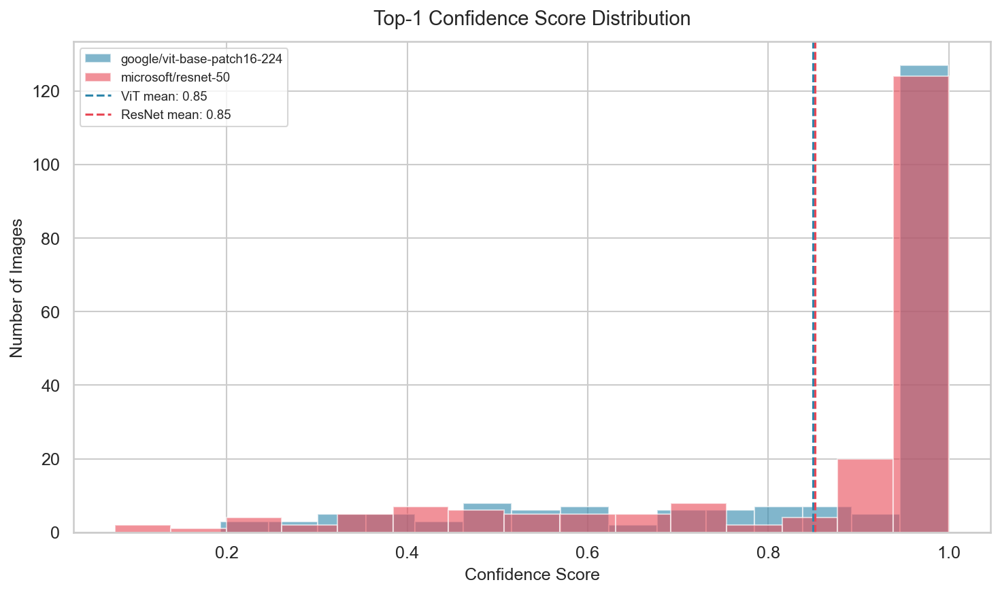
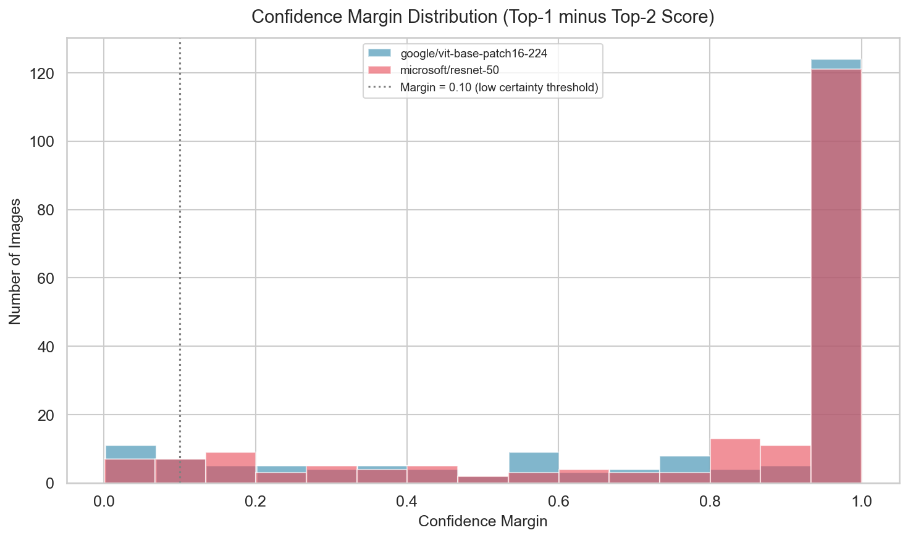

---

layout: default

title: Object Classification (Image Classification)

permalink: /image-classification/

---

## Goals and objectives:

The business objective is to automatically classify images, demonstrating how a pretrained, off-the-shelf model can label visual content accurately without any fine-tuning or transfer learning — directly informing decisions such as automated tagging, inventory categorisation, or content moderation, where building and labelling a custom training set from scratch would be costly and slow.

This is one of four projects in the Deep Learning & NLP category of the portfolio. Where the Zero-Shot Classification project compared two transformer-based language models on a text classification task, this project compares two image classification architectures — a Vision Transformer and a convolutional neural network — directly evaluated and benchmarked against each other on the same task, rather than presenting a single model's output as a final result.

As with the other projects in this category, given the absence of GPU compute, the analysis is deliberately scoped as a Proof of Concept: classification is rigorously evaluated against a labelled benchmark sample, rather than against an unverified, hand-picked set of test images, with the explicit expectation that the same pipeline is directly scalable to a larger image set or production dataset given suitable compute resources.

## Application:  

Image classification is one of the foundational tasks in computer vision: given an image, assign it to one of a fixed set of categories based on its visual content. Two broad families of architecture dominate modern image classification, and this project applies one of each.

Convolutional Neural Networks (CNNs), the older and more established of the two, process an image through a sequence of small filters ("convolutions") that slide across the image detecting local patterns — edges and textures in early layers, building up to more complex, recognisable features such as eyes, wheels, or windows in deeper layers. ResNet-50, the CNN used in this project, additionally uses "residual connections" that allow information to skip across layers, which made it practical to train much deeper networks than was previously possible.

Vision Transformers (ViT), the newer of the two, take a fundamentally different approach, adapting the transformer architecture originally developed for language — and used in the Zero-Shot Classification project — to images. Rather than sliding filters across the image, a ViT first splits the image into a grid of fixed-size patches (16x16 pixels in the model used here), flattens each patch into a vector, and treats the resulting sequence of patch vectors exactly like a sequence of word tokens in a language model, including a learned position embedding so the model retains information about where in the image each patch came from. The full sequence is then processed through a standard transformer encoder, allowing every patch to directly attend to every other patch in the image from the very first layer, rather than only seeing nearby pixels as a CNN's early layers do.

Both architectures used in this project were pretrained on ImageNet-1k, a benchmark dataset of approximately 1.3 million images across 1,000 categories, and are applied here with no further fine-tuning or transfer learning. Real-world applications of image classification are wide-ranging:

🏭 **Manufacturing**:

**Automated Visual Inspection**: Detecting defects, sorting components, and verifying assembly quality at production-line speed, for tasks too repetitive or fast-paced for sustained human visual inspection.

**Safety Compliance Monitoring**: Automatically verifying that personal protective equipment or safety procedures are being followed on a factory floor, directly from camera feeds.

💻 **Technology**:

**Autonomous Vehicles**: Classifying objects, signage, and road conditions in real time as a core input to self-driving systems.

**Image Search and Document Classification**: Automatically generating descriptive tags for uploaded images, and routing scanned documents to the correct category at scale.

🔬 **Science**:

**Medical Diagnostics**: Supporting radiologists and pathologists by flagging or pre-classifying scans and tissue samples for review, accelerating diagnosis.

**Agricultural Monitoring**: Assessing crop health and detecting disease from aerial or ground-level imagery across large areas of farmland.

🛍️ **Retail**:

**Visual Search**: Allowing customers to search a catalogue using a photograph rather than a text query.

**Automated Checkout**: Identifying items placed in a basket or on a conveyor without manual barcode scanning.

## Methodology:  

The methodology for this project is implemented as a single Python script (`ImageClassification_v4.py`), which downloads and prepares a labelled benchmark dataset, runs two pretrained image classification models against it, evaluates and compares both, and produces six diagnostic visualisations. The script uses PyTorch and Hugging Face Transformers for model inference, Pillow for image handling, and pandas/seaborn/matplotlib for analysis and visualisation. Unlike the Zero-Shot Classification project, no companion web application was built for this revision, as a live single-image demo was not part of the original business requirement; this is noted as a possible future extension in the Next Steps section.

**Data Source**:

The dataset used is Imagenette, a clean 10-class subset of the full ImageNet-1k benchmark, maintained by fast.ai. Unlike the original version of this project, which required manually sourcing and locally saving individual test images one at a time, Imagenette is auto-downloaded by the script on first run from a single public archive (no account or login required) and cached locally thereafter — the dataset only needs to be downloaded once, and every subsequent run uses the cached copy.

**Ground Truth Construction**:

Each of Imagenette's 10 class folders is named after its original ImageNet synset ID, which maps directly and unambiguously to one specific index in the 1,000-class output space both pretrained models already classify over. This gives an exact ground truth requiring no fuzzy keyword-mapping step, in contrast to the genre-tag mapping required for the Zero-Shot Classification project. As a precaution, both models' label text for a known index is printed and compared at the start of the script, confirming both share the same underlying class ordering before any evaluation is performed.

**Sampling**:

A balanced random sample of 20 images per class (200 images total) is drawn from Imagenette's validation split — the held-out images, distinct from any used to originally train either model — using a fixed random seed for reproducibility.

**Model Comparison**:

Two pretrained models, both trained directly on ImageNet-1k with no further fine-tuning, are run on the identical sample for direct comparison: `google/vit-base-patch16-224`, a Vision Transformer, and `microsoft/resnet-50`, a convolutional neural network. This is a genuine architectural comparison — unlike the two models compared in the Zero-Shot Classification project, which were variants of the same underlying NLI mechanism, ViT and ResNet-50 represent fundamentally different approaches to the same task, as set out in the Application section above.

**Evaluation Metrics**:

Both models are evaluated using top-1 accuracy as the primary metric, alongside a full per-class classification report (precision, recall, F1-score) and a confusion matrix. Top-5 accuracy is also recorded as a secondary check, but is not treated as a headline metric: Imagenette's 10 classes were deliberately selected by its creators to be easily distinguishable from one another, so top-5 accuracy is expected to be uninformatively high regardless of underlying model quality — a different consideration from the standard 1,000-class ImageNet benchmark, where top-5 accuracy is genuinely meaningful.

**"Other" Prediction Analysis**:

Unlike the candidate label set used in the Zero-Shot Classification project, neither model here is restricted to choosing among the 10 Imagenette classes — both classify freely across the full 1,000-class ImageNet-1k output space. An incorrect prediction can therefore land on any of the other 990 classes, not only on one of the 9 other Imagenette categories. To capture this, every prediction's exact verbatim label text is retained, and predictions falling outside the 10 known classes are explicitly separated from genuine cross-confusion between two Imagenette categories. For the weakest-performing class for each model, the specific alternative labels predicted instead are reported directly, giving a concrete, named explanation for classification errors rather than an aggregate error rate alone.

**Confidence Score Analysis**:

As with the Zero-Shot Classification project, the full softmax probability distribution is retained for every image, from which the top-1 confidence score and the confidence margin — the gap between the top-ranked and second-ranked class — are derived.

## Results:

**Runtime**:

The first run, including a one-time ~99MB dataset download and the download of both models' weights, completed in approximately 5 minutes. A subsequent run, using the cached dataset and downloaded models, completed in 48.2 seconds — the great majority of which was model loading rather than classification itself: classifying the full 200-image sample took only 31.8 seconds for ViT and 11.6 seconds for ResNet-50. Both runs, using the same fixed random seed, produced identical accuracy results, confirming the pipeline is fully reproducible.  

**Model Accuracy Comparison**:

`google/vit-base-patch16-224` achieves a top-1 accuracy of 84.00% (top-5: 97.50%); `microsoft/resnet-50` achieves 79.50% (top-5: 95.50%) — a 4.5 percentage point advantage for ViT on this sample.

This comparison differs in character from the one in the Zero-Shot Classification project, where the relative ranking between models reversed repeatedly depending on the specific sample drawn. Because both models here are deterministic at inference time, rerunning this script with the same fixed seed reproduces the identical result exactly — but this reproducibility reflects measurement stability, not generalisability; a different random sample, or the full Imagenette validation set, could in principle show a different gap. The result should be read as a clean, well-evidenced measurement on this specific 200-image sample, not a definitive ranking of the two architectures in general.

**Per-Class Performance — A Strikingly Clean Pattern**:

The per-class breakdown reveals an unusually clean pattern: precision is exactly 1.00 for every one of the 10 classes, for both models. Neither model ever predicts one of the 10 Imagenette classes for an image that actually belongs to a different one of the 10 — all of the lost accuracy shows up entirely as reduced recall, never as cross-confusion.

This is corroborated directly by an explicit error breakdown built into the analysis: for both models, 100% of incorrect predictions fall outside the 10 known classes entirely, and 0% represent cross-confusion between two of the 10. This makes sense given that Imagenette's 10 classes were curated by their creators specifically to be maximally distinguishable from each other — but that curation says nothing about how distinguishable they are from the other 990 ImageNet classes a model can still freely choose between.

**Confusion Matrix and "Other" Predictions**:

Church is the weakest-performing class for both models (ViT recall 0.55; ResNet-50 recall 0.35), and the specific labels behind those errors are consistent and explainable: "monastery" is by far the most common alternative prediction for true church images, for both models (3 of 9 ViT errors; 8 of 13 ResNet-50 errors), with other architecturally adjacent labels such as "altar", "bell cote", and "vault" accounting for most of the remainder. Churches and monasteries share enough visual and structural similarity that confusing the two is a reasonable mistake for a model with no task-specific fine-tuning, not a sign of poor underlying model quality.

A second, distinct pattern emerged across both models' "Other" predictions more broadly: "cassette" and "tape player" appear repeatedly as alternatives to the target class "cassette player", and "German short-haired pointer" and "Welsh springer spaniel" appear as alternatives to "English springer". Both pairs are genuinely separate, very closely related categories within ImageNet-1k's own 1,000-class taxonomy — ImageNet famously subdivides dog breeds into well over 100 distinct classes, several of which are difficult even for a human to visually distinguish. This directly corroborates an observation made when reviewing the original version of this project: a sample image of a baguette was classified as "French loaf" rather than a more general "bread" category, because ImageNet-1k's taxonomy has no general bread category, only a small number of very specific ones. Across all three cases, the model is not making a content-level error so much as choosing a different, extremely similar label from an unevenly fine-grained category scheme — a structural characteristic of the ImageNet-1k taxonomy itself, rather than a model failure.

**Qualitative Examples**:

The three example classifications below illustrate this finding directly. The banana and cup images are classified correctly and without ambiguity — both are visually distinctive objects with no closely related competing class in ImageNet's taxonomy. The loaf of bread is classified as "French loaf" rather than a general "bread" category, for the same structural reason identified above: ImageNet-1k has no general bread class, only specific ones, of which "French loaf" is the closest visual match to a baguette.

  
  

**Confidence Score Analysis**:

Mean top-1 confidence is high and similar for both models (ViT 0.850; ResNet-50 0.852), and confidence margins below 0.10 are comparatively rare (7.0% for ViT; 5.5% for ResNet-50). This contrasts sharply with the Zero-Shot Classification project, where mean confidence sat around 0.40 and roughly 40% of classifications fell below the same 0.10 margin threshold. This difference is consistent with the underlying mechanism in each project: both ViT and ResNet-50 carry a classification head trained end-to-end directly on ImageNet-1k, producing well-calibrated, decisive outputs for genuinely visually distinctive content, whereas zero-shot classification repurposes a general-purpose language model with no task-specific training at all, and so behaves with far less certainty even on its correct predictions.

**Architecture Trade-off: Speed vs Accuracy**:

A clear computational trade-off was also observed: ResNet-50 classified the full 200-image sample in 11.6 seconds, compared to 31.8 seconds for ViT — roughly 2.7 times faster — while being 4.5 percentage points less accurate on this sample. For a production deployment prioritising throughput on CPU hardware, ResNet-50's lower compute cost may outweigh its modest accuracy disadvantage, depending on the specific business requirement.

## Conclusions:

This project demonstrates that two architecturally different, off-the-shelf pretrained models can both be deployed and rigorously evaluated for an image classification task with no fine-tuning, no GPU, and a runtime measured in seconds once the one-time dataset and model downloads are complete. Both models perform well on this benchmark, but the value of the project lies less in the headline accuracy figures than in what the detailed error analysis reveals about how, and why, each model gets things wrong.

The single most important structural finding is that 100% of both models' errors fall outside the 10 known target classes entirely, with zero genuine cross-confusion between any two of the 10. This is a direct consequence of how both models are deployed: unrestricted across the full 1,000-class ImageNet-1k space, rather than evaluated against a fixed candidate set as in the Zero-Shot Classification project. It means that error analysis for this kind of model needs to look outward, at what else the model considered, rather than only inward at confusion between the categories a business actually cares about.

That outward look produced the project's most useful finding: a recurring pattern of errors driven by ImageNet-1k's unevenly fine-grained taxonomy, not by genuine model confusion. Churches mistaken for monasteries, cassette players mistaken for cassettes or tape players, and English springers mistaken for closely related dog breeds are all the same phenomenon — the model choosing a different, very closely related label from a taxonomy that subdivides some concepts extremely finely (dog breeds; audio equipment) while leaving others comparatively coarse. This directly corroborates, with concrete repeated evidence, an observation first made informally when reviewing the original version of this project: a baguette classified as "French loaf" because no general "bread" category exists in ImageNet-1k's 1,000 classes. What began as a single anecdotal aside is now a demonstrated, named, and explained structural property of the underlying model.

The comparison between ViT and ResNet-50 favoured ViT by 4.5 percentage points on this sample, but this is reported as a measurement on a specific 200-image PoC sample rather than a general claim about either architecture, given that the result — while perfectly reproducible under the same fixed seed — has not been validated against a larger or differently-sampled dataset. A genuinely useful and well-evidenced trade-off was identified regardless of which model is more accurate: ResNet-50 classified the same sample roughly 2.7 times faster than ViT on CPU, a meaningful consideration for any deployment prioritising throughput over the last few points of accuracy.

The confidence and margin analysis also provides a useful cross-project contrast: both image classification models produced confident, decisively separated predictions (mean confidence ~0.85, low-margin rate under 10%), markedly different from the much less certain behaviour seen in the Zero-Shot Classification project (mean confidence ~0.40, low-margin rate around 40%). This is best explained by the presence or absence of a task-trained classification head — both models here were trained end-to-end on exactly this classification task, while zero-shot classification repurposes general language understanding with no task-specific training at all — and is a useful point of comparison across the Deep Learning & NLP category of the portfolio as a whole.

## Next steps:  

While this PoC met its objective of demonstrating and rigorously evaluating two pretrained image classification architectures, the findings above point to several concrete directions for further development.

**Scale to the Full Validation Set, or Beyond**: The measured runtime for this PoC — 43.4 seconds of combined classification time across both models for 200 images — shows that CPU compute is not a meaningful constraint for this task, unlike the much heavier per-record cost in the Zero-Shot Classification project. Running the same pipeline against Imagenette's full ~3,925-image validation split, or even the full 1,000-class, 50,000-image ImageNet-1k validation set, on the same CPU-only hardware would substantially firm up the accuracy figures reported here beyond a single 200-image sample.

**Fine-Tuning on a Business-Specific Label Set**: The "Other" prediction analysis shows both models are fundamentally constrained by ImageNet-1k's fixed, occasionally over-specific 1,000-class taxonomy. Fine-tuning a classification head on a labelled set of business-relevant categories would let a model collapse exactly the kinds of near-duplicate distinctions identified here — cassette player vs cassette vs tape player, or church vs monastery — where they aren't meaningful for the target use case, and add entirely new categories where they are.

**Label-Mapping Layer for Known ImageNet Granularity Issues**: As a lighter-weight alternative or complement to full fine-tuning, a simple post-processing lookup table could merge ImageNet's known near-duplicate classes — its 120-plus dog breed categories, or sibling classes such as cassette, cassette player, and tape player — into single, business-relevant labels, without requiring any model retraining at all.

**Migrate to GPU or Cloud Compute**: While this PoC's CPU-only runtime was far more practical than initially expected, a production deployment processing a continuous stream of images, or scaling well beyond a few hundred images per run, would still benefit from GPU acceleration or a managed cloud inference service.

**Transfer Learning for Domain-Specific Categories**: Rather than full fine-tuning, training only a new final classification layer on top of either pretrained model's existing features, using a modest labelled dataset specific to the target business domain, would let the model recognise entirely new categories outside ImageNet-1k's original 1,000, at a fraction of the cost of training from scratch.

**Live Image Upload Demo**: The Zero-Shot Classification project's companion Gradio application allows live, single-item classification; an equivalent image-upload interface for this project — letting a user submit a photograph directly rather than drawing from a pre-downloaded benchmark — was considered but kept out of scope for this revision, and remains a natural extension if a live demonstration becomes a requirement.

## Python code:
You can view the full Python script used for the analysis here: 
[View the Python Script](/ImageClassification_v6.py)
