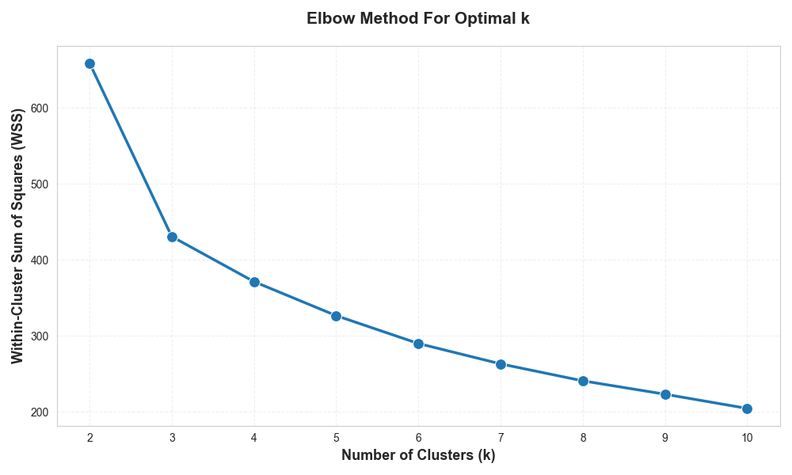
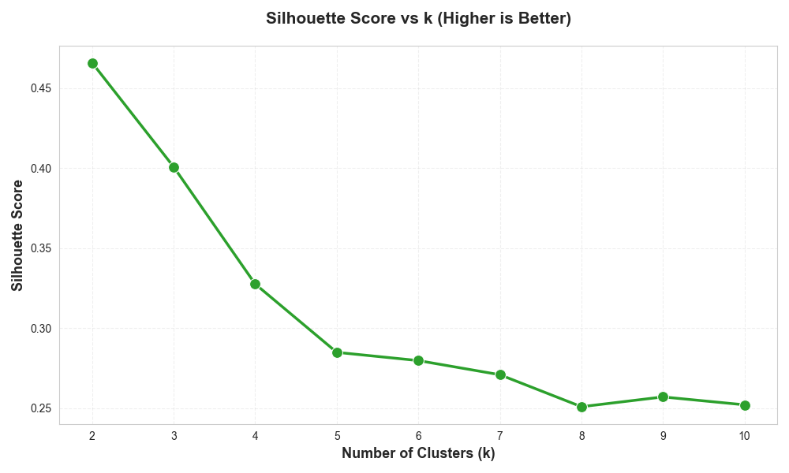
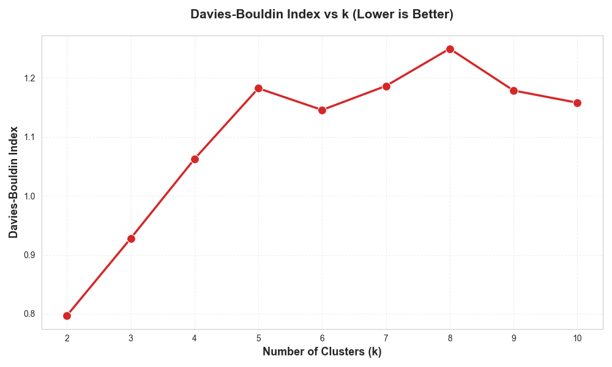
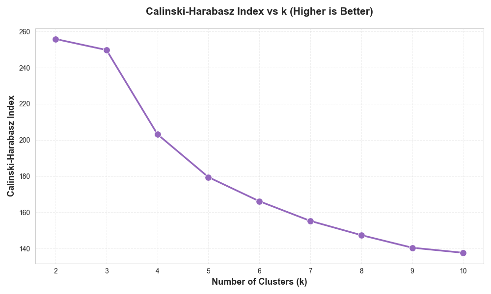
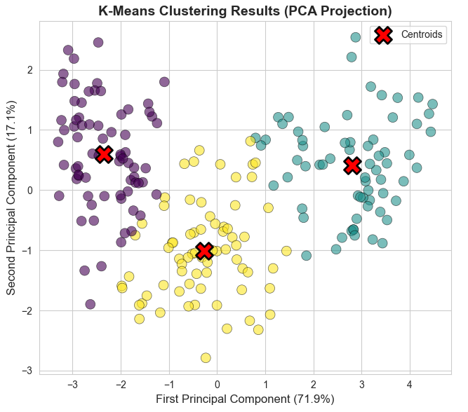
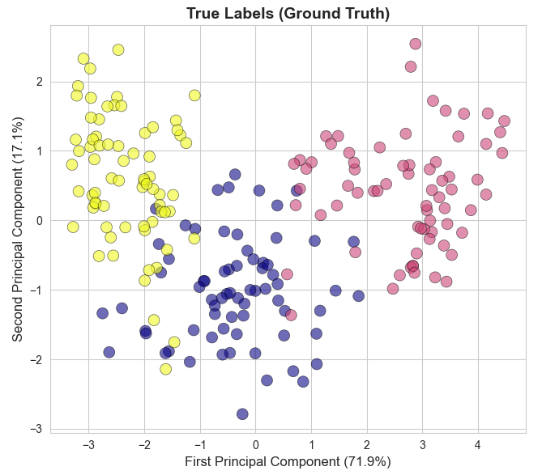
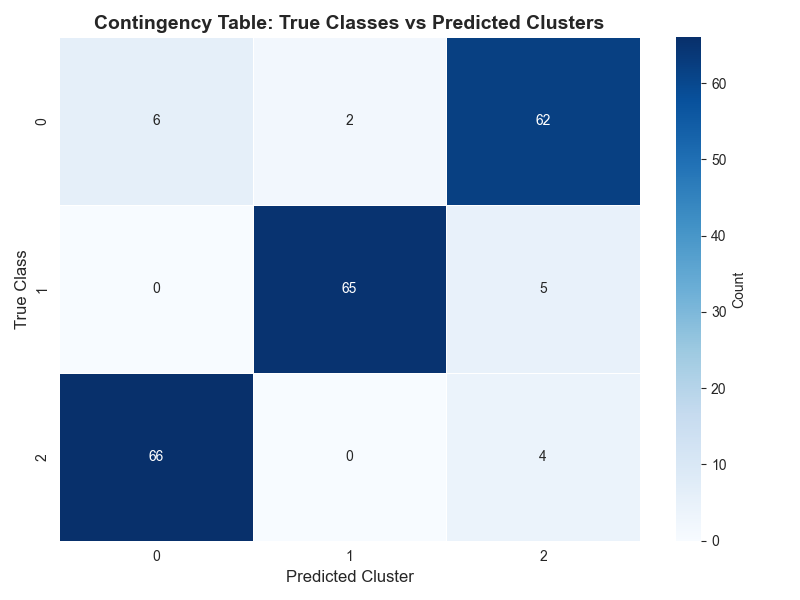

---

layout: default

title: Wheat Seeds (K-Means Clustering)

permalink: /k-means-clustering/

---

## Goals and objectives:

A botanical research facility wishes to understand the clustering of wheat seeds based on measurements of geometrical properties of kernels belonging to three different varieties of wheat; Kama, Rosa and Canadian.

A soft X-ray technique was used to construct all seven, real-valued attributes (features), for each seed on which the clustering is based.

The results of the K-Means clustering produced good agreement with the known labels, with approximately 73% of seeds classified correctly, with three distinct clusters emerging.  It was also noted that ~85-90% of variance was explained by 2 Principle Components. 

## Application:  

K-Means Clustering is a versatile and widely used technique in many business sectors, the following is a subset of applications:

* In the financial sector, K-Means is primarily used to group customers, transactions, or financial instruments based on similar attributes for risk management, fraud detection and marketing.
* Retail businesses use K-Means to understand customer behaviour and optimize inventory and marketing strategies.
* In manufacturing, K-Means helps in anomaly detection and process optimization using sensor and operational data, allowing preventative maintenance.
* Technology companies use K-Means for everything from organizing content to optimizing complex systems.
  * Helps in organising content, creating recommendation systems, and improving search results by grouping similar topics.
  * Load balancing - Allows the system to intelligently distribute new workloads to the least utilized clusters, ensuring optimal resource allocation and preventing server overload.

## Methodology:  

A workflow in Python was developed using libraries Scikit-learn, Pandas and Numpy, utilising Matplotlib and Seaborn for visualisations.  The data used was obtained from [Kaggle](https://www.kaggle.com/datasets/dongeorge/seed-from-uci).  

The data contains 7 independent variables:  area (A), perimeter (P), compactness (C), length of kernel (LK), width of kernel (WK), asymmetry coefficient (A_Coef) and length of kernel groove (LKG), which are used to generate the clusters.

The overall method was to scale the data, determine the optimal number of clusters (i.e. the optimal value of K), and then generate the clusters, using the optimal K value, and assess the results to determine the quality of the clustering.

Data preparation:  The data for the clustering did not undergo any transformation or preparation, other than scaling as part of the analytical process. 

## Results and conclusions:

Initially the data was scaled to support optimal clustering, and prevent single factors dominating the clustering process.  The clustering transformed the values, so that each IV has a mean of 0 and a standard deviation equal to 1.

The K-Means Cluster model was run for each value of K in the inclusive range (2,11).

For each value of K, the WSS (Within-Cluster Sum of Squares) was calculated, which were used to determine the optimal value of K, i.e. the optimal number of clusters.  

For each value of K intrinsic measures were also measured and recorded; Silhouette Scores, Davies Bouldin Scores, and Calinski Harabasz Scores.  

The Elbow Method, which uses the WSS scores for each K value, along with the plots of the other intrinsic measures, was used to determine the optimal K value of 3, which was then used to define the final K-Means Model, and apply the clustering to the observations.

### Intrinsic Validation Metrics

Where K=3 the K-Means Model generated the following metrics:

WSS = 430.66

Silhouette Score: 0.40  
  Range: [-1, 1], Higher is better  
  Interpretation: 0.40 indicates moderate separation  

Davies-Bouldin Index: 0.9279  
  Range: [0, ∞), Lower is better  
  Interpretation: 0.93 indicates good cluster separation  

Calinski-Harabasz Index: 249.78  
  Range: [0, ∞), Higher is better  
  Interpretation: Higher values indicate denser and better separated clusters

### Extrinsic Validation Metrics

This project is an unsupervised learning project as the model was generated unsing unlabelled data, however the data used did have labels (they just weren't presented to the K-Means Clustering model).

As such extrinsic validation metrics can be determined, by comparing the clustering result to the grounded truth.

First it should be noted that the intrinsic validation and elbow method determine the optimal clusters to be 3, which is correct, as there are three varieties of wheat seeds.

Adjusted Rand Index (ARI): 0.773
  Range: [-1, 1], 1 = perfect match, 0 = random labeling
  Interpretation: 0.7733 indicates very good agreement with true labels

Homogeneity Score: 0.728
  Range: [0, 1], Higher is better - Measures if clusters contain only members of a single class
  This score indicates that approximately 73% of the time, each cluster contains only samples from a single true class

Completeness Score: 0.728
  Range: [0, 1], Higher is better - Measures if all members of a class are in the same cluster
  This score shows that about 73% of samples belonging to the same true class are assigned to the same cluster

V-Measure Score: 0.728
  Range: [0, 1], Higher is better - Harmonic mean of homogeneity and completeness
  Indicates a good performance of the clustering

### Visualising Clustering Results

As the independent variables represent 7 dimensions, it is not possible to visualise the clusters in relation to these 7 dimensions.

A technique commonly used for visualising clusters with 4+ dimensions is to utilise Princple Component Analysis (PCA), which won't be described fully within this project, but is covered in a separate project within this portfolio.

In summary PCA (Principal Component Analysis) is a dimensionality reduction technique that:
- Transforms the original 7 features into new uncorrelated variables (components)
- Each principal component is a LINEAR COMBINATION of the original features
- Components are ordered by the amount of variance they explain
- PC1 captures the most variance, PC2 the second most, etc.

Using PCA, the first 2 principle components were identified, which were used to produce a scatter plot of the K-Means generated clusters, as well as a scatter plot of the true groups (or clusters):

Finally the predicted clusters were compared to the actuals, noting that as this was an unsupervised learning method, the model was unaware of the true labels and hence the correct predictions are in the bottom-left to top-right diagonal.

### Conclusions:

The fact that all three scores extrinsic metrics (Homogeneity, Completeness and V-Measure) are nearly identical (0.7277, -0.7280) indicates balanced clustering - neither homogeneity nor completeness is significantly better or worse.

These scores collectively suggest that the K-Means algorithm achieved moderately strong alignment with the true seed varieties. The clustering is not perfect (which would be 1.0), but it successfully captures much of the underlying structure in the data. The ~73% agreement indicates that the features used are reasonably predictive of seed variety, howevever, there may be some natural overlap between varieties in the feature space.  

It also highlights that small portion of seeds (~27%) are either misclassified or represent boundary cases that are difficult to distinguish

This level of performance is quite respectable for unsupervised learning, especially considering K-Means had no knowledge of the true labels during training.

Overall the clustering is considered successful, given the evidence that there is natural overlap of observations in the feature space of the true varieties, i.e. there is not a clear separation of true clusters.

Known limitations of this model:
* K-Means assumes spherical clusters (may not match data geometry)
* Unsupervised approach doesn't leverage available labels for training

## Next steps:  

With any analysis it is important to assess how the model and data collection can be improved to better support the business goals.

Recommended next steps include:

#### Transition to Supervised Learning
Having labeled data enables supervised methods will significantly outperform unsupervised clustering, potentially providing higher accuracy and better handling of boundary cases.  This requires creating a dataset with labelled data.
Recommended Algorithms:
* Random Forest Classifier: Handles non-linear relationships, provides feature importance
* Support Vector Machine (SVM): Excellent for finding complex decision boundaries
* Gradient Boosting (XGBoost/LightGBM): State-of-the-art performance for tabular data
* Neural Networks: If pattern complexity requires it, but  likely overkill for 7 features

#### Increasing Sample Size
Collect more samples while ensuring a balanced sampling of varieties.  Look to include boundary examples, and take samples from multiple conditions

#### Feature Engineering
* Feature Analysis
  * Assess PCA loadings
  * Which features have highest loadings on PC1/PC2?
  * Are any features redundant (highly correlated)?
  * Do any features have low variance or discriminatory power?
* Create New Features - Consider Ratios and Interactions of dimensions, for example:
  * Aspect Ratio: Length / Width
  * Shape Index: 4π×Area / Perimeter²
  * Volume Proxy: Area × Kernel Width
* Feature Selection - Identify if redundant features exist
  * Test model performance with reduced feature sets

### Try Alternative Clustering Methods
* Hierarchical Clustering
* DBSCAN (Density-Based Clustering)
* Gaussian Mixture Models (GMM)
* Ensemble Clustering

## Python code:
You can view the full Python script used for the analysis here: 
[View the Python Script](/K-Mean_Clustering.py)
