---

layout: default

title: Wheat Seeds (K-Means Clustering)

permalink: /k-means-clustering/

---

## Goals and objectives:

The objective of this project is to apply **K-Means Clustering** to a dataset of geometric measurements taken from wheat seeds, with the goal of discovering whether the data naturally separates into meaningful groups — without using the known seed variety labels during the analysis.

The dataset contains 210 seeds drawn from three varieties: **Kama**, **Rosa**, and **Canadian**. For each seed, seven geometric properties were measured using a soft X-ray imaging technique: area, perimeter, compactness, kernel length, kernel width, asymmetry coefficient, and groove length. These seven features form the basis of the clustering.
The analysis is structured around three questions:

* **Can K-Means recover the true variety structure from geometry alone?** The model is trained entirely without labels, making this a test of whether the geometric measurements carry enough discriminatory signal to distinguish the varieties.
* **What is the optimal number of clusters?** Rather than assuming three clusters because we know there are three varieties, the optimal K is determined objectively using four independent methods: the Elbow Method (WSS), Silhouette Score, Davies-Bouldin Index, and Calinski-Harabasz Index.
* **How well do the recovered clusters align with the true varieties?** Because the true labels are available (but withheld from the model), both intrinsic metrics (which measure clustering quality independently) and extrinsic metrics (which compare against ground truth) are used to assess performance.

The analysis also includes an examination of the feature space: checking for skewness, multicollinearity between features, and using Principal Component Analysis (PCA) to reduce the seven dimensions to two for visualisation. The PCA scree plot quantifies how much variance is captured at each component, directly supporting the interpretation of the cluster scatter plots.

The project concludes by assessing where and why the clustering falls short of perfect agreement with the true labels — specifically exploring the natural overlap between varieties in the feature space — and identifies clear next steps, including a transition to supervised learning methods which leverage the available labels directly.


## Application:  

K-Means Clustering is an unsupervised machine learning algorithm that partitions observations into **K distinct, non-overlapping groups** based on similarity. The algorithm works iteratively: it assigns each observation to its nearest cluster centroid, then recalculates the centroid positions based on the new assignments, repeating until the assignments stabilise. The result is a set of clusters where observations within a group are as similar as possible to each other, and as different as possible from observations in other groups.

A key practical decision in any K-Means analysis is selecting the optimal value of K. This project determines K objectively using four complementary methods — the **Elbow Method** (minimising Within-Cluster Sum of Squares), **Silhouette Score**, **Davies-Bouldin Index**, and **Calinski-Harabasz Index** — with convergence across all four providing confidence in the chosen value.

Because K-Means operates purely on distance in feature space, it requires **scaled data** to prevent features with larger absolute ranges dominating the clustering. It is also worth noting that K-Means assumes clusters are roughly spherical and of similar density; where these assumptions do not hold, alternative methods such as DBSCAN or Gaussian Mixture Models may be more appropriate.

K-Means is one of the most widely deployed clustering techniques across industry, with applications including:

🏦 **Financial Services** — customer segmentation for targeted products, transaction clustering for fraud detection, and risk tiering of financial instruments.  
🛍️ **Retail** — grouping customers by purchasing behaviour to inform marketing strategy, and clustering product lines to optimise inventory management.  
🏭 **Manufacturing** — anomaly detection in sensor data to identify equipment at risk, and grouping operational states to support process optimisation and preventative maintenance.  
💻 **Technology** — organising content for recommendation systems, clustering search queries to improve relevance, and load balancing by distributing workloads across server clusters based on utilisation.  
🌾 **Agriculture** — the focus of this project — grouping crops by measurable physical properties to support variety classification, quality control, and seed selection, without requiring manual expert labelling of every sample.  

## Methodology:  

The analysis was developed in Python using Scikit-learn, Pandas, and NumPy, with visualisations produced using Matplotlib and Seaborn. The dataset was sourced from [Kaggle](https://www.kaggle.com/datasets/dongeorge/seed-from-uci), originally compiled from the UCI Machine Learning Repository.

The dataset contains **210 observations** across **seven continuous features**: area (A), perimeter (P), compactness (C), length of kernel (LK), width of kernel (WK), asymmetry coefficient (A_Coef) and length of kernel groove (LKG). A target label identifying the wheat variety (Kama, Rosa, or Canadian) is present in the data but was withheld from the model throughout — used only at the evaluation stage to assess clustering quality against ground truth.

The workflow proceeded through the following stages:

**Data Validation and Exploratory Analysis** The dataset was checked for missing values, data types, and class balance across the three varieties. Feature distributions were examined and skewness quantified for each variable, since K-Means relies on Euclidean distance and can be sensitive to heavily skewed features. A correlation analysis was also conducted to identify highly correlated features, as multicollinearity effectively over-weights certain dimensions in the distance calculation.

**Feature Scaling** All features were standardised using StandardScaler, transforming each to zero mean and unit variance. This is a prerequisite for K-Means, ensuring no single feature dominates the clustering due to differences in scale or units.

**Determining the Optimal Number of Clusters** Rather than assuming K=3 from domain knowledge, the optimal K was determined objectively by running K-Means across K = 2 to 10 and evaluating four independent metrics at each value:

* **Within-Cluster Sum of Squares (WSS)** — used in the Elbow Method to identify the point of diminishing returns
* **Silhouette Score** — measures how similar each observation is to its own cluster versus neighbouring clusters
* **Davies-Bouldin Index** — assesses the ratio of within-cluster scatter to between-cluster separation
* **Calinski-Harabasz Index** — evaluates cluster density and separation simultaneously

Convergence across all four metrics on K=3 provided objective confirmation of the optimal cluster count.

**Model Training** The final K-Means model was trained with K=3, random_state=42 for reproducibility, and n_init=10 — meaning the algorithm was run ten times with different centroid initialisations, with the best result selected. Cluster centroids were extracted and analysed to characterise the defining features of each cluster.

**Validation** Clustering quality was assessed using both intrinsic and extrinsic metrics. Intrinsic metrics (Silhouette Score, Davies-Bouldin Index, Calinski-Harabasz Index) evaluate cluster structure independently of the true labels. Extrinsic metrics (Adjusted Rand Index, Homogeneity, Completeness, and V-Measure) compare the clustering result directly against the withheld variety labels to quantify agreement with ground truth.

**Visualisation** Principal Component Analysis (PCA) was applied to the scaled data to enable visualisation of the seven-dimensional feature space. A full seven-component PCA was first used to produce a scree plot quantifying the variance captured at each component. A two-component PCA was then used to project the data into two dimensions, generating scatter plots of the K-Means cluster assignments alongside the true variety labels for direct visual comparison. A per-sample silhouette plot and a pairplot of cluster assignments across all feature pairs were also produced to support deeper interpretation of the clustering structure.

## Results:

### Data Validation and Exploratory Analysis  
The dataset contains 210 observations and 7 features, with no missing values. The three wheat varieties — Kama, Rosa, and Canadian — are perfectly balanced at 70 observations each, meaning no variety is over- or under-represented in the clustering.

Feature skewness was examined prior to modelling. All seven features returned skewness values within an acceptable range, indicating that the distributions are approximately symmetric and that no transformation was required before scaling.

The correlation analysis revealed strong positive correlations between several size-related features — area, perimeter, kernel length, and kernel width — which is geometrically expected, as larger seeds tend to be larger across all linear dimensions simultaneously. This multicollinearity means these features share explanatory information, and their collective influence on Euclidean distance is noted as a factor in the cluster geometry.

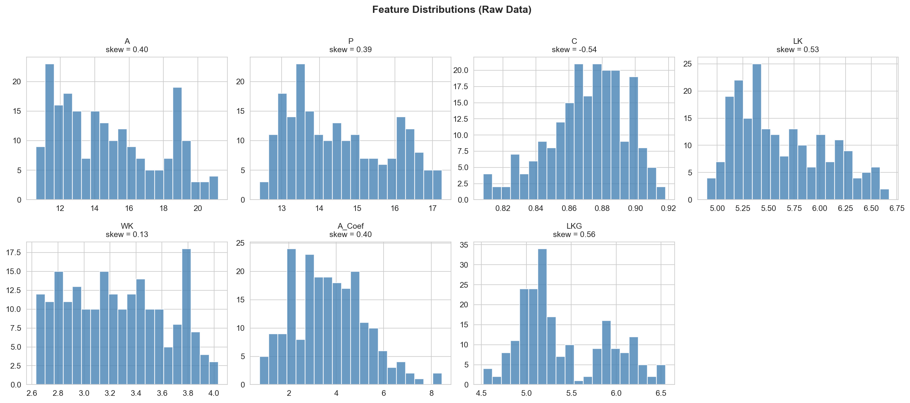

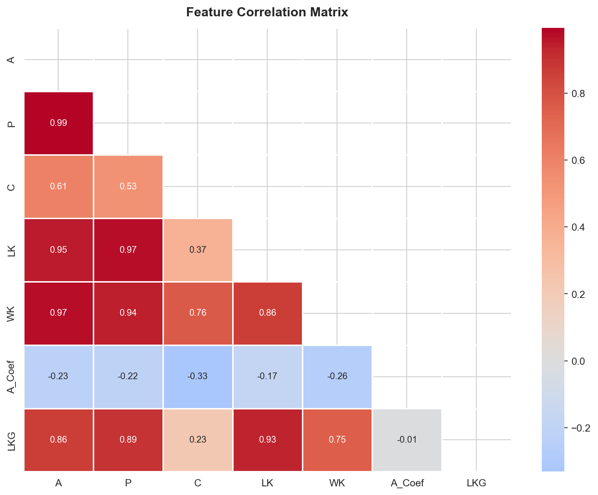

### Determining the Optimal Number of Clusters  
K-Means was run for K = 2 to 10, with four metrics recorded at each value.

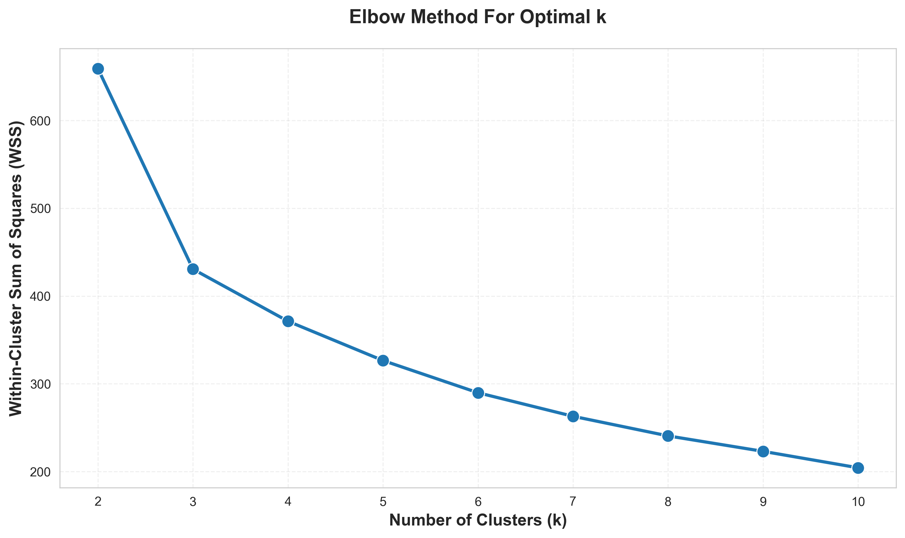

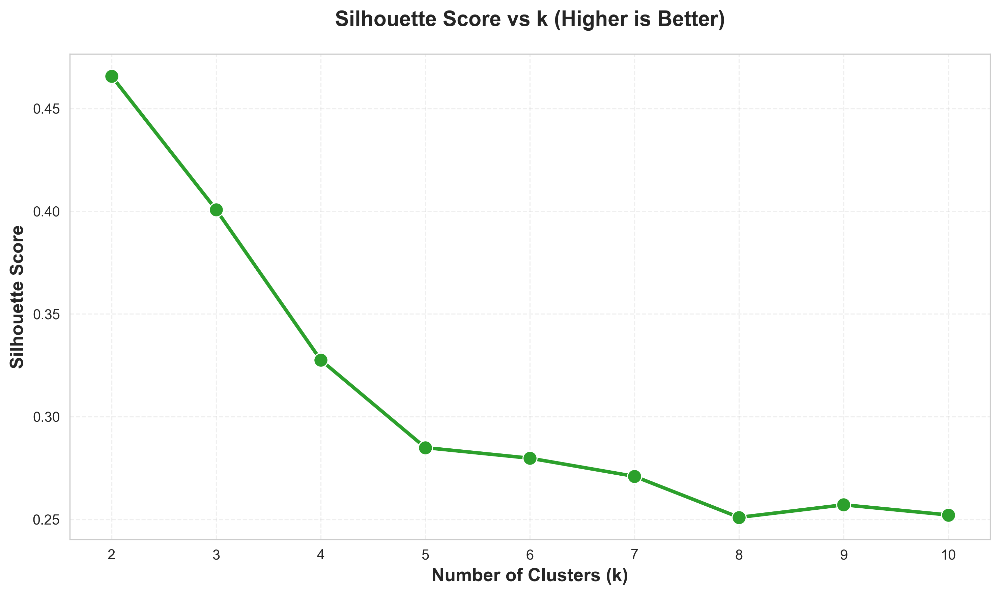

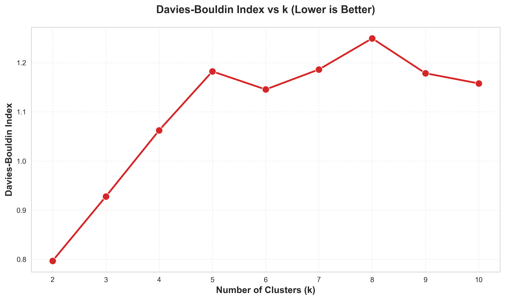

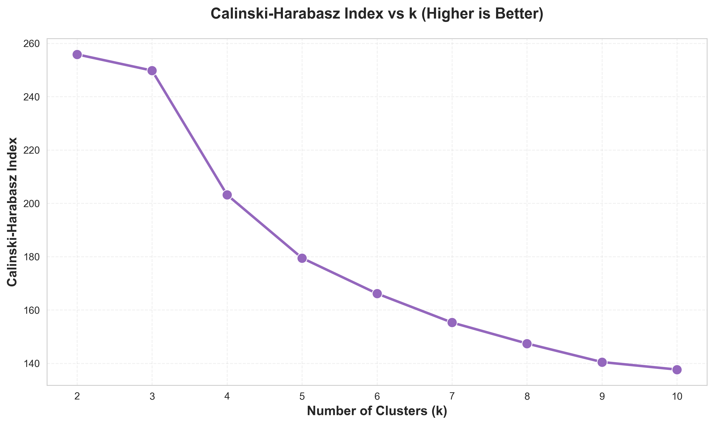

The Elbow Method shows a clear change in the rate of WSS reduction at K=3, beyond which additional clusters yield diminishing returns. This is corroborated by the Silhouette Score, which peaks at K=3, and the Davies-Bouldin Index, which reaches its minimum at K=3. The Calinski-Harabasz Index also achieves its highest value at K=3. Convergence across all four independent metrics provides strong objective confirmation that **K=3 is the optimal number of clusters** — consistent with, but not assumed from, the known three varieties.

### Cluster Centroid Profiles

With K=3 confirmed, the final model was trained and the cluster centroids examined to characterise what each cluster represents in terms of the original features.

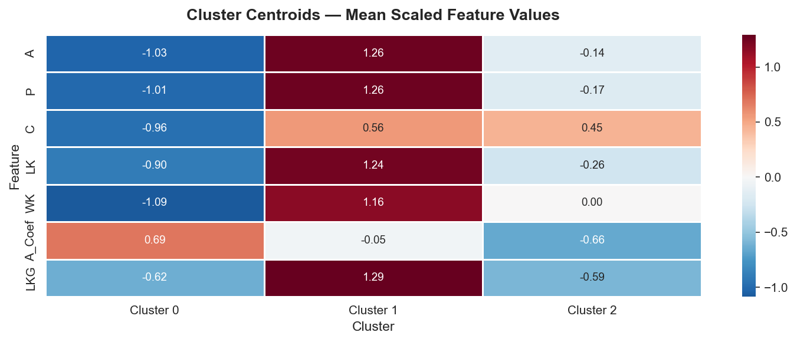

The centroid heatmap reveals clear structural differences between the three clusters. One cluster is characterised by consistently high values across the size-related features (area, perimeter, kernel length, kernel width), corresponding to larger seeds. A second cluster shows the opposite pattern — smaller values across those same features. The third cluster occupies an intermediate position on size but is distinguished by a notably higher asymmetry coefficient. These profiles are physically interpretable and align well with the known morphological differences between the Kama, Rosa, and Canadian varieties.

### Intrinsic Validation Metrics

The following metrics assess the quality of the clustering independently of the true labels:

```
Metric                     Value     Interpretation
Silhouette Score           0.40      Moderate cluster separation
Davies-Bouldin Index       0.93      Good cluster separation
Calinski-Harabasz Index    249.78    Well-separated, dense clusters
WSS                        430.66    Within-cluster compactness reference
```

The Silhouette Score of 0.40 indicates moderate but meaningful separation — clusters are distinguishable, though with some overlap at the boundaries. The per-sample silhouette plot below provides a more detailed breakdown of this score.

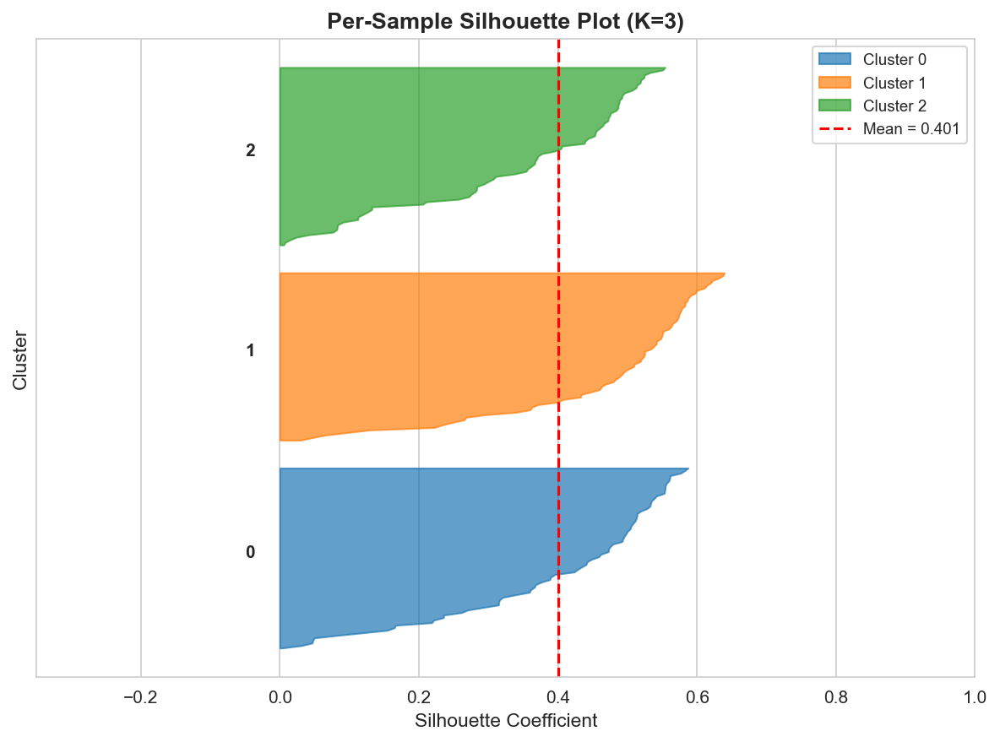

Each horizontal bar represents a single observation, with width equal to its silhouette coefficient — a measure of how well that observation fits its assigned cluster relative to the nearest alternative cluster. Values approaching 1.0 indicate a confident, well-separated assignment; values near 0 indicate a boundary case; negative values indicate a likely misassignment. The dashed red line marks the overall mean of 0.40.

The plot shows that two of the three clusters contain a large proportion of observations with consistently positive silhouette values, indicating well-defined membership. The third cluster — which corresponds to the variety with the highest morphological overlap with its neighbours — contains a wider spread of values and a higher proportion of near-zero coefficients, indicating that this is where most boundary cases and misassignments are concentrated. This is an important finding: the aggregate Silhouette Score of 0.40 does not reflect uniform performance across all clusters, and the per-sample plot reveals that the clustering is stronger for two of the three varieties than the single summary figure suggests.

### Extrinsic Validation Metrics

Because the true variety labels were withheld from the model but are available for evaluation, extrinsic metrics can be calculated to directly quantify agreement between the cluster assignments and the ground truth:

```
Metric                       Value     Interpretation
Adjusted Rand Index (ARI)    0.773     Very good agreement with true labels
Homogeneity                  0.728     ~73% of clusters contain single-variety members
Completeness                 0.728     ~73% of variety members assigned to same cluster
V-Measure                    0.728     Balanced harmonic mean of above two scores
```

The ARI of 0.773 is particularly informative, as it accounts for agreement occurring by chance — a score this high from a model that had no access to the labels during training indicates that the geometric features carry substantial discriminatory information about variety. The near-identical Homogeneity and Completeness scores indicate balanced clustering performance: the model is neither systematically splitting true varieties across multiple clusters nor merging distinct varieties into one.

Visualising the Clustering Results

To visualise the seven-dimensional feature space, PCA was applied to reduce the data to two dimensions. The scree plot below quantifies the variance captured at each principal component.

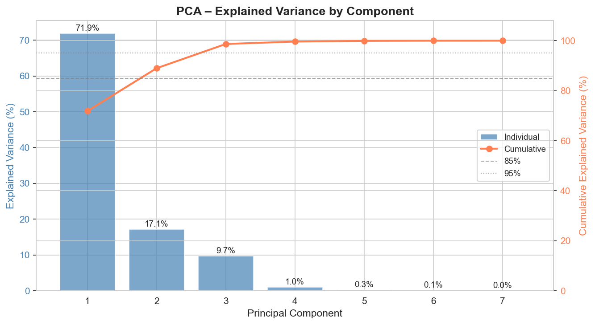

The first two principal components capture approximately 85–90% of the total variance in the data, confirming that a two-dimensional projection retains the dominant structure of the feature space and is a reliable basis for visual interpretation.

The scatter plots below show the K-Means cluster assignments and the true variety labels projected onto the same two principal component axes.

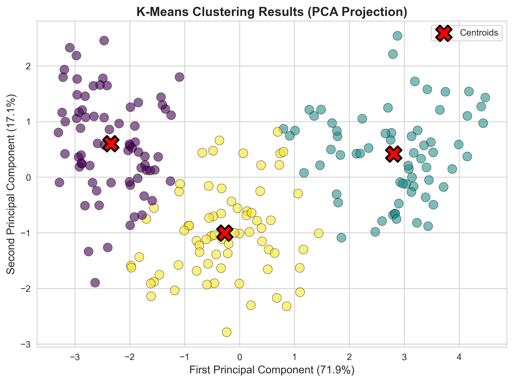
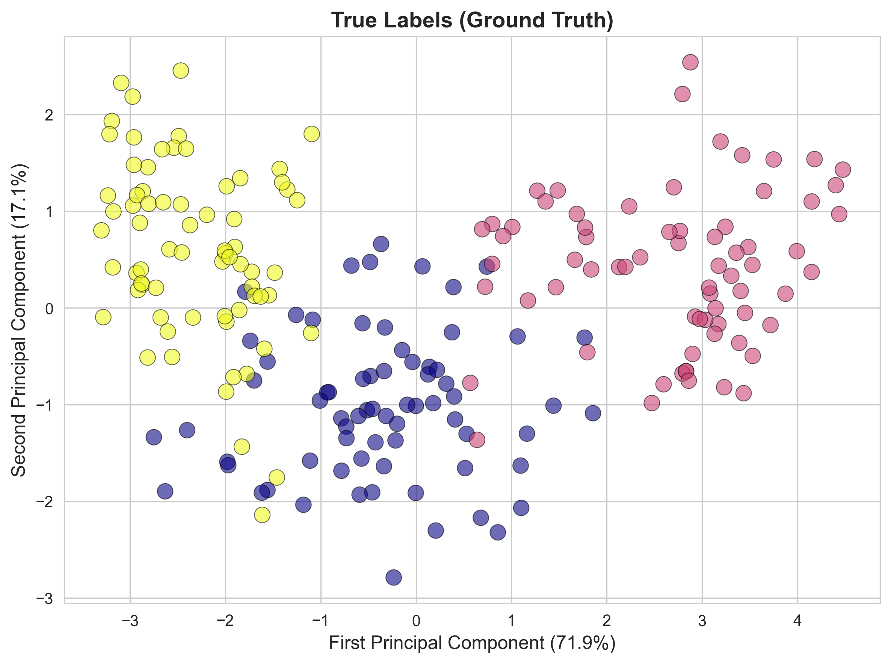

The two plots are visually similar, with three broadly coherent groupings apparent in both. The primary discrepancies occur at the cluster boundaries — particularly between the two groups that overlap most in the centre of the PCA space — which is consistent with the boundary cases identified in the per-sample silhouette plot and the ~27% of observations not perfectly assigned by the extrinsic metrics.

### Cluster-to-Variety Mapping

Finally, the contingency table below compares the K-Means cluster assignments directly against the true variety labels, making it possible to identify precisely where the misassignments occur.

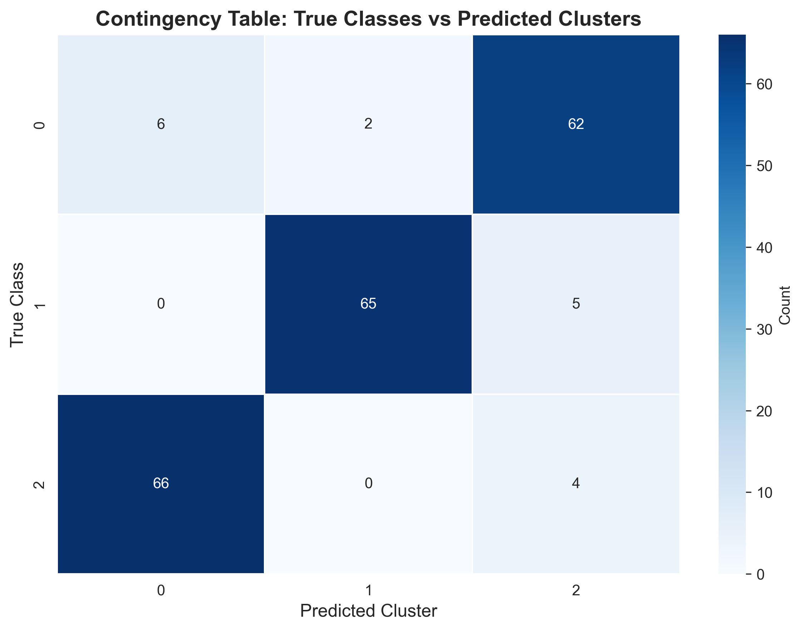

The diagonal of the contingency table confirms strong alignment between clusters and true varieties for all three groups, with the off-diagonal counts concentrated between the two most morphologically similar varieties. This pattern is consistent with the natural overlap in the feature space observed in the PCA scatter plots and is expected given that K-Means had no label information during training.

## Conclusions:

The K-Means clustering analysis successfully recovered the underlying variety structure of the wheat seed dataset from geometric measurements alone, with no access to the true labels during training. The key findings are summarised below.

**K-selection was robust**. The optimal cluster count of K=3 was confirmed independently by four metrics — WSS elbow, Silhouette Score, Davies-Bouldin Index, and Calinski-Harabasz Index — all converging on the same value. This convergence removes reliance on domain knowledge and validates the choice on purely statistical grounds.

**Cluster structure is physically interpretable**. The centroid profiles reveal three geometrically distinct groups: one characterised by large seed dimensions, one by smaller dimensions, and one by intermediate size with elevated asymmetry. These profiles map naturally onto the known morphological differences between the Kama, Rosa, and Canadian varieties, confirming that the clustering has captured meaningful structure rather than noise.

**Performance is strong for an unsupervised approach**. An Adjusted Rand Index of 0.773 — accounting for chance agreement — indicates that the geometric features carry substantial discriminatory information. Homogeneity and Completeness scores of 0.728 are balanced, confirming that the model neither systematically splits true varieties across clusters nor conflates distinct varieties into one.

**The ~27% misassignment rate reflects genuine feature overlap, not model failure**. The per-sample silhouette plot shows that two of the three clusters are well-separated, with consistently high silhouette coefficients across their members. The third cluster accounts for the majority of boundary cases — an observation reinforced by the PCA scatter plots and the contingency table, where off-diagonal counts are concentrated between the two most morphologically similar varieties. This is a property of the data, not an artefact of the method.

**Known limitations** of this analysis are that K-Means assumes spherical, similarly-sized clusters, which may not fully reflect the geometry of these varieties in feature space. Additionally, the strong correlations between size-related features (area, perimeter, kernel length, kernel width) mean these dimensions collectively carry disproportionate weight in the Euclidean distance calculation — a factor that could be addressed through feature selection or dimensionality reduction prior to clustering in future work.

Overall, the results demonstrate that K-Means is an effective tool for variety discovery in this domain, and establish a well-validated baseline against which supervised and alternative unsupervised approaches can be benchmarked.

## Next steps:  

With any analysis it is important to assess how the model and data collection can be improved to better support the business goals.

Recommended next steps include:

#### Transition to Supervised Learning
Having labeled data enables supervised methods will significantly outperform unsupervised clustering, potentially providing higher accuracy and better handling of boundary cases.  This requires creating a dataset with labelled data.
Recommended Algorithms:
* Random Forest Classifier: Handles non-linear relationships, provides feature importance
* Support Vector Machine (SVM): Excellent for finding complex decision boundaries
* Gradient Boosting (XGBoost/LightGBM): State-of-the-art performance for tabular data
* Neural Networks: If pattern complexity requires it, but  likely overkill for 7 features

#### Increasing Sample Size
Collect more samples while ensuring a balanced sampling of varieties.  Look to include boundary examples, and take samples from multiple conditions

#### Feature Engineering
* Feature Analysis
  * Assess PCA loadings
  * Which features have highest loadings on PC1/PC2?
  * Are any features redundant (highly correlated)?
  * Do any features have low variance or discriminatory power?
* Create New Features - Consider Ratios and Interactions of dimensions, for example:
  * Aspect Ratio: Length / Width
  * Shape Index: 4π×Area / Perimeter²
  * Volume Proxy: Area × Kernel Width
* Feature Selection - Identify if redundant features exist
  * Test model performance with reduced feature sets

#### Try Alternative Clustering Methods
* Hierarchical Clustering
* DBSCAN (Density-Based Clustering)
* Gaussian Mixture Models (GMM)
* Ensemble Clustering


## Python code:
You can view the full Python script used for the analysis here: 
[View the Python Script](/K-Mean_Clustering_v2.py)
