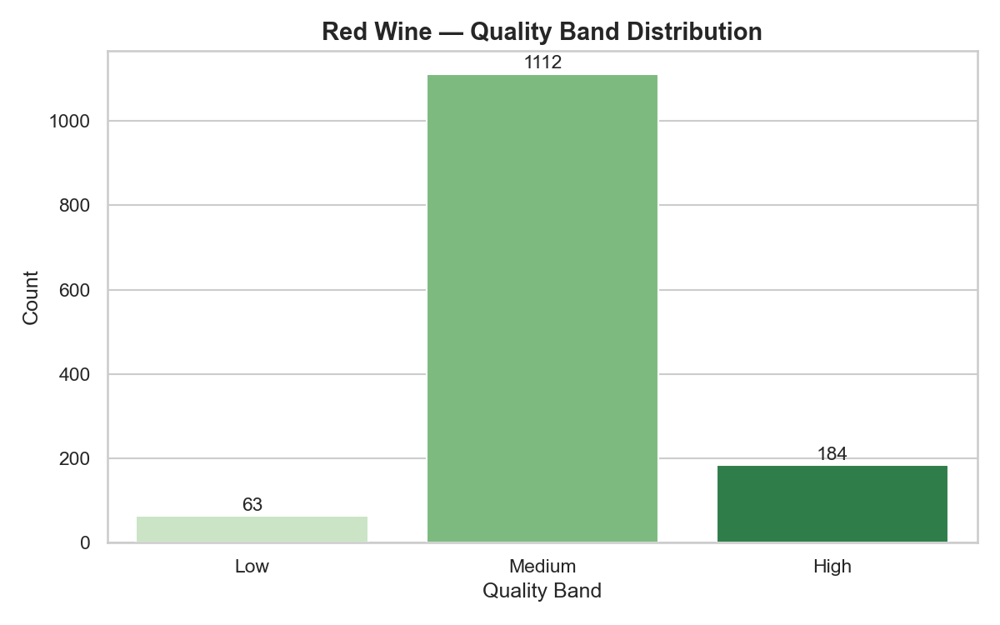
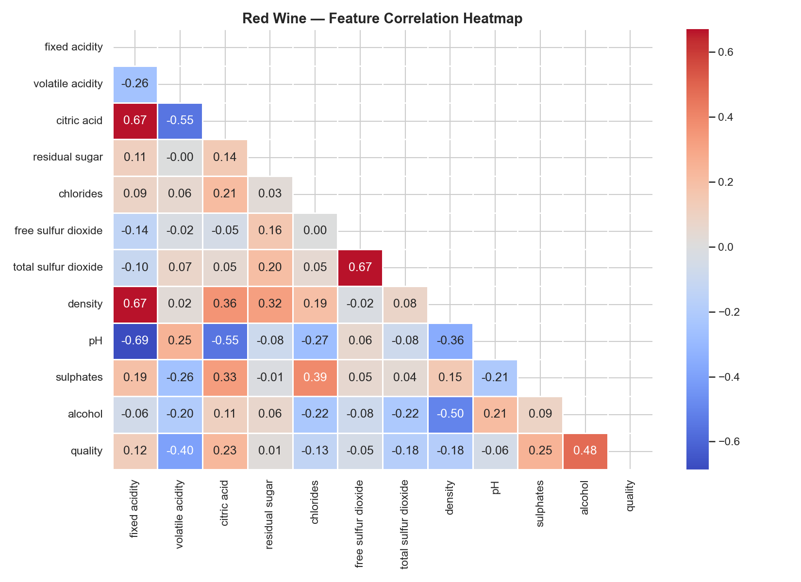
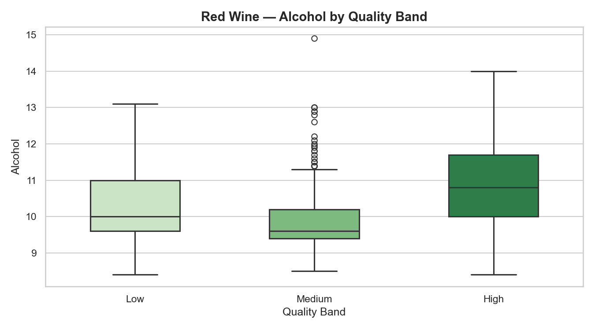
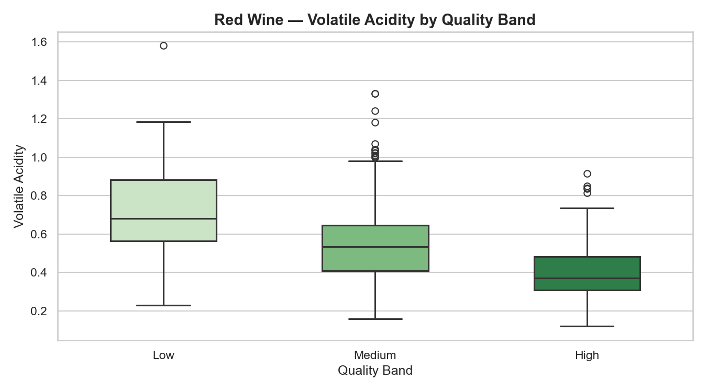
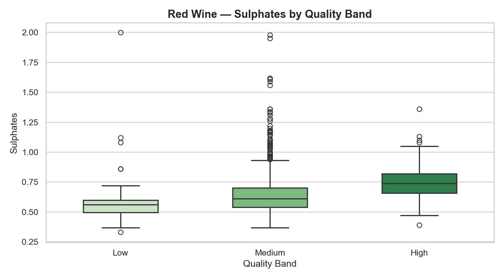
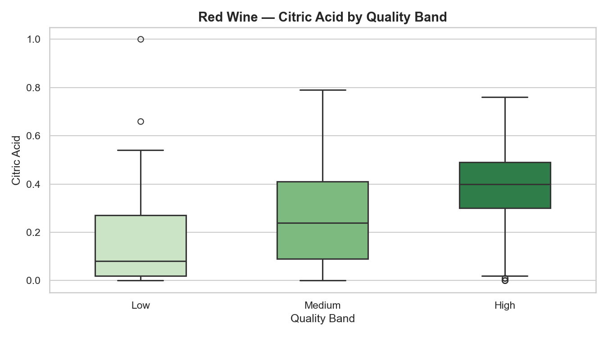
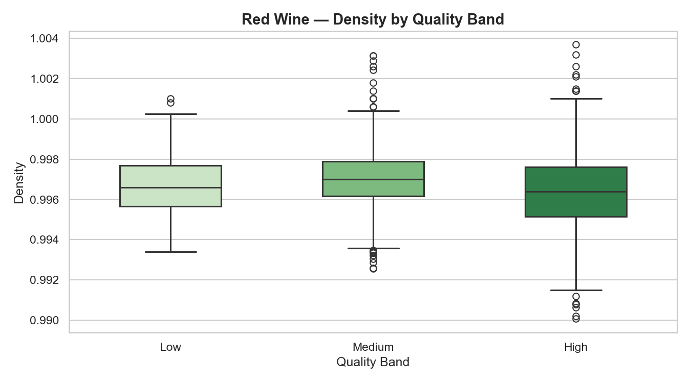
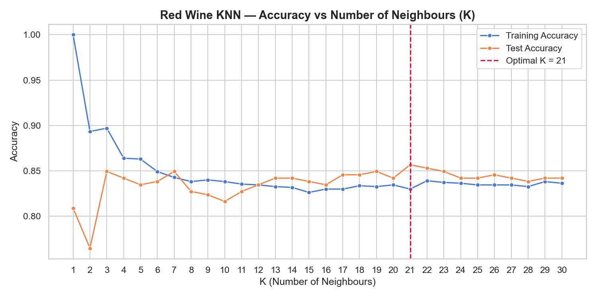
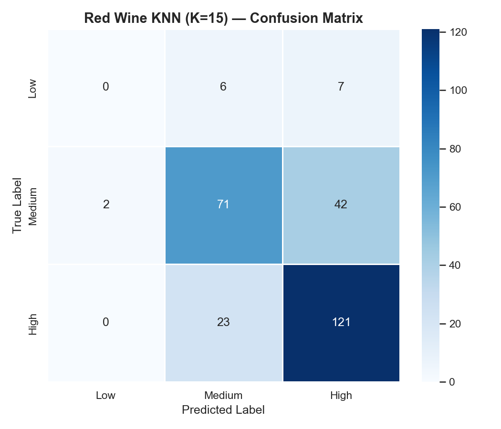
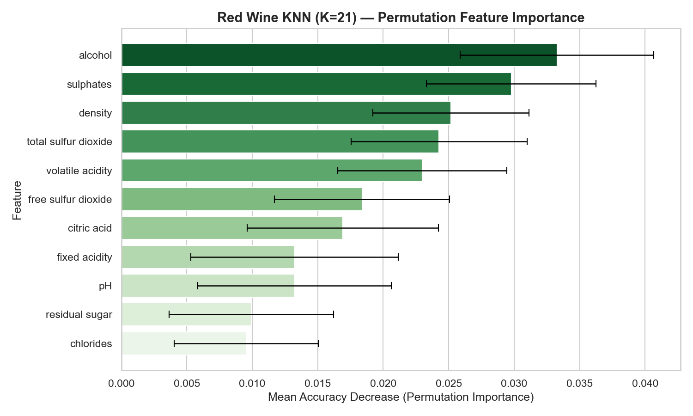

---

layout: default

title: Wine Quality Prediction (K-Nearest Neighbours)

permalink: /k-nearest-neighbours/

---

# This project is in development

## Goals and objectives:

For this portfolio project, the business scenario concerns the prediction of red wine quality from physicochemical measurements — a classification problem drawn from the UCI Wine Quality dataset, widely used as a benchmark in applied machine learning. The dataset comprises 1,599 observations of red wine, with eleven continuous chemical measurements including alcohol content, acidity, sulphates, and density, alongside a quality rating assigned by human sensory panels on a scale of three to nine. The objective is to determine whether the quality of a wine can be reliably predicted from its chemical composition alone, using K-Nearest Neighbours (KNN) as the classification framework.

KNN is the appropriate technique for this problem for several reasons. As a distance-based algorithm, it makes no assumption about the functional form of the relationship between features and the target — an important property here, because wine quality is determined by the complex, non-linear interaction of multiple chemical variables rather than by any single dominant measurement. The algorithm classifies a new observation by identifying its K closest neighbours in feature space and assigning the majority class among them, a logic that maps naturally onto the intuition that wines with similar chemical profiles tend to be rated similarly by tasters.

A key design decision in the analysis is the binning of raw quality scores into three ordered classes — Low (scores 3–4), Medium (score 5), and High (scores 6–8). The initial approach of defining Medium as scores 5–6 was considered but rejected on the grounds that it produced a severe class imbalance, with approximately 82% of observations falling into the Medium band. Under that definition, a classifier that simply predicted "Medium" for every observation would achieve around 82% accuracy without learning anything meaningful about the data — a phenomenon known as the naive classifier problem. By reassigning score 6 into the High band, the class distribution becomes substantially more balanced, reducing the naive baseline accuracy to approximately 53% and ensuring that any accuracy achieved above that level reflects genuine predictive learning. The rebanding is also semantically defensible: a score of 6 on a sensory quality scale is above average and is reasonably grouped with scores 7 and 8 as collectively good-quality wine.

A secondary objective is the selection of the optimal value of K through systematic evaluation across a range of candidate values. The choice of K is the primary hyperparameter in KNN and directly governs the bias-variance trade-off: small values of K produce highly flexible boundaries susceptible to overfitting, while large values produce smoother boundaries at the cost of failing to capture local structure in the data. By evaluating model performance across K = 1 to K = 30 on held-out test data, the analysis identifies the value that maximises generalisation accuracy and demonstrates the importance of principled hyperparameter selection.

By the end of the analysis, the project aims to demonstrate not only the correct implementation of KNN classification — including mandatory feature scaling, stratified train-test splitting, and model evaluation — but also the analytical judgement to construct a target variable that produces a meaningful accuracy baseline, and the ability to communicate findings clearly to both technical and non-technical audiences.

## Application:  

K-Nearest Neighbours is a versatile, interpretable non-parametric supervised machine learning classification algorithm deployed across a wide range of business domains wherever the goal is to assign observations to categories based on their proximity to known examples in a multi-dimensional feature space.  It is used for both classification and regression tasks.

The core principle behind KNN is that data points with similar features exist in close proximity to each other in vector space. When presented with a new, unseen data point, the algorithm calculates the "distance" (typically using Euclidean, Manhattan, or Minkowski metrics) between that point and all other points in the training dataset. It then identifies the $k$ closest data points—the "nearest neighbours"—and assigns the new point the most common class among them (for classification) or the average of their values (for regression). As a "lazy learner," KNN does not build an explicit internal model during a training phase, but rather stores the entire dataset and performs the computation only when a prediction is required.  

This approach is applicable across many sectors and scenarios. Practical examples showing where the K-Nearest Neighbours technique provides clear business value include: 

🛍️ **Retail**:  

**Product Recommendations**: An e-commerce platform suggests new items to a user by identifying the $k$ customers with the most similar browsing and purchasing histories and recommending what they bought.  
**Customer Segmentation**: Marketing teams classify new customers into specific promotional tiers based on how closely their demographic and spending profiles match existing, well-defined customer groups.  
**Store Placement**: A retail chain predicts the potential profitability of a proposed new store location by averaging the historical revenue of the $k$ existing stores with the most similar local demographic and economic indicators.

💻 **Technology**:

**Intrusion Detection**: Cybersecurity systems flag network traffic as a potential cyberattack if its packet characteristics are closest to known historical malicious signatures rather than normal baseline traffic.  
**Optical Character Recognition (OCR)**: Document scanning software classifies handwritten letters by converting the image pixels into a vector and finding the closest matching confirmed characters in its database.  
**Content Curation**: Streaming services dynamically predict user ratings for a new movie by analyzing the ratings given to that same movie by the $k$ users who have the most similar overall viewing tastes.

🔬 **Science & Research**:

**Genetics**: Biologists classify the function of newly discovered genetic sequences by finding the most structurally similar known sequences within a vast DNA database.  
**Drug Discovery**: Pharmaceutical researchers predict the potential toxicity of a new chemical compound based on the known toxicological properties of its nearest structural neighbours.  
**Geospatial Estimation**: Environmental scientists estimate missing soil moisture data for a specific mapping grid by taking the weighted average of the readings from the $k$ closest geographic sensor stations.

🏭 **Manufacturing**:

**Predictive Maintenance**: Factory systems predict impending machine failures by comparing real-time vibration and temperature sensor data to the nearest matching historical patterns that preceded equipment breakdowns.  
**Quality Control**: Computer vision systems classify manufactured components on an assembly line as either acceptable or defective based on their dimensional similarity to a training set of perfectly engineered parts.  
**Supply Chain Routing**: Logistics software estimates the delivery time for a new shipment by averaging the transit times of the $k$ most similar historical shipments in terms of distance, weight, and weather conditions.

## Methodology:  

The methodology adopted for this project follows the end-to-end data science workflow, progressing from data loading and validation through exploratory analysis, pre-processing, model fitting, and evaluation. The project is implemented in Python, using pandas for data manipulation, scikit-learn for modelling and evaluation, and seaborn and matplotlib for visualisation. Each stage of the pipeline is described below.

**Data Loading and Validation**:  

The dataset is loaded from the locally downloaded Kaggle CSV file using pandas, specifying the semicolon delimiter used in the UCI Wine Quality format. A structured validation audit is conducted prior to any analysis, checking for missing values across all eleven feature columns and the quality target, identifying and removing duplicate records, and confirming that all columns carry the expected numeric data types. Descriptive statistics are printed for all variables, and the raw distribution of quality scores is inspected to confirm the spread of ratings and motivate the subsequent banding decision.

The data can be downloaded [here](https://archive.ics.uci.edu/dataset/186/wine+quality)

**Feature Engineering — Quality Banding**:

The raw quality scores are binned into three ordered classes: Low (scores 3–4), Medium (score 5), and High (scores 6–8). The initial approach of assigning scores 5 and 6 jointly to the Medium band was assessed and rejected. Under that definition, the Medium class accounts for approximately 82% of observations, producing a severe class imbalance in which the naive strategy of always predicting "Medium" would yield around 82% accuracy — a baseline so high that overall model accuracy becomes a poor indicator of genuine predictive performance. Reassigning score 6 to the High band reduces the naive baseline to approximately 53% and produces a substantially more balanced class distribution, ensuring that accuracy above that threshold reflects real learning from the feature data. The rebanding is semantically valid: a quality score of 6 represents an above-average wine and is reasonably grouped with scores 7 and 8 as collectively high-quality.

**Exploratory Data Analysis**:

Exploratory analysis is conducted to characterise the distribution of quality bands and to understand how the individual physicochemical features relate to quality. The following charts are produced:

* A **bar chart** of quality band counts, confirming the class distribution following banding and validating that the three classes are sufficiently represented for modelling.
* A **correlation heatmap** of the full feature matrix including the raw quality score, used to identify features with strong linear relationships to quality and to detect multicollinearity between predictors.
* **Five boxplots** — one each for alcohol, volatile acidity, sulphates, citric acid, and density — showing the distribution of each feature across the three quality bands. These features are selected on the basis of their correlation with quality and their chemical interpretability. The boxplots allow visual assessment of whether quality-related differences exist for individual features in isolation, before the KNN model is used to exploit multi-feature proximity.

**Pre-Processing**:

The feature matrix is separated from the target variable and split into training and test sets using an 80/20 ratio, with stratification on the quality band target to preserve class proportions in both sets. Feature scaling is applied using scikit-learn's StandardScaler, fitted on the training set and applied to both training and test sets. Scaling is a mandatory pre-processing step for KNN: because the algorithm computes Euclidean distances between observations, features measured on different scales — such as total sulphur dioxide (tens to hundreds) and pH (2.5 to 4.0) — would otherwise dominate the distance calculation purely by virtue of their numerical range, producing a distorted notion of similarity that the unscaled data does not support.

**Optimal K Selection**:

A KNN classifier is trained and evaluated for each integer value of K from 1 to 30. For each value, both training accuracy and test accuracy are recorded. The resulting accuracy curves are plotted against K, with the optimal value — defined as the K that maximises test accuracy — identified and marked. This step makes the bias-variance trade-off tangible: the chart typically shows high training accuracy and low test accuracy at very small K (overfitting), converging as K increases and stabilising at the optimal point before gradually declining again.

**Model Fitting and Evaluation**:

A final KNN classifier is trained using the optimal K on the full training set. Predictions are generated on the held-out test set and evaluated using three complementary outputs: a classification report providing per-class precision, recall, and F1-score; an overall test accuracy figure; and a confusion matrix heatmap showing the distribution of correct and incorrect predictions across the three quality bands. The confusion matrix is particularly informative for a multi-class problem, revealing not just the overall error rate but the pattern of misclassification — specifically whether the model tends to confuse adjacent quality bands (a more forgivable error) rather than assigning Low and High classifications incorrectly to one another.

**Permutation Feature Importance**:

Permutation feature importance is calculated using scikit-learn's permutation_importance function with 20 repeat permutations per feature on the test set. This method measures the decrease in model accuracy when each feature's values are randomly shuffled, isolating the contribution of each variable to the model's predictive power. It is model-agnostic and does not rely on internal model parameters, making it well-suited to KNN where no native feature importance measure exists. Results are presented as a ranked horizontal bar chart with standard deviation error bars, providing a stable and interpretable view of which chemical properties drive the model's classification decisions.

## Results:

**Data Validation and Quality Band Distribution**:

Data validation confirmed the dataset contains no missing values across any of the eleven feature columns or the quality target. [INSERT: number] duplicate records were identified and removed prior to analysis, leaving [INSERT: number] observations for modelling. All columns carry numeric data types as expected.

The raw quality scores range from 3 to 8 across the red wine dataset, with the distribution heavily concentrated at scores 5 and 6. Following the application of the final banding scheme — Low (3–4), Medium (5), High (6–8) — the class distribution is as follows: [INSERT: Low count and %, Medium count and %, High count and %]. The naive classifier baseline under this definition is approximately [INSERT: High class %], meaning that a model which always predicts the majority class would achieve that accuracy without learning anything from the feature data. Any accuracy materially above this figure can be attributed to genuine predictive signal in the chemical measurements.

**Feature Correlation Analysis**:

The correlation heatmap reveals the linear relationships between all physicochemical features and the raw quality score. Alcohol content emerges as the feature most positively correlated with quality, while volatile acidity carries the strongest negative correlation — wines with higher concentrations of acetic acid tend to be rated lower. Sulphates and citric acid show moderate positive correlations with quality. Among the features, notable multicollinearity is present between fixed acidity, citric acid, and density, suggesting these variables share overlapping information about wine composition.

**Feature Distributions by Quality Band**:

The five boxplots below present the distribution of each key feature across the Low, Medium, and High quality bands. These charts are central to the KNN narrative: they confirm that while individual features show quality-related trends, no single variable cleanly separates the three classes. It is the combination of features in multi-dimensional space — rather than any one measurement in isolation — that the KNN algorithm exploits.

Alcohol shows a clear and consistent increase across quality bands. High-rated wines carry noticeably higher alcohol content on average, with the interquartile range of the High band sitting visibly above that of the Low band. Of all the features examined, this shows the most pronounced association with quality.

Volatile acidity shows the opposite trend, with lower values associated with higher quality bands. The Low band contains a wide spread of volatile acidity values including a number of elevated outliers, consistent with the known negative impact of acetic acid on wine taste at higher concentrations.

Sulphates increase modestly with quality. Median values are reasonably distinct across bands, though the interquartile ranges overlap considerably between Medium and High — illustrating why sulphates alone cannot reliably discriminate between these classes.

Citric acid follows a similar pattern, with higher concentrations associated with better-rated wines, but again with substantial within-band variation that limits single-feature separability.

Density shows a modest negative trend — denser wines tend to be rated lower — which is chemically consistent with the positive relationship between alcohol and quality, as higher alcohol content reduces wine density.

Taken together, the boxplots demonstrate precisely the analytical setting that KNN is designed for: meaningful signal distributed across multiple features, none of which individually provides a sufficient basis for classification, but which in combination provide the multi-dimensional proximity structure the algorithm exploits.

**Optimal K Selection**:

The accuracy vs K plot below shows training and test accuracy evaluated for each value of K from 1 to 30. As expected, training accuracy is highest at K = 1, where the model memorises the training data exactly. Test accuracy rises from K = 1 before stabilising, with the optimal value identified at K = [INSERT], producing a test accuracy of [INSERT]%. Beyond this point, test accuracy shows a gradual decline as larger values of K smooth out local structure that is genuinely informative.

**Model Evaluation**:

The final KNN model trained at K = 15 achieves an overall test accuracy of [INSERT]% on the held-out test set. With a naive classifier baseline of approximately [INSERT]% under the current banding definition, the model's accuracy represents a meaningful improvement that reflects genuine learning from the physicochemical features rather than a statistical artefact of class imbalance.

The confusion matrix below shows the breakdown of predictions across the three quality bands.

The per-class results from the classification report are as follows: [INSERT precision, recall and F1 for Low, Medium and High from your output]. The pattern of misclassification visible in the confusion matrix is informative: the large majority of errors occur between adjacent quality bands rather than between Low and High directly, which is the expected and most forgivable error pattern for an ordinal classification problem. The model's mistakes reflect genuine uncertainty at quality boundaries rather than wholesale misclassification across the full quality range.

The Low class, representing wines with scores of 3 or 4, remains the most challenging to classify correctly owing to its small representation in the dataset — a data limitation rather than a modelling failure. The distinction between Medium and High, which now separates score 5 from scores 6–8, presents the principal classification challenge at volume, and the confusion matrix provides a direct view of how often the model navigates that boundary correctly.

**Permutation Feature Importance**:

The permutation feature importance chart ranks each of the eleven physicochemical features by their contribution to model accuracy on the test set.

**Alcohol** is the most important feature by a clear margin, consistent with the visual evidence from the boxplots and the correlation analysis. **Volatile acidity and sulphates** rank second and third respectively, confirming that the model's classification decisions are driven primarily by the same variables that show the strongest quality-related trends in the exploratory analysis. Features such as free sulphur dioxide and residual sugar contribute relatively little to model accuracy, suggesting their removal could simplify the feature space without meaningfully reducing predictive performance — an avenue explored in the Next Steps section.

## Conclusions:

The KNN classifier achieves an overall test accuracy of [INSERT]% in classifying red wines into Low, Medium, and High quality bands from eleven physicochemical measurements, using an optimal neighbourhood size of K = [INSERT] identified through systematic evaluation. The result confirms that chemical composition carries genuine and learnable signal about wine quality — the model performs meaningfully above the naive baseline of always predicting the majority class, which would yield an accuracy of approximately [INSERT: Medium class %].

The pattern of misclassification, however, is as analytically informative as the accuracy figure itself. Errors are concentrated at the boundaries between adjacent quality bands, reflecting the inherent ambiguity of quality ratings at the margins — a characteristic of the underlying data rather than a failure of the algorithm. The model correctly identifies the extreme cases (very poor and exceptional wines) with reasonable reliability; it is the boundary between Medium and High that presents the greatest challenge, which has direct practical implications for how the model should be deployed and what confidence thresholds should be applied.

The feature importance analysis reinforces a coherent chemical narrative. Alcohol content, volatile acidity, and sulphates emerge as the principal drivers of the model's classification decisions — findings that align with the established understanding of wine chemistry and validate that the model is learning genuine domain-relevant relationships rather than exploiting statistical artefacts. This interpretability is a meaningful strength of the analysis: the model's behaviour can be explained in terms that are meaningful to a winemaker or quality manager, not only to a data scientist.

It is also worth noting what the accuracy figure does not capture. With the Medium class representing the large majority of observations, a model that achieves moderate overall accuracy may still underperform on the Low and High classes that are likely to be of greatest operational interest — for example in a quality control or premium product identification context. Per-class F1-scores provide a more granular and honest view of performance across the full quality spectrum, and these should be the primary evaluation metric in any applied deployment of this model.

## Next steps:  

The analysis presented here establishes a strong foundation for KNN-based quality classification, and several natural extensions exist that would deepen both the analytical rigour and the practical applicability of the findings.

The most immediate methodological extension is hyperparameter tuning beyond K. The current implementation searches across values of K while holding all other parameters fixed. A more thorough optimisation would additionally consider the distance metric (Manhattan versus Euclidean), the weighting scheme (uniform versus distance-weighted neighbours), and the use of cross-validation in place of a single train-test split for more robust performance estimates. Scikit-learn's GridSearchCV provides a straightforward mechanism for this extended search.

A further extension is feature selection. The permutation importance results suggest that several features contribute negligibly to model accuracy, and their removal could reduce noise in the distance calculations that KNN relies on. Techniques such as recursive feature elimination (RFE) or variance inflation factor (VIF) analysis could identify a reduced feature set that maintains or improves classification performance while improving model parsimony.

The analysis could also be extended to the white wine variant of the dataset, applying the same pipeline and examining whether the optimal K, feature importance ranking, and classification accuracy differ between red and white wine — a natural comparative study that would also provide an opportunity to test whether a model trained on red wine data generalises to white wine, and whether the chemical drivers of quality are consistent across wine types.

Finally, the classification results presented here provide a natural point of comparison for alternative supervised learning methods. Decision tree, random forest, and gradient boosting classifiers — all of which are represented elsewhere in this portfolio — could be applied to the same dataset and evaluated on the same metrics, providing direct evidence of where KNN's distance-based approach holds its own and where ensemble methods offer a measurable advantage. Such a comparison connects the KNN page into the broader portfolio narrative of technique selection as a deliberate analytical decision.

## Python code:
You can view the full Python script used for the analysis here: 
[View the Python Script](/t.py)
