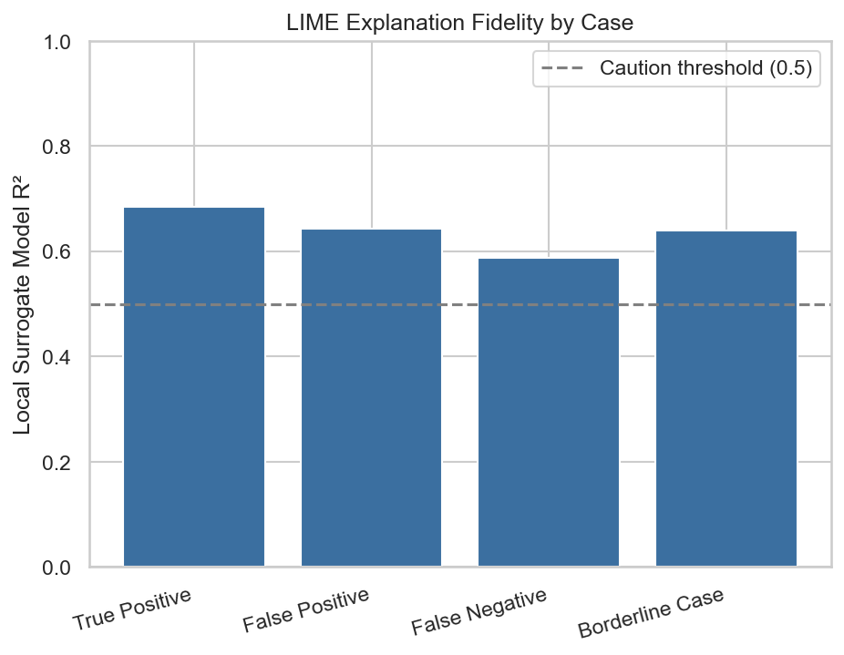
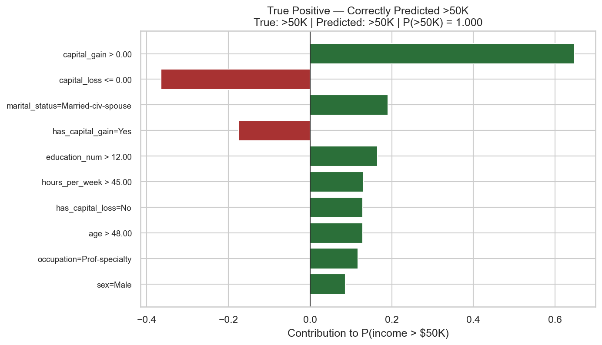
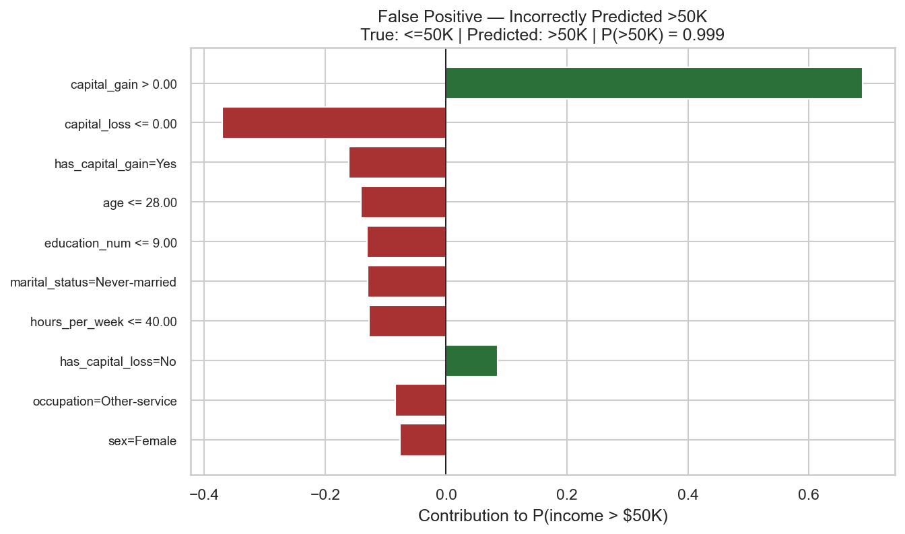
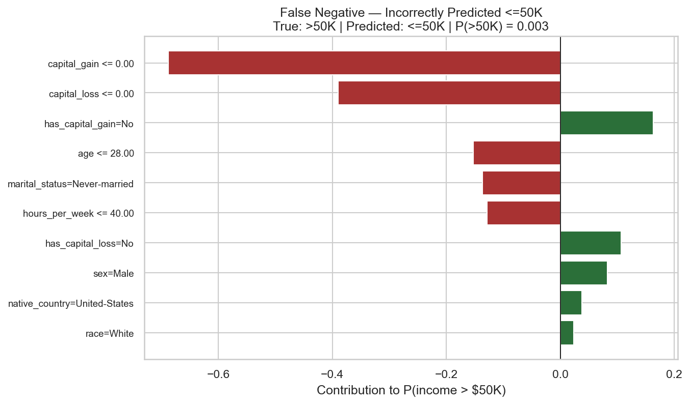
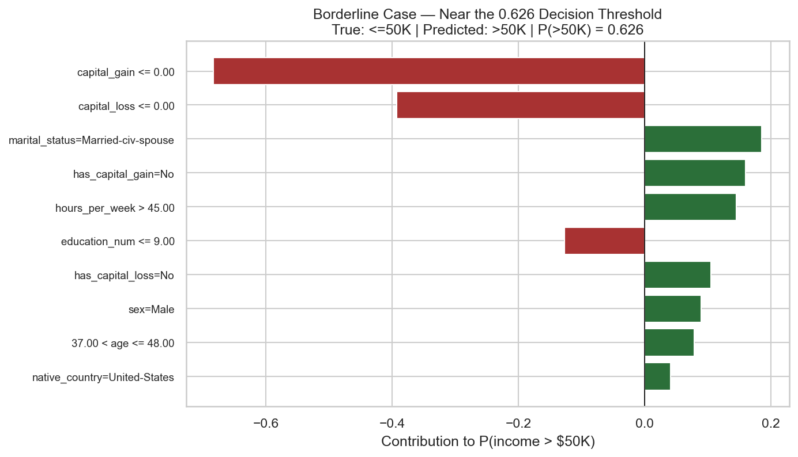

---

layout: default

title: Explaining Individual Predictions (LIME)

permalink: /lime/

---

## Goals and Objectives

The [MLP project](/feedforward-neural-network/) produced a feedforward neural network that predicts whether an individual earns more or less than $50,000 per year with a test ROC-AUC of 0.9141 — a genuinely strong result — but one delivered entirely as a black box. A network with 92 encoded input features and two hidden layers offers no direct way to answer the question a real stakeholder would actually ask: *why* did the model decide this specific person earns more or less than $50,000?

This project answers that question using LIME (Local Interpretable Model-Agnostic Explanations), applied directly to the trained MLP model and fitted preprocessor exported by that earlier project. The objectives were to:

- **Generate individual-level explanations in human-readable, raw feature terms** — `occupation = Exec-managerial`, not a one-hot column name — despite the model itself operating entirely in encoded, scaled feature space.
- **Select a small set of genuinely representative cases** rather than explaining predictions at random: a confident correct prediction, a confident incorrect prediction in each direction, and a case sitting exactly on the model's tuned decision threshold.
- **Assess the trustworthiness of each explanation**, rather than presenting every LIME output with equal, unstated confidence, by checking how well LIME's local linear surrogate actually fits the network's behaviour around each instance.
- **Surface any systematic patterns in what drives the model's decisions**, using the four explanations collectively rather than only reading each one in isolation.

## Application:  

LIME (Local Interpretable Model-Agnostic Explanations) is a model-agnostic technique for explaining the individual predictions of any "black box" machine learning model, regardless of its internal architecture. Rather than attempting to explain the model globally — a task that becomes intractable for complex models such as gradient boosting ensembles or deep neural networks — LIME explains one prediction at a time, answering the question: "why did the model make this specific decision for this specific observation?"

The core principle behind LIME is local approximation. For a given prediction, LIME generates a large number of perturbed variants of the input by slightly altering its feature values, and passes each variant through the original black box model to obtain predictions. It then fits a simple, inherently interpretable model — typically a weighted linear regression — to this local neighbourhood of perturbed points, with points weighted by their proximity to the original observation. Although the black box model's decision boundary may be highly non-linear across the full feature space, it can usually be well approximated by a straight line within a small local region. The coefficients of this local surrogate model reveal which features pushed the prediction up or down, and by how much, for that individual case.

This approach is model-agnostic by design — the same procedure applies whether the underlying model is a random forest, a support vector machine, or a deep neural network, because LIME only requires the ability to query the model for predictions, not access to its internal parameters. This makes it a widely applicable tool for building trust and accountability into machine learning systems wherever individual predictions carry consequences for real people.

This approach is applicable across many sectors and scenarios. Practical examples showing where LIME provides clear business value include:

🏦 **Finance**:

**Credit scoring**: A bank explains to a loan applicant precisely which factors — such as credit utilisation or length of credit history — drove a rejection, satisfying regulatory requirements for explainable adverse action notices.  

**Fraud alert triage**: Fraud analysts use LIME to understand why a transaction-monitoring model flagged a specific transaction as suspicious, allowing them to prioritise investigation effort and reduce false-positive escalations.  

**Algorithmic trading oversight**: Risk teams audit individual trade recommendations from a black box model to confirm that decisions are driven by legitimate market signals rather than spurious correlations.  

🏥 **Healthcare**:

**Diagnostic support**: A clinician reviewing a model's prediction that a patient is high-risk for a condition can see which specific test results and vital signs contributed most, integrating the model into clinical judgement rather than replacing it.

**Patient risk stratification**: Hospital administrators explain to a review board why a particular patient was flagged for a readmission-prevention programme, supporting accountable resource allocation.

**Treatment recommendation review**: Pharmacists validate individual drug-interaction risk predictions by inspecting which combination of prescribed medications the model weighted most heavily.

👥 **Human Resources**:

**Resume screening audits**: HR teams inspect why an automated screening model ranked a particular candidate highly or poorly, checking for reliance on inappropriate proxy variables and supporting fair hiring practices.

**Attrition risk explanation**: A people-analytics team explains to a line manager why a specific employee was flagged as a high flight-risk, translating a model score into actionable retention conversations.

**Performance model transparency**: Employees are given individual, feature-level explanations for algorithmically-informed performance ratings, supporting procedural fairness and employee trust.

🛍️ **Retail & Marketing**:

**Personalisation explanation**: An e-commerce platform explains to internal stakeholders why a specific customer was shown a particular offer, supporting marketing governance and campaign auditing.

**Churn prediction review**: Customer success teams inspect the specific behavioural signals — such as declining login frequency or support ticket sentiment — that drove a model's prediction that an individual customer is likely to churn.

**Dynamic pricing accountability**: Pricing teams verify that an individual price recommendation was driven by legitimate demand signals rather than sensitive or protected customer attributes.

## Methodology

**Inputs**: the trained MLP model, fitted preprocessor, and held-out test split (9,763 rows, 14 raw features) exported directly by the [MLP project](/feedforward-neural-network/), with no re-cleaning, re-splitting, or re-training required.

**Explaining in raw feature space.** LIME needs its perturbations expressed as a single numeric array, but the MLP itself only accepts the 92-column, one-hot-encoded and scaled representation produced by the fitted preprocessor. To reconcile these, the 7 categorical raw columns were label-encoded purely for LIME's internal perturbation logic, with a lookup table retained to translate back to the original category labels. A small prediction function then sits between LIME and the model: it takes LIME's perturbed numeric array, reconstructs a properly-typed DataFrame in the original 14 raw columns, passes it through the fitted preprocessor, and returns the network's predicted probabilities. A round-trip check — comparing predictions generated directly from raw data against predictions generated by passing that same data through this reconstruction function — confirmed a maximum discrepancy of 0, verifying the translation layer introduces no distortion.

**Reference distribution.** The explainer's perturbation statistics (feature means/standard deviations for numeric columns, category frequencies for categorical columns) were computed from the test set itself, rather than the training set, since only the test split was persisted by the MLP project. At 9,763 rows, this is a large and representative enough sample of the same population to serve this purpose reliably, while being immune to any distortion from the class-imbalance oversampling that was applied to the training set only.

**Case selection.** Rather than explaining predictions at random, four specific cases were selected using the tuned 0.626 decision threshold identified in the MLP project (not the default 0.5), to reflect the model's actual recommended operating point:

- **True positive** — the most confidently correct `>50K` prediction in the test set.
- **False positive** — the most confidently *incorrect* `>50K` prediction.
- **False negative** — the most confidently incorrect `<=50K` prediction.
- **Borderline case** — whichever test-set row sits closest to the 0.626 threshold itself, regardless of correctness.

**Explanation fidelity.** LIME's explanations are only as trustworthy as the local linear surrogate model's actual fit to the network's behaviour in that neighbourhood. Rather than presenting every explanation with equal, unstated confidence, the local surrogate's R² was recorded for each of the four cases, against a caution threshold of 0.5 below which an explanation would need to be treated more sceptically.

## Results

**All four explanations were sufficiently trustworthy to interpret with confidence.** Local surrogate R² ranged from 0.588 to 0.684 across the four cases — comfortably above the 0.5 caution threshold in every instance, meaning LIME's simple local linear approximation captured the network's actual local behaviour reasonably well in each neighbourhood explained.

**True positive (P(>50K) = 1.000).** A 56-year-old with a maxed-out `capital_gain` of 99,999, a postgraduate education, married, and working 70 hours a week was predicted `>50K` with maximum confidence. `capital_gain > 0` was overwhelmingly the largest single contributor (+0.6485), well ahead of marital status, education, and hours worked — an intuitively sensible, high-confidence prediction with no surprises.

**False positive (P(>50K) = 0.999).** A 19-year-old with only 6 years of education, working 24 hours a week, was nonetheless predicted `>50K` with near-total confidence — incorrectly, since their true income was `<=50K`. The explanation shows why: a non-zero `capital_gain` (34,095) contributed +0.6892, dwarfing the negative contributions from every other feature that would otherwise argue for a low income (age, education, hours worked all pushed the opposite direction, but were not nearly enough to overcome it). This is a genuine limitation surfaced by the explanation, not just an illustration of the method: the network appears to treat any non-zero `capital_gain` as an almost deterministic signal for `>50K`, regardless of how implausible the rest of the individual's profile is.

**False negative (P(>50K) = 0.003).** A 22-year-old with no capital gains, working 25 hours a week, was confidently predicted `<=50K` — incorrectly, as their true income was `>50K`. Here, `capital_gain <= 0.00` was the dominant contributor (-0.6876), reinforced by zero capital losses, young age, and short hours. Unlike the false positive above, this case is better read as the *true label* being the unusual outler for this feature profile, rather than the model reasoning poorly: a young part-time worker with no capital activity is a highly plausible `<=50K` profile in this dataset, and the network's confident, well-supported prediction simply turned out to be wrong for this individual (the true label here is the outlier, not the model's reasoning).

**Borderline case (P(>50K) = 0.626, exactly on the decision threshold).** A 41-year-old married man working 50 hours a week, with no capital gains or losses, sat precisely on the tuned decision boundary. The predicted `<=50K` was incorrect. `capital_gain <= 0.00` again pulled the prediction down (-0.6830), but was almost entirely offset by being married (+0.1858), working over 45 hours a week (+0.1447), and having no capital gains recorded as a flag in its own right (+0.1595) — a clear, concrete illustration of the threshold-tuning trade-off discussed in the MLP project, where a small shift in any one contributing factor would flip this individual's predicted class.

**A clear pattern emerges across all four cases: `capital_gain` and `capital_loss` dominate every single explanation, at strikingly consistent magnitudes.** `capital_gain`'s contribution ranged narrowly between +0.65 and +0.69 (or its negative equivalent) in every case, and `capital_loss` between −0.36 and −0.39, regardless of which of the four very different individuals was being explained. No other feature came close to this magnitude or consistency in any explanation. Given that 91.7% of records have zero `capital_gain` and 95.3% have zero `capital_loss` (as identified in the original EDA), this suggests the network has learned these two features as an unusually dominant, near-deterministic signal — likely because the rare non-zero values are so strongly correlated with `>50K` income in this dataset that they overwhelm the influence of every other feature, including ones — like age and education — that a human observer would expect to matter more evenly across cases.

## Conclusions

- **LIME successfully opened up the MLP's decision-making without requiring any change to the model itself.** Every explanation was generated directly against the existing trained network and preprocessor, using only the ability to query the model for predictions — consistent with LIME's model-agnostic design, and requiring no retraining or architecture changes.
- **Explaining in raw, pre-encoding feature space was the right choice for readability, and it was verified to introduce no distortion.** The round-trip check confirmed the translation between LIME's internal representation and the model's actual encoded input was exact, meaning the explanations shown are a faithful account of the model's real reasoning, not an artefact of the translation layer.
- **Checking explanation fidelity, rather than assuming it, was a worthwhile step.** All four cases cleared the fidelity threshold in this run, but this will not always be true for every prediction a model makes — the fidelity check itself is the more durable, reusable output of this project, independent of which four cases happened to be selected here.
- **The dominant finding is the network's near-deterministic reliance on `capital_gain` and `capital_loss`.** This is a legitimate and defensible modelling outcome, not a bug — these features genuinely are close to deterministic indicators of high income in this dataset — but it is also a meaningful limitation to be transparent about: the model's confidence is not always evenly informed by an individual's full profile, and predictions for the small minority of individuals with unusual combinations of capital activity and other features (as in the false positive case above) should be treated with more caution than the model's raw output probability alone would suggest.
- **The false positive and false negative cases illustrate two genuinely different failure modes**, and LIME made that distinction visible: one was the model overweighting a single strong-but-misleading signal, the other was the model behaving reasonably against a genuinely atypical true label. Distinguishing between these is only possible with an individual-level explanation — a global feature importance ranking alone would not have surfaced this difference.

## Next Steps

- **Counterfactual explanations.** A natural next step, examining the minimal change to an individual's features — most likely their `capital_gain` value, given the pattern found here — that would flip the model's prediction, directly extending this project's findings.
- **Investigate the capital_gain/loss dominance further.** A dedicated analysis of the network's sensitivity to `capital_gain` and `capital_loss` in isolation — for example, by systematically varying just these two features while holding all others constant — would help establish how much of the network's overall performance depends on this one signal, and how the model behaves for the minority of individuals where this signal is misleading.
- **Extend fidelity checking across a larger sample.** This project checked fidelity for four hand-selected cases; running the same check across a larger random sample of the test set would establish whether the fidelity levels seen here are typical, or whether certain regions of the feature space produce systematically less trustworthy explanations.
- **MLOps.** As previously noted in the MLP project, the exported artifacts and reproducible explanation pipeline built here are a natural fit for a future project examining how a model and its explanations would be versioned and monitored together in production.

## Python code:
You can view the full Python script used for the analysis here: 
[View the Python Script](/LIME_v1.py)
