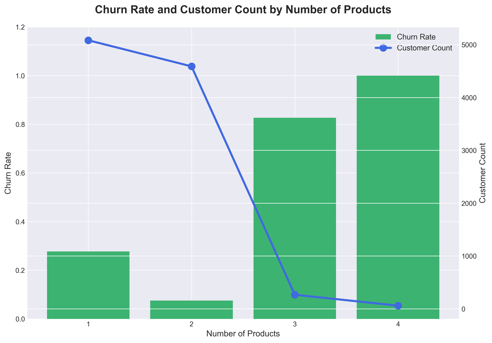
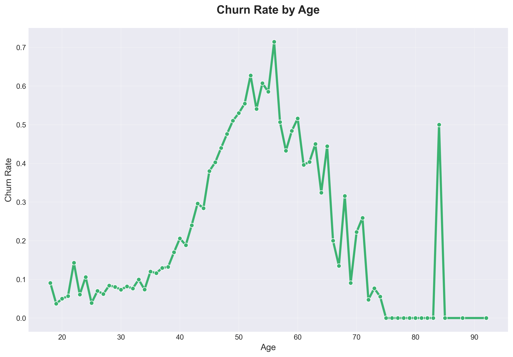
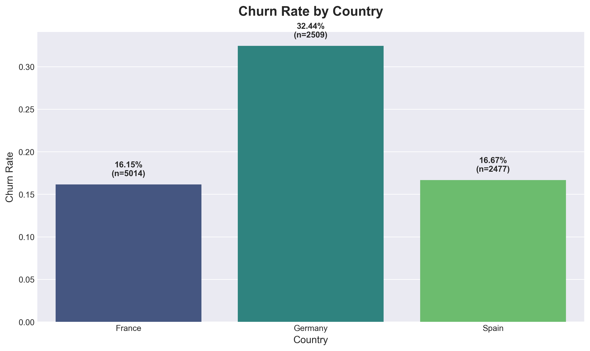
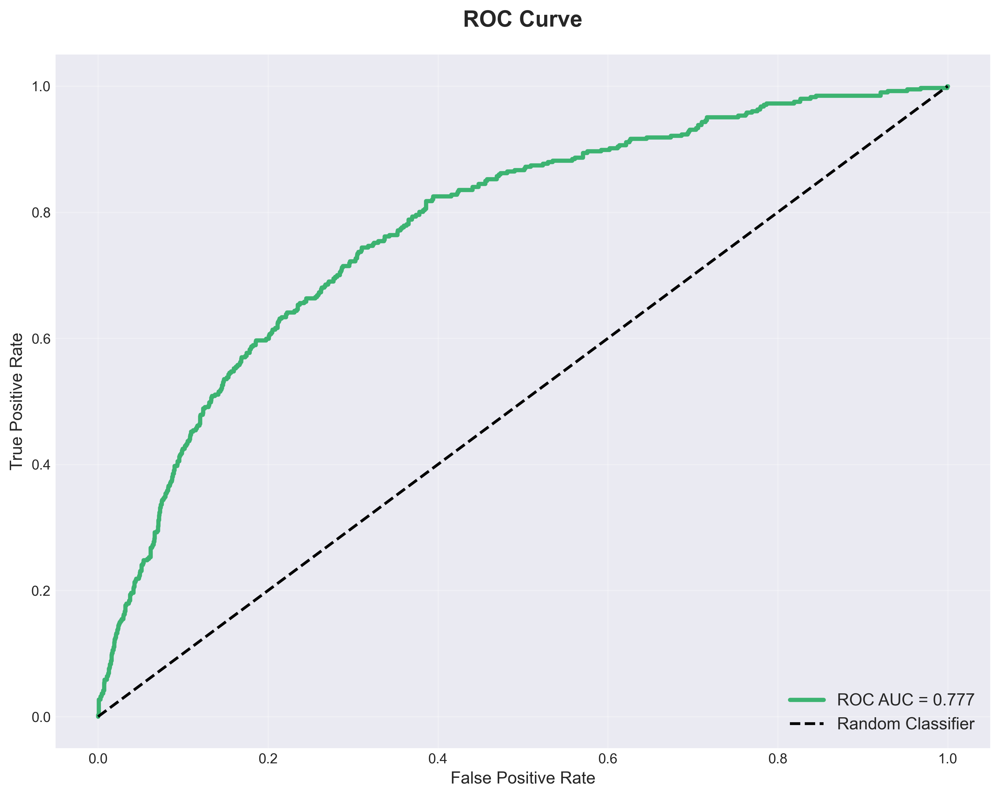
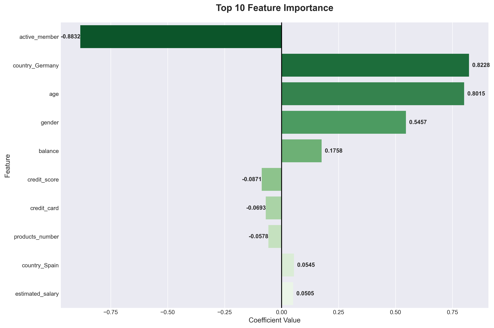
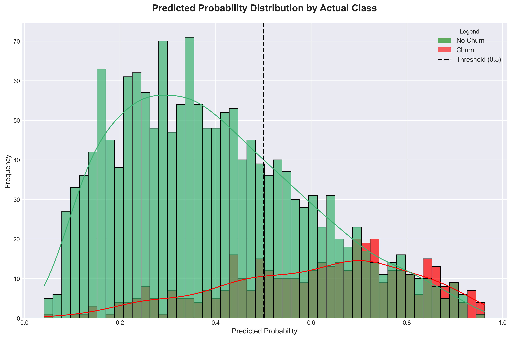
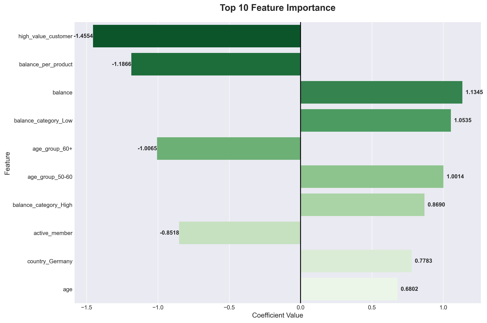

---

layout: default

title: Bank Customer Churn (Logistic Regression)

permalink: /logistic-regression/

---

## Goals and objectives:

The business objective is to predict the churn of bank customers.  A Logistic Regression model was built using customer features and historical customer churn outcomes to predict which current customers are predicted to leave, to be used to focus the implementation of customer retention strategies.  Customer churn prediction is highly relevant to real-world business problems.  Businesses across multiple sectors can implment such advanced analytics to identify at-risk customers, this analysis does not just benefit banks and financial institutions.

The Logistic Regression model produced accurate binary churn / no-churn predictions, which was further advanced using feature engineering to provide more accurate predictions and insight into causes and signals of churn.  The class imbalance (churn is far less common than non-churn) was handled using class weights and evalauting performance with suitable metrics (ROC-AUC, precision, recall, and F1-score).  The overall model was proven to support business understanding of customers at risk of churning, enabling efficient retention initiatives to reducing costs and increase the value of the overall customer base - clear business benefits. 

## Application:  

Details of how this is applicable to multiple industries to solve business problems, generate insight and provide tangible business benefits. 

**Logistic regression** is a fundamental statistical method used for classification tasks. At its core, logistic regression predicts the probability that a given input belongs to a particular class by applying the logistic (sigmoid) function to a linear combination of input features. The sigmoid function maps any real-valued number into a value between 0 and 1, making it ideal for probability estimation. This output can be interpreted as the likelihood of an observation belonging to the class, with a decision threshold (typically 0.5) used to make the final classification.  

For **binary classification** problems, the model learns weights for each feature that indicate how strongly that feature influences the probability of belonging to one class versus the other.  For example, in a medical diagnosis scenario predicting whether a patient has a disease, logistic regression might learn that certain symptoms or test results increase the probability of a positive diagnosis.  The model outputs a probability score, and any observation with a probability above the threshold is classified as the positive class, while those below are classified as negative.  This probabilistic nature is advantageous because it not only provides a prediction but also quantifies the model's confidence in that prediction.  

Logistic regression can be extended to handle **multi-class classification** problems through two primary approaches: **One-vs-Rest (OvR)** and **multinomial logistic regression** (also called softmax regression). 
* **One-vs-Rest** - separate binary logistic regression models are trained for each class, where each model distinguishes one class from all others combined. During prediction, all models generate probability scores, and the class with the highest probability is selected.
* **Multinomial logistic regression** -  generalises the binary case more naturally by using the softmax function to model the probability distribution across all classes simultaneously. This approach ensures that the predicted probabilities for all classes sum to 1, making it particularly suitable for classifying to multiple mutually exclusive categories (e.g. digit recognition, document categorisation, or iris species classification).

Logistic regression can be applied in a variety of scenarios across all industry sectors.  Example uses include:

* **Finance: Credit Default Prediction** - logistic regression models are extensively used for credit risk assessment and loan default prediction, to evaluate whether a loan applicant is likely to default on their payments.  The model takes into account various features such as credit score, income level, employment history, debt-to-income ratio, previous loan repayment behavior, and loan amount.  By analysing historical data from thousands of past borrowers, the model learns which combinations of these features are associated with higher default risk.  The output is a probability score between 0 and 1, representing the likelihood of default, supporting decisions on offering loans and setting interest rates.  This probabilistic approach supports data-driven lending decisions and risk exposure management, maintaining profitability while still serving customers.  
* **Medical: Disease Diagnosis and Screening** - logistic regression plays a crucial role in diagnostic decision support systems, particularly for screening and early detection of diseases.  For example in predicting the likelihood of heart disease based on patient characteristics and clinical measurements.  Medical practitioners input patient data including age, blood pressure, cholesterol levels, blood sugar levels, smoking status, family history, and results from tests like electrocardiograms.  The logistic regression model, trained on extensive patient databases, outputs a probability that the patient has or will develop heart disease.  This probability helps physicians prioritise which patients need immediate intervention, further diagnostic testing, or preventive care. The interpretability of logistic regression is particularly valuable in medical settings because doctors can understand which factors are driving the prediction, allowing them to explain risks to patients and make informed clinical decisions that combine the model's output with their professional expertise.  
* **Retail: Customer Churn Prediction** - Retail companies, especially those with subscription-based models or loyalty programs, use logistic regression to predict customer churn, which is the likelihood that a customer will stop doing business with them.  The model analyses customer behaviour patterns including purchase frequency, recency of last purchase, average transaction value, etc.  By identifying customers with high churn probabilities, retailers can proactively implement retention strategies such as personalised offers or targeted discounts.  
* **Manufacturing: Quality Control and Defect Detection** - In manufacturing, logistic regression is applied to predictive quality control, helping identify whether products will meet quality standards or be defective.  Production facilities collect vast amounts of data from sensors and inspection points throughout the manufacturing process. A logistic regression model trained on this data can predict the probability that a product being defective based on the process parameters observed during its production. Products can be identified as high-risk, enabling additional focussed additional checks or handled differently.  This can reduce waste, improve overall product quality, minimise risk and exposure, and optimise efficiency and profitability.  

## Methodology:  

The dataset used is the public ally available 'Bank Customer Churn Dataset' from Kaggle [here](https://www.kaggle.com/datasets/gauravtopre/bank-customer-churn-dataset).  The dataset contains 10,000 records, containing 10 features and a single target variable, which were used to train and test the Logistic Regression model.

The dataset contains both numerical and categorical features, which logistic regression can handle effectively.  The categorical features (Country and Gender) cannot be used in their raw text form, but are converted into a numerical representation, using encoding, to enable the mathematical modelling.  Binary encoding was applied to the gender field, and one-hot encoding to the Country field (having 3 distinct values).

The overall method applied was:

* **Class Imbalance Ratio (CIR)** metric calculated used to quantify the disparity between the two classes in the dataset, for this project the "positive" minority class (churn) and the "negative" majority class (no churn).
* **Descriptive analysis** of the data to understand high-level trends and features of the data
* **Data preprocessing** to remove the 'customer_id' feature as it's not predictive, encode the binary field 'gender', and one-hot encode the features 'country', 'age_group', 'balance_category', and 'credit_category' (the later being engineered fields - see later).
* **Scale data** in numeric fields (non-binary) to support optimal logistic regression model creation and more meaningful analysis of feature importance.
* **Fit the logistical regression model** using pre-processed and scaled training data.  The data was split 80/20 into training and testing data.  
* **Prediction and model validation** was undertaken using the trained model on the testing dataset, with the classification predictions compared to the known outcomes to determine the model quality.  

After the classification model was created using the original features and validated, further research was undertaken to determine if the creation of engineered features enable a model with increased predictive power.

* **Feature engineering** to created features to enhance model performance
* **Model creation and validation** was undertaken including the engineered features as with the initial model, enabling a comparison of the results between the two classification models.  

Class Weights - Most logistic regression implementations (like Scikit-Learn) allow you to set class_weight='balanced'. This penalises the model more for misclassifying the minority class.
Threshold adjustments - Instead of using the default 0.5 probability threshold to classify an item, you might lower it (e.g., to 0.3) to make the model more "sensitive" to the minority class.

## Results:

Results from the project related to the business objective.

feature engineering by creating new variables such as balance-to-product ratios or customer engagement scores

### Class Imbalance Ratio (CIR):
The CIR determined that the churn rate (positive binary class outcome) was 20.4%, producing a Class Imbalance Ratio (churn/no-churn): 0.26.  As a result the model validation will need to consider metrics beyond Accuracy, also considering Precision, Recall, F1-Score and **Area Under the Precision-Recall Curve (AUPRC)**.  It should be noted that the model will achieve ~79.6% accuracy, simply by always predicting a 'no-churn' outcome.

### Descriptive Statistics:
Descriptive analysis determined some high-level patterns in the data such as the rate of churn by features such as number of products, customer age and country.  Customers are from three countries; France , Germany, Spain.  

The churn rate by number of products subscribed chart shows that the churn rate is very high with customers who have 3+ products, though this relates to a relatively small proportion of customers, approximately 1 in 30. 

  

The churn rate by age increases steadily until the age of ~56, where it peaks at a churn rate of approximately 72%.  For ages greater than 56 the churn rate rapidly decreases, subject to a potential outlier at the age of 84 (the spike shown on the chart).

  

The churn rate by customer country highlights that rate for customers in Germany (32.4%) is approximately twice that of customers in Spain (16.7%) and Italy (16.2%).  

### Model fitting and validation:
Using the training data the fitted model was validated produced performance metrics:

* Accuracy: 0.7135  
* ROC-AUC: 0.7772 
* F1-Score: 0.4987
* Precision: 0.3872
* Recall: 0.7002

The model correctly predicts whether a customer will churn or stay approximately 71.4% of the time. While this seems good, accuracy alone can be misleading when dealing with imbalanced datasets, as identified earlier.

The ROC-AUC score is considered the most-important metric for imbalanced classification.  It shows the model's ability to distinguish between classes, For ROC-AUC on a two class predictor, the range is 0.5 (random guessing) to 1.0 (perfect classification).  A score of 0.78 indicates strong discriminative ability.  This can be interpreted as the model havings a 78% chance of ranking a randomly selected churning customer higher than a randomly selected non-churning customer in terms of churn probability.

The precision score of 0.39 mean that of the customers predicted to churn, 39% actually do.  This is not a high score, but compared to an average of 20% of customers churning this is an improvement on a random guess, and reduces wasted retention resources on customers who wouldn't churn anyway.

The recall of 0.70 means that of all customers who actually churn, the model identifies 70%.

Note that the precision and recall values relate to the positive class only (in the case of binary classification), i.e. the predictions for churners.  This is the most relevant metric for business purposes, as the focus is the accuracy of the "at-risk" predictions.

The F1-Score of 0.50 is considered good for imbalanced data (this score is a harmonic of Precision and Recall).  This score shows the model can identify churners while not generating too many false alarms.

The ROC curve plots False Positive Rate (FPR) against True Positive Rate (TPR/Recall) at different probability thresholds.  This curve shows the trade-off between catching more churners (higher TPR).  For the ROC curve the diagonal line is the random classifier baseline.  The green line is our model's curve.  The more the line bows towards the top left the better, as the ROC-AUC score is the area under the line as a percentage of the total 'square' area.
* FPR = False Positives / All Actual Negatives
* TPR/Recall = True Positives / All Actual Positives

The confusion matrix for the model shows the results of the model predictions, providing vital insight into where the model performs well and where it makes errors.  

### Feature Importance:

The feature importance analysis reveals which customer characteristics have the strongest influence on churn probability by examining the coefficients from the logistic regression model.  Each feature's coefficient indicates both the direction and magnitude of its impact, where positive coefficients indicate that higher values of that feature increase the likelihood of churn, and similarly negative coefficients indicate that higher values decrease churn probability.  

The plot below shows that being an active member significantly reduces the likelihood of churn, whereas a customer from Germany is likely to increase the likelihood of churn.  

The overall model can predict the customers most likely to churn, and the feature analysis can be used to suggest why they might churn, enabling targeted interventions.  This shows that the model is more than a black-box prediction tool, and can be used to support business decisions into actions to take to prevent churn.

### Predicted Probability Distribution:  

The predicted probability distribution visualises how confident the logistic regression model is in its predictions for both churned and non-churned customers.  The x-axis shows the model's predicted probability that a customer will churn, ranging from 0% chance of churn, to 100% chance of churn.  The y-axis shows the volume of customers that received that probability score.  The two distributions show:
* **Green**: Customers who actually DID NOT churn in reality - this is clustered towards 0 showing most customers who didn't churn get LOW probability scores (model correctly says "unlikely to churn")
* **Red**: Customers who actually DID churn in reality - this is clustered near 1 showing most customers who did churn get HIGH probability scores (model correctly says "likely to churn")

### Prediction Threshold:

The prediction threshold can be adjusted, to allow for the trade-off of recall and precision.  The above values of Precision = 0.3872, and Recall = 0.7002, are based on a default prediction of threshold of 0.5.  In this example lowering the prediction threshold would catch more churners (increases recall) but decreases precision, meaning you identify more at-risk customers but also generate more false alarms.  

An example practical application of adjusting prediction thresholds could be the use retention campaigns.  If they are inexpensive and missing a churner is costly, the bank might operate at a point with high recall (catch 70-80% of churners) while accepting lower precision (more false positives); conversely, if the retention budget is limited or campaigns are expensive, they might choose high precision (ensure most flagged customers are truly at risk) while accepting that some churners will be missed. 

### Feature Engineering:

The initial model uses the features included in the original data.  With the business goal to generate an accurate prediction model, the original logistic model was enhanced with generated engineered features utilising the original features.  This is advanced technique used to enhance model performance.  For this project 7 features were engineered:
* **balance_per_product**: Balance divided by number of products (customer value metric)
* **engagement_score**: Tenure × Products (loyalty indicator)
* **age_group**: Categorical age bins
* **balance_category**: Categorical balance bins
* **salary_balance_ratio**: Income to balance ratio (financial health)
* **high_value_customer**: Binary flag for customers with multiple products and high balance
* **credit_category**: Categorical credit score bins

### Model fitting and validation (with feature engineering):

Using the enhanced set of features, a set of training data was used to fit the logisitic regression model.  The resulting model was validated to produce performance metrics against the set of enhanced testing data:

* Accuracy: 0.7405
* ROC-AUC: 0.8028
* F1-Score: 0.5354
* Precision: 0.4211
* Recall: 0.7346

High-level analysis shows that the overall accuracy increased by 2.7% from 71.4% to 74.1%, and more meaningfully the Precision increased by 3.4% to 42.1% and the Recall increased by 3.4% to 73.4%.

In practicality, this means the model is able to identify more of the true churners, which fewer false positives are identified.  This both means that true churners can be targetted by retention activities, and less wasted effort on retention activities targeting those who won't churn.  This yeilds tangible savings and efficiencies to the bank, as well as retaining more customers, which is a primary goal.

It is important to understand that while the model including the 7 engineered features has improved predictive power, this does not mean that each engineered feature individually improves the model, nor that any of the original features should be trained.  Some engineered features may not help or could even hurt model performance due to:
* Adding noise rather than signal
* Creating multicollinearity (high correlation with existing features)
* Overfitting to training data
* Not capturing meaningful patterns

### Feature Importance (with feature engineering):

Considering the warning that some engineered features reduce model performance, the feature importance of the fitted model was analysed.  It shows that 6 of the top 7 important features are associated to the engineered features, and hence the most important features differs significantly to that for the model without the engineered features.  Previously we saw that churn rate has a strong association to age, but in a non-linear manner, however the introduction of age groups (as an engineered feature) allows a more nuanced and meaningful use of age as a predictive feature as shown by 'age group' = '60+' and 'age group' = '50-60' being two important features, one to decrease churn probability and the other increasing churn probability.  It also logically suggests that the generic 'age' feature may be redundant with the introduction of the 'age group' feature - this would require further investigation.

The updated feature importance chart below can be compared to the previous version to visualise the differences.  There are more features that have a meaningful contribution to the prediction.

## Conclusions:

### Model Performance and Feature Engineering Impact:

Two logistic regression models were developed and compared: a baseline model using only the original dataset features, and an enhanced model incorporating seven strategically engineered features. The enhanced model demonstrated measurable improvements across all key performance metrics, due to the engineered features:

* Accuracy +2.7% to 74.1%
* Precision increased by 3.4% to 42.1% and the
* Recall increased by 3.4% to 73.4%.

These improvements validate the value of thoughtful feature engineering.  The engineered features successfully captured customer behavioral patterns (engagement_score, balance_per_product), revealed financial relationships (salary_balance_ratio), created interaction effects (high_value_customer flag), and enabled better customer segmentation (age_group, balance_category, credit_category). By distilling complex customer information into clearer predictive signals, these features guided the model to learn more meaningful patterns from the data.

The enhanced model's ROC-AUC score (0.80) indicates strong discriminative ability, there is an 80% probability the model correctly ranks a churning customer higher than a non-churning customer.  This performance, combined with the model's interpretability through feature importance analysis, makes it well-suited for production deployment in a banking environment.

### Business Value and Strategic Benefits:  

The logistic regression model delivers substantial business value through multiple channels:
1. Proactive Customer Retention - The model identifies at-risk customers before they churn, enabling the bank to shift from reactive to proactive retention strategies. Rather than blanket campaigns targeting all customers, the bank can implement targeted interventions for those most likely to leave.  This proactive approach increases retention effectiveness while improving customer experience.
2. Significant Cost Savings - Customer acquisition costs are higher than retention costs, making churn prevention economically critical. The enhanced model's precision minimises wasted resources on customers who would have stayed regardless.  Simultaneously, the recall ensures the bank captures a high percentage of actual churners, translating to focusing retention budgets on the right customers, therefore the model dramatically improves return on investment.
3. Optimized Resource Allocation - The model generates probability scores (0.0 to 1.0) for each customer, enabling sophisticated prioritisation strategies, based on the risk of churning. A risk-based allocation ensures resources are deployed where they will have the greatest impact.
4. Actionable Strategic Insights - Beyond predictions, the model reveals why customers churn through feature importance analysis.  This supports the ability to provide personalised retention offers and services.  As an example inactive customers and those with a low balance correlate with churn risk.  These insights drive strategic initiatives beyond individual customer targeting, informing product development, service design, and long-term customer relationship strategies.
5. Quantifiable Return on Investment - For a bank with 100,000 customers experiencing 20% annual churn (20,000 churners), the enhanced model delivers measurable financial impact.  Identfying ~35k at-risk customers, of which ~15k are true churners.  The cost of running retention campaigns is outweighed by the financial benefit of retaining customers.

### Model Interpretability and Deployment Readiness:
A critical advantage of logistic regression over more complex "black box" algorithms is its inherent interpretability.  Stakeholders can understand exactly which customer characteristics drive churn predictions and why specific customers receive certain risk scores. This transparency builds trust with business users, facilitates regulatory compliance, and enables continuous model refinement based on domain expertise.  

The model's probability-based output provides operational flexibility.  Decision thresholds can be adjusted based on changing business conditions, such as budget constraints or strategic growth.

### Key Takeaways:
* Feature engineering significantly enhances model performance.   
* Logistic regression remains highly effective for business classification problems delivering strong predictive performance, even compared to more complex machine learning techniques.
* Logistic Regression maintains interpretability, a crucial requirement in banking and other regulated industries
* Class imbalance can be handled handling, using balanced class weights and evaluating performance through ROC-AUC, precision, recall, and F1-score, rather than accuracy alone.  This ensures the model genuinely learns to identify the minority class (churners) rather than defaulting to the majority class.
* Predictive models enable strategic transformation. Beyond tactical benefits like cost savings, the model provides strategic insights into customer behavior patterns that inform product development, service design, and long-term customer relationship strategies.
* Data science delivers measurable business value. The model's outputs demonstrates that well-designed analytical solutions directly impact organisational performance, making data science a strategic asset rather than a technical capability.  It supports proactive rather than reactive customer management, evidence-based resource allocation, and data-driven insights that inform organisational strategy. The model's interpretability, combined with its strong performance, makes it deployment-ready for production use in a banking environment where both accuracy and transparency are essential.

## Next steps:  

Advanced analytics and prediction models require continuous evolution to maximise business value and maintain effectiveness. Several opportunities exist to enhance this logistic regression model's performance and operational impact. These improvements would build upon the current foundation while preserving model interpretability and operational reliability—critical requirements in a banking environment.

### Model Performance Optimisation:

**Hyperparameter Tuning**
* Apply grid search or randomized search to optimize regularization strength (C parameter), solver choice, and convergence tolerance  
* Use cross-validation to ensure improvements generalise beyond the training set  

**Decision Threshold Optimisation**
* Conduct cost-benefit analysis incorporating customer acquisition costs, retention campaign costs, and customer lifetime value
* Select the probability threshold that maximises net business value rather than defaulting to 0.5
* Consider different thresholds for different customer segments based on their strategic importance

**Algorithm Comparison**
* Benchmark performance against ensemble methods (Random Forest, Gradient Boosting, XGBoost) to quantify potential accuracy gains
* Evaluate the trade-off between increased predictive power and reduced interpretability
* If ensemble methods significantly outperform logistic regression, consider hybrid approaches (e.g., logistic regression for transparency, ensemble for final scoring)

### Feature Engineering and Selection:

**Feature Refinement**
* Remove highly correlated features (correlation >0.9) that provide redundant information
* Eliminate features with near-zero coefficients that contribute minimal predictive value
* Conduct systematic ablation studies: remove each feature group individually, measure performance impact, and eliminate those that don't contribute
* Apply L1 (Lasso) regularization to automatically drive weak feature coefficients to zero, enabling data-driven feature selection

**Feature Consolidation**
* Evaluate whether derived features can replace original features (e.g., use engineered 'age_group' instead of raw 'age' if performance is equivalent)
* Test interaction terms between key features to capture non-linear relationships
* Validate that each retained feature provides unique, non-redundant information

### Training Data Enhancement:

**Expanded Training Dataset**
* Incorporate additional historical customer data to increase sample size and improve model generalisation
* Collect data across multiple time periods to capture seasonal patterns and temporal trends
* Ensure training data represents the full diversity of the customer base

**Feature Expansion**
* Identify and collect additional customer attributes (e.g., transaction frequency, customer service interactions, digital engagement metrics, product usage patterns)
* Test new features incrementally, measuring marginal performance gains
* Balance the cost of data collection against predictive value improvements

### Model Deployment and Ongoing Management:

**Production Deployment**
* Integrate model into the bank's CRM system for automated risk scoring
* Establish clear escalation procedures for high-risk customers

**Performance Monitoring**
* Track key metrics (ROC-AUC, precision, recall, F1-score) on holdout validation sets monthly
* Monitor prediction distribution to detect shifts in customer behavior patterns
* Measure actual business outcomes: retention campaign success rates, cost per retained customer, revenue preserved

**Model Maintenance**
* Implement temporal validation using time-based train-test splits to ensure predictions remain stable as customer behavior evolves
* Establish automated retraining triggers when performance degrades beyond acceptable thresholds (e.g., ROC-AUC value drops below a threshold)
* Schedule regular model reviews regardless of performance to incorporate new data and business insights

**Business Impact Assessment**
* Conduct A/B testing to compare retention outcomes between model-guided interventions and traditional approaches
* Calculate realised ROI by tracking actual customers retained versus campaign costs
* Gather feedback from retention teams to refine model outputs and operational workflows

## Python code:
You can view the full Python script used for the analysis here: 
[View the Python Script](/Logistic Regression.py)
