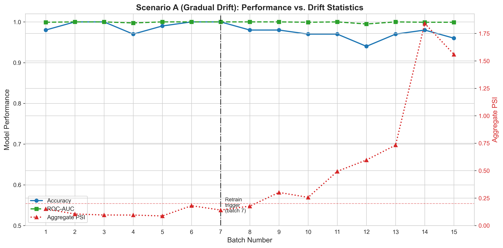
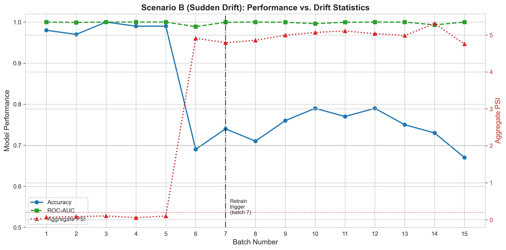
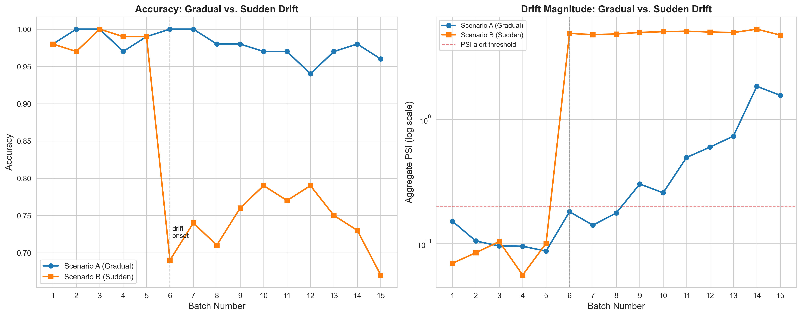
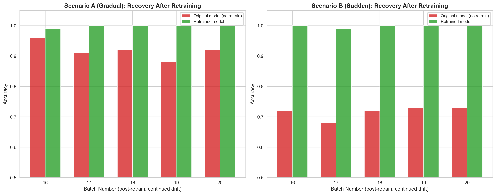
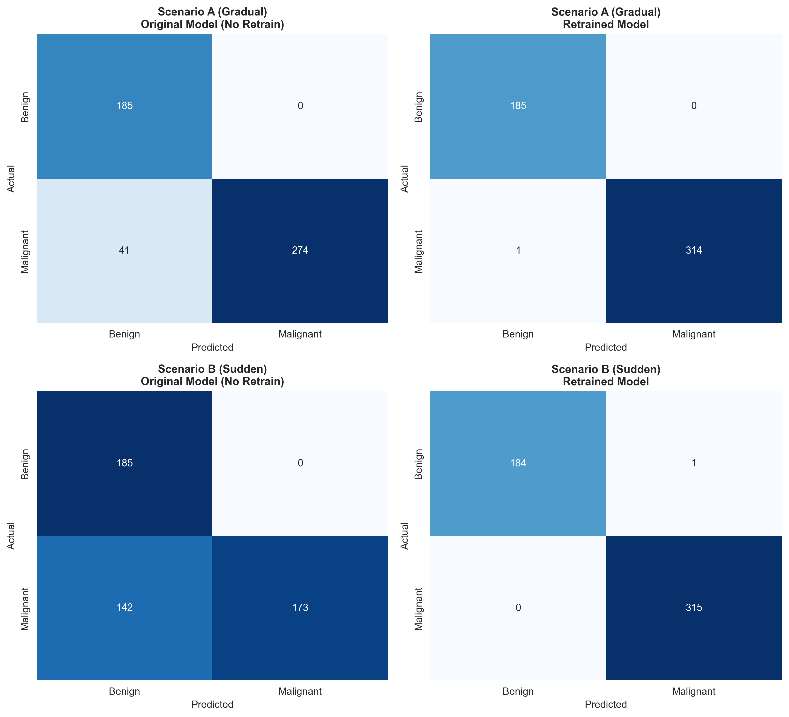

---

layout: default

title: Model Drift Monitoring & Retraining (MLOps)

permalink: /mlops/

---

# This project is in development

## Goals and objectives:

Every other project in this portfolio ends at the same point: a model is trained, tuned, evaluated on a held-out test set, and the results are reported. The [Gradient Boosted Trees](https://marcgrover-datascience.github.io/gradient-boosted-trees/) project, for example, concludes with an XGBoost classifier achieving 95.61% test accuracy and a ROC-AUC of 0.9947 on the Wisconsin Breast Cancer Diagnostic dataset — a genuinely strong result, obtained through rigorous four-phase hyperparameter tuning. But a test-set score is a snapshot, not a guarantee. It says nothing about what happens after that model is deployed and starts making predictions on data the world keeps generating.

This project picks up exactly where that one leaves off. The business scenario is a clinical decision support tool: the tuned XGBoost classifier from the Gradient Boosted Trees project has been deployed to flag fine needle aspirate (FNA) biopsy measurements for priority pathology review. The question this project answers is deliberately not "which model performs best?" — that question was already answered. It is: **how do we know when a deployed model is no longer trustworthy, and what do we do about it?**

This is intentionally a different kind of project from every other one in this portfolio. It is a process and engineering project rather than a modelling project, and that distinction is a feature, not a limitation — no other project here demonstrates what happens *after* a model is validated on a test set. The objective is to simulate realistic drift in incoming feature distributions over time, detect that drift statistically using two complementary methods (Population Stability Index and the Kolmogorov-Smirnov test), quantify the resulting degradation in predictive performance, trigger a retraining decision against a defined threshold, and demonstrate concretely that retraining recovers performance. Two distinct drift patterns — a slow, gradual drift and an abrupt, sudden one — are simulated side by side, since a monitoring approach that is only tested against one kind of drift provides limited assurance about how it behaves against the other.

The scope is kept deliberately honest. A portfolio script can demonstrate the *principles* of drift monitoring and automated retraining triggers; it cannot replicate a full production MLOps stack — model registries, CI/CD pipelines, container orchestration, or a live feedback loop from confirmed clinical outcomes. Where this project stops short of a genuine production implementation is stated explicitly in the Next Steps section, in the same way every other project in this portfolio uses that section to gesture honestly at real-world extensions beyond what a self-contained script can show.

## Application:  

MLOps (Machine Learning Operations) is the set of practices, tooling, and organisational discipline that governs how machine learning models move from a data scientist's experimental notebook into reliable, monitored, and maintainable production systems. It extends the established principles of DevOps — version control, continuous integration, automated testing, and continuous deployment — to address challenges unique to machine learning, most notably the fact that a model's behaviour depends not only on code but on the data it was trained on and the data it subsequently encounters in production.

The core disciplines within MLOps span the full model lifecycle. Version control extends beyond code to encompass datasets, feature definitions, and trained model artefacts, ensuring any production prediction can be traced back to the exact code, data, and parameters that produced it. Continuous integration and deployment (CI/CD) pipelines automate the testing, packaging, and release of models, replacing ad hoc manual handovers with repeatable, auditable processes. Once deployed, monitoring tracks not just system health but model-specific concerns such as prediction drift and data drift — the gradual divergence between the data a model was trained on and the data it now receives, which silently degrades accuracy even when the underlying code has not changed. Automated retraining pipelines, triggered by drift detection or scheduled cadence, close the loop by keeping models current without requiring manual reintervention for every update.

MLOps matters commercially because the gap between a promising model in a notebook and a model reliably serving predictions in production is where the majority of machine learning initiatives fail to deliver value. Robust MLOps practice is what allows an organisation to move from isolated proofs of concept to a portfolio of dependable, continuously improving production models.

This approach is applicable across many sectors and scenarios. Practical examples showing where MLOps provides clear business value include:

💻 **Technology & SaaS**:

**Recommendation engine reliability**: A streaming platform uses automated CI/CD pipelines to safely deploy updated recommendation models multiple times per week, with automated rollback if key engagement metrics regress post-deployment.

**A/B testing infrastructure**: A product team runs controlled experiments comparing model versions in production, using MLOps tooling to route traffic and compare business metrics before a full rollout.

**Feature store management**: Engineering teams maintain a centralised feature store ensuring the exact same feature calculations are used in both model training and live production inference, eliminating training-serving skew.

🏦 **Finance**:

**Fraud model freshness**: A payments company automatically retrains fraud detection models on a rolling basis as fraud patterns evolve, with drift monitoring triggering earlier retraining when detection performance begins to degrade.

**Regulatory model governance**: Financial institutions maintain full lineage and version history for credit risk models, satisfying regulatory requirements to reproduce and justify any historical lending decision.

**Trading model deployment safety**: Quantitative trading desks use staged, monitored deployment pipelines to roll out updated models gradually, limiting financial exposure to newly deployed model errors.

🏭 **Manufacturing**:

**Predictive maintenance at scale**: A manufacturer deploys and monitors hundreds of predictive maintenance models across different factory sites, using centralised MLOps tooling to manage versioning and performance tracking consistently across locations.

**Quality control model updates**: Computer vision models inspecting products on a production line are automatically retrained as new defect types are labelled, with monitoring ensuring updated models are validated before replacing the live model.

**Supply chain forecasting governance**: Demand forecasting models are automatically re-evaluated against actual outcomes each period, with underperforming models flagged for retraining before they materially affect inventory decisions.

🏥 **Healthcare**:

**Clinical model validation pipelines**: Healthcare providers enforce rigorous, auditable validation and approval stages before any diagnostic support model update reaches clinical use, supporting patient safety and regulatory compliance.

**Drift detection for changing patient populations**: Hospitals monitor deployed risk-prediction models for data drift as patient demographics or care protocols shift over time, triggering review before predictive accuracy degrades in ways that could affect care decisions.

**Reproducible research-to-deployment pathways**: Health systems maintain full reproducibility between the research environment in which a model was validated and the production environment in which it is deployed, a critical requirement for clinical accountability.

## Methodology:  

This project reuses the tuned XGBoost classifier and the Wisconsin Breast Cancer Diagnostic dataset established in the [Gradient Boosted Trees](https://marcgrover-datascience.github.io/gradient-boosted-trees/) project without modification. This is a deliberate methodological choice: introducing a new model or dataset would undermine the "this is what happens after you build the model" premise that differentiates this project from the rest of the portfolio. The reference model is reconstructed using the exact optimal hyperparameters identified there (250 estimators, learning rate 0.05, maximum depth 3, subsample and colsample_bytree of 0.6, gamma 0.0, reg_lambda 0.5), using the same 80/20 stratified train-test split (random_state=42).

**Drift-target features** — three features are selected as the target of the simulated drift: *worst area*, *worst perimeter*, and *worst concave points*. These are drawn from the same tightly correlated cluster of cell-nucleus size and shape measurements identified as the dominant predictive signal throughout the supervised learning series — two of the three (*worst perimeter* and *worst concave points*) rank in the Gradient Boosted Trees model's own top three features by gain importance. Drifting the features the model relies on most heavily produces a meaningful, detectable performance impact, consistent with a realistic cause such as a change in imaging equipment or measurement protocol.

**Synthetic batch generation** — each incoming batch of 100 observations is constructed by resampling (with replacement, class-stratified to preserve the dataset's original benign/malignant balance) from the full 569-observation Wisconsin dataset, then applying a mean shift to the drift-target features only. The true diagnosis label travels with each resampled observation unchanged: a shift in *measured* feature values does not change the underlying biology of a tumour, so ground truth remains valid even as the features observed at prediction time drift away from what the model was trained on — mirroring a setting where pathology-confirmed outcomes eventually become available for a batch, allowing retrospective monitoring even though they were not available at prediction time.

**Two drift scenarios** are simulated, each across 15 monitored batches followed by 5 further batches to test recovery:

- **Scenario A — Gradual drift:** batches 1–5 are stable (no shift); from batch 6 the mean shift ramps up by +0.05 standard deviations per batch, reaching +0.50 SD by batch 15 — simulating a slow equipment or measurement drift.
- **Scenario B — Sudden drift:** batches 1–5 are stable; from batch 6 a fixed +1.5 SD shift is applied instantly and held constant — simulating an abrupt equipment change, such as a scanner recalibration or replacement.

**Drift detection** — for each batch, PSI and the KS test are computed per drift-target feature against the original training distribution, using quantile-based binning (10 bins) for PSI. A drift alert fires on a batch if any feature's PSI exceeds the conventional industry threshold of 0.20, or if any feature's KS test returns p < 0.05. Two consecutive drift-alert batches trigger the retrain decision point — a simple persistence rule that avoids reacting to a single noisy batch. Monitoring in this simulation deliberately continues past the trigger point for the full batch sequence, rather than stopping there as an operational system would, so that the cost of inaction remains visible on the same chart as the detection point.

**Retraining** is performed as an explicit, separate step once the trigger condition is met — not fired automatically inside the monitoring loop, reflecting a deliberate human-in-the-loop decision rather than a fully autonomous one. The retrained model is fitted on the original training set combined with the labelled observations from the drifted batches collected since the trigger fired, rather than on the drifted data alone, to avoid the retrained model overfitting to a small recent window and losing the general patterns learned from the full original training distribution.

**Recovery evaluation** — a further 5 batches are generated continuing the same drift pattern (the underlying cause of drift has not been fixed — only the model has been updated to account for it), and both the original and retrained models are evaluated on these identical batches for a direct, apples-to-apples comparison. Beyond accuracy and ROC-AUC, a full classification report — precision, recall/sensitivity, specificity, F1-score, and a confusion matrix — is computed on the pooled post-retrain observations for both models, since accuracy alone does not surface the clinically critical false negative rate: a malignant tumour misclassified as benign is a materially more serious error than the reverse in this business scenario, and this is the same reasoning already applied to metric selection in the [Data Science Workflow](https://marcgrover-datascience.github.io/data-science-workflow/) page.

## Results:

### Reference model benchmark

The reconstructed XGBoost model achieves a test accuracy of 95.61% and a ROC-AUC of 0.9947, confirming exact parity with the Gradient Boosted Trees project benchmark before any drift is introduced.

### Detection: gradual vs. sudden drift

In Scenario A, the retrain trigger fires at batch 7 — but accuracy at that point is still 100%. Aggregate PSI has already climbed past the 0.20 alert threshold while performance shows no visible sign of a problem at all. This is the central finding of the gradual scenario: **distributional drift is detectable well before predictive performance visibly degrades.** Per-feature detail at the trigger batch shows PSI on its own had not yet crossed 0.20 for any individual feature (0.153, 0.106, and 0.164 respectively) — it was the KS test, significant on *worst area* (p = 0.010), that fired first. PSI and KS do not always agree at the margin, and reporting both rather than relying on either alone is precisely what caught this batch.

Scenario B tells a starkly different story. The instant the step-change shift is applied at batch 6, accuracy collapses from 100% to 72% in a single batch, and PSI leaps to values above 4.7 — roughly 25 times the alert threshold — with all three features individually significant on both PSI and KS (p < 10⁻²⁴ in every case). Notably, ROC-AUC barely moves even as accuracy collapses (it stays above 0.98 throughout): the model is still *ranking* patients correctly by risk, but its fixed 0.5 classification threshold has become miscalibrated under the shifted distribution — a finding that connects directly to the Threshold Optimisation idea already flagged as a Next Step in the Gradient Boosted Trees project.

Placed side by side, both scenarios happen to trigger a retrain decision at the same batch (7) — the two-consecutive-alert rule reacts with similar speed to both patterns. What differs is severity, not detection latency: the log-scale PSI comparison shows Scenario B's drift magnitude is more than an order of magnitude greater than Scenario A's at every batch from onset, and the accuracy panel shows this translates directly into a severe, immediate clinical impact for the sudden scenario versus a slow, comparatively mild decline for the gradual one.

### Recovery after retraining

Across 5 further batches under continued drift, the retrained model recovers to 99.8% mean accuracy in both scenarios, while the original, un-retrained model remains degraded — averaging 91.8% in Scenario A and just 71.6% in Scenario B. The retrained models' accuracy on the original, undrifted held-out test set (99.12% for both Scenario A, and for Scenario B) confirms the retraining strategy has not sacrificed general performance to adapt to the recent drifted window.

The pooled classification report across all 500 post-retrain observations makes the clinical stakes concrete. In Scenario B, the original model's recall on the malignant class falls to 54.9%, producing **142 false negatives** — 142 malignant tumours that would have been classified as benign, and never flagged for priority review. The retrained model, on the same 500 observations, produces zero false negatives and a recall of 100%. Scenario A shows the same pattern at smaller scale: 41 false negatives for the original model versus 1 for the retrained model. This is the single most important result in this project: a global accuracy figure understates the danger of an undetected sudden drift, because it does not distinguish between an error that delays an unnecessary follow-up and an error that misses a cancer diagnosis.

## Conclusions:

This project demonstrates that the question "how do we know when a deployed model is no longer trustworthy?" has a concrete, actionable answer — but the answer differs depending on how drift arrives. Against a slow, gradual drift, statistical monitoring provides genuine early warning: PSI and KS statistics breach alert thresholds while accuracy remains near-perfect, giving a real operational window to intervene before harm occurs. Against a sudden, step-change drift, that window essentially disappears — detection and severe performance degradation arrive in the same batch — which means the retraining response itself, not the warning time, becomes the primary safeguard.

The finding that ROC-AUC remained high throughout Scenario B despite a severe accuracy collapse is a genuine and non-obvious result: it shows the model's underlying discriminative ability survived the drift even though its decision threshold did not, and it demonstrates precisely why monitoring a single metric is an insufficient strategy for a deployed classifier. Combining a distributional measure (PSI/KS) with multiple performance measures (accuracy, ROC-AUC, and — critically — recall on the clinically important class) provides a materially more complete picture than any one of them alone would.

The retraining strategy — combining the original training data with recently drifted, labelled batches rather than replacing the training set outright — proved effective in both scenarios, recovering accuracy to within a fraction of a percentage point of the original benchmark while eliminating the false negatives that made the undetected drift dangerous in the first place. This directly fulfils the commitment stated in the [Data Science Workflow](https://marcgrover-datascience.github.io/data-science-workflow/) page: *"Where models are operationalised, monitoring measures are defined (performance, calibration, drift) and criteria set for retraining or review."* It also stands as the production-time counterpart to the [Great Expectations](https://marcgrover-datascience.github.io/great-expectations/) project's pipeline validation — that project catches malformed or corrupted data at ingestion, before it ever reaches a model; this one catches a model whose *valid*, well-formed incoming data has nonetheless drifted away from what it was trained to handle. Data quality and model quality are monitored at different points in the same pipeline, and both are necessary: clean data does not guarantee a trustworthy model, and a well-validated model does not stay trustworthy indefinitely.

## Next steps:  

**Delayed and partial ground truth** — this simulation assumes true labels are available for every batch at the point performance is assessed. In a genuine clinical deployment, pathology-confirmed outcomes would arrive on a delay, and possibly not for every case. A production implementation would need to model this lag explicitly, and would likely need to rely more heavily on unsupervised distributional monitoring (PSI/KS) during the gap before labels arrive — precisely the early-warning role Scenario A demonstrates.

**Automating the human-in-the-loop decision** — this project treats retraining as a deliberate, explicit step following a flagged alert. A mature production system would define escalation policies: which drift severities warrant automatic retraining, which require human sign-off (particularly relevant in a regulated clinical context), and how a retrained model would be validated and approved before replacing the live model — none of which this script attempts to represent.

**Full MLOps infrastructure** — this project demonstrates the statistical and modelling logic of drift monitoring and retraining in a single script. It does not replicate a model registry for versioning and rollback, a CI/CD pipeline for automated retraining and deployment, container orchestration for serving, or a live monitoring dashboard with alerting integration (email, Slack, or a paging system) of the kind flagged as a future extension in the Great Expectations project. These are substantial engineering components in their own right, and their absence here is a genuine scope boundary rather than an oversight.

**Calibration monitoring** — the finding that ROC-AUC remained stable while accuracy collapsed in Scenario B points to a specific, addressable gap: this project did not monitor prediction *calibration* (e.g. via a calibration curve or Brier score) as a distinct signal alongside drift and accuracy. A calibration-drift check would likely have flagged Scenario B's threshold miscalibration directly, independently of the PSI/KS features-based detection used here.

**Drift severity calibration against real-world baselines** — the shift magnitudes used in this simulation (0.05–0.50 SD gradual, 1.5 SD sudden) were chosen to produce a clear demonstrative contrast rather than derived from any real clinical equipment-drift dataset. A genuine deployment would calibrate alert thresholds against the actual historical variability of its specific measurement pipeline, in the same spirit as the Great Expectations project's principle of deriving thresholds from observed data rather than arbitrary figures.

## Python code:
You can view the full Python script used for the analysis here: 
[View the Python Script](/MLOps_DriftMonitoring_v2.py)
