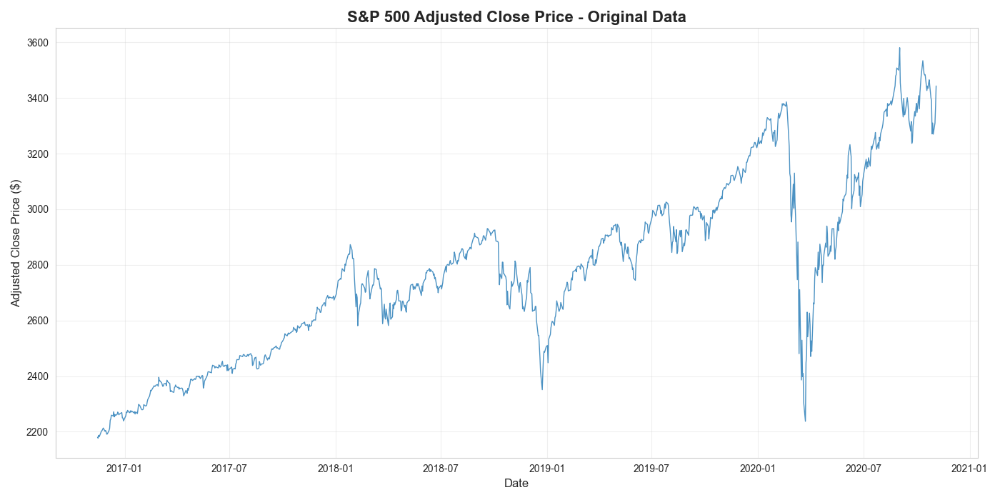
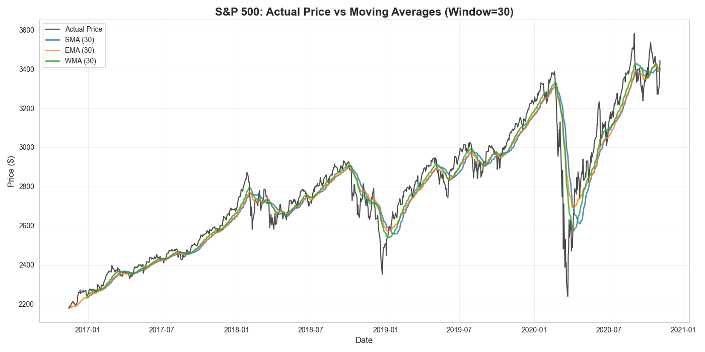
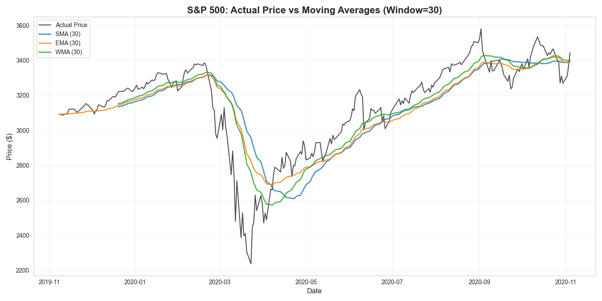
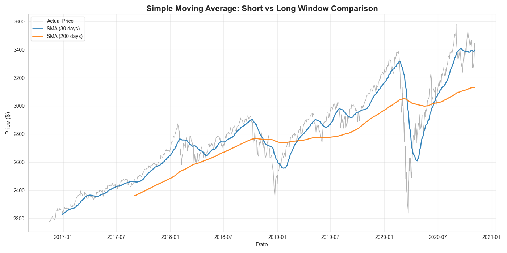
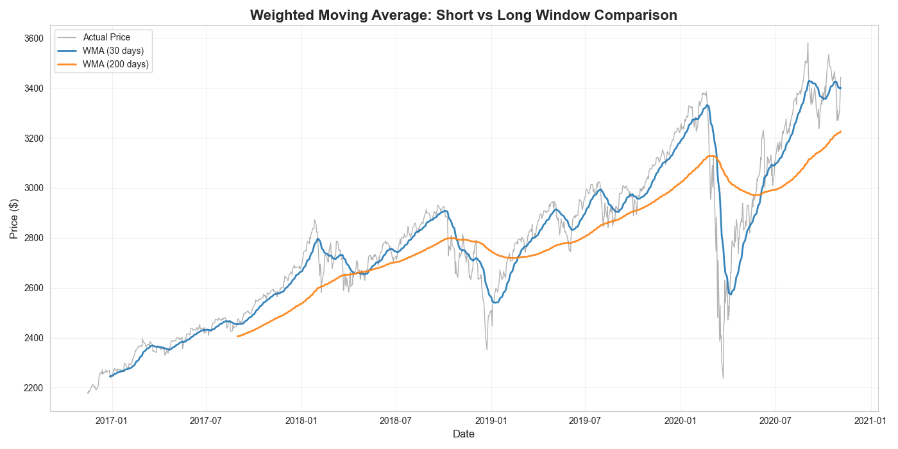
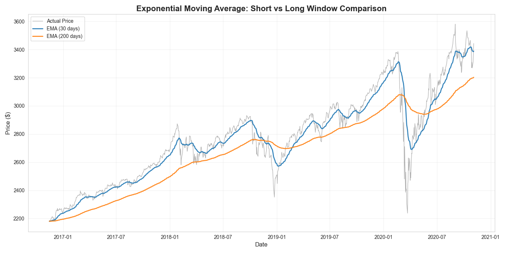
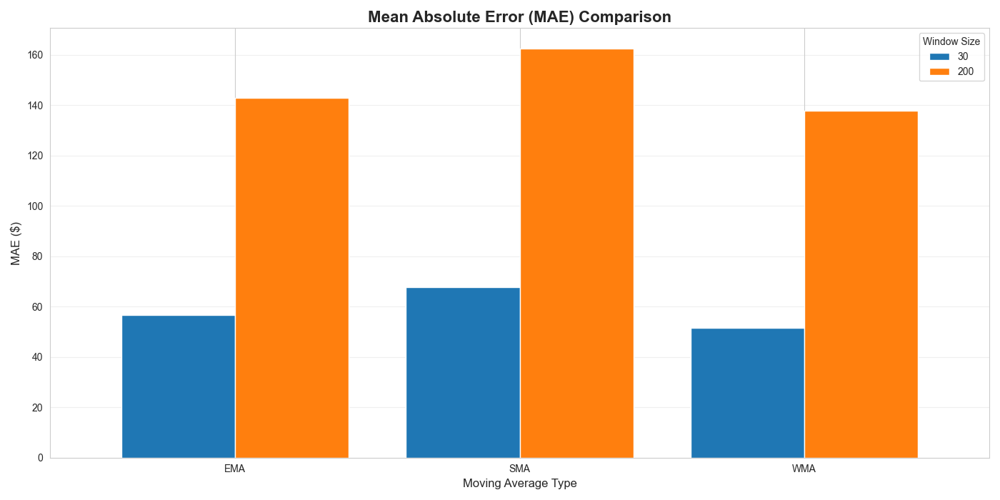
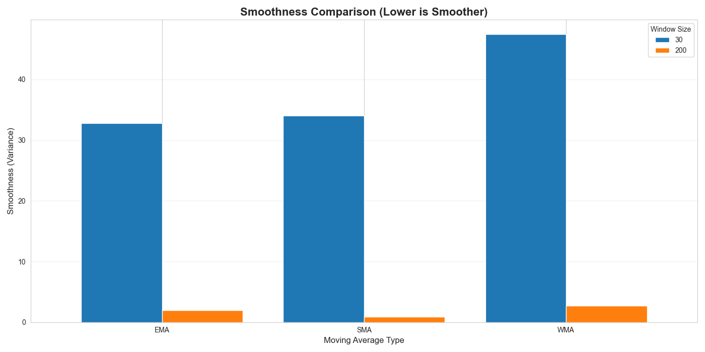

---

layout: default

title: S&P 500 Analysis (Moving Averages)

permalink: /moving-averages/

---

## Goals and objectives:

The business objective is to understand the long term trends and movements within the US stock market, using statistical analysis of historical S&P 500 daily closing value data, including developing insight into whether patterns and trends for short and long term averages can be a predictor for future movements.

The analysis is to include a comparison of 30-day and 200-day moving averages, which are commonly used finance analytical metrics.

S&P 500 (Standard and Poor's 500) is a stock market index tracking the stock performance of 500 leading companies listed on stock exchanges in the United States.

The analytics included applying 3 moving averages types and multiple window-lengths to the data.

The moving averages highlighted the overall trends and responsiveness to changes in underlying trends, including the impact of using each moving average type and different window length.  Each providing valuable insights.

## Application:  

Moving-averages statistical analysis is a fundamental time series technique used to smooth out short-term fluctuations and noise in sequential data, thereby revealing the underlying long-term trends or cycles. It works by calculating a continuously updated average over a fixed-size "window" of consecutive data points; as a new observation enters the calculation, the oldest observation is dropped, causing the average to "move" forward over time. The resulting series of averages creates a line that is less volatile than the original data, making it easier to visually identify and model the general direction of movement.

Moving averages are versatile statistical tools where their real-world benefits span numerous industries by improving decision-making from trading to inventory control, including the following:

* **Finance** - Moving averages are a cornerstone of technical analysis in financial markets, where they are used to interpret asset price movements and trends, supporting buy/sell trading signals.
  * Long-term moving averages, like the 200-day Simple Moving Average (SMA), often act as dynamic levels where asset prices are expected to find support (on a drop) or resistance (on a rise).
* **Technology** - In technology, moving averages help monitor continuous streams of performance data to quickly spot deviations and long-term changes, for example performance trending and anomaly detection.
* **Retail** - Moving averages are a simple yet powerful tool in retail for predicting future needs and managing costs associated with stock.  Demand forecasting uses Smoothed Moving Average (SMMA) to manage stock levels, and influence ordering requirements.
  * The Moving Average Cost (MAC) method is an accounting technique where the cost of goods sold (COGS) is calculated using the constantly updated average cost of all inventory on hand. This stabilises profit margins against fluctuating raw material or acquisition prices.
* **Manufacturing** - In manufacturing, moving averages are essential for maintaining quality and detecting process drift before defects become widespread.  It is used to monitor qualities within the manufacturign process to detect shifts, and support early defect detection.

## Methodology:  

A workflow in Python was developed using libraries Pandas and Numpy, utilising Matplotlib and Seaborn for visualisations.  The data used was obtained from [Kaggle](https://www.kaggle.com/datasets/henryhan117/sp-500-historical-data/).  

After loading the data, minor data processing was undertaken to prepare the data for analysis, noting that overall the dataset was considered complete and accurate.  For simplicity, the most recent 1,000 daily adjusted close prices were used (relating to approximately 4 years of data), as this is sufficient to demonstrate the analytical methods, and insight gained.  The plot of the 1,000 adjusted close prices is:



Three moving average techniques were applied to the data:  SMA (Simple Moving Average) , WMA (Weighted Moving Average), and EMA (Exponential Moving Average), where different window lengths were used.

There are multiple types of Weighted Moving Average (WMA), where the version used in this demo is Linear Weighted Moving Average (LWMA), considered the most commonly implemented WMA.  This applies more weighting to the most recent observations.  This uses the formula:  

WMA = (n×P₁ + (n-1)×P₂ + (n-2)×P₃ + ... + 2×Pₙ₋₁ + 1×Pₙ) / (n + (n-1) + (n-2) + ... + 2 + 1)  
where: n = window size (e.g., 20)  
P₁ = most recent price (gets highest weight)  
Pₙ = oldest price in window (gets lowest weight)  
Denominator = sum of weights = n×(n+1)/2  

Accuracy metrics and smoothness metrics were then applied to the results, including Mean Absolute Error, Mean Absolute Percentage Error,  Root Mean Squared Error and Smoothness (variance of differences of consecutive values).  These can then be interpreted and support understanding the data and reaching conclusions.

## Results and conclusions:

The following chart show the results of applying all three moving average types to the data, all with a 30 day window, where the most recent 1,000 data points are included. 



For clarity the chart below shows the results of applying the three moving average types to the data, with a 30 day window, where only the most recent 250 data points are included (which represents approximately one year).  This highlights how each three moving average type responds to changes in trends, including the responsiveness and how closely they follow the true data.



For each of the three moving average types applied, two separate window lengths were applied, one being a short-window of 30 days, and the other a long-window of 200 days.  The following plots visualise the results, showing as expected the plot for the long-window is smoother.





### EMA Responsiveness
It should be noted that when using EMA (Exponential Moving Average), there are values from the first time point, whereas for SMA and WMA the first values appear only once a full window of data is observed.  

EMA uses a recursive formula: EMA_today = α × Price_today + (1-α) × EMA_yesterday , where the first EMA value is typically initialized as the first price itself.  The smoothing factor α = 2/(span+1), so for a 20-day window: α = 2/21 ≈ 0.095

Comparing the 30-day moving average (MA) and the 200-day MA is a common technical analysis technique to assess a stock's short-term momentum against its long-term trend. The 30-day MA is more sensitive to recent price changes, while the 200-day MA provides a smoother, broader view of the market's direction. 

In conclusion EMA is considered more responsive, as it starts incorporating data immediately, and as such EMA provides earlier trend signals.  For example; EMA is often preferred by traders as it maximises the usable data while still providing smoothing benefits. 

### Accuracy and Smoothness Metrics

The following table shows the accuracy and smoothness metrics for each of the 3 moving averages methods applied for both 30-day and 200-day windows.  The three accuracy metrics being: Mean Absolute Error (MAE), Mean Absolute Percentage Error (MAPE) and Root Mean Square Error (RMSE)
```
  MA_Type  Window     MAE  MAPE    RMSE  Smoothness
0     SMA      30   67.81  2.42  103.24       34.01
1     SMA     200  162.51  5.59  194.20        0.88
2     EMA      30   56.71  2.02   84.79       32.77
3     EMA     200  143.01  5.07  171.59        1.93
4     WMA      30   51.46  1.83   79.38       47.44
5     WMA     200  137.83  4.75  174.05        2.73
```
The following charts show the MAE, MAPE and Smoothness for each moving average type and window.





Analysis of the accuracy and smoothness metrics provides the following interpretation and conclusions:  

* The best performing MA type for both the short-window and long-window is the WMA  
  * MAE = $51.46 for 30-day window (1.83% average error)  
  * MAE = $137.83 for 200-day window (4.75% average error)  
* Smoothest 30-day window MA is EMA (Variance: 32.77)  
* Smoothest 200-day window MA: SMA (Variance: 0.88)  
* As expected the short-window MA types produce smaller error values, but lower smoothness (i.e. higher variance)
  * This highlights the trade-off between smoothness and lag (window-size) as addressed below
 
### Moving Average Type and Window Size Comparison

To summarise the comparison of the three moving average types included in this analysis:

SMA (Simple Moving Average):
* Gives equal weight to all data points in the window
* Slowest to react to price changes
* Generally most stable and smoothest of the three methods

EMA (Exponential Moving Average):
* Gives more weight to recent prices
* Faster reaction to price changes than SMA
* More responsive to trends while maintaining smoothness

WMA (Weighted Moving Average):
* Linearly weights recent prices higher
* Reactivity between SMA and EMA
* Good balance of responsiveness and stability

A summary of the 2 window sizes used in the analysis

Short Window (30 days):
* More responsive to recent price movements
* Higher volatility in the moving average (less smooth)
* Average MAE: $58.66

Long Window (200 days):
* Captures longer-term trends
* Much smoother, less reactive to short-term fluctuations
* Average MAE: $147.78 - 151.9% higher error due to lag effect

It is important to note that the individual business use of the moving averages data will dictate which type(s), and window size to use, as each provide benefits.  It is common, and most powerful, to use multiple types and windows to provide maximum insight and benefit.

### 30-day / 200-day Comparison and Application

The 30-day and 200-day windows are commonly used in stock market analysis and predictions, and used as an important tool to support trading decisions.

30-Day Moving Average: Considered a short-to-intermediate-term indicator, it reflects the stock's recent price action and helps spot near-term trend changes.

200-Day Moving Average: A widely followed long-term indicator, it helps identify the major, overarching market trend and often acts as a significant level of support (in an uptrend) or resistance (in a downtrend). 

Traders and investors use the relationship between these two moving averages, and the price itself, to generate potential buy or sell signals: 
Overall Trend Confirmation:  
* If the price is above both MAs, and the 30-day MA is above the 200-day MA, it confirms a strong bullish (upward) trend.  
* If the price is below both MAs, and the 30-day MA is below the 200-day MA, it confirms a strong bearish (downward) trend.

Crossover Signals:  
* Bullish Crossover (Golden Cross): When the shorter-term 30-day MA crosses above the longer-term 200-day MA, it is generally interpreted as a powerful buy signal, indicating the start of a potential new long-term uptrend.  
* Bearish Crossover (Death Cross): When the 30-day MA crosses below the 200-day MA, it is a sell signal, indicating a potential long-term downtrend is beginning.

### Smoothness vs. Lag Trade-Off

When evaluating a moving average, you are generally trying to find the optimal balance between two competing properties - Smoothness and Lag:

**Smoothness (Noise Reduction)** - A smoother line has less period-to-period change.  
**Lag (Responsiveness)** - The smoothed line naturally lags behind the true underlying trend because it incorporates old data.  This is the time a significant trend change occuring in the original data is refelected in the moving average line in response.  
The "best" moving average is the one that minimizes the lag while providing enough smoothness to filter out the noise relevant to your analysis (e.g., a 30-day MA is less smooth but less lagged than a 200-day MA).

### Conclusions:

* In general application, there is a trade-off between Accuracy and Smoothness:
  * Shorter windows track prices more closely (lower MAE)
  * Longer windows are smoother but lag behind actual prices

* For the example data analysed, an optimal Moving Average selection:
  * For trend following: Use WMA with 200-day window
  * For trading signals: Use WMA with 30-day window
  * For robust analysis: Combine both short and long windows

* General practical applications:
  * EMA is often preferred where responsiveness is required
  * SMA is better for identifying major trend reversals
  * WMA provides a middle ground for balanced analysis
  * Crossover strategies (short MA crossing long MA) signal potential trends

* S&P 500 Model Performance:
  * Best overall model based on MAE: WMA with 30-day window
    * Achieved MAE of $51.46 (1.83% MAPE)
    * Smoothness variance: 47.44 (which is higher variance than other models, highlighting the trade-off as discussed)

## Next steps:  

With any analysis it is important to assess how the model and application of the analytical methods can be used and evolved to support the business goals and business decisions and yeild tangible benefits.

Considering the original business objective the recommended next steps for consideration include:

* Research more advanced moving average techniques - e.g. KAMA (Kaufman's Adaptive MA), DEMA (Double EMA), Volatility-Adjusted MAs, etc.  
* Research the implementation of multi-timeframe analysis, for example using three windows in the analysis.  
* Extend set of data used within analysis, such as currencies, commodities, individual stocks etc.  
* Integrate Machine Learning to enhance predictive models and pattern recognition (e.g. Random Forest Classifiers).  
* Automate business decisions based on the analysis - e.g. stock buy/sell decisions based on MA crossovers.  
* Monitor performance of automated decisions, including outcome compared to logic to make decision.  

## Python code:
You can view the full Python script used for the analysis here: 
[View the Python Script](/MovingAverages_SP500.py)
