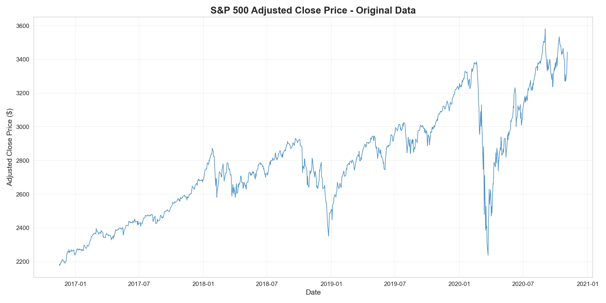
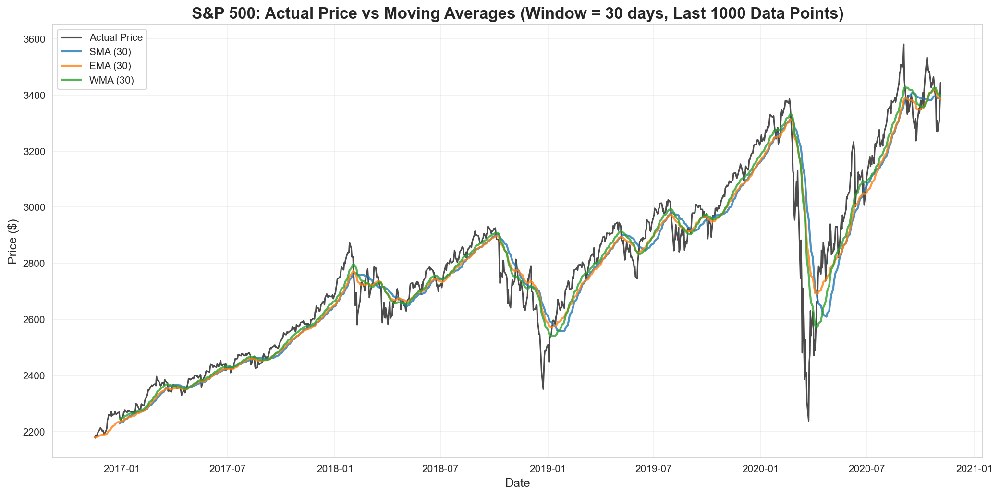
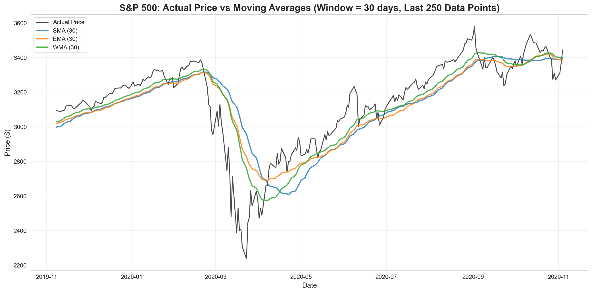
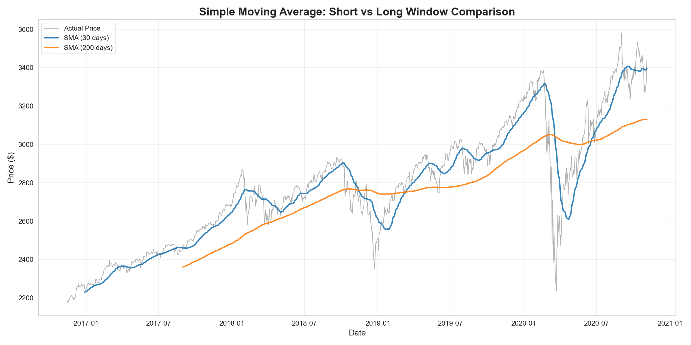
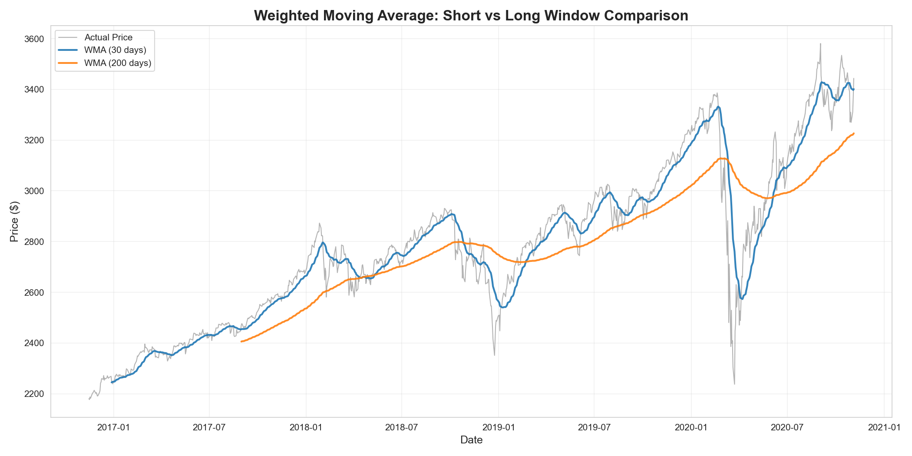
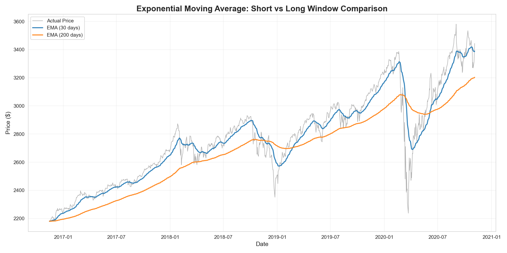
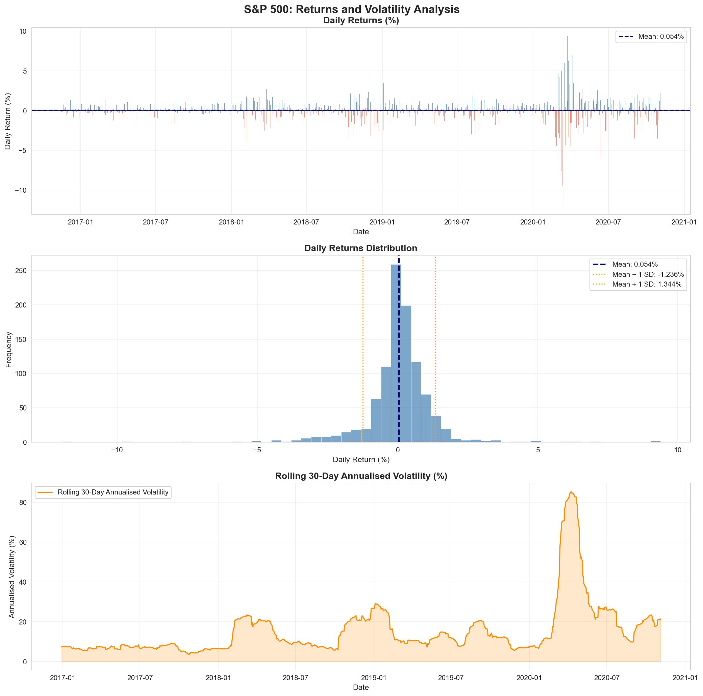
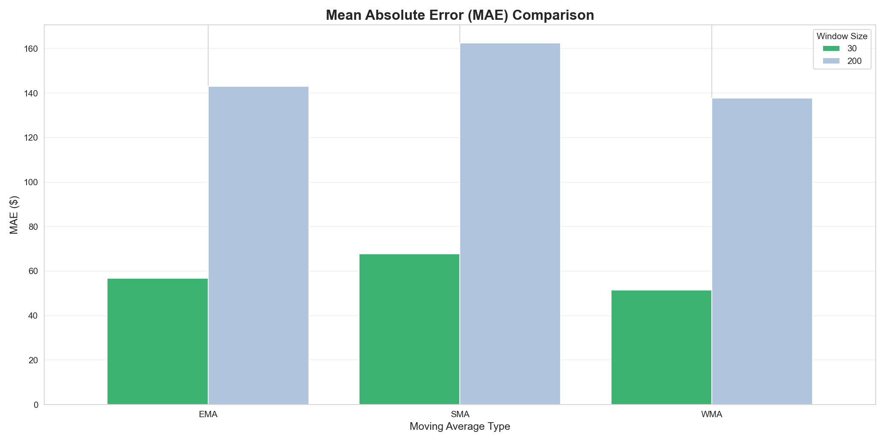
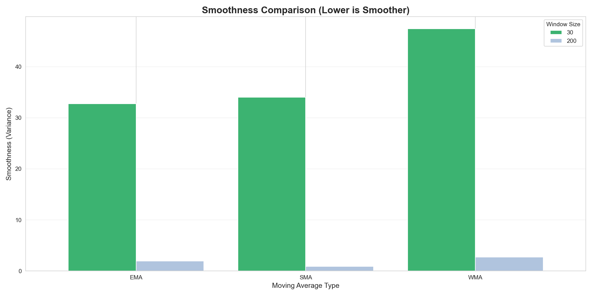
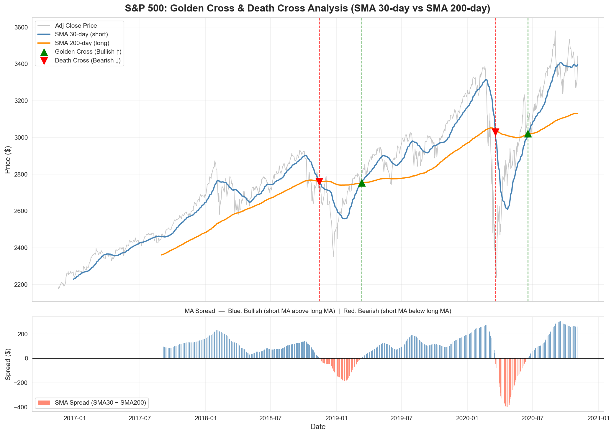

---

layout: default

title: S&P 500 Analysis (Moving Averages)

permalink: /moving-averages/

---

## Goals and objectives:

The objective of this project is to analyse long-term trends and movements within the US stock market through statistical analysis of historical S&P 500 daily closing price data, using moving averages as the core analytical technique.

S&P 500 (Standard and Poor's 500) is a stock market index tracking the stock performance of 500 leading companies listed on US exchanges.

The analysis encompasses four areas:

* **Moving average calculation** — three moving average types (SMA, EMA, WMA) are applied across two window lengths (30-day and 200-day), producing six models for comparison.
* **Returns and volatility analysis** — daily percentage returns and rolling annualised volatility are calculated to characterise the underlying behaviour of the market during the analysis period, and to contextualise why smoothing techniques are beneficial.
* **Accuracy and smoothness evaluation** — each model is assessed using MAE, MAPE, RMSE and a smoothness metric (variance of first differences), quantifying the trade-off between responsiveness and noise reduction.
* **Crossover signal detection** — the 30-day and 200-day SMAs are used to identify Golden Cross (bullish) and Death Cross (bearish) events, demonstrating how moving averages can generate practical trading signals.

## Application:  

Moving-averages statistical analysis is a fundamental time series technique used to smooth out short-term fluctuations and noise in sequential data, thereby revealing the underlying long-term trends or cycles. It works by calculating a continuously updated average over a fixed-size "window" of consecutive data points; as a new observation enters the calculation, the oldest observation is dropped, causing the average to "move" forward over time. The resulting series of averages creates a line that is less volatile than the original data, making it easier to visually identify and model the general direction of movement.

Moving averages are versatile statistical tools where their real-world benefits span numerous industries by improving decision-making from trading to inventory control, including the following:

🏦  **Finance** - Moving averages are a cornerstone of technical analysis in financial markets, where they are used to interpret asset price movements and trends, supporting buy/sell trading signals.  
  * Long-term moving averages, like the 200-day Simple Moving Average (SMA), often act as dynamic levels where asset prices are expected to find support (on a drop) or resistance (on a rise).  
  * Complementing moving average analysis, daily returns and rolling annualised volatility quantify how aggressively prices fluctuate over time — directly informing position sizing, risk management, and the choice of moving average window length appropriate to prevailing market conditions.

💻  **Technology** - In technology, moving averages help monitor continuous streams of performance data to quickly spot deviations and long-term changes, for example performance trending and anomaly detection.  

🛍️ **Retail** - Moving averages are a simple yet powerful tool in retail for predicting future needs and managing costs associated with stock.  Demand forecasting uses Smoothed Moving Average (SMMA) to manage stock levels, and influence ordering requirements.  
  * The Moving Average Cost (MAC) method is an accounting technique where the cost of goods sold (COGS) is calculated using the constantly updated average cost of all inventory on hand. This stabilises profit margins against fluctuating raw material or acquisition prices.

🏭  **Manufacturing** - In manufacturing, moving averages are essential for maintaining quality and detecting process drift before defects become widespread.  It is used to monitor qualities within the manufacturing process to detect shifts, and support early defect detection.  

## Methodology:  

A workflow in Python was developed using libraries Pandas and NumPy, utilising Matplotlib and Seaborn for visualisations. The data used was obtained from [Kaggle](https://www.kaggle.com/datasets/henryhan117/sp-500-historical-data/).  

After loading the data, validation checks were applied prior to analysis: duplicate dates were identified and removed; zero and negative closing prices were flagged as anomalous; and the date index was inspected for unexpectedly large gaps (greater than 5 days), which would indicate missing data beyond normal market holidays. The dataset was found to be complete and accurate, with no issues detected. Forward-fill imputation was applied to handle any residual missing values in the closing price series.

For simplicity, the most recent 1,000 daily adjusted close prices were used (relating to approximately 4 years of data), as this is sufficient to demonstrate the analytical methods and insight gained. The plot of the 1,000 adjusted close prices is:

Three moving average techniques were applied to the data: SMA (Simple Moving Average), WMA (Weighted Moving Average), and EMA (Exponential Moving Average), where different window lengths were used.

There are multiple types of Weighted Moving Average (WMA), where the version used in this analysis is Linear Weighted Moving Average (LWMA), considered the most commonly implemented WMA. This applies more weighting to the most recent observations, using the formula:

WMA = (n×P₁ + (n-1)×P₂ + (n-2)×P₃ + ... + 2×Pₙ₋₁ + 1×Pₙ) / (n + (n-1) + (n-2) + ... + 2 + 1)  where: n = window size (e.g., 30)  
P₁ = most recent price (gets highest weight)  
Pₙ = oldest price in window (gets lowest weight)  
Denominator = sum of weights = n×(n+1)/2  

To characterise the underlying market behaviour, daily percentage returns and rolling 30-day annualised volatility were calculated. Annualisation uses a factor of √252, reflecting the approximate number of US trading days per year, expressing volatility on the same scale as annual return figures commonly used in financial analysis. This analysis provides context for why smoothing techniques are beneficial, and quantifies the market conditions present within the data period.

Accuracy and smoothness metrics were then applied to the moving average results, including Mean Absolute Error (MAE), Mean Absolute Percentage Error (MAPE), Root Mean Squared Error (RMSE), and Smoothness (variance of first differences of consecutive values). These metrics support direct comparison across MA types and window lengths, and quantify the trade-off between responsiveness and noise reduction.

Finally, Golden Cross and Death Cross crossover events were identified by detecting sign changes in the spread between the 30-day and 200-day SMAs. A Golden Cross — where the short-term MA crosses above the long-term MA — is a widely followed bullish signal; a Death Cross represents the reverse. Crossover dates and prevailing price levels are extracted and annotated directly on the chart, alongside a spread panel illustrating the MA differential across the full analysis period.

## Results:

### Moving Average Type Comparison

The following chart shows all three moving average types applied to the 1,000-point dataset with a 30-day window, providing direct comparison of SMA, EMA, and WMA tracking performance against the actual closing price.

The chart below shows the same three moving averages restricted to the most recent 250 data points (approximately one year). At this scale, the responsiveness differences between the three methods are more clearly visible, particularly during periods of sustained price movement.

A notable characteristic of EMA is that it produces values from the first data point, using the recursive formula EMA_today = α × Price_today + (1−α) × EMA_yesterday, initialised at the first observed price, where α = 2/(span+1) - for a 20-day window pan: α = 2/21 ≈ 0.095. SMA and WMA require a full window of observations before the first value is computed. This means EMA provides earlier trend signals and makes full use of the available data — a practical advantage in contexts where every data point is valuable.

### Short and Long Window Comparison

For each MA type, both a 30-day (short) and 200-day (long) window were applied. The long-window variant is considerably smoother in all three cases, but lags more significantly behind the actual price during periods of rapid market movement.

### Returns and Volatility Analysis

Daily percentage returns and rolling 30-day annualised volatility were calculated to characterise the underlying market behaviour across the analysis period.

The top panel shows daily returns coloured by gain (blue) and loss (red), with the mean return shown as a reference. Returns are centred near zero with a marginally positive mean, consistent with the general upward trajectory of the S&P 500 over multi-year periods. The middle panel shows the returns distribution — approximately symmetric and centred near zero, with slightly heavier tails than a normal distribution, which is a well-established characteristic of equity return data. The bottom panel shows rolling 30-day annualised volatility: market volatility is clearly not constant across the period, with identifiable episodes of elevated uncertainty. This directly illustrates why a fixed-window moving average responds differently across different market conditions, and motivates the use of smoothing to separate trend from noise.

### Accuracy and Smoothness Metrics

The following table shows the accuracy and smoothness metrics across all six models:

| MA Type | Window (days) | MAE ($) | MAPE (%) | RMSE ($) | Smoothness |
|---------|--------------|---------|----------|----------|------------|
| SMA     | 30           | 67.81   | 2.42     | 103.24   | 34.01      |
| SMA     | 200          | 162.51  | 5.59     | 194.20   | 0.88       |
| EMA     | 30           | 56.71   | 2.02     | 84.79    | 32.77      |
| EMA     | 200          | 143.01  | 5.07     | 171.59   | 1.93       |
| WMA     | 30           | 51.46   | 1.83     | 79.38    | 47.44      |
| WMA     | 200          | 137.83  | 4.75     | 174.05   | 2.73       |

Key findings:

* WMA achieves the lowest MAE for both window sizes, making it the best-performing MA type by accuracy:
  * 30-day: MAE = $51.46 (MAPE = 1.83%)
  * 200-day: MAE = $137.83 (MAPE = 4.75%)
* The smoothest 30-day MA is EMA (Smoothness variance: 32.77); the smoothest 200-day MA is SMA (Smoothness variance: 0.88)
* Short-window models produce lower error but lower smoothness, directly quantifying the accuracy-smoothness trade-off: average MAE is $58.66 for 30-day models versus $147.78 for 200-day models — a 151.9% increase attributable to lag

RMSE is reported alongside MAE for completeness. As RMSE penalises large individual errors more heavily due to the squaring of residuals, a substantially elevated RMSE relative to MAE would indicate occasional large error spikes. The RMSE/MAE ratio is consistent across all six models (approximately 1.2–1.5×), confirming that the error profile is broadly uniform across the data period and no MA type produces disproportionately large individual deviations.

### Crossover Signal Analysis

The chart below identifies Golden Cross (bullish) and Death Cross (bearish) events by detecting sign changes in the spread between the 30-day and 200-day SMAs. Crossover events are annotated with markers on the price chart. The lower panel shows the MA spread across the full analysis period — blue where the short MA is above the long MA (bullish regime) and red where it falls below (bearish regime).

Within the 1,000-day analysis period, 2 Golden Cross events were identified on 12/3/2019 and 18/6/2020, and 2 Death Cross events on 14/11/2018 and 19/3/2020.

The spread panel provides a compact signal indicator: zero crossings correspond precisely to the annotated crossover events, and the magnitude of the spread indicates how decisively one MA leads the other — a wide positive spread reflects a firmly established bullish regime, while a spread approaching zero signals the potential for a crossover in either direction.

## Conclusions:

### Market Characterisation

Returns analysis over the 1,000-day analysis period confirms that daily S&P 500 returns are centred near zero with a marginally positive mean, consistent with the long-run upward bias of US equity markets. The returns distribution is approximately symmetric but exhibits slightly heavier tails than a normal distribution — a well-documented characteristic of equity returns that reflects the occasional occurrence of large single-day moves in either direction. Rolling volatility analysis confirms that market volatility is not constant: identifiable periods of elevated uncertainty are present within the data, underscoring why a fixed-window moving average that smooths across varying volatility regimes is a practically useful analytical tool rather than merely a theoretical one.

### Moving Average Type Comparison

The three MA types represent a spectrum of responsiveness:

* **SMA (Simple Moving Average)** — equal weight to all observations in the window; slowest to react to price changes; most stable and smoothest of the three types. Best suited to identifying major, sustained trend reversals   where a lag-tolerant, low-noise signal is preferred.
* **EMA (Exponential Moving Average)** — exponentially decaying weights prioritise recent observations; faster reaction than SMA while retaining smoothing; produces values from the first data point, maximising use of available data. Preferred where responsiveness is the primary requirement, such as shorter-term trading signals.
* **WMA (Weighted Moving Average)** — linear decay in weights provides a middle ground between SMA and EMA in terms of both responsiveness and smoothness. Consistently the best-performing MA type by accuracy metrics in this analysis, offering a balanced approach to trend tracking.

### Smoothness vs. Lag Trade-Off

A fundamental tension governs moving average selection: smoothness and responsiveness are competing properties. A smoother MA (achieved through a longer window or weaker weighting of recent data) filters noise effectively but lags behind actual price movements — meaning trend changes are detected later. A more responsive MA tracks prices closely but is more susceptible to short-term noise. The optimal choice is the MA that minimises lag while providing sufficient smoothing for the analytical purpose at hand. This analysis quantifies that trade-off directly: average MAE for 30-day models is $58.66 versus $147.78 for 200-day models — a 151.9% increase attributable entirely to lag, not a difference in method quality.

### Model Performance

Accuracy and smoothness results across all six models:

* **Best accuracy (lowest MAE):** WMA across both window sizes
  * 30-day WMA: MAE = $51.46 (MAPE = 1.83%), Smoothness variance = 47.44
  * 200-day WMA: MAE = $137.83 (MAPE = 4.75%), Smoothness variance = 2.73
* **Smoothest 30-day model:** EMA (Smoothness variance: 32.77)
* **Smoothest 200-day model:** SMA (Smoothness variance: 0.88)
* The RMSE/MAE ratio is consistent across all six models (approximately 1.2–1.5×), confirming a uniform error profile with no model producing disproportionately large individual deviations

### Crossover Signal Analysis and Practical Application

The 30-day and 200-day SMAs are widely used in combination as a practical trading signal framework. Their relationship provides two layers of information:

**Trend confirmation:**
* Price above both MAs, with the 30-day MA above the 200-day MA: strong bullish (upward) trend confirmed
* Price below both MAs, with the 30-day MA below the 200-day MA: strong bearish (downward) trend confirmed

**Crossover signals:**
* **Golden Cross** (30-day SMA crosses above 200-day SMA): bullish signal, indicating the potential start of a long-term uptrend
* **Death Cross** (30-day SMA crosses below 200-day SMA): bearish signal, indicating a potential long-term downtrend

Within the 1,000-day analysis period, 2 Golden Cross and 2 Death Cross events were identified, occurring at price levels of 2,791.52 USD & 3,115.34 USD and 2,701.58 USD & 2,409.39 USD respectively.

The MA spread panel reinforces these signals: the magnitude of the spread quantifies the conviction of the prevailing trend regime, while a spread approaching zero signals an elevated probability of a crossover in either direction.

### Optimal Model Selection

Considering the full results, the recommended MA selection for each use case:

* **Trend following:** WMA with 200-day window — best accuracy at the long window, with sufficient smoothness for stable trend identification
* **Trading signals:** WMA with 30-day window — best overall accuracy, with crossover strategies using the 30-day/200-day SMA pair for signal generation
* **Robust analysis:** Combine short and long windows across multiple MA types, as each provides complementary information — no single MA type or window is universally optimal across all market conditions

## Next steps:  

With any analysis it is important to assess how the analytical methods can be evolved to support business goals and yield tangible benefits.  
Recommended next steps for consideration include:

* **Backtest crossover signals** — evaluate the predictive value of the Golden Cross and Death Cross events identified in this analysis by measuring subsequent returns following each signal, establishing whether the crossovers detected carry statistically meaningful forward-looking information.
* **Research more advanced moving average techniques** — e.g. KAMA (Kaufman's Adaptive MA), DEMA (Double EMA), Volatility-Adjusted MAs. The rolling volatility calculated in this project provides a natural foundation for volatility-adaptive window sizing.
* **Implement multi-timeframe analysis** — extend the framework to incorporate three or more window lengths simultaneously, providing richer trend context across short, medium, and long-term horizons.
* **Extend the dataset** — apply the same analytical framework to additional instruments such as currencies, commodities, or individual stocks, to assess how findings generalise beyond the S&P 500 index.
* **Integrate Machine Learning** — enhance predictive capability using time series models such as LSTM networks or gradient boosted classifiers trained on MA-derived features (e.g. spread, crossover signals, volatility regime) to predict directional price movements.
* **Automate and monitor trading signals** — implement automated buy/sell decision logic based on MA crossovers, and track live performance against the signal logic to evaluate real-world effectiveness.

## Python code:
You can view the full Python script used for the analysis here: 
[View the Python Script](/MovingAverages_SP500_v3.py)
