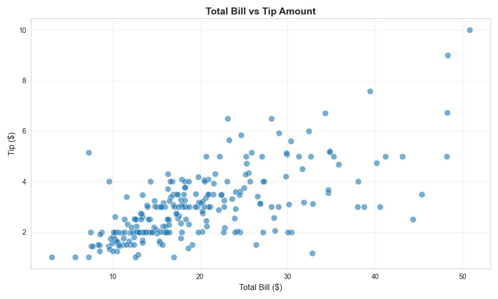
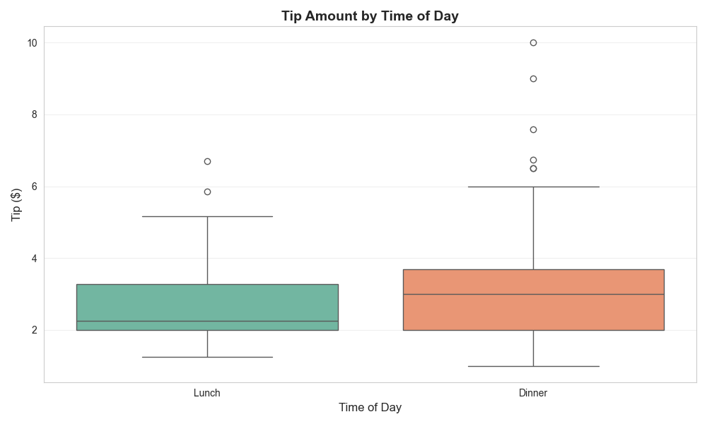
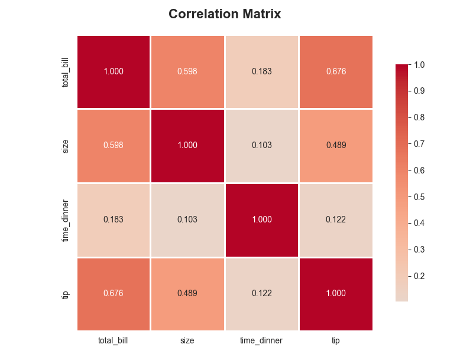
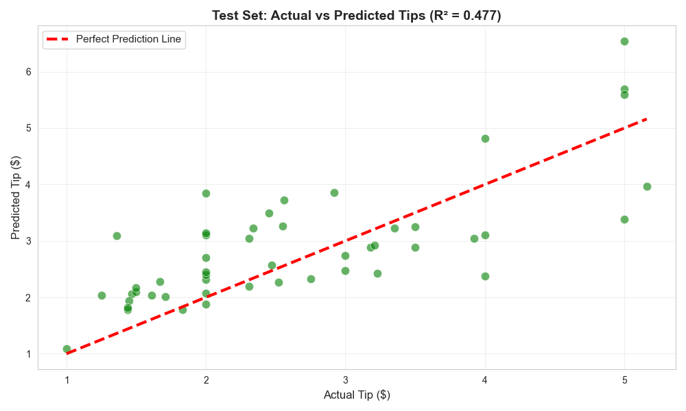
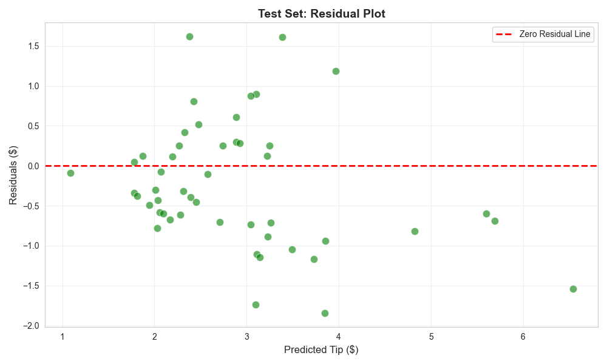
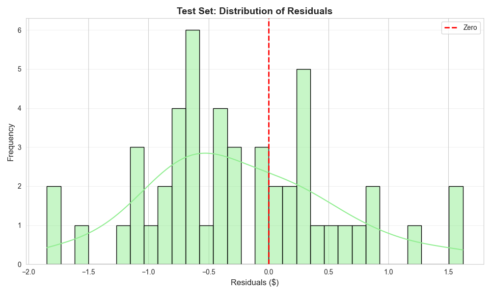
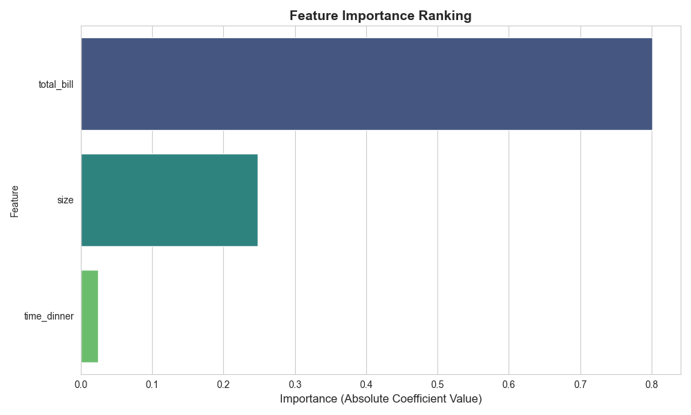

---

layout: default

title: Restaurant tips (Multiple Linear Regression)

permalink: /multi-linear-regression/

---

## Goals and objectives:

A restaurant wishes to understand how accurately can predict tip amount based on three variables: total bill value, party size, and time of day.  Multiple Linear Regression (MLR) was applied to 244 observations, to create a model which was then analysed to determine the accuracy, errors and key factors in predicting the tip value. 

## Application:  

The business application of MLR is centred on forecasting (predicting future values) and causal analysis (quantifying the impact of multiple factors on a single outcome).  Examples of uses across different sectors include (though this is a far from complete list)

* In finance, MLR is essential for risk modelling, asset valuation, financial forecasting, and understanding market drivers.
* Retail leverages MLR primarily for sophisticated demand forecasting, pricing strategies, customer life valuations and marketing budget allocation.
* In technology, MLR is vital for optimizing product performance, user retention, and managing infrastructure costs.  .
* MLR is fundamental to Quality Control (QC) and Predictive Maintenance by modelling the complex interplay of process variables..

## Methodology:  

A workflow in Python was developed using libraries Scipy, Pandas and Numpy, utilising Matplotlib for visualisations.  The data was created in the script, with the intention of producing interesting statistical findings.  

The A/B test was used to test the null hypothesis that there is no variance between the control and treatment groups.  Further analysis determined the high-confidence range of conversion percentages, to support business planning and expectations.

Tests were also undertaken to determine if the sample size was sufficient to detect a real difference given the expected conversion rates.

Data preparation:  Minor transformation of data into a pandas dataframe and contingency table for analytical purposes.  Note that for analyical purposes, the time column, which stated the sitting as either lunch or dinner, was converted into an integer value where dinner is represented by 1 and lunch by 0.  

## Results and conclusions:

### Descriptive Statistics:

There are 244 observations recorded, covering a period of 4 consecutive days.

The mean tip is 2.998, with a standard deviation of 1.384 (currency is ignored in this example for simplicity)

The following scatter plot shows the mapping of tip value to total bill value:



The following boxplot visualises the tip distribution for both lunch and dinner sittings:



### Correlation Analysis

The correlation matrix (for the 3 independent variables and dependent variable) shows the correlation between each variable.  

Values close to 1 or -1 indicate strong relationships, and values close to 0 indicate weak relationships.



### Multicollinearity test:

Multicollinearity needs to be tested in multiple linear regression because it can significantly distort the results and make the model unreliable and difficult to interpret.

Multicollinearity occurs when two or more independent variables (predictors) in a regression model are highly correlated with each other.

The most common method for detecting multicollinearity is by calculating the Variance Inflation Factor (VIF) for each independent variable.

Variance Inflation Factor (VIF):  

```
  Feature    VIF  
 total_bill  9.216  
       size  9.271  
time_dinner  3.170
```

The general guidance states that a VIF > 10 is considered 'High multicollinearity', which is not the case here, but with two values greater than 9.2 this should be noted.

### Hypothesis Test:  

The data was split into training and test sets using the standard 80/20 ratio.

Feature scaling was undertaken, where the independent varaible (X) data was also scaled so within each IV the mean = 0 and standard deviation = 1.

Feature scaling is important, as the different features have different ranges (e.g., bill: $3-50, size: 1-6).  Scaling puts all features on the same scale, which makes the coefficients directly comparable, and also improves the model training and interpretation.

Note that before scaling, the mean and standard deviation for each IV were:  

```
        total_bill     size  time_dinner  
mean        20.218    2.574        0.728  
std          8.771    0.941        0.446
```

The MLR model was fitted with the scaled IV data, producing a model:

Tip = 3.088 + (0.801×total_bill) + (0.248×size)  - (0.024×time_dinner)

The model was applied to the test data so that there was both predicted and actual tips for those observations, enabling a calculation for the residual for each test observation (actual tip - predicted tip).

### Model Evaluation:

First the model was evaluated against the training set, returning: 
R² Score: 0.4519 (45.2% of variance explained by the model)  
Root Mean Squared Error: 1.06  
Mean Absolute Error: 0.76  

The model was then evalauated against the test set, returning:
R² Score: 0.4772 (47.7% of variance explained)  
Root Mean Squared Error: 0.81
Mean Absolute Error: 0.67

Using the evaluation of the test set, this means that our model explains 47.7% of the variation in tips, and using MAE, on average the absolute error is 0.67

The scatter plot below plots the predicted values against the actual values in the test set.











This data was used to create the contingency table:


The chi-squared test was applied to the data, with the null hypothesis that there is no variance between the control and treatment groups, with the significance level (alpha) equal to 0.05.  

The result of the chi-squared test was a p_value of 0.00022, and as this is > 0.05 we can reject the null hypothesis and have evidence that there is a statistically significant difference in conversion rates between the 2 groups.

An output of the chi-squared test was the expected frequencies table, which represents the expected number of conversions should there be no difference in conversion rates between groups.


Using Cramér's V which is a measure of association between two nominal variables, returning a number between 0 and 1 that indicates how strongly two categorical variables are associated.  The calculated Cramér's V was 0.0826, which is interpretted as being a 'small' effect, i.e. moving from the control to treatment group will return a statistically significant difference but the scale of that effect is small.  It should be noted that this is a subjective effect 'size', and may well produce a meaningful and positive business improvement, and as such the Cramér's V is to be interpretted within the business context.  As an example, increasing conversion rates by a few percent may have significant business benefit and meet the goals of the development.

Given the data available, we want to determine the range of values that the true conversion rates are in, with 95% confidence.  From the data we cannot be sure that the true conversion rate via the new web page is eqactly 18%.

It was determined that the 95% confidence intervals for true conversion rates are:  

Control Group: 95% Confidence Interval of Conversion Rate: (9.99%, 14.01%)

Treatment Group: 95% Confidence Interval of Conversion Rate: (15.62%, 20.38%)

Visualising these ranges on a chart to support interpretation:  


## Next steps:
The primary recommendations would include:
* the new website should be deployed as there is evidence that it results in an increased volume of memberships being taken.
* constantly track the conversion rates of the new website to understand if the rate achieved in the test is reflected going forward, and understand any changes or trends over time
* use a range of analytical techniques, potentially including time-series analysis and comparative analysis methods on nwely collected data
* other website designs are tested to see if they produce even greater conversion rates

## Python code:
You can view the full Python script used for the analysis here: 
[View the Python Script](/Multi-Linear-Regression-Tips.py)
