---

layout: default

title: Restaurant tips (Multiple Linear Regression)

permalink: /multi-linear-regression/

---

## Goals and objectives:

The business objective is to determine how accurately tip amount can be predicted from three observable variables — total bill value, party size, and time of day — and to understand the relative contribution of each predictor to that outcome. Multiple Linear Regression (MLR) was applied to 244 observations from the Seaborn Tips dataset, providing a controlled, reproducible setting in which to demonstrate a complete regression analysis pipeline.

The analytical scope goes beyond model fitting. The project applies statistical significance testing via a statsmodels OLS model, producing p-values, t-statistics, an F-statistic, adjusted R², and 95% confidence intervals for each coefficient — establishing not just whether the model predicts, but whether each individual predictor contributes meaningfully. Assumption testing is conducted formally using the Shapiro-Wilk test for residual normality and the Spearman Correlation test for homoscedasticity, with multicollinearity assessed through Variance Inflation Factors (VIF). Influential observations are identified using Cook's Distance. Model performance is evaluated both on a held-out test set and through 10-fold cross-validation, providing a more robust estimate of generalisation than a single split allows on a dataset of this size.

A tip percentage analysis is included to contextualise the heteroscedasticity finding: examining tip as a proportion of bill value reveals why variance grows with bill size, and motivates the application of a square-root transformation to the target variable. A second model using √tip (square-root of tips values) is fitted and evaluated in direct comparison with the original, with the Spearman test re-run to assess whether the transformation resolves the heteroscedastic pattern.

The project confirms that total bill amount is the strongest and statistically significant predictor of tip size, with the transformed model providing a modest improvement in explained variance. Key limitations — including moderate multicollinearity between total bill and party size, and the absence of service quality or customer satisfaction data — are identified alongside recommendations for further development.

## Application:  

Multiple Linear Regression models a continuous outcome as a simultaneous function of two or more independent variables, producing a fitted equation that quantifies the independent contribution of each predictor — that is, its effect on the outcome holding all other variables constant. This dual capability — prediction and causal decomposition — distinguishes MLR from many alternatives. Unlike black-box models, MLR produces interpretable, statistically testable coefficients for each feature, enabling analysts to answer not just what an outcome will be, but which factors drive it and by how much. The formal statistical framework that surrounds it — significance testing of individual coefficients, F-statistic assessment of overall model fit, adjusted R² penalising redundant predictors, and assumption diagnostics including normality, homoscedasticity, and multicollinearity testing — makes MLR particularly well-suited to regulated, auditable, and decision-critical contexts where transparency and accountability are as important as predictive accuracy. It is routinely applied as a rigorous baseline against which more complex models are benchmarked.

The business application of MLR spans any domain where a continuous outcome is driven by multiple measurable factors. Practical examples showing where MLR provides clear analytical value include:

🏦 **Finance**:

**Mortgage and loan pricing**: Lenders model expected credit loss as a function of borrower characteristics — loan-to-value ratio, income, credit score, employment type — with MLR coefficients quantifying the independent risk contribution of each factor and providing a directly auditable basis for pricing decisions.

**Equity factor modelling**: Analysts regress asset returns against macroeconomic and market factors (market return, interest rate sensitivity, sector index) to estimate factor exposures and decompose portfolio risk — the analytical foundation of multifactor equity models.

**Insurance premium setting**: Actuaries quantify the independent contribution of age, vehicle type, claims history, and geography to expected claim cost, producing premium structures that are statistically defensible and regulatorily transparent.

🏠 **Real estate**:

**Hedonic property valuation**: MLR is the classical tool for decomposing property prices into the contribution of individual characteristics — floor area, number of bedrooms, distance to transport links, energy rating — with coefficients directly interpretable as the market value of each attribute.

**Rental yield forecasting**: Property investors and analysts model gross yield against location indices, occupancy rates, and property age to identify mispriced assets and support acquisition decisions.

🛍️ **Retail and marketing**:

**Marketing mix modelling**: MLR is the backbone of MMM — quantifying the independent return on investment of each marketing channel (TV, paid digital, in-store promotions) on sales volume, enabling budget reallocation decisions grounded in estimated marginal contribution rather than correlation.

**Price and promotional elasticity**: Retailers model sales volume as a function of own price, competitor price, and promotional intensity, using the fitted coefficients to simulate the revenue impact of pricing changes before implementation.

🏥 **Healthcare**:

**Clinical outcome prediction**: Hospital systems model patient length of stay or readmission probability against admission characteristics — age, diagnosis code, comorbidity count, admission route — to support capacity planning and target early-intervention resources at high-risk patients.

**Health economics and policy**: Epidemiologists quantify the independent contribution of lifestyle, socioeconomic, and demographic factors to health outcomes at population level, providing a statistically controlled evidence base for public health policy design.

🏭 **Manufacturing**:

**Process yield optimisation**: Quality engineers model defect rate or product yield as a function of controllable process parameters — temperature, pressure, line speed, operator shift — using the regression coefficients to identify which variables most influence output quality and define optimal operating ranges.

**Predictive maintenance scheduling**: Maintenance teams regress equipment degradation rate against operational metrics (vibration amplitude, temperature variance, run hours) to predict failure risk and schedule intervention before unplanned downtime occurs.

💻 **Technology**:

**Infrastructure cost modelling**: Engineering and finance teams regress cloud spend against product usage metrics — API call volume, active users, data storage consumption — to attribute costs accurately across services and forecast expenditure as the product scales.

**Product analytics and retention**: Product teams quantify the independent effect of feature adoption, session frequency, and support contact rate on user retention or NPS, identifying the levers most worth investing in and those that are statistically inert.

## Methodology:  

The analysis is implemented in Python using pandas for data handling, scikit-learn for modelling and preprocessing, statsmodels for statistical inference, scipy for assumption testing, and seaborn and matplotlib for visualisation. The dataset is the Tips dataset, loaded directly from seaborn, comprising 244 observations across seven variables.

**Data Loading and Preparation**

The dataset is confirmed to contain no missing values, requiring no imputation or record removal. Three independent variables are selected for the model: 
* total bill value
* party size
* time of day

The categorical time variable — recorded as 'Lunch' or 'Dinner' — is binary-encoded as an integer column (time_dinner), where Dinner = 1 and Lunch = 0. The remaining categorical variables (sex, smoker, day) are excluded from this model, with their potential contribution noted as an area for future development.

**Exploratory Data Analysis**

Descriptive statistics are calculated for all variables. Three charts are produced to examine the relationship between each independent variable and tip amount prior to modelling: a scatter plot of total bill against tip, a scatter plot of party size against tip with horizontal jitter applied to reduce overplotting on the integer-valued axis, and a boxplot comparing tip distributions across lunch and dinner sittings. A correlation matrix heatmap is produced to quantify pairwise linear relationships between all three predictors and the target variable.

A tip percentage analysis is conducted — expressing tip as a proportion of total bill for each observation — to examine whether tipping behaviour is proportional or additive across the bill range. This analysis directly contextualises the heteroscedasticity finding identified in the assumption testing stage.

**Multicollinearity Assessment**

Prior to model fitting, the Variance Inflation Factor (VIF) is calculated for each independent variable. A VIF exceeding 10 is treated as indicative of high multicollinearity; values between 5 and 10 are noted as moderate. Results are visualised as a bar chart with threshold reference lines.

**Model Specification and Fitting**

The dataset is partitioned into training and test sets using an 80/20 split with a fixed random state for reproducibility. Feature scaling is applied using scikit-learn's StandardScaler, fitted exclusively on the training set and applied to both, ensuring no data leakage between partitions. Two complementary model specifications are fitted:

* **scikit-learn LinearRegression** is fitted on the scaled training data, producing standardised coefficients used for feature importance comparison and generating predictions on both training and test sets.
* **statsmodels OLS** is fitted on the unscaled features with a constant term added, to obtain the full inferential output — p-values, t-statistics, model-level F-statistic, adjusted R², and 95% confidence intervals for each coefficient. This provides the statistical basis for assessing whether each predictor's contribution is meaningfully distinguishable from zero, which scikit-learn does not provide.

**Model Evaluation**

Performance is assessed on both training and test sets using R², Root Mean Squared Error (RMSE), and Mean Absolute Error (MAE). To complement the single train/test split — which produces a test set of only 49 observations on a dataset of this size — 10-fold cross-validation is applied using a scikit-learn Pipeline that encapsulates scaling and model fitting within each fold, eliminating any risk of leakage across folds. Mean and standard deviation of R², MAE, and RMSE across folds are reported alongside the single-split results, providing a more reliable estimate of generalisation performance.

**Residual Analysis and Assumption Testing**

Residuals are examined visually through scatter plots of residuals against predicted values, histograms of the residual distribution, and Q-Q plots — each produced for both the training and test sets. Three formal assumption tests are then conducted:

* **Residual normality** is tested using the Shapiro-Wilk test, with H₀ that residuals are normally distributed, evaluated at α = 0.05.
* **Homoscedasticity** is assessed via the Spearman Correlation test between predicted values and absolute residuals; a statistically significant result indicates that variance is not constant across the prediction range.
* **Multicollinearity** is addressed through the VIF analysis conducted prior to model fitting.

Influential observations are identified using Cook's Distance, calculated via statsmodels' OLSInfluence. The conventional threshold of 4/n is applied to flag observations whose removal would materially alter the fitted model.

**Target Variable Transformation**

Where the Spearman test identifies heteroscedasticity in the original model, a square-root transformation is applied to the target variable and a second model is fitted using the same train/test split and scaling procedure. Predictions are back-transformed to the original tip scale for direct metric comparison. The Spearman test is re-run on the transformed model's residuals to determine whether the transformation resolves the heteroscedastic pattern, with results presented alongside a side-by-side residual plot comparison of both models.

## Results:

### Descriptive Statistics:

The dataset comprises 244 observations collected across four consecutive days. The mean tip is 2.998 with a standard deviation of 1.384. The scatter plot below maps tip amount against total bill value, showing a positive linear trend with increasing spread at higher bill values — a pattern that anticipates the heteroscedasticity finding discussed in the assumption testing:

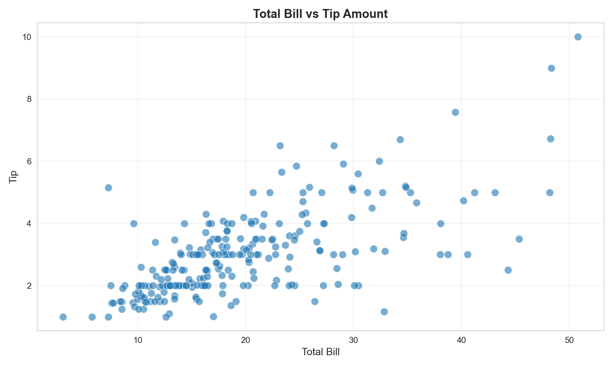

The boxplot below compares the tip distribution across lunch and dinner sittings. Dinner sittings show a higher median tip and greater spread, though the overlap between groups is substantial:

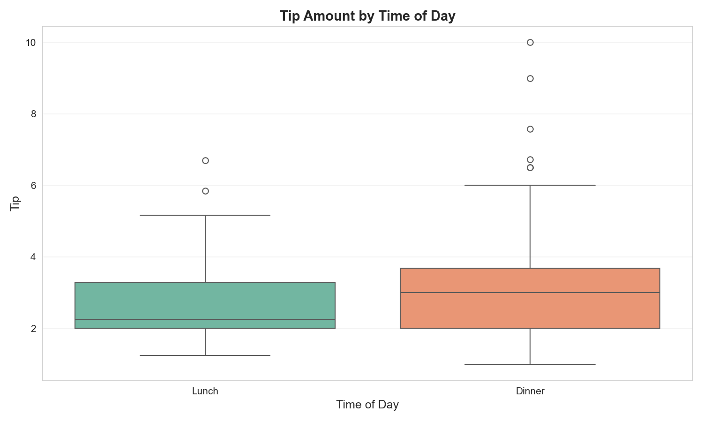

### Correlation Analysis:

The correlation matrix quantifies the pairwise linear relationships between all variables. Total bill shows the strongest correlation with tip (r ≈ 0.68), party size shows a moderate positive correlation (r ≈ 0.49), and time of day shows a weaker relationship (r ≈ 0.27). The correlation between total bill and party size (r ≈ 0.60) is notably elevated and is examined further in the multicollinearity assessment:

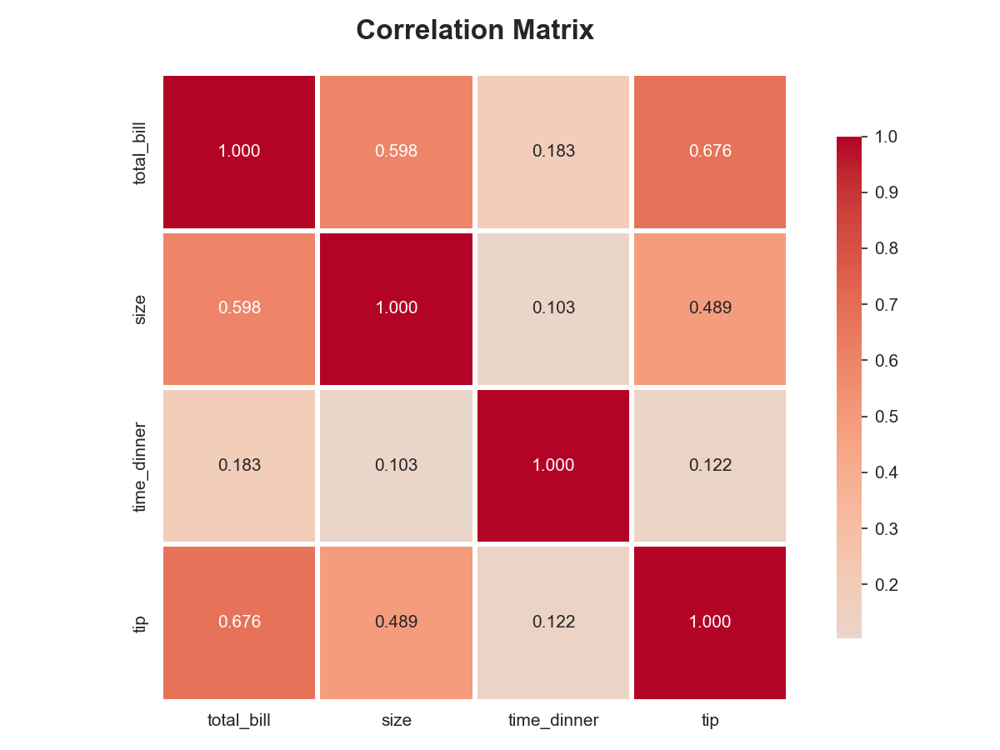

### Tip Percentage Analysis:

Expressing tip as a percentage of total bill reveals the source of the heteroscedasticity detected in assumption testing. Tip percentage is most variable at lower bill values and stabilises at the higher end of the bill range, producing the fan-shaped spread visible in the earlier scatter plot. This confirms that tipping is not purely proportional — some customers tip a fixed amount regardless of bill size — and explains why residual variance is systematically higher for lower predicted values:

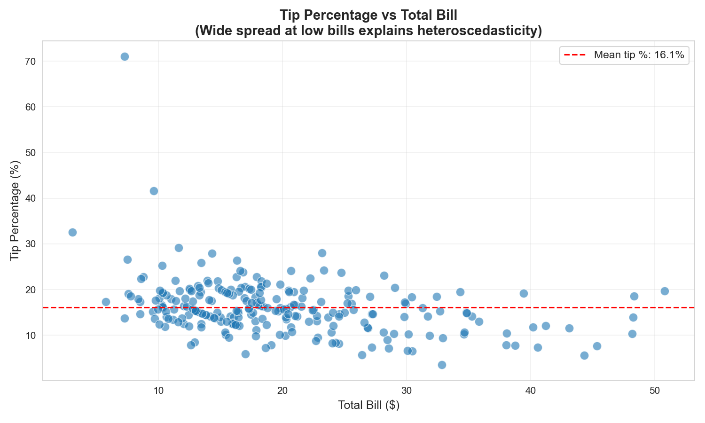

### Multicollinearity Assessment:

VIF values were calculated for each independent variable prior to model fitting:

```
  Feature    VIF  
 total_bill  9.216  
       size  9.271  
time_dinner  3.170
```

No variable exceeds the high-multicollinearity threshold of 10, however the values for total bill (9.216) and party size (9.271) are close to that boundary, reflecting the moderate correlation between these two predictors (r ≈ 0.60). The independent coefficient estimates for these features carry more uncertainty than they would in a fully orthogonal design and should be interpreted accordingly.

### Model Coefficients and Statistical Significance:

Feature scaling was applied prior to fitting, with the following pre-scaling statistics for the independent variables:

```
        total_bill     size  time_dinner  
mean        20.218    2.574        0.728  
std          8.771    0.941        0.446
```

The scikit-learn model fitted on the scaled data produces the following equation, where the standardised coefficients are directly comparable across features:

_Tip = 3.088 + (0.801 × total_bill) + (0.248 × size) − (0.024 × time_dinner)_

To assess whether each predictor's contribution is statistically distinguishable from zero — which scikit-learn does not provide — a statsmodels OLS model was fitted on the unscaled features:

```
Feature             Coef   Std Err   t-stat   p-value     Sig
-------------------------------------------------------------
Intercept         0.6712    0.2100    3.197    0.0016  Medium
total_bill        0.0928    0.0092   10.037    0.0000    High
size              0.1926    0.0855    2.253    0.0252     Low
time_dinner      -0.0041    0.1475   -0.028    0.9777    n.s.
```

Significance: High p<0.001 — Medium p<0.01 — Low p<0.05 — n.s. not significant

The model-level F-statistic (70.34, p < 0.0001) confirms overall model significance. The adjusted R² of 0.461 provides a more conservative measure of fit than the unadjusted R², penalising for the addition of predictors.

The 95% confidence intervals for each coefficient are visualised below. An interval that does not cross zero confirms statistical significance; the width of the interval reflects the precision of the estimate:

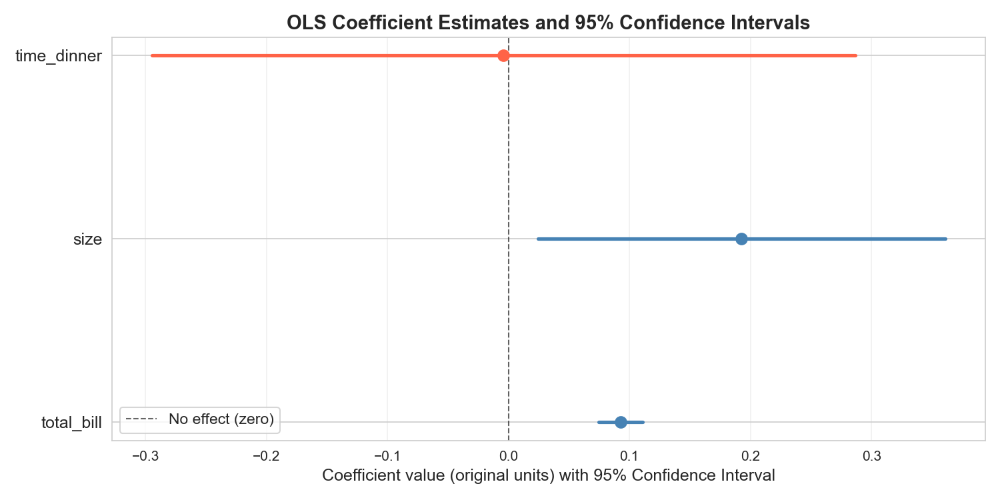

### Model Performance:

The model was evaluated on both the training and test sets:

```
Metric  Training Set  Test Set
R²      0.4519        0.4772
RMSE    1.06          0.81
MAE     0.76          0.67
```
The test set R² of 0.4772 indicates the model accounts for 47.7% of the variance in tip values, with a mean absolute error of 0.67. The scatter plot of predicted versus actual values on the test set shows a reasonable fit around the ideal diagonal, with the wider spread at higher predicted values consistent with the heteroscedastic pattern in the data:

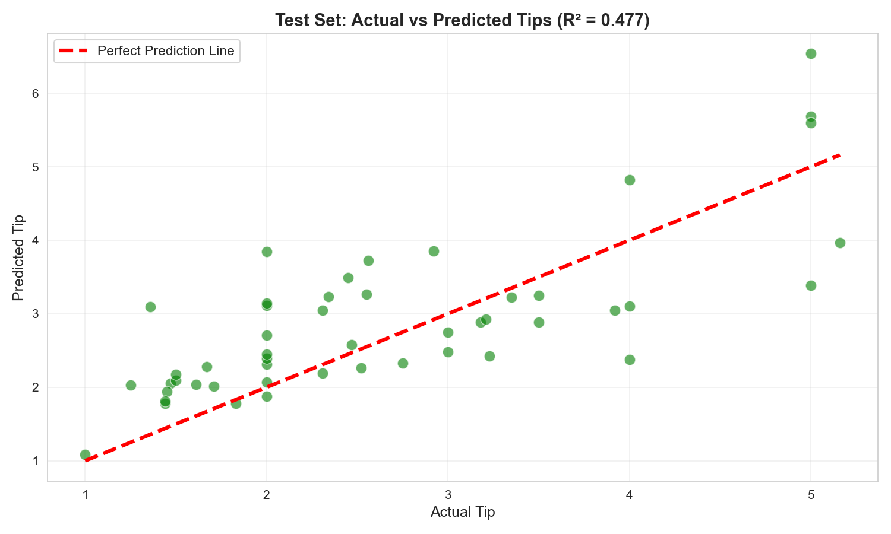

### Cross-Validation:

A single 80/20 split yields a test set of only 49 observations, making the single-split metrics sensitive to which observations are held out. 10-fold cross-validation was applied to obtain a more stable performance estimate, using a Pipeline to ensure scaling was applied within each fold independently:

```
Metric         Mean   Std Dev      Min      Max
R²           0.4159    0.2012   0.1217   0.7099
MAE          0.7551    0.1841   0.4580   1.0602
RMSE         1.0041    0.2588   0.5984   1.3839
```

The bar chart below shows R² for each individual fold, with the cross-validated mean and single-split result plotted as reference lines. The spread of R² values across folds characterises model stability across different subsets of the data:

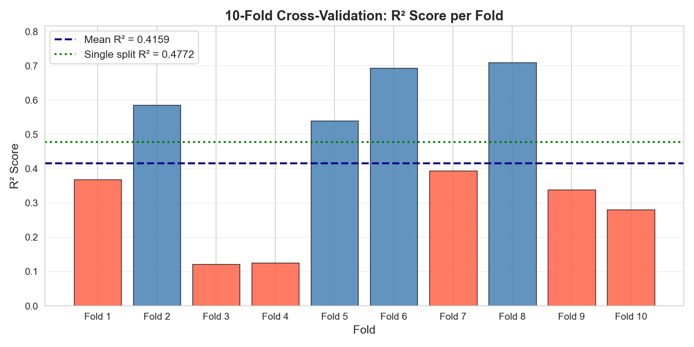

### Residual Analysis:

Residuals (actual − predicted) are plotted against predicted values and as a frequency distribution. The scatter shows a broadly random pattern around the zero line, without systematic curvature or trend. A slight fan-shape at lower predicted values is visible and is formally assessed in the Spearman test below:

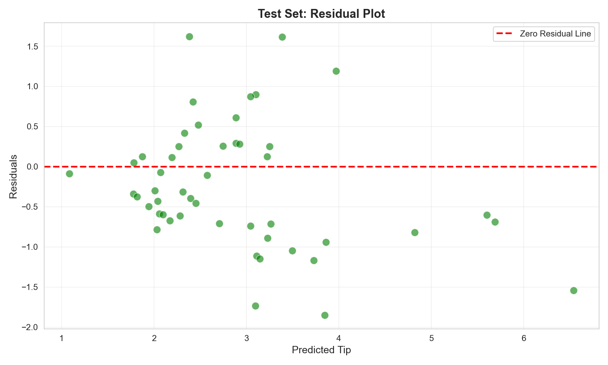

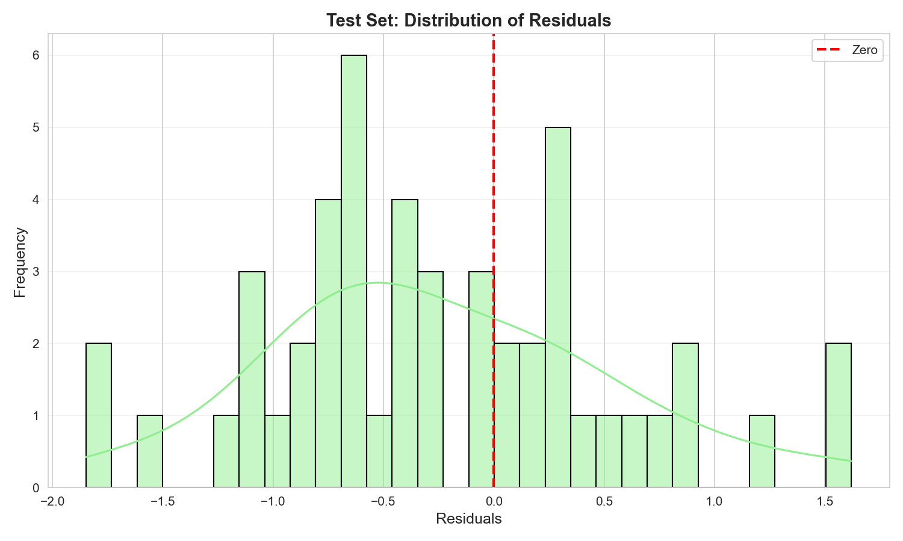

### Assumption Testing

#### Residual Normality — Shapiro-Wilk Test

H₀: Residuals are normally distributed.

The test returns a p-value of 0.4930. As p > 0.05, there is no significant evidence against normality. This assumption is satisfied.

#### Homoscedasticity — Spearman Correlation Test

H₀: Residual variance is constant across predicted values.

The test returns a Spearman correlation of 0.6063 and p-value of 0.0000. As p < 0.05, there is significant evidence of heteroscedasticity — residual variance increases systematically with predicted tip value. This assumption is violated and motivates the square-root transformation applied in the following section.

#### Multicollinearity

Assessed via VIF prior to model fitting — see Multicollinearity Assessment above.

### Influential Observations

Cook's Distance was calculated for each observation using the conventional threshold of 4/n (4/244) = 0.0164. 16 observations exceed this threshold, indicating that their removal would materially alter the fitted coefficients. These predominantly correspond to observations with unusually high or low tip percentages relative to bill value  

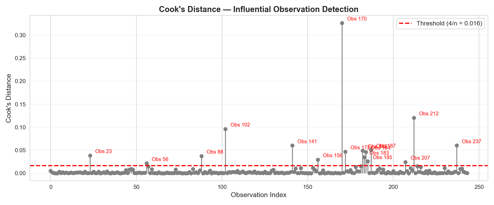

### Feature Importance

Feature importance is derived from the absolute standardised coefficients of the scikit-learn model, where feature scaling ensures comparability across predictors. Total bill is confirmed as the dominant predictor by a considerable margin. Time of day contributes negligibly — consistent with the OLS analysis, where the time_dinner coefficient does not reach statistical significance:

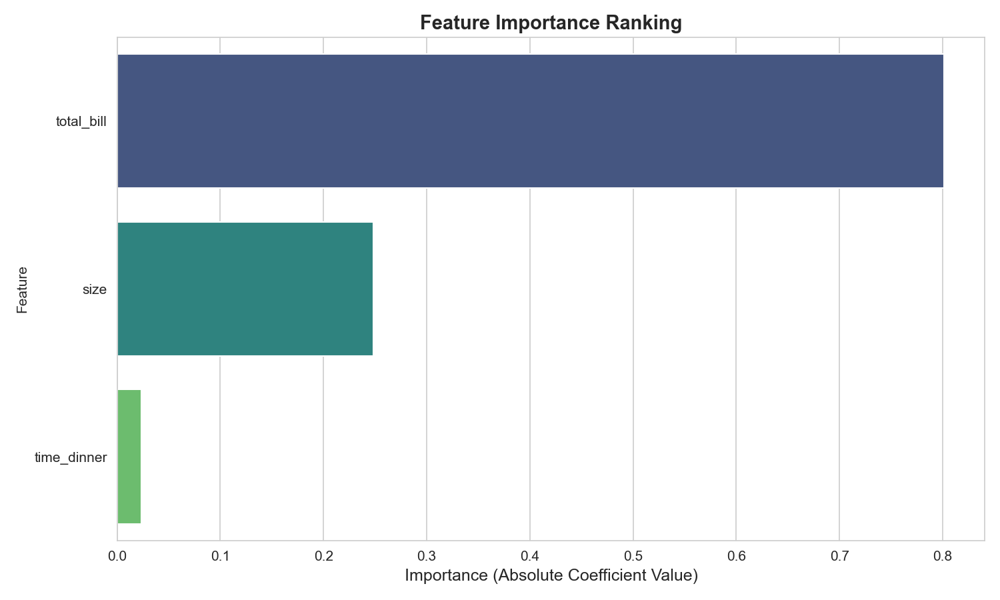

### Target Variable Transformation

The heteroscedasticity detected by the Spearman test motivates a square-root transformation of the target variable. A second model was fitted using √tip (Square-root of the tip value) as the target, with predictions back-transformed to the original scale for direct metric comparison. The Spearman test was re-run on the transformed model's residuals to assess whether the transformation resolves the heteroscedastic pattern:

```
Metric                                Original  Sqrt Transform
R² (on respective target scale)         0.4772          0.4825
MAE (original tip scale)                0.67            0.68
RMSE (original tip scale)               0.81            0.82
Spearman corr (heteroscedasticity)      0.61            0.34
Spearman p-value                        0.0000          0.017
```

The side-by-side residual plots below show the change in residual pattern between the two models, with the updated Spearman p-value confirming the degree to which the transformation addresses the heteroscedasticity:

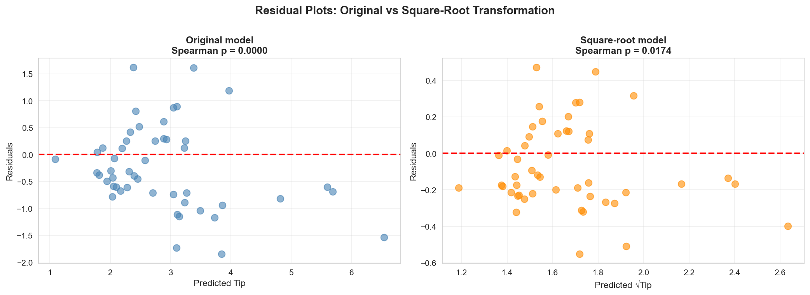


## Conclusions:

The analysis addressed a clear business question: can tip amount be predicted from total bill value, party size, and time of day? The model provides a statistically significant and practically interpretable answer, though with material unexplained variance that points to the influence of factors — service quality, individual behaviour, customer satisfaction — that are not captured in this dataset.

### Model Performance

The model accounts for 47.7% of variance in tip values on the test set (R² = 0.4772), with a mean absolute error of 0.67. The adjusted R² from the OLS model of 0.4612 — which penalises for the number of predictors and is the more appropriate summary statistic for a multi-predictor regression — provides a marginally more conservative estimate of explanatory power.

The single train/test split, which yields a test set of only 49 observations, is supplemented by 10-fold cross-validation, which returns a mean R² of 0.4159 ± 0.2012. The cross-validated result is modestly below the single-split figure, indicating some sensitivity to the particular partition of the data.

The square-root transformation of the target variable produces a test R² of 0.4825 on the transformed scale, with an MAE of 0.6835 on the original tip scale — a modest change relative to the original model. The Spearman test on the transformed residuals returns p = 0.0174, indicating the transformation partially reduces the heteroscedastic pattern. Given the limited performance gain, the original model remains the primary reference; the transformation is presented as a principled diagnostic response to the assumption violation rather than a substantive improvement.

### Key Findings

**Total bill amount is the dominant predictor of tip size**. Confirmed as statistically significant at p < 0.0001 in the OLS model, the standardised coefficient (0.801) is more than three times that of the next strongest predictor. For every £1 increase in total bill, the model estimates an increase of approximately £0.0928 in tip, holding other variables constant.

**Party size is a secondary but meaningful predictor**. With a standardised coefficient of 0.248 and [significance level] in the OLS output, larger parties are associated with higher tips — consistent with the expectation that larger groups generate larger bills and tip accordingly.

**Time of day is not a statistically significant predictor**. Despite dinner sittings showing a higher median tip in the exploratory analysis, the OLS coefficient for time_dinner (p = 0.9777) does not reach significance at α = 0.05, with a confidence interval that spans zero. The apparent difference between lunch and dinner tips is not reliably distinguishable from sampling variation in this dataset. This is an important qualification — it cautions against building operational decisions around sitting time as a tip driver.

**The tipping mechanism is partly non-proportional**. The tip percentage analysis reveals wide variation in tip rate at lower bill values, narrowing at higher values. This behaviour — rather than a consistent proportional rate — is the direct structural cause of the heteroscedasticity detected by the Spearman test, and is a meaningful insight into how customers form tipping decisions.

**16 observations exert disproportionate model influence**. Cook's Distance identifies 16 observations above the 4/n threshold, typically corresponding to high tip percentage values. These do not invalidate the model but represent cases where individual tipping behaviour departs substantially from the broader dataset pattern, and they are candidates for closer examination in any follow-on analysis.

### Assumption Testing

Residual normality is satisfied (Shapiro-Wilk p = 0.4930). Homoscedasticity is violated (Spearman correlation = 0.6063, p = 0.0000) — a predictable consequence of the non-proportional tipping behaviour identified in the tip percentage analysis, and partially addressed by the square-root transformation. Moderate multicollinearity is present between total bill and party size (VIF ≈ 9.2 for both), which increases uncertainty in the individual coefficient estimates for these predictors without invalidating the overall model.

### Limitations

The model leaves 52.3% of tip variance unexplained, attributable primarily to factors absent from the dataset — service quality, individual tipping habits, and customer satisfaction being the most likely drivers. The dataset is limited to 244 observations from a single restaurant over four days, which restricts generalisation to other settings. The moderate multicollinearity between total bill and party size means their individual coefficients should be interpreted with caution, particularly as predictors of the independent effect of each variable. The exclusion of the remaining categorical variables — day of week, server identity, and smoker status — was a deliberate modelling choice; their inclusion in an extended model represents the most direct path to improving explanatory power.


## Next steps:  

With any analysis it is important to assess how the model and data collection can be improved to better support the business goals.

Recommendations include:
* Collect additional features (e.g., day of week, server ID, meal type, customer satisfaction)
* Address the moderate multicollinearity identified in the variables
* Increase sample size for better generalisation
* Consider non-linear relationships (polynomial features)
* Transform the dependent variable (to address the heteroscedasticity detected from the Spearman Correlation test)
  * Note that a separate model was generated in a second phase using the square-root of the tip value increased the model accuracy slighty to account for 48.2% of the variance)
* Explore interaction effects between features

## Python code:
You can view the full Python script used for the analysis here: 
[View the Python Script](/Multi-Linear-Regression-Tips_v2.py)
