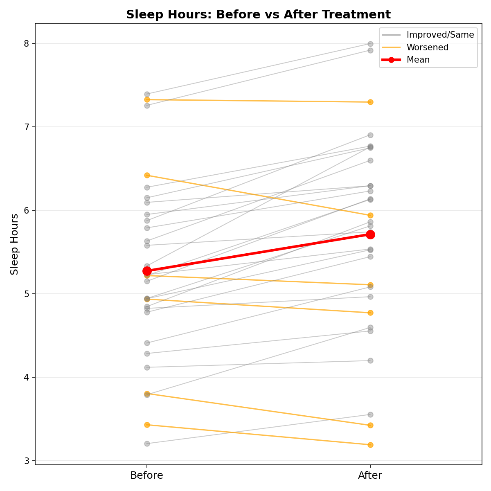
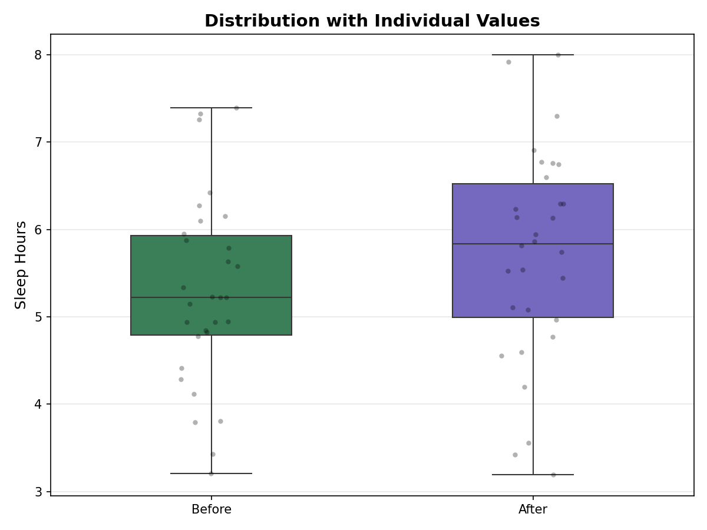

---

layout: default

title: Sleep Therapy Intervention (Paired Sample T-Test)

permalink: /paired-sample-t-test/

---

# This project is in development

## Goals and objectives:

For this portfolio project, the simulated business scenario concerns a fictional clinical sleep study involving 30 adult participants, with the goal of determining whether a structured sleep therapy intervention produces a statistically meaningful improvement in sleep duration.  A simple observation that average sleep hours increased after treatment would be insufficient for this purpose, as it cannot distinguish a genuine therapeutic effect from natural night-to-night variability in sleep patterns, regression to the mean, or the placebo effect.

The objective is therefore to apply a rigorous statistical framework that isolates the intervention's contribution with quantified confidence, producing a robust and clinically meaningful assessment of whether the therapy generated a genuine improvement in sleep duration, and if so, by how much and with what degree of certainty.  

A key objective is to demonstrate that evaluating the effectiveness of an intervention requires more than observing that an outcome changed after it was applied.  The analysis aims to show that only by correctly identifying the paired structure of the data — where each participant serves as their own control — and testing the distribution of individual-level differences against a null hypothesis of no effect, can a meaningful statistical conclusion be reached.  This within-subject design, and its implications for assumption testing and effect size interpretation, is central to the project and reflects the kind of methodological precision that separates a rigorous intervention analysis from a superficial before-and-after comparison.  

A secondary objective is to demonstrate awareness of the assumptions that underpin the paired samples t-test, specifically the requirement that the differences between paired observations are approximately normally distributed, and to show how these assumptions are tested and validated in practice — both through the Shapiro-Wilk test and through visual inspection via Q-Q plot. Where assumptions hold, the analysis proceeds with the parametric test; the Wilcoxon signed-rank test is additionally presented as the appropriate non-parametric alternative, with both results compared to illustrate the robustness of the conclusion.  A statistical power analysis is also included to contextualise the result, confirming whether the sample of 30 participants provides adequate sensitivity to detect an effect of the observed magnitude.  

By grounding every analytical decision in a clear methodological rationale, this project aims to demonstrate not only technical proficiency in Python and SciPy-based statistical testing, but also the ability to design, validate, and communicate a complete intervention analysis in a way that is meaningful to both technical and non-technical audiences.  

Ultimately, the project reflects a core principle of applied statistics: that understanding whether a treatment caused a change — and quantifying the size of that change with appropriate uncertainty — is far more valuable than simply observing that a difference exists.

## Application:  

A Paired Sample t‑Test (also called a dependent t‑test) is used to determine whether the mean difference between two related sets of observations is statistically significant. 

These “paired” observations come from the same subjects measured twice (before and after), or two conditions applied to the same participant, item, or process.

It answers the question:  “Did something change in a meaningful way?”

The technique computes the differences in observations, and using the mean and standard deviation of the differences, determines if this difference is statistically significant, and as a consequnce if there is a meaningful difference in the two sets of observations.

This approach is applicable across many sectors and scenarios.  Practical examples showing where a paired t‑test provides clear business value include:

🛍️ **Retail Sector**:
* Measure Impact of Store Layout Changes - Before‑and‑after comparison of customer dwell time, footfall flows, or basket size when a new layout is introduced.  This helps determine whether the redesign increases sales.
* A/B Testing In‑Store Promotions - Compare sales per customer before and after applying a new discount strategy in the same store.  This helps retailers optimise promotional return on investment.
* Training Effectiveness for Store Staff - Assess whether customer satisfaction scores for the same team improved after a training programme.

💻 **Technology Sector**:
* Software Performance Benchmarking - Compare system performance metrics (e.g., latency, CPU load) before and after code optimisation.  this identifies whether the new version truly improves performance.
* User Experience (UX) Improvements - Measure user completion time for tasks before and after a UI redesign.  This validates design choices based on statistically significant improvements.
* Cybersecurity Patch Impact - Compare false‑positive detection rates or scan times before vs after new threat‑detection algorithms.

🔬 **Science & Research Sector**:
* Clinical Trials & Experiments - Measure physiological indicators (e.g., heart rate, blood pressure) pre‑ and post‑treatment on the same subjects.
* Environmental Measurements - Assess changes in pollutant concentration before and after the introduction of a filtering system.
* Psychology & Behavioural Experiments - Compare participant scores on a cognitive task before and after an intervention such as mindfulness training.

🏭 **Manufacturing Sector**:
* Process Improvement (Lean / Six Sigma) - Compare defect rates from the same production line before vs after a process optimisation.
* Equipment Calibration Impact - Assess whether recalibration improves precision on the same machine.
* Energy Efficiency Testing - Compare power consumption of machinery before and after implementing efficiency controls.

A/B Testing and Paired Sample t‑Tests are related but significantly different.  A paired sample t‑test is a specific statistical test, whereas a A/B testing is an experimental framework that may use a t‑test (paired or unpaired), but also uses many other statistical methods.  For example, within this portfolio, there is an A/B Test example using chi-squared test of independence.

## Methodology:  

The methodology adopted for this project follows the end-to-end data science workflow, progressing from raw data through to the extraction and communication of business insight. The project is implemented in Python, using pandas for data manipulation, scipy for statistical testing, and seaborn and matplotlib for visualisation. Each stage of the pipeline is described in detail below.  

**Data Generation**:  The dataset is synthetically generated as part of the Python script, simulating a clinical sleep study involving 30 adult participants. Sleep hours before treatment are drawn from a normal distribution with a mean of 5.5 hours and a standard deviation of 1.2 hours, clipped to the realistic range of 3–8 hours.  Individual improvement scores are then sampled from a separate normal distribution (mean 0.5 hours, SD 0.5 hours) and added to each participant's pre-treatment value to produce their post-treatment sleep duration, clipped to a maximum of 10 hours. This design introduces realistic between-participant variability in treatment response, ensuring the simulated data reflects the heterogeneity typical of real clinical populations while remaining fully reproducible via a fixed random seed.

**Exploratory Data Analysis**:  Exploratory analysis is performed on the Before treatment values, the After treatment values, and most critically the pairwise Differences (After − Before), which are the direct subject of the paired t-test.  Descriptive statistics are computed for all three series, including the mean, standard deviation, minimum, and maximum.  For the Difference scores specifically, the Standard Error of the Mean is also calculated, which quantifies the uncertainty around the observed mean difference as an estimate of the true population effect.  

Four charts are produced to support exploratory and diagnostic analysis, two of which further support the Testing Assumptions:

* A slope plot connecting each participant's Before and After values.
* A boxplot with overlaid strip plot, comparing the Before and After distributions side-by-side.
* A histogram with KDE of the Difference scores
* A Q-Q plot of the Difference scores

**Testing assumptions**:  A paired t-test has three core assumptions, each requiring a specific diagnostic check.  

* **Independence of Pairs (Between-Pair Independence)** — Each pair of observations must come from an independent subject; one participant's data must not influence another's. While each participant contributes two measurements, the pairs themselves must be independent of one another. This is satisfied by design in the data generation process, where each participant's values are drawn independently.
* **Normality of the Difference Scores** — The paired t-test requires that the pairwise differences (After − Before) are approximately normally distributed. Importantly, normality is not required of the Before or After values individually — only of their differences. This assumption is assessed using three complementary approaches: a histogram with KDE overlay, a Q-Q plot, and the Shapiro-Wilk test. If this assumption were violated, the appropriate non-parametric alternative would be the Wilcoxon Signed-Rank Test, which is also presented in this analysis for comparison.
* **No Extreme Outliers in the Difference Scores** — Outliers in the Difference scores can distort the mean difference and inflate the t-statistic, potentially producing a misleading result. This is assessed visually using a boxplot of the Difference scores, with any flagged values inspected individually.

**Statistical Testing and Effect Size**: The paired samples t-test is performed using scipy.stats.ttest_rel(), comparing After against Before values. The test computes the mean of the Difference scores, assesses how far this departs from zero relative to the variability in the differences, and returns a t-statistic and two-tailed p-value. The result is evaluated against a significance threshold of α = 0.05.  
In addition to the p-value, Cohen's d is calculated as the effect size measure, defined as the mean difference divided by the standard deviation of the differences. This quantifies the practical magnitude of the treatment effect independently of sample size, and is interpreted using conventional benchmarks (negligible: <0.2, small: 0.2–0.5, medium: 0.5–0.8, large: >0.8).  
A 95% confidence interval for the mean difference is also constructed, providing a plausible range for the true population-level effect.  

**Statistical Power Analysis**: A power analysis is conducted to contextualise the result and assess whether the sample of 30 participants provides sufficient sensitivity to detect an effect of the observed magnitude. Power is calculated using the observed Cohen's d and a significance level of α = 0.05. A study is conventionally considered adequately powered when it achieves 80% power or above — meaning there is at least an 80% probability of correctly rejecting the null hypothesis when a true effect of the observed size exists.  

## Results:

Using the stated methodology the following results were obtained:

**Exploratory Data Analysis**:  

The descriptive statistics for the Before, After and Difference statistics were:

Before Treatment:
  Mean: 5.274 hours
  SD:   1.080 hours
  Min:  3.204 hours
  Max:  7.395 hours

After Treatment:
  Mean: 5.714 hours
  SD:   1.218 hours
  Min:  3.191 hours
  Max:  7.999 hours

Difference (After - Before):
  Mean: 0.439 hours
  SD:   0.466 hours
  SE:   0.085 hours  (the variability of the sample mean across different possible samples)

Five charts are produced to support exploratory and diagnostic analysis:

* A slope plot connecting each participant's Before and After values, with the group mean highlighted, providing an immediate visual impression of the direction and consistency of change across participants.
* A slope plot with outcome-coded colouring, distinguishing participants whose sleep improved (grey) from those whose sleep worsened (orange), allowing the proportion and pattern of non-responders to be identified at a glance.
* A boxplot with overlaid strip plot, comparing the Before and After distributions side-by-side, making shifts in central tendency and spread visible at a glance.
* A histogram with KDE of the Difference scores, with reference lines at the mean difference and at zero (no change), used to visually assess the shape and approximate normality of the differences.
* A Q-Q plot of the Difference scores, used in conjunction with the Shapiro-Wilk test to assess the normality assumption visually.

## Conclusions:

Conclusions from the project findings and results.

## Next steps:  

With any analysis it is important to assess how the model and application of the analytical methods can be used and evolved to support the business goals and business decisions and yield tangible benefits.

## Python code:
You can view the full Python script used for the analysis here: 
[View the Python Script](/Paired Sample T-Test.py)
