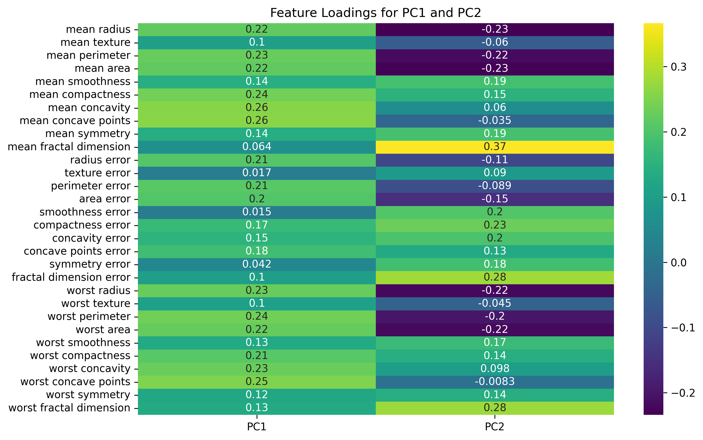
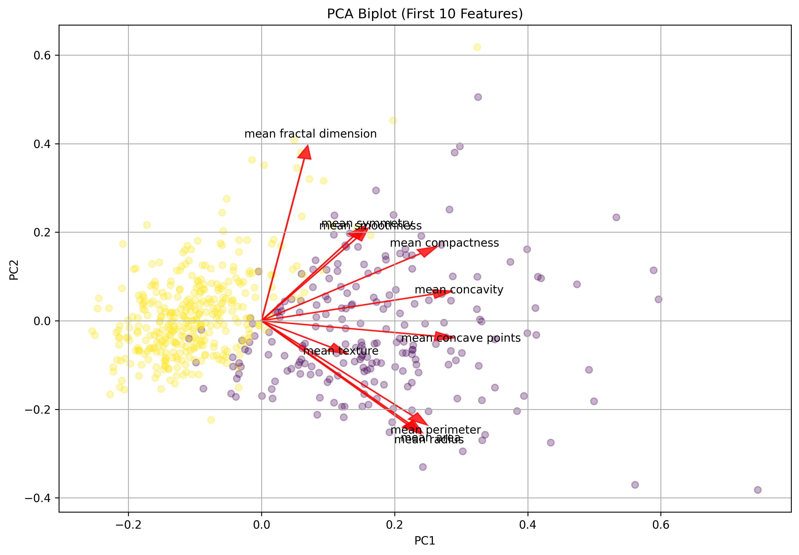
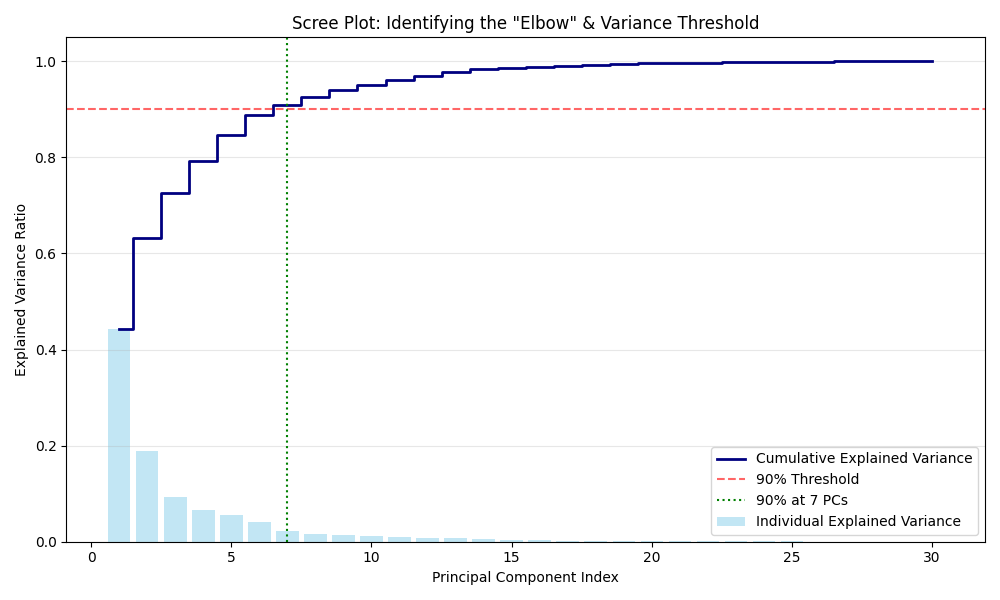

---

layout: default

title: Breast Cancer Dataset (Principal Component Analysis)

permalink: /principal-component-analysis/

---

# This project is in development 

## Goals and objectives:

The business objective is to predict the cancer status of cells (benign or malignant) based on 30 features of the cells observed via digitised images.  Three previous projects build prediction models using different techniques to achieve high accuracy predictions (decision trees, random forests and gradient boosted trees).  High levels of correlation between some of the features were identified, which lead to recommended analysis into opportunities for dimensionality reduction.  This project is to research the benefits of applying Principal Component Analysis (PCA) as a technique for deimensionality reduction on the 30 features within the Wisconsin Breast Cancer dataset.

The Wisconsin Breast Cancer dataset is considered a good case for researching and demonstrating PCA because it suffers from extreme redundancy, as highlighted by the high correlation of features. When features are highly correlated, they are essentially telling the same story multiple times.

The analysis showed that there is high redundency of features in the dataset.  The two principle components identified explain over 63% of variance, with the first 7 components explaining over 91% of the variance.  This shows that using less than a quarter of the variables collected (30 features are measured), most of the information needed to describe these tumors is included.  The two principal components relate to size& shape and irregularity.  Overall the dataset supported the demonstration of the benefits of applying PCA to data with a large volume of features.

## Application:  

Principal Component Analysis (PCA) is essentially a "space-saving" technique for data. It’s a dimensionality-reduction method that transforms a large set of variables into a smaller one that still contains most of the original information.  PCA is considered an unsupervised learning algorithm, as it does not use labels as a target variable, and looks only at the  structure of the input data.  PCA is used for feature extraction and exploratory analysis, in addition to dimensionality-reduction.

An analogy is taking a high-resolution 3D photo of a complex object and finding the perfect 2D angle that captures its shape so well that a user wouldn't even miss the third dimension.

PCA identifies patterns in data based on the correlation between features. It seeks to maximise variance, finding the directions (Principal Components) along which the data is most spread out.  Common steps for applying PCA include:  

* **Standardisation:** Scaling the data so each variable contributes equally.
* **Covariance Matrix Computation:** Identifying how variables vary from the mean with respect to each other.
* **Eigenvector/Eigenvalue Calculation:** Determining the principal components.
* **Feature Vector:** Choosing which components to keep and which to discard.

Benefits of Using PCA include:

* **Dimensionality Reduction:** It simplifies complex datasets, making them easier to explore and visualize (e.g., turning 10 variables into a 2D plot).
* **Noise Reduction:** By discarding components with low variance, you often filter out "noise" and keep the "signal."
* **Improved Algorithm Performance:** Many machine learning algorithms (like regressions or clustering) run faster and more accurately when they aren't bogged down by redundant variables.
* **Feature Correlation:** It eliminates multicollinearity, ensuring that the remaining features are independent of one another.

PCA is a technique that can be applied in multiple scenarios across all business sectors. PCA serves as a "noise filter," allowing professionals to ignore the hundreds of minor variables and focus on the few underlying forces that actually drive results.  Practical real-world examples include:

* **Medical Sector: Genomics & Disease Subtyping** - In modern medicine, a single patient sample can contain data on expression levels for over 20,000 genes. Researchers use PCA to condense these thousands of gene expressions into a few "eigen-genes".  This helps identify distinct patient clusters. For example, in cancer research, PCA can reveal that what looks like one disease is actually three different subtypes that require different treatments, based on how the gene data clusters in multi-dimensional space, where PCA reduces the dimensions simplfying the understanding.

* **Finance Sector: Portfolio Risk Management** - Financial markets contain multiple fluctuating stock prices, interest rates, and commodity values.  Analysts apply PCA to a portfolio of dozens of stocks to find "Common Factors".  Instead of watching many individual stock movements (e.g. 50-100), they watch the first few principal components (e.g. 3-5), which often represent Market Sentiment, Interest Rate Sensitivity, and Industry Trends.  A primary benefit is that PCA simplifies Risk Assessment.  As an example, should the first principal component (e.g. "The General Market") drop, the analyst knows exactly how much of their portfolio is exposed to that specific systematic risk versus individual company risk.

* **Manufacturing Sector: Quality Control & Predictive Maintenance** - High-tech factories use hundreds of sensors to monitor temperature, vibration, pressure, and speed on an assembly line.  PCA aggregates these sensor readings into a a few (or even a single) "Health Score".  This application of PCA supports improved Anomaly Detection. For example, in a 30-sensor system, it’s hard to tell if one sensor is slightly off. However, when PCA combines them, a "drift" in the first principal component can signal that a machine is beginning to fail long before an actual breakdown occurs, allowing for proactive maintenance.

* **Science Sector: Remote Sensing & Climate Study** - Satellite imagery (Hyperspectral imaging) captures data across hundreds of different light wavelengths, many of which are invisible to the human eye. Scientists apply PCA to satellite data of a forest or ocean.  A key benefit of this application of PCA, is Feature Extraction. While a raw image might just look green, PCA can separate the "noise" of sunlight reflection from the "signal" of chlorophyll density or moisture levels. This allows scientists to map deforestation or drought levels with extreme precision using just the top 2 or 3 components.

## Methodology:  

Details of the methodology applied in the project.

The dataset used is the same as used in the Decision Tree, Random Forest and Gradient Boosted Trees projects - the Wisconsin Breast Cancer dataset.  This is available from scikit-learn, including 569 observations, including 30 independent features.

The dataset is also available from Kaggle [here](https://www.kaggle.com/datasets/uciml/breast-cancer-wisconsin-data)  

* **Dataset validation** to confirm no missing values, and basic descriptive analysis on the features including the correlation between the 30 features. No data pre-processing was undertaken.  
* **Scaling**  the feature data, so that for each feature the mean is zero, with a standard deviation equal to 1.  This is an important step in performing PCA as the technique is based on variance, therefore a variable with a range of 0 – 1,000 will unfairly dominate a variable with a range of 0–1.
* **Identify the top 2 components** for the breast cancer features.  The initial model was to determine the top 2
* **Understand the principal components** -
* **Determine optimal number of components** - 

## Results and conclusions:

### Feature Correlation:

Correlation of the 30 features was determine as visualised in the correlation matrix below. This highlights that many of the fields have low-correlation, however there appears to be high-correlation in the features relating to radius, area and perimeter metrics, where the correlation is in the range (0.8, 1.0).  This evidence of high-correlation suggests the implementation of PCA is suitable to this data.


### Identifying 2 Principal Components:

The plot below shows the plot of the points for the training data against the top 2 principal components, mapped to the determined diagnosis of malignant or benign.  This plot visualises there is good separation of the dependent variable for the data plotted against the two principal components.


Each of the two principal components are a combination of the features in the original data.  The variance explained by the first 2 principal components is 63.24%.  The PCA scatter plot shows a clear boundary between the two classes, which reveals that the "Malignant" and "Benign" samples are not randomly distributed, as they form distinct, separable clusters in reduced space.

Visualising PCA is crucial because the components themselves are "abstract", they don't have the simple names (like "mean radius") that original data has. To truly understand them, you need to look at both the variance they capture and the influence of the original variables.



### Understanding the Principal Components:

A Biplot is a powerful visualisation in PCA because it bridges the gap between the "abstract" principal components and the "real-world" features.  

A Biplot is a scatter plot with vectors (arrows) overlaid. Each arrow represents an original feature (e.g., area, smoothness).  The direction of the arrow shows which component that feature contributes to most.  If an arrow for "Mean Area" points heavily along the X-axis (PC1), then PC1 represents "Size".  Longer arrows indicate that the feature has a stronger influence on that component.

If two arrows are close together, those features are highly correlated.  If arrows are 90° apart, they are uncorrelated.

The Biplot below shows the relation of the top 10 features for the 2 principal components (not all 30 features were included for simplicity).  



From the biplot it can be seen that arrows for "mean area", "mean perimeter", and "mean radius" all pointing in almost exactly the same direction (the labels are overlapping as a consequence).  This is visual confirmation of the high correlation we discussed earlier, i.e. they are effectively providing the same information to the model.  As the the "mean area", "mean perimeter", "mean radius", and "mean concavity" features point heavily along the PC1 axis, it can be interpretted that these are strongly associated with a high value in PC1.

It is seen from the heatmap and the biplot that PC1 is heavily weighted by "Size" and "Shape" features (Concavity, Area, Radius, Perimeter), while PC2 is heavily weighted by "Shape Irregularity" features (Fractal Dimension). This suggests renaming PC1 to "Tumour Size and Shape" and PC2 to "Tumour Irregularity" may support better understanding of the components.

### Optimum number of components:

A Scree Plot shows the percentage of total variance explained by each principal component, and is a key analytical tool to determine the optimum number of components to use.  The initial analysis of principal components considered the top 2, where the value of 2 was selected for demonstration purposes.  More thorough analysis of the optimum number of components.

To understand how many components are needed, a Scree Plot combined with a Cumulative Variance calculation is used. This allows quantifying exactly how much information is retained as dimensions are reduced.  The goal of this is to simplify the data by having a small number of components, to capture a large amount of information.

The component variance report below shows the variance captured by each component in decreasing order.  It shows that should the number of components be required to capture >90% of the variance, then the top 7 components would provide this (accounting for 91.01% of the variance).  The scree plot shows the explained variance for the components in decreasing order, as well as the cumulative variance.

The scree plot shows an elbow at 3 components, explaining 72.64% of the variance.  This suggests that the optimum number of components is 3 as the variance explained by subsequent components is diminishing.  However, should it be required to select components that explain a specified percentage of variance (say 90%), then 3 isn't the optimal value, and the scree plot would provide the required analytics.

```
Component Explained Variance
PC1: 44.27% (Cumulative: 44.27%)
PC2: 18.97% (Cumulative: 63.24%)
PC3: 9.39% (Cumulative: 72.64%)
PC4: 6.60% (Cumulative: 79.24%)
PC5: 5.50% (Cumulative: 84.73%)
PC6: 4.02% (Cumulative: 88.76%)
PC7: 2.25% (Cumulative: 91.01%)
PC8: 1.59% (Cumulative: 92.60%)
PC9: 1.39% (Cumulative: 93.99%)
PC10: 1.17% (Cumulative: 95.16%)
```  



### Conclusions:

Conclusions from the project findings and results.

Data Compression: You can reduce the dataset from 30 features to just 7 while still retaining 91% of the original information.  
Efficiency: By using only the components before the "elbow," you significantly reduce the complexity of any machine learning model you build afterward, often leading to better generalization and faster training times.  
Information Loss: The remaining 23 components only contain about 9% of the total variance combined, confirming that most features in this dataset were highly redundant.

* **Large Data Redundancy** - The 30 features measured in the Wisconsin dataset are highly redundant.  The first two principal components alone capture approximately 63% of the total variance, and just 7 components reach the 90% mark.  Most of the information needed to describe these tumors is contained in less than a quarter of the variables collected.

* **Structural Separation of Tumor Types** - PCA reveals that the "Malignant" and "Benign" samples are not randomly distributed; they form distinct, separable clusters in reduced space.  The PCA scatter plot shows a clear boundary between the two classes.  This confirms that the underlying physical characteristics of the cells are fundamentally different between the two groups, making this dataset an excellent candidate for machine learning classification.

* **Size and Shape as the Primary Drivers (PC1)** - By examining the loadings, we can conclude that the first principal component (PC1) essentially represents the overall magnitude or "bulk" of the cell nuclei, along with the shape in terms of the concavity.  Features like mean radius, mean perimeter, mean area, and mean concavity all have high, positive loadings on PC1 and their vectors in the Biplot point in the same direction.  The single most important factor distinguishing these samples is how large and concave the cells are. Larger values on the PC1 axis correlate strongly with malignant samples.

* **"Irregularity" as the Secondary Driver (PC2)** - While PC1 focuses on size, PC2 often captures features related to the complexity or irregularity of the cell boundary.  This can be interpretted as the texture of the cell boundary.  Features like smoothness, and fractal dimension often weight heavily on PC2.  After accounting for size, the next most important differentiator is how "deformed" or "rough" the cell edges are. This provides a secondary layer of diagnostic information that size alone might miss.

* **Identification of "Proxy" Features** - The Biplot reveals that many features are virtually identical in the information they provide.  This is evidenced by the arrows for radius, perimeter, and area are almost perfectly overlapping.  In a real-world clinical setting, the data collection process could be simplified by reducing the number of measurements. Instead of meticulously measuring all three, just one could be measured (e.g., mean area) to act as a "proxy" for the others without losing significant diagnostic power.

* **Detection of Transitionary Samples** - Not all points sit deep within their respective clusters; some sit in the "border zone" between Benign and Malignant.  This is represented as the overlap area in the PCA scatter plot.  These points represent "borderline" cases where the cell characteristics are ambiguous.  PCA helps identify these specific samples for further review by a human pathologist, highlighting where the automated model might be less certain.

## Next steps:  

With any analysis it is important to assess how the model and application of the analytical methods can be used and evolved to support the business goals and business decisions and yield tangible benefits.


## Python code:
You can view the full Python script used for the analysis here: 
[View the Python Script](/DecisionTree_BreastCancer.py)
