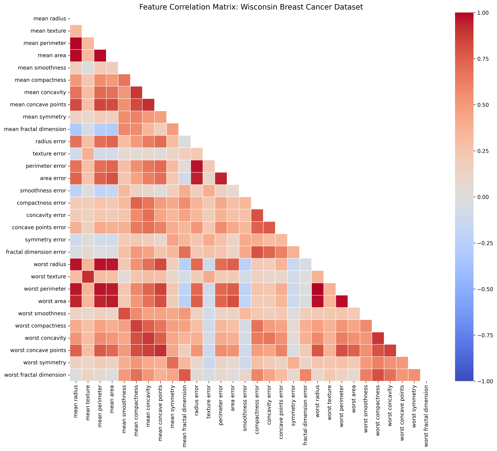
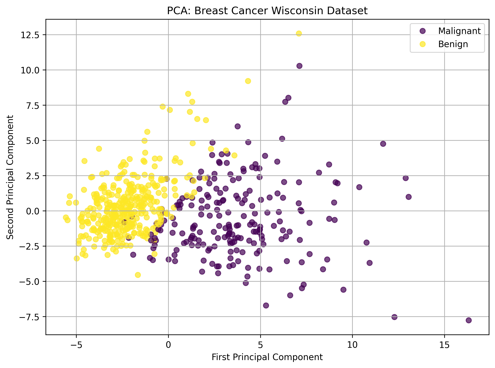
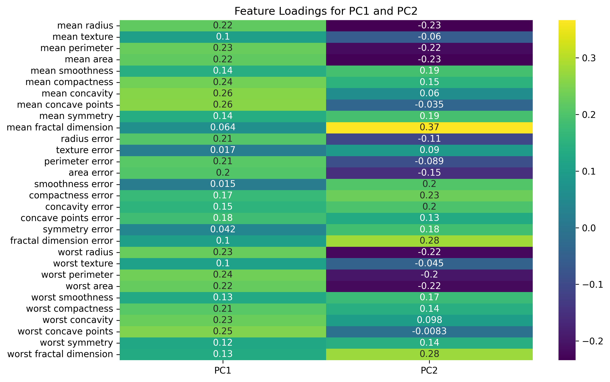
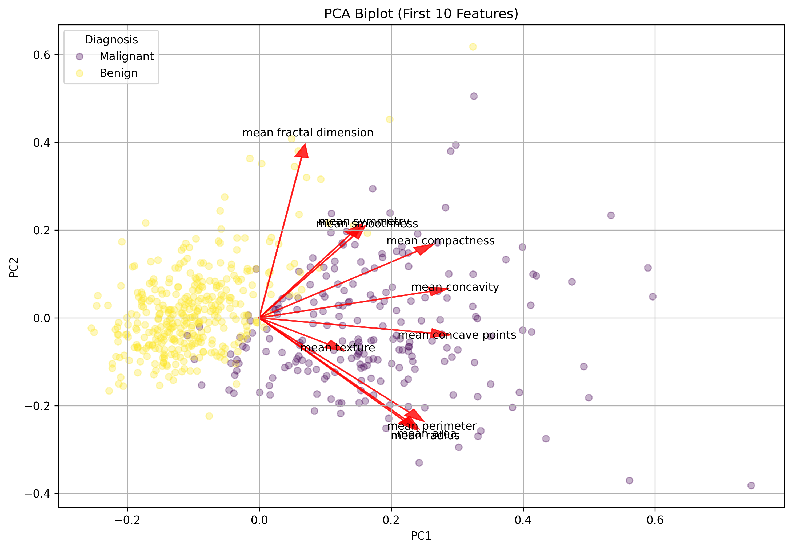
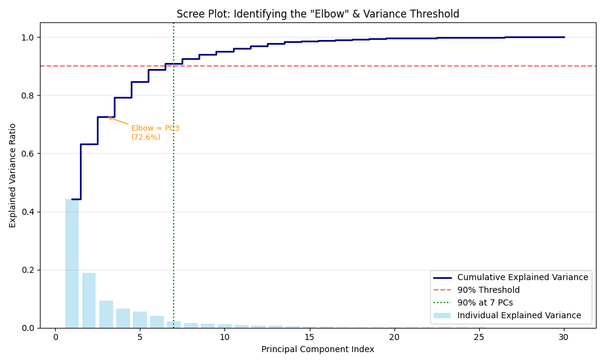

---

layout: default

title: Breast Cancer Dataset (Principal Component Analysis)

permalink: /principal-component-analysis/

---

## Goals and objectives:

Three previous projects applied supervised classification models (Decision Tree, Random Forest, and Gradient Boosted Trees) to the Wisconsin Breast Cancer dataset, achieving high predictive accuracy across 30 morphological features. High inter-feature correlation was identified in those projects, motivating investigation into dimensionality reduction as a means of simplifying the feature space without significant loss of information.

This project applies Principal Component Analysis (PCA) to the same dataset, with the following objectives:

* **Justify the application of PCA** by validating the presence of high multicollinearity across the 30 features via a correlation matrix.
* **Demonstrate dimensionality reduction** by projecting the data onto two principal components and visualising the resulting class separation between malignant and benign samples.
* **Interpret the principal components** by analysing feature loadings to assign meaningful real-world meaning to the abstract components identified.
* **Determine the optimal number of components** using a Scree Plot and cumulative variance analysis, identifying both the elbow point and a defined variance threshold.

The analysis confirms substantial redundancy across the 30 features: PC1 and PC2 together explain 63.24% of variance, and the Scree Plot identifies an elbow at 3 components (72.64%). For the purposes of demonstration and visualisation, this project focuses on 2 components; in a downstream classification task, 3 or more components would be the recommended starting point.

## Application:  

Principal Component Analysis (PCA) is essentially a "space-saving" technique for data. It’s a dimensionality-reduction method that transforms a large set of variables into a smaller one that still contains most of the original information.  PCA is an unsupervised learning algorithm, as it does not use labels as a target variable, and looks only at the  structure of the input data.  Beyond dimensionality reduction, PCA is widely used for feature extraction, noise filtering, and exploratory data analysis.

An analogy is taking a high-resolution 3D scan of a complex object and finding the 2D projection that preserves the most detail — so that a viewer captures the essential structure without needing the third dimension.

PCA identifies patterns in data based on the correlation between features. It seeks to maximise variance, finding the directions (Principal Components) along which the data is most spread out.  Mathematically, this is achieved by computing the eigenvectors of the feature covariance matrix; each eigenvector defines a principal component direction, and its corresponding eigenvalue quantifies the variance explained in that direction. 

Benefits of Using PCA include:

* **Dimensionality Reduction:** It simplifies complex datasets, making them easier to explore and visualize (e.g., turning 10 variables into a 2D plot).
* **Noise Reduction:** By discarding components with low variance, you often filter out "noise" and keep the "signal."
* **Improved Algorithm Performance:** Many machine learning algorithms (like regressions or clustering) run faster and more accurately when they aren't bogged down by redundant variables.
* **Feature Correlation:** It eliminates multicollinearity, ensuring that the remaining features are independent of one another.

PCA is a technique that can be applied in multiple scenarios across all business sectors. PCA serves as a "noise filter," allowing professionals to ignore the hundreds of minor variables and focus on the few underlying forces that actually drive results.  Practical real-world examples include:

🏥 **Life Sciences: Genomics & Disease Subtyping** - In modern medicine, a single patient sample can contain data on expression levels for over 20,000 genes. Researchers use PCA to condense these thousands of gene expressions into a few "eigen-genes".  This helps identify distinct patient clusters. For example, in cancer research, PCA can reveal that what looks like one disease is actually three different subtypes that require different treatments, based on how the gene data clusters in multi-dimensional space, where PCA reduces the dimensions simplifying the understanding.

🏦 **Finance: Portfolio Risk Management** - Financial markets contain multiple fluctuating stock prices, interest rates, and commodity values.  Analysts apply PCA to a portfolio of dozens of stocks to find "Common Factors".  Instead of monitoring individual stock movements across a large portfolio, analysts watch the first few principal components, which often capture dominant sources of shared variance — such as broad market movements, sector-wide trends, or interest rate sensitivity — though interpreting components in economic terms requires care, as PCA components are defined mathematically, not conceptually.

🏭 **Manufacturing: Quality Control & Predictive Maintenance** - High-tech factories use hundreds of sensors to monitor temperature, vibration, pressure, and speed on an assembly line.  PCA aggregates these sensor readings into a a few (or even a single) "Health Score".  This application of PCA supports improved Anomaly Detection. For example, in a 30-sensor system, it’s hard to tell if one sensor is slightly off. However, when PCA combines them, a "drift" in the first principal component can signal that a machine is beginning to fail long before an actual breakdown occurs, allowing for proactive maintenance.

🏥 **Science: Remote Sensing & Climate Study** - Satellite imagery (Hyperspectral imaging) captures data across hundreds of different light wavelengths, many of which are invisible to the human eye. Scientists apply PCA to satellite data of a forest or ocean.  A key benefit of this application of PCA, is Feature Extraction. While a raw image might just look green, PCA can separate the "noise" of sunlight reflection from the "signal" of chlorophyll density or moisture levels. This allows scientists to map deforestation or drought levels with extreme precision using just the top 2 or 3 components.

## Methodology:  

The dataset used is the Wisconsin Breast Cancer dataset, consistent with the Decision Tree, Random Forest, and Gradient Boosted Trees projects in this portfolio. It is available directly from scikit-learn and comprises 569 observations across 30 numerical features derived from digitised images of fine needle aspirate (FNA) biopsies, with a binary target of Malignant (212) or Benign (357).

The dataset is also available from Kaggle [here](https://www.kaggle.com/datasets/uciml/breast-cancer-wisconsin-data)

The following steps were undertaken:

* **Dataset Validation** — The dataset was confirmed to contain no missing values. Descriptive statistics were reviewed across the 30 features, and the class distribution was confirmed as 212 Malignant (37.3%) and 357 Benign (62.7%).

* **Correlation Analysis** — A correlation matrix was computed across all 30 features and visualised as a lower-triangle heatmap. Pairs with an absolute correlation exceeding 0.90 were identified and printed, providing the analytical justification for applying PCA: where features are highly correlated, they are conveying redundant information that PCA can consolidate.

* **Feature Scaling** — All features were standardised to zero mean and unit variance using `StandardScaler` prior to applying PCA. This step is essential, as PCA is variance-based: without scaling, features with larger numerical ranges would disproportionately dominate the principal components regardless of their true informational value.

* **PCA — 2 Components** — PCA was applied reducing the 30 features to 2 principal components for the purposes of visualisation and demonstration. The resulting projections were plotted as a scatter plot, coloured by diagnosis, to assess class separability in the reduced space.

* **Feature Loadings Analysis** — The contribution of each original feature to PC1 and PC2 was extracted as a loadings matrix and visualised as an annotated heatmap. The top 5 features by absolute loading were identified for each component and printed, providing the basis for interpreting the components in real-world terms.

* **Biplot** — A biplot was produced overlaying the 2-component scatter plot with loading vectors for the first 10 features. This bridges the gap between the abstract components and the original features: arrow direction indicates which component a feature contributes to most, arrow length indicates the strength of that contribution, and arrows pointing in similar directions confirm high inter-feature correlation.

* **Scree Plot and Variance Analysis** — PCA was re-fitted without a component limit to capture the full variance profile across all 30 components. Individual and cumulative explained variance were plotted as a combined Scree Plot. The number of components required to exceed 90% cumulative variance was computed programmatically, and the elbow point was annotated directly on the chart. This analysis determines the optimal number of components for a downstream classification task, independent of the 2-component choice made for visualisation purposes.

## Results:

### Feature Correlation:

A correlation matrix was computed across all 30 features to assess the suitability of PCA prior to its application. The heatmap below reveals substantial multicollinearity, particularly amongst features related to tumour size: radius, perimeter, and area metrics exhibit pairwise correlations in the range (0.95, 1.00) across both mean and worst-case measurements. In total, several feature pairs exceed the threshold of the absolute value of r > 0.9, confirming that the feature space contains significant redundancy that PCA is well-suited to address.



### Dimensionality Reduction — 2 Principal Components:

PCA was applied to reduce the 30 standardised features to 2 principal components. The scatter plot below projects all 569 observations onto PC1 and PC2, coloured by diagnosis.



The two classes form distinct, well-separated clusters in the reduced space, with malignant samples concentrated at higher PC1 values and benign samples at lower values. This confirms that the dominant sources of variance in the data align strongly with the diagnostic outcome — a meaningful result given that PCA operates entirely unsupervised, with no access to the class labels during fitting. PC1 and PC2 together account for 63.24% of the total variance in the original 30-feature dataset.

### Feature Loadings and Component Interpretation:

To interpret what PC1 and PC2 represent in real-world terms, the feature loadings were extracted and visualised as an annotated heatmap.



The top 5 contributing features by absolute loading for each component are:

**PC1** is dominated by size and shape features — worst area, worst perimeter, worst radius, mean area, and mean perimeter all carry strong positive loadings. This component can reasonably be interpreted as a measure of **Tumour Size and Shape**.

**PC2** is most strongly influenced by texture and irregularity features — mean fractal dimension, worst fractal dimension, and mean smoothness carry the highest loadings, with a different directional profile to PC1. PC2 can be interpreted as a measure of **Tumour Irregularity**.

The biplot below reinforces these interpretations visually, overlaying loading vectors for the first 10 features onto the 2-component scatter plot. Features with arrows pointing in similar directions are highly correlated (confirming the earlier correlation analysis), and the dominant alignment of size-related arrows along the PC1 axis is clearly visible.



### Optimal Number of Components:

The 2-component model was chosen for the purposes of visualisation and demonstration. To determine the optimal number of components for a downstream analytical task, PCA was re-fitted across all 30 components and the explained variance profile examined via a Scree Plot.



The Scree Plot identifies a clear elbow at **3 components**, which together explain **72.64%** of the total variance. Beyond this point, each additional component contributes diminishing marginal variance, suggesting that 3 components represent a practical optimum balancing information retention against dimensionality reduction.

Should a specific variance threshold be required — for example, to retain at least 90% of the information in the original dataset — the cumulative variance curve shows that **7 components** are needed, accounting for 91.01% of total variance. The appropriate choice depends on the requirements of the downstream task.

```
Component Explained Variance
PC1: 44.27% (Cumulative: 44.27%)
PC2: 18.97% (Cumulative: 63.24%)
PC3: 9.39% (Cumulative: 72.64%)
PC4: 6.60% (Cumulative: 79.24%)
PC5: 5.50% (Cumulative: 84.73%)
PC6: 4.02% (Cumulative: 88.76%)
PC7: 2.25% (Cumulative: 91.01%)
PC8: 1.59% (Cumulative: 92.60%)
PC9: 1.39% (Cumulative: 93.99%)
PC10: 1.17% (Cumulative: 95.16%)
```  

## Conclusions:

* **High Feature Redundancy Confirmed** — The 30 morphological features in the Wisconsin dataset are substantially redundant. Just 2 principal components capture 63.24% of total variance, and 7 components reach 91.01%, meaning that the dataset can be reduced from 30 features to 7 components while retaining the vast majority of its information content. This validates PCA as an appropriate dimensionality reduction technique for this dataset.

* **Unsupervised Separation of Diagnostic Classes** — Projecting onto just 2 principal components produces clear, well-separated clusters for malignant and benign samples, with malignant cases concentrated at higher PC1 values. This separation was achieved entirely without class labels during fitting, confirming that the underlying physical characteristics of the cell nuclei are fundamentally different between the two diagnostic groups, and that this signal is strong enough to be recovered through variance maximisation alone.

* **PC1 — Tumour Size and Shape** — Feature loadings confirm that PC1 is dominated by size and shape metrics: worst area, worst perimeter, worst radius, mean area, and mean perimeter all carry strong positive loadings. The single most important source of variance in this dataset is the overall magnitude and concavity of the cell nuclei, which correlates strongly with malignancy.

* **PC2 — Tumour Irregularity** — PC2 captures a secondary, independent source of diagnostic information: the texture and boundary irregularity of the cells, as reflected in fractal dimension and smoothness features. This component provides diagnostic signal that size alone cannot capture, and is orthogonal to PC1 by construction.

* **Feature Redundancy Has Practical Implications** — The biplot reveals that radius, perimeter, and area vectors are nearly perfectly aligned, confirming they convey near-identical information. In a clinical data collection context, this suggests that measuring all three is unnecessary — a single size metric (such as mean area) would serve as an adequate proxy for the others, with potential to simplify diagnostic workflows without material loss of information.

* **Optimal Component Count is Task-Dependent** — The Scree Plot elbow at 3 components (72.64%) represents the practical optimum for a downstream classification task. The 2-component choice in this project was made deliberately for visualisation purposes. Where a defined variance threshold is required, the analysis shows 7 components are needed to exceed 90%, providing a data-driven basis for component selection in any subsequent modelling work.

## Next Steps:

With the PCA analysis establishing the structure and redundancy of the Wisconsin Breast Cancer feature space, the natural progression is to operationalise these findings — either by feeding the reduced representation into downstream models, or by using the variance structure to improve existing ones.

* **PCA as a Pre-processing Step for Classification** — The most direct next step is to use the PCA-transformed feature space as input to a supervised classifier, rather than the original 30 features. A Random Forest or SVM trained on the top 3 principal components (elbow point, 72.64% variance) could be compared directly against the same models trained on all 30 features, providing an empirical test of whether dimensionality reduction improves generalisation. This would also quantify the cost of the information lost in the reduction.

* **Hyperparameter Tuning on Component Count** — Rather than selecting the number of components based on variance thresholds alone, the component count *k* should be treated as a hyperparameter in a downstream model. Cross-validation could identify the value of *k* that maximises F1-score or minimises false negatives — the clinically critical error in a cancer screening context. This would provide a model-informed basis for component selection, complementing the variance-based analysis performed here.

* **Feature Selection as an Alternative to Feature Extraction** — PCA replaces the original features with new composite components. An alternative approach is feature selection — retaining a subset of the original features rather than transforming them. Given the loading analysis identifying the dominant contributors to PC1 and PC2, a reduced model using only the top 5–7 original features could be evaluated, with the advantage of preserving interpretability in terms of clinically measurable quantities (area, concavity) rather than abstract components.

* **Anomaly Detection in PCA Space** — The PCA-transformed space provides a natural framework for identifying outliers and borderline cases. New observations that project far from both cluster centroids — or into the overlap zone between malignant and benign — could be automatically flagged for secondary review. This positions PCA not just as a pre-processing step, but as a component of a clinical decision support workflow where model uncertainty is made explicit.

* **Kernel PCA for Non-Linear Structure** — Standard PCA assumes that the principal sources of variance are linear combinations of the original features. Where non-linear relationships exist, Kernel PCA extends the technique using the kernel trick to project data into a higher-dimensional space before reduction, potentially revealing structure that linear PCA cannot capture. Given the overlap between classes visible in the 2-component scatter plot, Kernel PCA with an RBF kernel would be a natural extension to investigate.


## Python code:
You can view the full Python script used for the analysis here: 
[View the Python Script](/PCA_BreastCancer_v2.py)
