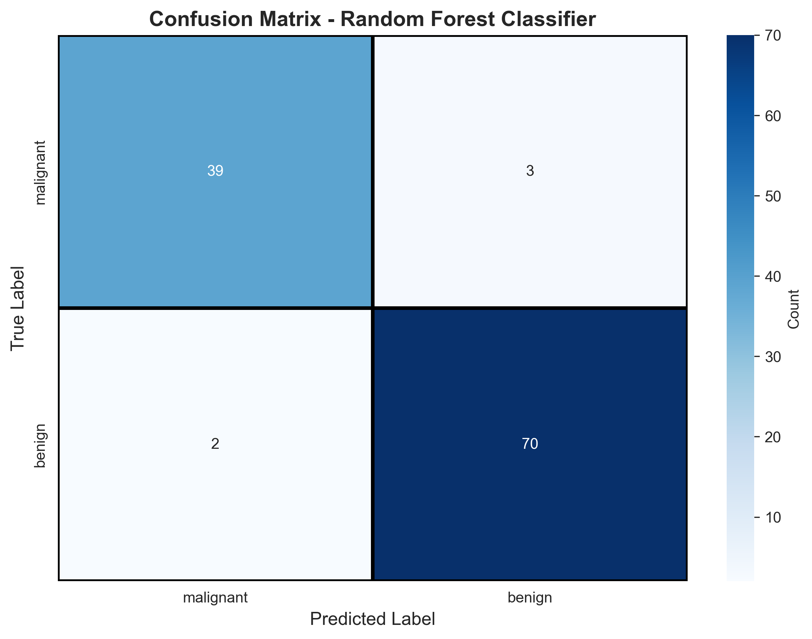
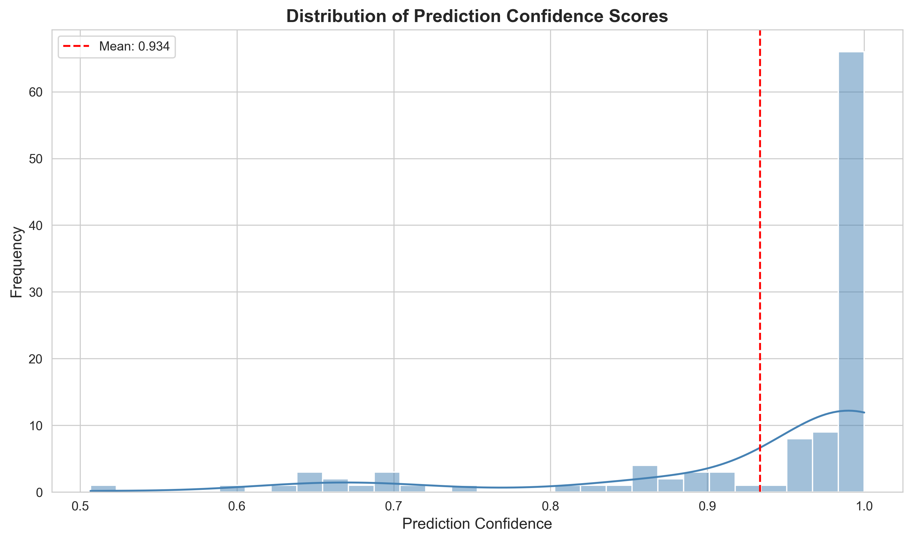

---

layout: default

title: Breast Cancer Predictions (Random Forest)

permalink: /random-forest/

---

## Goals and objectives:

The business objective is to predict the cancer status of cells (benign or malignant) based on 30 features of the cells observed via digitised images. A previous project built a decision tree model achieving an accuracy of 93.86%, and the goal is to research if using a Random Forest predictor can produce more accurate results, and produce more insights into the data supporting the predictions.  The predicted results are binary 'Malignant', 'Benign' values.

This project contains many references to the Decision Tree project as one of the key analysis goals is to understand the comparison between the two approaches.

This follows on from the Decision Tree project found [here](https://marcgrover-datascience.github.io/decision-trees/)

An optimal random forest model was built to make the predictions, achieving an accuracy of 95.61%, using optimal hyperparameters of 150 trees, maximum depth of 10.  For the random forest the most important feature was identified as 'worse area'.  The accuracy increased by 1.75% from the optimal decision tree in the previous project.

## Application:  

A Random Forest is an ensemble learning method that constructs a multitude of decision trees during training. It is one of the most popular and versatile tools in industry because it follows the "wisdom of the crowd" principle: while a single decision tree might be biased or prone to errors, the collective vote of hundreds of trees usually leads to a much more accurate and stable prediction.  

As such, many examples of applications and benefits of Random Forests in commercial settings are similar to those described in the Decision Tree project.  

The primary reason industries move from a single decision tree to a random forest is the trade-off between interpretability and performance.  A decision tree is a single flowchart-like structure, and hence easier to understand the logic.  In scenarios where an industry is highly regulated (like law or certain government sectors) and there is a need to explain exactly why every single decision was made, a single Decision Tree's transparency can be preferable, even if it produced lower accuracy.  The higher predictive accuracy of Random Forests is typically the primary reason for using Random Forests.

The primary benefits of using Random Forests over Decision Trees include:

* Higher accuracy through ensemble voting
* Reduced overfitting via randomisation
* More robust to outliers and noise
* Better generalisation to unseen data

The key benefits of using a Random Forest include:

* Handles Missing Data: In the real world, data is rarely perfect. Random Forests can maintain high accuracy even when a significant portion of the data is missing.
* Feature Importance: It tells you which variables actually matter. For a business, knowing that "Customer Age" is 10x more important than "Postal Code" for sales is invaluable for strategy.
* No Need for Scaling: Unlike other models (like Neural Networks), you don't need to normalise your data (e.g., converting all numbers to a 0–1 scale). It works with raw numbers and categories out of the box.
* Parallelisation: Because each tree is built independently, they can be trained simultaneously on modern multi-core computers, making it very fast to train on large datasets.

## Methodology:  

The dataset used is the same as used in the Decision Tree project - the Wisconsin Breast Cancer dataset, which enables comparison of the two methods.  This is available from scikit-learn, including 569 observations, including 30 independent features.

The dataset is also available from Kaggle [here](https://www.kaggle.com/datasets/uciml/breast-cancer-wisconsin-data)

The method applied in the analysis:

* **Dataset validation** to confirm no missing values, and basic descriptive analysis on the features including the correlation between the 30 features. No data pre-processing was undertaken.
* **Decision Tree Number Analysis** to determine the optimal number of trees in the forest, balancing accuracy of the model and compute resources required.
* **Decision Tree Depth Analysis** to determine the maximum depth of each tree in the forest to achieve optimal accuracy, prevent overfitting and balance with the compute resources required.
* **Fitting and Validating Random Forest Model** to build the random forest using the hyperparameters for the optimal number of trees and optimal tree depth.

## Results and conclusions:

Simple descriptive analytics determined that 212 observations relate to malignant cancers and 357 relate to benign cancers.

The correlation matrix is the same as that shown for the Decision Tree project [here](https://marcgrover-datascience.github.io/decision-trees/) as it uses the same dataset, and as such not shown here.

### Tree Number Analysis

When tuning hyperparameters like the number of trees (n_estimators) and tree depth (max_depth), the standard metric to apply is the Cross-Validation (CV) accuracy score based on the training set.

The alternative, using the accuracy score based on the test set to make these decisions, can lead to overly optimistic results and poor performance on truly "unseen" data.

To determine the optimal number of trees in the random forest, key metrics were calculated for Random Forests with the following number of trees; 10, 25, 50, 75, 100, 150, 200, the three metrics being: 

* Accuracy on the training set
* Accuracy on the test set
* Cross-Validation (CV) Accuracy score, where the number of folds was set to 5.

It should be noted that there was no maximum depth defined for any of these random forests built.


Based on this analysis, 150 trees was determined to be the optimal value, using the CV Accuracy Score as the metric being assessed.

### Tree Depth Analysis

Similarly the optimal tree depth was determined, using 150 trees per random forest, which was previously identified as the optimal number.  The same three key metrics were calculated for each random forest with a maximum depth of; 3, 5, 7, 10, 15, 20, None

The chart below shows the metrics for each random forest for each of the maximum depths.


Based on this analysis, using the CV Accuracy Score as the metric to assess the optimal structure, it was determined that a maximum depth of 10 is optimal.

To summarise the analysis has provided evidence that for the given data the optimal hyperparameters are:
* number of trees (n_estimators) = 150
* tree depth (max_depth) = 10

### Model Fitting and Validation:

Using the optimal number of trees and optimal tree depth, the random forest was trained.  For illustrative purposes, one of the 150 trees is visualised below, noting the increased depth and overall complexity to the optimal decision tree created in the previous project.  The accuracy of this single tree in isolation would likely have less accuracy that the optimal tree in the previous project, however the accuracy of the collective 150 decision trees in the random forest produce a more accurate model (as highlighted below).


The random forest contains 150 trees, which have the following metrics:

* Average tree depth: 7.07  
* Min tree depth: 4  
* Max tree depth: 10  
* Average nodes per tree: 35.67  

The model performance was evaluated to quantify the quality of the predictions. The key metrics (based on the testing set) are:

* Accuracy: 0.9561  
* Precision: 0.9589 (Predicted Positives)  
* Recall: 0.9722 (True Positive Rate)  
* F1-Score: 0.9655  
* Specificity: 0.9286 (True Negative Rate)

The detailed classification report provides additional information on the predictions, breaking down the performance metrics for malignant and benign predictions. This is based on the testing dataset.

```
              precision    recall  f1-score   support
   malignant       0.95      0.93      0.94        42
      benign       0.96      0.97      0.97        72
```

The confusion matrix visually demonstrates the performance of the random forest applied to the testing dataset.



In summary the confusion matrix presents the results:

* True Positives (True Benign): 70
* True Negatives (True Malignant): 39
* False Positives (False Benign): 3
* False Negatives (False Malignant): 2

### Model Prediction Confidence:

Prediction Confidence (often referred to as Prediction Probability) refers to a numerical score that represents how "sure" the model is that a specific data point belongs to a certain category.  It is fundamentally different from Accuracy, which states how often the model is right; Confidence measures how much the model "believes" in its specific answer for a single instance.

In a single tree, confidence is determined by the purity of the leaf node where the data point ends up.  When you train a tree, each leaf node contains a small group of samples from the training data.  A Random Forest is an ensemble of many trees, because it has multiple trees, the confidence is usually calculated by averaging the probabilities from every individual tree.

Confidence is often more important than the final label in high-importance scenarios.

For the random forest the mean confidence for each of the 114 test observations is 0.9336.

Each observation has a confidence value, the histogram below shows the distribution of these confidences.  This shows that many of the observations have a prediction confidence over 0.9 and 0.95, however there are observations that yielded a predictions with a confidence lower than 0.8.  In a real-world scenario predictions with a confidence less than a specified threshold, such as 0.8, may be considered unreliable, and further tests be undertaken.  In this project related to cancerous cells, patients with such low confidence predictions may undergo further medical testing and analysis.



### Feature Importance:

A key insight from the generation of a Random Forest is the importance of each factor in generating a prediction, and hence the most important factors can be determined.

The most important factors are listed below, along with the importance score. The total importance sums to 1. It should be noted that with a Random Forest, it is typical that all features have a non-zero importance score, whereas for a Decision Tree it is common for only a sub-set of features to have a non-zero importance score. For the decision tree project, where the optimum tree depth was 3, only 6 features had a non-zero importance score.

Feature importance in Random Forest is calculated by measuring how much each feature decreases impurity (Gini/entropy).  It is calculated by averaging importance across all trees in the forest.  

The top 10 most important features are below, noting that for the decision tree project, the 'worst radius' feature was identified as the most important, whereas for the random forest it is the 5th most important feature:

```
             Feature  Importance
          worst area    0.1413
     worst perimeter    0.1338
worst concave points    0.1107
 mean concave points    0.0882
        worst radius    0.0821
         mean radius    0.0638
      mean perimeter    0.0527
      mean concavity    0.0504
           mean area    0.0504
     worst concavity    0.0339
```
The top 10 features, by importance, are:


### Conclusions:

The overall conclusions are summarised as:

* Model Performance:
  * The random forest produced accurate predictions and is an appropriate tool.  
  * The random forest achieves excellent predictive accuracy (>95.6%) on the test set, demonstrating strong capability for breast cancer classification predictions.  
  * The decision tree had an accuracy of 93.9%, which relates to approximately 61 incorrect predictions per 1,000 observations, however the random forest produces approximately 44 incorrect predictions per 1,000 observations, which equates to approximately 28% less incorrect predictions.
  * This represents a meaningful improvement in predictive capability while maintaining excellent performance.  
  * High precision and recall indicate the model reliably identifies both malignant and benign cases with minimal false positives/negatives.  
  * The cross-validation scores closely align with test scores, suggesting the model generalises well and isn’t overfitting.  
  * Random Forest predictions are more stable across different data samples due to voting from multiple trees. Single decision trees can be sensitive to small changes in training data.
  * Random Forest provides probability estimates that are high confidence scores (typically >0.95), which correlate strongly with correct predictions, in this example giving clinicians valuable insight into prediction reliability.
  * Random Forest achieves fewer false negatives (missed cancers) - critical in medical diagnosis where missing a malignant case is far worse than a false alarm
* Feature Insights:
  * The top feature is 'worst area', whereas for the decision tree the top feature was 'worst radius', though this is in the top 5 features for the random forest.
  * The nature of the decision tree meant that only a few features had a non-zero importance, however for the random forest all factors had a non-zero importance.
  * Random Forest feature importance is more robust because it averages across many trees with different feature subsets, reducing the impact of false correlations
  * The top 10 features account for approximately 90% of the predictive power of the random forest model.  This can suggest that features are highly correlated, and the dimensionality reduction could simplify the model without losing accuracy. 
* Model Characteristics:
  * While the single Decision Tree is fully interpretable (one clear decision path), Random Forest requires aggregating 50-100+ trees, making it a "black box" model
  * Random Forest requires 50-100x more computation than a single tree, though this is negligible for this dataset size, it can be significant for larger datasets and where quick computation is required.
  * For the dataset, both the decision tree and random forest models benefit from depth limiting, confirming that simple decision boundaries work well for this dataset.  
  * Accuracy plateaus at approximately 150 trees, indicating additional trees offer no benefit for this dataset.  

## Next steps:  

With any analysis it is important to assess how the model and application of the analytical methods can be used and evolved to support the business goals and business decisions and yield tangible benefits.  The following are example recommendations for future research and implementation considerations.

* Additional Models:
  * Research Gradient Boosting Models, such as Gradient Boosted Trees (XGBoost, LightGBM, CatBoost).  These offer sequential learning (unlike the random forest with parallel trees), and can provide improved accuracy on random forests.
  * Consider implementing deep learning approaches such as neural networks.  
  * Consider blending models to optimise performance, for example combining multiple models including random forests, gradient boost trees, logistic regression or neural networks.
* Models Enhancements:
  * Undertake more detailed analysis of the volume of trees to be included in the random forest, to refine the optimal number of trees.  For example consider 110, 120, 130 and 140 trees.
  * Undertake more detailed analysis of the maximum tree depth to be included in the random forest, to further refine the model.  For example consider maximum_depths of 8 and 9.
  * Research parameter optimisation for the random forest such as 'minimum samples per split', 'minimum samples per leaf', 'maximum features'
* Dimensionality Reduction:
  * Investigating the high-correlation between features, and the potential benefit to reducing the number of features included in the random forest.
  * Principal Component Analysis (PCA): Reduce 30 features to 10-15 components while retaining 95% variance.
  * Feature selection models, such as Recursive Feature Elimination (RFE) or LASSO regularisation for automatic selection
* Feature Engineering:
  * Introduce measures such as interaction terms (e.g. area × concavity), or ratios (e.g. circularity - perimeter²/area).  
  * Create variance, skewness measures across related features.  
  * Research anomalous / outlier observations, and research methods to improve model performance of edge cases
* Additional data and validation:
  * Collect additional observations and confirm actual outcomes to predictions to validate model performance
  * Consider model training based on new data to maintain or improve accuracy
  * Research real-life implementation considerations, such as human-in-the-loop review for borderline cases, and in-depth analysis of incorrect predictions

## Hyperparameter Next Step:

As suggested above in the 'Next Steps' section, research was undertaken to further refine the optimal number of trees and optimal maximum tree depth.  The random tree was build with additional hyperparater values, which determined that the optimal values can be refined to:

* number of trees (n_estimators) = 145
* tree depth (max_depth) = 9

While this didn't produce an improved accuracy or prediction confidence, it demonstrates that the same accuracy can be produced with less trees and smaller trees, and further evidence that the initial random forest model produced was optimal in producing high-accuracy.

## Python code:
You can view the full Python script used for the analysis here: 
[View the Python Script](/RandomForest_BreastCancer.py)
