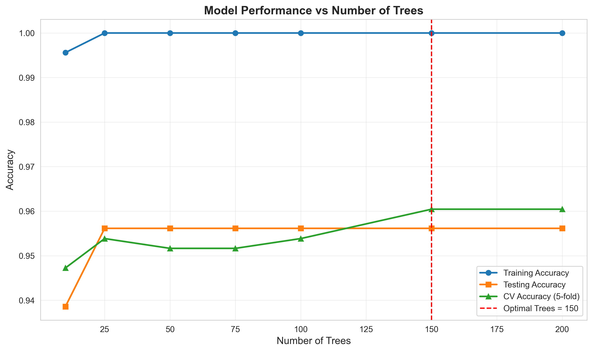
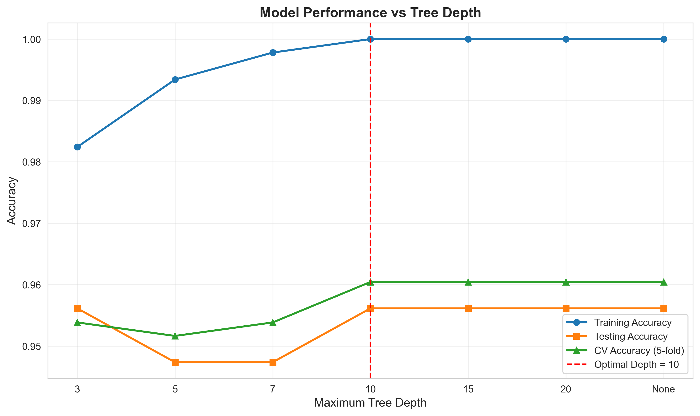
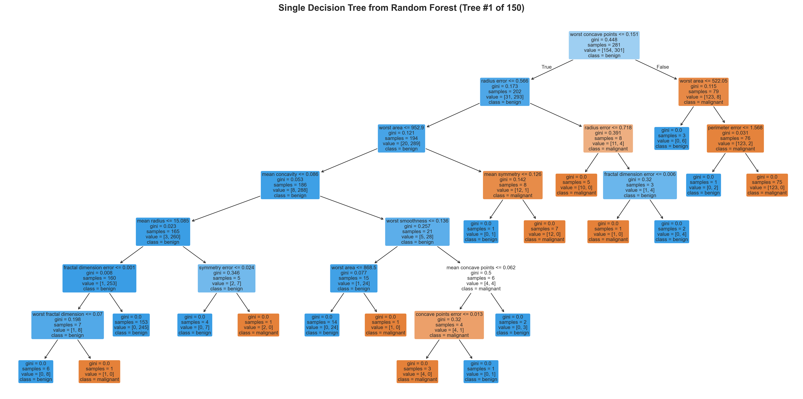
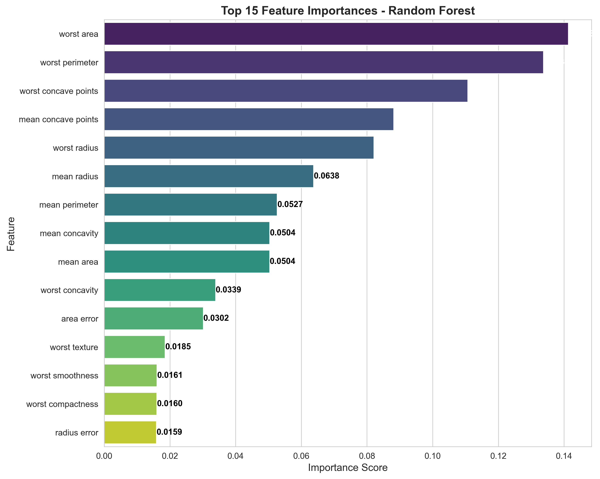

---

layout: default

title: Breast Cancer Predictions (Random Forest)

permalink: /random-forest/

---

#### This project is in development

## Goals and objectives:

The business objective is to predict the cancer status of cells (benign or malignant) based on 30 features of the cells observed via digitised images. A previous project built a decision tree model achieving an accuracy of 93.86%, and the goal is to research if using a Random Forest predictor can produce more accurate results, and produce more insights into the data supporting the predictions.

This project contains many references to the Decision Tree project as one of the key analysis goals is to understand the comparison between the two approaches.

This follows on from the Decision Tree project found [here](https://marcgrover-datascience.github.io/decision-trees/)

Add results...

## Application:  

A Random Forest is an ensemble learning method that constructs a multitude of decision trees during training. It is one of the most popular and versatile tools in industry because it follows the "wisdom of the crowd" principle: while a single decision tree might be biased or prone to errors, the collective vote of hundreds of trees usually leads to a much more accurate and stable prediction.  

As such, many examples of applications and benefits of Random Forests in commerical settings are similar to those described in the Decision Tree project.  

The primary reason industries move from a single decision tree to a random forest is the trade-off between interpretability and performance.  A decision tree is a single flowchart-like structure, and hence easier to understand the logic.  In scenarios where an industry is highly regulated (like law or certain government sectors) and there is a need to explain exactly why every single decision was made, a single Decision Tree's transparency can be preferable, even if it produced lower accuracy.  The higher predictive accuracy of Randon Forests is typically the primary reason for using Random Forests.

The primary benefits of using Random Forests over Decision Trees include:

* Higher accuracy through ensemble voting
* Reduced overfitting via randomisation
* More robust to outliers and noise
* Better generalisation to unseen data

The key benefits of using a Random Forest include:

* Handles Missing Data: In the real world, data is rarely perfect. Random Forests can maintain high accuracy even when a significant portion of the data is missing.
* Feature Importance: It tells you which variables actually matter. For a business, knowing that "Customer Age" is 10x more important than "Postal Code" for sales is invaluable for strategy.
* No Need for Scaling: Unlike other models (like Neural Networks), you don't need to normalise your data (e.g., converting all numbers to a 0–1 scale). It works with raw numbers and categories out of the box.
* Parallelisation: Because each tree is built independently, they can be trained simultaneously on modern multi-core computers, making it very fast to train on large datasets.

## Methodology:  

The dataset used is the same as used in the Decision Tree project - the Wisconsin Breast Cancer dataset, which enables comparison of the two methods.  This is available from scikit-learn, including 569 observations, including 30 independent features.

The dataset is also available from Kaggle [here](https://www.kaggle.com/datasets/uciml/breast-cancer-wisconsin-data)

The method applied in the analysis:

* **Dataset validation** to confirm no missing values, and basic descriptive analysis on the features including the correlation between the 30 features. No data pre-processing was undertaken.
* **Decision Tree Number Analysis** to determine the optimal number of trees in the forest, balancing accuracy of the model and compute resources required.
* **Decision Tree Depth Analysis** to determine the maximum depth of each tree in the forest to achieve optimal accuracy, prevent overfitting and balance with the compute resources required.

Details of the methodology applied in the project.

## Results and conclusions:

Results from the project related to the business objective.

Simple descriptive analytics determined that 212 observations relate to malignant cancers and 357 relate to benign cancers.

The correlation matrix is the same as that shown for the Decision Tree project [here](https://marcgrover-datascience.github.io/decision-trees/) as it uses the same dataset, and as such not shown here.

### Tree Number Analysis

When tuning hyperparameters like the number of trees (n_estimators) and tree depth (max_depth), the standard metric to apply is the Cross-Validation (CV) accuracy score based on the training set.

The alternative, using the accuracy score based on the test set to make these decisions, can lead to overly optimistic results and poor performance on truly "unseen" data.

To determine the optimal number of trees in the random forest, key metrics were calculated for Random Forests with the following number of trees; 10, 25, 50, 75, 100, 150, 200, the three metrics being: 

* Accuracy on the training set
* Accuracy on the test set
* Cross-Validation (CV) Accuracy score, where the number of folds was set to 5.

It should be noted that there was no maximum depth defined for any of these random forests built.

Based on this analysis, 150 trees was determined to be the optimal value, using the CV Accuracy Score as the metric being assessed.

### Tree Depth Analysis

Similarly the optimal tree depth was determined, using 150 trees per random forest, which was previously identified as the optimal number.  The same three key metrics were calculated for each random forest with a maximum depth of; 3, 5, 7, 10, 15, 20, None

The chart below shows the metrics for each random forest for each of the maximum depths.

Based on this analysis, using the CV Accuracy Score as the metric to assess the optimal structure, it was determined that a maximum depth of 10 is optimal.

To summarise the analysis has provided evidence that for the given data the optimal hyperparameters are:
* number of trees (n_estimators) = 150
* tree depth (max_depth) = 10

### Model Fitting and Validation:

Using the optimal numer of trees and optimal tree depth, the random forest was trained.  For illustrative purposes, one of the 150 trees is vissualised below, noting the increased depth and overall complexity to the optimal decision tree created in the previous project.  The accuracy of this single tree in isolation would likely have less accuracy that the optimal tree in the previous project, however the accuracy of the collective 150 decision trees in the random forest produce a more accurate model (as highlighted below).

The model performance was evaluated to quantify the quality of the predictions. The key metrics (based on the testing set) are:

Accuracy: 0.9386
Precision: 0.9452 (Predicted Positives)
Recall: 0.9583 (True Positive Rate)
F1-Score: 0.9517
Specificity: 0.9048 (True Negative Rate)

### Conclusions:

Conclusions from the project findings and results.

## Next steps:  

With any analysis it is important to assess how the model and application of the analytical methods can be used and evolved to support the business goals and business decisions and yield tangible benefits.

* Undertake more detailed analysis of the volume of trees to be included in the random forest, to refine the optimal number of trees.  For example consider 110, 120, 130 and 140 trees.
* Undertake more detailed analysis of the maximum tree depth to be included in the random forest, to further refine the model.  For example consider maximum_depths of 8 and 9.

* TASK - Run model with other hyperparameter options as listed above

## Python code:
You can view the full Python script used for the analysis here: 
[View the Python Script](/RandomForest_BreastCancer.py)
