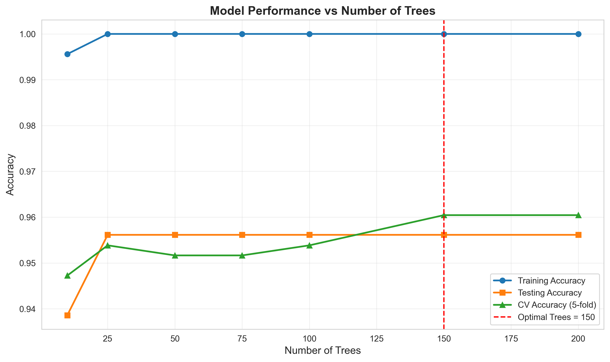
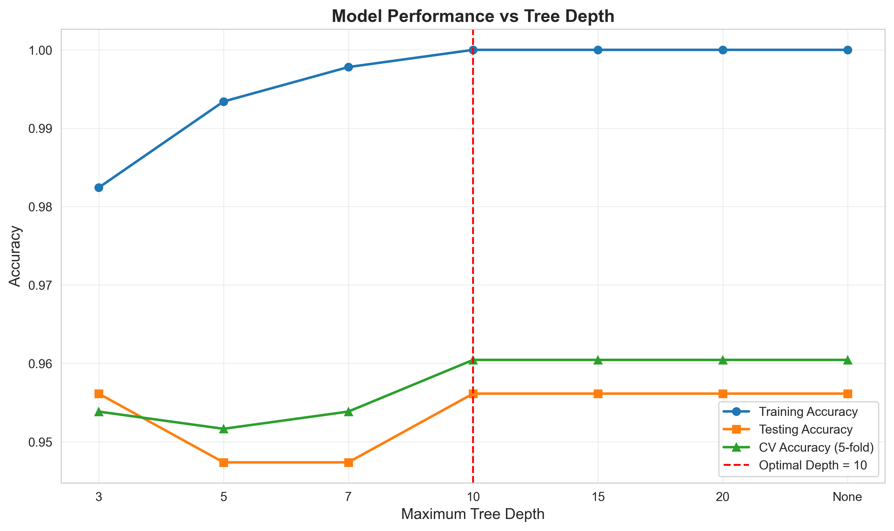
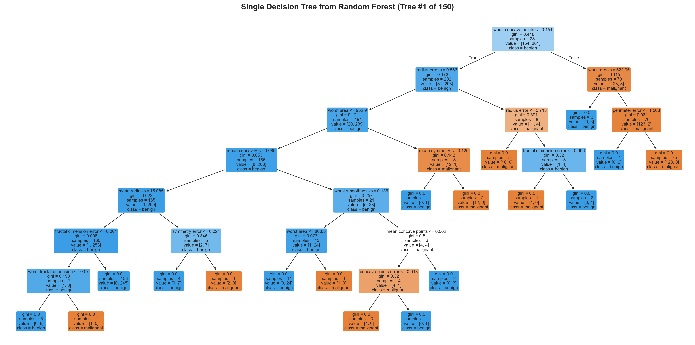
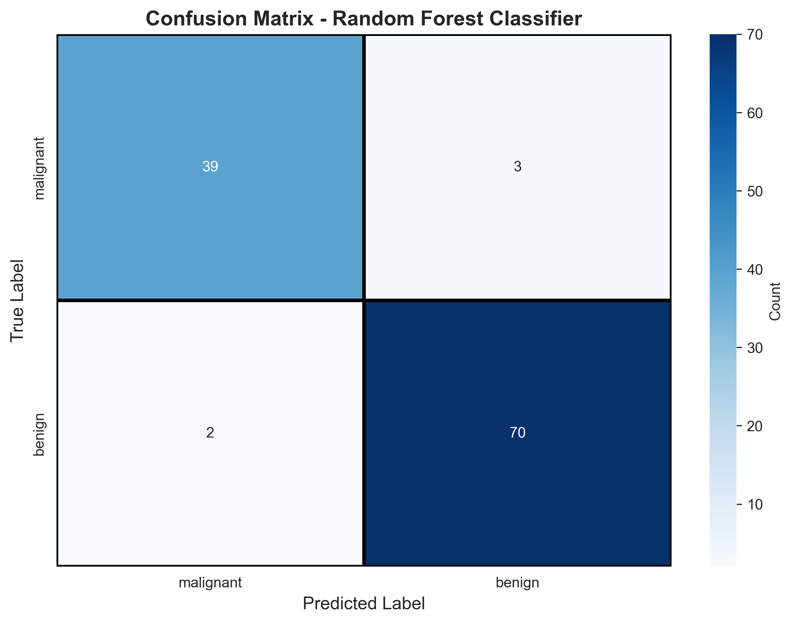
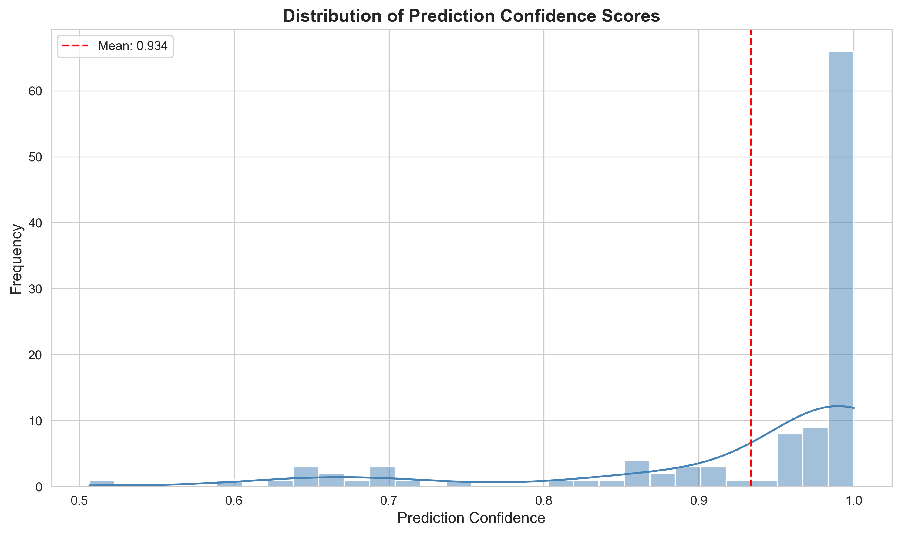
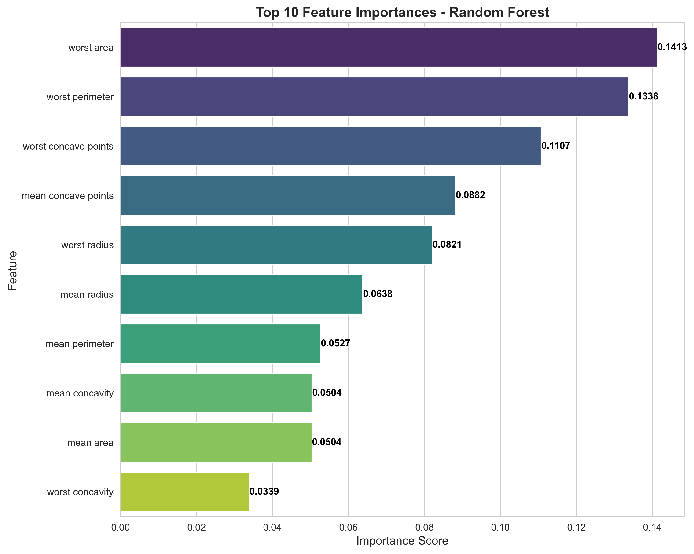

---

layout: default

title: Breast Cancer Predictions (Random Forest)

permalink: /random-forest/

---

## Goals and objectives:

This project is the second in a four-part series applying supervised classification algorithms to the Wisconsin Breast Cancer Diagnostic dataset, following on from the [Decision Tree project](https://marcgrover-datascience.github.io/decision-trees/) which established a test accuracy of 93.86% and a ROC-AUC of 0.9446 as the performance baseline for the series.

The central objective is to determine whether a Random Forest classifier — an ensemble of many decision trees — produces measurably better predictive performance than the single decision tree built in the previous project, and to quantify that improvement across a consistent set of metrics: accuracy, precision, recall, F1-score, ROC-AUC, and specificity. A Random Forest reduces the variance inherent in any single tree by constructing a large number of decorrelated trees and aggregating their predictions, typically yielding both higher accuracy and better generalisation to unseen data. The theoretical basis for expecting an improvement is well-established; the goal of this project is to demonstrate it empirically on the same dataset, under the same train/test split, using the same evaluation framework.

A secondary objective is principled hyperparameter selection. Unlike the Decision Tree, which has a single primary hyperparameter (tree depth), the Random Forest introduces a second: the number of trees in the ensemble. The project systematically evaluates both parameters — number of trees and maximum tree depth — using five-fold cross-validation accuracy as the selection criterion, and selects the most parsimonious model that achieves peak performance. A refinement phase further narrows the optimal parameter range, confirming that the initially identified values are not simply a local maximum in a coarse search.

A third objective is feature importance analysis using two complementary methods — Gini impurity-based importance averaged across all trees in the forest, and permutation importance computed on the held-out test set — enabling a direct comparison of feature rankings between this project and the Decision Tree. Where the Decision Tree was constrained to a depth of 3 and only 6 features received a non-zero Gini importance score, the Random Forest utilises the full feature set across all trees, producing a more distributed and robust importance profile. The cumulative importance analysis quantifies how many features are needed to account for 90% of the model's predictive power.

A further objective specific to the Random Forest is the analysis of prediction confidence. Random Forests produce probability estimates by averaging class probabilities across all trees, yielding confidence scores that are more calibrated and stable than those from a single tree. The distribution of these confidence scores across the test set is examined to characterise how decisively the model classifies each observation — a practically relevant metric in a clinical screening context where borderline predictions may warrant additional investigation.

The optimal model achieves a **test accuracy of 95.61%** with optimal hyperparameters of **150 trees** and a **maximum tree depth of 10**, representing a 1.75 percentage point improvement over the Decision Tree baseline. The ROC-AUC and false negative rate are examined alongside accuracy to assess whether the improvement is consistent across all dimensions of predictive performance.


## Application:  

A Random Forest is an ensemble learning method that constructs a large number of decision trees during training and aggregates their predictions — using majority voting for classification — to produce a final output. It follows the "wisdom of the crowd" principle: while any individual decision tree may overfit the training data or be sensitive to noise in a particular feature, the collective vote of many decorrelated trees cancels out those individual errors and produces predictions that are both more accurate and more stable.

As many of the industry applications of Random Forests are shared with Decision Trees — credit scoring, fraud detection, medical diagnosis, churn prediction, predictive maintenance — this section focuses specifically on the characteristics that distinguish Random Forests from a single Decision Tree, and on the trade-offs that determine which approach is more appropriate in a given context.

**The primary reason to move from a Decision Tree to a Random Forest is the trade-off between interpretability and performance.** A Decision Tree's single flowchart structure is fully transparent: every classification decision can be traced from root to leaf and explained in plain terms to a non-technical audience. This auditability is genuinely valuable in regulated industries where a rationale for each decision must be documented — credit decisions under financial regulation, or clinical decisions subject to audit. Where that transparency is a hard requirement, the interpretability of a Decision Tree may outweigh its lower accuracy. In most commercial settings, however, predictive performance is the primary objective, and the accuracy gains of Random Forests are well-established and material.

The key advantages of Random Forests over single Decision Trees are:

* **Reduced overfitting through randomisation**. Each tree in the forest is trained on a bootstrapped sample of the data (random sampling with replacement) and considers only a random subset of features at each split. This decorrelates the trees, meaning their errors are largely independent, and aggregating independent errors through voting substantially reduces the variance of the final prediction compared to any single tree.
* **More robust and distributed feature importance**. A single Decision Tree of limited depth assigns non-zero importance to only a small number of features — in this project, 6 of 30. A Random Forest evaluates all features across hundreds of trees with varying feature subsets, producing a more robust and comprehensive importance profile that is less susceptible to the arbitrary feature selection of any single split.
* **Calibrated prediction confidence**. Random Forests produce probability estimates by averaging class probabilities across all trees. These ensemble-averaged probabilities are more reliable indicators of prediction certainty than those from a single tree, enabling confidence thresholds to be applied in practice — for example, flagging predictions below 80% confidence for human review.
* **Stability across data samples**. Single Decision Trees are sensitive to small changes in the training data — a slightly different split can produce a materially different tree structure. Random Forests are inherently stable because the ensemble structure absorbs this variance; the aggregate prediction changes little as individual trees vary.

The primary limitation relative to a Decision Tree is interpretability. While a single tree from the forest can be visualised, the final prediction is the aggregate of all trees and cannot be reduced to a single traceable decision path. For applications where auditability of individual decisions is required, this "black box" characteristic is a genuine constraint. The computational cost is also higher — roughly proportional to the number of trees — though for datasets of this scale this is negligible in practice.

## Methodology:  

The Wisconsin Breast Cancer Diagnostic dataset is used throughout this series of projects to enable direct comparison between classification algorithms. Full data validation and exploratory data analysis for this dataset — including missing value checks, descriptive statistics, class distribution, and feature correlation analysis — were conducted in the Decision Tree project and are not repeated here. The dataset comprises 569 observations across 30 continuous features, with 212 malignant (37.3%) and 357 benign (62.7%) cases, available from scikit-learn as well as Kaggle [here](https://www.kaggle.com/datasets/uciml/breast-cancer-wisconsin-data).

The same **80/20 stratified train-test split** (random_state=42) applied in the Decision Tree project is used here, producing an identical training set (455 samples) and test set (114 samples). This is a deliberate methodological choice: using the same split ensures that any difference in performance between the two models reflects genuine algorithmic differences, not variation in the data partitioning.

**Hyperparameter Tuning** is the primary methodological challenge specific to Random Forests, which introduce two key hyperparameters absent from the simpler Decision Tree: the number of trees in the ensemble (n_estimators) and the maximum depth of each individual tree (max_depth). Both are determined through systematic evaluation using five-fold cross-validation accuracy on the training set as the selection criterion — test set accuracy is deliberately excluded from this process to avoid data leakage and overly optimistic estimates.

The tuning proceeds sequentially in two stages:

* **Number of trees** is evaluated first across a coarse range (10, 25, 50, 75, 100, 150, 200 trees), with no depth constraint applied, to identify the point at which adding further trees produces no meaningful improvement in CV accuracy. The optimal value is defined as the fewest trees achieving the maximum CV accuracy, preferring parsimony when performance is equivalent.
* **Tree depth** is then evaluated across a range of candidate values (3, 5, 7, 10, 15, 20, and unconstrained) using the previously identified optimal tree count, applying the same parsimony criterion.

A refinement phase subsequently evaluates a narrower parameter range centred on the initially identified optima, confirming that the selected values are not simply a local maximum in a coarse search and identifying the most parsimonious combination that achieves equivalent accuracy.

**Model Training** fits the final RandomForestClassifier using the optimal hyperparameters with oob_score=True, enabling the out-of-bag score to be computed as an additional generalisation estimate. The OOB score is a property unique to bootstrap-based ensemble methods — each tree is evaluated on the observations excluded from its bootstrap sample, providing a built-in cross-validation estimate at no additional computational cost. A five-fold cross-validation is also applied to the training set to confirm consistent generalisation across data partitions.

**Model Evaluation** assesses performance on the held-out test set using accuracy, precision, recall, F1-score, sensitivity, specificity, and ROC-AUC, enabling direct comparison with the Decision Tree results across all metrics. The single-tree visualisation produced in the Decision Tree project has no meaningful equivalent here — the forest comprises 150 trees and no single tree is representative of the ensemble — but one illustrative tree is visualised to demonstrate the increased complexity of each individual tree relative to the optimal depth-3 Decision Tree.

**Feature Importance** is assessed using the same two complementary methods applied in the Decision Tree project: Gini impurity-based importance averaged across all trees in the forest, and permutation importance computed on the test set. A cumulative importance plot is additionally produced, quantifying how many features are required to account for 90% of the model's total predictive power. **Prediction confidence** is examined through the distribution of ensemble-averaged class probabilities across the test set, providing insight into the certainty with which the model classifies each observation.

## Results:

### Hyperparameter Tuning

Training accuracy, test accuracy, and five-fold cross-validation accuracy were recorded across all candidate hyperparameter values. CV accuracy on the training set is the governing selection criterion throughout; test set accuracy is shown for reference only and plays no part in parameter selection.

#### Number of Trees



CV accuracy stabilises at 150 trees, with no meaningful improvement observed at 200 trees. Applying the parsimony criterion — fewest trees achieving the maximum CV accuracy — an optimal value of 150 trees is selected. The training accuracy of 1.0000 across all tree counts is expected behaviour for an unconstrained Random Forest: with no depth limit applied during this phase, individual trees overfit their bootstrap samples completely, but the ensemble generalises well regardless, as evidenced by the stable CV scores.

#### Tree Depth

With 150 trees fixed, maximum tree depth was evaluated across depths 3, 5, 7, 10, 15, 20, and unconstrained.



CV accuracy peaks at a maximum depth of **10**, with shallower trees underfitting and deeper trees showing marginal decline. The unconstrained depth produces a training accuracy of 1.0000 but a lower CV score than depth 10, confirming that some depth constraint is beneficial. The optimal hyperparameters from the initial tuning phase are therefore **150 trees**, **maximum depth 10**.

#### Hyperparameter Refinement

A second tuning phase evaluated a narrower range centred on the initial optima — tree counts of 120, 130, 140, 145, 150, 155, 160 and depths of 5, 7, 8, 9, 10, 15 — to confirm whether a more parsimonious model achieves equivalent performance. This analysis determined that **145 trees at a maximum depth of 9** produces the same CV accuracy as the initial optimum. Both configurations are carried forward; the primary model uses 150 trees / depth 10, with the refinement result noted as confirmation that the optimum is robust and that a marginally simpler model performs equivalently.


### Model Fitting and Validation:

Using the optimal number of trees and optimal tree depth, the random forest was trained.  For illustrative purposes, one of the 150 trees is visualised below, noting the increased depth and overall complexity to the optimal decision tree created in the previous project.  The accuracy of this single tree in isolation would likely have less accuracy that the optimal tree in the previous project, however the accuracy of the collective 150 decision trees in the random forest produce a more accurate model (as highlighted below).



The random forest contains 150 trees, which have the following metrics:

* Average tree depth: 7.07  
* Min tree depth: 4  
* Max tree depth: 10  
* Average nodes per tree: 35.67  

The model performance was evaluated to quantify the quality of the predictions. The key metrics (based on the testing set) are:

* Accuracy: 0.9561  
* Precision: 0.9589 (Predicted Positives)  
* Recall: 0.9722 (True Positive Rate)  
* F1-Score: 0.9655  
* Specificity: 0.9286 (True Negative Rate)

The detailed classification report provides additional information on the predictions, breaking down the performance metrics for malignant and benign predictions. This is based on the testing dataset.

```
              precision    recall  f1-score   support
   malignant       0.95      0.93      0.94        42
      benign       0.96      0.97      0.97        72
```

The confusion matrix visually demonstrates the performance of the random forest applied to the testing dataset.



In summary the confusion matrix presents the results:

* True Positives (True Benign): 70
* True Negatives (True Malignant): 39
* False Positives (False Benign): 3
* False Negatives (False Malignant): 2

### Model Prediction Confidence:

Prediction Confidence (often referred to as Prediction Probability) refers to a numerical score that represents how "sure" the model is that a specific data point belongs to a certain category.  It is fundamentally different from Accuracy, which states how often the model is right; Confidence measures how much the model "believes" in its specific answer for a single instance.

In a single tree, confidence is determined by the purity of the leaf node where the data point ends up.  When you train a tree, each leaf node contains a small group of samples from the training data.  A Random Forest is an ensemble of many trees, because it has multiple trees, the confidence is usually calculated by averaging the probabilities from every individual tree.

Confidence is often more important than the final label in high-importance scenarios.

For the random forest the mean confidence for each of the 114 test observations is 0.9336.

Each observation has a confidence value, the histogram below shows the distribution of these confidences.  This shows that many of the observations have a prediction confidence over 0.9 and 0.95, however there are observations that yielded a predictions with a confidence lower than 0.8.  In a real-world scenario predictions with a confidence less than a specified threshold, such as 0.8, may be considered unreliable, and further tests be undertaken.  In this project related to cancerous cells, patients with such low confidence predictions may undergo further medical testing and analysis.



### Feature Importance:

A key insight from the generation of a Random Forest is the importance of each factor in generating a prediction, and hence the most important factors can be determined.

The most important factors are listed below, along with the importance score. The total importance sums to 1. It should be noted that with a Random Forest, it is typical that all features have a non-zero importance score, whereas for a Decision Tree it is common for only a sub-set of features to have a non-zero importance score. For the decision tree project, where the optimum tree depth was 3, only 6 features had a non-zero importance score.

Feature importance in Random Forest is calculated by measuring how much each feature decreases impurity (Gini/entropy).  It is calculated by averaging importance across all trees in the forest.  

The top 10 most important features are below, noting that for the decision tree project, the 'worst radius' feature was identified as the most important, whereas for the random forest it is the 5th most important feature:

```
             Feature  Importance
          worst area    0.1413
     worst perimeter    0.1338
worst concave points    0.1107
 mean concave points    0.0882
        worst radius    0.0821
         mean radius    0.0638
      mean perimeter    0.0527
      mean concavity    0.0504
           mean area    0.0504
     worst concavity    0.0339
```
The top 10 features, by importance, are:



## Conclusions:

The overall conclusions are summarised as:

* Model Performance:
  * The random forest produced accurate predictions and is an appropriate tool.  
  * The random forest achieves excellent predictive accuracy (>95.6%) on the test set, demonstrating strong capability for breast cancer classification predictions.  
  * The decision tree had an accuracy of 93.9%, which relates to approximately 61 incorrect predictions per 1,000 observations, however the random forest produces approximately 44 incorrect predictions per 1,000 observations, which equates to approximately 28% less incorrect predictions.
  * This represents a meaningful improvement in predictive capability while maintaining excellent performance.  
  * High precision and recall indicate the model reliably identifies both malignant and benign cases with minimal false positives/negatives.  
  * The cross-validation scores closely align with test scores, suggesting the model generalises well and isn’t overfitting.  
  * Random Forest predictions are more stable across different data samples due to voting from multiple trees. Single decision trees can be sensitive to small changes in training data.
  * Random Forest provides probability estimates that are high confidence scores (typically >0.95), which correlate strongly with correct predictions, in this example giving clinicians valuable insight into prediction reliability.
  * Random Forest achieves fewer false negatives (missed cancers) - critical in medical diagnosis where missing a malignant case is far worse than a false alarm
* Feature Insights:
  * The top feature is 'worst area', whereas for the decision tree the top feature was 'worst radius', though this is in the top 5 features for the random forest.
  * The nature of the decision tree meant that only a few features had a non-zero importance, however for the random forest all factors had a non-zero importance.
  * Random Forest feature importance is more robust because it averages across many trees with different feature subsets, reducing the impact of false correlations
  * The top 10 features account for approximately 90% of the predictive power of the random forest model.  This can suggest that features are highly correlated, and the dimensionality reduction could simplify the model without losing accuracy. 
* Model Characteristics:
  * While the single Decision Tree is fully interpretable (one clear decision path), Random Forest requires aggregating 50-100+ trees, making it a "black box" model
  * Random Forest requires 50-100x more computation than a single tree, though this is negligible for this dataset size, it can be significant for larger datasets and where quick computation is required.
  * For the dataset, both the decision tree and random forest models benefit from depth limiting, confirming that simple decision boundaries work well for this dataset.  
  * Accuracy plateaus at approximately 150 trees, indicating additional trees offer no benefit for this dataset.  

## Next steps:  

With any analysis it is important to assess how the model and application of the analytical methods can be used and evolved to support the business goals and business decisions and yield tangible benefits.  The following are example recommendations for future research and implementation considerations.

* Additional Models:
  * Research Gradient Boosting Models, such as Gradient Boosted Trees (XGBoost, LightGBM, CatBoost).  These offer sequential learning (unlike the random forest with parallel trees), and can provide improved accuracy on random forests.
  * Consider implementing deep learning approaches such as neural networks.  
  * Consider blending models to optimise performance, for example combining multiple models including random forests, gradient boost trees, logistic regression or neural networks.
* Models Enhancements:
  * Undertake more detailed analysis of the volume of trees to be included in the random forest, to refine the optimal number of trees.  For example consider 110, 120, 130 and 140 trees.
  * Undertake more detailed analysis of the maximum tree depth to be included in the random forest, to further refine the model.  For example consider maximum_depths of 8 and 9.
  * Research parameter optimisation for the random forest such as 'minimum samples per split', 'minimum samples per leaf', 'maximum features'
* Dimensionality Reduction:
  * Investigating the high-correlation between features, and the potential benefit to reducing the number of features included in the random forest.
  * Principal Component Analysis (PCA): Reduce 30 features to 10-15 components while retaining 95% variance.
  * Feature selection models, such as Recursive Feature Elimination (RFE) or LASSO regularisation for automatic selection
* Feature Engineering:
  * Introduce measures such as interaction terms (e.g. area × concavity), or ratios (e.g. circularity - perimeter²/area).  
  * Create variance, skewness measures across related features.  
  * Research anomalous / outlier observations, and research methods to improve model performance of edge cases
* Additional data and validation:
  * Collect additional observations and confirm actual outcomes to predictions to validate model performance
  * Consider model training based on new data to maintain or improve accuracy
  * Research real-life implementation considerations, such as human-in-the-loop review for borderline cases, and in-depth analysis of incorrect predictions

## Hyperparameter Next Step:

As suggested above in the 'Next Steps' section, research was undertaken to further refine the optimal number of trees and optimal maximum tree depth.  The random tree was build with additional hyperparameter values, which determined that the optimal values can be refined to:

* number of trees (n_estimators) = 145
* tree depth (max_depth) = 9

While this didn't produce an improved accuracy or prediction confidence, it demonstrates that the same accuracy can be produced with less trees and smaller trees, and further evidence that the initial random forest model produced was optimal in producing high-accuracy.

## Python code:
You can view the full Python script used for the analysis here: 
[View the Python Script](/RandomForest_BreastCancer_v2.py)
