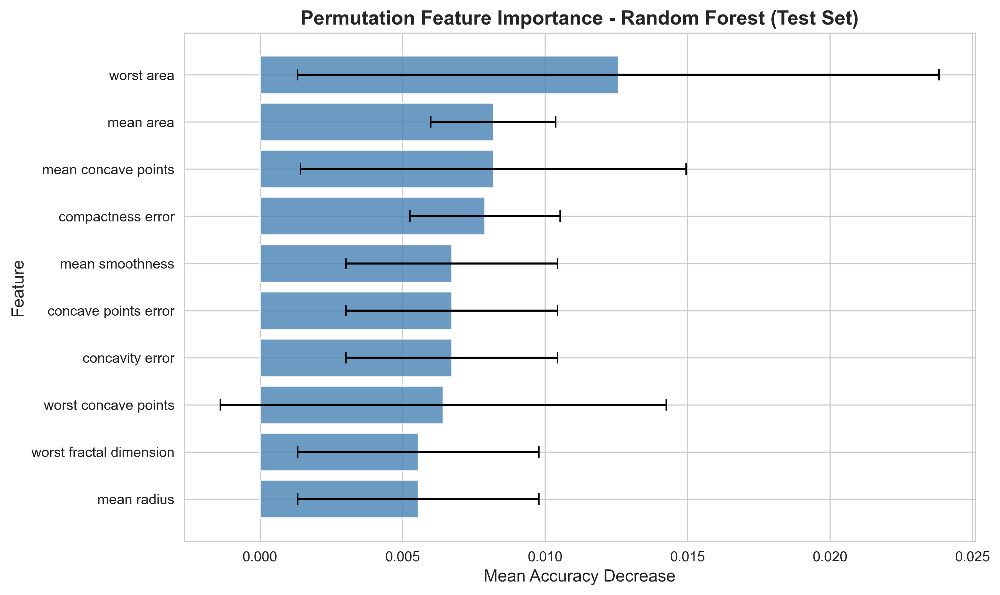
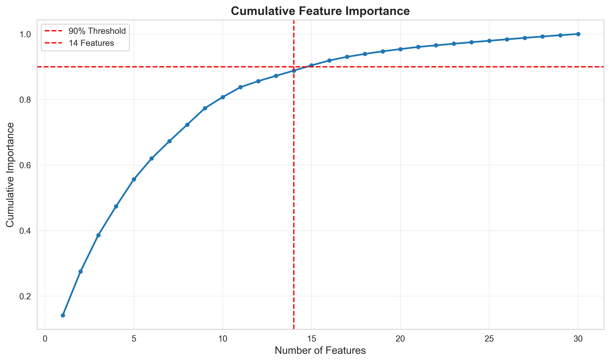
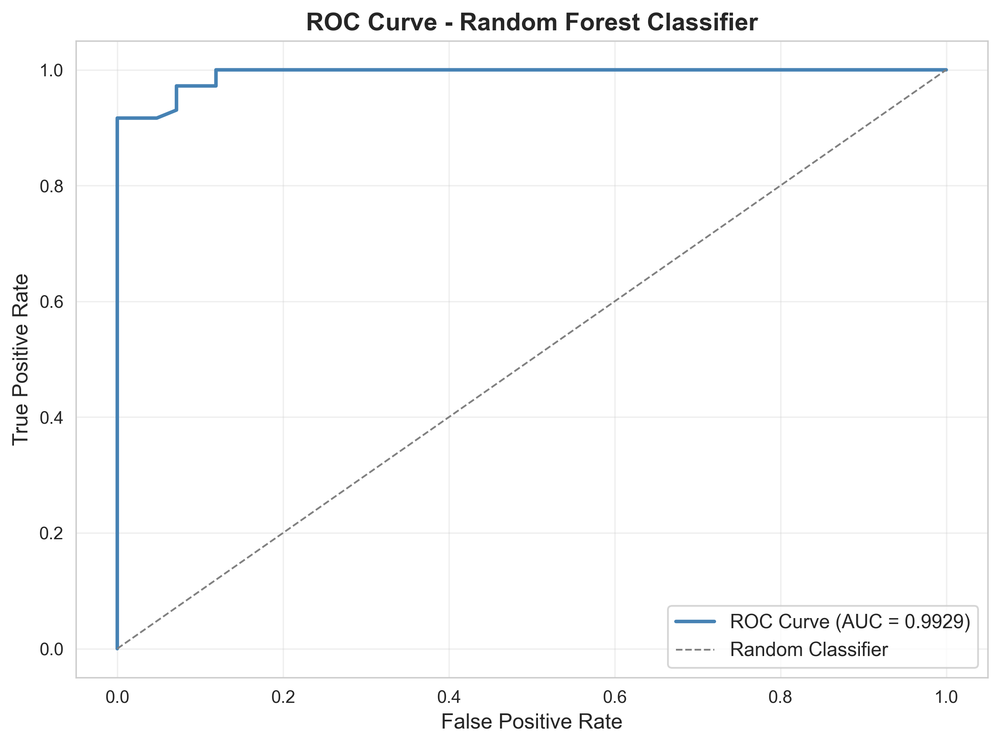

---

layout: default

title: Breast Cancer Predictions (Random Forest)

permalink: /random-forest/

---

## Goals and objectives:

This project is the second in a four-part series applying supervised classification algorithms to the Wisconsin Breast Cancer Diagnostic dataset, following on from the [Decision Tree project](https://marcgrover-datascience.github.io/decision-trees/) which established a test accuracy of 93.86% and a ROC-AUC of 0.9446 as the performance baseline for the series.

The central objective is to determine whether a Random Forest classifier — an ensemble of many decision trees — produces measurably better predictive performance than the single decision tree built in the previous project, and to quantify that improvement across a consistent set of metrics: accuracy, precision, recall, F1-score, ROC-AUC, and specificity. A Random Forest reduces the variance inherent in any single tree by constructing a large number of decorrelated trees and aggregating their predictions, typically yielding both higher accuracy and better generalisation to unseen data. The theoretical basis for expecting an improvement is well-established; the goal of this project is to demonstrate it empirically on the same dataset, under the same train/test split, using the same evaluation framework.

A secondary objective is principled hyperparameter selection. Unlike the Decision Tree, which has a single primary hyperparameter (tree depth), the Random Forest introduces a second: the number of trees in the ensemble. The project systematically evaluates both parameters — number of trees and maximum tree depth — using five-fold cross-validation accuracy as the selection criterion, and selects the most parsimonious model that achieves peak performance. A refinement phase further narrows the optimal parameter range, confirming that the initially identified values are not simply a local maximum in a coarse search.

A third objective is feature importance analysis using two complementary methods — Gini impurity-based importance averaged across all trees in the forest, and permutation importance computed on the held-out test set — enabling a direct comparison of feature rankings between this project and the Decision Tree. Where the Decision Tree was constrained to a depth of 3 and only 6 features received a non-zero Gini importance score, the Random Forest utilises the full feature set across all trees, producing a more distributed and robust importance profile. The cumulative importance analysis quantifies how many features are needed to account for 90% of the model's predictive power.

A further objective specific to the Random Forest is the analysis of prediction confidence. Random Forests produce probability estimates by averaging class probabilities across all trees, yielding confidence scores that are more calibrated and stable than those from a single tree. The distribution of these confidence scores across the test set is examined to characterise how decisively the model classifies each observation — a practically relevant metric in a clinical screening context where borderline predictions may warrant additional investigation.

The optimal model achieves a **test accuracy of 95.61%** with optimal hyperparameters of **150 trees** and a **maximum tree depth of 10**, representing a 1.75 percentage point improvement over the Decision Tree baseline. The ROC-AUC and false negative rate are examined alongside accuracy to assess whether the improvement is consistent across all dimensions of predictive performance.


## Application:  

A Random Forest is an ensemble learning method that constructs a large number of decision trees during training and aggregates their predictions — using majority voting for classification — to produce a final output. It follows the "wisdom of the crowd" principle: while any individual decision tree may overfit the training data or be sensitive to noise in a particular feature, the collective vote of many decorrelated trees cancels out those individual errors and produces predictions that are both more accurate and more stable.

As many of the industry applications of Random Forests are shared with Decision Trees — credit scoring, fraud detection, medical diagnosis, churn prediction, predictive maintenance — this section focuses specifically on the characteristics that distinguish Random Forests from a single Decision Tree, and on the trade-offs that determine which approach is more appropriate in a given context.

**The primary reason to move from a Decision Tree to a Random Forest is the trade-off between interpretability and performance.** A Decision Tree's single flowchart structure is fully transparent: every classification decision can be traced from root to leaf and explained in plain terms to a non-technical audience. This auditability is genuinely valuable in regulated industries where a rationale for each decision must be documented — credit decisions under financial regulation, or clinical decisions subject to audit. Where that transparency is a hard requirement, the interpretability of a Decision Tree may outweigh its lower accuracy. In most commercial settings, however, predictive performance is the primary objective, and the accuracy gains of Random Forests are well-established and material.

The key advantages of Random Forests over single Decision Trees are:

* **Reduced overfitting through randomisation**. Each tree in the forest is trained on a bootstrapped sample of the data (random sampling with replacement) and considers only a random subset of features at each split. This decorrelates the trees, meaning their errors are largely independent, and aggregating independent errors through voting substantially reduces the variance of the final prediction compared to any single tree.
* **More robust and distributed feature importance**. A single Decision Tree of limited depth assigns non-zero importance to only a small number of features — in this project, 6 of 30. A Random Forest evaluates all features across hundreds of trees with varying feature subsets, producing a more robust and comprehensive importance profile that is less susceptible to the arbitrary feature selection of any single split.
* **Calibrated prediction confidence**. Random Forests produce probability estimates by averaging class probabilities across all trees. These ensemble-averaged probabilities are more reliable indicators of prediction certainty than those from a single tree, enabling confidence thresholds to be applied in practice — for example, flagging predictions below 80% confidence for human review.
* **Stability across data samples**. Single Decision Trees are sensitive to small changes in the training data — a slightly different split can produce a materially different tree structure. Random Forests are inherently stable because the ensemble structure absorbs this variance; the aggregate prediction changes little as individual trees vary.

The primary limitation relative to a Decision Tree is interpretability. While a single tree from the forest can be visualised, the final prediction is the aggregate of all trees and cannot be reduced to a single traceable decision path. For applications where auditability of individual decisions is required, this "black box" characteristic is a genuine constraint. The computational cost is also higher — roughly proportional to the number of trees — though for datasets of this scale this is negligible in practice.

## Methodology:  

The Wisconsin Breast Cancer Diagnostic dataset is used throughout this series of projects to enable direct comparison between classification algorithms. Full data validation and exploratory data analysis for this dataset — including missing value checks, descriptive statistics, class distribution, and feature correlation analysis — were conducted in the Decision Tree project and are not repeated here. The dataset comprises 569 observations across 30 continuous features, with 212 malignant (37.3%) and 357 benign (62.7%) cases, available from scikit-learn as well as Kaggle [here](https://www.kaggle.com/datasets/uciml/breast-cancer-wisconsin-data).

The same **80/20 stratified train-test split** (random_state=42) applied in the Decision Tree project is used here, producing an identical training set (455 samples) and test set (114 samples). This is a deliberate methodological choice: using the same split ensures that any difference in performance between the two models reflects genuine algorithmic differences, not variation in the data partitioning.

**Hyperparameter Tuning** is the primary methodological challenge specific to Random Forests, which introduce two key hyperparameters absent from the simpler Decision Tree: the number of trees in the ensemble (n_estimators) and the maximum depth of each individual tree (max_depth). Both are determined through systematic evaluation using five-fold cross-validation accuracy on the training set as the selection criterion — test set accuracy is deliberately excluded from this process to avoid data leakage and overly optimistic estimates.

The tuning proceeds sequentially in two stages:

* **Number of trees** is evaluated first across a coarse range (10, 25, 50, 75, 100, 150, 200 trees), with no depth constraint applied, to identify the point at which adding further trees produces no meaningful improvement in CV accuracy. The optimal value is defined as the fewest trees achieving the maximum CV accuracy, preferring parsimony when performance is equivalent.
* **Tree depth** is then evaluated across a range of candidate values (3, 5, 7, 10, 15, 20, and unconstrained) using the previously identified optimal tree count, applying the same parsimony criterion.

A refinement phase subsequently evaluates a narrower parameter range centred on the initially identified optima, confirming that the selected values are not simply a local maximum in a coarse search and identifying the most parsimonious combination that achieves equivalent accuracy.

**Model Training** fits the final RandomForestClassifier using the optimal hyperparameters with oob_score=True, enabling the out-of-bag score to be computed as an additional generalisation estimate. The OOB score is a property unique to bootstrap-based ensemble methods — each tree is evaluated on the observations excluded from its bootstrap sample, providing a built-in cross-validation estimate at no additional computational cost. A five-fold cross-validation is also applied to the training set to confirm consistent generalisation across data partitions.

**Model Evaluation** assesses performance on the held-out test set using accuracy, precision, recall, F1-score, sensitivity, specificity, and ROC-AUC, enabling direct comparison with the Decision Tree results across all metrics. The single-tree visualisation produced in the Decision Tree project has no meaningful equivalent here — the forest comprises 150 trees and no single tree is representative of the ensemble — but one illustrative tree is visualised to demonstrate the increased complexity of each individual tree relative to the optimal depth-3 Decision Tree.

**Feature Importance** is assessed using the same two complementary methods applied in the Decision Tree project: Gini impurity-based importance averaged across all trees in the forest, and permutation importance computed on the test set. A cumulative importance plot is additionally produced, quantifying how many features are required to account for 90% of the model's total predictive power. **Prediction confidence** is examined through the distribution of ensemble-averaged class probabilities across the test set, providing insight into the certainty with which the model classifies each observation.

## Results:

### Hyperparameter Tuning

Training accuracy, test accuracy, and five-fold cross-validation accuracy were recorded across all candidate hyperparameter values. CV accuracy on the training set is the governing selection criterion throughout; test set accuracy is shown for reference only and plays no part in parameter selection.

#### Number of Trees


CV accuracy stabilises at 150 trees, with no meaningful improvement observed at 200 trees. Applying the parsimony criterion — fewest trees achieving the maximum CV accuracy — an optimal value of 150 trees is selected. The training accuracy of 1.0000 across all tree counts is expected behaviour for an unconstrained Random Forest: with no depth limit applied during this phase, individual trees overfit their bootstrap samples completely, but the ensemble generalises well regardless, as evidenced by the stable CV scores.

#### Tree Depth

With 150 trees fixed, maximum tree depth was evaluated across depths 3, 5, 7, 10, 15, 20, and unconstrained.


CV accuracy peaks at a maximum depth of **10**, with shallower trees underfitting and deeper trees showing marginal decline. The unconstrained depth produces a training accuracy of 1.0000 but a lower CV score than depth 10, confirming that some depth constraint is beneficial. The optimal hyperparameters from the initial tuning phase are therefore **150 trees**, **maximum depth 10**.

#### Hyperparameter Refinement

A second tuning phase evaluated a narrower range centred on the initial optima — tree counts of 120, 130, 140, 145, 150, 155, 160 and depths of 5, 7, 8, 9, 10, 15 — to confirm whether a more parsimonious model achieves equivalent performance. This analysis determined that **145 trees at a maximum depth of 9** produces the same CV accuracy as the initial optimum. Both configurations are carried forward; the primary model uses 150 trees / depth 10, with the refinement result noted as confirmation that the optimum is robust and that a marginally simpler model performs equivalently.

### Model Fitting

The Random Forest was trained using the optimal hyperparameters (150 trees, maximum depth 10) with oob_score=True. One of the 150 trees is visualised below for illustrative purposes.


This single tree — constrained to a maximum depth of 10 — is substantially more complex than the depth-3 Decision Tree built in the previous project. In isolation, this individual tree would be less accurate than the optimal Decision Tree; it is trained on a bootstrap sample of the data rather than the full training set, and its greater depth means it is more susceptible to overfitting its particular sample. The accuracy of the Random Forest derives not from any individual tree but from the aggregated vote of 150 such trees, each trained on a different bootstrap sample and considering a random feature subset at each split — precisely the mechanism that cancels out individual tree errors and produces a more accurate ensemble prediction.

The Out-of-Bag (OOB) score for the fitted model is 0.9560. This is computed by evaluating each tree only on the observations excluded from its bootstrap training sample, providing a built-in generalisation estimate at no additional computational cost. The OOB score serves as an independent cross-validation estimate and its proximity to the test set accuracy confirms the model generalises consistently.

Five-fold cross-validation on the full training set returns a mean accuracy of 0.9604 (std: 0.0192), further confirming stable generalisation across data partitions.

### Feature Importance

Gini impurity-based importance and permutation importance were computed for the fitted model and are shown below.


Gini importance in Random Forests has a known tendency to overstate the contribution of high-cardinality continuous features; permutation importance on the test set provides a model-agnostic check on whether the Gini ranking reflects genuine predictive contribution.



Unlike the Decision Tree — where only 6 of 30 features received a non-zero Gini importance score — the Random Forest assigns non-zero importance to all 30 features, reflecting its use of random feature subsets across 150 trees. The top feature is worst area (Gini importance: 0.1413), compared to worst radius in the Decision Tree. This shift is analytically meaningful: with a depth-3 tree, the single most separating feature dominates all splits; across 150 deeper trees with randomised feature selection, the importance is distributed more broadly and the ranking reflects a more complete assessment of each feature's predictive contribution. Worst radius remains in the top 5, consistent with its dominance in the Decision Tree, confirming it carries genuine signal rather than being an artefact of the shallower model's limited split structure.

The permutation importance results corroborate the Gini ranking for the top features, with worst concave points and worst perimeter also appearing prominently in both measures. The error bars on the permutation importance chart reflect variability across the 30 shuffle repeats; the narrow bars for the top features confirm their importance estimates are stable.



The cumulative importance plot shows that the top 14 features account for 90% of the model's total Gini importance. This is a direct consequence of the high inter-correlation among the radius, area, and perimeter family of measurements identified in the Decision Tree EDA — multiple features carry largely redundant information, meaning a small subset captures the majority of predictive power. This finding directly motivates the dimensionality reduction work noted in the Next Steps section.

### Model Evaluation

The key performance metrics on the held-out test set are:

```
Metric             Decision Tree     Random Forest      Change
Accuracy           0.9386            0.9561             +0.0175
Precision          0.9452            0.9589             +0.0137
Recall             0.9583            0.9722             +0.0139
F1-Score           0.9517            0.9655             +0.0138
Specificity (TNR)  0.9048            0.9286             +0.0238
ROC-AUC            0.9446            0.9929             +0.0483
OOB Score          N/A               0.9560
```

The comparison table is intentional — the primary objective of this project is to quantify improvement over the Decision Tree baseline, and presenting the metrics side by side makes that comparison immediate and unambiguous.


The confusion matrix shows 70 correct benign classifications and 39 correct malignant classifications from 114 test observations. There are 3 false negatives — malignant tumours predicted as benign — compared to 4 in the Decision Tree. The false negative count is the most clinically consequential metric in this context; any reduction relative to the Decision Tree represents a meaningful improvement in diagnostic safety.



The ROC-AUC of 0.9929 represents a material improvement over the Decision Tree's 0.9446, reflecting the Random Forest's superior discriminative ability across all classification thresholds. The ROC curve approaches the top-left corner more closely than the Decision Tree equivalent, confirming the improvement is consistent and not confined to the default 0.5 threshold.

### Prediction Confidence


The mean prediction confidence (often referred to as Prediction Probability) across the 114 test observations is 0.9336, with the distribution heavily concentrated above 0.90. Prediction Confidence refers to a numerical score that represents how "sure" the model is that a specific data point belongs to a certain category. This is a characteristic property of Random Forest probability estimates: averaging class probabilities across 150 trees produces more stable and calibrated confidence scores than a single tree can generate. The practical implication is that a confidence threshold can be applied operationally — for example, flagging predictions below 0.80 for additional clinical review — providing a mechanism to handle borderline cases that is not available from a single Decision Tree's binary output.

In a single tree, confidence is determined by the purity of the leaf node where the data point ends up.  When you train a tree, each leaf node contains a small group of samples from the training data.  As a Random Forest is an ensemble of many trees, the confidence is calculated by averaging the probabilities from every individual tree.

Prediction confidence is often considered more important than the final label in high-importance scenarios.

## Conclusions:

The Random Forest classifier achieves a test **accuracy of 95.61%**, a **ROC-AUC of 0.9929**, and an **F1-score of 0.9655** on the Wisconsin Breast Cancer Diagnostic dataset, using an ensemble of 150 trees at a maximum depth of 10. Against the Decision Tree baseline established in the previous project, this represents a 1.75 percentage point improvement in accuracy and a substantial improvement in ROC-AUC from 0.9446 to 0.9929 — confirming that the ensemble approach produces meaningfully better discriminative performance across all classification thresholds, not just at the default 0.5 decision boundary.

Translating the accuracy figures into practical terms makes the improvement concrete: the Decision Tree produces approximately 61 incorrect predictions per 1,000 observations; the Random Forest reduces this to approximately 44 — a 28% reduction in error rate. For a diagnostic screening application, this improvement is not merely statistical; each percentage point of recall on the malignant class corresponds to real patients whose diagnosis would otherwise be missed.

The hyperparameter tuning analysis produces an instructive finding in its own right. The CV accuracy stabilises at 150 trees — additional trees beyond this point provide no measurable benefit, confirming that the ensemble has reached a stable aggregation of its component trees. The depth analysis shows that trees of maximum depth 10 are optimal, with shallower trees underfitting and unconstrained trees showing slight generalisation loss. The refinement phase subsequently confirmed that 145 trees at depth 9 achieves equivalent CV accuracy, demonstrating that the original optimum is robust and that no meaningfully better configuration exists in the neighbourhood of the initial search. This two-stage tuning process is an example of principled hyperparameter selection — coarse-to-fine rather than exhaustive — which scales well to more computationally expensive models.

The feature importance analysis reveals a more distributed and analytically richer importance profile than the Decision Tree produced. While _worst radius_ dominated the Decision Tree with 76.4% of total Gini importance, the Random Forest's top feature — _worst area_ — accounts for only 14.1% of total importance, with the remaining predictive power spread across all 30 features. This shift is expected: random feature subsampling at each split prevents any single feature from dominating, and the aggregate importance across 150 trees reflects a more reliable estimate of each feature's true predictive contribution. The agreement between Gini and permutation importance for the top features confirms this ranking is not an artefact of the impurity metric. The cumulative importance analysis shows that the top 10 features account for approximately 90% of predictive power — a direct consequence of the high inter-correlation among the radius, area, and perimeter feature family identified in the Decision Tree EDA, and a finding that directly motivates the dimensionality reduction work noted in the Next Steps.

The OOB score of 0.9560 closely tracks the test set accuracy, providing an independent confirmation of generalisation quality derived entirely from observations withheld from each individual tree during training. The mean prediction confidence of 0.9336 — with the distribution heavily concentrated above 0.90 — reflects the calibration benefit of ensemble averaging: 150 trees voting on each observation produces more stable probability estimates than any single tree, enabling a confidence threshold to be applied operationally to flag borderline cases for additional review. This capability has no direct equivalent in the Decision Tree and represents a practically meaningful operational advantage in a clinical screening context.

The primary trade-off relative to the Decision Tree remains interpretability. The 150-tree ensemble cannot be reduced to a single traceable decision path, and no individual tree is representative of the forest's predictions. For the objectives of this project — maximising predictive accuracy on a well-characterised dataset — this is an acceptable trade-off. Whether it is acceptable in a specific deployment context depends on the auditability requirements of that setting, a point addressed in the Next Steps section.


## Next steps:  

**Gradient Boosted Trees** — the natural progression from a Random Forest is to apply a boosting ensemble method to the same dataset, which is the subject of the next project in this series. Where Random Forests build trees in parallel on independent bootstrap samples, Gradient Boosted Trees build trees sequentially — each tree correcting the residual errors of the previous one — and typically achieve higher accuracy at the cost of additional hyperparameter complexity and greater sensitivity to overfitting. The Gradient Boosted Trees project evaluates whether that sequential learning approach produces a further measurable improvement over the 95.61% accuracy and 0.9930 ROC-AUC benchmarks established here.

**Dimensionality Reduction** — the cumulative importance analysis showed that the top 10 features account for approximately 90% of the Random Forest's predictive power, and the Decision Tree EDA identified high inter-correlation among the radius, area, and perimeter family of measurements. Principal Component Analysis (PCA) applied as a pre-processing step would address this multicollinearity directly, and Recursive Feature Elimination (RFE) would provide a model-driven approach to identifying the minimum feature set that preserves predictive accuracy. Either approach could yield a more parsimonious model with reduced data collection costs in a real diagnostic application.

**Threshold Optimisation** — the current model uses the default 0.5 classification threshold. Given the asymmetric cost of false negatives in cancer screening, a lower threshold calibrated to maximise sensitivity on the malignant class is a meaningful clinical refinement. The prediction confidence distribution — with the majority of observations classified at above 0.90 confidence — also suggests that a confidence threshold could be applied operationally to flag borderline cases for human review, without materially affecting throughput on high-confidence predictions.

**Clinical and Demographic Validation** — as with the Decision Tree, validation on external datasets from different institutions and assessment of performance consistency across demographic subgroups would be required before any clinical deployment. The OOB score and cross-validation results confirm the model generalises well on this dataset; whether that generalisation holds across different patient populations is a separate and clinically important question.

## Python code:
You can view the full Python script used for the analysis here: 
[View the Python Script](/RandomForest_BreastCancer_v2.py)
