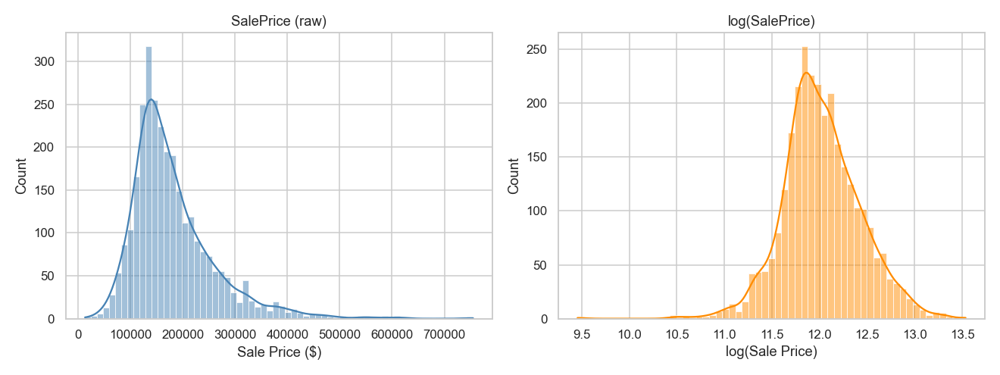
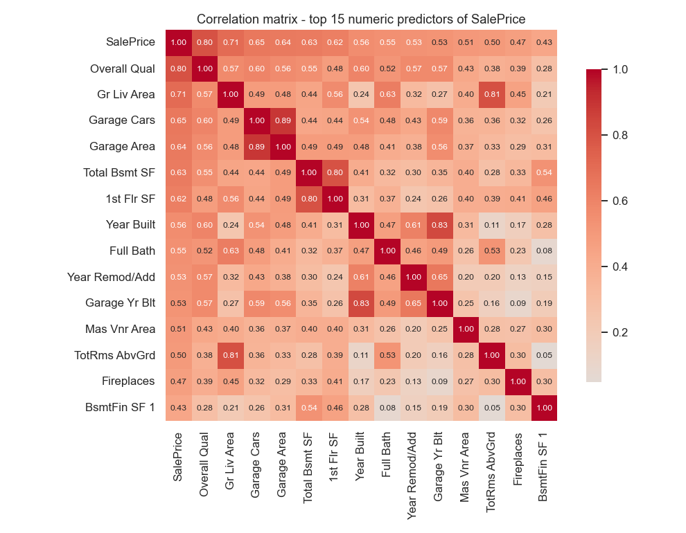
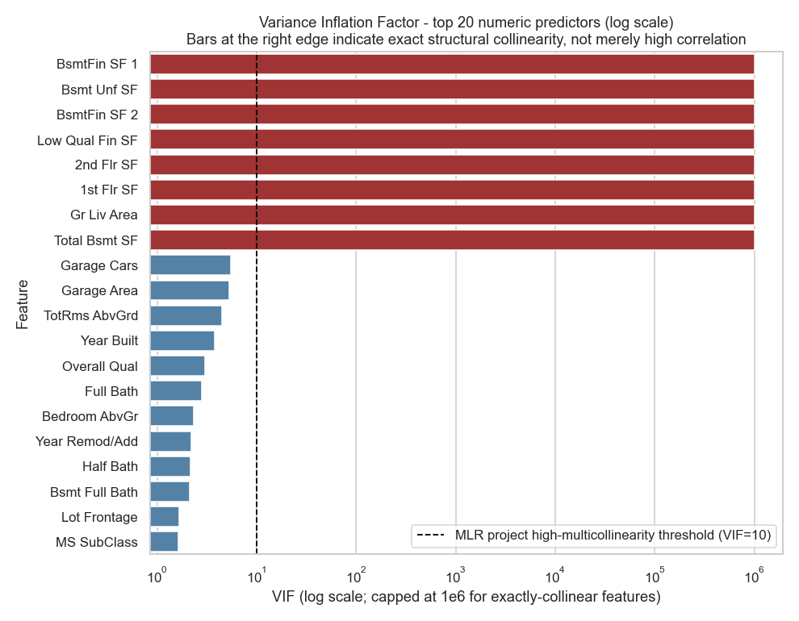
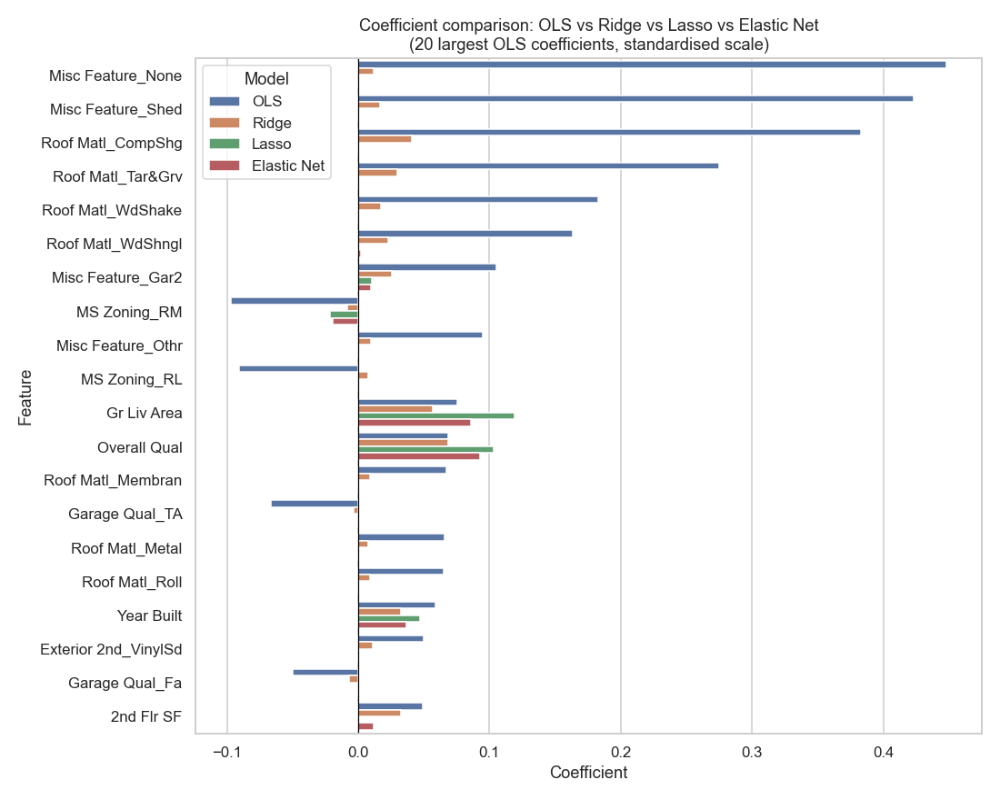
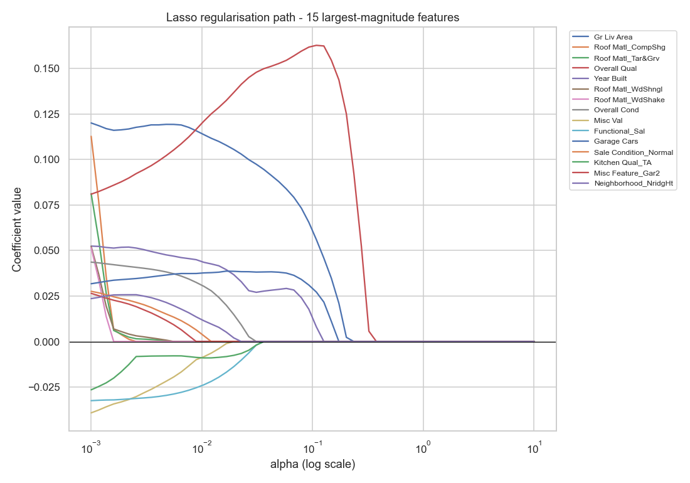
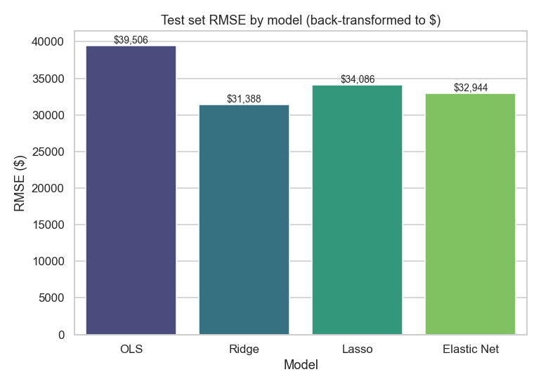
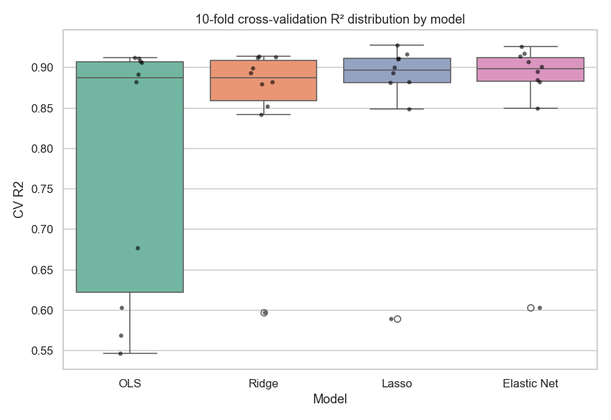

---

layout: default

title: House Price Predictions (Regularised Regression)

permalink: /regularised-regression/

---

# This project is in development

## Goals and objectives:

The business objective is to determine whether Ridge, Lasso, and Elastic Net regression produce more stable, generalisable house price predictions than an unpenalised Ordinary Least Squares (OLS) baseline when the feature set is large and features are correlated with one another — and, in doing so, to identify which property characteristics carry genuinely independent pricing signal versus which are redundant or noisy. The Ames Housing dataset (De Cock, 2011) — 2,930 residential property sales in Ames, Iowa, recorded across 82 fields — provides a realistic setting for this question: a much larger and higher-dimensional feature space than a typical regression dataset, with several groups of features (basement composition, above-ground living area) that are structurally related to one another by construction.

The analytical scope extends beyond a single model comparison. An OLS baseline is fitted first to establish a reference point, followed by Ridge, Lasso, and Elastic Net, each tuned via 10-fold cross-validated search over a shared grid of penalty strengths, ensuring differences in outcome reflect genuine differences between the penalty types rather than inconsistencies in the search process. Variance Inflation Factor (VIF) diagnostics are used to characterise the severity and nature of multicollinearity in the dataset before any model is fitted. Coefficient behaviour is then compared directly across all four models, with particular attention to two distinguishing properties: Lasso and Elastic Net's capacity to shrink coefficients to exactly zero — performing feature selection as a by-product of fitting — versus Ridge's shrinkage toward, but never to, zero. A regularisation path traces this behaviour continuously as the penalty strength increases.

This project is deliberately positioned differently from the [Multiple Linear Regression](https://marcgrover-datascience.github.io/multi-linear-regression/) project elsewhere in this portfolio. That project addressed OLS from an inferential standpoint — testing statistical significance, residual assumptions, and individual coefficient confidence intervals on a small, low-dimensional dataset. This project addresses a different failure mode of OLS entirely: coefficient instability and overfitting under a large, correlated predictor set — and a different remedy for it, penalisation rather than diagnosis-and-tolerate. Where that project found moderate multicollinearity (VIF ≈ 9.2) between two predictors and treated it as an acceptable, documented limitation, this project uses Ames' much more severe multicollinearity as the empirical basis for demonstrating why regularisation, rather than OLS with caveats, is the appropriate tool once a feature set reaches this scale.

The analysis confirms that regularisation delivers a material, measurable improvement under these conditions: Ridge, Lasso, and Elastic Net each outperform OLS on held-out test data (test R² of 0.912–0.915 versus 0.854 for OLS), and — more importantly for the stability question — the standard deviation of cross-validation R² across ten folds falls from 0.152 for OLS to 0.090–0.095 for the three regularised models. The VIF diagnostics further reveal that Ames' multicollinearity is not diffuse but concentrated in a small number of exact structural identities between features, an even more extreme condition than the elevated-but-finite VIFs the Multiple Linear Regression project encountered, and one that regularisation handles without incident where OLS coefficient estimates become arbitrarily unstable.

## Application:  

Regularised regression extends ordinary linear regression by adding a penalty term to the loss function that constrains the magnitude of the fitted coefficients. This single change addresses two problems that plague unpenalised regression as the feature set grows: overfitting, where a model fits training-set noise rather than genuine signal, and instability under multicollinearity, where correlated predictors cause coefficient estimates to swing wildly based on which observations happen to fall into the training sample. Ridge regression (L2 penalty) shrinks all coefficients toward zero without eliminating any, making it well-suited to situations where most predictors carry some genuine signal. Lasso (L1 penalty) can shrink coefficients to exactly zero, performing automatic feature selection alongside estimation — valuable when many candidate predictors are expected to be irrelevant or redundant. Elastic Net blends both penalties, offering a middle ground when the right degree of sparsity is not known in advance. Across all three variants, the practical benefit to a business is the same: more reliable, generalisable predictions from wide feature sets, without requiring an analyst to hand-select which of many candidate predictors to trust.

The business application of regularised regression spans any domain where predictive models are built from wide, and often correlated, feature sets:

🏠 **Real estate:**

**Hedonic property valuation**: as demonstrated in this project, automated valuation models draw on dozens of correlated property characteristics — size measures, quality ratings, age indicators — where regularisation prevents any single redundant feature from destabilising the price estimate.

**Portfolio-level risk modelling**: real estate investment trusts modelling rental yield or default risk across large, heterogeneous property portfolios use regularisation to keep coefficient estimates stable as new property types and features are added to the model over time.

🏦 **Finance:**

**Credit risk scoring**: consumer lending models often draw on hundreds of correlated bureau and behavioural features (utilisation ratios, payment history variables, account counts); Lasso-driven feature selection produces a leaner, more auditable scorecard without sacrificing predictive accuracy — a material advantage in a regulated setting where every retained feature must be justified.

**Factor model construction**: quantitative analysts regularise regressions of asset returns against large libraries of candidate risk factors, many of which are correlated with one another, to avoid attributing return to a factor that is merely a proxy for another.

🛍️ **Retail and marketing:**

**Marketing mix modelling**: media spend across channels (TV, paid search, social, display) is frequently highly correlated because campaigns run concurrently; Elastic Net is a standard choice in this setting, stabilising channel-level return-on-investment estimates that an unpenalised regression would otherwise attribute unreliably between correlated channels.

**Demand forecasting**: retailers forecasting product-level demand from wide feature sets — price, promotions, seasonality indicators, competitor activity — use regularisation to prevent overfitting when the number of candidate features is large relative to the number of historical observations for a given product line.

🧬 **Healthcare and life sciences:**

**Biomarker discovery**: genomic and clinical studies routinely measure far more candidate predictors (gene expression levels, biomarkers) than there are patients; Lasso's sparsity property is used directly as a feature-selection tool to identify the small subset of biomarkers most associated with an outcome, a setting where OLS is not merely unstable but frequently inapplicable outright.

**Clinical risk prediction**: hospital readmission or complication-risk models draw on large numbers of correlated clinical and administrative variables, where regularisation improves the reliability of risk scores used to prioritise post-discharge intervention.

## Methodology:  

The analysis is implemented in Python using pandas for data handling, scikit-learn for modelling, preprocessing and cross-validation, statsmodels for the Variance Inflation Factor calculation, and seaborn and matplotlib for visualisation. The dataset is the Ames Housing dataset (De Cock, 2011), comprising 2,930 residential property sales in Ames, Iowa recorded between 2006 and 2010 across 82 fields, sourced from the original publication [here](https://jse.amstat.org/v19n3/decock/AmesHousing.txt).

**Data Loading and Preparation**

Three columns are dropped prior to any other processing: Order and PID are row identifiers with no predictive content, and Garage Yr Blt is removed as functionally redundant with Year Built — properties are rarely built without a garage of the same vintage — and as a column whose own missingness (present wherever no garage exists) duplicates information already captured by the categorical garage fields.

The dataset's missingness is treated according to its documented meaning rather than a single blanket strategy. A substantial group of categorical fields — pool quality, fence, fireplace quality, garage type/finish/quality/condition, basement quality/condition/exposure/finish type, and masonry veneer type — use a missing value to mean the property does not have that feature at all, rather than that the value is unknown; these are filled with an explicit "None" category, and their numeric counterparts (basement square footage fields, masonry veneer area, garage area and car capacity) are filled with zero on the same logic. This distinction matters methodologically: collapsing "no basement" into the same treatment as "basement quality not recorded" would discard a genuine, informative difference between properties. Lot Frontage, by contrast, has no such structural interpretation — every property has some frontage — so its missingness is treated as a genuine gap in the records and imputed with the median frontage for the same neighbourhood, reflecting the fact that frontage is driven substantially by local plot layout conventions; a small number of properties in neighbourhoods with no recorded frontage at all fall back to the dataset-wide median. The single missing Electrical value is filled with the modal category.

The target variable, SalePrice, is right-skewed (skew = 1.744), which is reduced substantially by a log transformation (skew = -0.015). This mirrors the square-root transformation applied to the target in the Multiple Linear Regression project for the same underlying reason — bringing the target distribution closer to the normal-residual assumption OLS-family models rely on — and all four models in this project are fitted against log(SalePrice), with predictions back-transformed to the original dollar scale for evaluation and reporting.

**Feature Encoding and Train/Test Split**

The feature set is deliberately kept broad rather than curated: all 78 remaining predictor columns are retained following the preprocessing above, rather than pre-selecting a subset by hand. This is a direct methodological choice rather than a default — a wide, correlated feature set of this kind is precisely the setting in which regularisation earns its place over OLS, and manually pruning features ahead of modelling would pre-empt the comparison this project exists to make. Categorical features are one-hot encoded with the first category of each dropped, avoiding the dummy variable trap that would otherwise introduce artificial perfect collinearity between a complete set of dummy columns and the model intercept. This produces 274 features from the original 78 columns. The data is then partitioned into training (80%, 2,344 observations) and test (20%, 586 observations) sets using a fixed random seed for reproducibility.

**Feature Scaling**

All features are standardised to zero mean and unit variance using scikit-learn's StandardScaler, fitted on the training set only and applied to both sets to prevent test-set information from leaking into preprocessing. Scaling is a methodological necessity specific to this project rather than a routine step: Ridge and Lasso penalise coefficient magnitude directly, so on unscaled data a feature measured in the hundreds (square footage) would require a proportionally small coefficient to achieve the same effect as a 0/1 dummy variable, and would consequently be penalised far less heavily under an untreated feature scale. Standardising ensures the penalty is applied evenhandedly across the full feature set.

**Multicollinearity Assessment**

VIF is calculated on the numeric (non-dummy) predictors only, where genuine, continuous multicollinearity between competing size and quality measures is concentrated and interpretable — mirroring the scope of the VIF analysis in the Multiple Linear Regression project, which assessed its own three continuous/binary predictors rather than a full dummy matrix. VIF values above 10 are treated as high multicollinearity, following the same threshold applied on that project, allowing a direct comparison against its reported values (total_bill: 9.216, size: 9.271).

**Model Specification and Fitting**

The OLS baseline is fitted using scikit-learn's LinearRegression rather than statsmodels, a deliberate departure from the Multiple Linear Regression project's approach. That project's use of statsmodels served an inferential purpose — p-values, confidence intervals, and formal significance testing — which is not the focus here. This project's comparison is predictive and structural: does penalisation improve generalisation and produce more stable coefficients? Fitting all four models (OLS, Ridge, Lasso, Elastic Net) through the identical scikit-learn interface, on the same scaled feature matrix, keeps that comparison on equal footing rather than conflating a modelling-library difference with a genuine methodological one.

Ridge, Lasso, and Elastic Net are each tuned via RidgeCV, LassoCV, and ElasticNetCV respectively, using a shared grid of 100 candidate penalty strengths (alpha, log-spaced from 0.001 to 100) and a shared 10-fold cross-validation split across all three, so that differences in the selected penalty reflect genuine differences between the penalty types rather than differences in search grid or fold assignment. Elastic Net additionally searches over seven candidate l1_ratio values spanning Ridge-like (0.1) to Lasso-like (0.99) behaviour, allowing the model to locate whichever blend of the two penalties best suits this feature set rather than assuming an even split a priori.

**Model Evaluation**

Each model is evaluated on the held-out test set using R², RMSE, and MAE, with RMSE and MAE calculated after back-transforming predictions from log-scale to dollars — reporting error in dollar terms makes model performance interpretable to a non-technical decision-maker in a way the log scale alone would not. The gap between training and test R² is reported for each model as a direct, quantified signature of overfitting: a wide gap indicates a model fitting training-set noise that does not generalise, which regularisation is expected to narrow relative to the OLS baseline.

To assess model stability — the second half of the business question, alongside raw predictive accuracy — 10-fold cross-validation is additionally run for each model at its selected hyperparameters, using the same fold split used during hyperparameter search. The distribution of R² across folds is examined for each model: a tightly clustered distribution indicates a model whose performance a decision-maker can rely on regardless of which properties happen to fall into a given data partition, while wide dispersion signals sensitivity to the particular sample used for fitting.

**Coefficient and Sparsity Analysis**

Coefficients from all four models are compared directly on the standardised scale, restricted to the 20 features with the largest absolute OLS coefficient for legibility. The number of coefficients each model drives to exactly zero is recorded, isolating Lasso and Elastic Net's sparsity property — automatic feature selection as a by-product of fitting — from Ridge's shrinkage-without-elimination behaviour. A regularisation path is additionally traced for Lasso across a range of penalty strengths, refitting the model at each value to show how individual coefficients shrink toward zero as the penalty increases, restricted to the 15 features with the largest coefficient magnitude at the least-penalised end of the path for readability.

## Results:

**Target Variable Distribution**

SalePrice is meaningfully right-skewed in its raw form (skew = 1.744), reflecting a small number of high-value properties in the upper tail. A log transformation reduces this to near-zero skew (skew = -0.015), justifying its use as the modelling target for all four models in this comparison:



**Correlation Analysis**

Overall Qual shows the strongest linear relationship with SalePrice (r = 0.799), followed by Gr Liv Area (r = 0.707), Garage Cars (r = 0.648), Garage Area (r = 0.640), and Total Bsmt SF (r = 0.632). The correlation matrix below restricts to the 15 strongest numeric predictors for legibility and makes visible several pairs of features that move together closely — Garage Cars and Garage Area (r = 0.89), Total Bsmt SF and 1st Flr SF (r = 0.80), and Year Built and Garage Yr Blt (r = 0.83) — a preview of the multicollinearity formally assessed next:



**Multicollinearity Assessment**

VIF was calculated for the 35 numeric (non-dummy) predictors. The result is a clean bimodal split rather than a smooth distribution of elevated values. Eight features return a numerically unbounded VIF:

```
        Feature   VIF
   BsmtFin SF 1   inf
    Bsmt Unf SF   inf
   BsmtFin SF 2   inf
Low Qual Fin SF   inf
     2nd Flr SF   inf
     1st Flr SF   inf
    Gr Liv Area   inf
  Total Bsmt SF   inf
```

This is not merely high correlation — verified separately, `Total Bsmt SF = BsmtFin SF 1 + BsmtFin SF 2 + Bsmt Unf SF` and `Gr Liv Area = 1st Flr SF + 2nd Flr SF + Low Qual Fin SF` hold as exact arithmetic identities across all 2,930 rows, with zero discrepancy in either case. This makes the design matrix exactly rank-deficient for these eight columns, which is a more severe condition than the elevated-but-finite VIFs the Multiple Linear Regression project encountered (total_bill: 9.216, size: 9.271).

No other numeric feature exceeds the conventional high-multicollinearity threshold of VIF > 10 — the remainder of the feature set sits comfortably below it, headed by Garage Cars (5.56) and Garage Area (5.29), both below the MLR project's own reported values. The chart below uses a log-scaled axis to display both extremes on one scale, with exactly-collinear features capped at 10⁶ for legibility and the MLR project's VIF = 10 threshold plotted as a reference line:



**Baseline OLS Performance**

The OLS baseline, fitted on all 274 encoded features, achieves a training R² of 0.9389 (RMSE $16,671, MAE $11,572) but a materially lower test R² of 0.8542 (RMSE $39,506, MAE $14,993) — a train/test R² gap of 0.0847. This gap is the empirical signature of overfitting under high dimensionality and exact multicollinearity: the unpenalised model fits patterns in the training data, including noise attributable to the redundant feature groups identified above, that do not generalise to unseen properties.

**Regularised Model Fitting**

Ridge, Lasso, and Elastic Net were each tuned via cross-validated search over a shared grid of 100 penalty strengths and a shared 10-fold split. Ridge selected a comparatively strong penalty (α = 100.0), Lasso a much lighter one (α = 0.0051), and Elastic Net settled at α = 0.0464 with an l1_ratio of 0.10 — closer to Ridge-like behaviour than Lasso-like, consistent with a feature set where most collinearity is concentrated in a small number of exact identities rather than spread diffusely across many redundant features.

The sparsity difference between the three penalty types is pronounced:

```
Model         Coefficients zeroed (of 274)
Ridge         3
Lasso         187
Elastic Net   173
```

Ridge, true to its shrink-but-never-eliminate design, leaves all but 3 coefficients non-zero. Lasso and Elastic Net, by contrast, eliminate over two-thirds of the feature set outright. The first 15 features Lasso zeroes out include `Lot Frontage`, `Mas Vnr Area`, `BsmtFin SF 2`, `Bsmt Unf SF`, `1st Flr SF`, `2nd Flr SF`, and `Low Qual Fin SF` — notably, several of these are exactly the features implicated in the exact-collinearity finding above, indicating that Lasso is resolving the redundancy by discarding the components of `Total Bsmt SF` and `Gr Liv Area` in favour of the aggregate figures themselves.

**Coefficient Comparison**

Restricting to the 20 features with the largest absolute OLS coefficient reveals a striking pattern that the summary metrics alone do not: OLS assigns very large, unstable coefficients (up to ±0.45 on the standardised scale) to sparsely populated categorical dummies — rare `Roof Matl` categories and `Misc Feature` types — which all three regularised models shrink to near-zero. Meaningful, expected predictors such as `Gr Liv Area` and `Overall Qual` receive comparatively modest OLS coefficients (0.075 and 0.068 respectively) that Lasso and Elastic Net instead increase (to 0.119 and 0.103 for Lasso), redistributing explanatory weight away from the unstable rare-category dummies and toward the substantively meaningful, well-populated features:



**Regularisation Path**

The regularisation path traces how the 15 largest-magnitude Lasso coefficients change as the penalty strength increases from 0.001 to 10. Most features shrink monotonically to zero as expected, with `Gr Liv Area` and `Overall Qual` persisting furthest into the path before being eliminated — consistent with the coefficient comparison above. `Overall Qual`'s path rises before falling as the penalty increases; this is expected, non-monotonic behaviour under correlated features rather than an anomaly — as competing correlated predictors are driven to zero, `Overall Qual` temporarily absorbs more of the explained variance before its own coefficient is eventually shrunk in turn:



**Model Performance Comparison**

```
Model         Train R²   Test R²   Test RMSE    Test MAE    R² Gap
OLS             0.9389    0.8542     $39,506     $14,993     0.0847
Ridge           0.9267    0.9122     $31,388     $15,269     0.0145
Lasso           0.9070    0.9119     $34,086     $16,271    -0.0050
Elastic Net     0.9078    0.9147     $32,944     $16,251    -0.0069
```

All three regularised models outperform OLS on test R² by a wide margin, with Elastic Net achieving the best result (0.9147). Test RMSE falls from $39,506 (OLS) to between $31,388 (Ridge) and $34,086 (Lasso). Notably, Ridge, Lasso and Elastic Net all show a negative R² gap — test performance marginally exceeding training performance — the opposite pattern to OLS, and a direct quantitative confirmation that regularisation has eliminated the overfitting visible in the baseline:



**Cross-Validation Stability**

10-fold cross-validation, run at each model's selected hyperparameters, addresses the stability half of the business question directly. Mean CV R² and its standard deviation across folds:

```
Model         Mean CV R²   Std Dev
OLS              0.7809     0.1518
Ridge            0.8585     0.0902
Lasso            0.8662     0.0946
Elastic Net      0.8682     0.0907
```

The standard deviation across folds falls by roughly 40% moving from OLS to any of the three regularised models. The boxplot below makes this concrete: one OLS fold returns an R² as low as approximately 0.55, a result driven by exactly the coefficient instability the coefficient comparison chart illustrates, while the regularised models' worst folds remain above 0.84:



**Robust vs Fragile Features**

Comparing coefficients across all four models identifies which features carry signal that survives regardless of modelling approach, and which are artefacts of OLS's sensitivity to collinearity. 19 features retain a non-trivial coefficient - absolute value of the coefficient > 0.01 - in all four models, headed by `Gr Liv Area`, `Overall Qual`, `Year Built`, `Overall Cond`, and `Total Bsmt SF` — a set that aligns closely with the strongest correlates identified in the initial EDA.

By contrast, 43 features that OLS treats as meaningful are zeroed out entirely by Lasso, headed by the same sparsely populated dummy variables flagged in the coefficient comparison:

```
Feature               OLS       Ridge
Misc Feature_None    0.448      0.012
Misc Feature_Shed    0.423      0.017
Roof Matl_CompShg    0.383      0.041
Roof Matl_WdShake    0.183      0.017
Misc Feature_Othr    0.095      0.010
```

Ridge's retained (if heavily shrunk) coefficients for these same features — an order of magnitude smaller than OLS's — corroborate the interpretation that OLS's estimates here are largely an artefact of small-sample categories rather than genuine pricing signal.

## Conclusions:

Conclusions from the project findings and results.

## Next steps:  

Next steps based on current results and conclusions from above and suggested follow-up actions, analysis etc.

## Python code:
You can view the full Python script used for the analysis here: 
[View the Python Script](/regularised_regression_ames_v2.py)
