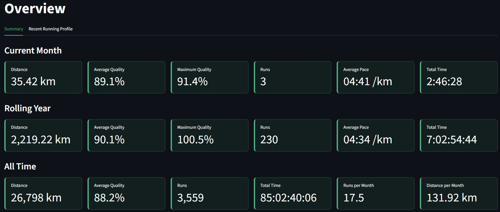
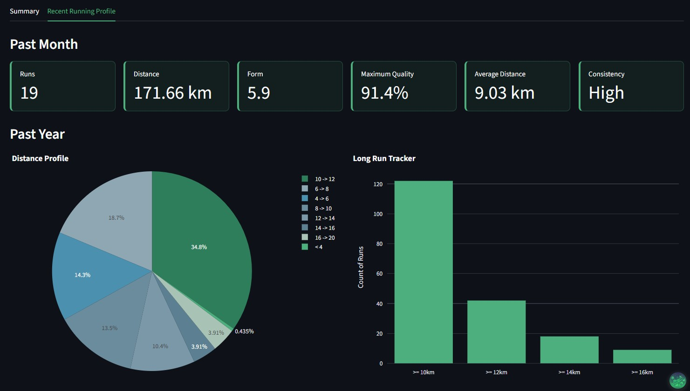
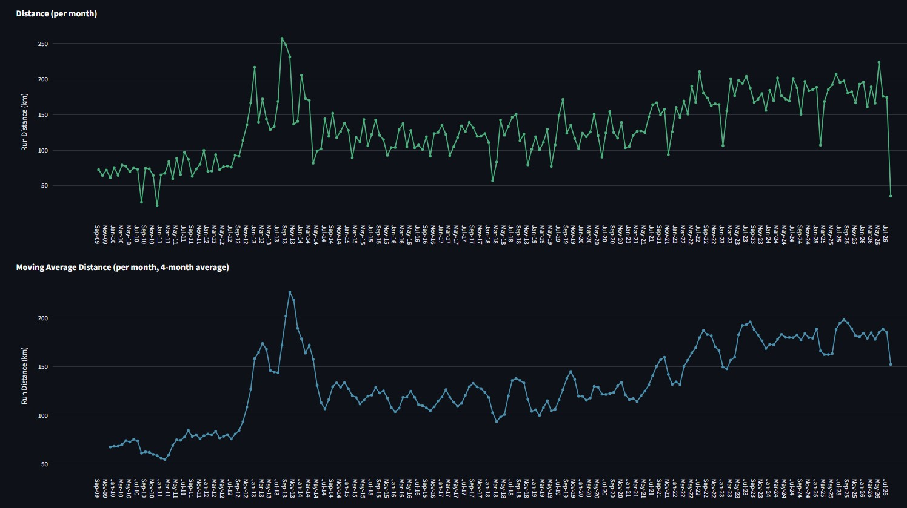
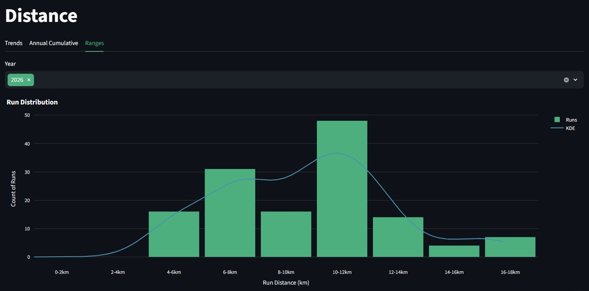
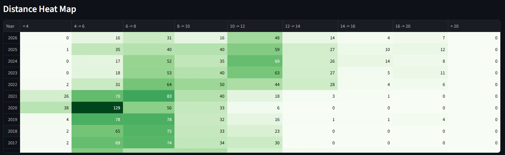
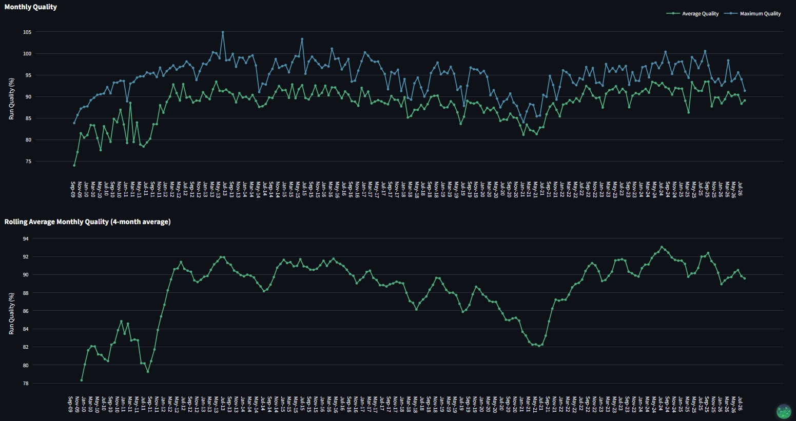
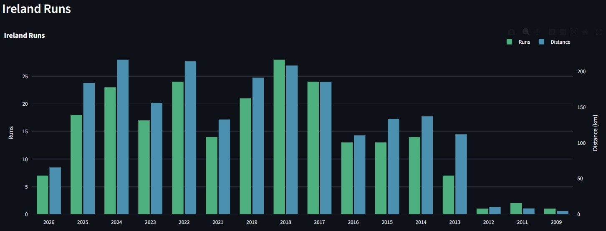
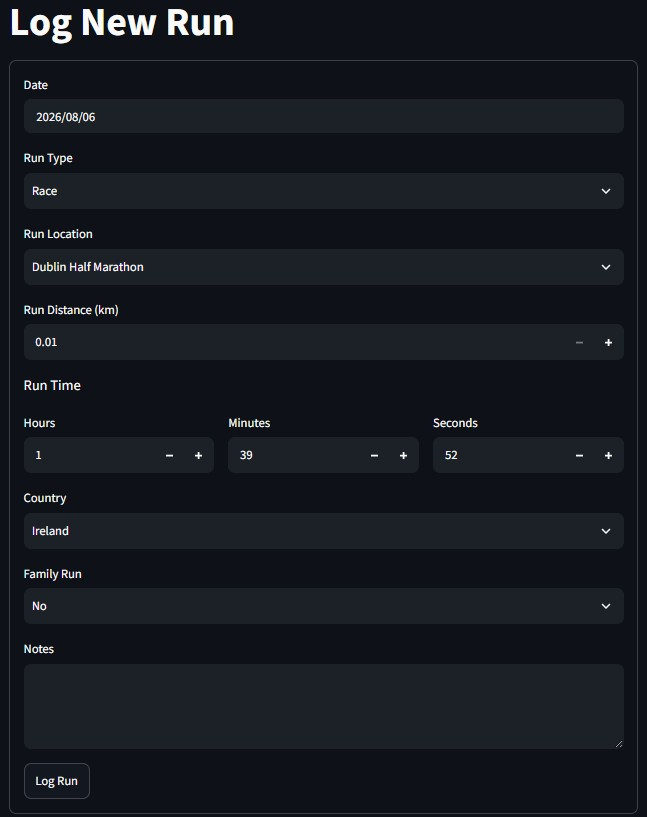

---

layout: default

title: Running Analytics Suite

permalink: /running-analytics/

---

## Goals and objectives:

The other projects in this portfolio demonstrate applied machine learning and statistical analysis through static, notebook-style Seaborn and Matplotlib outputs. This project is deliberately different in kind rather than degree: its objective is to demonstrate interactive dashboard design and public application deployment — a distinct and equally business-critical analytics capability, and one that no other project in this portfolio currently covers.

The dataset happens to be personal — seventeen years of self-logged running activity, comprising over 3,500 individual runs recorded in an Excel workbook since 2009 (at the time of initial deployment) — but the dataset is the vehicle, not the point. The same requirements-driven design process used here — turning a raw, messy, manually maintained spreadsheet into a validated data model, a repeatable transformation pipeline, and a live, multi-page analytical application — is directly transferable to the operational dashboards that underpin day-to-day decision-making in business: performance tracking, spend analytics, manufacturing monitoring, sales reporting, and similar recurring-metric use cases.

The specific objectives of the project are to:

- Design a proper data model from a genuinely messy, seventeen-year, manually maintained source file, including field-by-field retention and derivation logic rather than a superficial pass-through of the raw data.
- Build a maintainable ingestion and transformation pipeline — not a one-off export — with a defined workflow for correcting historical records and a working data-entry mechanism for capturing new records going forward.
- Design and derive a custom performance metric (Run Quality) that normalises pace by distance, so that performance can be compared meaningfully across runs of very different lengths.
- Extend that per-run Run Quality metric into medium-term Form and Consistency measures, converting a period's average Run Quality into a more interpretable score and quantifying run-to-run variability within that period — answering a genuinely different question to Run Quality itself: not how good a single run was, but how training is going, and how stable that performance is, over a period such as a month.
- Deploy a genuinely public, multi-page interactive application, end to end, from local development through version control to public cloud hosting.
- Apply deliberate accessibility-aware design choices to the interface, rather than treating accessibility as an afterthought.

By the end of the project, the aim is to demonstrate not just chart-building, but the full skill set a business analytics role actually requires: data engineering discipline, pipeline design, metric definition, deployment competence, and design judgement — applied here to running data, but equally applicable to a sales, operations, or finance dashboard.

## Application:

Interactive analytics dashboards are among the most widely deployed data products in business, precisely because they close the gap between raw operational data and the people who need to act on it day to day. Unlike a one-off analysis, a dashboard is a living data product: it ingests new data on an ongoing basis, recalculates derived metrics automatically, and is designed to be consulted repeatedly rather than read once. The core requirements — a clean data pipeline, sensible aggregation logic, clear visual hierarchy, and reliable public or internal hosting — are identical regardless of the domain the dashboard serves.

This approach is applicable across many sectors and scenarios. Practical examples showing where interactive performance dashboards provide clear business value include:

🏭 **Manufacturing & Operations**:

**Production Monitoring**: Plant managers track output volume, defect rate, and machine uptime against target on a live shift-by-shift dashboard, rather than waiting for an end-of-week report.  
**Quality Trend Tracking**: Quality teams monitor a rolling average of defect or rework rates over time, surfacing gradual process drift long before it becomes a formal non-conformance.  
**Maintenance Scheduling**: Engineering teams track equipment runtime and service intervals across a fleet of machines, flagging units approaching their next scheduled maintenance window.  

💰 **Finance & Spend Analytics**:

**Budget vs Actual Tracking**: Finance teams monitor departmental spend against budget in real time, with drill-down from monthly totals to individual transaction categories.  
**Cash Flow Monitoring**: Treasury teams track incoming and outgoing cash positions on a rolling basis, identifying seasonal patterns and flagging unusual month-on-month movements.  
**Expense Category Analysis**: Procurement teams break down spend by supplier and category over time, identifying where consolidation or renegotiation would have the greatest impact.  

📈 **Sales & Marketing**:

**Pipeline and Conversion Tracking**: Sales leaders monitor deal volume, conversion rate, and average deal size across a rolling period, comparing current performance against historical trends.  
**Campaign Performance**: Marketing teams track engagement and conversion metrics by channel and campaign over time, reallocating spend towards what is currently working.  
**Territory Performance Comparison**: Regional managers compare performance metrics across territories or stores, using heat-map style views to identify strong and weak performers at a glance.  

🚚 **Logistics & Supply Chain**:

**Delivery Performance Tracking**: Logistics teams monitor on-time delivery rate and average transit time over rolling periods, identifying routes or carriers whose performance is degrading.  
**Inventory Level Monitoring**: Warehouse teams track stock levels and turnover rates by product category, flagging categories trending towards stock-out or overstock.  
**Route and Volume Analysis**: Distribution planners visualise shipment volume and distance by region over time, informing decisions about depot placement and route consolidation.  

Every one of these examples follows the same underlying pattern demonstrated in this project: a recurring, messy operational data source; a defined pipeline that transforms it into a trustworthy metric layer; and an interactive, publicly or internally accessible interface that lets a non-technical stakeholder explore current and historical performance without needing to ask an analyst to pull a fresh report.

## Methodology:

The project follows a genuine end-to-end data product lifecycle — data modelling, pipeline engineering, application development, and deployment — rather than a single analysis run once and left static. It is implemented in Python, using pandas for data transformation, Streamlit for the interactive web application, and Plotly for charting, with the finished application publicly hosted on Streamlit Community Cloud.

**Source Data and Data Model Design**:

The source data is a personal Excel workbook logging every run since 2009 — 3,559 records in total, spanning 17 years of manual entry and therefore carrying the inconsistencies typical of any long-running, hand-maintained operational log. Rather than loading the raw file directly into the application, a proper data model was designed first: each of the 19 fields in the final model — including Run Distance, Run Time, Running Pace, Running Speed, Run Quality, Run Calories, Distance Range, and a set of derived date and flag fields — was individually assessed for whether it should be retained as-is, derived from other fields, or dropped, and documented accordingly. This requirements-driven modelling step is the same discipline applied to any operational reporting dataset before it is fit to serve a dashboard: the raw source data is very rarely the data a stakeholder should actually be looking at.

**Custom Metric Design — Run Quality**:

A central piece of analytical work in this project is the design of a custom Run Quality metric, since raw pace alone is not a fair way to compare performance across runs of very different distances — a runner's sustainable pace naturally slows as distance increases. Run Quality is calculated as:

```
Run Quality = Running Speed (km/hr) / (−1.407 × LN(Run Distance) + 17.771)
```

The denominator is a log-distance-normalised expected-maximum-pace model, derived from the runner's own historical performance curve, giving an expected optimal achievable speed for any given distance - which was based on personal bests for standard race lengths as of 2020. Run Quality then expresses actual performance as a percentage of that expectation, allowing a 5km run and a half-marathon to be compared on a like-for-like basis. This is the same class of problem faced constantly in business analytics — comparing performance fairly across units that differ in scale, whether that's stores of different footfall, machines of different throughput capacity, or sales territories of different size — and the solution follows the same principle: normalise against an expected baseline rather than comparing raw figures directly.

**Custom Metric Design — Form and Consistency**:

**Run Quality** answers a per-run question: how good was this specific run against an expected baseline for its distance. It does not, on its own, answer a different and equally important question: how is training going over a period, and how stable is that performance from run to run. Two further derived metrics — Form and Consistency — were designed specifically to answer that period-level question, calculated across a set of runs (a calendar month, in the live application) rather than derived from any single run.

**Form** rescales a period's mean Run Quality onto a more interpretable 0–10 scale. Mean **Run Quality** naturally clusters tightly — typically in a roughly 0.86–0.92 range — which makes small, genuinely meaningful shifts in form hard to read directly off the raw percentage. **Form** addresses this by anchoring to an empirically-derived floor and spreading the meaningful range across the full scale:

```
Form = MIN(MAX(Average Run Quality − 0.82, 0), 0.1) × 100
```

A companion **Form Difference** figure — the change in Form from one period to the next — surfaces improving or declining periods directly, rather than requiring the reader to compare two numbers by eye.

**Consistency** measures the spread of Run Quality across the individual runs within a period, using the coefficient of variation (standard deviation ÷ mean) of Run Quality — a distribution-shape measure that, unlike Run Quality itself, can only be calculated across multiple runs rather than one. The coefficient of variation is then bucketed into five qualitative bands (Very Low through Very High) rather than presented as a raw statistic, favouring interpretability for a non-technical dashboard user over statistical precision. 

Both metrics are deliberately scoped to a medium-term period. Over a single month, they capture a genuinely coherent "spell" of training — averaging out normal day-to-day and run-to-run noise while still describing one identifiable period of form. Applied over a much longer window — six months or a year — the same calculation becomes progressively less meaningful: it starts averaging across multiple genuinely different training phases (a base-building block, a taper, an injury layoff, a race build-up, natural seasonality), and the resulting single figure no longer describes one coherent period a reader can reason about. This is a deliberate scope decision rather than a shortcoming discovered after the fact — **Form** and **Consistency** are period-level metrics, not all-time ones, and the application currently surfaces them at the monthly grain accordingly.

**Ingestion and Transformation Pipeline**:

A Python/pandas ingestion script transforms the historical raw Excel source into a Parquet file, which serves as the application's single source of truth, alongside a formatted Excel export used as a human-readable backup and validation artefact. All calculation logic — including the Run Quality formula and other derived fields — lives in a single shared transformation module, used by both the ingestion script and the live application, so that a metric definition only ever exists in one place. Reference data such as valid run locations, countries, run types, and personal-best distances is held in a separate, version-controlled reference workbook, read directly by the application, so that dropdown lists and lookup values can be maintained without any code change.  The ingestion script was used prior to the initial release of the Analytics Suite, but no longer actively used as superceded by a new input mechanism, and all historical runs are logged in the Parquet file.

**Ongoing Data Lifecycle**:

This is a maintained, live data product rather than a one-time export. Two update mechanisms are in place:

- **Correcting historical records**: edits are made directly in the backup Excel export, then re-ingested through a dedicated re-ingestion script, which recalculates all derived fields automatically and rebuilds the Parquet source of truth.
- **Logging new runs**: a local-only "Log New Run" data-entry form feeds directly into the same transformation pipeline, computing derived fields — including Run Quality — immediately on submission. This form is deliberately excluded from the public deployment via a configuration flag, since it writes to the personal data source and is only intended for local use.

**Application Build and Deployment**:

The application is built as a multi-page Streamlit app, with one page per analytical theme (Overview, Best Times, Distance, Quality, Races, and Geography), each using filters scoped to that page rather than a single global filter state. Charting is done in Plotly throughout, chosen for its native interactivity — hover detail, zoom, and legend toggling — over static image-based charts. The full deployment pipeline runs from local development in PyCharm, through version control on GitHub, to public hosting on Streamlit Community Cloud, with the live application and full source code both publicly accessible. 

**Accessibility-Aware Design**:

Two design choices were made deliberately to support accessible use of the dashboard, rather than as a pure aesthetic preference. First, both a dark and a light theme are explicitly defined, so that Streamlit's built-in theme toggle remains fully on-brand in either mode rather than defaulting to an unstyled light theme. Second, the colour palette (green, blue, and grey) was deliberately chosen to avoid the classic red-green colourblind failure case common in dashboard design, as well as red-green often being sub-consciously interpretted as bad-good. These choices support WCAG-aligned practices; a formal colourblind-simulator audit of the palette has not yet been carried out and is noted honestly as a Next Steps item rather than claimed as a completed compliance check.

## Results:

The application is publicly live at **[running-analytics.streamlit.app](https://running-analytics.streamlit.app/)**, with six analytical pages plus a local-only data-entry form currently deployed.  Not all of the visuals and functionality are explicitly stated in this section, and those selected represent a curated sample - the full suite of analytics can be viewed on the live application.

**Overview**:

The Overview page gives an at-a-glance summary across three time horizons — current month, rolling year, and all time — covering distance, average and maximum Run Quality, run count, average pace, and total time, alongside a Personal Bests and Favourite Runs summary.



A second tab, Recent Running Profile, narrows the focus to recent training load — past month and past year — including a distance-range breakdown and a long-run tracker showing how many runs have exceeded key distance thresholds.



**Distance**:

The Distance page examines how run distance has evolved over the full seventeen-year history. The monthly distance trend, together with a four-month moving average, smooths out week-to-week noise and makes the longer-term training pattern and trends — including a clear step-change in volume from 2012 onwards — much easier to read than the raw monthly figures alone.



A distance-range distribution view, filterable by year, shows the shape of training volume within a given year — in this case confirming that the 10–12km range is the most frequently run distance band in 2026.



A year-by-distance-band heat map gives a compact, colour-encoded view of how the distance profile of training has shifted year on year — for example, the clear concentration of shorter runs in 2020, contrasted with a more even spread across longer distances in recent years.



**Quality**:

The Quality page tracks the custom Run Quality metric over time, again with both a monthly view and a four-month rolling average to separate genuine trend from short-term noise. The rolling average view in particular makes multi-year form cycles visible — periods of sustained improvement followed by plateaus or dips — in a way that would be very difficult to read from the raw monthly figures or individual runs.



**Geography**:

The Geography page breaks running activity down by location. The Ireland view shown below tracks run count and total distance by year for runs completed in Ireland (selected due to usual long periods spent in that country), illustrating how the page supports geographic as well as purely time-based analysis of the underlying data.



**Data Entry (local-only)**:

The Log New Run form, visible only in the local development build, captures date, run type, location, distance, time, country, and family-run status for a new run, and feeds directly into the same transformation pipeline used for the historical dataset — so newly logged runs are immediately consistent with, and comparable against, seventeen years of prior history.



Two further pages — **Best Times** and **Races** — are also live on the deployed application, covering personal-best progression across seven standard distances and race-specific performance respectively.

## Conclusions:

This project delivers a genuine first release of a live, evolving analytics application: six public analytical pages, a working local data-entry mechanism, and a full deployment pipeline from local development through to public cloud hosting. It is deliberately positioned as a v1 release rather than an incomplete build — the analytical scope currently live is coherent and complete in its own right, and any further pages represent normal incremental product evolution rather than gaps in this release.

The project's real value to this portfolio lies less in the running data itself and more in what building it required: a properly designed data model derived from a genuinely messy, seventeen-year source; a custom-built, distance-normalised performance metric; a maintainable ingestion and correction pipeline rather than a one-off export; and a fully deployed, publicly accessible, accessibility-aware interactive application. Every one of those skills — data modelling discipline, metric design, pipeline maintainability, and deployment competence — transfers directly to the operational dashboards used across manufacturing, finance, sales, and logistics functions in business, as set out in the Application section above.

Both the live application and its full source code are public, consistent with the transparency approach taken across this portfolio. The underlying data is likewise comfortable to publish, since it is already public via Strava and the dashboard presents aggregated performance rather than exact routes or precise personal locations.

## Next steps:

As a live, evolving application, the following enhancements form a natural roadmap for future development:

- Complete a colourblind-simulator check of the current colour palette to move from an accessibility-aware design to a verified one, addressing the one open item flagged in the Methodology section.
- Extend the analytical page set further, following the same visual-specification-driven build process used for the pages currently live.
- Package the application to run outside PyCharm's integrated terminal — for example, via a simple launch script — to make local use more convenient day to day.
- Explore logging new runs directly from a mobile device, removing the current dependency on the local desktop environment for data entry.

## Live application & source code:

You can view the live application here: **[running-analytics.streamlit.app](https://running-analytics.streamlit.app/)**

The full source code is publicly available on GitHub: *[link to be added]*
