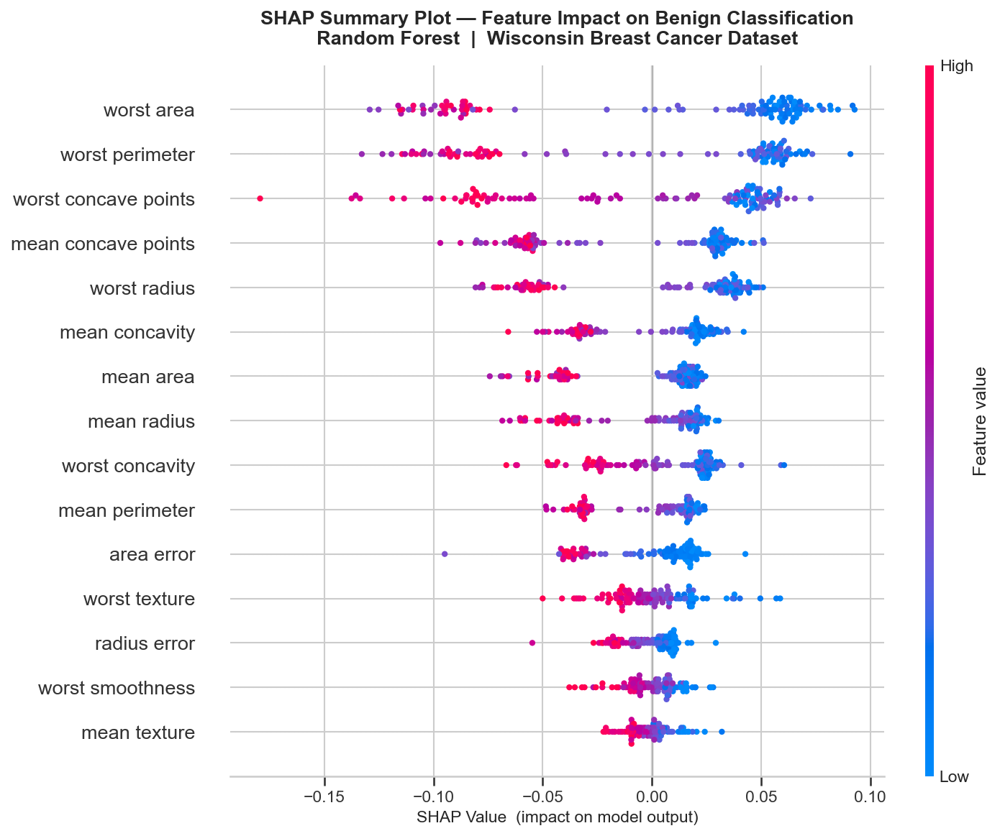
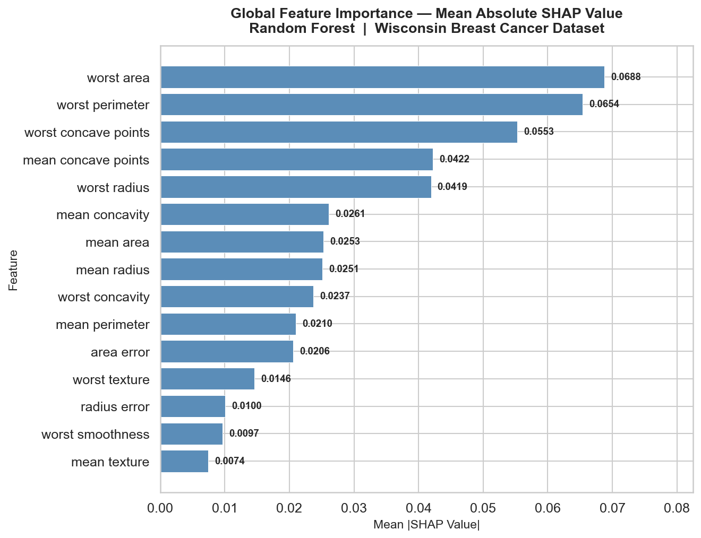
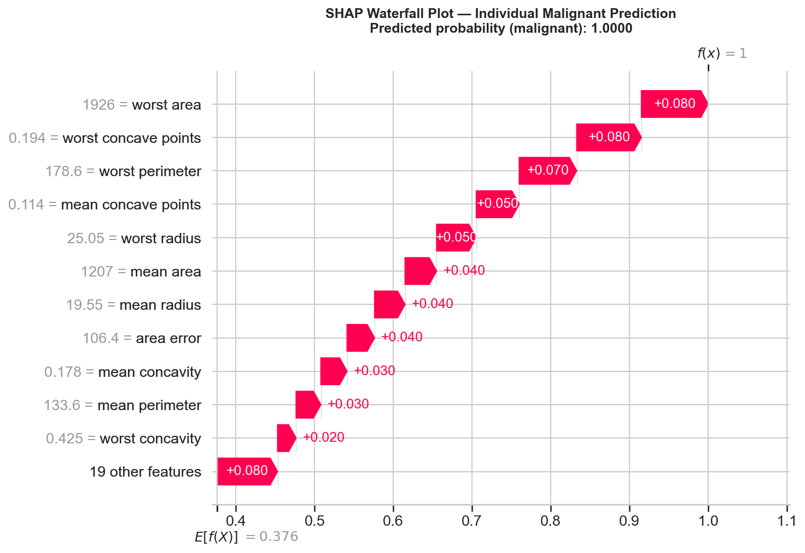
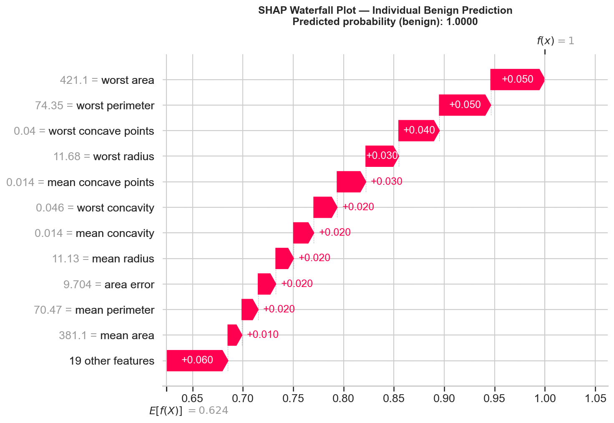
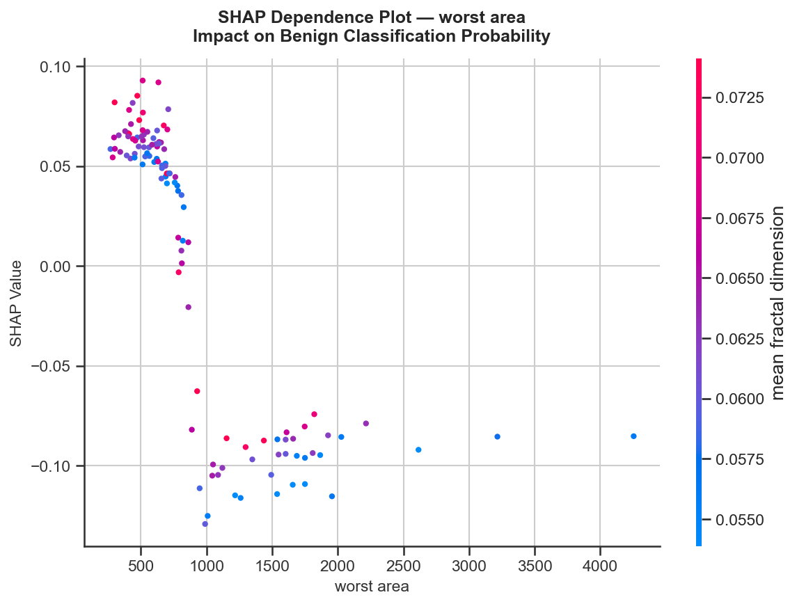
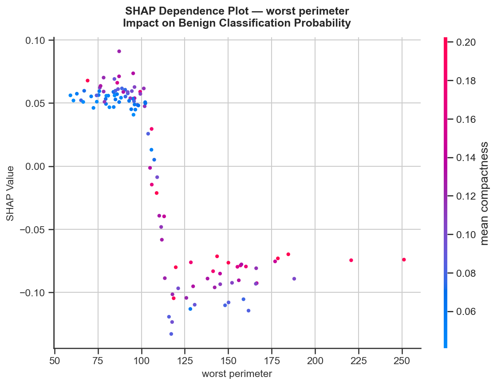
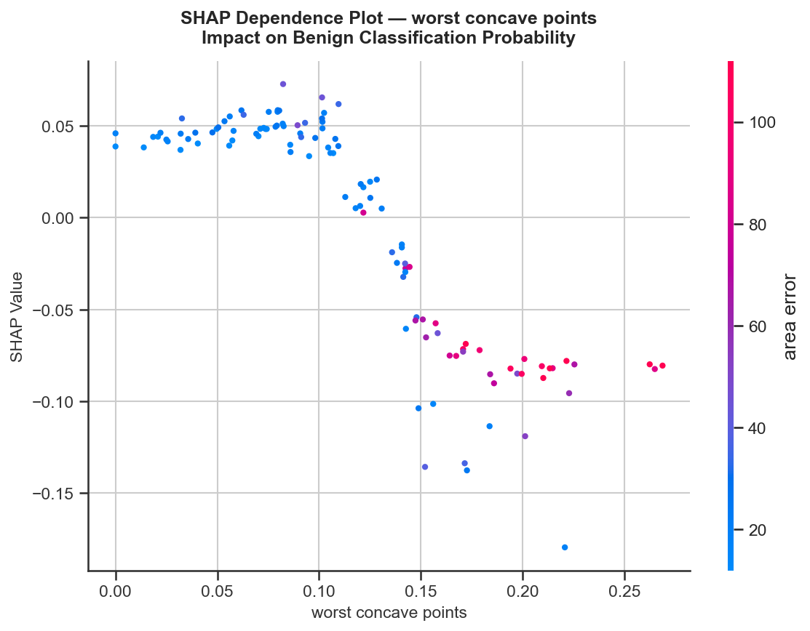
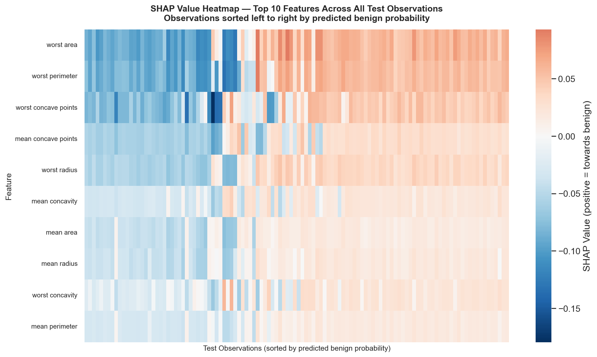

---

layout: default

title: Breast Cancer Predictions (SHAP - SHapley Additive exPlanations)

permalink: /shap/

---

## Goals and objectives:

For this portfolio project, the business scenario concerns the interpretability of a machine learning classifier applied to the Wisconsin Breast Cancer Diagnostic dataset — the same dataset used in the Decision Tree, Random Forest, Gradient Boosted Trees, and Support Vector Machine projects in this portfolio. 

The objective is not to build a new predictive model, but to open up an existing one: to move beyond the question of how accurately a model classifies and address the equally important question of why it produces the predictions it does. The dataset comprises 569 observations across 30 continuous features derived from digitised fine needle aspirate (FNA) images, and the target variable is a binary classification of tumours as malignant or benign.

The model selected as the subject of this interpretability analysis is the Random Forest classifier developed in the earlier Random Forest project, which achieved a test accuracy of 95.61% on this dataset. The Random Forest is chosen deliberately for this purpose: as an ensemble of hundreds of decision trees, it is a genuine black-box model whose internal logic is not directly readable by a clinician or decision-maker, making it an ideal candidate for SHAP-based explanation. The Support Vector Machine project, which preceded this one, raised the question of feature-level interpretability directly — identifying which of the 30 cell nucleus measurements drive individual tumour classifications is a natural and necessary extension of that analysis, and this project provides the answer.

SHAP (SHapley Additive exPlanations) is the interpretability framework applied throughout. Grounded in cooperative game theory, SHAP assigns each feature a Shapley value for each individual prediction — a theoretically principled measure of that feature's marginal contribution to the model's output relative to a baseline expectation. Unlike global feature importance metrics such as mean impurity decrease or permutation importance, which summarise feature relevance across the entire dataset, SHAP operates at the level of individual observations. This distinction is analytically significant: two patients classified as malignant by the same model may have arrived at that classification via entirely different combinations of features, and SHAP makes those individual pathways visible.

The primary objectives of the project are threefold:

* to produce global SHAP explanations — summary visualisations that identify which features most consistently influence the model's predictions across all observations, providing a dataset-level view of what the Random Forest has learned.
* to produce local SHAP explanations — observation-level breakdowns that show exactly which features drove the model's classification for specific individual patients, and in which direction.
* to examine the interaction between the most influential features, identifying where the combined effect of two features on a prediction is greater or lesser than the sum of their individual contributions.

By the end of the analysis, the project aims to demonstrate that model interpretability is not a supplementary concern but an integral component of responsible machine learning deployment — particularly in a clinical domain where a model's predictions carry direct consequences for patient outcomes. A classifier that achieves 95% accuracy but cannot explain its reasoning offers limited value to a clinician who must decide whether to act on it. SHAP provides the bridge between predictive performance and decision-making confidence, and this project demonstrates that bridge in a concrete, applied context.

## Application:  

SHAP (SHapley Additive exPlanations) is a model interpretability framework used to explain the output of any machine learning model, deployed across a wide range of industries wherever the objective is not only to generate accurate predictions but to understand why a model produced a given result. It is applicable to virtually any supervised learning algorithm — from linear models to deep neural networks — and is equally valuable whether the task is classification or regression.

The core principle behind SHAP is the decomposition of a model's prediction for a single observation into additive contributions from each feature in the input. This decomposition is grounded in Shapley values, a concept from cooperative game theory that provides a theoretically principled method for distributing a collective outcome — in this case, the model's prediction — fairly among the contributing players — in this case, the input features. For a given observation, each feature's SHAP value represents the average marginal contribution of that feature to the prediction across all possible subsets of features, relative to a baseline expectation. A positive SHAP value indicates that the feature pushed the prediction above the baseline; a negative value indicates that it pulled the prediction below it. 

Crucially, the SHAP values for all features sum to the difference between the model's prediction for that observation and the global baseline, making the explanation both locally accurate and globally consistent. Specialised implementations — including TreeSHAP for tree-based ensembles, LinearSHAP for linear models, and KernelSHAP for model-agnostic application — provide computationally efficient variants tailored to different model families, making SHAP practical across the full range of algorithms commonly deployed in production.

This approach is applicable across many sectors and scenarios. Practical examples showing where the SHAP and Model Interpretability technique provides clear business value include:

🏥 **Healthcare & Life Sciences**:

**Clinical Decision Support**: Hospital systems use SHAP to explain individual patient risk scores generated by predictive models, identifying which clinical measurements — such as blood pressure, lab results, or comorbidities — drove a high-risk classification for a specific patient and enabling clinicians to interrogate and trust the model's output before acting on it.

**Regulatory Submissions and Auditability**: Pharmaceutical and medical device companies applying machine learning to drug efficacy or adverse event prediction use SHAP to produce feature-level explanations that satisfy regulatory requirements for model transparency, demonstrating to auditors precisely which variables the model relied upon for any given prediction.

**Genomics and Biomarker Discovery**: Research institutions apply SHAP to models trained on high-dimensional genomic data — gene expression profiles, proteomic measurements, or imaging biomarkers — to identify which biological features are most consistently predictive of a disease outcome, using global SHAP importance rankings to generate hypotheses for downstream experimental investigation.

💻 **Technology & Cybersecurity**:

**Fraud Detection Explanation**: Financial platforms use SHAP to explain individual fraud alerts generated by black-box classification models, providing fraud analysts with a ranked list of the transaction attributes — such as unusual location, atypical transaction amount, or irregular timing — that most contributed to the flagged score, enabling faster and more confident manual review decisions.

**Model Debugging and Bias Detection**: Machine learning engineering teams apply SHAP during model development and monitoring to identify whether a model has learned to rely on spurious or ethically problematic features — such as a demographic proxy in a credit scoring model — by inspecting SHAP value distributions across protected subgroups and intervening where the explanations reveal unintended dependencies.

**Personalised Recommendation Systems**: Technology companies use SHAP to explain individual content or product recommendations to end users, surfacing the specific features of a user's interaction history that drove a given suggestion, supporting both user trust and compliance with transparency obligations under data protection regulation.

🔬 **Science & Research**:

**Climate and Environmental Modelling**: Environmental scientists apply SHAP to machine learning models trained on atmospheric, oceanic, and land-use data, using feature attributions to identify which physical variables most strongly drive predictions of temperature anomalies, precipitation patterns, or ecological risk — translating opaque model outputs into scientifically interpretable findings.

**Materials Discovery**: Researchers in materials science use SHAP to explain predictive models for material properties such as tensile strength, conductivity, or thermal stability, identifying which molecular or structural descriptors the model most relies upon and directing experimental effort towards the features that offer the greatest leverage for property optimisation.

**Epidemiological Risk Modelling**: Public health researchers apply SHAP to population-level disease risk models to quantify the relative contribution of individual risk factors — socioeconomic, behavioural, environmental — to predicted health outcomes, enabling evidence-based prioritisation of public health interventions and providing an interpretable layer above statistical model coefficients.

🏭 **Manufacturing & Industry**:

**Predictive Maintenance Explainability**: Industrial operators use SHAP to explain the output of equipment failure prediction models, identifying which sensor readings — vibration frequency, operating temperature, pressure variance — most contributed to a high-probability failure prediction for a specific machine, enabling maintenance engineers to inspect and address the most likely failure mechanism rather than acting on an unexplained alert.

**Supply Chain and Demand Forecasting**: Logistics and retail organisations apply SHAP to demand forecasting models to explain deviations between predicted and historical demand, surfacing the specific input variables — promotional activity, seasonal signals, macroeconomic indicators — that drove an unusual forecast and supporting more informed inventory and procurement decisions.

**Quality Control Root Cause Analysis**: Manufacturing quality teams use SHAP to explain defect classification models at the level of individual production runs, identifying which process parameters — line speed, raw material batch, temperature profile — most strongly contributed to a predicted non-conformance, enabling targeted process adjustment and providing an auditable, feature-level explanation for quality incidents.

## Methodology:  

The analysis is implemented in Python, using pandas for data handling, scikit-learn for model construction, the SHAP library for explainability, and seaborn and matplotlib for visualisation. All plots are produced as individual saved PNG files consistent with the conventions established across this portfolio.

**Model Reconstruction**

The Random Forest classifier developed in the Random Forest project is reconstructed directly within this script using the optimal hyperparameters established there — 150 trees and a maximum depth of 10 — ensuring full reproducibility without dependency on saved model files. The Wisconsin Breast Cancer Diagnostic dataset is loaded from scikit-learn, split into an 80/20 train/test partition with stratification on the target variable, and the model is fitted on the training set. No feature scaling is applied, as Random Forest is a tree-based method and is invariant to the scale of input features. The reconstructed model achieves a test accuracy of 95.61%, confirming parity with the original project.

**SHAP Explainer — TreeSHAP**

SHAP values are computed using scikit-learn's TreeExplainer, which implements TreeSHAP — a fast, exact algorithm designed specifically for tree-based models. Unlike the generic KernelSHAP approximation, TreeSHAP exploits the tree structure of the model to compute exact Shapley values in polynomial rather than exponential time, making it computationally tractable for a 150-tree Random Forest without any sampling or approximation. SHAP values are computed across the full test set of 114 observations, producing a matrix of shape (114 observations × 30 features) for each class. All explanations are expressed relative to the benign class (class 1), consistent with scikit-learn's positive class convention, unless stated otherwise.

**Global SHAP Analysis**

Two complementary global visualisations are produced to characterise feature importance across the full test set. The first is a beeswarm summary plot, in which each point represents one observation and one feature — its horizontal position shows the magnitude and direction of the SHAP value, and its colour encodes the raw feature value. This plot communicates not just which features matter most globally, but how they matter: whether high feature values consistently push predictions towards benign or malignant, and how much variation exists across observations. The second is a mean absolute SHAP value bar chart, which ranks features by their average impact magnitude across all test observations, providing a clean single-value importance ranking for direct comparison with the native Random Forest feature importance scores established in the prior project.

**Local SHAP Analysis — Individual Predictions**

Two individual observations are selected from the test set for local explanation: one high-confidence correctly predicted malignant case and one high-confidence correctly predicted benign case. For each, a waterfall plot is produced showing how the model's output is built up from the baseline expected value — the mean predicted probability across all training observations — to the final prediction for that specific patient, with each feature's SHAP contribution shown as a positive or negative step along that path. This makes the reasoning behind each individual classification fully transparent, identifying precisely which cell nucleus measurements drove the prediction and by how much.

**SHAP Dependence Plots**

Dependence plots are produced for the three most important features as ranked by mean absolute SHAP value. Each plot shows the relationship between a feature's raw value and its SHAP contribution across all test observations, revealing whether the relationship is linear, monotonic, or threshold-driven. An interaction feature is automatically selected by the SHAP library for each plot — encoded as a colour dimension — highlighting where the SHAP contribution of the primary feature is modulated by the value of a second feature. This captures interaction effects that global importance rankings cannot surface.

**SHAP Heatmap**

A heatmap is produced showing SHAP values for the top 10 features across all 114 test observations simultaneously, with observations sorted left to right by predicted benign probability. This provides a dataset-level view of how the model's feature-level reasoning evolves across the full spectrum from high-confidence malignant predictions on the left to high-confidence benign predictions on the right, making systematic patterns in the model's behaviour visible at a glance.

**SHAP vs Native Feature Importance Comparison**

The SHAP-derived global feature rankings are compared directly against the native Random Forest feature importance scores — mean impurity decrease across all trees — reported in the prior project. Differences between the two rankings are examined and interpreted. Native importance is computed on the training set and can be biased towards features with high cardinality or many split points; SHAP values are computed on the held-out test set and reflect the actual marginal contribution of each feature to individual predictions, making them a more reliable and theoretically grounded measure of true feature influence.

## Results:

**Model Reconstruction Confirmation**

The Random Forest classifier is reconstructed using the optimal hyperparameters established in the prior project, achieving a test accuracy of **95.61**% — confirming full parity with the original analysis and validating that the SHAP explanations produced below reflect the same model. All SHAP values are computed across the held-out test set of 114 observations and expressed relative to the benign class unless stated otherwise.

**Global SHAP Analysis**  

**Beeswarm Summary Plot**

The beeswarm plot below presents the full picture of feature influence across all 114 test observations. Features are ranked top to bottom by mean absolute SHAP value, with each dot representing one observation. Horizontal position shows the direction and magnitude of influence on the benign classification probability — points to the right push the prediction towards benign, points to the left push it towards malignant. Colour encodes the raw feature value, from low (blue) to high (red).



The plot reveals several analytically important patterns. For the leading features — worst area, worst perimeter and worst concave points — high feature values (red points) consistently produce large negative SHAP values, meaning high measurements in these features push strongly towards a malignant prediction. Low values of the same features (blue points) push in the opposite direction towards benign. This directional consistency confirms that these features carry a clear, monotonic signal in the model's decision-making rather than a complex or context-dependent one.

Notably, worst concave points shows a wider spread of SHAP values than other highly ranked features, indicating that its influence on individual predictions is more variable — the same feature can produce very different SHAP contributions depending on the values of other features present in that observation. This is the first indication of feature interaction effects, which are examined further in the dependence plots below.

**Mean Absolute SHAP Value — Global Feature Importance**

The bar chart below ranks the top 15 features by their mean absolute SHAP value across the test set, providing a single-value summary of each feature's average contribution magnitude to the model's predictions.



The top 5 features by mean absolute SHAP value are:

```
Feature                  Mean |SHAP|
worst area               0.06876
worst perimeter          0.06540
worst concave points     0.05526
mean concave points      0.04223
worst radius             0.04192
```

The top 5 features account for approximately 54.5% of the total mean absolute SHAP value across all 30 features, indicating a concentrated importance structure in which a small subset of cell nucleus measurements drives the majority of the model's predictive output. The remaining 25 features collectively account for the balance, confirming that the model has not distributed its reliance evenly across the full feature set.

This ranking broadly aligns with the native Random Forest feature importance reported in the prior project, where **worst area** was identified as the most important feature. 

**Local SHAP Analysis — Individual Predictions**  

**Malignant Case**

The waterfall plot below explains the model's classification of a single test observation predicted as malignant with a probability of 1.000. The baseline at the bottom of the chart represents the expected model output across all training observations (probability of 0.376) — the prediction the model would make in the absence of any information about this specific patient. Each bar shows the SHAP contribution of one feature, either increasing (red, pushing towards benign) or decreasing (blue, pushing towards malignant) the prediction from that baseline, until the final predicted probability of 1.000 is reached at the top.



For this observation, the classification is driven primarily by 'worst area' (SHAP value: 0.085) and 'worst concave points' (SHAP value: 0.082), both of which push strongly towards malignant. 'worst smoothness', 'compactness error', and 'worst symmetry' provide partial counteracting push towards benign (negative SHAP values of magnitude less than 0.004), but is insufficient to overcome the cumulative negative contributions of the leading features. The bottom step includes features whose individual contributions fall below the display threshold and are grouped together — their combined effect is shown as a single step.

This observation is a concrete illustration of the clinical value of local SHAP explanations: rather than a model producing an opaque malignant classification, the waterfall plot identifies the specific cell nucleus measurements that are anomalous for this patient and quantifies their individual contributions to the model's reasoning.

**Benign Case**

The waterfall plot below explains the classification of a test observation predicted as benign with a probability of 1.000.



In contrast to the malignant case, the dominant features here push consistently in the positive direction — towards benign. worst area (SHAP value: 0.054) and worst perimeter (SHAP value: 0.051) are the largest contributors, reflecting measurements well within the range associated with benign tumours. Comparing the two waterfall plots directly, the same features dominate both explanations but act in opposing directions, confirming that these measurements are the primary axis of separation between the two classes in this model's learned representation.

**SHAP Dependence Plots**

**Worst Area**

The dependence plot below shows the relationship between the raw value of 'worst area' and its SHAP contribution across all test observations. The colour dimension represents 'mean fractal dimension', the feature with which the SHAP library identified the strongest interaction.



The relationship suggests that a threshold effect or plateau is visible, showing behaviour similar to a binary indicator.  For 'worst area' values less than 750, the SHAP values are clustered over 0.05, for 'worst area' values in the range 750 - 1,000 the SHAP values rapidly decrease to approximately -0.1, where 'worst area' values greater than 1,000 have a SHAP values clustered around -0.1.

The colour separation indicates an interaction with 'mean fractal dimension': observations with high values of 'mean fractal dimension' (shown in red) tend to produce marginally higher SHAP values for 'worst area' than observations with low values of 'mean fractal dimension' (shown in blue) at the same feature value, confirming that the two features jointly amplify the model's malignant signal.

**Worst Perimeter**

The dependence plot below shows the relationship between the raw value of 'worst perimeter' and its SHAP contribution across all test observations. The colour dimension represents 'mean compactness', the feature with which the SHAP library identified the strongest interaction.



The relationship suggests that a threshold effect or plateau is visible, showing behaviour similar to a binary indicator.  For 'worst perimeter' values less than 100, the SHAP values are clustered over 0.05, for 'worst perimeter' values in the range 100 - 115 the SHAP values rapidly decrease to less than -0.05, where 'worst perimeter' values greater than 1,000 have a SHAP values clustered in the range (-0.05, -0.15).

The colour separation indicates an interaction with 'mean compactness': observations with high values of 'mean compactness' (shown in red) tend to produce marginally higher SHAP values for 'worst perimeter' than observations with low values of 'mean compactness' (shown in blue) at the same feature value, confirming that the two features jointly amplify the model's malignant signal.

**Worst Concave Points**

The dependence plot below shows the relationship between the raw value of 'worst concave points' and its SHAP contribution across all test observations. The colour dimension represents 'area error', the feature with which the SHAP library identified the strongest interaction.



For observations with 'worst concave points' values less than 0.12, the SHAP values are clustered around 0.05.  For observations with 'worst concave points' values greater than 0.12, the relationship is  monotonic — as 'worst concave points' increases, its SHAP contribution decreases consistently, pushing the prediction progressively further towards malignant. 

For observations with 'worst concave points' values greater than 0.12 there is no threshold effect or plateau visible within the observed value range, suggesting the model treats this feature as a continuous and consistently informative signal rather than a binary indicator for those 'worst concave points' values. The colour separation indicates an interaction with 'area error': observations with high values of 'area error' (shown in red) tend to produce higher SHAP values for 'worst concave points' than observations with low values of 'area error' (shown in blue) at the same feature value, confirming that the two features jointly amplify the model's malignant signal.

**SHAP Heatmap — Full Test Set**

The heatmap below presents SHAP values for the top 10 features simultaneously across all 114 test observations, sorted left to right by predicted benign probability. Each row is one feature; each column is one observation. Red cells indicate a positive SHAP contribution (pushing towards benign) and blue cells a negative contribution (pushing towards malignant), with colour intensity proportional to magnitude.



The transition from left to right across the heatmap traces the model's shift from high-confidence malignant predictions to high-confidence benign predictions, and the colour structure makes several characteristics of the model's behaviour immediately visible. 

* In the leftmost region — high-confidence malignant predictions — the top features are uniformly deep blue, indicating large negative SHAP contributions across multiple features simultaneously.
* In the rightmost region, the same features are uniformly red.  This bimodal pattern confirms that the malignant and benign classes are well separated in SHAP space, which is consistent with the model's 95.61% accuracy.
* The central band of observations, where predicted probabilities are closer to 0.5, shows a more fragmented colour pattern — some features pushing towards benign while others push towards malignant within the same observation. These are the genuinely ambiguous cases, and the heatmap identifies them structurally as the observations where the model's confidence is lowest and where a clinician reviewing the model's output would be most warranted in seeking additional diagnostic information.

**SHAP vs Native Random Forest Feature Importance**

The table below compares the feature rankings produced by SHAP against the native Random Forest importance scores — mean impurity decrease — reported in the Random Forest project.  Showing the top 10 features by SHAP score.

```
             Feature  Mean |SHAP|  SHAP Rank  RF Importance  RF Rank  Rank Delta
          worst area     0.068761          1       0.141321        1           0
     worst perimeter     0.065402          2       0.133776        2           0
worst concave points     0.055263          3       0.110713        3           0
 mean concave points     0.042231          4       0.088194        4           0
        worst radius     0.041919          5       0.082108        5           0
      mean concavity     0.026073          6       0.050399        8           2
           mean area     0.025265          7       0.050379        9           2
         mean radius     0.025106          8       0.063799        6           2
     worst concavity     0.023714          9       0.033929       10           1
      mean perimeter     0.020983         10       0.052695        7           3
```

The rankings are broadly consistent between the two methods.  This agreement between training-set impurity-based importance and test-set SHAP-based importance strengthens confidence in the findings — the features identified as most influential by the Random Forest are genuinely predictive on unseen data rather than artefacts of the training process.

In general, there is a known bias of mean impurity which decreases towards features with a high number of distinct values, which accumulate more split opportunities across the 150 trees regardless of their true predictive contribution on held-out data, however there is no supporting evidence of such bias in this Random Forest model. This similarly supports the SHAP ranking, derived from the test set, as a reliable indicator of genuine feature influence.

## Conclusions:

This project set out to answer a question that predictive accuracy alone cannot address: not whether the Random Forest classifies breast tumours correctly, but why it does so — which features drive individual predictions, how consistently they do so across the full test set, and whether the model's learned representation of the data is clinically interpretable. The SHAP analysis provides a comprehensive answer to each of these questions.

The global analysis identifies a concentrated importance structure in which five features — worst area, worst perimeter, worst concave points, mean concave points, and worst radius — collectively account for 54.5% of the total mean absolute SHAP value across all 30 features. All five relate to the size and shape irregularity of the tumour's worst-case cell nuclei, which is consistent with the established clinical understanding that malignant tumours exhibit greater geometric irregularity than benign ones. The model has not distributed its reliance arbitrarily across the feature set — it has learned to weight the features that carry the strongest biological signal, and SHAP makes that learning explicit in a way that the model's 95.61% accuracy figure alone does not.

The directional consistency of the top features — confirmed by the beeswarm plot — is a particularly important finding for clinical deployment. For worst area, worst perimeter, and worst concave points, high feature values push consistently towards malignant and low values push consistently towards benign across all test observations, with minimal exceptions. A clinician reviewing the model's output can therefore rely on a stable, predictable relationship between these measurements and the classification rather than an opaque weighting that varies unpredictably across patients. This consistency is necessary — though not sufficient — for a diagnostic model to be trusted in practice.

The dependence plots reveal that worst area and worst perimeter both exhibit a threshold effect rather than a purely monotonic relationship. Below approximately 750 and 100 respectively, SHAP values cluster positively, indicating a benign signal; above those values the contribution drops sharply and stabilises at a negative level, indicating a strong malignant signal. This threshold structure means the model is not simply rewarding larger measurements uniformly — it is identifying a specific range above which the measurement becomes diagnostically significant, which is a clinically coherent finding. Worst concave points behaves differently: below 0.12 the SHAP values are uniformly positive, but above that threshold the relationship becomes monotonically negative, suggesting the model treats this feature as a continuous and increasingly informative malignant indicator once a baseline level of concavity is exceeded.

The local waterfall plots demonstrate the practical value of observation-level explanation. Both the malignant and benign cases selected for analysis are classified with a predicted probability of 1.000, yet their SHAP decompositions are structurally informative beyond the headline confidence figure. For the malignant case, worst area and worst concave points are the dominant drivers with SHAP values of 0.085 and 0.082 respectively, pushing the prediction far above the baseline of 0.376. For the benign case, worst area and worst perimeter drive the prediction in the opposite direction with SHAP values of 0.054 and 0.051. That the same two features — worst area and worst perimeter — are the primary contributors in both cases, acting in opposing directions, confirms that these measurements represent the central axis of separation in the model's decision space.

The comparison between SHAP-derived and native Random Forest feature importance rankings is the most methodologically significant finding of the project. The top five features are ranked identically by both methods, and the maximum rank discrepancy across the top ten is three positions, with mean perimeter ranked seventh by SHAP and tenth by native importance. This agreement is not guaranteed — native importance is computed on the training set using mean impurity decrease, a measure known to be biased towards features with high cardinality, while SHAP values are computed on the held-out test set and reflect genuine marginal contributions to individual predictions. The consistency between the two methods strengthens confidence in the finding considerably: the features the model relies upon most heavily in training are also the features that contribute most to its predictions on unseen data. There is no evidence that the model has overfit to training-specific patterns or that its apparent feature preferences are artefacts of the impurity-decrease calculation.

Taken as a whole, the SHAP analysis transforms the Random Forest classifier from a black-box accuracy figure into an interpretable, auditable decision-making tool. The five-feature importance structure is clinically coherent, the directional relationships are stable and predictable, the threshold effects are diagnostically meaningful, and the local explanations provide the kind of patient-specific reasoning that a clinician would require before acting on a model's output. A 95.61% accurate model that can explain itself in these terms is not merely a better model than one that cannot — it is a fundamentally different and more deployable one.

## Next steps:  

With any analysis it is important to assess how the model and application of the analytical methods can be used and evolved to support business goals and yield tangible benefits. The most immediate extension of this project is the application of SHAP to the other classification models in this portfolio — most notably the Gradient Boosted Trees and Support Vector Machine models applied to the same dataset. Comparing SHAP-derived feature importance rankings across different model families on identical data would reveal whether the five-feature importance structure identified here is a property of the Random Forest specifically, or a more fundamental characteristic of the dataset that all well-performing classifiers have independently learned to exploit. A divergence in rankings across models would be as analytically informative as the agreement found here between SHAP and native importance.

A second direction is the extension of the local explanation analysis beyond the two high-confidence cases examined here. The heatmap identified a central band of ambiguous observations where the model's predicted probability sits close to 0.5 and feature contributions are fragmented and conflicting. Applying waterfall plots to these borderline cases would be particularly valuable in a clinical context — these are precisely the patients for which a model's reasoning is most consequential and least transparent, and SHAP provides the mechanism to surface the specific combination of measurements that is generating the uncertainty. In a deployed diagnostic setting, this kind of targeted explanation for low-confidence predictions would be the natural trigger for escalation to additional clinical review.

## Python code:
You can view the full Python script used for the analysis here: 
[View the Python Script](/shap_breast_cancer.py)
