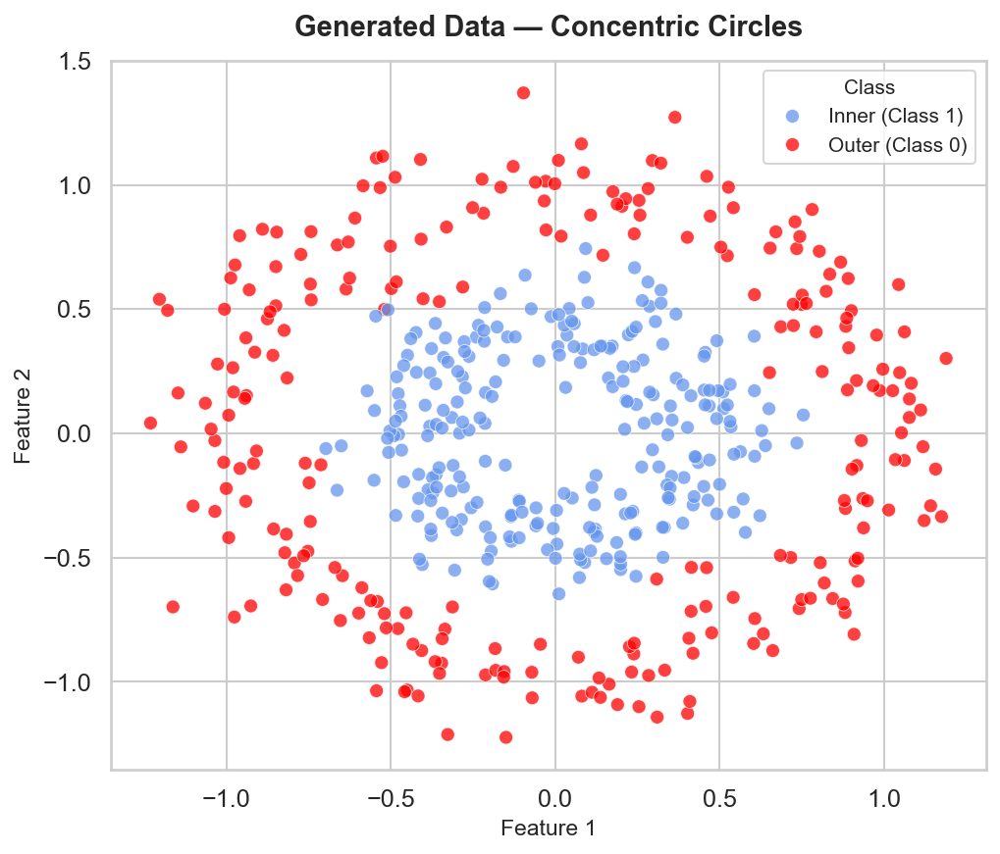
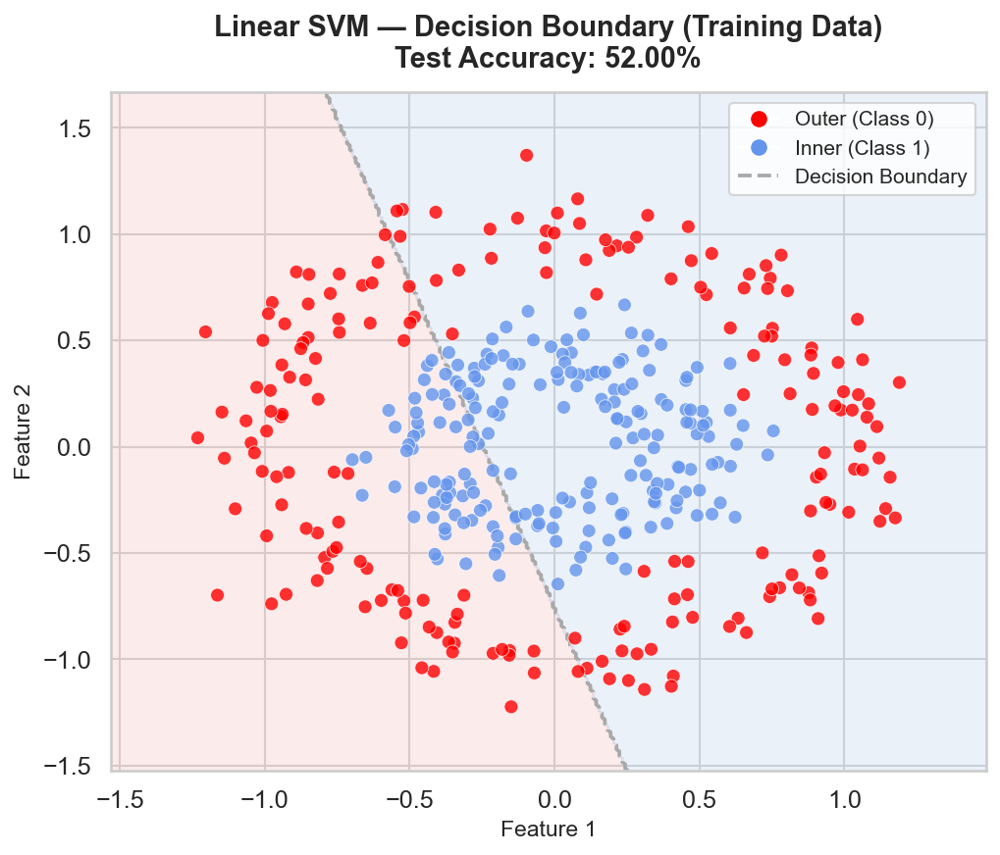
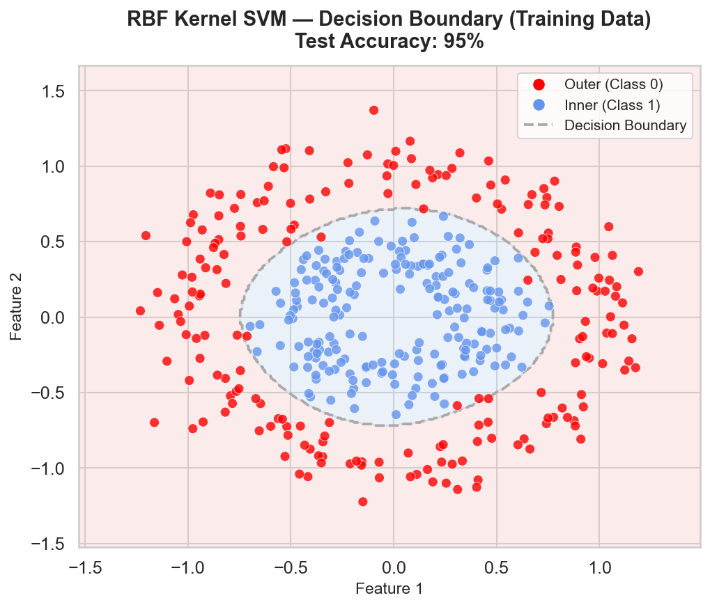
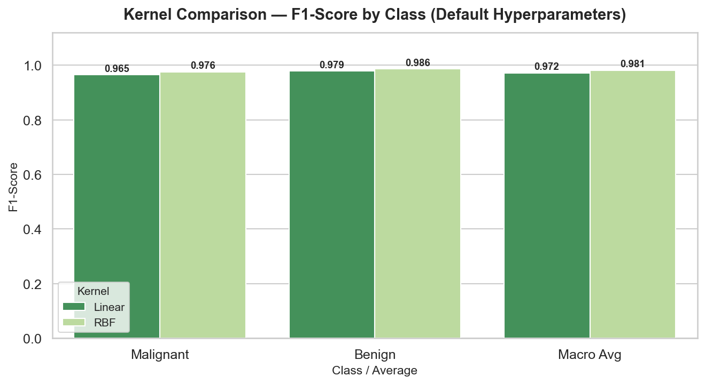
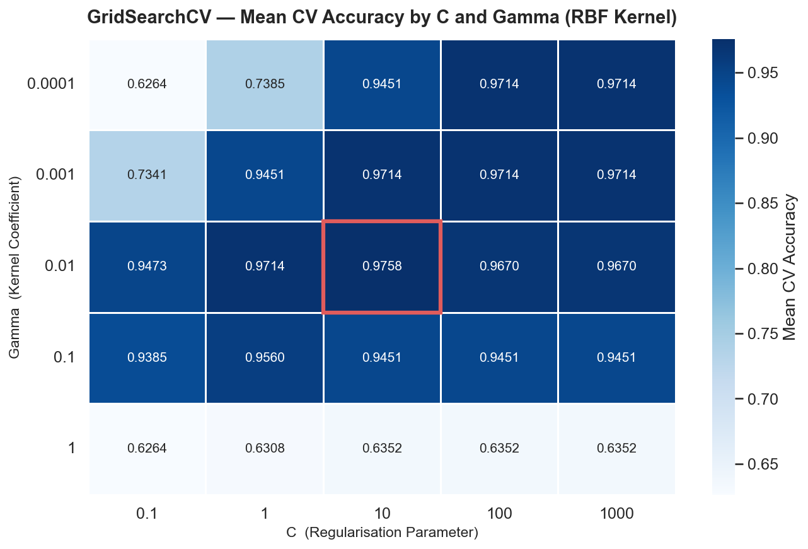
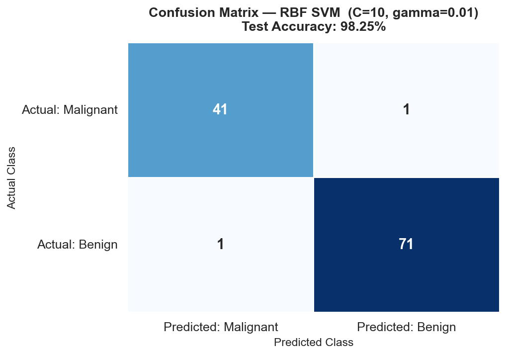
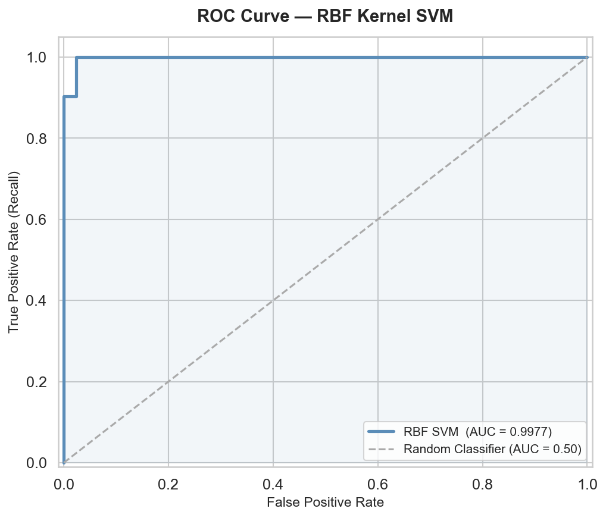
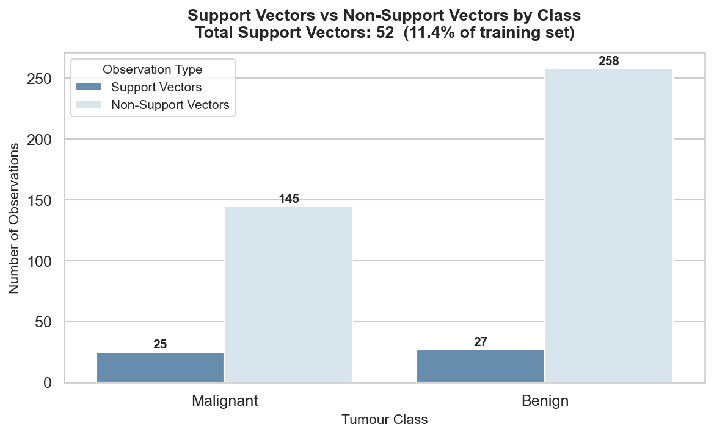

---

layout: default

title: Breast Cancer Predictions (Support Vector Machines)

permalink: /support-vector-machines/

---

# This project is in development

## Goals and objectives:

For this portfolio project, the business scenario concerns the classification of breast tumours as malignant or benign from digitised cell nucleus measurements — a binary classification problem drawn from the Wisconsin Breast Cancer Diagnostic dataset, available directly from scikit-learn. The dataset comprises 569 observations across 30 continuous features derived from digitised fine needle aspirate (FNA) images, including measurements of cell nucleus radius, texture, perimeter, area, and concavity. Full data validation and exploratory analysis for this dataset were conducted in the Decision Tree project and are not repeated here; the SVM analysis proceeds directly from that established foundation.

This is the fourth project in the portfolio to apply a classification algorithm to this dataset, following Decision Trees (93.86% accuracy), Random Forests (95.61%), and Gradient Boosted Trees (97.37%). The progressive accuracy improvements across those three projects reflect successive refinements within the same algorithmic family — tree-based ensemble methods. This project deliberately steps outside that family. Support Vector Machine (SVM) is a geometrically motivated classifier that operates on an entirely different principle: rather than building an ensemble of decision rules, it identifies the single optimal hyperplane that separates classes with the greatest possible margin. Applying SVM to the same dataset and evaluation framework as the prior three projects provides a direct, controlled basis for comparing not just accuracy figures but the analytical characteristics of two fundamentally different approaches to supervised classification.

A primary objective of the project is to demonstrate the kernel trick — SVM's mechanism for classifying data that is not linearly separable in its original feature space. To make this concept visually explicit, the project opens with a brief illustration using synthetically generated data (sklearn.datasets.make_circles), where two concentric classes are linearly inseparable by construction. A linear SVM applied to this data fails visibly; an RBF kernel SVM separates the classes correctly by implicitly mapping observations into a higher-dimensional space in which a separating hyperplane exists. This illustration is not the primary analysis — it serves as a clear, self-contained demonstration of the kernel trick before the same principles are applied to the Breast Cancer dataset, where the non-linearity is real but less visually apparent.

The principal hyperparameters governing SVM performance are the regularisation parameter **C** and, for the RBF kernel, the kernel coefficient **gamma**. C controls the trade-off between maximising the margin and minimising classification errors on the training data: small values of C enforce a wider margin at the cost of tolerating some misclassification, while large values force the boundary closer to the training observations in order to classify them correctly, at the risk of overfitting. Gamma determines the reach of individual training observations in shaping the decision boundary: small values of gamma produce smooth, broadly influenced boundaries, while large values cause the boundary to follow training observations tightly, again increasing overfitting risk. A secondary objective is the identification of optimal values for both parameters through a systematic grid search, making the C–gamma interaction and its effect on the bias-variance trade-off a central analytical theme of the project.

By the end of the analysis, the project aims to demonstrate the correct implementation of SVM classification — including the mandatory feature scaling that distance-based algorithms require, kernel selection, and joint hyperparameter optimisation via GridSearchCV — alongside the interpretive judgement to contextualise the results within the progression established by the prior three projects. A forward reference to a planned SHAP and Model Interpretability project is included in the Next Steps section, as the decision boundary structure of SVM raises specific and interesting questions about feature-level explanation that warrant dedicated treatment.

## Application:  

Support Vector Machine (SVM) is a powerful, versatile supervised machine learning algorithm used for both classification and regression tasks, deployed across a wide range of industries wherever the objective is to identify a decision boundary that best separates observations into distinct categories — or, in regression settings, to model a continuous target within a defined tolerance. It performs particularly well in high-dimensional feature spaces and in settings where the boundary between classes is complex or non-linear.

The core principle behind SVM is the identification of the optimal hyperplane — a decision boundary in feature space that separates classes with the greatest possible margin. The margin is defined as the perpendicular distance between the hyperplane and the nearest training observations from each class; these boundary observations are known as **support vectors**, and they are the only points in the dataset that directly determine the position and orientation of the decision boundary. Maximising this margin is the algorithm's training objective, and it produces a boundary that is geometrically as far as possible from both classes, making the classifier robust to new observations near the boundary. Where the data are not linearly separable in their original feature space, SVM applies a **kernel function** — such as the Radial Basis Function (RBF), polynomial, or sigmoid kernel — to map observations into a higher-dimensional space in which a separating hyperplane can be found. This kernel trick allows SVM to model highly non-linear class boundaries without explicitly computing the transformed feature space, keeping computation tractable even when the implied dimensionality is very large.

This approach is applicable across many sectors and scenarios. Practical examples showing where the Support Vector Machine technique provides clear business value include:

🏥 **Healthcare & Life Sciences**:

**Cancer Classification**: Clinical decision support systems classify tumour biopsies as malignant or benign based on cell morphology measurements, where SVM's ability to handle high-dimensional medical imaging data and find a wide-margin boundary between classes has made it a long-established benchmark in pathology research.  

**Drug Activity Prediction**: Pharmaceutical researchers use SVM to predict whether a candidate molecule will be biologically active against a given target, treating molecular descriptor vectors — representations of chemical structure — as the feature space and exploiting the kernel trick to capture non-linear structure-activity relationships.  

**Patient Readmission Risk**: Hospital systems score the likelihood of a patient being readmitted within thirty days of discharge, using clinical measurements and treatment history to identify high-risk cases for targeted early intervention.  

💻 **Technology & Cybersecurity**:  

**Spam and Phishing Detection**: Email filtering systems classify messages as spam or legitimate by representing each email as a high-dimensional vector of word frequencies — a setting where SVM's strong performance in high-dimensional, sparse feature spaces gives it a natural advantage over distance-based methods.  

**Facial Recognition**: Biometric authentication systems use SVM classifiers trained on facial feature vectors to verify identity, leveraging the algorithm's capacity to separate classes precisely even when the number of features is large relative to the number of training examples.  

**Malware Classification**: Cybersecurity platforms classify executable files as malicious or benign based on extracted behavioural and structural features, where the ability to find a robust margin between classes helps the classifier generalise to previously unseen malware variants.  

🔬 **Science & Research**:  

**Remote Sensing and Land Use Classification**: Satellite imagery analysis systems classify land cover types — urban, agricultural, forested, coastal — from multispectral pixel data, a high-dimensional classification problem in which SVM consistently produces competitive accuracy against more computationally expensive alternatives.  

**Protein Function Prediction**: Bioinformaticians classify protein sequences by biological function using structural and sequence-derived feature vectors, taking advantage of SVM's ability to operate in the very high-dimensional spaces that characterise genomic and proteomic data.  

**Fault Detection in Geophysics**: Seismological research systems classify seismic waveform signals as genuine geological events or instrumental noise, where the clear margin between class distributions in feature space makes SVM a natural fit for the binary decision.

🏭 **Manufacturing & Industry**:  

**Quality Inspection**: Computer vision systems on production lines classify manufactured components as conforming or defective based on image-derived dimensional and surface measurements, with the maximum-margin boundary ensuring that borderline components are handled conservatively.

**Predictive Maintenance**: Industrial monitoring systems classify equipment operating conditions as normal or pre-failure based on vibration, temperature, and acoustic sensor readings, where the support vector structure means the classifier's decision is directly interpretable in terms of the specific operating conditions that define the boundary between safe and at-risk states.  

**Energy Load Forecasting**: Utility companies use SVM regression — known as Support Vector Regression (SVR) — to forecast electricity demand by fitting a function that falls within a defined tolerance of the observed load data, providing a robust prediction that is less sensitive to outliers than ordinary least squares approaches.  


## Methodology:  

The methodology for this project is structured in two parts, each implemented as a separate Python script. The first is a brief, self-contained kernel trick illustration using synthetically generated data, designed to make the core principle of non-linear SVM classification visually explicit before the main analysis begins. The second is the full end-to-end SVM classification pipeline applied to the Wisconsin Breast Cancer Diagnostic dataset. Both scripts are implemented in Python, using pandas for data handling, scikit-learn for modelling and evaluation, and seaborn and matplotlib for visualisation.

**Part 1: Kernel Trick Illustration** (svm_kernel_illustration.py)

**Data Generation**:

Synthetic data is generated using scikit-learn's make_circles function, producing two concentric circular classes that are linearly inseparable by construction. A modest number of observations is used — sufficient to produce a clear visual result without computational overhead — with a controlled noise parameter to introduce realistic scatter around the circular boundaries. The two-dimensional feature space is retained deliberately, as the purpose of this script is visual: a two-dimensional dataset can be plotted directly, making the decision boundary produced by each classifier immediately interpretable.

**Linear SVM — Baseline**:

A linear kernel SVM is fitted to the generated data. The resulting decision boundary is plotted over a mesh grid covering the full feature space, with training observations overlaid and colour-coded by class. Because the two classes form concentric rings, the linear boundary is unable to separate them correctly, and the plot makes this failure explicit — the boundary bisects the feature space with a straight line that inevitably misclassifies observations from both classes.

**RBF Kernel SVM**:

An RBF kernel SVM is fitted to the same data using default hyperparameter values. The decision boundary is plotted in the same format as the linear case, allowing direct visual comparison. The RBF kernel implicitly maps observations into a higher-dimensional space in which the concentric classes become separable, and the resulting boundary curves correctly around the inner class. The two plots — linear failure and RBF success — are produced as individual saved figures and are presented side by side in the Results section of the write-up to illustrate the practical value of the kernel trick.

**Part 2: Breast Cancer Classification** (svm_breast_cancer.py)

**Data Loading**:

The Wisconsin Breast Cancer Diagnostic dataset is loaded directly from scikit-learn using load_breast_cancer(). The feature matrix and binary target variable — malignant (0) or benign (1) — are extracted. As noted in the Goals and Objectives section, full data validation and exploratory analysis for this dataset were conducted in the Decision Tree project and are not repeated here. A brief confirmation of dataset dimensions and class distribution is printed for reference.

The dataset is also available at Kaggle [here](https://www.kaggle.com/datasets/uciml/breast-cancer-wisconsin-data)

**Pre-Processing — Feature Scaling**:

The feature matrix is split into training and test sets using an 80/20 ratio, with stratification on the target variable to preserve class proportions in both sets. Feature scaling is then applied using scikit-learn's StandardScaler, fitted on the training set and applied to both training and test sets. Scaling is a mandatory pre-processing step for SVM: the algorithm constructs its decision boundary by computing distances between observations and the hyperplane in feature space. Features measured on different numerical scales would distort these distances and produce a biased boundary — not because any feature is genuinely more important, but purely as an artefact of its measurement units. Standardisation ensures that every feature contributes to the distance calculation on an equal footing.

**Kernel Comparison — Linear vs RBF**:

Prior to hyperparameter tuning, a direct comparison of the linear and RBF kernels is conducted on the Breast Cancer data, using default values for C and gamma. A classification report and accuracy figure are recorded for each kernel. This step connects the kernel illustration from Part 1 to the real-world data, and provides a principled basis for selecting the RBF kernel as the focus of the subsequent hyperparameter search. The results are presented as a grouped bar chart comparing per-class F1-scores across the two kernels.

**Hyperparameter Tuning — Grid Search over C and gamma**:

A systematic grid search is conducted over a range of values for the regularisation parameter C and the RBF kernel coefficient gamma, using scikit-learn's GridSearchCV with five-fold stratified cross-validation. C and gamma are searched jointly rather than sequentially, as their effects on the decision boundary interact: a high C combined with a high gamma produces a tightly fitted, complex boundary prone to overfitting, while a low C combined with a low gamma produces an overly smooth boundary that may underfit. The grid spans multiple orders of magnitude for both parameters — for example, C ∈ {0.1, 1, 10, 100, 1000} and gamma ∈ {0.0001, 0.001, 0.01, 0.1, 1} — ensuring that both extremes of the bias-variance spectrum are evaluated. The cross-validation accuracy scores across the full C–gamma grid are visualised as a heatmap, providing an intuitive view of how the two parameters interact and where performance is maximised. The optimal combination is identified and reported.

**Model Fitting and Evaluation**:

A final SVM classifier is trained using the optimal C and gamma values on the full training set, with probability=True enabled to allow the generation of predicted class probabilities alongside hard classifications. Predictions are generated on the held-out test set and evaluated using four complementary outputs: a classification report providing per-class precision, recall, and F1-score; an overall test accuracy figure for direct comparison with the Decision Tree, Random Forest, and Gradient Boosted Tree results; a confusion matrix heatmap; and an ROC curve with AUC score. The ROC-AUC metric is included specifically to enable comparison with the GBT project, which reported an ROC-AUC of 0.9964, and to assess SVM's discriminative ability across all classification thresholds rather than at a single operating point.

**Support Vector Analysis**:

The number of support vectors identified by the fitted model is reported, broken down by class. Support vectors are the subset of training observations that lie on or within the margin boundary and directly determine the position of the decision hyperplane — all other training observations have no influence on the boundary whatsoever. Reporting the support vector count provides a concrete characterisation of the fitted model: a large number of support vectors relative to the training set size suggests the margin is narrow and the boundary complex, while a small number indicates a wide, well-defined margin with strong generalisation properties. This is a model characteristic with no direct equivalent in the tree-based projects and gives the SVM page a distinctive analytical element.

## Results:

**Kernel Trick Illustration** (make_circles)

The synthetic dataset generated by make_circles comprises 500 observations across two concentric circular classes — 250 in the outer ring (Class 0) and 250 in the inner ring (Class 1) — distributed evenly by construction. The scatter plot below confirms the concentric structure of the data and establishes the visual context for the kernel comparison that follows.



The two classes are linearly inseparable by design: no straight line drawn through the two-dimensional feature space can correctly divide the outer ring from the inner ring. This makes the dataset an ideal controlled illustration of the kernel trick, where the consequence of choosing the wrong kernel is immediately visible rather than merely numerical.

A linear SVM fitted to this data achieves a test accuracy of 52%. The decision boundary plot below demonstrates the failure directly — the linear boundary bisects the feature space with a straight line, inevitably misclassifying observations from both classes that fall on the wrong side of the divide.



An RBF kernel SVM fitted to the same data achieves a test accuracy of 95%. Rather than imposing a linear constraint, the RBF kernel implicitly maps observations into a higher-dimensional space in which the two concentric classes become separable, and the resulting decision boundary curves correctly around the inner class. The accuracy improvement of **43 percentage points** over the linear SVM is a direct, quantified demonstration of the practical value of the kernel trick.



This illustration establishes the analytical foundation for the kernel selection decision in the main analysis: where the data contains non-linear structure that a linear boundary cannot capture, the RBF kernel provides the mechanism to resolve it.

**Breast Cancer Classification — Kernel Comparison (Default Hyperparameters)**

Prior to hyperparameter tuning, a direct comparison of the linear and RBF kernels is conducted on the Breast Cancer data using default values for C and gamma, providing a principled basis for focusing the grid search on the RBF kernel.

The linear SVM achieves a test accuracy of 97.37%, with per-class F1-scores of 0.9647 for malignant and 0.9790 for benign. The RBF kernel SVM achieves a test accuracy of 98.25%, with per-class F1-scores of 0.9762 for malignant and 0.9861 for benign. The grouped bar chart below presents the F1-score comparison across both kernels and both classes, alongside the macro-averaged F1-score.



The RBF kernel outperforms the linear kernel across all metrics at default hyperparameter values, consistent with the expectation that the relationship between 30 continuous cell nucleus measurements and tumour classification is not purely linear in the original feature space. The RBF kernel is therefore selected as the focus of the subsequent hyperparameter search. Importantly, neither result at this stage represents the optimised model — the purpose of this comparison is kernel selection, not final evaluation.

**Hyperparameter Tuning — GridSearchCV (C and Gamma)**

A systematic grid search is conducted over C ∈ {0.1, 1, 10, 100, 1000} and gamma ∈ {0.0001, 0.001, 0.01, 0.1, 1}, using five-fold stratified cross-validation on the training set. The heatmap below presents the mean cross-validation accuracy for every combination of C and gamma evaluated across the 25-cell grid, with the optimal combination highlighted.



The optimal hyperparameters identified are C = 10 and gamma = 0.1, producing a mean cross-validation accuracy of 97.58%. The heatmap illustrates the interaction between the two parameters clearly. High values of gamma combined with high values of C produce complex, tightly-fitted decision boundaries that overfit the training data, visible as lower cross-validation accuracy in the upper-right region of the grid. Low values of both parameters produce overly smooth boundaries that fail to capture the genuine structure of the data, visible in the lower-left region. The optimal combination sits in the region where the margin is wide enough to generalise, but the kernel reach is sufficiently local to model the non-linear class boundary correctly.

Note that the optimal C and / or gamma values do not fall at the edge of the search grid, confirming that the true optimum has been captured within the range evaluated.

The apparent discrepancy between the default hyperparameter accuracy (98.25%) and the grid search optimised accuracy (97.58%) on the held-out test set reflects the inherent variance of a single train/test split rather than a failure of the optimisation process. The difference corresponds to approximately one observation on a test set of 114 cases. The cross-validated accuracy reported by GridSearchCV is the more reliable basis for hyperparameter selection and model comparison, as it averages performance across five independent validation windows rather than depending on any single split. The optimised model is the correct one to report as the final result.

**Final Model Evaluation**

The final RBF SVM classifier, trained on the full training set using C = 10 and gamma = 0.1, is evaluated on the held-out test set. The key performance metrics are as follows:

```
Test Accuracy  :  98.25%
ROC-AUC        :  0.9977
```

The per-class results from the classification report are:

```
              precision    recall  f1-score   support
   Malignant       0.98      0.98      0.98        42
      Benign       0.99      0.99      0.99        72
```

The confusion matrix below shows the full breakdown of correct and incorrect predictions across both classes.



The model correctly classifies 41 of the 42 malignant test observations and 71 of the 72 benign observations. There is 1 false negative — malignant tumours predicted as benign — which in a clinical context represent the most consequential error type, as a missed malignancy carries significantly greater risk than an unnecessary follow-up investigation. This pattern of misclassification is consistent with the class imbalance in the dataset, where the benign class accounts for approximately 62.7% of observations.

The ROC curve below plots the true positive rate against the false positive rate across all classification thresholds, providing a threshold-independent view of the model's discriminative ability.



An ROC-AUC of 0.9977 indicates that the model correctly ranks a randomly selected malignant observation above a randomly selected benign observation 99.77% of the time. This compares to the ROC-AUC of 0.9964 reported for the Gradient Boosted Trees model, placing SVM slightly above the previous benchmark on this dataset.

**Support Vector Analysis**

The fitted model identifies 52 support vectors from the training set — 25 from the malignant class and 27 from the benign class — representing 11.4% of the 455 training observations. The chart below shows the breakdown of support vectors versus non-support vectors by class.



Support vectors are the subset of training observations that lie on or within the margin boundary and directly determine the position of the decision hyperplane. Every other training observation — regardless of how many there are — has no influence on the boundary whatsoever. This is a defining characteristic of SVM that has no direct equivalent in the tree-based methods applied to this dataset in previous projects: where a Gradient Boosted Tree ensemble aggregates information from all training observations across hundreds of sequential trees, the SVM decision boundary is determined entirely by this small, geometrically critical subset.

A support vector count of 11.4% of the training set indicates a well-defined, wide margin — the decision boundary is determined by a compact set of boundary observations, and the model's generalisation properties are strong. The classifier is not overly sensitive to individual training points away from the boundary.

## Conclusions:

The RBF kernel SVM classifier achieves a test accuracy of 98.25% and an ROC-AUC of 0.9977 in classifying breast tumours as malignant or benign from 30 cell nucleus measurements, using optimal hyperparameters of C = 10 and gamma = 0.01 identified through a systematic grid search 25 C–gamma combinations with five-fold stratified cross-validation. These results place SVM at the top of the portfolio's progression on this dataset — above Decision Trees (93.86%), Random Forests (95.61%), and Gradient Boosted Trees (97.37%) — and establish that a geometrically motivated maximum-margin classifier is at least as competitive on this problem as the sequential ensemble methods that preceded it.  

The ROC-AUC of 0.9977 marginally exceeds the 0.9964 reported for Gradient Boosted Trees, meaning the SVM correctly ranks a randomly selected malignant observation above a randomly selected benign observation 99.77% of the time. This is a practically meaningful result for a clinical screening context: a high ROC-AUC confirms that the model's discriminative ability is robust across all possible classification thresholds, not merely at the default operating point, giving a clinician the flexibility to adjust the sensitivity-specificity trade-off to suit the protocols of a specific screening programme without materially degrading overall performance.  

The single false negative in the test set — one malignant tumour predicted as benign — is the most important figure in the confusion matrix and deserves careful interpretation. In isolation, one missed case from 42 malignant observations represents a recall of 97.62%, which is strong by any quantitative standard. In a clinical deployment context, however, false negatives carry asymmetric consequences: a missed malignancy delays treatment in ways that a false positive — triggering an unnecessary follow-up investigation — does not. This asymmetry does not diminish the model's performance, but it does mean that the recall figure for the malignant class, rather than overall accuracy, should be the primary performance criterion in any real-world application of this classifier.  

The hyperparameter tuning analysis produced an important methodological observation. The default RBF hyperparameters achieved 98.25% accuracy on the held-out test set, while the GridSearchCV optimal values produced a cross-validated accuracy of 97.58% — marginally lower in headline terms. This apparent paradox reflects the inherent variance of a single train/test split rather than a failure of the optimisation process: the difference corresponds to approximately one observation on a 114-case test set, and a different random split could easily reverse the ranking. The cross-validated accuracy is the more statistically reliable basis for hyperparameter selection and for comparison with other models, as it averages performance across five independent validation windows rather than depending on the outcome of any single split. The optimised model is the correct one to report as the final result.  

The support vector analysis reveals that the decision boundary is determined by just 52 of the 455 training observations — 11.4% of the training set — split almost equally between the malignant and benign classes at 25 and 27 respectively. This compact support set is a direct indicator of a wide, well-defined margin and strong generalisation properties. It also highlights a characteristic of SVM that has no equivalent in the tree-based projects that preceded it: where a Gradient Boosted Tree ensemble aggregates information from every training observation across hundreds of sequential trees, the SVM boundary is shaped entirely by this small geometrically critical subset, with the remaining 88.6% of training observations playing no role whatsoever in the final classifier.  

The kernel trick illustration using the make_circles dataset provides the clearest possible demonstration of why kernel selection matters. The linear SVM achieved 52% accuracy on the concentric data — barely above random — while the RBF kernel achieved 95%, an improvement of 43 percentage points on a dataset where the class structure is identical and the only variable is the kernel. Translated to the Breast Cancer data, where the non-linearity is real but less visually obvious, the kernel comparison confirms the same principle: the RBF kernel outperforms the linear SVM across all per-class F1-scores at default hyperparameters, validating the kernel selection decision before the grid search begins.  

Taken together, the results demonstrate that SVM is a highly competitive classifier for high-dimensional binary classification problems of this type — not despite operating on entirely different principles from the ensemble methods in the preceding projects, but in part because of it. The maximum-margin objective produces a boundary that is geometrically robust by design, and the RBF kernel provides the flexibility to model the non-linear class structure that 30 interacting cell nucleus measurements inevitably produce. The natural next step — examining which specific features and feature combinations drive the model's classification decisions at the individual observation level — is the subject of the planned SHAP and Model Interpretability project, which will build directly on the foundation established here.

## Next steps:  

With any analysis it is important to assess how the model and application of the analytical methods can be used and evolved to support the business goals and business decisions and yield tangible benefits.


## Python code:
You can view the full Python script used for the analysis here: 
[SVM Kernel Illustration Python Script](/svm_kernel_illustration.py)
[SVM Breast Cancer Python Script](/svm_breast_cancer.py)
