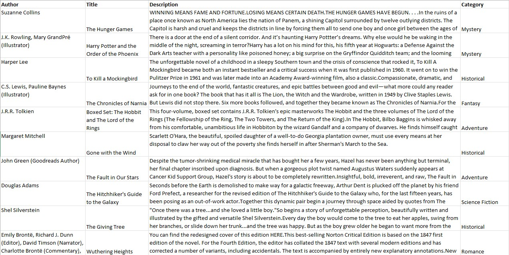
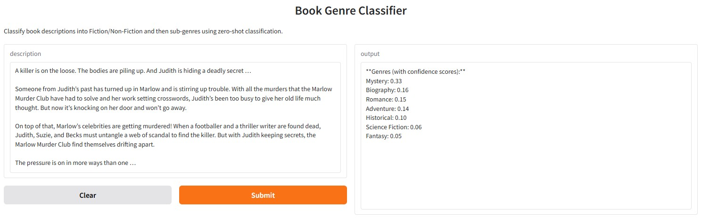

---

layout: default

title: Books genre classification (Zero-Shot Classification)

permalink: /zero-shot-classification/

---

## Goals and objectives:

A book store wishes to categorise each book in its inventory to support the physical layout of the store and also enable a better customer experience on their website.  The categories are:  Science Fiction, Romance, Mystery, Adventure, Fantasy, Historical, and Biography.  It also wishes to understand if it is possible to classify books as fiction or non-fiction based on the description, and if the target audience can similarly be identified (children, young adults, or adults).

As well as classifying the current inventory of books, the book store wishes to build a simple app where a user can add a description and a category is generated.

A simple classification model was built using zero-shot classification utilising a publicly available model from Hugging Face (facebook/bart-large-mnli).

The model returned the most probable category for each book, with a high accuracy as determined from human validation, to a quality meeting the original business goal.

However, it was determined that the model was not good at predicting if books are fiction or non-fiction from the description alone, based on human validation of the classifications.  As such this level of classification was not included in the model.  Based on the description alone it is logical that it the model cannot determine if the content is based on true events or fictional events.

Similarly, the research to apply classifications for the target audience produced results that weren't accurate.  The classifications are based on the content of the books including children, young adults or adults, rather than them being the target audience.

## Application:  

Zero-shot classification models allow AI systems to categorize inputs—such as text, images, or data—into classes they have never been trained on by leveraging a pre-existing understanding of language and context. This capability is vital for tasks involving new, rare, or evolving categories, eliminating the need for expensive and time-consuming manual data labelling and model retraining.  Examples of applications include:

* Financial institutions automatically classifying a company into its correct industry or sector (e.g., using Global Industry Classification Standard (GICS) categories) based on its textual description, annual reports, or business activities.
* Categorizing incoming customer emails, support tickets, or regulatory filings into specific processing queues (e.g., "new loan application," "compliance inquiry," "account dispute") based on the text, even for a new type of complaint or query that was just introduced.
* Sorting customer feedback or product reviews into specific, potentially new categories like "app performance bug," "delivery service issue," or "sustainable packaging concern" without needing a pre-labelled dataset for the new category.
* Automatically categorizing unstructured text data from maintenance logs or sensor alerts (e.g., "abnormal vibration detected in CNC machine axle") into specific maintenance tasks or severity levels.
* Classifying new, zero-day malware or previously unknown phishing email patterns based on their behavioural attributes or content. The model classifies the threat by comparing its features to a semantic description of known threat families.

## Methodology:  

A workflow in Python was developed using libraries Pandas, Numpy and Transformers, connecting to a zero-shot classification model in Hugging Face.  The main test used the model 'facebook/bart-large-mnli', with tests also run using 'roberta-large-mnli'.

The set of books and descriptions in the current inventory were applied to the classification model to produce the most likely category, based solely on the description.

A web app was developed using Gradio allowing a user to insert a book description and the app will use the Zero-Shot Classification model to generate the scores of the most likely category, where it lists the score for each of the 7 possible categories.

Data preparation:  The original data was used without any text cleansing and preprocessing. 

## Results and conclusions:

### Descriptive Statistics:

There are 244 observations recorded, covering a period of 4 consecutive days.

The mean tip is 2.998, with a standard deviation of 1.384 (currency is ignored in this example for simplicity)

### Conclusions:

Lets address the conclusions in relation to our research question:  Can we predict restaurant tips based on bill value, party size, and time?

Model Performance:
* The model works reasonably well for a simple dataset (47.7% of variance explained)
* The average prediction error is 0.67
roberta-large-mnli

## Next steps:  

With any analysis it is important to assess how the model and data collection can be improved to better support the business goals.

Recommendations include:
* Collect additional features (e.g., day of week, server ID, meal type, customer satisfaction)
* Address the moderate multicollinearity identified in the variables

## Python code:
You can view the full Python script used for the analysis here: 
[View the Python Script](/Zero_Shot_Classification_Books.py)
[View the Python Script for Gradio application](/Zero_Shot_Classification_Books_Gradio.py)

